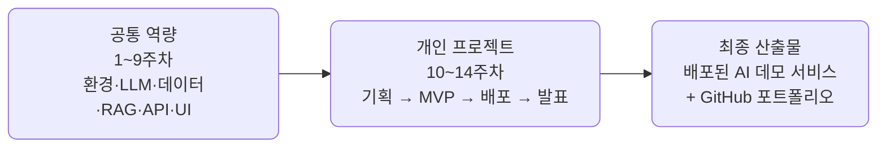

# AI 서비스 엔지니어링: Track A

공통 선행 VOD([ai_service_engineering](https://github.com/CodeCompose7/ai_service_engineering))의 확장 과정으로, 공통 기술 스택을 단계적으로 익힌 뒤 **개인별 배포 가능한 오픈소스 기반 AI 데모 서비스**를 완성하는 14회차 실습 트랙의 강의 자료 및 예제 코드 저장소입니다.

강의 사이트: <https://2026-ai-service-engineering-a.github.io/ai_service_engineering-track_a/>

## 개요

- 대상: AI 서비스 경험이 적거나 단계적 실습이 필요한 참가자
- 운영 방식: 공통 기술 스택을 먼저 익힌 뒤(1\~9주차) 후반부 개인 프로젝트 수행(10\~14주차)
- 과정 지원: 과정 중간에도 Discord를 통한 프로젝트 문의·멘토링 진행 가능
- 강점: 학습 편차 완화, 기초 역량 정렬, 완주율 확보
- 리스크 관리: 템플릿·예제 기반 실습으로 프로젝트 완성도 확보
- 공통 목표: 개인별 배포 가능한 오픈소스 기반 AI 데모 서비스 완성

## 과정 구조

전반부에 모두가 같은 기술 스택을 실습으로 정렬하고, 후반부에 각자 선택한 트랙으로 개인 프로젝트를 완주합니다.



## 주차별 운영안

### 1\~9주: 공통 역량 구간

| 주차 | 주제 | 세션 실습 포커스 | 산출물 |
| --- | --- | --- | --- |
| 1 | AI 서비스 전주기 이해 | 과정 조망, 엔지니어링 사다리, 프로젝트 트랙 소개, 개인 repo 개설 | 학습 목표 + 개인 repo |
| 2 | Python AI 개발환경 | 컨테이너 기반 개발환경 구동, uv/pip, GitHub 워크플로, Codex/Claude 활용 세팅 | 동작하는 개발 환경 |
| 3 | LLM API와 프롬프트 | LiteLLM 멀티 프로바이더 호출, 프롬프트 패턴, structured output(instructor) | LLM 호출 실습 코드 |
| 4 | 데이터 수집·정제와 RAG 검색 | 30만 건 정제, PostgreSQL 검색, 구글 임베딩 벡터 인덱스와 질의응답 | 정제 데이터셋 + RAG 검색 서비스 |
| 5 | API 해부와 tool calling | LLM API의 바닥, LiteLLM 통합 레이어, 도구 스키마·검증 (예제 31종) | 도구를 든 에이전트 (v0.2) |
| 6 | 에이전트 루프와 하네스 | ReAct와 고급 루프, 인젝션 방어·budget guard, MCP (예제 24종) | 완성된 에이전트 (v1.0) |
| 7 | 자동화·분석·추천 패턴 | 트랙별 미니 실습 (에이전트/분석/추천·분류), 트랙 가결정 | 트랙별 실습 + 트랙 가결정 |
| 8 | FastAPI 서비스화 | AI 기능 API화, 입력 검증·에러 처리·스트리밍 | AI API 서버 |
| 9 | 자유 UI 구현 | Streamlit / Gradio / Next.js / Swagger UI 선택 (라이브 브리핑 제공) | 웹 데모 초안 |

### 10\~14주: 개인 프로젝트 구간

| 주차 | 주제 | 세션 포커스 | 산출물 |
| --- | --- | --- | --- |
| 10 | 개인 프로젝트 기획 | 문제 정의, MVP 범위, 데이터·스택 선정, **기획 리뷰 통과** | 프로젝트 기획서 |
| 11 | 프로젝트 MVP 개발 | 핵심 AI 기능 + API/UI 연결, **배포 파이프라인 사전 개통** | 동작 MVP + 1차 배포 |
| 12 | 배포·평가·개선 | 무료 클라우드 배포 안정화, 테스트셋·품질 개선 로그 | 데모 URL + 평가 로그 |
| 13 | 문서화·OSS 정리 | README·아키텍처·라이선스, 오픈소스 기여 시도 | GitHub 포트폴리오 + 기여 기록 |
| 14 | 최종 발표 | 데모·회고·직무 전환 포인트, AI 도구 보조 구분 설명 | 최종 산출물 |

## 프로젝트 트랙

10주차부터 아래 다섯 트랙 중 하나를 선택하거나 자유 주제로 개인 프로젝트를 진행합니다. 7주차의 트랙별 미니 실습에서 각 트랙을 미리 체험하고 방향을 확정합니다.

| 트랙 | 예시 프로젝트 | 주요 오픈소스 스택 |
| --- | --- | --- |
| 문서 기반 RAG | 정책/기술문서 Q&A, FAQ 챗봇, 회의록 검색 | LlamaIndex, LangChain, Chroma, Qdrant |
| 업무 자동화 | 회의록 요약, 이메일/이슈 분류, 보고서 초안 생성 | LangGraph, n8n, FastAPI |
| 데이터 분석 | CSV 업로드 후 자연어 질의, 리포트 자동 생성 | pandas, DuckDB, Plotly, LLM API |
| 추천/분류 | 채용공고 매칭, 콘텐츠 추천, 고객문의 분류 | scikit-learn, sentence-transformers |
| 개발자 도구 | 코드리뷰 보조, README 생성, GitHub 이슈 요약 | GitHub API, FastAPI, LLM |

## 오픈소스 적용 방식

이 과정은 전 회차에 걸쳐 오픈소스 기반으로 구성됩니다.

| 구분 | 과정 내 적용 방식 |
| --- | --- |
| 오픈소스 AI 모델 활용 | Hugging Face 모델, sentence-transformers, BGE/E5 계열 임베딩 모델, Ollama 기반 로컬 모델 등 공개 모델 또는 로컬 실행 가능한 모델 활용 |
| 오픈소스 프레임워크 활용 | LlamaIndex, LangChain, LangGraph, FastAPI, Streamlit, Gradio, pandas, scikit-learn, DuckDB 등으로 데이터 처리·검색·추론 연동·API·UI 구현 |
| 오픈소스 인프라 구성요소 활용 | Chroma, Qdrant, pgvector 등 벡터DB와 Docker 기반 재현 환경을 활용하여 AI 서비스 구성요소를 직접 조합 |
| 오픈소스 개발 방식 경험 | GitHub 저장소, README, 실행 방법, 아키텍처, 의존성 목록, 데이터 출처, 라이선스 정보를 공개 가능한 형태로 문서화 |
| 커뮤니티 상호작용 | 필수는 아니지만 이슈 작성, 문서 개선, 버그 리포트, 예제 개선 PR 등은 가산점으로 인정 |

## 선행 과정

이 트랙은 공통 선행 VOD를 수강했다는 전제로 진행합니다. VOD에서 다룬 개념(멀티 프로바이더 LLM 호출, 구조화 출력, RAG 코어, 에이전트, 서빙)을 실습 중심으로 다시 다지며, 개인 프로젝트까지 확장합니다.

- 공통 선행 VOD 저장소: [ai_service_engineering](https://github.com/CodeCompose7/ai_service_engineering)

## 선행학습 권장 사항

- Python 기초~중급 (함수/클래스, 패키지 설치·가상환경)
- Git / GitHub 기본 사용 경험
- HTTP / REST API · JSON 이해
- LLM API key 발급 (무료 티어 권장)

## 저장소 구조

```plaintext
ai_service_engineering-track_a/
├── site/                    # 강의 사이트 (stack-site-builder 기반 Astro) — 강의·슬라이드·글·개념·용어집
├── docs/                    # 규칙 문서(작성·문서화·git) + 회차별 강의 문서·실습 가이드 (추가 예정)
├── scripts/                 # 저장소 스크립트 (문서 스타일 검사 등)
├── .github/workflows/       # GitHub Actions (main push 시 사이트 배포)
├── src/                     # 회차별 예제 코드 (추가 예정)
├── tests/                   # 단위 테스트 (추가 예정)
├── pyproject.toml           # uv 기반 의존성 (추가 예정)
├── docker-compose.yml       # 사이트 실행 (보기 전용, 소스 내장)
├── docker-compose.dev.yml   # 사이트 실행 (site/ 바인드 마운트 + 핫리로드)
├── CLAUDE.md                # AI 도구용 저장소 가이드
├── CHANGELOG.md             # 릴리스 변경 기록
└── README.md
```

> 회차별 예제 코드·강의 문서·개발 환경 설정은 커리큘럼 진행에 맞춰 추가됩니다.

## 강의 사이트 실행

강의 자료·슬라이드 사이트(`site/`)는 Docker만 있으면 저장소 루트에서 바로 띄울 수 있습니다.

```sh
docker compose up      # 사이트 가동 — http://localhost:4321/ai_service_engineering-track_a/
docker compose down    # 중지·정리
```

GitHub Pages 프로젝트 사이트로 공개되므로 로컬에서도 루트 `/`가 아니라 저장소
이름 경로 아래에서 열립니다.

콘텐츠를 수정하면서 보려면 `docker compose -f docker-compose.yml -f docker-compose.dev.yml up`을
사용하세요. `site/`를 바인드 마운트해 핫리로드로 반영됩니다. 로컬 pnpm 개발 등
자세한 내용은 [site/README.md](site/README.md)를, 배포는
[docs/deployment.md](docs/deployment.md)를 참고하세요.

## License

강의 자료의 라이선스는 추후 명시 예정입니다.
