# 1주차 교안 — AI 서비스 전주기 이해와 첫 에이전트 (상세판)

> A반(교육 선행형) 1주차 라이브 세션 교안이다. 세션은 2시간, 멘토 시연 중심으로
> 진행한다. 수강생이 세션 중 직접 손을 움직이는 구간은 개인 repo 개설 실습뿐이다.
> 시연 코드·지시 프롬프트·영상은 세션 후 전부 공개하여, 수강생이 각자의 속도로
> 재현할 수 있는 비동기 환경을 만든다. 본 문서는 슬라이드 제작의 원본으로 사용한다.

- **주제**: AI 서비스 전주기 이해
- **세션 포커스**: 과정 조망, 엔지니어링 사다리, 프로젝트 트랙 소개, 개인 repo 개설
- **산출물**: 학습 목표 + 개인 repo
- **시연 저장소**: <https://github.com/2026-ai-service-engineering-a/week01-order-agent>
- **운영 방식**: 멘토 시연 → 코드·프롬프트 공개 → 영상 아카이브 (코드 따라 쓰기 없음)

---

## 1. 세션 목표

수강생이 세션 종료 시점에 다음을 얻는다.

- AI 서비스가 5개 레이어(Agents / AI Platform / Models / Data / AI Infrastructure) 위에서 어떻게 실행되는지에 대한 지도
- 엔지니어링 사다리(프롬프트 → 컨텍스트 → 하네스)가 14주 커리큘럼의 순서인 이유
- "이 시대에 에이전트를 만드는 방식" — AI 코딩 도구에 요구사항을 지시하고, 생성물을 검증·수정하는 사이클을 직접 목격
- 5개 프로젝트 트랙이 "같은 구조에서 무엇을 갈아끼우는가"의 차이라는 감각
- 개인 GitHub repo (학습 목표 작성 완료)

**1주차 시연의 성격.** 수강생은 아직 VOD S1도 보지 않은 상태다. 따라서 시연의
목적은 코드 이해가 아니라, "14주 뒤 내가 만들 것의 축소판"과 "그것을 만드는
방식"을 눈으로 확인하는 것이다. 코드 한 줄 한 줄이 아니라 구조와 사이클이
남으면 성공이다.

---

## 2. 타임라인 (2시간)

| 구간 | 시간 | 내용 |
| --- | --- | --- |
| 오리엔테이션 | 10분 | 과정 목표, 14주 구조, 운영 방식 안내 |
| 전주기 조망 | 25분 | 5레이어 일반 버전 → 실행 흐름 트레이스 → 과정 스택 오버레이 |
| 엔지니어링 사다리 | 15분 | 3단 개념 + 커리큘럼 매핑 |
| 라이브 빌드: 주문 에이전트 | 35분 | v0.1 투어 → 지시 프롬프트 → 생성 관찰 → 리뷰·실행·수정 → v1.0 |
| 프로젝트 트랙 소개 | 15분 | 방금 만든 에이전트에서 "무엇을 갈아끼우면" 5개 트랙이 되는지 |
| 개인 repo 개설 실습 | 15분 | GitHub 계정·개인 레포 생성, README 학습 목표 작성 |
| 마무리 | 5분 | 2주차 VOD 시청 범위 안내, 코드·영상 공유 위치 안내 |

---

## 3. 오리엔테이션 (10분)

### 3-1. 과정 목표

개인별 배포 가능한 오픈소스 기반 AI 데모 서비스 1개 완성.

- 공개 데모 URL
- GitHub 포트폴리오 (README·아키텍처·라이선스 문서화)
- 최종 발표 (직무 전환 포인트 정리)

### 3-2. 14주 구조

- 1\~9주: 공통 역량 구간 — 템플릿 기반 실습, 전원 동일 산출물
- 10\~14주: 개인 프로젝트 구간 — 기획 → MVP → 배포 → 문서화 → 발표

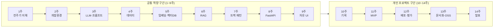

전달 포인트: **매주 템플릿 형식의 실습이 제공된다.** 3주차 LLM 호출, 6주차 미니
RAG, 8주차 API 서버 등 주차별 템플릿은 그대로 개인 프로젝트의 부품으로 재조립할
수 있고, 원한다면 템플릿과 별개로 자기 방식대로 프로젝트를 진행해도 된다.
템플릿은 출발점이지 제약이 아니다.

### 3-3. 운영 방식

- 라이브 세션 = 멘토 시연 + 코칭. 코드 따라 쓰기 없음
- 매주 시연 코드·지시 프롬프트·영상을 공개 — 수강생은 각자 속도로 재현
- VOD = 지식 전달, 라이브 = 만드는 과정과 판단을 보는 시간

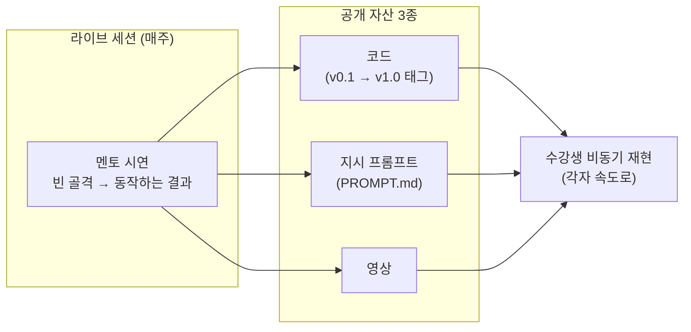

**개인 프로젝트 계획은 백그라운드로 병행된다**

- 프로젝트는 10주차에 시작하는 것이 아니다 — 1주차부터 각자 "무엇을 만들지"에 대한 계획 세우기가 백그라운드 과제로 깔린다
- 매주 실습·시연을 보며 "내 프로젝트라면 이 부품을 어떻게 쓸까"를 계속 생각하게 유도
- 트랙 가결정(7주차) → 기획 확정(10주차)은 이 백그라운드 사고의 체크포인트일 뿐

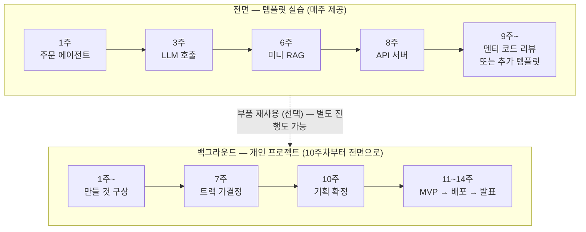

- 점선의 의미: 템플릿 부품의 재사용은 **선택**이다 — 그대로 재조립해도 되고, 별도로 진행해도 됨
- 두 레인은 10주차에 자리를 바꾼다 — 템플릿 실습이 배경으로 물러나고, 백그라운드에서 자라던 개인 프로젝트가 전면으로 나옴

**질문은 디스코드로 상시 열려 있다**

- 라이브 세션 사이의 질문은 디스코드에서 계속할 수 있다 — 세션까지 기다릴 필요 없음
- 용도 예시
  - 시연 재현 중 막히는 지점
  - 개인 프로젝트 구상·트랙 선택 관련 논의
  - 환경 문제 (devcontainer, 키 발급 등)

**9주차부터 시연의 성격이 바뀔 수 있다**

- 멘티가 동의하는 경우: 멘티 코드를 기반으로 한 리뷰 형식으로 전환 — 실제 진행 중인 프로젝트 코드를 함께 보며 구조·개선점을 짚는 시간
- 코드·프로젝트 공개에 동의하지 않는 경우: 별도의 템플릿 에이전트를 추가로 만들어 시연 제공 — 공개 자산(코드·프롬프트·영상) 파이프라인은 동일하게 유지
- 어느 쪽이든 멘티의 선택이며, 공개는 권장 사항이지 요건이 아님

기타 안내:

- 시연·재현 전반에 걸친 AI 도구 활용 원칙 예고: "직접 판단한 부분과 AI가 보조한 부분을 구분한다" — 오늘 멘토가 그 구분을 시연으로 먼저 보여준다

### 3-4. 운영 안내 — 요일·저장소·모임

**강의 요일·시간 (조율 예정)**

- 모든 세션은 녹화본이 제공된다 — 실시간 참석이 어려워도 학습에 지장 없음
- 현재 토요일로 잡혀 있으나, 다음 두 후보 중 하나로 조정을 제안
  - 목요일 저녁
  - 토요일 오후 2시
- 1주차에 수강생 의견을 들어 확정

**GitHub 조직과 개인 저장소**

- 조직 `2026-ai-service-engineering-a`는 **멘토 코드를 공유하기 위한 공간**이다 (주차별 시연 레포)
- 수강생 저장소는 **개인 계정에 만드는 것을 권장** — 과정이 끝나도 포트폴리오로 개인이 가져가는 것이므로
- 조직 안에 만들어도 무방하다 — 강제 사항 아님
- 개인 저장소에 대한 코칭도 가능하다. 다만 프로젝트 제출의 경우 오픈소스가
  되어야 하므로, 일부를 오픈소스로 분리해서 제작하거나, 아니면 별도의 내용을
  오픈소스로 만들기를 권장한다

**월 1회 오프라인 모임**

- 강의 요일과 겹치지 않게 배치
  - 강의가 평일이면 → 오프라인은 토요일
  - 강의가 토요일이면 → 오프라인은 평일 저녁 (목요일 또는 금요일)
- 참석은 자유 — 불참해도 불이익 없음

---

## 4. 전주기 조망 (25분)

같은 5레이어 다이어그램을 두 번 보여준다. 1차는 업계 일반 버전, 2차는 우리 과정
스택을 오버레이한 버전. 이 그림이 이후 9주의 좌표계가 되며, 매주 브리핑 첫
슬라이드에서 "오늘은 이 칸"을 하이라이트한다.

### 4-1. 일반 버전 — 각 레이어의 책임

| 레이어 | 책임 | 대표 예시 |
| --- | --- | --- |
| Agents | 제어 루프 — 무엇을 할지 판단하고 도구를 부름 | self managed / vendor managed |
| AI Platform | 모델 접근·라우팅·인증·관측 | Vertex AI, AI Studio, MCP 서버 |
| Models | 실제 추론 | Gemini, Claude, GPT, Llama, DeepSeek |
| Data | 모델이 볼 재료 공급 — retrieval, 스토리지 | BigQuery, S3, Drive, Slack |
| AI Infrastructure | 연산이 실제로 도는 곳 | GPU/CPU, GKE, Compute |

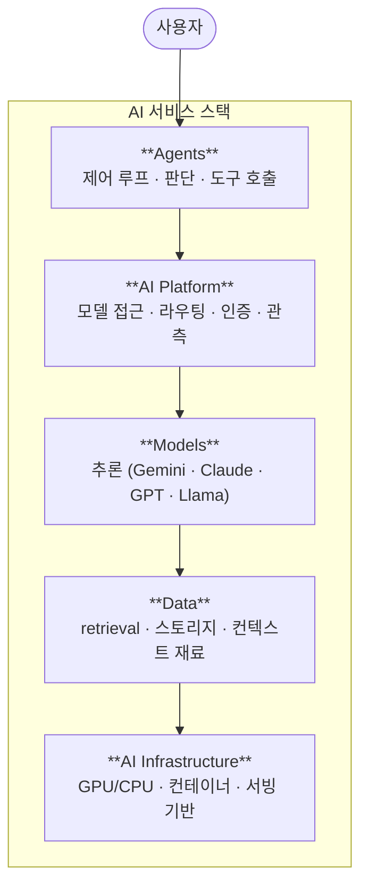

### 4-2. 실행 흐름 트레이스 — 요청 하나가 스택을 타고 내려간다

정적인 층 그림만으로는 "왜 다 필요한지"가 안 보인다. 질문 하나가 실제로 어떻게
흐르는지 시퀀스로 트레이스한다.

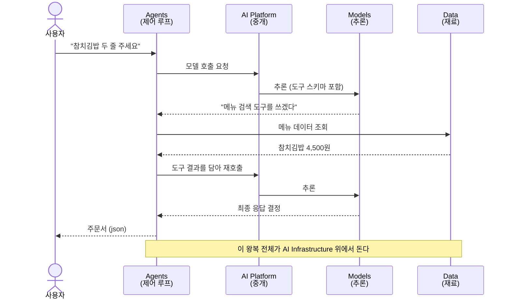

핵심 메시지: **"에이전트는 모델이 아니라 이 스택 전체를 조립한 시스템이다."**
모델은 한 층일 뿐이고, 우리가 배우는 것은 나머지 층을 조립하는 기술이다.

### 4-3. 과정 스택 오버레이 — 우리는 이 그림을 오픈소스로 짓는다

같은 그림에 14주 동안 쓸 스택을 대응시킨다.

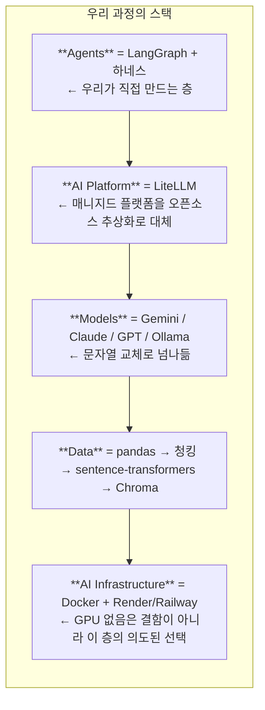

레이어별 부연:

- **Agents가 본체다** — 이 과정의 차별점은 이 층을 직접 설계·구현한다는 것. 나머지 층은 오픈소스 부품을 고르고 조립함
- **LiteLLM이 Platform 역할** — Vertex 같은 매니지드 플랫폼이 해주는 "여러 모델을 한 인터페이스로"를 오픈소스 라이브러리 하나로 얻음
- **Models는 갈아끼우는 소모품** — 특정 모델에 종속되지 않는 것이 설계 원칙 (프로바이더 독립)
- **GPU 없음의 의미** — 추론은 API로, 임베딩은 CPU로. Infrastructure 층에서 "빌리는 것"과 "직접 드는 것"을 구분하는 판단 자체가 엔지니어링

### 4-4. 주차별 좌표 예고

이 그림이 9주의 지도가 된다.

| 주차 | 채우는 칸 |
| --- | --- |
| 2주 | Infrastructure (devcontainer, 개발 환경) |
| 3주 | Platform + Models (LiteLLM, 프롬프트) |
| 4\~6주 | Data (수집·정제 → 임베딩 → RAG) |
| 7주 | Agents (에이전트 패턴) |
| 8\~9주 | Infrastructure 위쪽 (API·UI 서비스화) |
| 10\~14주 | 전 층을 내 프로젝트로 |

---

## 5. 엔지니어링 사다리 (15분)

전주기 조망이 수직 스택(구성 요소의 축)이라면, 사다리는 **신뢰성의 축**이다.
두 축은 직교한다 — 같은 스택 위에서, 얼마나 신뢰성 있게 만드느냐의 단계가
사다리다. 1주차에서는 깊이가 아니라 "왜 이 순서로 배우는가"의 지도로 다룬다.
별도 시연은 하지 않고, 사다리의 실물은 바로 다음 라이브 빌드에서 내레이션으로
짚는다.

### 5-1. 3단 개념

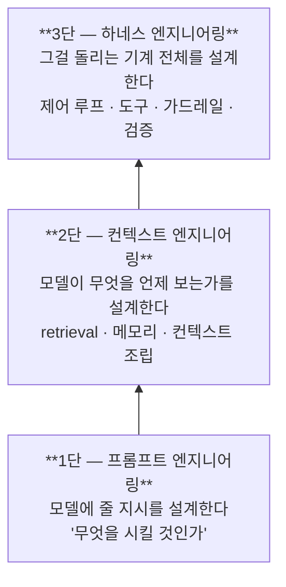

- 1단만 있으면: 말은 잘 듣지만 아는 게 없는 모델 — 지어내기 시작함
- 2단이 더해지면: 맞는 재료를 보고 답함 — 그러나 매번 사람이 차려줘야 함
- 3단이 더해지면: 스스로 재료를 찾고, 검증하고, 실패를 복구함 — 이제 "시스템"

한 문장 요약: **프롬프트는 지시, 컨텍스트는 재료, 하네스는 기계.**

### 5-2. 커리큘럼 매핑 — 사다리가 곧 14주의 순서

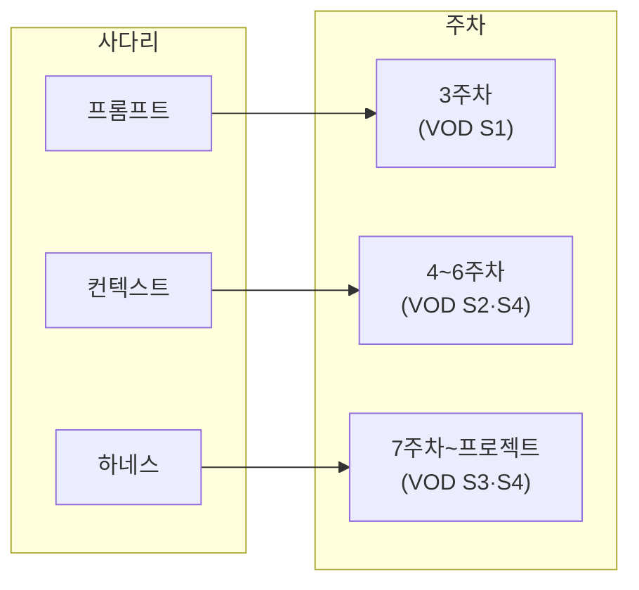

마무리 메시지: "이 과정은 모델을 만드는 법이 아니라, 모델 위에 이 사다리를
쌓는 법을 배운다."

---

## 6. 라이브 빌드 — 분식집 주문 에이전트 (35분)

### 6-1. 무엇을 보여주는가

가상 분식집 **"분식왕"의 주문 접수 AI 점원**을, Claude Code에 지시 프롬프트를
주어 그 자리에서 완성한다. 손 코딩 시연이 아니다 — 보여주는 것은 코드 타이핑이
아니라 **지시 → 생성 → 검증 → 수정의 사이클**이다.

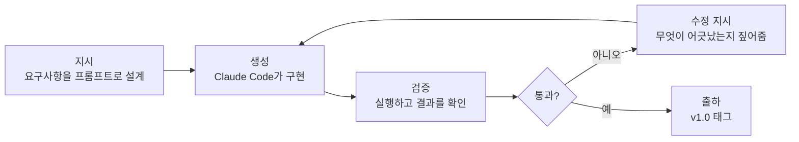

이 사이클이 콘텐츠의 본체다. 여기서 사람의 일은 **요구사항 설계(지시)와
검증(판단)**이고, 이는 평가 기준의 "직접 판단한 부분과 AI 도구가 보조한 부분을
구분하여 설명" 원칙을 1주차부터 멘토가 시연으로 모델링하는 것이기도 하다.

### 6-2. 예제 선정 이유

- 도메인 설명이 0초 — 전 국민이 아는 분식집 주문
- 데이터가 레포에 그대로 들어감 — 외부 API·크롤링 불필요, Gemini 키 하나로 끝
- 에이전트다움이 잘 보임 — 주문 하나가 메뉴 조회 → 재고 체크 → 합계 계산으로 풀리며, 모델이 도구를 골라 쓰는 루프가 시각적으로 드러남
- 결과가 구조화 출력(주문서 json) — "LLM이 채팅이 아니라 시스템 부품이 된다"는 메시지가 1주차에 박힘
- 결과 검증이 쉬움 — 합계 금액이 맞는지 누구나 암산 가능
- 실패 케이스가 재밌음 — "돈까스 되나요?"(메뉴에 없음), "김밥 100줄"(재고 부족)로 가드레일·검증을 자연스럽게 예고

### 6-3. 완성 시스템의 구조 (v1.0 목표)

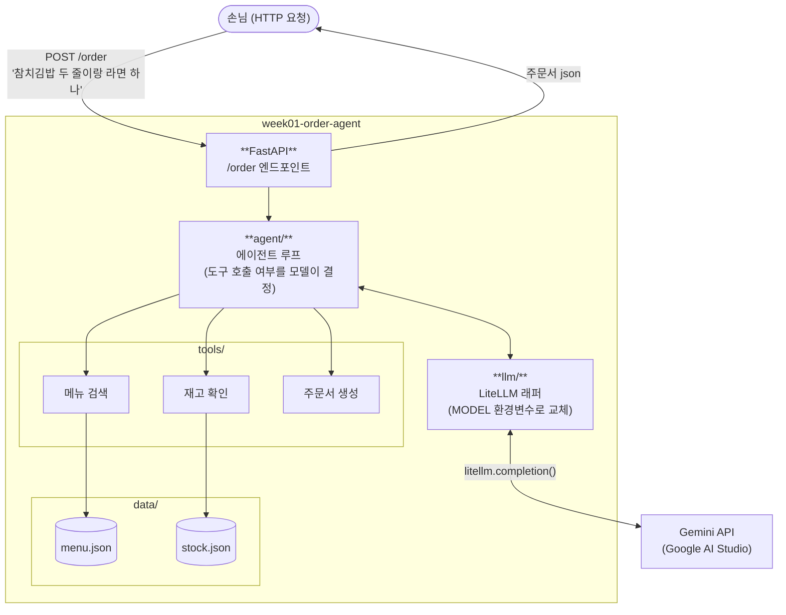

이 그림을 전주기 조망과 연결한다:

- FastAPI + Docker(추후) = Infrastructure
- agent/ = Agents 층 — 오늘 만드는 것의 핵심
- llm/ (LiteLLM) = Platform 층
- Gemini = Models 층
- data/ + tools/ = Data 층

**오늘 35분 시연 안에 5레이어가 전부 등장한다.** 이것이 전주기 조망 직후에
시연을 배치한 이유다.

### 6-4. 에이전트 루프의 동작

리뷰 단계에서 이 흐름을 코드와 대조하며 설명한다. (사다리 3단 = 하네스의 씨앗)

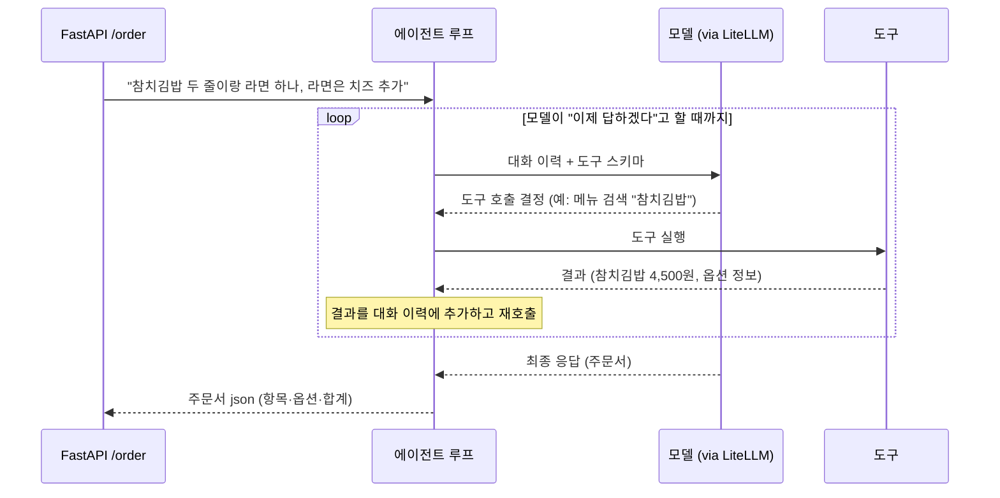

내레이션 포인트:

- "도구를 부를지, 몇 번 부를지, 언제 멈출지를 **코드가 아니라 모델이 결정**한다 — 이게 에이전트와 일반 API 호출의 차이"
- "이 while 루프가 하네스의 씨앗이다. 지금은 루프뿐이지만, 여기에 가드레일·검증·메모리가 붙으면 하네스 엔지니어링이 된다(S4)"

### 6-5. 저장소 설계 — v0.1에서 v1.0으로

**저장소**: <https://github.com/2026-ai-service-engineering-a/week01-order-agent>
(조직 소유, template repository로 지정)

매주 시연은 `2026-ai-service-engineering-a` 조직 아래 독립 레포로 만든다.
(조직 프로필 README에 주차별 레포 인덱스 표 유지)

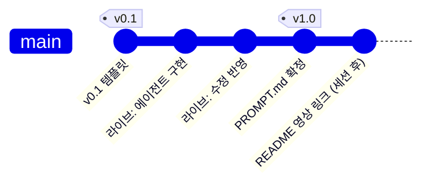

**v0.1 — 시연 시작점 (사전 준비)**

```plaintext
week01-order-agent (v0.1)
├── app/
│   └── main.py          # FastAPI 목 — /order가 고정 문자열 반환
├── data/
│   ├── menu.json        # 메뉴 20개 내외 (이름·가격·옵션)
│   └── stock.json       # 재고 수량
├── .env.example         # GEMINI_API_KEY, MODEL
├── pyproject.toml       # litellm, fastapi 등 의존성 선언 완료
├── PROMPT.md            # 자리만 (빈 파일)
└── README.md            # 프로젝트 목표, 실행 방법
```

- 목 응답 예: `{"message": "죄송합니다, 아직 점원이 없어요"}` — 실행은 되지만 "거짓말하는 API"
- 의존성이 미리 선언되어 있으므로 시연 중 설치 대기 시간 없음

**v1.0 — 시연 종료점**

```plaintext
week01-order-agent (v1.0)
├── app/
│   └── main.py          # /order가 에이전트 루프 호출
├── agent/               # 에이전트 루프          ← Claude Code 구현
├── llm/                 # LiteLLM 래퍼           ← Claude Code 구현
├── tools/               # 도구 3종               ← Claude Code 구현
├── data/                # (v0.1 그대로)
├── PROMPT.md            # 시연에서 사용한 지시 프롬프트 원문
└── README.md            # 실행 방법 갱신 + 영상 링크 (세션 후)
```

**수강생 여정**

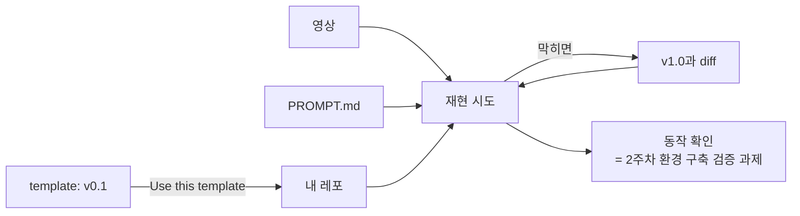

- 시작·끝이 태그로 고정되어 있으므로, 영상 없이 코드만 보는 사람도 `git diff v0.1 v1.0` 하나로 "시연에서 무엇이 만들어졌나"를 정확히 볼 수 있음
- 재현 시점은 2주차 환경 구축 이후 — 2주차 산출물 "동작하는 개발 환경"의 검증 과제로 연결

### 6-6. 기술 원칙 (시연 코드에 반영)

- 모든 LLM 호출은 LiteLLM 경유 — 프로바이더 SDK 직접 호출 금지
- 프로바이더는 Gemini (Google AI Studio 무료 티어)
- 모델 문자열은 환경변수 `MODEL`로 분리 — 리뷰 단계에서 "이 문자열만 바꾸면 Claude도 로컬 모델도 된다, 왜 중요한지는 3주차에" 예고
- 모듈 분리: `llm/` `tools/` `agent/` — 단일 파일 금지
- FastAPI `/order` 엔드포인트로 노출
- 도구 3종
  - 메뉴 검색 — 이름·키워드로 메뉴 조회
  - 재고 확인 — 주문 수량 가능 여부
  - 주문서 생성 — 항목·옵션·합계를 담은 json 반환

### 6-7. 지시 프롬프트 골격

시연에서 PROMPT.md에 직접 타이핑한다. 이 프롬프트 자체가 교재다 — **요구사항을
정의하는 능력이 곧 설계 능력**임을 보여주는 것이 목적. 각 줄을 쓰면서 의도를
설명한다.

```plaintext
분식집 주문 접수 에이전트를 만들어줘.

- 모든 LLM 호출은 LiteLLM 경유. 프로바이더 SDK 직접 호출 금지
- 모델은 환경변수 MODEL로 교체 가능하게 (기본값은 .env.example 참조)
- 도구 3개: 메뉴 검색(data/menu.json), 재고 확인(data/stock.json), 주문서 생성
- 에이전트 루프: 모델이 도구 호출 여부를 결정하고, 필요한 만큼 반복
- 주문서는 json으로: 항목 목록(메뉴·수량·옵션·단가), 합계 금액
- 메뉴에 없는 항목이나 재고 부족은 정중히 거절하고 대안 제시
- 기존 FastAPI의 /order 엔드포인트에 연결
- 모듈 분리: llm / tools / agent
- README에 실행 방법 갱신
```

줄별 의도 설명 포인트:

- "LiteLLM 경유" — 아키텍처 제약을 요구사항 문장으로 박는다. 안 쓰면 Claude Code는 가장 흔한 방식(SDK 직접 호출)으로 감
- "환경변수 MODEL" — 프로바이더 독립을 코드 구조로 강제
- "정중히 거절하고 대안 제시" — 실패 케이스를 요구사항에 미리 넣음. 가드레일의 씨앗
- "모듈 분리" — 지시하지 않으면 한 파일로 나옴. 구조는 시키는 사람의 책임

### 6-8. 시연 진행 (35분)

**1. v0.1 투어 (5분)**

- 목 API 실행 → `/order`에 질문 → 고정 응답 확인
- 폴더 구조, menu.json·stock.json 열어서 보여주기
- 멘트: "지금 이 API는 거짓말을 한다. 오늘 이 자리에서 진짜로 만든다"

**2. 지시 프롬프트 작성 (5분)**

- PROMPT.md에 직접 타이핑하며 각 줄의 의도 설명 (6-7 포인트)

**3. Claude Code 실행 + 생성 관찰 (10분)**

- 생성되는 동안 침묵하지 않는다 — 만들어지는 파일을 따라가며 내레이션
  - "지금 생긴 이 while 루프가 하네스층이다" (사다리 연결)
  - "이 litellm.completion 한 줄이 아까 그림의 Platform 레이어다" (전주기 연결)
- 생성이 빠르게 끝나면 파일별 구조 리뷰로 시간 사용

**4. 리뷰 + 실행 + 수정 사이클 (10분)**

- 정상 케이스: "참치김밥 두 줄이랑 라면 하나, 라면은 치즈 추가" → 주문서 json 확인, 합계 암산으로 검증
- 실패 케이스: "돈까스 되나요?", "김밥 100줄" → 거절·대안 제시 확인
- 구현이 어긋나면 수정 지시 — 검증하고 고치게 하는 모습 자체가 콘텐츠
- 리뷰 중 모델 문자열 환경변수를 짚고 프로바이더 독립 예고

**5. 마무리 (5분)**

- v1.0 태그 푸시
- 공개 자산 3종 안내: 코드 + PROMPT.md + 영상
- 멘트: "오늘 본 것은 코드가 아니라 사이클이다 — 지시하고, 검증하고, 고친다. 14주 동안 배우는 것은 이 사이클을 출하 가능한 품질로 돌리는 법이다"

### 6-9. 리스크 대비

라이브 LLM 코딩은 비결정적이다.

- **사전 리허설 필수** — 같은 프롬프트로 최소 1회 완주, 소요 시간과 흔한 이탈 지점 파악
- **체크포인트 브랜치** — 리허설 결과물을 별도 브랜치에 커밋. 라이브에서 심하게 샛길로 빠지면 "리허설 때는 이렇게 나왔다"로 전환
- 가벼운 실패(에러, 어긋난 구현)는 피하지 않는다 — 복구 과정을 보여주는 것이 목적에 부합
- Gemini 무료 티어 rate limit 확인 — 시연 시간대에 쿼터 여유 확보, 필요 시 보조 키 준비

---

## 7. 프로젝트 트랙 소개 (15분)

방금 만든 주문 에이전트를 좌표로 사용한다. 5개 트랙은 결국 **같은 구조에서
무엇을 갈아끼우는가**의 차이다.

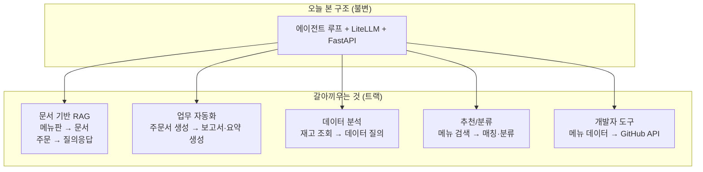

| 트랙 | 갈아끼우는 것 | 예시 프로젝트 | 주요 스택 |
| --- | --- | --- | --- |
| 문서 기반 RAG | 메뉴판 → 문서, 주문 → 질의응답 | 정책/기술문서 Q&A, FAQ 챗봇 | LlamaIndex, Chroma, Qdrant |
| 업무 자동화 | 주문서 생성 → 보고서·요약 생성 | 회의록 요약, 이슈 분류 | LangGraph, n8n |
| 데이터 분석 | 재고 조회 → 데이터 질의 | CSV 자연어 질의, 리포트 생성 | pandas, DuckDB, Plotly |
| 추천/분류 | 메뉴 검색 → 매칭·분류 | 채용공고 매칭, 문의 분류 | scikit-learn, sentence-transformers |
| 개발자 도구 | 메뉴 데이터 → GitHub API | 코드리뷰 보조, 이슈 요약 | GitHub API, FastAPI |

- 트랙은 7주차 트랙별 실습에서 가결정, 10주차 기획에서 확정 — 지금은 "내 관심이 어느 쪽인지" 가늠만
- 주차별 템플릿은 개인 프로젝트의 부품으로 재사용할 수 있음을 재강조 (별도 진행도 가능, 템플릿은 출발점)
- 프로젝트 계획 백그라운드 과제와 연결: "오늘부터 매주, 내 프로젝트라면 무엇을 갈아끼울지 생각하며 보라"

---

## 8. 개인 repo 개설 실습 (15분)

세션 중 유일하게 수강생이 직접 손을 움직이는 구간.

- GitHub 계정 준비 (기존 계정 활용 권장, 없으면 생성)
- 개인 실습·프로젝트용 public 레포 생성 — **개인 계정에 생성 권장** (포트폴리오로 가져가는 것이므로. 조직 내 생성도 무방)
- README에 개인 학습 목표 3줄 작성 — 운영안의 산출물 "학습 목표 + 개인 repo"를 한 파일로 합침
  - 예시 프레임: 현재 상태 / 14주 뒤 만들고 싶은 것 / 관심 트랙 후보
- Discord로 요청 시 멘토가 계정 문제·레포 설정을 지원한다

환경 미비(devcontainer 미설치 등) 상태로 참석해도 1주차 참여에 지장이 없다.
환경 구축은 2주차 주제다.

---

## 9. 마무리 (5분)

- 2주차 예고: Python AI 개발환경 (devcontainer, uv/pip, GitHub 워크플로)
- 2주차 VOD 사전 시청 범위: S1 환경 셋업
- 과제 안내
  - 개인 repo 미완성 시 완성 (README 학습 목표 포함)
  - 오늘 시연 재현은 지금 의무가 아님 — 2주차 환경 구축 후 확인 과제로 연결됨을 예고
- 공개 자산 위치 안내: `2026-ai-service-engineering-a` 조직 + 영상 링크
- 디스코드 채널 안내 — 질문·재현 막힘·프로젝트 구상 논의는 세션 사이에도 상시
- 강의 요일·오프라인 모임 일정 의견 수렴 결과 안내 (또는 디스코드 투표로 이관)

---

## 10. 사전 준비 체크리스트

**저장소 (시연 D-3까지)**

- [x] 조직 `2026-ai-service-engineering-a`에 `week01-order-agent` 생성
- [ ] template repository 설정
- [ ] v0.1 커밋: FastAPI 목, menu.json(20개 내외), stock.json, pyproject.toml, .env.example, README, PROMPT.md(빈 파일)
- [ ] v0.1 태그 및 릴리즈 발행
- [ ] 조직 프로필 README에 주차별 레포 인덱스 표 생성 (week01 링크)

**리허설 (시연 D-2까지)**

- [ ] 지시 프롬프트 확정본으로 Claude Code 1회 완주
- [ ] 소요 시간 기록, 이탈 지점 메모
- [ ] 리허설 결과물을 체크포인트 브랜치에 커밋
- [ ] 정상·실패 케이스 질문 목록 확정 (합계 검증용 주문 1개 포함)

**시연 환경 (당일)**

- [ ] Gemini API 키 동작 확인 + 쿼터 확인 (보조 키 준비)
- [ ] Claude Code 로그인·동작 확인
- [ ] 터미널·에디터 폰트 크기 (뒷자리 가독성)
- [ ] v0.1 클린 체크아웃 상태에서 시작 준비

**교안 자료 (슬라이드)**

- [ ] 5레이어 다이어그램 2종 (일반 버전 / 과정 스택 오버레이) — 4-1, 4-3
- [ ] 실행 흐름 시퀀스 — 4-2
- [ ] 엔지니어링 사다리 + 커리큘럼 매핑 — 5장
- [ ] 지시-생성-검증-수정 사이클 — 6-1
- [ ] 완성 시스템 구조도 — 6-3
- [ ] 트랙 "갈아끼우기" 다이어그램 — 7장
- [ ] 개인 repo README 학습 목표 예시 프레임 — 8장

**세션 후**

- [ ] v1.0 태그 및 릴리즈 발행 (시연 결과물)
- [ ] PROMPT.md 최종본 커밋 (라이브에서 수정 지시가 있었다면 반영)
- [ ] 영상 업로드 및 README 링크 추가
- [ ] 수강생 공지: 재현은 2주차 환경 구축 후 확인 과제
