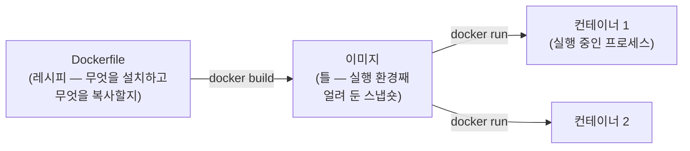

이 과정은 강의 사이트 보기, 시연 저장소 실행, 그리고 12주차 배포까지 곳곳에서
[[docker|Docker]]를 씁니다. 명령을 외우기 전에 그림 하나만 잡고 가면 나머지는
쉽습니다.

## 왜 쓰나 — "내 컴퓨터에서는 됐는데"

같은 코드라도 파이썬 버전, 설치된 패키지, OS가 다르면 다르게 동작합니다.
Docker는 **애플리케이션을 실행 환경째** 묶어서, 누구의 컴퓨터에서든 같은
상태로 실행되게 합니다. 수강생 전원이 같은 환경에서 실습해야 하는 이 과정에
딱 맞는 도구입니다.

## 이미지와 컨테이너

붕어빵 비유가 가장 빠릅니다 — **이미지는 틀, 컨테이너는 붕어빵**입니다.



- **Dockerfile** — "파이썬 3.12를 깔고, 의존성을 설치하고, 소스를 복사하라"는
  레시피 파일. 시연 저장소의 Dockerfile을 열어 보면 딱 이 순서입니다
- **이미지** — 레시피대로 만든 결과물. 한 번 만들면 어디서든 동일
- **컨테이너** — 이미지를 실제로 실행한 것. 지웠다 다시 띄워도 이미지는 그대로

## Docker Compose — 옵션 지옥을 파일 하나로

컨테이너 하나를 띄우는 데도 포트 연결, 환경변수, 폴더 마운트 같은 옵션이
붙습니다. 매번 긴 명령을 치는 대신, [[docker-compose|Docker Compose]]는 그
설정을 `compose.yml` 파일에 선언해 두고 `docker compose up` 한 번으로
띄웁니다.

```yaml
# 시연 저장소(week01-order-agent)의 compose.yml — 이게 전부입니다
services:
  api:
    build: .            # 이 폴더의 Dockerfile로 이미지를 만들고
    ports:
      - "8000:8000"     # 내 컴퓨터의 8000 포트를 컨테이너의 8000에 연결
    env_file:
      - path: .env      # 환경변수는 .env에서
        required: false
```

## 이 과정에서 실제로 쓰는 명령

| 명령 | 하는 일 |
| --- | --- |
| `docker compose up` | compose.yml대로 컨테이너를 띄운다 (이미지 없으면 빌드) |
| `docker compose up --build` | 이미지를 다시 빌드하고 띄운다 — **코드·자료가 바뀌었으면 이것** |
| `docker compose up -d` | 백그라운드로 띄운다 (터미널을 계속 쓸 수 있음) |
| `docker compose down` | 컨테이너를 내리고 정리한다 |
| `docker compose logs -f` | 실행 로그를 따라가며 본다 |
| `docker compose -f compose.dev.yml up` | 기본 파일 대신 다른 compose 파일로 띄운다 |

## 기본 모드와 개발 모드 — `--build`가 필요한 이유

시연 저장소와 강의 사이트 저장소는 compose 파일이 두 벌씩 있습니다.

- **기본 모드**(`compose.yml`) — 소스를 **이미지에 구워서** 실행합니다.
  안정적이지만, 파일이 바뀌면 `--build`로 다시 구워야 반영됩니다.
  `git pull` 뒤에 `docker compose up --build`를 하는 이유가 이것입니다
- **개발 모드**(`compose.dev.yml`) — 소스 폴더를 컨테이너에 **마운트**해서,
  파일을 저장하는 즉시 반영됩니다. 1주차 라이브 빌드가 이 모드로 진행됩니다 —
  Claude Code가 생성하는 파일이 재빌드 없이 바로 서버에 나타납니다

## 자주 막히는 것

- **"port is already allocated"** — 같은 포트를 쓰는 컨테이너가 이미 떠
  있습니다. `docker compose down` 후 다시 띄우세요
- **바꿨는데 반영이 안 됨** — 기본 모드에서 빌드를 안 한 경우입니다.
  `docker compose up --build`
- **디스크가 가득 참** — 안 쓰는 이미지가 쌓인 경우입니다.
  `docker system prune`으로 정리할 수 있습니다 (확인 후 실행)

## 다음 단계

2주차 개발환경 세션에서 devcontainer로 한 걸음 더 갑니다 — 에디터까지
컨테이너 안 환경을 그대로 쓰는 방식입니다. 오늘은 `up`과 `down`만 손에
익히면 충분합니다.
