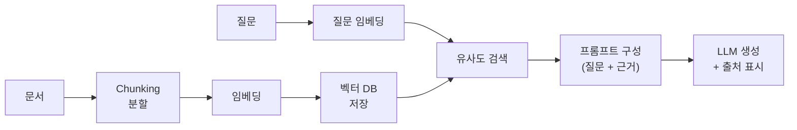

RAG는 [[llm|LLM]]이 학습하지 않은(또는 최신이 아닌) 지식에 대해 답해야 할 때,
**관련 문서를 먼저 검색해 프롬프트에 근거로 넣어주는** 패턴입니다. 4주차에서
30만 건짜리 실데이터 위에 직접 구현하고, 문서 기반 RAG 트랙을 선택하면 개인
프로젝트로 확장합니다.

## 파이프라인

1. **Chunking**: 문서를 검색 단위로 분할한다. 너무 크면 노이즈가, 너무 작으면 맥락이 사라진다.
2. **임베딩·저장**: 각 chunk를 [[embedding|임베딩]]으로 바꿔 [[vector-db|벡터 DB]]에 넣는다.
3. **검색(Retrieval)**: 질문을 같은 방식으로 임베딩해 유사한 chunk를 찾는다.
4. **생성(Generation)**: 찾은 chunk를 근거로 프롬프트를 구성해 LLM이 답을 만들고, 출처를 함께 표시한다.

## 이 과정에서의 위치

| 주차 | RAG와의 연결 |
| --- | --- |
| 4주차 | 데이터 정제부터 임베딩·벡터 인덱스, 질의응답까지 전 과정 |
| 6주차 | 검색을 에이전트가 도구로 부르는 자리 |
| 8주차 | FastAPI 서비스화: RAG를 API로 노출 |
