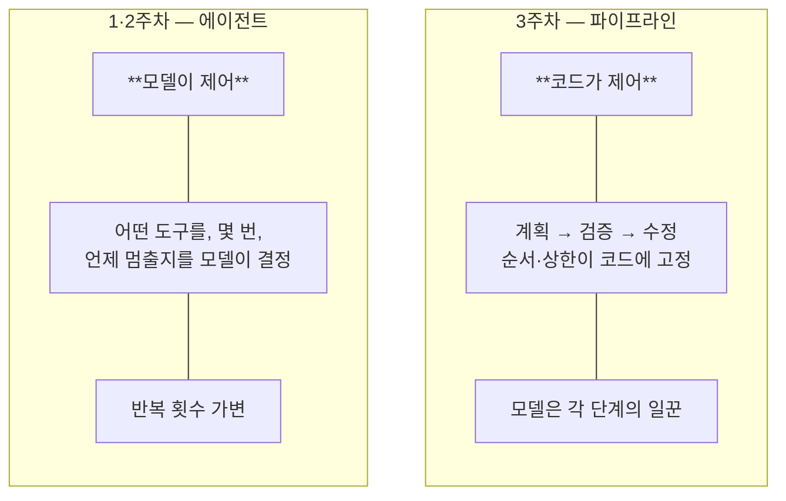
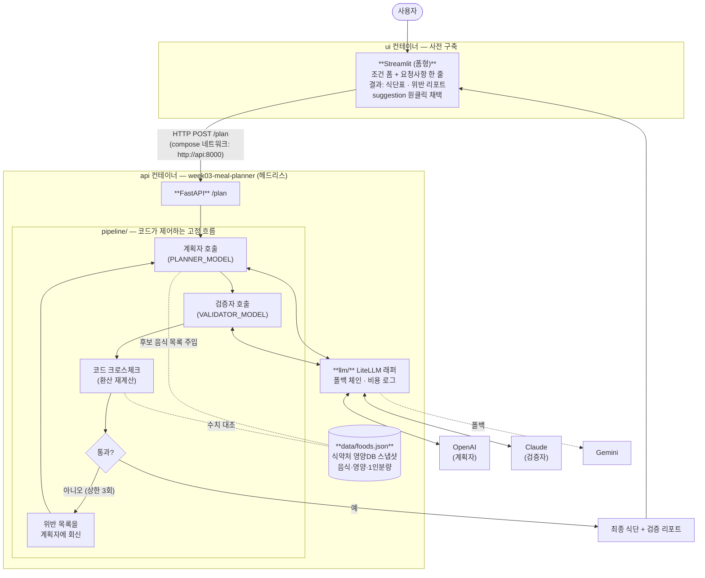
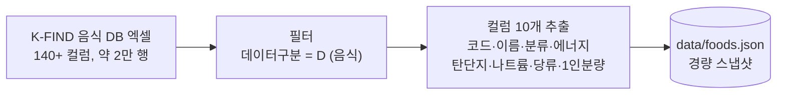
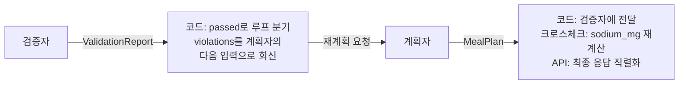
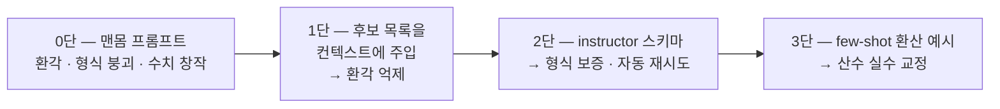
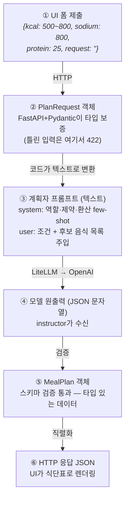
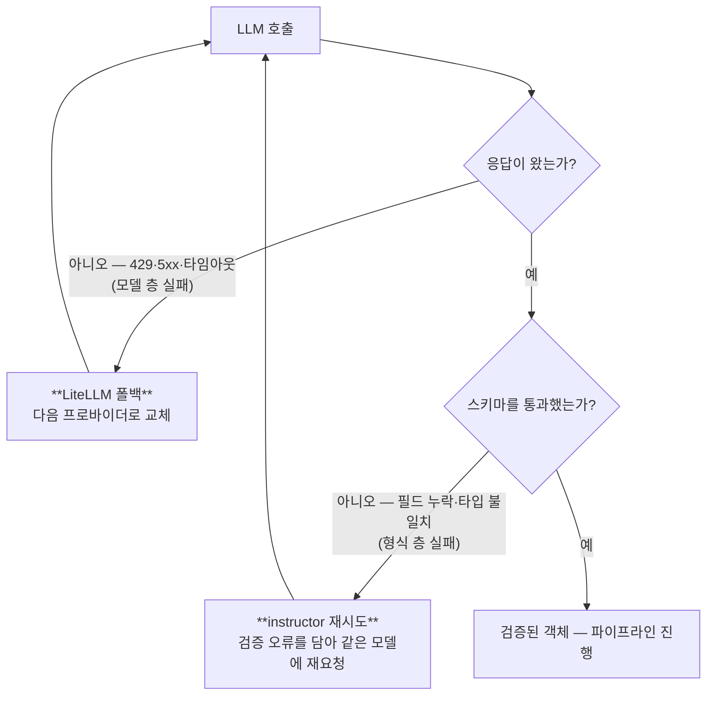
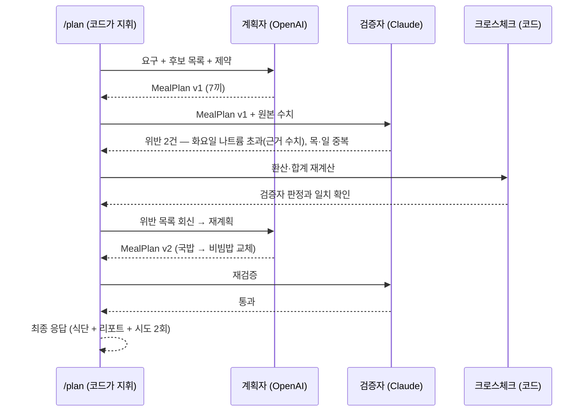
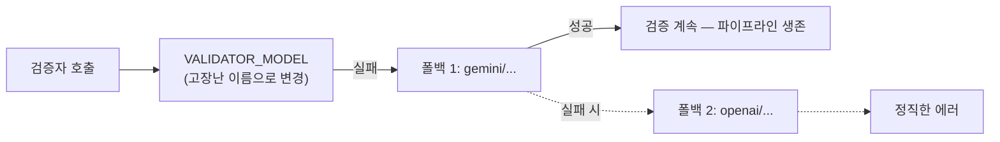

> A반(교육 선행형) 3주차 라이브 세션 교안입니다. 세션은 2시간,
> 멘토 시연 중심으로 진행합니다.  
> 운영안이 3주차에 요구하는 것(LiteLLM 멀티 프로바이더 호출, 프롬프트 패턴,
> structured output)을 정면으로 부각하는 주입니다. 1·2주차에서 "지난주에 본
> 것과 같은 모양"이라며 빠르게 지나갔던 LLM 호출 레이어를 이번 주에 전부
> 엽니다.  
> 시연 코드·지시 프롬프트·영상은 세션 후 전부 공개되어, 각자의 속도로
> 재현할 수 있습니다.

- **주제**: LLM API와 프롬프트 (멀티 프로바이더, 폴백, 프롬프트 패턴, [[structured-output|structured output]])
- **세션 포커스**: 나쁜 프롬프트의 실패 관찰, Git Flow 2회전(계획자·검증자와 수정 루프), 모델 조합 교체·폴백 시연
- **시연 소재**: "한 주 밥상". 나트륨 예산 안에서 저녁 7끼를 짜는 식단 플래너 API
- **데이터**: 식약처 식품영양성분DB 음식 DB (실데이터 스냅샷, 레포 내장)
- **산출물**: LLM 호출 실습 코드
- **시연 저장소**: [week03-meal-planner](https://github.com/2026-ai-service-engineering-a/week03-meal-planner)
- **VOD 사전 시청**: S1 전체
- **운영 방식**: 멘토 시연 → 코드·프롬프트 공개 → 영상 아카이브 (코드 따라 쓰기 없음)

> **이 자료를 내 컴퓨터에서 보기**: 강의 사이트 저장소를 클론해
> [[docker|Docker]]로 띄우면 이 문서와 슬라이드를 로컬에서 볼 수 있고,
> 새 자료가 올라오면 `git pull`로 받아봅니다.
>
> ```bash
> git clone https://github.com/2026-ai-service-engineering-a/ai_service_engineering-track_a
> cd ai_service_engineering-track_a
> docker compose up --build      # http://localhost:4321 접속
> # 새 자료 받기: git pull 한 뒤 다시 docker compose up --build
> ```
>
> 자세한 방법은 [로컬에서 강의 자료 보기](/article/viewing-locally/),
> Docker가 처음이라면 [Docker와 Docker Compose, 처음이라면](/article/docker-basics/)을
> 참고하세요.

> **참고**: v0.1은 API 키 없이도 떠서 UI와 목 응답까지 확인할 수 있습니다.
> 파이프라인을 실제로 돌리려면 LLM 프로바이더 키가 필요합니다.  
> 계획자와 검증자를 다른 회사 모델로 교차시키는 것이 이번 주의 핵심이라,
> OpenAI·Anthropic·Gemini 키 3개 중 **2개 이상**을 권장합니다. 1개뿐이면
> 계획자·검증자를 같은 회사의 다른 모델로 구성할 수는 있지만, 교차 검증의
> 의미는 줄어듭니다.  
> 발급은 시연 저장소 README와 9장 과제 안내를 참고하세요.

## 1. 세션 목표

**이번 주는 에이전트가 아닙니다. 그게 핵심입니다.** 오늘 만드는 것은 "AI를
활용한 API"입니다. 파이프라인의 순서·반복·종료를 전부 코드가 쥐고, 모델은 각
단계의 일꾼으로 부려집니다. 모델이 제어하는 [[agent|에이전트]]를 만들기 전에,
에이전트가 딛고 설 층인 신뢰할 수 있는 [[llm|LLM]] 호출부터 다지는 주입니다.
1주차 엔지니어링 사다리로 말하면 1단 [[prompt-engineering|프롬프트 엔지니어링]]의
주이고, 다만 "잘 부탁하는 법"이 아니라 부탁을 계약으로 바꾸는 법을 다룹니다.

세션이 끝나면 다음을 얻게 됩니다.

- 역할별로 모델·회사가 갈리는 [[litellm|LiteLLM]] 멀티 프로바이더 구성: 계획자는 OpenAI, 검증자는 Claude, 그러나 **같은 `litellm.completion` 인터페이스**
- 생성자와 검증자를 다른 회사 모델로 교차시키는 이유 (self-preference bias: 자기 출력을 검사하면 후해집니다)
- structured output이 왜 "형식 맞추기"가 아니라 **파이프라인의 배선**인지: 스키마 없이는 단계 간 연결 자체가 불가능합니다
- 폴백 체인의 가치: 검증자가 죽으면 안전 검사가 통째로 서는 구조에서 실감합니다
- 프롬프트 패턴의 사다리: 나쁜 프롬프트의 실패를 컨텍스트 주입·스키마·few-shot으로 단계별 교정합니다
- 서버(API)와 UI가 분리된 **헤드리스 구조**: UI는 매주 템플릿의 표준 구성품(사전 구축)이고, API는 UI를 몰라도 완결됩니다

**운영안 요구사항과 이 예제의 대응**

| 요구사항 | 드러나는 자리 |
| --- | --- |
| LiteLLM 멀티 프로바이더 | 계획자 `openai/...` · 검증자 `anthropic/...`, 역할마다 회사가 갈립니다 |
| 역할별 모델 env 분리 | `PLANNER_MODEL` / `VALIDATOR_MODEL` / `VALIDATOR_FALLBACKS` |
| LiteLLM 폴백 | 검증자 장애 = 파이프라인 정지. 폴백이 살립니다 (모의 장애로 시연) |
| structured output (instructor) | 계획자 출력 = 검증자 입력, 검증자 출력 = 계획자의 다음 입력 |
| 프롬프트 패턴 | 0단(나쁜 프롬프트) → 컨텍스트 주입 → 스키마 → few-shot 사다리 |

**1·2주차와 달라지는 것**

| 구분 | 1·2주차 (에이전트) | 3주차 (파이프라인) |
| --- | --- | --- |
| 제어 주체 | 모델 (도구·횟수·종료를 결정) | **코드** (순서·반복·상한 고정) |
| 모델의 역할 | 조종사 | 단계별 일꾼 |
| 반복 횟수 | 가변 (에이전트의 정의적 특징) | 고정 상한 (예: 수정 3회) |
| 환경 | compose (app + db) | **compose (api + ui)**, DB 없음, UI는 사전 구축 |
| UI 형태 | 채팅형이 정당 (대화 상태가 서버에 있음) | **폼형**, 무상태 계약의 정직한 번역 |
| 이번 주가 여는 것 | — | 1·2주차에 빠르게 지나간 LLM 호출 레이어 전부 |

## 2. 브리핑: 오늘은 에이전트가 아니다

### 2-1. 제어 주체의 대비



- 전달 멘트: "둘 다 LLM을 쓰지만 조종간을 누가 쥐는지가 다릅니다. 세상의 AI 서비스 대부분은 사실 오른쪽(파이프라인)입니다. 예측 가능하고, 디버깅 가능하고, 비용이 계산되기 때문입니다. 에이전트는 그 위에 얹는 선택지입니다"
- 7주차 예고: 오늘의 고정 파이프라인이 그때 도구를 쥔 에이전트로 재구성됩니다. 두 방식의 차이를 몸으로 알게 됩니다

### 2-2. 시스템 구조: "AI를 활용한 API"

오늘 만드는 것의 전체 그림입니다. 겉은 평범한 API이고, 안에서 두 회사의 모델이
코드의 지휘 아래 일합니다.



짚을 포인트:

- **UI는 폼형입니다. 채팅이 아닙니다.** UI의 형태는 백엔드 계약의 번역이어야 합니다. 이 API는 무상태 단발 함수인데 채팅창을 붙이면 UI가 "이전 대화를 기억한다"는 지키지 못할 약속을 하게 됩니다. 2주차는 서버에 대화 상태(`conversations`·`messages`)가 있었으므로 채팅형이 정당했고, 3주차는 무상태이므로 폼형이 정당합니다. **어울리는 UI를 고르는 눈이 곧 백엔드 아키텍처를 읽는 눈입니다**
- **요청사항 필드가 수정 경험을 만듭니다.** 폼에는 구조화된 조건(칼로리·나트륨·단백질)과 자유 요청사항 한 줄이 있습니다. 검증 리포트의 `suggestion`("국물이 적은 밥류로 교체")을 원클릭으로 요청사항에 채택해 재요청하면 수정처럼 느껴지지만, 서버 입장에서는 매번 처음 보는 완결된 요청입니다. 필드를 클리어하면 전체가 초기 상태로 돌아갑니다. 상태는 폼에만 있습니다
- **UI와 API는 별개 컨테이너이고, 대화는 HTTP뿐입니다.** 이것이 헤드리스입니다. UI를 Streamlit에서 Next.js로 갈아끼워도 API는 한 줄도 안 바뀝니다. [[docker-compose|compose]] 네트워크에서 서비스 이름(`api`)이 곧 호스트명이 되는 것도 짚습니다 (2주차 app↔db와 같은 원리)
- **UI는 사전 구축입니다.** 2주차의 인증처럼 멘토가 미리 만들어 제공합니다. 오늘의 학습 목표가 아니고, 직접 만드는 것은 9주차입니다. 다만 결과물(식단표)이 눈에 보여야 하므로 매주 템플릿의 표준 구성품으로 포함합니다
- LLM 호출 지점은 **정확히 두 곳**(계획자·검증자)뿐이고, 나머지는 전부 평범한 코드입니다. "AI 서비스라고 AI가 많은 게 아닙니다"
- 두 호출이 **다른 회사로 갑니다.** 같은 `litellm.completion`에 모델 문자열만 다릅니다. 1주차부터 말한 "문자열 하나로 교체"가 여기서 실전이 됩니다
- 회사를 가르는 이유는 취향이 아니라 편향입니다. 자기 출력에 후한 self-preference bias, 곧 <strong>"만든 쪽이 검사하면 안 된다"</strong>는 오래된 원칙의 LLM 버전입니다
- 크로스체크(코드 재계산)가 검증자 옆에 있는 이유는 5장에서 다룹니다

### 2-3. 데이터: 진짜 정부 데이터

식약처 식품영양성분DB 중 **음식 DB**를 씁니다. 실존하는 음식들의 분석 기반
영양 수치이지, 제작한 샘플이 아닙니다.

- **출처**: [식품안전나라 K-FIND 식품영양성분 DB 내려받기](https://various.foodsafetykorea.go.kr/nutrient/general/down/historyList.do)
- **다운로드 대상**: "음식 DB" (약 11.35MB, 2만 건 규모). 엑셀 파일 다운로드 방식이라 Open-API 제한과 무관합니다
- 같은 페이지에는 **가공식품 DB**(187MB, 31만 건)도 있습니다. 그쪽은 4주차의 주인공입니다. "오늘은 작고 깨끗한 쪽, 다음 주는 크고 더러운 쪽"
- 스냅샷에는 다운로드 시점의 DB 버전·일자를 README에 기록합니다. 데이터에도 버전이 있습니다



- 수집·전처리 스크립트(`scripts/prepare_data.py`)도 레포에 공개해, 출처와 가공 과정이 증명되게 합니다
- **1인분량이 이 데이터의 함정이자 보석입니다.** 영양값은 100g 기준인데 1인분은 김밥 230g, 순대국밥 900g입니다. 사람이 먹는 단위로 환산해야 하고, 이 환산이 LLM이 정확히 틀리는 지점입니다 (5장의 드라마)
- 나트륨이 소재를 완성합니다. 순대국밥은 나트륨 470mg/100g에 1인분이 900g라, **한 그릇 약 4,200mg으로 WHO 하루 권장(2,000mg)의 두 배**입니다. 국물 요리를 좋아할수록 예산이 터지고, 수정 루프가 연출 없이 진짜로 돕니다
- 데이터 수집 시점의 공공데이터 Open-API 제한 이슈는 파일 다운로드로 우회했음을 언급합니다. "실데이터의 첫 교훈: 데이터 소스는 죽습니다. 스냅샷과 출처 기록이 엔지니어링입니다" (4주차 예고)

### 2-4. 역할별 모델 구성: env가 곧 조직도

```sh
# .env.example
PLANNER_MODEL=openai/gpt-...          # 계획자 — 식단 생성
VALIDATOR_MODEL=anthropic/claude-...  # 검증자 — 다른 회사로 교차
VALIDATOR_FALLBACKS=gemini/...,openai/...
OPENAI_API_KEY=
ANTHROPIC_API_KEY=
GEMINI_API_KEY=
```

- 역할이 곧 설정입니다. 코드 어디에도 모델명이 없습니다. 조합 교체는 env 수정 + 재실행입니다 (시연 4에서 실증)
- 폴백이 검증자에 붙는 이유: 계획자가 죽으면 "식단이 안 나옴"(불편)이지만, 검증자가 죽으면 <strong>"검증 안 된 식단이 나감"</strong>(위험)입니다. 신뢰성 투자는 위험한 쪽부터 합니다

### 2-5. structured output은 어디서 나오나: 실물

[[structured-output|structured output]]은 **모델의 출력을 자유 텍스트가 아니라
검증된 타입 데이터로 받는 것**입니다. 이 시스템에서는 LLM 호출 지점 두 곳
모두가 structured output입니다.

스키마입니다 (Pydantic, instructor가 이 타입으로 강제합니다):

```python
class PlanRequest(BaseModel):   # ← /plan의 입력 (UI 폼과 1:1 대응)
    kcal_min: int = 500
    kcal_max: int = 800
    sodium_limit_mg: int = 800  # 저녁 몫 나트륨 예산
    protein_min_g: int = 25
    request: str = ""           # 자유 요청사항 — "국물이 적은 밥류(비빔밥 등)로 교체"
                                # 비우면 순수 조건만으로 새로 생성 — 상태는 이 필드가 전부

class Meal(BaseModel):
    day: str                    # "월"
    food_code: str              # "D101-004310000-0001"
    food_name: str              # "국밥_순대국밥"
    serving_g: int              # 900  (1인분량)
    calories_kcal: float        # 675.0  (100g값 × 9 환산)
    protein_g: float
    sodium_mg: float
    reason: str                 # 선정 이유 한 줄

class MealPlan(BaseModel):      # ← 계획자의 출력
    meals: list[Meal]           # 7개

class Violation(BaseModel):
    type: Literal["존재하지_않는_음식", "환산_오류", "제약_위반", "중복"]
    day: str
    food_code: str
    evidence: str               # "470mg/100g × 900g = 4,230mg > 800mg"
    severity: Literal["high", "medium", "low"]
    suggestion: str             # 수정 제안 한 줄

class ValidationReport(BaseModel):  # ← 검증자의 출력
    passed: bool
    violations: list[Violation]
```

호출은 이렇게 바뀝니다:

```python
# 0단 (나쁜 예): 문자열이 돌아옴 — 파싱·검증·재시도 전부 내 몫
text = litellm.completion(model=..., messages=...).choices[0].message.content

# instructor: 검증된 객체가 돌아옴 — 스키마 불일치면 자동 재시도
plan: MealPlan = client.chat.completions.create(
    model=os.environ["PLANNER_MODEL"],
    response_model=MealPlan,        # ← 이 한 줄이 structured output
    messages=[...],
)
plan.meals[1].sodium_mg             # 바로 코드에서 사용 — 파싱 코드 없음
```

실제로 나오는 데이터입니다 (검증자 출력 예):

```json
{
  "passed": false,
  "violations": [
    {
      "type": "제약_위반",
      "day": "화",
      "food_code": "D101-004310000-0001",
      "evidence": "순대국밥 나트륨 470mg/100g × 900g = 4,230mg > 한도 800mg",
      "severity": "high",
      "suggestion": "국물이 적은 밥류(비빔밥 등)로 교체"
    }
  ]
}
```

왜 두 출력 모두 structured여야 하는가: **둘 다 사람이 읽는 글이 아니라 다음
코드가 소비하는 데이터**이기 때문입니다.



- `passed` 필드 하나로 코드가 루프를 돌릴지 결정합니다. 자유 텍스트였다면 "통과인지 아닌지"를 또 파싱해야 합니다
- `evidence`·`suggestion`은 계획자의 다음 프롬프트에 그대로 들어갑니다. 검증자 출력이 계획자 입력이 되는 배선입니다
- 전달 멘트: "structured output은 예쁘게 받기가 아닙니다. 타입 있는 입력과 타입 있는 출력, 곧 **LLM을 함수처럼 쓰기**입니다. 그래야 LLM이 시스템의 부품이 됩니다"

## 3. 시연 1: v0.1 투어 + 0단 프롬프트

### 3-1. v0.1 투어

> **v0.1로 시작하기**: 저장소의 기본 브랜치 `main`은 완성본이라, 그냥 클론하면
> 정답을 받습니다. 시작점은 v0.1 태그에서 작업 브랜치로 잡습니다.
>
> ```bash
> git clone https://github.com/2026-ai-service-engineering-a/week03-meal-planner.git
> cd week03-meal-planner
> git switch -c week03 v0.1   # v0.1 태그에서 작업 브랜치 생성
> ```
>
> 완성본과 비교는 태그로: `git checkout v1.0` · `git diff v0.1 v1.0`.

1. 위처럼 v0.1로 클론 → `.env` 준비 (`.env.example` 복사, 프로바이더 키 입력) → `docker compose -f docker-compose.yml -f docker-compose.dev.yml up`으로 api·ui 두 서비스가 뜹니다 (2주차 관례 그대로, DB만 없음)
2. 브라우저에서 UI 열기 → 조건 입력 → 목 응답이 UI에 표시됩니다: "아직 영양사가 출근 전입니다"
3. 멘트: "UI는 이미 완성돼 있고 오늘 안 건드립니다. 우리가 만드는 것은 이 뒤의 헤드리스 API입니다. curl이나 Swagger로 불러도 똑같이 동작합니다". 실제로 curl을 한 번 쳐서 같은 목 응답을 확인합니다 (분리의 증명)
4. `data/foods.json` 열어보기: 실제 음식들, 나트륨 수치, 1인분량이 보입니다. "순대국밥 한 그릇의 나트륨을 지금 계산해 봅시다" (암산으로 약 4,200mg, 청중 충격 포인트)

### 3-2. 0단: 나쁜 프롬프트의 실패를 먼저

진행 순서는 **프롬프트 설명 → 실행 → 결과 관찰 → 파싱 시도 → 실패 확인**입니다.
말이 아니라 실행으로 보여줍니다.

**① 코드 열고 프롬프트 설명**

v0.1에 포함된 `examples/naive_plan.py` 전문입니다. 화면에 띄우고 "왜 다들
처음에 이렇게 쓰는지"부터 짚습니다.

```python
"""이렇게 하면 안 되는 이유를 보여주는 파일 — 지우지 말 것"""
import os, litellm

resp = litellm.completion(
    model=os.environ["PLANNER_MODEL"],
    messages=[{
        "role": "user",
        "content": "일주일 저녁 식단을 나트륨 적게 JSON으로 짜줘",
    }],
)
print(resp.choices[0].message.content)
```

- 짚기: 스키마 없음, 데이터 없음, "JSON으로"라는 **부탁**뿐입니다. 그럴듯해 보이는 것이 함정입니다

**② 실행 1회차**

```bash
docker compose exec api uv run python examples/naive_plan.py
```

출력 예입니다 (리허설 실물로 교체):

````plaintext
물론이죠! 나트륨을 줄인 건강한 일주일 저녁 식단입니다 😊

```json
{
  "월요일": {"메뉴": "연어 스테이크 샐러드", "나트륨": "350mg"},
  "화요일": {"메뉴": "두부 샐러드", "나트륨": "약 200mg"},
  ...
}
```
맛있게 드세요!
````

관찰 멘트 (출력을 가리키며):

- 인사말과 이모지가 JSON을 감싸고 있습니다. 이대로는 파싱이 안 됩니다
- "연어 스테이크 샐러드": **우리 foods.json에 없는 음식**, 곧 환각입니다. 그 자리에서 `grep 연어 data/foods.json`을 쳐서 없음을 확인합니다
- "약 200mg": 숫자가 아니라 문자열이고, 근거 없는 창작 수치입니다

**③ 실행 2회차: 같은 명령 다시**

```bash
docker compose exec api uv run python examples/naive_plan.py
```

출력 예입니다 (리허설 실물로 교체):

```plaintext
{
  "plan": [
    {"day": "Mon", "menu": "닭가슴살 구이", "sodium_mg": 320},
    ...
  ]
}
```

- 이번에는 인사말이 없고, **키 이름이 전부 바뀌었습니다**. 월요일은 day로, 메뉴는 menu로. "어제 짠 파싱 코드가 오늘 죽는 이유입니다"
- 멘트: "같은 프롬프트, 같은 모델, 다른 형식. 부탁으로 받은 JSON은 계약이 아닙니다"

**④ 파싱 시도 → 실패 확인**

```bash
docker compose exec api uv run python examples/naive_parse.py   # ①의 출력을 json.loads 하는 3줄짜리
```

```plaintext
json.decoder.JSONDecodeError: Expecting value: line 1 column 1 (char 0)
```

- 1회차 출력(인사말 포함)을 넣으면 첫 글자에서 즉사합니다. "이 에러를 try/except와 정규식으로 막기 시작하면 늪입니다. 그 늪의 이름이 'JSON 흉내'입니다"

**⑤ 실패 3종 정리**

| 화면에서 본 것 | 실패 유형 | 오늘의 처방 |
| --- | --- | --- |
| 연어 스테이크 샐러드 (DB에 없음) | 환각 | 후보 목록 **컨텍스트 주입** (1회전) |
| 인사말 포장, 회차마다 다른 키 | 형식 붕괴 | **instructor 스키마 강제** (1회전) |
| "약 200mg" (창작 수치) | 수치 창작 | **데이터 대조·크로스체크** (2회전) |

전달 멘트: "세 실패는 처방이 다릅니다. 오늘 세션이 이 표의 오른쪽 열 순서대로
갑니다"



## 4. 시연 2: Git Flow 1회전 (`feature/planner`)

계획자를 만듭니다. 목표는 `/plan`이 **형식이 보증된 식단 초안**을 반환하는
것입니다 (검증은 아직 없음).

**회전 진행 형식** (모든 회전 공통): ① 지시 프롬프트 작성·설명 → ② 무엇이
만들어졌나(코드에서 그 부분 짚기) → ③ 명령으로 실행(실제로 이렇게 처리된다) →
④ 커밋·PR. 프롬프트 방식이라 생성은 빠릅니다. 시간의 무게중심은 ②·③입니다.

### 4-1. 지시 프롬프트

```plaintext
식단 플래너의 1단계: 계획자를 만들어줘.

- POST /plan 입력: 구조화된 조건(칼로리 범위·나트륨 한도·단백질 최소)과
  자유 요청사항 문자열(request). 계획자 프롬프트에 둘 다 반영해라 —
  request가 비어 있으면 조건만으로 생성. 응답은 저녁 7끼 식단 초안
- 계획자 LLM 호출은 LiteLLM 경유, 모델은 환경변수 PLANNER_MODEL
- structured output은 instructor를 사용해라. Pydantic 스키마:
  MealPlan — 7개 항목, 각 항목은 요일, 식품코드, 식품명,
  1인분 기준 환산값(에너지 kcal·단백질 g·나트륨 mg), 선정 이유 한 줄
- 프롬프트에는 data/foods.json에서 조건에 맞는 후보 음식 목록
  (코드·이름·100g 영양값·1인분량)을 넣어줘라 — 목록에 없는 음식 금지
- 100g→1인분 환산 규칙과 예시 2개(few-shot)를 시스템 프롬프트에 포함해라
- 제약 기본값: 한 끼 500~800kcal, 단백질 25g 이상, 나트륨 800mg 이내,
  같은 대표식품 주 2회 이하 — 시스템 프롬프트에 명시
- 디버그 로그: LOG_LEVEL=debug일 때 모든 LLM 호출의 조립된 프롬프트 전문,
  모델 원출력, instructor 재시도 과정을 로그로 남겨라
- 아직 검증은 만들지 마 — 다음 단계
- 작업 단위마다 커밋하면서 진행해라 — 스키마 → 계획자 호출 →
  엔드포인트 연결 순으로 커밋을 나누고, 각 커밋 메시지에 의도를 남겨라
```

줄별 의도 포인트:

- "목록에 없는 음식 금지"와 후보 주입: 0단의 환각에 대한 처방입니다. **모델의 상상력을 데이터의 울타리 안에 가둡니다.** 4\~6주차 [[context-engineering|컨텍스트 엔지니어링]]·[[rag|RAG]]의 첫 실물이기도 합니다. "지금은 목록을 통째로 넣지만, 데이터가 커지면? 그게 검색이고 RAG입니다"
- "instructor를 사용": 0단의 형식 붕괴에 대한 처방입니다. 프롬프트로 "JSON으로 줘"라고 비는 것과, 스키마 검증 실패 시 자동 재시도되는 것의 차이입니다
- "few-shot 환산 예시": 0단의 수치 창작에 대한 처방 시도입니다. **그래도 틀린다는 것**이 2회전의 복선입니다
- "디버그 로그": 시연 자체를 가능하게 하는 줄입니다. 프롬프트 전문·원출력·재시도를 로그로 남기게 해야 ③에서 "실제로 이렇게 처리된다"를 열어 보일 수 있습니다. **관측 가능성도 요구사항입니다**
- "작업 단위마다 커밋": 브랜치가 지시 단위라면, 커밋은 그 안의 작업 단위입니다. 재현자가 diff로 만들어진 순서를 따라갈 수 있게 합니다

### 4-2. 무엇이 만들어졌나: 코드에서 이 부분

생성이 끝나면 `git log --oneline`부터 봅니다. 스키마/호출/연결 커밋이 쪼개져
쌓였는지 확인합니다. "이 이력이 곧 튜토리얼의 목차입니다." 그리고 파일별로
**딱 한 군데씩** 짚습니다 (전체 리딩이 아닙니다)

| 파일 | 짚는 부분 | 멘트 |
| --- | --- | --- |
| `schemas/meal.py` | `class MealPlan(BaseModel)` | "2-5에서 본 그 스키마, 곧 계약서" |
| `llm/client.py` | `instructor.from_litellm(...)` | "LiteLLM 위에 instructor를 씌우는 한 줄. 멀티 프로바이더 + 스키마 보증의 결합점" |
| `pipeline/planner.py` | 후보 필터 → 프롬프트 조립 → `response_model=MealPlan` 호출 | "조건으로 foods.json을 거르고, 텍스트로 펴서, 계약과 함께 보냅니다. 이 함수가 계획자의 전부" |
| `app/main.py` | `/plan`에서 `PlanRequest` 수신 → planner 호출 | "입구의 타입 보증(Pydantic)과 출구의 타입 보증(instructor)이 만나는 곳" |

### 4-3. 실행: 실제로 이렇게 처리된다

데이터의 여행 지도를 먼저 걸어두고, 각 지점을 **명령 → 실물**로 엽니다.



**관문 ②: 틀린 입력은 LLM에 가기도 전에 죽는다**

```bash
curl -s localhost:8000/plan -X POST -H 'Content-Type: application/json' \
  -d '{"kcal_min":500,"kcal_max":"많이","sodium_limit_mg":800,"protein_min_g":25}' | jq
```

```json
{ "detail": [ { "loc": ["body", "kcal_max"],
    "msg": "Input should be a valid integer", "input": "많이" } ] }
```

- 멘트: "LLM 요금이 나가기 전에 Pydantic이 공짜로 막았습니다. 첫 번째 관문입니다"

**정상 호출 → 초안 실물**

```bash
curl -s localhost:8000/plan -X POST -H 'Content-Type: application/json' \
  -d '{"kcal_min":500,"kcal_max":800,"sodium_limit_mg":800,"protein_min_g":25,"request":""}' | jq
```

```json
{
  "meals": [
    { "day": "월", "food_code": "D101-007280000-0001", "food_name": "김밥_소고기",
      "serving_g": 250, "calories_kcal": 447.5, "protein_g": 16.2,
      "sodium_mg": 667.5, "reason": "단백질 보강과 나트륨 여유를 함께 확보" },
    ...
  ]
}
```

- 그 자리에서 두 가지를 검증합니다. 식품코드를 foods.json에서 `grep`으로 확인하고(실존 여부), 환산값 하나를 암산으로 대조합니다. **틀린 끼니를 찾으면 2회전의 복선입니다.** "few-shot을 줬는데도 틀립니다. 프롬프트만으로 산수를 보증할 수 없습니다"

**관문 ③·④: 모델이 실제로 본 것과 뱉은 것**

```bash
docker compose logs api | grep -A 40 "PLANNER PROMPT"
```

```plaintext
[debug] PLANNER PROMPT ─ system:
  너는 식단 계획자다. 규칙: ... 환산 예시) 순대국밥 100g=75kcal, 1인분 900g → 675kcal ...
[debug] PLANNER PROMPT ─ user:
  조건: 500~800kcal, 나트륨≤800mg, 단백질≥25g
  후보 목록: [D101-007000000-0001 김밥 140kcal/100g 1인분230g Na307mg] [...]
[debug] PLANNER RAW OUTPUT: {"meals":[{"day":"월", ...
```

- 멘트: "모델이 보는 것은 객체가 아니라 결국 **이 텍스트**입니다. 후보 목록이 여기 박혀 있으니 환각이 억제된 것입니다". 데이터가 **객체 → 텍스트 → JSON → 객체**를 여행하고, 경계마다 보증자가 다릅니다 (들어올 땐 Pydantic, 나올 땐 instructor)

**나오지 않을 때: 실패의 두 층과 각각의 안전망**



- **재시도 관찰**: 리허설에서 확보한 재시도 유발 케이스를 실행한 뒤 로그를 확인합니다

```bash
docker compose logs api | grep -B 2 -A 8 "INSTRUCTOR RETRY"
```

```plaintext
[debug] PLANNER RAW OUTPUT: {"meals":[{"day":"월요일", ...     ← Literal["월",...] 위반
[debug] INSTRUCTOR RETRY 1/2 ─ validation error:
  meals.0.day: Input should be '월','화',... [type=literal_error]
[debug] (오류 내용을 담아 재요청)
[debug] PLANNER RAW OUTPUT: {"meals":[{"day":"월", ...          ← 통과
```

- 멘트: "형식이 틀리면 사람이 고치는 게 아니라, **오류가 모델에게 되돌아가고 모델이 고칩니다.** 그게 자동 재시도의 실체입니다" (라이브에서 재시도가 안 나오면 이 리허설 캡처로 대체합니다)
- 모델 층 실패(폴백)의 실물은 시연 4에서 모의 장애로 봅니다. 여기서는 그림으로 예고만 합니다

### 4-4. 커밋 → PR → 머지

- PR을 생성합니다. 커밋이 여러 개 쌓인 PR을 보여주며: "과정이 남는 PR과 결과만 있는 PR의 차이입니다" → CI → 머지

## 5. 시연 3: Git Flow 2회전 (`feature/validator-loop`)

검증자와 수정 루프를 만듭니다. 이번 주의 클라이맥스, **다른 회사 모델이
계획자의 실수를 잡아내는 순간**입니다.

### 5-1. 지시 프롬프트

```plaintext
2단계: 검증자와 수정 루프를 추가해줘.

- 검증자 LLM 호출은 VALIDATOR_MODEL (계획자와 다른 프로바이더).
  LiteLLM 경유, 폴백 체인은 VALIDATOR_FALLBACKS 순서로
- 검증자 입력: MealPlan + 각 음식의 원본 100g 영양값·1인분량
- 검증자 출력도 instructor 스키마로:
  ValidationReport — 통과 여부, 위반 목록
  (위반 유형: 존재하지 않는 음식 / 환산 오류 / 제약 위반 / 중복,
   대상 요일·식품코드, 근거 수치, 심각도, 수정 제안 한 줄)
- 검증자와 별개로 코드 크로스체크를 넣어라:
  환산과 합계는 순수 함수로 재계산해서 검증자 결과와 대조.
  환산 함수에는 유닛테스트 작성
- 수정 루프: 위반 목록을 계획자에 되돌려 재생성, 최대 3회.
  3회 안에 통과 못 하면 마지막 안과 위반 목록을 함께 반환 (정직한 실패)
- /plan 응답에 최종 식단 + 검증 리포트 + 시도 횟수 +
  시도별 위반 이력(history) 포함 — 루프가 돌았다는 증거를 응답에 남겨라
- 작업 단위마다 커밋하면서 진행해라 — 검증자 스키마·호출 →
  크로스체크·테스트 → 수정 루프 연결 순으로 커밋을 나눠라
```

줄별 의도 포인트:

- "계획자와 다른 프로바이더": 교차 검증의 구조화입니다. env를 보면 이 정책이 설정으로 보입니다
- "근거 수치" 필드: 검증자가 "나트륨 초과 같아요"가 아니라 <strong>"화요일 순대국밥: 470mg/100g × 900g = 4,230mg &gt; 800mg"</strong>을 내놓게 강제합니다. structured output이 판정의 품질을 끌어올리는 예입니다
- "코드 크로스체크": 정직한 설계 포인트입니다. **산수만 필요하면 LLM 검증자는 필요 없습니다. 코드가 더 정확합니다.** LLM 검증자의 값어치는 위반의 해석·심각도 판단·수정 제안이고, 산수는 코드가 이중으로 보증합니다. "믿되, 재계산하라". S4 LLM-as-judge의 예고편이자 한계 고지입니다
- "정직한 실패": 3회 상한입니다. 파이프라인에도 루프 가드가 있습니다 (2주차 에이전트 루프 가드의 재회)
- "커밋을 나눠라": 1회전과 같은 관례입니다. 특히 이번 회전은 "검증자만 있는 상태"와 "루프까지 연결된 상태"가 커밋으로 구분되어야 재현자가 단계를 밟을 수 있습니다

### 5-2. 무엇이 만들어졌나: 코드에서 이 부분

`git log --oneline`으로 검증자 → 크로스체크 → 루프 순의 커밋을 확인한 뒤,
파일별로 한 군데씩 짚습니다.

| 파일 | 짚는 부분 | 멘트 |
| --- | --- | --- |
| `schemas/validation.py` | `class ValidationReport`의 `evidence`·`suggestion` 필드 | "판정에 근거를 강제하는 계약" |
| `pipeline/validator.py` | `model=VALIDATOR_MODEL` + `response_model=ValidationReport` | "계획자와 같은 모양, 다른 회사. 교차 검증이 코드에서는 이 한 줄 차이" |
| `pipeline/crosscheck.py` | 환산·합계 순수 함수 | "LLM 없이 도는 산수. 테스트가 붙는 곳" |
| `pipeline/loop.py` | `for attempt in range(3)`과 위반 회신 조립 | "수정 루프의 전부. 상한 3회가 하드코딩이 아니라 눈에 보이는 규칙" |

### 5-3. 실행: 루프가 실제로 이렇게 돈다

시퀀스를 지도로 걸고, 각 화살표를 명령 → 실물로 엽니다.



**위반을 유도하는 호출** (요청 문장은 리허설에서 확정하고, 국물 요리 유도를
포함합니다):

```bash
curl -s localhost:8000/plan -X POST -H 'Content-Type: application/json' \
  -d '{"kcal_min":500,"kcal_max":800,"sodium_limit_mg":800,"protein_min_g":25,
       "request":"국물 요리 위주로 짜줘"}' | jq
```

```json
{
  "meals": [ ... 최종 7끼 ... ],
  "report": { "passed": true, "violations": [] },
  "attempts": 2,
  "history": [
    { "attempt": 1, "passed": false, "violations": [
      { "type": "제약_위반", "day": "화", "food_code": "D101-004310000-0001",
        "evidence": "순대국밥 470mg/100g × 900g = 4,230mg > 800mg",
        "severity": "high", "suggestion": "국물이 적은 밥류(비빔밥 등)로 교체" } ] }
  ]
}
```

- `attempts: 2`와 `history`를 가리키며: "루프가 돌았다는 증거가 응답에 있습니다. 1차에서 검증자가 잡았고, 2차에서 통과했습니다"

**검증자가 실제로 받은 것·뱉은 것** (로그):

```bash
docker compose logs api | grep -A 30 "VALIDATOR PROMPT"
```

```plaintext
[debug] VALIDATOR PROMPT ─ user:
  식단: 화 순대국밥(D101-0043...) serving 900g 칼로리 675 나트륨 4230 ...
  원본 수치: 순대국밥 100g당 75kcal, Na 470mg, 1인분량 900g ...
[debug] VALIDATOR RAW OUTPUT: {"passed": false, "violations":[{"type":"제약_위반", ...
```

- 멘트: "1회전의 출력 객체(MealPlan)가 텍스트로 풀려서 2회전의 입력이 됐습니다. **스키마가 배선**이라는 말의 실물입니다"

**위반이 계획자에게 되돌아간 실물** (재계획 프롬프트):

```bash
docker compose logs api | grep -A 15 "PLANNER PROMPT (revision)"
```

```plaintext
[debug] PLANNER PROMPT (revision) ─ user:
  직전 식단에서 다음 위반이 발견됨. 반영해서 다시 계획해라:
  - [high] 화요일 순대국밥: 470mg/100g × 900g = 4,230mg > 800mg
    제안: 국물이 적은 밥류(비빔밥 등)로 교체
```

- 멘트: "검증자의 `evidence`·`suggestion` 필드가 계획자의 입력 **문장**이 되는 순간입니다. structured output의 필드 하나가 시스템을 관통합니다"

**크로스체크와 테스트**:

```bash
docker compose exec api uv run pytest tests/test_conversion.py -v
```

```plaintext
test_conversion.py::test_serving_conversion PASSED
test_conversion.py::test_daily_sodium_sum PASSED
```

- 크로스체크 결과와 검증자 판정을 나란히 놓고 일치를 확인합니다. 불일치가 나면 그것대로 콘텐츠입니다: "누가 맞나? 산수는 코드가 맞습니다"

### 5-4. 커밋 → PR → 머지

- 커밋 이력 확인 → PR → CI → 머지. 1회전과 같은 절차라 빠르게 지나갑니다

## 6. 시연 4: 조합 교체·폴백·구동

**① 모델 조합 교체: env만으로**

```bash
# .env: PLANNER_MODEL=openai/gpt-...  →  PLANNER_MODEL=gemini/gemini-...
docker compose up -d --force-recreate api   # env 변경은 재기동으로 반영
curl -s localhost:8000/plan -X POST ... | jq '.meals[0]'   # 같은 요청 재실행
```

```plaintext
[debug] LLM CALL ─ role=planner model=gemini/gemini-...   ← 로그에서 모델 교체 확인
```

- 코드는 한 줄도 안 바뀌었습니다. diff 없음(`git status` 깨끗함)을 보여주는 것이 이 시연의 증거입니다
- 언급: "검증자를 계획자와 같은 모델로 바꾸면? 돌아는 갑니다. 하지만 교차 검증의 의미가 사라집니다. 설정이 자유라는 것은 정책을 지킬 책임도 설정 관리에 있다는 뜻입니다"
- 확인 후 원복합니다

**② 폴백: 모의 장애 (2주차 트릭 재사용)**



```bash
# .env: VALIDATOR_MODEL=anthropic/claude-...  →  VALIDATOR_MODEL=anthropic/no-such-model
docker compose up -d --force-recreate api
curl -s localhost:8000/plan -X POST ... | jq '.report.passed'   # 그래도 검증이 됨
docker compose logs api | grep -A 3 "FALLBACK"
```

```plaintext
[warn]  LLM CALL FAILED ─ role=validator model=anthropic/no-such-model (NotFoundError)
[info]  FALLBACK ─ validator → gemini/gemini-...  (VALIDATOR_FALLBACKS[0])
[debug] VALIDATOR RAW OUTPUT: {"passed": ...
```

- 응답은 정상이고, 로그에만 장애의 흔적이 남습니다. 멘트: "사용자는 프로바이더 장애를 몰랐습니다. 검증자가 죽었는데 서비스는 살았고, 검증도 됐습니다. 폴백은 사치가 아니라 안전 검사의 가용성입니다"
- 확인 후 원복합니다 (재기동 포함)

**③ 구동·마무리**

- 전체 시나리오 1회 통주행을 **UI에서** 합니다. 조건 폼 입력 → 식단표가 표로 렌더링되고, 위반 리포트·시도 횟수가 함께 표시됩니다. "1회전 때 curl로 봤던 그 JSON이, 같은 API 그대로 UI에서는 이렇게 보입니다"
- **요청사항 순환 시연**: 리포트의 `suggestion`("국물이 적은 밥류로 교체")을 원클릭으로 요청사항 필드에 채택 → 재요청 → 새 식단. 이어서 요청사항 클리어 → 재요청 → 초기 조건만의 새 식단
  - 멘트: "수정처럼 보였지만 서버는 매번 처음 보는 요청을 받았습니다. 상태는 저 폼 필드가 전부입니다. 이것이 무상태 API 위에서 수정 경험을 만드는 방법입니다"
- v1.0 태그 + PROMPT.md(지시 2개) 확인
- 마무리 멘트: "오늘 LLM 호출은 딱 두 군데였습니다. 그 두 군데를 신뢰할 수 있게 만드는 데 2시간을 썼습니다. 멀티 프로바이더, 스키마, 폴백, 크로스체크. 다음에 에이전트를 만들 때, 이 층이 밑에 깔려 있습니다"

## 7. 저장소 설계: v0.1에서 v1.0으로

**저장소**: [week03-meal-planner](https://github.com/2026-ai-service-engineering-a/week03-meal-planner),
조직 소유, template repository로 지정합니다.

### 7-1. v0.1: 시연 시작점 (사전 준비)

```plaintext
week03-meal-planner (v0.1)
├── api/
│   ├── app/
│   │   └── main.py          # FastAPI — /plan 목 ("아직 영양사가 출근 전입니다")
│   ├── Dockerfile           # uv 기반 (2주차 패턴 재사용)
│   └── pyproject.toml       # litellm, instructor, pydantic, fastapi, pytest
├── ui/
│   ├── app.py               # Streamlit 폼형 UI (사전 구축) — 조건 폼 + 요청사항 필드,
│   │                        #   결과 대시보드(식단표·위반 리포트), suggestion 원클릭 채택
│   └── Dockerfile
├── data/
│   └── foods.json           # 식약처 영양DB 스냅샷 (전처리 완료, 출처 명기)
├── scripts/
│   └── prepare_data.py      # 원본 엑셀 → foods.json 전처리 (수집 경로 문서화)
├── examples/
│   ├── naive_plan.py        # 0단 나쁜 프롬프트 (의도된 실패 예제)
│   └── naive_parse.py       # 0단 출력을 json.loads 시도 → 실패 확인용 (3줄)
├── docker-compose.yml       # api + ui 두 서비스 (DB 없음)
├── docker-compose.dev.yml   # 개발 오버라이드 (볼륨·--reload·포트) — 2주차 관례
├── .env.example             # PLANNER_MODEL, VALIDATOR_MODEL, VALIDATOR_FALLBACKS, 키 3종
├── PROMPT.md                # 자리만
└── README.md                # 실행 방법, 데이터 출처, 키 준비 안내, UI 구조 해설
```

- **UI는 사전 구축 자산입니다.** 2주차 인증과 같은 지위입니다. 라이브 빌드 대상이 아니고, 구조는 README에 해설합니다 (직접 만드는 것은 9주차)
- UI는 API를 `http://api:8000`으로만 호출합니다. compose 서비스 이름이 곧 호스트명입니다 (2주차 app↔db와 같은 원리)
- DB가 없어 2주차보다 가볍습니다. compose는 매주의 관례로 유지해 수강생이 손에 익히게 합니다
- foods.json은 시연 규모에 맞게 필터된 스냅샷입니다 (음식 수백 종 수준, 레포에 부담 없는 크기)

### 7-2. v1.0: 시연 종료점

- `api/schemas/`: MealPlan·ValidationReport (instructor용 Pydantic)
- `api/llm/`: LiteLLM 래퍼 (역할별 모델 로딩, 폴백 체인, 비용 로그. 2주차 패턴 재사용)
- `api/pipeline/`: 계획자, 검증자, 크로스체크(순수 함수), 수정 루프 (상한 3회)
- `/plan` 연결: 최종 식단 + 검증 리포트 + 시도 횟수를 반환하고, **사전 구축 UI가 그대로 렌더링합니다** (UI 코드는 v0.1에서 변경 없음, 헤드리스 분리의 증명)
- `tests/`: 환산·합계 순수 함수 유닛테스트
- `PROMPT.md`: 지시 프롬프트 2개 누적, PR 2개 머지 이력

## 8. 리스크 대비

- **데이터 수집을 가장 먼저**: K-FIND 파일 다운로드 페이지에서 Open-API 없이 음식 DB 엑셀을 확보합니다. 교안 확정 즉시 스냅샷을 뜨고, 다운로드 시점의 DB 버전·일자를 README에 기록합니다
- **환산 실수가 안 나오는 리스크**: 1회전의 드라마("few-shot을 줘도 틀린다")가 계획자 성능에 따라 불발될 수 있습니다. 리허설에서 실수 사례를 확보해 두고, 라이브에서 안 나오면 그 사례로 대체 설명합니다
- **위반이 안 나오는 리스크**: 시연 요청 문장에 국물 요리 유도를 넣어 나트륨 위반이 거의 확실히 발생하게 설계하고, 리허설로 확정합니다
- **키 3종 관리**: OpenAI·Anthropic·Gemini 전부 실호출입니다. 잔액·쿼터를 사전 확인합니다 (2주차 폴백 시연에서 확보한 키 재사용)
- **UI 사전 구축 완성도**: UI는 목 응답 표시부터 최종 식단표·위반 리포트 렌더링까지 v0.1에 완성 상태여야 합니다. 라이브에서 UI를 고치는 상황이 생기면 주제가 흐려지므로, 리허설에서 v1.0 응답 스키마로 렌더링까지 확인합니다
- compose 이미지 사전 pull (2주차와 동일)
- 사전 리허설·체크포인트 브랜치·10분 손절 기준은 1·2주차와 동일합니다
- instructor 재시도가 길어질 때(스키마 불일치 반복): 시연 중 1분 이상 재시도가 돌면 리허설 결과로 전환합니다

## 9. 과제·마무리

### 9-1. 이번 주 과제: week03 재현

- 재현 과제: week03 재현입니다. 2주차에 설치한 [[docker|Docker]]로 `compose up`부터 시작합니다
- 키 안내: OpenAI·Anthropic·Gemini 3개 중 **폴백 시연까지 재현하려면 2개 이상**이 필요합니다. 1개뿐이면 계획자·검증자를 같은 회사의 다른 모델로 구성할 수 있지만, 교차 검증의 의미는 줄어듭니다
- 확장 과제 (선택): 하루 3끼 × 7일로 확장, 제약 커스터마이즈 (단백질 목표 등)
- 막히면 디스코드로 질문합니다. 환경 문제는 텍스트로 해결이 어려우면 오프라인 모임을 활용합니다

### 9-2. 4주차 예고

- 주제: 데이터 수집·정제
- 예고 멘트: "오늘 foods.json이 깔끔했던 것은 미리 전처리했기 때문입니다. 다음 주에는 같은 다운로드 페이지의 **가공식품 DB**(187MB, 31만 건) 원본을 직접 만납니다. 깨진 글자, 빈 필드, 자유 텍스트 투성이입니다. 치우는 법을 배웁니다. 한국어 PDF의 함정도 다룹니다"
- VOD 사전 시청: S2 데이터 수집·문서 로딩
