> A반(교육 선행형) 3주차 라이브 세션 교안입니다. 세션은 2시간,
> 멘토 시연 중심으로 진행합니다.  
> 운영안이 3주차에 요구하는 것(LiteLLM 멀티 프로바이더 호출, 프롬프트 패턴,
> structured output)을 정면으로 부각하는 주입니다. 1·2주차에서 "지난주에 본
> 것과 같은 모양"이라며 빠르게 지나갔던 LLM 호출 레이어를 이번 주에 전부
> 엽니다.  
> 시연 코드·지시 프롬프트·영상은 세션 후 전부 공개되어, 각자의 속도로
> 재현할 수 있습니다.

- **주제**: LLM API와 프롬프트 (멀티 프로바이더, 폴백, 프롬프트 패턴, [[structured-output|structured output]])
- **세션 포커스**: 나쁜 프롬프트의 실패 관찰, Git Flow 2회전(계획자·검증자와 수정 루프), 모델 조합 교체·폴백 시연
- **시연 소재**: "한 주 밥상". 나트륨 예산 안에서 저녁 7끼를 짜는 식단 플래너 API
- **데이터**: 식약처 식품영양성분DB 음식 DB (실데이터 스냅샷, 레포 내장)
- **산출물**: LLM 호출 실습 코드
- **시연 저장소**: [week03-meal-planner](https://github.com/2026-ai-service-engineering-a/week03-meal-planner)
- **VOD 사전 시청**: S1 전체
- **운영 방식**: 멘토 시연 → 코드·프롬프트 공개 → 영상 아카이브 (코드 따라 쓰기 없음)

> **이 자료를 내 컴퓨터에서 보기**: 강의 사이트 저장소를 클론해
> [[docker|Docker]]로 띄우면 이 문서와 슬라이드를 로컬에서 볼 수 있고,
> 새 자료가 올라오면 `git pull`로 받아봅니다.
>
> ```bash
> git clone https://github.com/2026-ai-service-engineering-a/ai_service_engineering-track_a
> cd ai_service_engineering-track_a
> docker compose up --build      # http://localhost:4321 접속
> # 새 자료 받기: git pull 한 뒤 다시 docker compose up --build
> ```
>
> 자세한 방법은 [로컬에서 강의 자료 보기](/article/viewing-locally/),
> Docker가 처음이라면 [Docker와 Docker Compose, 처음이라면](/article/docker-basics/)을
> 참고하세요.

> **참고**: v0.1은 API 키 없이도 떠서 UI와 목 응답까지 확인할 수 있습니다.
> 파이프라인을 실제로 돌리려면 LLM 프로바이더 키가 필요합니다.  
> 계획자와 검증자를 다른 회사 모델로 교차시키는 것이 이번 주의 핵심이라,
> OpenAI·Anthropic·Gemini 키 3개 중 **2개 이상**을 권장합니다. 1개뿐이면
> 계획자·검증자를 같은 회사의 다른 모델로 구성할 수는 있지만, 교차 검증의
> 의미는 줄어듭니다.  
> 발급은 시연 저장소 README와 10장 과제 안내를 참고하세요.

## 1. 세션 목표

**이번 주는 에이전트가 아닙니다. 그게 핵심입니다.**  
오늘 만드는 것은 "AI를 활용한 API"입니다.  
파이프라인의 순서·반복·종료를 전부 코드가 쥐고, 
모델은 각 단계의 일꾼으로 부려집니다. 
모델이 제어하는 [[agent|에이전트]]를 만들기 전에,
에이전트가 딛고 설 층인 신뢰할 수 있는 [[llm|LLM]] 호출부터 다지는 주입니다.
1주차 엔지니어링 사다리로 말하면 1단 [[prompt-engineering|프롬프트 엔지니어링]]의 주이고, 
다만 "잘 부탁하는 법"이 아니라 **부탁을 계약으로 바꾸는 법**을 다룹니다.
여기서 계약이란 응답이 자연어가 아니라 미리 정한 타입으로 돌아오는 것,
그리고 그 타입을 어긴 응답은 코드에 닿기 전에 걸러지는 것을 뜻합니다.

같은 질문("화요일 저녁 한 끼")에 같은 모델이 답해도, 받는 방식이 다르면
돌아오는 것이 이렇게 달라집니다.

| 구분 | 자연어로 받으면 | 계약으로 받으면 |
| --- | --- | --- |
| 모델 원출력 (JSON) | `"화요일은 순대국밥 어떠세요? 나트륨은 약 4,000mg 정도입니다 😊"` | `{"day":"화","food_name":"국밥_순대국밥","serving_g":900,"sodium_mg":4230.0}` |
| 코드가 손에 쥐는 것 | 그 문자열 그대로 (아직 데이터가 아님) | `Meal(day="화", food_name="국밥_순대국밥", serving_g=900, sodium_mg=4230.0)` (instructor가 검증을 마친 Pydantic 객체) |
| 값을 꺼내려면 | 정규식·`json.loads`로 캐낸다 (호출마다 형식이 달라짐) | `meal.sodium_mg > 800`처럼 바로 비교 |
| 형식이 틀리면 | 내가 알아채고 내가 고친다 | 검증 실패가 모델에게 되돌아가 자동 재시도 |

오른쪽은 "예쁘게 받기"가 아닙니다. 다음 단계의 코드가 곧바로 소비할 수 있는
데이터이고, 이 차이가 오늘 만들 파이프라인 전체를 지탱합니다.

세션이 끝나면 다음을 얻게 됩니다.

- 역할별로 모델·회사가 갈리는 [[litellm|LiteLLM]] 멀티 프로바이더 구성
  - 계획자는 OpenAI, 검증자는 Claude, 그러나 **같은 `litellm.completion` 인터페이스**
- 생성자와 검증자를 다른 회사 모델로 교차시키는 이유
  - self-preference bias: 자기 출력을 검사하면 후해집니다.
- structured output이 왜 "형식 맞추기"가 아니라 **파이프라인의 배선**
  - 스키마 없이는 단계 간 연결 자체가 불가능합니다.
- 폴백 체인의 가치: 검증자가 죽으면 안전 검사가 통째로 서는 구조에서 실감합니다.
- 프롬프트 패턴의 사다리: 나쁜 프롬프트의 실패를 컨텍스트 주입·스키마·few-shot으로 단계별 교정합니다.
- 서버(API)와 UI가 분리된 **헤드리스 구조**: UI는 매주 템플릿의 표준 구성품(사전 구축)이고, API는 UI를 몰라도 완결됩니다.

#### 운영안 요구사항과 이 예제의 대응

| 요구사항 | 드러나는 자리 |
| --- | --- |
| LiteLLM 멀티 프로바이더 | 계획자 `openai/...` · 검증자 `anthropic/...`, 역할마다 회사가 갈립니다 |
| 역할별 모델 env 분리 | `PLANNER_MODEL` / `VALIDATOR_MODEL` / `VALIDATOR_FALLBACKS` |
| LiteLLM 폴백 | 검증자 장애 = 파이프라인 정지. 폴백이 살립니다 (모의 장애로 시연) |
| structured output (instructor) | 계획자 출력 = 검증자 입력, 검증자 출력 = 계획자의 다음 입력 |
| 프롬프트 패턴 | 0단(나쁜 프롬프트) → 컨텍스트 주입 → 스키마 → few-shot 사다리 |

#### 1·2주차와 달라지는 것

| 구분 | 1·2주차 (에이전트) | 3주차 (파이프라인) |
| --- | --- | --- |
| 제어 주체 | 모델 (도구·횟수·종료를 결정) | **코드** (순서·반복·상한 고정) |
| 모델의 역할 | 조종사 | 단계별 일꾼 |
| 반복 횟수 | 가변 (에이전트의 정의적 특징) | 고정 상한 (예: 수정 3회) |
| 환경 | compose (app + db) | **compose (api + ui)**, DB 없음, UI는 사전 구축 |
| UI 형태 | 채팅형이 정당 (대화 상태가 서버에 있음) | **폼형**, 무상태 계약의 정직한 번역 |
| 이번 주가 여는 것 | — | 1·2주차에 빠르게 지나간 LLM 호출 레이어 전부 |

## 2. 브리핑: 오늘은 에이전트가 아니다

### 2-1. 제어 주체의 대비

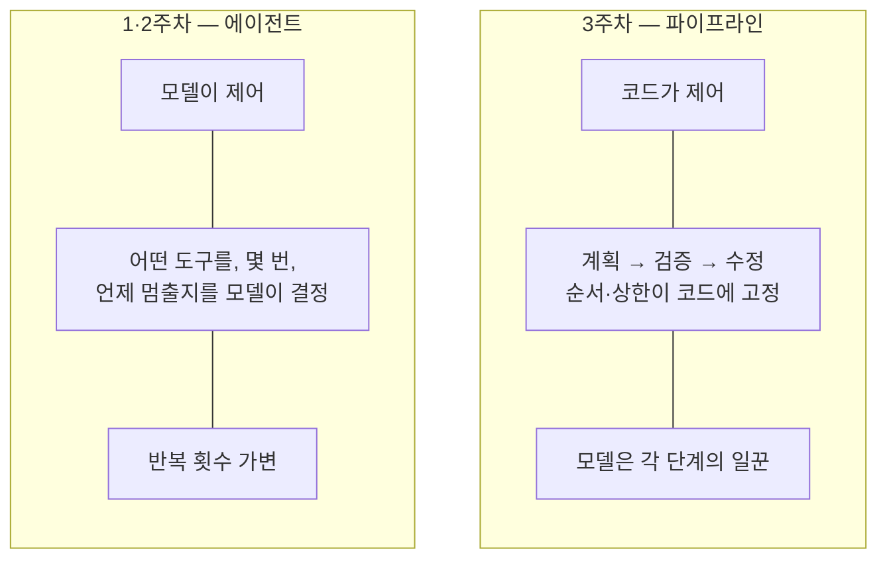

- 둘 다 LLM을 쓰지만 조종간을 누가 쥐는지가 다릅니다. 세상의 AI 서비스 대부분은 사실 오른쪽(파이프라인)입니다. 예측 가능하고, 디버깅 가능하고, 비용이 계산되기 때문입니다. 에이전트는 그 위에 얹는 선택지입니다.

### 2-2. 시스템 구조: "AI를 활용한 API"

오늘 만드는 것의 전체 그림입니다. 겉은 평범한 API이고, 안에서 두 회사의 모델이
코드의 지휘 아래 일합니다.

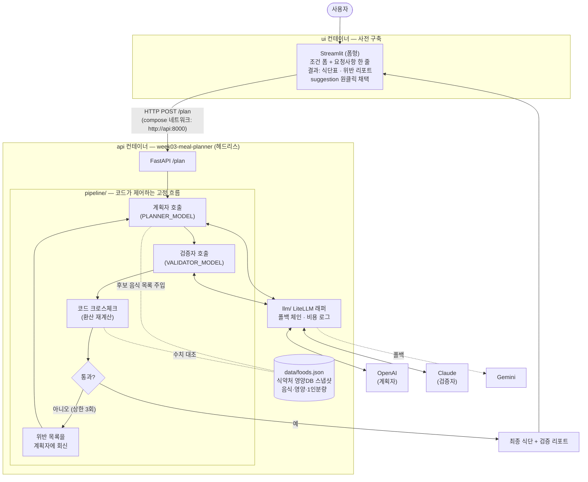

짚을 포인트:

- **UI는 폼형입니다. 채팅이 아닙니다.**
  - UI의 형태는 백엔드 계약의 번역이어야 합니다. 이 API는 무상태 단발 함수인데 채팅창을 붙이면 UI가 "이전 대화를 기억한다"는 지키지 못할 약속을 하게 됩니다. 2주차는 서버에 대화 상태(`conversations`·`messages`)가 있었으므로 채팅형이 정당했고, 3주차는 무상태이므로 폼형이 정당합니다.
  - **어울리는 UI를 고르는 눈이 곧 백엔드 아키텍처를 읽는 눈입니다.**
- **요청사항 필드가 수정 경험을 만듭니다.**
  - 폼에는 구조화된 조건(칼로리·나트륨·단백질)과 자유 요청사항 한 줄이 있습니다. 검증 리포트의 `suggestion`("국물이 적은 밥류로 교체")을 원클릭으로 요청사항에 채택해 재요청하면 수정처럼 느껴지지만, 서버 입장에서는 매번 처음 보는 완결된 요청입니다. 필드를 클리어하면 전체가 초기 상태로 돌아갑니다.
  - 상태는 폼에만 있습니다.
- **UI와 API는 별개 컨테이너이고, 대화는 HTTP뿐입니다.**
  - 이것이 헤드리스입니다. UI를 Streamlit에서 Next.js로 갈아끼워도 API는 한 줄도 안 바뀝니다. [[docker-compose|compose]] 네트워크에서 서비스 이름(`api`)이 곧 호스트명이 됩니다 (2주차 app↔db와 같은 원리)
- **UI는 사전 구축입니다.**
  - 2주차의 인증처럼 멘토가 미리 만들어 제공합니다. 다만 결과물(식단표)이 눈에 보여야 하므로 매주 템플릿의 표준 구성품으로 포함합니다.
- LLM 호출 지점은 **정확히 두 곳**(계획자·검증자)뿐이고, 나머지는 전부 평범한 코드입니다.
  - "AI 서비스라고 AI가 많은 게 아닙니다"
- 두 호출이 **다른 회사로 갑니다.**
  - 같은 `litellm.completion`에 모델 문자열만 다릅니다. 1주차부터 말한 "문자열 하나로 교체"가 여기서 실전이 됩니다.
- 회사를 가르는 이유는 취향이 아니라 편향입니다.
  - 자기 출력에 후한 self-preference bias, 곧 <strong>"만든 쪽이 검사하면 안 된다"</strong>는 오래된 원칙의 LLM 버전입니다.
- 크로스체크(코드 재계산)가 검증자 옆에 있는 이유는 5장에서 다룹니다.

### 2-3. 데이터: 진짜 정부 데이터

식약처 식품영양성분DB 중 **음식 DB**를 씁니다. 실존하는 음식들의 분석 기반
영양 수치이지, 제작한 샘플이 아닙니다.

코드에서 다루는 데이터는 `data/foods.json` 하나입니다. K-FIND에서 받은 엑셀
원본(140여 컬럼, 약 2만 행)에서 음식 500종·컬럼 10개만 추려 만든 스냅샷이고,
v0.1에 이미 들어 있으므로 그대로 쓰면 됩니다. 원본을 받아 이 파일을 다시
만드는 과정은 오늘의 학습 목표가 아니라 11장 부록으로 뺐습니다.

- **출처**: [식품안전나라 K-FIND 식품영양성분 DB 내려받기](https://various.foodsafetykorea.go.kr/nutrient/general/down/historyList.do)
- 같은 페이지에는 **가공식품 DB**(187MB, 31만 건)도 있습니다. 그쪽은 4주차의 주인공입니다. "오늘은 작고 깨끗한 쪽, 다음 주는 크고 더러운 쪽"
- 500종으로 추린 이유는 이 목록이 계획자 프롬프트에 **통째로 들어가기** 때문입니다. 컨텍스트에 실리는 크기여야 합니다. 데이터가 이보다 커지면 목록 주입 대신 검색이 필요해지고, 그것이 4\~6주차의 주제입니다.
- **1인분량이 이 데이터의 함정이자 보석입니다.** 영양값은 100g 기준인데 1인분은 김밥 230g, 순대국밥 900g입니다. 사람이 먹는 단위로 환산해야 하고, 이 환산이 LLM이 정확히 틀리는 지점입니다 (6장의 드라마)
- 나트륨이 소재를 완성합니다. 순대국밥은 나트륨 470mg/100g에 1인분이 900g라, **한 그릇 약 4,200mg으로 WHO 하루 권장(2,000mg)의 두 배**입니다. 국물 요리를 좋아할수록 예산이 터지고, 수정 루프가 연출 없이 진짜로 돕니다.
- 데이터 수집 시점의 공공데이터 Open-API 제한 이슈는 파일 다운로드로 우회했음을 언급합니다. "실데이터의 첫 교훈: 데이터 소스는 죽습니다. 스냅샷과 출처 기록이 엔지니어링입니다" (4주차 예고)

### 2-4. 역할별 모델 구성: env가 곧 조직도

```sh
# .env.example
PLANNER_MODEL=openai/gpt-...          # 계획자 — 식단 생성
VALIDATOR_MODEL=anthropic/claude-...  # 검증자 — 다른 회사로 교차
VALIDATOR_FALLBACKS=gemini/...,openai/...
OPENAI_API_KEY=
ANTHROPIC_API_KEY=
GEMINI_API_KEY=
```

- 역할이 곧 설정입니다.
  - 코드 어디에도 모델명이 없습니다. 조합 교체는 env 수정 + 재실행입니다 (6-3에서 실증)
- 폴백이 검증자에 붙는 이유: 계획자가 죽으면 "식단이 안 나옴"(불편)이지만, 검증자가 죽으면 <strong>"검증 안 된 식단이 나감"</strong>(위험)입니다. 신뢰성 투자는 위험한 쪽부터 합니다.

### 2-5. structured output은 어디서 나오나: 실물

[[structured-output|structured output]]은 **모델의 출력을 자유 텍스트가 아니라
검증된 타입 데이터로 받는 것**입니다. 이 시스템에서는 LLM 호출 지점 두 곳
모두가 structured output입니다.

스키마입니다 (Pydantic, instructor가 이 타입으로 강제합니다):

```python
class PlanRequest(BaseModel):   # ← /plan의 입력 (UI 폼과 1:1 대응)
    kcal_min: int = 500
    kcal_max: int = 800
    sodium_limit_mg: int = 800  # 저녁 몫 나트륨 예산
    protein_min_g: int = 25
    request: str = ""           # 자유 요청사항 — "국물이 적은 밥류(비빔밥 등)로 교체"
                                # 비우면 순수 조건만으로 새로 생성 — 상태는 이 필드가 전부

class Meal(BaseModel):
    day: str                    # "월"
    food_code: str              # "D101-004310000-0001"
    food_name: str              # "국밥_순대국밥"
    serving_g: int              # 900  (1인분량)
    calories_kcal: float        # 675.0  (100g값 × 9 환산)
    protein_g: float
    sodium_mg: float
    reason: str                 # 선정 이유 한 줄

class MealPlan(BaseModel):      # ← 계획자의 출력
    meals: list[Meal]           # 7개

class Violation(BaseModel):
    type: Literal["존재하지_않는_음식", "환산_오류", "제약_위반", "중복"]
    day: str
    food_code: str
    evidence: str               # "470mg/100g × 900g = 4,230mg > 800mg"
    severity: Literal["high", "medium", "low"]
    suggestion: str             # 수정 제안 한 줄

class ValidationReport(BaseModel):  # ← 검증자의 출력
    passed: bool
    violations: list[Violation]
```

호출은 이렇게 바뀝니다:

```python
# 0단 (나쁜 예): 문자열이 돌아옴 — 파싱·검증·재시도 전부 내 몫
text = litellm.completion(model=..., messages=...).choices[0].message.content

# instructor: 검증된 객체가 돌아옴 — 스키마 불일치면 자동 재시도
plan: MealPlan = client.chat.completions.create(
    model=os.environ["PLANNER_MODEL"],
    response_model=MealPlan,        # ← 이 한 줄이 structured output
    messages=[...],
)
plan.meals[1].sodium_mg             # 바로 코드에서 사용 — 파싱 코드 없음
```

실제로 나오는 데이터입니다 (검증자 출력 예):

```json
{
  "passed": false,
  "violations": [
    {
      "type": "제약_위반",
      "day": "화",
      "food_code": "D101-004310000-0001",
      "evidence": "순대국밥 나트륨 470mg/100g × 900g = 4,230mg > 한도 800mg",
      "severity": "high",
      "suggestion": "국물이 적은 밥류(비빔밥 등)로 교체"
    }
  ]
}
```

왜 두 출력 모두 structured여야 하는가: **둘 다 사람이 읽는 글이 아니라 다음
코드가 소비하는 데이터**이기 때문입니다.

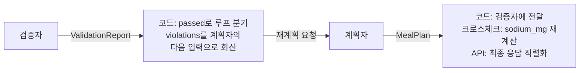

- `passed` 필드 하나로 코드가 루프를 돌릴지 결정합니다. 자유 텍스트였다면 "통과인지 아닌지"를 또 파싱해야 합니다.
- `evidence`·`suggestion`은 계획자의 다음 프롬프트에 그대로 들어갑니다. 검증자 출력이 계획자 입력이 되는 배선입니다.
- structured output은 예쁘게 받기가 아닙니다. 타입 있는 입력과 타입 있는 출력, 곧 **LLM을 함수처럼 쓰기**입니다. 그래야 LLM이 시스템의 부품이 됩니다.

## 3. 시연 1: v0.1 투어 + 0단 프롬프트

### 3-1. v0.1 투어

#### 1) 시작점 내려받기

저장소를 클론하지 않고 **태그의 ZIP을 내려받아** 시작합니다. 클론하면
완성본 이력까지 딸려 와 정답을 먼저 보게 되지만, 태그 ZIP은 버전이 정확히
고정되어 문서와 같은 상태에서 시작하고 실행할 수 있습니다.

버전별 코드는 저장소의 [Tags 페이지](https://github.com/2026-ai-service-engineering-a/week03-meal-planner/tags)에서
받습니다. 태그마다 `zip` 링크가 붙어 있어, 필요한 버전을 골라 내려받으면
됩니다. 지금은 **v0.1의 zip**을 받아 압축을 풉니다.

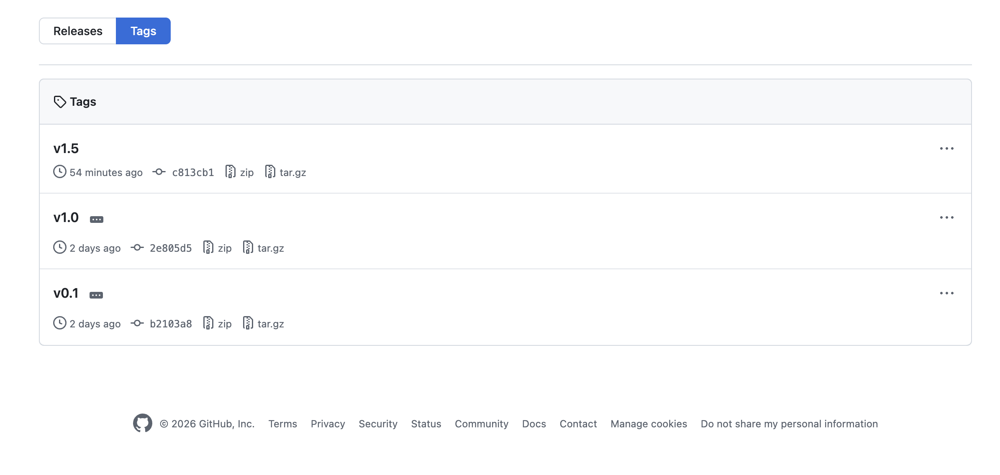

#### 2) env 세팅과 구동

1. 압축을 푼 폴더에서 `.env.example`을 복사해 `.env`를 만들고 프로바이더 키를 채웁니다. 아래 명령으로 api·ui 두 서비스가 뜹니다 (2주차 관례 그대로, DB만 없음)

   ```bash
   cd week03-meal-planner-0.1
   cp .env.example .env             # 프로바이더 키 입력
   docker compose -f docker-compose.yml -f docker-compose.dev.yml up
   ```

2. 브라우저에서 UI 열기 → 조건 입력 → 목 응답이 UI에 표시됩니다: "아직 영양사가 출근 전입니다"
3. UI는 이미 완성돼 있고 이번 주에는 건드리지 않습니다. 만드는 것은 이 뒤의 헤드리스 API이고, curl이나 Swagger로 불러도 똑같이 동작합니다. 실제로 curl을 한 번 쳐서 같은 목 응답을 확인합니다 (분리의 증명)
4. `data/foods.json` 열어보기: 실제 음식들, 나트륨 수치, 1인분량이 보입니다. 순대국밥 한 그릇의 나트륨을 직접 계산해 보면 암산으로도 약 4,200mg이 나옵니다.

### 3-2. 0단: 나쁜 프롬프트의 실패를 먼저

진행 순서는 **프롬프트 설명 → 실행 → 결과 관찰 → 파싱 시도 → 실패 확인**입니다.
말로 설명하는 대신 실제로 돌려서 확인합니다.

미리 말해 둘 것이 하나 있습니다. **첫 실행에서 바로 깨끗한 JSON이 나올 수도
있습니다.** 모델 출력은 비결정적이라 운 좋게 잘 나오는 회차가 있고, 최신
모델일수록 그 확률이 높습니다. 아래 출력 예시는 이 방식이 만드는 **대표적인
실패 유형**을 보여주는 것이지, 매번 이렇게 나온다는 뜻이 아닙니다. 핵심은
한 번 잘 나오는 것이 아니라 **매번 같게 나온다는 보장이 없다**는 것이고,
그래서 잘 나온 회차조차 실패의 일부입니다. 몇 번 반복 실행하면 형식이
흔들리는 순간을 만나게 됩니다.

**① 코드 열고 프롬프트 설명**

v0.1에 포함된 `examples/naive_plan.py` 전문입니다. 왜 다들 처음에 이렇게
쓰는지부터 봅니다.

```python
"""이렇게 하면 안 되는 이유를 보여주는 파일 — 지우지 말 것"""
import os, litellm

resp = litellm.completion(
    model=os.environ["PLANNER_MODEL"],
    messages=[{
        "role": "user",
        "content": "일주일 저녁 식단을 나트륨 적게 JSON으로 짜줘",
    }],
)
print(resp.choices[0].message.content)
```

- 스키마 없음, 데이터 없음, "JSON으로"라는 **부탁**뿐입니다. 그럴듯해 보이는 것이 함정입니다.

**② 실행 1회차**

```bash
docker compose exec api uv run python examples/naive_plan.py
```

출력 예입니다:

````plaintext
물론이죠! 나트륨을 줄인 건강한 일주일 저녁 식단입니다 😊

```json
{
  "월요일": {"메뉴": "연어 스테이크 샐러드", "나트륨": "350mg"},
  "화요일": {"메뉴": "두부 샐러드", "나트륨": "약 200mg"},
  ...
}
```
맛있게 드세요!
````

출력에서 읽어야 할 것:

- 인사말과 이모지가 JSON을 감싸고 있습니다. 이대로는 파싱이 안 됩니다.
- "연어 스테이크 샐러드": **우리 foods.json에 없는 음식**, 곧 환각입니다. `grep 연어 data/foods.json`을 쳐 보면 없다는 것이 확인됩니다.
- "약 200mg": 숫자가 아니라 문자열이고, 근거 없는 창작 수치입니다.

**③ 실행 2회차: 같은 명령 다시**

```bash
docker compose exec api uv run python examples/naive_plan.py
```

출력 예입니다:

```plaintext
{
  "plan": [
    {"day": "Mon", "menu": "닭가슴살 구이", "sodium_mg": 320},
    ...
  ]
}
```

- 이번에는 인사말이 없고, **키 이름이 전부 바뀌었습니다**. 월요일은 day로, 메뉴는 menu로. "어제 짠 파싱 코드가 오늘 죽는 이유입니다"
- 같은 프롬프트, 같은 모델, 다른 형식입니다. 부탁으로 받은 JSON은 계약이 아닙니다.

**④ 파싱 시도 → 실패 확인**

```bash
docker compose exec api uv run python examples/naive_parse.py   # ①의 출력을 json.loads 하는 3줄짜리
```

```plaintext
json.decoder.JSONDecodeError: Expecting value: line 1 column 1 (char 0)
```

- 1회차 출력(인사말 포함)을 넣으면 첫 글자에서 즉사합니다. "이 에러를 try/except와 정규식으로 막기 시작하면 늪입니다. 그 늪의 이름이 'JSON 흉내'입니다"

**⑤ 실패 3종 정리**

| 화면에서 본 것 | 실패 유형 | 오늘의 처방 |
| --- | --- | --- |
| 연어 스테이크 샐러드 (DB에 없음) | 환각 | 후보 목록 **컨텍스트 주입** (1회전) |
| 인사말 포장, 회차마다 다른 키 | 형식 붕괴 | **instructor 스키마 강제** (1회전) |
| "약 200mg" (창작 수치) | 수치 창작 | **데이터 대조·크로스체크** (2회전) |

세 실패는 처방이 다릅니다. 이번 세션은 이 표의 오른쪽 열 순서대로 진행됩니다.

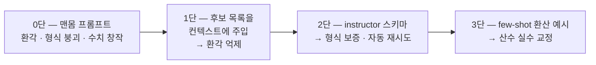

## 4. 시연 2: Git Flow 1회전 (`feature/planner`)

계획자를 만듭니다. 목표는 `/plan`이 **형식이 보증된 식단 초안**을 반환하는
것입니다 (검증은 아직 없음)

**회전 진행 형식** (두 회전 공통): ① 지시 프롬프트 작성·설명 → ② 무엇이
만들어졌나(코드에서 그 부분 짚기) → ③ 커밋·PR·머지. 프롬프트 방식이라
생성은 빠릅니다. 시간의 무게중심은 ②입니다.

실행은 회전 중간에 하지 않고, 두 회전이 모두 머지된 **v1.0 상태에서
한 번에** 합니다. 그 자리가 6장입니다. 버전마다 "이런 지시들로 만들어졌고, 이 상태에서
돌리면 이렇게 나온다"가 짝이 되게 하기 위해서입니다. 문서의 출력 예시도
전부 태그 기준이라, 재현자가 같은 태그에서 돌리면 같은 기준으로 비교할
수 있습니다.

### 4-1. 지시 프롬프트

```plaintext
식단 플래너의 1단계: 계획자를 만들어줘.

- POST /plan 입력: 구조화된 조건(칼로리 범위·나트륨 한도·단백질 최소)과
  자유 요청사항 문자열(request). 계획자 프롬프트에 둘 다 반영해라 —
  request가 비어 있으면 조건만으로 생성. 응답은 저녁 7끼 식단 초안
- 계획자 LLM 호출은 LiteLLM 경유, 모델은 환경변수 PLANNER_MODEL
- structured output은 instructor를 사용해라. Pydantic 스키마:
  MealPlan — 7개 항목, 각 항목은 요일, 식품코드, 식품명,
  1인분 기준 환산값(에너지 kcal·단백질 g·나트륨 mg), 선정 이유 한 줄
- 프롬프트에는 data/foods.json에서 조건에 맞는 후보 음식 목록
  (코드·이름·100g 영양값·1인분량)을 넣어줘라 — 목록에 없는 음식 금지
- 100g→1인분 환산 규칙과 예시 2개(few-shot)를 시스템 프롬프트에 포함해라
- 제약 기본값: 한 끼 500~800kcal, 단백질 25g 이상, 나트륨 800mg 이내,
  같은 대표식품 주 2회 이하 — 시스템 프롬프트에 명시
- 디버그 로그: LOG_LEVEL=debug일 때 모든 LLM 호출의 조립된 프롬프트 전문,
  모델 원출력, instructor 재시도 과정을 로그로 남겨라
- 아직 검증은 만들지 마 — 다음 단계
- 작업 단위마다 커밋하면서 진행해라 — 스키마 → 계획자 호출 →
  엔드포인트 연결 순으로 커밋을 나누고, 각 커밋 메시지에 의도를 남겨라
```

줄별 의도 포인트:

- "목록에 없는 음식 금지"와 후보 주입: 0단의 환각에 대한 처방입니다. **모델의 상상력을 데이터의 울타리 안에 가둡니다.** 4\~6주차 [[context-engineering|컨텍스트 엔지니어링]]·[[rag|RAG]]의 첫 실물이기도 합니다.
  - 다만 지금 하는 것은 후보 500종을 **프롬프트에 통째로 싣는 것**이고, 데이터가 작아서 되는 방식입니다. 왜 오래 못 가는지 세 가지를 짚어 둡니다.
  - **환각이 완전히 사라지지는 않습니다.** 후보를 넣어 줘도 모델이 목록에 없는 음식을 지어내거나, 목록에 있는 음식의 수치를 제멋대로 바꾸는 일이 남습니다. 컨텍스트에 넣는 것은 확률을 낮추는 일이지 보증이 아닙니다. 5장의 검증자와 코드 크로스체크가 따로 필요한 이유입니다.
  - **비용이 입력 토큰에 비례합니다.** LLM API 요금은 입력 토큰과 출력 토큰 각각에 단가가 붙습니다. 후보 목록은 호출할 때마다 통째로 다시 실려 가므로, 목록이 두 배가 되면 입력 쪽 요금도 두 배가 됩니다. 게다가 이번 주 파이프라인은 수정 루프가 최대 3회까지 도니, `/plan` 한 번에 같은 목록을 네 번까지 보내게 됩니다.
  - **큰 입력은 큰 모델을 요구합니다.** 모델마다 한 번에 받을 수 있는 컨텍스트 크기에 상한이 있습니다. 목록이 그 상한을 넘으면 더 큰 모델로 갈아타야 하는데, 그런 모델은 대체로 단가가 비쌉니다. 비용을 감수하고 늘렸더니 다시 비용 문제로 돌아오는 셈입니다.
  - 그래서 데이터가 커지면 **다 넣는 대신 골라 넣게** 됩니다. 조건에 맞는 후보만 찾아 그것만 프롬프트에 싣는 것, 그것이 검색이고 RAG입니다.
- "instructor를 사용": 0단의 형식 붕괴에 대한 처방입니다. 프롬프트로 "JSON으로 줘"라고 비는 것과, 스키마 검증 실패 시 자동 재시도되는 것의 차이입니다.
- "few-shot 환산 예시": 0단의 수치 창작에 대한 처방 시도입니다. **그래도 틀린다는 것**이 2회전의 복선입니다.
- "디버그 로그": 시연 자체를 가능하게 하는 줄입니다. 프롬프트 전문·원출력·재시도를 로그로 남기게 해야 ③에서 "실제로 이렇게 처리된다"를 열어 보일 수 있습니다. **관측 가능성도 요구사항입니다.**
- "작업 단위마다 커밋": 브랜치가 지시 단위라면, 커밋은 그 안의 작업 단위입니다. 재현자가 diff로 만들어진 순서를 따라갈 수 있게 합니다.

### 4-2. 무엇이 만들어졌나: 코드에서 이 부분

생성이 끝나면 `git log --oneline`부터 봅니다. 스키마·호출·연결 커밋이 쪼개져
쌓였는지 확인합니다. 이 이력이 곧 튜토리얼의 목차입니다. 그다음 파일별로
**딱 한 군데씩** 봅니다. 전체를 읽지는 않습니다.

| 파일 | 보는 곳 | 왜 중요한가 |
| --- | --- | --- |
| `schemas/meal.py` | `class MealPlan(BaseModel)` | "2-5에서 본 그 스키마, 곧 계약서" |
| `llm/client.py` | `instructor.from_litellm(...)` | "LiteLLM 위에 instructor를 씌우는 한 줄. 멀티 프로바이더 + 스키마 보증의 결합점" |
| `pipeline/planner.py` | 후보 필터 → 프롬프트 조립 → `response_model=MealPlan` 호출 | "조건으로 foods.json을 거르고, 텍스트로 펴서, 계약과 함께 보냅니다. 이 함수가 계획자의 전부" |
| `app/main.py` | `/plan`에서 `PlanRequest` 수신 → planner 호출 | "입구의 타입 보증(Pydantic)과 출구의 타입 보증(instructor)이 만나는 곳" |

### 4-3. 커밋 → PR → 머지

- PR을 생성합니다. 커밋이 여러 개 쌓인 PR이 만들어집니다. 과정이 남는 PR과 결과만 있는 PR의 차이입니다. 이후 CI → 머지
- 이 상태의 `/plan`은 형식이 보증된 초안을 반환할 뿐, 검증은 아직 없습니다. 실행은 2회전까지 머지한 뒤 6장에서 합니다.

## 5. 시연 3: Git Flow 2회전 (`feature/validator-loop`)

검증자와 수정 루프를 만듭니다. 이번 주의 클라이맥스인 **다른 회사 모델이
계획자의 실수를 잡아내는 순간**은 6-2의 실행에서 봅니다.

### 5-1. 지시 프롬프트

```plaintext
2단계: 검증자와 수정 루프를 추가해줘.

- 검증자 LLM 호출은 VALIDATOR_MODEL (계획자와 다른 프로바이더).
  LiteLLM 경유, 폴백 체인은 VALIDATOR_FALLBACKS 순서로
- 검증자 입력: MealPlan + 각 음식의 원본 100g 영양값·1인분량
- 검증자 출력도 instructor 스키마로:
  ValidationReport — 통과 여부, 위반 목록
  (위반 유형: 존재하지 않는 음식 / 환산 오류 / 제약 위반 / 중복,
   대상 요일·식품코드, 근거 수치, 심각도, 수정 제안 한 줄)
- 검증자와 별개로 코드 크로스체크를 넣어라:
  환산과 합계는 순수 함수로 재계산해서 검증자 결과와 대조.
  환산 함수에는 유닛테스트 작성
- 수정 루프: 위반 목록을 계획자에 되돌려 재생성, 최대 3회.
  3회 안에 통과 못 하면 마지막 안과 위반 목록을 함께 반환 (정직한 실패)
- /plan 응답에 최종 식단 + 검증 리포트 + 시도 횟수 +
  시도별 위반 이력(history) 포함 — 루프가 돌았다는 증거를 응답에 남겨라
- 작업 단위마다 커밋하면서 진행해라 — 검증자 스키마·호출 →
  크로스체크·테스트 → 수정 루프 연결 순으로 커밋을 나눠라
```

줄별 의도 포인트:

- "계획자와 다른 프로바이더": 교차 검증의 구조화입니다. env를 보면 이 정책이 설정으로 보입니다.
- "근거 수치" 필드: 검증자가 "나트륨 초과 같아요"가 아니라 <strong>"화요일 순대국밥: 470mg/100g × 900g = 4,230mg &gt; 800mg"</strong>을 내놓게 강제합니다. structured output이 판정의 품질을 끌어올리는 예입니다.
- "코드 크로스체크": 정직한 설계 포인트입니다. **산수만 필요하면 LLM 검증자는 필요 없습니다. 코드가 더 정확합니다.** LLM 검증자의 값어치는 위반의 해석·심각도 판단·수정 제안이고, 산수는 코드가 이중으로 보증합니다. "믿되, 재계산하라". S4 LLM-as-judge의 예고편이자 한계 고지입니다.
- "정직한 실패": 3회 상한입니다. 파이프라인에도 루프 가드가 있습니다 (2주차 에이전트 루프 가드의 재회)
- "커밋을 나눠라": 1회전과 같은 관례입니다. 특히 이번 회전은 "검증자만 있는 상태"와 "루프까지 연결된 상태"가 커밋으로 구분되어야 재현자가 단계를 밟을 수 있습니다.

### 5-2. 무엇이 만들어졌나: 코드에서 이 부분

`git log --oneline`으로 검증자 → 크로스체크 → 루프 순의 커밋을 확인한 뒤,
파일별로 한 군데씩 봅니다.

| 파일 | 보는 곳 | 왜 중요한가 |
| --- | --- | --- |
| `schemas/validation.py` | `class ValidationReport`의 `evidence`·`suggestion` 필드 | "판정에 근거를 강제하는 계약" |
| `pipeline/validator.py` | `model=VALIDATOR_MODEL` + `response_model=ValidationReport` | "계획자와 같은 모양, 다른 회사. 교차 검증이 코드에서는 이 한 줄 차이" |
| `pipeline/crosscheck.py` | 환산·합계 순수 함수 | "LLM 없이 도는 산수. 테스트가 붙는 곳" |
| `pipeline/loop.py` | `for attempt in range(3)`과 위반 회신 조립 | "수정 루프의 전부. 상한 3회가 하드코딩이 아니라 눈에 보이는 규칙" |

### 5-3. 커밋 → PR → 머지 → v1.0 태그

- 커밋 이력 확인 → PR → CI → 머지. 1회전과 같은 절차라 빠르게 지나갑니다.
- 머지 후 **v1.0 태그**를 찍습니다. PROMPT.md에는 지시 프롬프트 2개가 누적되어 있습니다. 여기까지가 라이브 세션의 종료점이고, 이 상태에서 실행합니다.

## 6. 시연 4: v1.0에서 실행

파이프라인이 실제로 어떻게 도는지, 두 회전이 모두 머지된 **v1.0 상태에서**
실행합니다. 이 장을 따라 하려면 3-1의 Tags 페이지에서 **v1.0의 zip**을
내려받아 압축을 풀고, 그 폴더에서 새로 띄워야 합니다. v0.1을 띄워 둔
상태라면 먼저 내리고, `.env`는 v0.1 폴더의 것을 복사합니다.

```bash
cd week03-meal-planner-1.0
cp ../week03-meal-planner-0.1/.env .
docker compose -f docker-compose.yml -f docker-compose.dev.yml up
```

실행 전에 v0.1에서 무엇이 달라졌는지부터 봅니다. 4·5장의 두 회전이 더한
것이 전부입니다.

| 구분 | v0.1 (3장) | v1.0 (지금) |
| --- | --- | --- |
| `/plan` | 목 응답 ("아직 영양사가 출근 전입니다") | 계획자 → 검증자 → 크로스체크 → 수정 루프 (상한 3회) |
| 응답 | 고정 문자열 | `meals` + `report` + `attempts` + `history` (타입 있는 계약) |
| `api/` 구성 | `app/main.py` 목 하나 | `schemas/` `llm/` `pipeline/` `tests/` 추가 |
| API 키 | 없어도 뜸 | 실호출 (계획자·검증자 교차라 2개 이상 권장) |
| UI·데이터 | 사전 구축 UI · foods.json | 변경 없음 (헤드리스 분리의 증명) |
| PROMPT.md | 자리만 | 4·5장의 지시 프롬프트 2개 누적 |

차이의 전모는 두 폴더를 직접 견주면 보입니다.

```bash
diff -r week03-meal-planner-0.1 week03-meal-planner-1.0 | less
```

같은 지시를 직접 돌려 내 버전을 만들어 봤다면, 파일 이름과 로그
마커(`PLANNER PROMPT` 등)가 문서와 다를 수 있습니다. 요구사항을 만족하면
그것대로 성공이고, 내 코드에서 아래 장면들의 대응물을 찾아보는 것도 좋은
연습입니다.

### 6-1. 계획자 층: 데이터의 여행

데이터의 여행 지도를 먼저 걸어두고, 각 지점을 **명령 → 실물**로 엽니다.

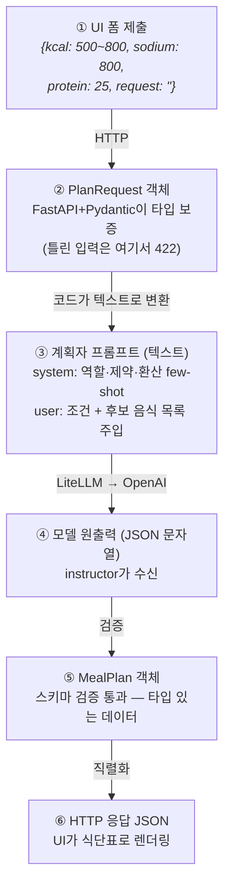

**관문 ②: 틀린 입력은 LLM에 가기도 전에 죽는다**

```bash
curl -s localhost:8000/plan -X POST -H 'Content-Type: application/json' \
  -d '{"kcal_min":500,"kcal_max":"많이","sodium_limit_mg":800,"protein_min_g":25}' | jq
```

```json
{
  "detail": [
    {
      "type": "int_parsing",
      "loc": [
        "body",
        "kcal_max"
      ],
      "msg": "Input should be a valid integer, unable to parse string as an integer",
      "input": "많이"
    }
  ]
}
```

- LLM 요금이 나가기 전에 Pydantic이 공짜로 막았습니다. 첫 번째 관문입니다.

**정상 호출 → 응답 실물**

```bash
curl -s localhost:8000/plan -X POST -H 'Content-Type: application/json' \
  -d '{"kcal_min":500,"kcal_max":800,"sodium_limit_mg":800,"protein_min_g":25,"request":""}' | jq
```

```json
{
  "meals": [
    {
      "day": "월",
      "food_code": "D101-047220000-0001",
      "food_name": "닭구이_닭가슴살구이",
      "serving_g": 300,
      "calories_kcal": 510.0,
      "protein_g": 82.8,
      "sodium_mg": 195.0,
      "reason": "저칼로리 고단백으로 한 끼 기준 칼로리·단백질을 충족합니다."
    },
    {
      "day": "화",
      "food_code": "D101-006350000-0001",
      "food_name": "덮밥_제육덮밥",
      "serving_g": 450,
      "calories_kcal": 652.5,
      "protein_g": 34.2,
      "sodium_mg": 787.5,
      "reason": "족과 단백질이 높고 나트륨이 800mg 이하로 균형 잡힌 덮밥입니다."
    },
    ...,
    {
      "day": "일",
      "food_code": "D101-076250000-0001",
      "food_name": "돈가스_등심돈가스",
      "serving_g": 250,
      "calories_kcal": 625.0,
      "protein_g": 31.25,
      "sodium_mg": 600.0,
      "reason": "단백질 기준을 충족하면서 칼로리도 적정 범위에 듭니다."
    }
  ],
  "report": {
    "passed": true,
    "violations": []
  },
  "attempts": 1,
  "history": [
    {
      "attempt": 1,
      "passed": true,
      "violations": []
    }
  ]
}
```

- 여기서 두 가지를 검증합니다. 식품코드를 foods.json에서 `grep`으로 확인하고(실존 여부), 환산값 하나를 암산으로 대조합니다. **틀린 끼니가 나오면 6-2의 복선입니다.** few-shot을 줬는데도 틀립니다. 프롬프트만으로 산수를 보증할 수 없습니다.
- 무난한 조건이라 1차에서 통과했고, 그래서 `attempts: 1`에 `history`가 비어 있습니다. 응답의 나머지 절반(report·attempts·history)이 일하는 모습은 6-2에서 봅니다.

**관문 ③·④: 모델이 실제로 본 것과 뱉은 것**

```bash
docker compose logs api | grep -A 40 "PLANNER PROMPT"
```

```plaintext
❯ docker compose logs api | grep -A 40 "PLANNER PROMPT"
meal-planner-api  | [DEBUG] PLANNER PROMPT ─ system:
meal-planner-api  | 너는 식단 계획자다. 저녁 7끼(월~일)를 짠다.
meal-planner-api  | 
meal-planner-api  | 규칙:
meal-planner-api  | - 반드시 후보 목록 안의 음식만 쓴다. 목록에 없는 음식 금지.
meal-planner-api  |   food_code·food_name·serving_g는 목록의 값을 글자 그대로 옮긴다.
meal-planner-api  | - 영양값은 100g 기준이다. 1인분 환산값 = 100g값 × serving_g ÷ 100 을 계산해
meal-planner-api  |   calories_kcal·protein_g·sodium_mg에 넣는다.
meal-planner-api  | - 제약: 한 끼 500~800kcal, 단백질 25g 이상,
meal-planner-api  |   나트륨 800mg 이내, 같은 대표식품(food_name의 '_' 앞부분)은 주 2회 이하.
meal-planner-api  | - 요청사항은 제약을 어기지 않는 범위에서만 반영한다. 둘이 충돌하면 제약이 이긴다.
meal-planner-api  | - 요일은 월~일 각각 정확히 한 번.
meal-planner-api  | - reason에는 그 음식을 고른 이유를 한 줄로 쓴다.
meal-planner-api  | 
meal-planner-api  | 환산 예시:
meal-planner-api  | - 순대국밥 75kcal/100g, 1인분 900g → 75 × 900 ÷ 100 = 675 kcal.
meal-planner-api  |   나트륨 470mg/100g → 470 × 900 ÷ 100 = 4,230 mg
meal-planner-api  | - 김밥 140kcal/100g, 1인분 230g → 140 × 230 ÷ 100 = 322 kcal.
meal-planner-api  |   나트륨 307mg/100g → 307 × 230 ÷ 100 = 706.1 mg
meal-planner-api  | [DEBUG] PLANNER PROMPT ─ user:
meal-planner-api  | 조건: 500~800kcal, 나트륨≤800mg, 단백질≥25g
meal-planner-api  | 
meal-planner-api  | 후보 목록:
meal-planner-api  | [D101-047220000-0001 닭구이_닭가슴살구이 170kcal/100g 단백질27.6g 나트륨65mg 1인분300g]
meal-planner-api  | [D101-048290000-0001 돼지구이_목살구이 240kcal/100g 단백질19.5g 나트륨85mg 1인분250g]
...
meal-planner-api  | [D101-009560000-0001 덮밥_회덮밥 118kcal/100g 단백질7.2g 나트륨170mg 1인분450g]
meal-planner-api  | [D101-005280000-0001 볶음밥_김치볶음밥 158kcal/100g 단백질4.8g 나트륨265mg 1인분400g]
```

- 모델이 보는 것은 객체가 아니라 결국 **이 텍스트**입니다. 후보 목록이 여기 박혀 있으니 환각이 억제된 것입니다. 데이터가 **객체 → 텍스트 → JSON → 객체**를 여행하고, 경계마다 보증자가 다릅니다 (들어올 땐 Pydantic, 나올 땐 instructor)

**나오지 않을 때: 실패의 두 층과 각각의 안전망**

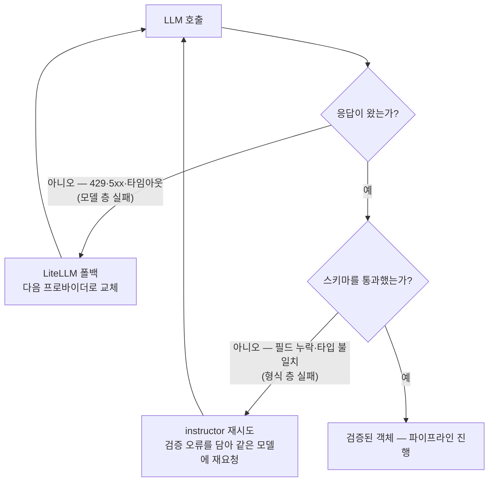

- **재시도 관찰**: 스키마를 어기기 쉬운 케이스를 실행한 뒤 로그를 확인합니다.

```bash
docker compose logs api | grep -B 2 -A 8 "INSTRUCTOR RETRY"
```

```plaintext
[debug] PLANNER RAW OUTPUT: {"meals":[{"day":"월요일", ...     ← Literal["월",...] 위반
[debug] INSTRUCTOR RETRY 1/2 ─ validation error:
  meals.0.day: Input should be '월','화',... [type=literal_error]
[debug] (오류 내용을 담아 재요청)
[debug] PLANNER RAW OUTPUT: {"meals":[{"day":"월", ...          ← 통과
```

- 형식이 틀리면 사람이 고치는 것이 아니라, **오류가 모델에게 되돌아가고 모델이 고칩니다.** 그것이 자동 재시도의 실체입니다.
- 모델 층 실패(폴백)의 실물은 6-3에서 모의 장애로 봅니다. 여기서는 그림으로 예고만 합니다.

### 6-2. 수정 루프: 검증자가 계획자의 실수를 잡아낸다

시퀀스를 지도로 걸고, 각 화살표를 명령 → 실물로 엽니다.

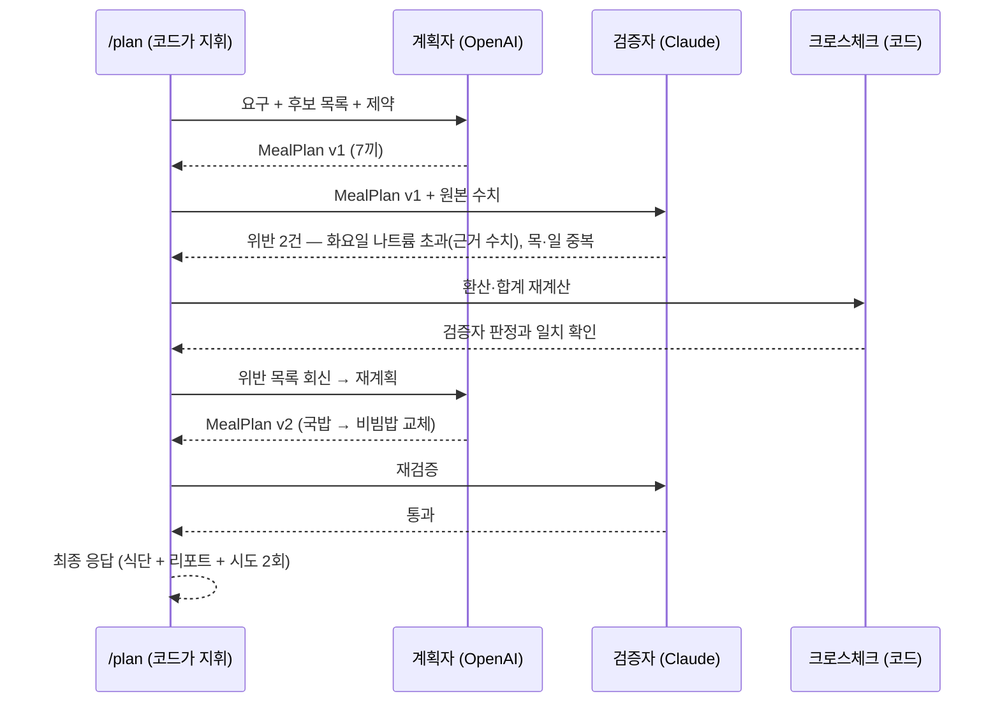

**위반을 유도하는 호출** (요청 문장에 국물 요리 유도를 넣습니다):

```bash
curl -s localhost:8000/plan -X POST -H 'Content-Type: application/json' \
  -d '{"kcal_min":500,"kcal_max":600,"sodium_limit_mg":800,"protein_min_g":25,
       "request":"국물 요리 위주로 짜줘"}' | jq
```

```json
{
  "meals": [
    {
      "day": "월",
      "food_code": "D101-047220000-0001",
      "food_name": "닭구이_닭가슴살구이",
      "serving_g": 300,
      "calories_kcal": 510.0,
      "protein_g": 82.8,
      "sodium_mg": 195.0,
      "reason": "저염·고단백의 담백한 구이로 가벼운 한 끼."
    },
    ...,
    {
      "day": "일",
      "food_code": "D101-047220000-0001",
      "food_name": "닭구이_닭가슴살구이",
      "serving_g": 300,
      "calories_kcal": 510.0,
      "protein_g": 82.8,
      "sodium_mg": 195.0,
      "reason": "목살의 중복을 해소하기 위해 담백한 닭가슴살로 대체."
    }
  ],
  "report": {
    "passed": false,
    "violations": [
      {
        "type": "중복",
        "day": "금-토-일",
        "food_code": "D101-009560000-0001",
        "evidence": "덮밥_회덮밥이 금(450g), 토(450g), 일(닭가슴살구이)로 나타남 — 회덮밥은 금토 2회",
        "severity": "low",
        "suggestion": "토요일 회덮밥을 다른 생선구이로 교체"
      }
    ]
  },
  "attempts": 3,
  "history": [
    {
      "attempt": 1,
      "passed": false,
      "violations": [
        {
          "type": "중복",
          "day": "월,토",
          "food_code": "D101-047220000-0001",
          "evidence": "닭구이_닭가슴살구이가 주 2회(월, 토) 나왔음 - 제약 위반 없음",
          "severity": "low",
          "suggestion": "재검토 필요 없음"
        },
        {
          "type": "중복",
          "day": "목,일",
          "food_code": "D101-048290000-0001",
          "evidence": "돼지구이_목살구이가 주 2회(목, 일) 나왔음 - 제약 위반 없음",
          "severity": "low",
          "suggestion": "재검토 필요 없음"
        }
      ]
    },
    {
      "attempt": 2,
      "passed": false,
      "violations": [
        {
          "type": "중복",
          "day": "월/토",
          "food_code": "D101-047220000-0001",
          "evidence": "닭구이(닭가슴살구이)가 월요일과 토요일에 2회 나타남",
          "severity": "medium",
          "suggestion": "토요일 닭가슴살구이를 다른 생선구이나 소고기 요리로 교체"
        },
        {
          "type": "중복",
          "day": "목/일",
          "food_code": "D101-048290000-0001",
          "evidence": "돼지구이(목살구이)가 목요일과 일요일에 2회 나타남",
          "severity": "medium",
          "suggestion": "일요일 목살구이를 다른 육류 요리로 교체"
        }
      ]
    },
    {
      "attempt": 3,
      "passed": false,
      "violations": [
        {
          "type": "중복",
          "day": "금-토-일",
          "food_code": "D101-009560000-0001",
          "evidence": "덮밥_회덮밥이 금(450g), 토(450g), 일(닭가슴살구이)로 나타남 — 회덮밥은 금토 2회",
          "severity": "low",
          "suggestion": "토요일 회덮밥을 다른 생선구이로 교체"
        }
      ]
    }
  ]
}
```

- `attempts: 2`와 `history`가 루프가 돌았다는 증거입니다. 1차에서 검증자가 잡았고, 2차에서 통과했습니다.

**검증자가 실제로 받은 것·뱉은 것** (로그):

```bash
docker compose logs api | grep -A 30 "VALIDATOR PROMPT"
```

```plaintext
[debug] VALIDATOR PROMPT ─ user:
  식단: 화 순대국밥(D101-0043...) serving 900g 칼로리 675 나트륨 4230 ...
  원본 수치: 순대국밥 100g당 75kcal, Na 470mg, 1인분량 900g ...
[debug] VALIDATOR RAW OUTPUT: {"passed": false, "violations":[{"type":"제약_위반", ...
```

- 1회전의 출력 객체(MealPlan)가 텍스트로 풀려서 2회전의 입력이 됐습니다. **스키마가 배선**이라는 말의 실물입니다.

**위반이 계획자에게 되돌아간 실물** (재계획 프롬프트):

```bash
docker compose logs api | grep -A 15 "PLANNER PROMPT (revision)"
```

```plaintext
[debug] PLANNER PROMPT (revision) ─ user:
  직전 식단에서 다음 위반이 발견됨. 반영해서 다시 계획해라:
  - [high] 화요일 순대국밥: 470mg/100g × 900g = 4,230mg > 800mg
    제안: 국물이 적은 밥류(비빔밥 등)로 교체
```

- 검증자의 `evidence`·`suggestion` 필드가 계획자의 입력 **문장**이 되는 순간입니다. structured output의 필드 하나가 시스템을 관통합니다.

**크로스체크와 테스트**:

```bash
docker compose exec api uv run pytest tests/test_conversion.py -v
```

```plaintext
test_conversion.py::test_serving_conversion PASSED
test_conversion.py::test_daily_sodium_sum PASSED
```

- 크로스체크 결과와 검증자 판정을 나란히 놓고 일치를 확인합니다. 불일치가 나면 그것대로 볼거리입니다. 누가 맞을까요. 산수는 코드가 맞습니다.

### 6-3. 조합 교체·폴백: env만으로

**① 모델 조합 교체**

```bash
# .env: PLANNER_MODEL=openai/gpt-...  →  PLANNER_MODEL=gemini/gemini-...
docker compose up -d --force-recreate api   # env 변경은 재기동으로 반영
curl -s localhost:8000/plan -X POST ... | jq '.meals[0]'   # 같은 요청 재실행
```

```plaintext
[debug] LLM CALL ─ role=planner model=gemini/gemini-...   ← 로그에서 모델 교체 확인
```

- 코드는 한 줄도 안 바뀌었습니다. diff가 없다는 것(`git status`가 깨끗함)이 이 시연의 증거입니다.
- 검증자를 계획자와 같은 모델로 바꾸면 돌아가기는 합니다. 하지만 교차 검증의 의미가 사라집니다. 설정이 자유라는 것은 정책을 지킬 책임도 설정 관리에 있다는 뜻입니다.
- 확인 후 원복합니다.

**② 폴백: 모의 장애 (2주차 트릭 재사용)**

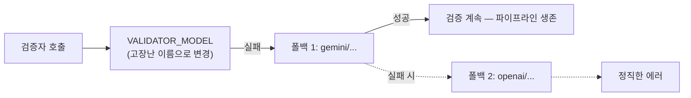

```bash
# .env: VALIDATOR_MODEL=anthropic/claude-...  →  VALIDATOR_MODEL=anthropic/no-such-model
docker compose up -d --force-recreate api
curl -s localhost:8000/plan -X POST ... | jq '.report.passed'   # 그래도 검증이 됨
docker compose logs api | grep -A 3 "FALLBACK"
```

```plaintext
[warn]  LLM CALL FAILED ─ role=validator model=anthropic/no-such-model (NotFoundError)
[info]  FALLBACK ─ validator → gemini/gemini-...  (VALIDATOR_FALLBACKS[0])
[debug] VALIDATOR RAW OUTPUT: {"passed": ...
```

- 응답은 정상이고, 로그에만 장애의 흔적이 남습니다. 사용자는 프로바이더 장애를 몰랐습니다. 검증자가 죽었는데 서비스는 살았고, 검증도 됐습니다. 폴백은 사치가 아니라 안전 검사의 가용성입니다.
- 확인 후 원복합니다 (재기동 포함)

### 6-4. UI 통주행과 마무리

- 전체 시나리오 1회 통주행을 **UI에서** 합니다. 조건 폼 입력 → 식단표가 표로 렌더링되고, 위반 리포트·시도 횟수가 함께 표시됩니다. 6-1에서 curl로 봤던 그 JSON이, 같은 API 그대로 UI에서는 이렇게 보입니다.
- **요청사항 순환 시연**: 리포트의 `suggestion`("국물이 적은 밥류로 교체")을 원클릭으로 요청사항 필드에 채택 → 재요청 → 새 식단. 이어서 요청사항 클리어 → 재요청 → 초기 조건만의 새 식단
  - 수정처럼 보였지만 서버는 매번 처음 보는 요청을 받았습니다. 상태는 저 폼 필드가 전부입니다. 이것이 무상태 API 위에서 수정 경험을 만드는 방법입니다.
- 이번 주 LLM 호출은 딱 두 군데였습니다. 그 두 군데를 신뢰할 수 있게 만드는 데 2시간을 썼습니다. 멀티 프로바이더, 스키마, 폴백, 크로스체크. 다음에 에이전트를 만들 때, 이 층이 밑에 깔려 있습니다.

## 7. 추가 과정 (v1.5): 파이프라인에 관측을 얹는다 (선택)

여기부터는 라이브 세션 범위 밖입니다. v1.0으로 이번 주 목표는 완결이고,
v1.5는 그 위에 **관측(observability)과 재현 편의**를 얹은 확장입니다.
2주차의 v1.5 SQL 콘솔과 같은 지위의 선택 과정입니다. 코드는 태그 v1.5로
발행되어 있습니다. 3-1의 Tags 페이지에서 **v1.5의 zip**을 내려받아
그 폴더에서 띄웁니다.

### 7-1. 무엇이 더해졌나: PR 3개와 수정 1건

| PR | 브랜치 | 더한 것 |
| --- | --- | --- |
| #3 | `feature/compose-data-prep` | 데이터 전처리를 compose 일회성 서비스 `prepare-data`로 분리. 호스트에 파이썬·pandas 없이 스냅샷 재생성 (11장 부록의 그 명령) |
| #4 | `feature/progress-and-audit` | `POST /plan/stream`(SSE)로 파이프라인 진행 이벤트를 흘리고, 응답에 코드 재계산 근거 `audit`을 싣는다. UI에 진행 로그·검증 상세 |
| #5 | `feature/llm-call-inspector` | 응답에 호출 기록 `llm_calls`(호출별 입·출력 전문·토큰·비용)를 싣고, `GET /config`로 역할별 모델 구성을 노출. UI에 호출 기록 뷰어·사이드바 |

세 PR도 두 회전과 같은 방식(지시 → 생성 → 검증 → PR)으로 만들어졌습니다.
과정은 `git log v1.0..v1.5`의 커밋 이력에 남아 있습니다.

- **audit: "통과"가 감상이 아니라 산수가 됩니다.** v1.0의 `report.passed`는 검증자의 판정입니다. audit은 끼니별 실존·환산·열량·단백질·나트륨을 크로스체크 순수 함수로 재계산한 근거표이고, 적용 기준(constraints)까지 응답에 에코되어 무엇을 기준으로 판정했는지가 응답만 봐도 드러납니다.
- **/plan/stream: 진행은 보여주되 무상태는 지킵니다.** 후보 선별 → 계획자(시도 n/3) → 검증자 → 위반 회신이 SSE 이벤트로 흐릅니다. 서버에 작업 상태 저장은 없습니다. 진행 상태는 HTTP 연결 안에만 삽니다. `/plan` 계약은 그대로라 기존 소비자를 깨지 않습니다.
- **llm_calls: 로그에만 있던 것이 응답으로 올라옵니다.** 6-1에서 `grep`으로 캐던 "모델이 실제로 본 것과 뱉은 것"을 UI에서 열어볼 수 있습니다. 폴백이 동작했다면 실제 사용된 모델이, 수정 루프라면 시도 번호가 함께 남습니다.
- **관측이 실제로 버그를 잡았습니다.** UI 호출 기록으로 돌려 보다 검증자 오판 2건이 실물로 잡혔습니다. 검증자에게 주는 원본 수치 목록에 식품코드가 빠져 "존재하지 않는 음식" 오판을 유발했고, "주 2회 이하"인 2회를 중복으로 보고하는 노이즈가 수정 루프를 3회까지 끌고 갔습니다. 수정은 네 위반 유형 전부 **코드 재계산으로 확인될 때만 인정**하는 것. 판정은 코드가, 문장은 검증자가 맡습니다. 5장 크로스체크 원칙의 완성입니다.

### 7-2. v1.5에서 실행

**통과의 근거 (audit)**

```bash
curl -s localhost:8000/plan -X POST -H 'Content-Type: application/json' \
  -d '{"kcal_min":500,"kcal_max":800,"sodium_limit_mg":800,"protein_min_g":25,"request":""}' \
  | jq '.audit'
```

**진행 이벤트 (SSE)**: UI가 쓰는 엔드포인트를 curl로도 볼 수 있습니다.

```bash
curl -sN localhost:8000/plan/stream -X POST -H 'Content-Type: application/json' \
  -d '{"kcal_min":500,"kcal_max":800,"sodium_limit_mg":800,"protein_min_g":25,
       "request":"국물 요리 위주로 짜줘"}'
```

```plaintext
data: {"event":"progress","stage":"planner","detail":"계획자 호출 — 식단 초안 생성 (시도 1/3)",...}
data: {"event":"progress","stage":"validator",...}
...
data: {"event":"result","data":{...}}
```

**모델 구성 (GET /config)**

```bash
curl -s localhost:8000/config | jq
```

- 역할별 모델과 폴백 체인이 나옵니다. 키는 절대 내보내지 않습니다. 모델 문자열은 비밀이 아니라 정책입니다.

**UI에서**: 진행 로그가 실시간으로 차오르고, 결과 아래에 검증 상세 표(끼니별
판정)와 LLM 호출 기록(접힘 목록, 제목에 역할·시도·모델·토큰·비용, 확대
모달)이 붙습니다. 사이드바에는 `/config`의 모델 구성이 보입니다. 6-3에서
env로 갈아끼운 조합이 이제 화면에서 확인됩니다.

## 8. 저장소 설계: v0.1 → v1.0 → v1.5

**저장소**: [week03-meal-planner](https://github.com/2026-ai-service-engineering-a/week03-meal-planner),
조직 소유. 시작점 v0.1, 세션 종료점 v1.0, 세션 뒤 확장 v1.5를 태그로 발행해,
재현자가 필요한 지점의 ZIP을 내려받게 합니다 (3-1 참고)

### 8-1. v0.1: 시연 시작점 (사전 준비)

```plaintext
week03-meal-planner (v0.1)
├── api/
│   ├── app/
│   │   └── main.py          # FastAPI — /plan 목 ("아직 영양사가 출근 전입니다")
│   ├── Dockerfile           # uv 기반 (2주차 패턴 재사용)
│   └── pyproject.toml       # litellm, instructor, pydantic, fastapi, pytest
├── ui/
│   ├── app.py               # Streamlit 폼형 UI (사전 구축) — 조건 폼 + 요청사항 필드,
│   │                        #   결과 대시보드(식단표·위반 리포트), suggestion 원클릭 채택
│   └── Dockerfile
├── data/
│   └── foods.json           # 식약처 영양DB 스냅샷 (전처리 완료, 출처 명기)
├── scripts/
│   └── prepare_data.py      # 원본 엑셀 → foods.json 전처리 (11장 부록)
├── examples/
│   ├── naive_plan.py        # 0단 나쁜 프롬프트 (의도된 실패 예제)
│   └── naive_parse.py       # 0단 출력을 json.loads 시도 → 실패 확인용 (3줄)
├── docker-compose.yml       # api + ui 두 서비스 (DB 없음)
├── docker-compose.dev.yml   # 개발 오버라이드 (볼륨·--reload·포트) — 2주차 관례
├── .env.example             # PLANNER_MODEL, VALIDATOR_MODEL, VALIDATOR_FALLBACKS, 키 3종
├── PROMPT.md                # 자리만
└── README.md                # 실행 방법, 데이터 출처, 키 준비 안내, UI 구조 해설
```

- **UI는 사전 구축 자산입니다.** 2주차 인증과 같은 지위입니다. 라이브 빌드 대상이 아니고, 구조는 README에 해설합니다 (직접 만드는 것은 9주차)
- UI는 API를 `http://api:8000`으로만 호출합니다. compose 서비스 이름이 곧 호스트명입니다 (2주차 app↔db와 같은 원리)
- DB가 없어 2주차보다 가볍습니다. compose는 매주의 관례로 유지해 수강생이 손에 익히게 합니다.
- foods.json은 시연 규모에 맞게 500종으로 샘플링한 스냅샷입니다. 프롬프트에 후보 목록을 통째로 넣을 수 있는 크기이자, 레포에 부담이 없는 크기입니다 (만드는 과정은 11장 부록)

### 8-2. v1.0: 시연 종료점

- `api/schemas/`: MealPlan·ValidationReport (instructor용 Pydantic)
- `api/llm/`: LiteLLM 래퍼 (역할별 모델 로딩, 폴백 체인, 비용 로그. 2주차 패턴 재사용)
- `api/pipeline/`: 계획자, 검증자, 크로스체크(순수 함수), 수정 루프 (상한 3회)
- `/plan` 연결: 최종 식단 + 검증 리포트 + 시도 횟수를 반환하고, **사전 구축 UI가 그대로 렌더링합니다** (UI 코드는 v0.1에서 변경 없음, 헤드리스 분리의 증명)
- `tests/`: 환산·합계 순수 함수 유닛테스트
- `PROMPT.md`: 지시 프롬프트 2개 누적, PR 2개 머지 이력

### 8-3. v1.5: 세션 뒤 확장 (7장)

- compose에 `prepare-data` 일회성 서비스 추가 (`profiles: [tools]`라 `up`에는 안 뜨고 `run`으로만 돕니다)
- `/plan` 응답 확장: `audit`(끼니별 코드 재계산 근거)과 `llm_calls`(호출별 입·출력 전문·토큰·비용)를 더합니다. 기존 필드는 그대로라 하위 호환입니다
- 새 엔드포인트: `POST /plan/stream`(SSE 진행 이벤트) · `GET /config`(역할별 모델 구성, 키 제외)
- UI: 진행 로그, 검증 상세 표, LLM 호출 기록 뷰어, 사이드바 모델 구성
- 데이터 스냅샷을 K-FIND 원본에서 재생성한 500종으로 교체 (순대국밥 앵커 유지, 연어 없음이라 환각 시연도 유지)
- PR 3개 머지 이력 (`git log v1.0..v1.5`)

## 9. 재현할 때 유의할 점

- **키 3종이 전부 실호출입니다.** OpenAI·Anthropic·Gemini의 잔액과 쿼터를 미리 확인하세요. 2주차 폴백 시연에서 발급한 키를 그대로 재사용하면 됩니다.
- **환산 실수가 재현되지 않을 수 있습니다.** 1회전의 "few-shot을 줘도 틀린다"는 계획자 모델의 성능에 따라 안 나올 수 있습니다. 안 나오면 그것대로 정상이고, 대신 6-2 크로스체크에서 코드와 LLM의 역할 분담을 확인하면 됩니다.
- **위반도 안 나올 수 있습니다.** 나트륨 위반을 확실히 유도하려면 요청사항에 국물 요리를 넣으세요 ("국물 요리 위주로 짜줘")
- **instructor 재시도가 길어질 수 있습니다.** 스키마 불일치가 반복되면 재시도가 몇 번씩 돌면서 응답이 느려집니다. 스키마를 단순하게 하거나 few-shot을 보강하면 줄어듭니다.
- **데이터 스냅샷에도 버전이 있습니다.** K-FIND 다운로드 시점의 DB 버전·일자가 저장소 README에 기록돼 있습니다. 원본을 새로 받으면 수치가 달라질 수 있습니다.

## 10. 과제·마무리

### 10-1. 이번 주 과제: week03 재현

- 재현 과제: week03 재현입니다. 3-1처럼 v0.1 ZIP을 내려받아 2주차에 설치한 [[docker|Docker]]로 `compose up`부터 시작하고, 3장의 0단 관찰과 6장의 v1.0 실행을 순서대로 따라 합니다.
- 키 안내: OpenAI·Anthropic·Gemini 3개 중 **폴백 시연까지 재현하려면 2개 이상**이 필요합니다. 1개뿐이면 계획자·검증자를 같은 회사의 다른 모델로 구성할 수 있지만, 교차 검증의 의미는 줄어듭니다.
- 확장 과제 (선택): 하루 3끼 × 7일로 확장, 제약 커스터마이즈 (단백질 목표 등)
- v1.5 살펴보기 (선택): 7장의 관측 확장을 v1.5 태그로 내려받아 돌려 보고, `audit`·`llm_calls`가 응답에서 어떻게 생겼는지 확인합니다
- 막히면 디스코드로 질문합니다. 환경 문제는 텍스트로 해결이 어려우면 오프라인 모임을 활용합니다.

### 10-2. 4주차 예고

- 주제: 데이터 수집·정제
- 이번 주 foods.json이 깔끔했던 것은 미리 전처리했기 때문입니다. 다음 주에는 같은 다운로드 페이지의 **가공식품 DB**(187MB, 31만 건) 원본을 직접 만납니다. 깨진 글자, 빈 필드, 자유 텍스트 투성이입니다. 치우는 법을 배우고, 한국어 PDF의 함정도 다룹니다.
- VOD 사전 시청: S2 데이터 수집·문서 로딩

## 11. 부록: foods.json은 어떻게 만들어졌나

시연을 재현하는 데는 필요 없는 내용입니다. `data/foods.json`은 v0.1에 이미
들어 있으므로 그대로 쓰면 됩니다. 다만 "이 데이터가 어디서 왔는가"는 밝혀
둘 필요가 있고, 원본에서 직접 만들어 보고 싶은 사람을 위해 절차를 남깁니다.

### 11-1. 원본 내려받기

K-FIND 내려받기 페이지에서 **음식 DB** 엑셀을 받습니다. 약 11.35MB에 2만 건
규모이고, 파일 다운로드 방식이라 Open-API의 인증키나 시간대 제한과 무관합니다.

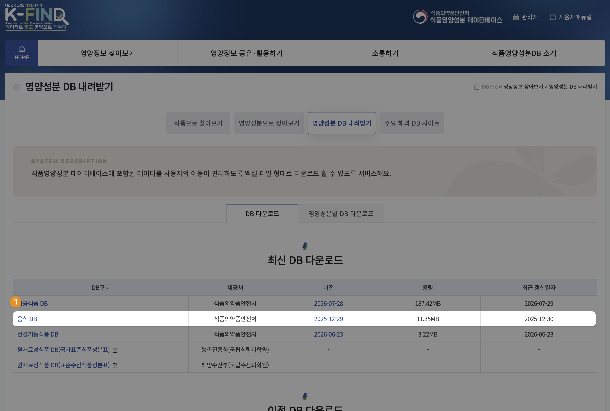

받은 파일을 열면 이렇습니다. 140여 개 컬럼이 늘어서 있고, 우리에게 필요한
것은 그중 10개입니다.

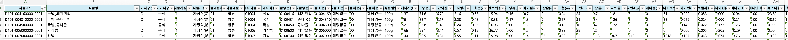

- 다운로드 시점의 DB 버전·일자는 저장소 README에 기록해 두었습니다. 데이터에도 버전이 있습니다.
- 원본을 새로 받으면 DB 버전이 달라 항목이나 수치가 조금씩 바뀔 수 있습니다. 문서의 예시 숫자와 다르게 나와도 정상입니다.

### 11-2. 전처리

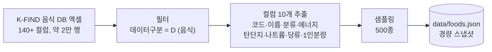

내려받은 엑셀을 `data/food_data.xlsx`로 이름을 바꿔 넣고 전처리를 한 번
실행하면, 위 그림이 그대로 돌아 `data/foods.json`이 다시 만들어집니다.

```bash
docker compose run --rm prepare-data data/food_data.xlsx
```

- 전처리는 `prepare-data` 서비스로 분리돼 있습니다. api·ui처럼 계속 떠 있는 것이 아니라 필요할 때 한 번 돌리고 끝나는 작업이라 `up`이 아니라 `run --rm`으로 부릅니다.
- `prepare-data` 서비스는 **v1.5부터** compose에 정의돼 있습니다. 7장 PR #3에서 더해진 것이라, v0.1·v1.0 상태라면 v1.5를 내려받아 그 폴더에서 실행하세요. 결과물 `foods.json`을 작업 폴더로 복사해 쓰면 됩니다.
- 원본 엑셀은 커밋하지 않습니다. 레포에 남는 것은 결과물 `foods.json`과 전처리 스크립트(`scripts/prepare_data.py`)뿐이고, 이 둘이면 누구든 같은 스냅샷을 다시 만들 수 있습니다. **출처와 가공 과정이 코드로 증명되는 셈입니다.**
- 이 원칙이 4주차에서 본격적인 주제가 됩니다. 다음 주 원본은 187MB라 레포에 넣는 선택지 자체가 없습니다.
