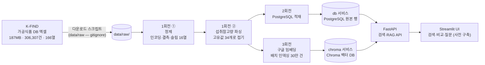
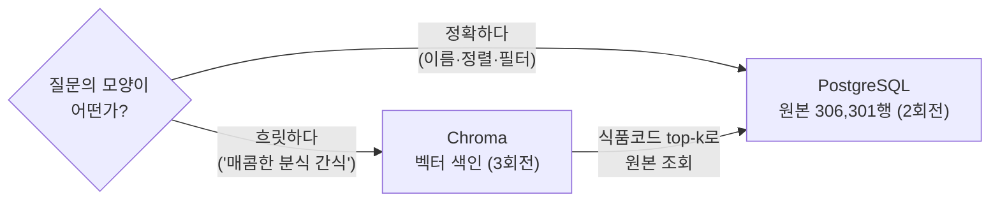
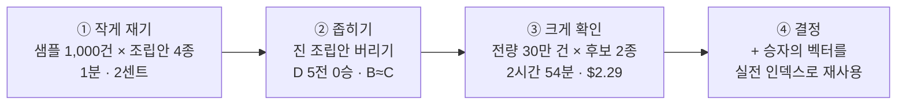

> A반(교육 선행형) 4주차 라이브 세션 교안입니다. 세션은 2시간,
> 멘토 시연 중심으로 진행합니다.  
> 
> 운영안이 4주차에 요구하는 것(CSV/PDF/웹/API 수집, pandas 정제, 한국어 PDF
> 함정 대응, 산출물: 정제 데이터셋)의 주입니다. 3주차에서 예고한 대로, 같은
> 다운로드 페이지의 가공식품 DB(187MB, 306,307건) 원본을 직접 만나 정제하고,
> 정제된 데이터셋 위에 검색 서비스를 세웁니다. 여기서 한 걸음 더 나가,
> 구글 [[embedding|임베딩]]으로 벡터 인덱스를 만들어 의미 검색과
> [[rag|RAG]] 질의응답까지 잇습니다. 30만 건이라는 몸집이 있어야 "다 못
> 넣으니 찾아서 준다"는 RAG의 비용 논리가 실감으로 다가옵니다.  
> 
> 시연 코드·지시 프롬프트·영상은 세션 후 전부 공개되어, 각자의 속도로
> 재현할 수 있습니다.

- **주제**: 데이터 수집·정제와 RAG 검색 (정제되지 않은 실데이터를 서비스 가능한 데이터셋으로, 데이터셋을 의미 검색으로)
- **세션 포커스**: RAG 검색과 비용 사다리, 정제안됨 3종 관찰과 처방(개념 위주), Git Flow 3회전과 회전별 릴리즈(v0.2·v0.3·v1.0)
- **시연 소재**: "가공식품 영양 탐색기". 30만 건 가공식품 정제 → PostgreSQL → 키워드 검색 + 의미 검색·질의응답
- **데이터**: 식약처 가공식품 DB (187.42 MiB, **306,307행 × 166열**, 2026-07-28판, K-FIND 파일 다운로드)
- **산출물**: 전량 306,307건 정제 데이터셋 + 그것을 소비하는 검색·RAG 서비스. 회전마다 릴리즈 태그와 함께 데이터 산출물을 배포합니다
- **시연 저장소**: [week04-food-data-pipeline](https://github.com/2026-ai-service-engineering-a/week04-food-data-pipeline)
- **VOD 사전 시청**: S2 데이터 수집·문서 로딩, 청킹·임베딩
- **운영 방식**: 멘토 시연 → 코드·프롬프트 공개 → 영상 아카이브 (코드 따라 쓰기 없음)

> **이 자료를 내 컴퓨터에서 보기**: 강의 사이트 저장소를 클론해
> [[docker|Docker]]로 띄우면 이 문서와 슬라이드를 로컬에서 볼 수 있고,
> 새 자료가 올라오면 `git pull`로 받아봅니다.
>
> ```bash
> git clone https://github.com/2026-ai-service-engineering-a/ai_service_engineering-track_a
> cd ai_service_engineering-track_a
> docker compose up --build      # http://localhost:4321 접속
> # 새 자료 받기: git pull 한 뒤 다시 docker compose up --build
> ```
>
> 자세한 방법은 [로컬에서 강의 자료 보기](/article/viewing-locally/),
> Docker가 처음이라면 [Docker와 Docker Compose, 처음이라면](/article/docker-basics/)을
> 참고하세요.

> **참고**
>
> 이번 주 파이프라인은 대부분 LLM 없이 돕니다.  
> v0.1 투어, 2회전 PostgreSQL·검색 서비스는 API 키가 없어도 재현할 수 있습니다.  
> 
> LLM이 등장하는 곳은 1회전의 잔여 파싱과 3회전의 RAG 답변 두 군데로,
> `PARSER_MODEL`용 프로바이더 키 하나면 됩니다. 3주차 키를 재사용하세요.
> 1회전 파싱은 고유값 5건 호출이라 1센트도 들지 않습니다.
> 3회전의 임베딩에는 구글 키(`GEMINI_API_KEY`)가 추가로 필요합니다.  
> 
> 다만 무거운 배치(전량 LLM 파싱, 전량 임베딩 인덱싱)는 미리 돌려 둔 산출물을
> 배포하니 직접 돌리지 않아도 됩니다. 배포물을 쓸 때 키가 실제로 필요한 곳은
> 의미 검색의 질의 임베딩(질의 한 건이라 사실상 공짜)과 `/ask`의 답변 생성뿐입니다.

## 1. 세션 목표

**3주차가 깨끗했던 이유를 이번 주에 알게 됩니다.** 3주차의 foods.json은 누가
미리 치워둔 결과였습니다. 오늘은 치우기 전의 원본(깨진 글자, 빈 필드, 자유
텍스트)을 직접 만나 정제 데이터셋으로 만드는 과정을 봅니다. 다만 정제는
"이런 식으로 하면 된다"는 개념과 원칙을 얻는 것이 목적이라 빠르게 지나갑니다.
이번 주의 무게중심은 그 데이터셋 위에 세우는 **RAG 검색**입니다. 30만 건이라는
크기 때문에 생기는 문제(컨텍스트에 다 안 들어가고, 전량 LLM은 비쌉니다)를
검색으로 푸는 것이 오늘의 본론입니다.

세션이 끝나면 다음을 얻게 됩니다.

- 실데이터 정제안됨의 3종 분류와 각각의 처방
  - 인코딩 오염 (BOM, 제어문자, 깨진 문자) → 고칠 수 있으면 고치고, 못 고치면 사유를 붙여 분리
  - 결측 (무작위가 아닙니다. 166열이 **꽉 찬 38열과 텅 빈 125열**로 갈립니다) → 결측 정책과 컬럼 슬림
  - 비정형 (자유 텍스트로 보이는 "1회 섭취참고량") → 파싱: **먼저 세고**, 규칙 우선, LLM은 잔여
- **데이터를 안 보고 견적을 내지 않기**: `nunique()` 한 줄이 30달러를 0.0008달러로 만듭니다. 이번 주에서 가장 값싼 한 줄이고, 비용 사다리의 맨 아랫칸입니다
- 데이터 재현성의 원칙: **원본은 레포 밖, 받는 방법은 레포 안** (raw는 gitignore, 스크립트와 출처가 재현을 보장합니다)
- 저장소의 역할 분담: 정확 질의는 정형 DB(PostgreSQL)가, 의미 검색은 벡터 DB(Chroma)가 맡습니다. 원본은 한 곳에 두고 색인은 옆에 둡니다
- [[llm|LLM]]의 새로운 자리: 런타임 서비스가 아니라 **배치 데이터 처리 도구**로서의 LLM입니다. 3주차 instructor의 재등장이고, 여기에 그 배치를 **접을 수 있는지 먼저 보는 습관**이 붙습니다
- [[rag|RAG]]의 첫 개념: **다 주지 말고, 찾아서 준다**. 30만 건은 컨텍스트에 안 들어갑니다. [[embedding|임베딩]] 검색으로 관련 몇 건만 추려 LLM에 주는 구조가 RAG이고, 그 구조가 곧 비용 절감입니다
- 비용 사다리: **세기(공짜) → SQL(공짜) → 임베딩(싸다) → LLM(비싸다)** 순입니다. 싼 층에서 풀리는 문제를 비싼 층으로 가져가지 않는 것이 이번 주 전체를 관통하는 원칙입니다
- 정제의 검증: 전후 카운트, 파싱 커버리지, 스팟 체크. **정제는 코드가 아니라 리포트로 검증합니다.**

#### 3주차와 달라지는 것

| 구분 | 3주차 (식단 플래너) | 4주차 (가공식품 탐색기) |
| --- | --- | --- |
| 데이터 | 음식 DB (11MB·2만 건·11열, 깨끗함) | **가공식품 DB** (187MB·306,307건·166열, 더러움) |
| 데이터 취급 | 미리 정제된 스냅샷을 소비 | 정제 과정을 개념 수준으로 시연 |
| 저장 | json → 메모리 로드 | **PostgreSQL** + **Chroma** (원본과 벡터 색인) |
| 검색 | 없음 (코드가 후보 주입) | 키워드(SQL) + **의미 검색**(임베딩) |
| LLM의 자리 | 런타임 서비스 (계획자·검증자) | **배치 파싱 + RAG 답변** (검색이 추린 컨텍스트만) |
| 비용 | 호출당 몇 센트 | **견적을 먼저 내고 줄인다** (30달러 → 0.0008달러) |
| 원본의 위치 | 레포 안 (작아서 가능) | **레포 밖**(gitignore), 스크립트가 재현 보장 |

## 2. 브리핑: 더러운 데이터의 세계

### 2-1. 데이터: 3주차와 같은 곳, 다른 몸집

- **출처**: [식품안전나라 K-FIND 식품영양성분 DB 내려받기](https://various.foodsafetykorea.go.kr/nutrient/general/down/historyList.do)
- **다운로드 대상**: "가공식품 DB". 2026-07-28판이 187.42 MiB에 **306,307행 × 166열**로, 3주차 음식 DB(2만 건·11열)의 15배 규모입니다.
- 성격 차이가 더러움의 원인입니다. 음식 DB는 분석 기반(연구 데이터)이고, 가공식품 DB는 **표시사항 수집 기반**(제품 라벨을 긁어모은 것)입니다. 그래서 영양 필드 대부분이 비고, 표기가 제각각입니다.
- 187MB짜리 원본은 레포에 넣지 않습니다. 다운로드 스크립트와 출처 기록이 재현을 보장합니다.

전수 조사한 실물입니다. 숫자는 전부 306,307건 기준 실측치입니다.

| 유형 | 규모 | 실물 |
| --- | --- | --- |
| 인코딩 오염 | **54건 (0.018%)** | NFD 30 · 제어문자 10 · 대체불가 문자 6 · BOM 5 · 앞뒤공백 3 |
| 결측 | **38열은 1% 미만, 125열은 90% 이상** (11열은 100%) | 식별·출처 29열과 라벨 의무 표시 9종은 0.0\~0.03% · 수분 99.8% · 철 98.5% |
| 비정형 | **고유값 34개** | `30g`(44,134건) · `드레싱 15g, 덮밥소스 165g`(9,762건) · `1식`(3,138건) |

세 줄 다 예상과 다릅니다. 더러움은 생각보다 **희귀하고**, 결측은 무작위가
아니라 **제도를 따라 갈리고**, 자유 텍스트인 줄 알았던 열은 사실
**통제 어휘**였습니다. 셋 다 데이터를 열어봐야 알 수 있는 것들이고,
셋 다 처방이 달라집니다.

결측은 특히 그렇습니다. "대부분 비어 있다"가 아니라 **꽉 찬 열과 텅 빈 열로
갈립니다.**

| 결측 | 열 수 | 어떤 열인가 |
| --- | --- | --- |
| 1% 미만 | **38열** | 식별·분류·출처·제조사 등 메타데이터 29열 + 라벨 의무 표시 영양성분 9종 |
| 1\~90% | 3열 | 1회 섭취참고량 18.3% · 식품중량 5.3% · 원산지국코드 78.0% |
| 90% 이상 | **125열** | 나머지 영양성분 전부. 그중 11열은 한 건도 없이 100% |

가운데가 거의 비어 있는 것이 핵심입니다. 어중간하게 찬 열은 셋뿐이고, 나머지
163열은 **거의 다 있거나 거의 다 없거나** 둘 중 하나입니다. 라벨에 적을 의무가
있으면 채워지고, 없으면 수집될 원천 자체가 없기 때문입니다. 결측률이 데이터의
성질이 아니라 **제도**를 비추고 있습니다.

한국어 PDF 함정(줄바꿈, NFD 자모 분해, 스캔 페이지)은 오늘 소재(엑셀)에는
없다고 생각하기 쉽지만, 실제로 줄바꿈 10건과 NFD 30건이 식품명 안에
들어 있습니다. 같은 계열의 문제입니다. 깊은 내용은 VOD S2 문서 로딩 단위로
위임하고, 세션에서는 이 숫자만 짚습니다.

### 2-2. 파이프라인 전체 그림



- 왼쪽 절반(수집에서 파싱까지)이 이번 주 산출물 "정제 데이터셋"이고, 오른쪽 절반(PostgreSQL에서 UI까지)이 그것을 소비하는 서비스입니다.
- 저장소는 두 개입니다. 원본 행은 PostgreSQL에 살고, 벡터 색인은 [[vector-db|벡터 DB]]인 Chroma에 삽니다. 2회전이 [[docker-compose|Compose]]에 `db` 서비스를, 3회전이 `chroma` 서비스를 더합니다. 서비스 추가가 compose.yml 몇 줄인 것, 이것이 compose의 장점입니다. 왜 두 개가 필요한지는 다음 절에서 다룹니다.
- 파이프라인은 **몇 번이고 다시 돌릴 수 있어야 합니다**. 원본이 갱신되면 스크립트 재실행으로 DB와 색인이 재생산됩니다 (재현성)

### 2-3. 저장소는 왜 두 개인가: 정형 DB와 벡터 DB



- 두 저장소는 서로 다른 질문에 답합니다. "이름에 떡볶이가 들어간 것, 나트륨 낮은 순"처럼 조건이 명확한 질의는 PostgreSQL의 일입니다. "매콤한 분식 간식"처럼 글자가 아니라 의미로 물어야 하는 질의는 Chroma의 일입니다.
- 서로 대체하지 못합니다. 벡터 검색은 결과를 유사도 순으로만 주므로 정렬·집계·페이지네이션을 못 하고, SQL은 글자가 다른 동의어("매콤한 분식"과 "떡볶이")를 잇지 못합니다. 대체가 아니라 분담입니다.
- 원본은 한 벌, 색인은 옆에 둡니다. 식품 행의 원본은 PostgreSQL에만 있고, Chroma에는 벡터와 필터용 최소 메타데이터만 둡니다. 의미 검색도 식품코드 top-k를 얻은 뒤 원본 행은 PostgreSQL에서 꺼내 옵니다. 답의 근거가 항상 원본 한 곳에서 나오는 설계입니다.
- PostgreSQL은 2주차의 재등장입니다. 그때는 예약·대화의 쓰기 상태를 맡았고, 이번엔 30만 건 읽기 검색을 맡습니다. compose에 `db` 서비스 블록 하나를 더하는 것도 그때와 같은 모양입니다.
- 2주차엔 왜 PostgreSQL 하나였고, 3주차엔 왜 메모리 로드였고, 이번 주는 왜 DB가 두 개인가. 이 답을 갖고 있으면 10주차 기획에서 저장 고민이 끝납니다.

### 2-4. LLM의 자리: 기본은 배치, 런타임엔 답변 한 곳

- 키워드 검색 서비스에는 LLM이 없습니다. 정제된 데이터와 SQL이면 충분합니다 ("AI가 필요 없는 곳에 안 쓰는 것도 설계")
- LLM은 1회전의 **잔여 파싱**에 등장합니다. 규칙(정규식)이 못 푸는 섭취참고량을 instructor [[structured-output|structured output]]으로 구조화합니다.
- **세고, 규칙 우선, LLM은 잔여** 순서입니다. 앞의 두 층이 공짜라 순서가 곧 비용입니다.
  - **세기**: 30만 건이 실은 34개 문자열이었습니다. 행 단위로 부르면 42,378번이고, 고유값으로 접으면 12번입니다. 3,500배가 `nunique()` 한 줄에 달려 있습니다.
  - **규칙**: 그 34개 중 28개는 정규식이 풉니다. 결정적(같은 입력 → 같은 출력)이고, 무료이고, 즉시입니다.
  - **LLM**: 남은 5개만 갑니다. 유연하지만 비결정적·유료라, 마지막에 씁니다.
- 이 순서가 없으면 "30만 건 LLM 파싱은 얼마죠?"라는 질문에서 시작하게 되고, 그 질문은 처음부터 틀렸습니다.
- 배치 LLM은 런타임 LLM과 다릅니다. 중간 저장·재개가 가능해야 하고, 건너뛴 건 기록하고, 비용 상한을 정해두고 돌립니다. 이 3종 안전장치가 2회전 지시에 그대로 들어갑니다.
- 런타임 LLM은 3회전에 딱 한 곳 돌아옵니다. 질문에 문장으로 답하는 자리이고, 그때도 검색이 추린 몇 건만 들고 옵니다. 이것이 다음 절의 RAG입니다.

### 2-5. RAG: 다 주지 말고, 찾아서 준다

"나트륨 낮은 매콤한 분식 간식 뭐 있어?"에 LLM으로 답하고 싶다고 합시다.
가장 순진한 방법은 데이터를 통째로 컨텍스트에 넣는 것입니다.

- 30만 건은 수백만 토큰이라 애초에 컨텍스트에 들어가지 않습니다. 1,000건만 잘라 넣어도 호출당 수만 토큰이 들어가, 질문 하나에 수십 원씩 나갑니다.
- [[rag|RAG]]는 순서를 뒤집습니다. 먼저 **검색**(retrieval)으로 관련 몇 건을 찾고, 그 몇 건만 컨텍스트로 **증강**(augmentation)한 뒤 **생성**(generation)합니다. 컨텍스트가 수만 토큰에서 수백 토큰으로 줄고, 컨텍스트가 곧 비용입니다.
- 검색의 눈이 [[embedding|임베딩]]입니다. 텍스트를 의미가 보존되는 벡터로 바꾸면 "매콤한 분식"과 "떡볶이"가 가까운 점이 됩니다. 키워드가 못 잇는 것을 의미가 잇습니다.
- 임베딩은 구글 임베딩 API(`gemini-embedding-001`)를 [[litellm|LiteLLM]] 경유로 씁니다. 3주차의 호출 관례 그대로이고, LLM 생성과는 가격 자릿수가 다릅니다 (100만 토큰에 $0.15 수준, 정확한 값은 요금표에서 확인하세요)
- 이번 주의 원칙이 하나로 모입니다. **비용 사다리**, 곧 세기(공짜) → SQL(공짜) → 임베딩(싸다) → LLM(비싸다) 순입니다. 1회전의 "세고, 규칙 우선, LLM은 잔여"와 같은 원칙의 검색판입니다.

## 3. 시연 1: v0.1 투어 + 원본 관찰

### 3-1. v0.1 투어: 명령으로

> **v0.1로 시작하기**: 저장소의 기본 브랜치 `main`은 완성본이라, 그냥 클론하면
> 정답을 받습니다. 시작점은 v0.1 태그에서 작업 브랜치로 잡습니다.
>
> ```bash
> git clone https://github.com/2026-ai-service-engineering-a/week04-food-data-pipeline.git
> cd week04-food-data-pipeline
> git switch -c week04 v0.1   # v0.1 태그에서 작업 브랜치 생성
> ```
>
> 회전마다 릴리즈 태그를 자릅니다: v0.1(시작) → v0.2(정제·파싱) →
> v0.3(검색 서비스) → v1.0(RAG) 순입니다. 각 회전의 실행은 해당 태그에서
> 재현할 수 있고, 회전 사이의 차이는 `git diff v0.2 v0.3`처럼 봅니다.

```bash
cp .env.example .env
docker compose -f docker-compose.yml -f docker-compose.dev.yml up -d
docker compose ps        # api · ui 두 서비스 (db·chroma 서비스는 2·3회전이 추가)
```

- 브라우저에서 UI를 열면 **탭 세 개가 이미 보입니다.** 검색·의미 검색·질문. 다만 셋 다 "N회전에서 살아나는 탭입니다"라고 말할 뿐, 아직 아무것도 못 합니다.
- 위에는 진행 막대가 있습니다. `파이프라인 0/5 단계 완료` 옆에 원본·정제·파싱·적재·색인이 빈 동그라미로 늘어서 있습니다.
- **도착지를 먼저 보여주는 것이 이 화면의 일입니다.** 무엇을 만드는지 모르고 명령을 따라 치는 것과, 어떤 화면이 채워질지 알고 시작하는 것은 다릅니다.
- v0.1이 v1.0이 되는 순간은 코드가 아니라 **이 동그라미들이 채워지고 탭이 하나씩 살아나는 순간**입니다.
- UI가 회전 번호를 아는 것은 아닙니다. **엔드포인트가 답하는지**로 판단합니다. 있으면 쓰고 없으면 안내합니다. 헤드리스 분리가 여기서도 지켜집니다.

```bash
ls data/raw/             # 비어 있음 — 원본 187MB는 레포 밖 (.gitignore)
ls scripts/              # download_file.py · download_api.py · make_sample.py
docker compose exec api uv run python scripts/download_file.py
```

```plaintext
[list] 제공 중인 가공식품 DB 버전을 조회합니다…
[list] 2건
  - 2024-09-25     51.97MB  (식품의약품안전처)
  - 2024-08-01      52.6MB  (식품의약품안전처)

────────────────────────────────────────────────────────────────
내려받기는 브라우저에서 진행합니다. K-FIND가 파일을 주기 전에
기관유형·소속·사용목적을 묻는 짧은 설문을 받기 때문입니다.
```

- **다운로드를 자동화하지 않은 것이 이 스크립트의 요점입니다.** 인증이 아니라 설문이고, 답은 사람이 해야 합니다. 스크립트가 아무 값이나 채워 통과시키는 것은 데이터 제공자와의 약속을 우회하는 일입니다. 대신 그 앞뒤를 자동화했습니다. **안 하기로 한 결정도 코드에 남습니다.**
- Open-API 경로(`download_api.py`)는 대조군입니다. 인증키가 필요하고, 1,000건씩 307번을 부르고, 09\~19시에만 응답합니다. 파일 경로를 기본으로 권장하는 이유가 이 제약들입니다.

브라우저에서 받은 파일을 `data/raw/`에 두고 **검증부터** 합니다.

```bash
docker compose exec api uv run python scripts/download_file.py \
  --verify data/raw/20260728_가공식품DB_306307건.xlsx
```

실제 출력입니다:

```plaintext
[verify] 20260728_가공식품DB_306307건.xlsx
[verify] 크기: 187.42 MiB
[verify] 시트: 가공식품DB(306,307건)
[verify] 행수: 306,307 · 열수: 166
[verify] ✓ 필수 컬럼 6개 확인
[verify] SHA-256: 3861e9df7f9565288ed5c03768a30d0b9780b72639a3d645b337982e72a08c5b
[verify]   이 해시를 README에 적어두면 '같은 원본'을 증명할 수 있습니다
```

- **30초짜리 검증이 3시간짜리 배치를 구합니다.** 파이프라인을 다 돌리고 나서 "컬럼 이름이 바뀌었네"를 알게 되는 것과, 시작 전에 아는 것은 다릅니다. 필수 컬럼 6개는 파이프라인이 반드시 쓰는 것들이라, 이 검사를 통과하면 최소한 스키마 때문에 죽지는 않습니다.
- 행수와 열수가 여기서 처음 화면에 뜹니다. **306,307행 × 166열.** 파일 이름에 적힌 건수와 실제 행수가 맞는지도 이 줄에서 확인됩니다.
- SHA-256을 README에 적어두는 이유는 재현 때문입니다. 원본이 갱신되면 같은 스크립트가 다른 결과를 냅니다. "리포트 숫자가 문서와 다른데요"라는 질문이 나왔을 때, 먼저 물어볼 것은 **같은 파일을 보고 있느냐**입니다. 데이터에도 버전이 있고, 해시가 그 버전의 이름입니다.

### 3-2. 원본 관찰: 샘플로 더러움 실물 확인

레포에 커밋된 `data/sample/raw_sample.csv`(1,000건)를 명령으로 엽니다.

> **이 샘플은 무작위가 아닙니다.** 전수 조사해 보면 인코딩 오염이 306,307건 중
> 54건(0.018%)뿐이라, 무작위로 1,000건을 뽑으면 기대값이 0.18건입니다. 대체로 한 건도
> 안 잡힙니다. 그래서 **희귀 케이스 40건 + 계통 추출 960건**의 층화 샘플로
> 만들었습니다. 일부러 심었다는 사실 자체가 오늘의 첫 교훈입니다.
> **희귀 결함은 찾아 나서야 보입니다.** 결측률·섭취참고량 분포 같은
> "전체의 성질"은 계통 추출 층이 그대로 보존합니다.
>
> 이 샘플도 방금 검증한 그 원본에서 나왔습니다. 같은 해시의 파일로
> `scripts/make_sample.py`를 돌리면 바이트 단위로 같은 CSV가 나옵니다.
> **커밋된 데이터에도 출처가 있어야 합니다.**
>
> ```bash
> docker compose exec api uv run python scripts/make_sample.py \
>   --input data/raw/20260728_가공식품DB_306307건.xlsx
> ```

```bash
# -T는 TTY 할당을 끕니다. heredoc은 stdin이 터미널이 아니라 파이프라,
# 이게 없으면 "cannot attach stdin to a TTY-enabled container"로 죽습니다
docker compose exec -T api uv run python - <<'EOF'
import pandas as pd
df = pd.read_csv("data/sample/raw_sample.csv")

# ① 인코딩 오염 — 대체불가 문자와 BOM
print(df[df["식품명"].str.contains("？|\ufeff", na=False, regex=True)]
        [["식품코드","식품명"]].head(4).to_string(index=False))

# ② 결측률 — 라벨 의무 표시 9종 vs 나머지
rate = df.isna().mean()*100
print("[의무]  " + " · ".join(f"{c} {rate[c]:.1f}%" for c in ["에너지(kcal)","나트륨(mg)","당류(g)"]))
print("[나머지] " + " · ".join(f"{c} {rate[c]:.1f}%" for c in ["식이섬유(g)","칼슘(mg)","수분(g)"]))
print(f"90%+ 결측 열: {(rate>=90).sum()}개 / 전체 {len(df.columns)}열 · 통째로 빈 열: {(rate==100).sum()}개")

# ③ 섭취참고량 — 먼저 세어본다
print(f"고유값 {df['1회 섭취참고량'].nunique()}개 / 빈 값 {df['1회 섭취참고량'].isna().sum()}건")
print(df["1회 섭취참고량"].value_counts().head(3).to_string())
EOF
```

실제 출력입니다:

```plaintext
               식품코드                식품명
P114-103010200-0827       ？스타곰탕 냉면 무김치
P101-104000100-1203     우리밀 한입 스콘 초코칩
P101-406000100-0078 우리밀 한입 스콘 오트밀 레이즌
P101-406000100-0077     우리밀 한입 스콘 쑥고물

[의무]  에너지(kcal) 0.0% · 나트륨(mg) 0.0% · 당류(g) 0.0%
[나머지] 식이섬유(g) 97.1% · 칼슘(mg) 96.9% · 수분(g) 99.6%
90%+ 결측 열: 125개 / 전체 166열 · 통째로 빈 열: 13개

고유값 29개 / 빈 값 172건
1회 섭취참고량
30g      140
70g      112
200ml    101
```

출력에서 읽어야 할 것:

- ①: **두 종류의 오염이 다릅니다.** `？`는 원래 글자가 뭐였는지 알 수 없고(`스팸？마요`는 아마 `스팸&마요`), BOM은 눈에 안 보이지만 문자열 맨 앞에 붙어 있습니다. "복구 가능한 것은 고치고, 불가능한 것은 사유를 붙여 빼놓습니다. 이 갈림이 정제 **정책**의 첫 결정입니다"
- ②: **결측이 무작위가 아닙니다.** 라벨에 반드시 적어야 하는 9종은 0%이고, 나머지 영양성분은 대부분 90%대이며 13열은 통째로 비어 있습니다. "표시 의무가 없는 성분은 수집될 원천 자체가 없습니다. 결측률이 데이터의 성질이 아니라 **제도**를 비추고 있습니다"
- ②의 함정 하나: **비어 있지 않은 열이 9개인 것은 아닙니다.** 식품코드·분류·제조사·출처 같은 메타데이터 29열도 결측이 0건이라, 전량 기준으로 1% 미만인 열이 38개입니다. 그런데도 17열만 싣습니다. "슬림의 기준은 결측률이 아니라 **이 서비스가 쓰는가**입니다. 코드와 이름이 쌍으로 있으면 이름만 싣고, 수입업체·유통업체·데이터생성방법은 검색에도 답변에도 안 씁니다. 결측률은 나머지를 안 실어도 되는 **근거**일 뿐입니다"
- ③: **여기가 오늘의 반전입니다.** 자유 텍스트인 줄 알았던 열의 고유값이 29개이고, 전량 기준으로는 34개입니다. "30만 건이 34개 문자열을 나눠 씁니다. 규정 표준값이라 사실상 통제 어휘였습니다. 이 한 줄이 1회전 견적서를 다시 쓰게 만듭니다"
- 눈으로 보는 일은 이 샘플로 합니다. 187MB 엑셀은 여는 데만 몇 분이 걸려서, 관찰용으로는 커밋된 1,000건이 낫습니다. **큰 데이터는 작은 데이터로 개발합니다.** 다만 개발이 끝난 파이프라인은 전량에 태웁니다.

### 3-3. 오늘의 실행 방식: 전량을 미리 돌려 두고, 산출물을 나눕니다

- 오늘 시연하는 파이프라인은 샘플이 아니라 **전량 306,307건**을 대상으로 돕니다. 화면에 뜨는 리포트 숫자는 전부 전량 기준 실측치입니다.
- 다만 187MB 엑셀 로딩과 30만 건 임베딩은 2시간 세션 안에 끝나는 일이 아닙니다. 무거운 구간은 **미리 돌려 둔 결과**를 보여줍니다. 명령은 전부 그대로 공개하니, 시간과 비용을 쓸 의향이 있으면 같은 명령으로 재현할 수 있습니다.
- 그리고 **회전마다 산출물을 배포합니다.** 정제 parquet, PostgreSQL 덤프, Chroma 인덱스를 받아 `data/` 아래에 풀고 `docker compose up`을 하면, compose가 그대로 컨테이너에 물려 전량 데이터 위에서 검색과 RAG가 바로 돕니다. 임베딩을 직접 돌리지 않아도 의미 검색이 되고, 두 시간을 기다리지 않아도 `/ask`가 답합니다.
- 100MB 이하는 릴리즈 자산으로 붙이고, 그보다 큰 것(전량 벡터 인덱스)은 Google Drive 링크로 배포합니다. 어느 쪽이든 받는 방법은 저장소 README에 적습니다. **원본은 레포 밖, 받는 방법은 레포 안**이라는 원칙이 산출물에도 그대로 적용됩니다.
- 그래서 오늘 이후에 할 일은 재현이 아니라 **관찰**입니다. 별도 제출 과제는 없습니다. 리포트를 읽고, 스팟 체크로 의심하고, 본인 질문을 `/ask`에 던져 보는 쪽에 시간을 쓰세요.

## 4. 시연 2: Git Flow 1회전 (`feature/clean`)

정제와 파싱을 한 회전에서 끝냅니다. 인코딩·결측·컬럼 슬림으로 데이터셋의
모양을 잡고, 이어서 자유 텍스트 "1회 섭취참고량"을 숫자로 바꿉니다.
개념 시연이라 빠르게 가지만, 여기서 **비용 사다리의 첫 실전**이 나옵니다.

**회전 진행 형식** (모든 회전 공통): ① 지시 프롬프트 작성·설명 →
② 무엇이 만들어졌나(코드에서 그 부분 짚기) → ③ 커밋·PR·머지 후 **릴리즈** →
④ 릴리즈 버전에서 명령으로 실행. 3주차 관례에서 한 가지가 바뀝니다.
실행이 릴리즈 뒤로 갑니다. 회전마다 릴리즈를 자르고 그 태그에서 실행하므로,
재현자는 같은 태그를 체크아웃해 같은 명령으로 같은 결과를 봅니다.

> **이 ①\~④는 재현자의 동선이지 만드는 사람의 작업 순서가 아닙니다.**
> 만들 때는 feature 브랜치에서 **검증까지 끝낸 뒤에** 태그를 잘라야 합니다.
> 이 교안을 만들면서 순서를 곧이곧대로 따랐다가 v0.2를 세 번 다시 잘랐습니다.
> 릴리즈 뒤에 실행해 보니 버그가 나왔고, 고칠 때마다 태그를 옮겨야 했습니다.
> 게다가 태그는 브랜치와 달리 원격에서 자동으로 따라오지 않아, 한 번은
> 원격 태그가 옛 커밋을 가리킨 채 남았습니다.
>
> ```bash
> git push origin v0.2
> #  ! [rejected]  v0.2 -> v0.2 (already exists)
> git push origin :refs/tags/v0.2 && git push origin v0.2   # 지우고 다시
> ```
>
> **태그는 "여기서 멈춰도 된다"는 선언입니다.** 멈춰도 되는지 확인한 뒤에
> 붙이세요.
릴리즈에는 코드만이 아니라 **그 회전이 만든 데이터 산출물**도 함께 답니다.
태그 하나가 "이 지점의 코드 + 이 지점의 데이터"를 통째로 가리킵니다.

| 회전 | 브랜치 | 릴리즈 | 함께 배포되는 산출물 |
| --- | --- | --- | --- |
| 1회전 정제 + 섭취참고량 파싱 | `feature/clean` | v0.2 | `week04-v0.2-data.tar.gz` (21MB) |
| 2회전 PostgreSQL 검색 서비스 | `feature/pg-service` | v0.3 → v0.3.1 | `week04-v0.3-data.tar.gz` (34MB, 덤프 포함) |
| 3회전 RAG 검색 | `feature/rag-search` | v1.0 → v1.0.1 | `week04-v1.0-data.tar.gz` (34MB) · `chroma_foods.tar.gz` (1.6GB, Drive) |

### 4-1. 지시 프롬프트

```plaintext
가공식품 데이터 정제 파이프라인을 만들어줘.

[1단계 — 정제]
- 입력: data/raw/*.xlsx 또는 data/sample/raw_sample.csv (같은 166열 스키마)
- pandas 기반. 처리 내용:
  - 문자열 컬럼의 BOM·제어문자 제거, 앞뒤 공백 정리, 유니코드 NFC 정규화
  - 식품명에 대체불가 깨진 문자(？ U+FF1F, U+FFFD)가 포함된 행은 별도 목록으로
    분리 저장 (버리지 말고 reports/rejected.csv로 — 사유 컬럼 포함)
  - 컬럼 슬림: 166열 중 17열만 남김
    식별·분류 6 (식품코드·식품명·대분류·중분류·소분류·제조사명)
    + 라벨 의무 표시 9 (에너지·탄수화물·당류·지방·트랜스지방·포화지방·
      콜레스테롤·단백질·나트륨)
    + 1회 섭취참고량(원문 유지)·식품중량(원문 유지 — '500g' 꼴 문자열이다)
  - 영양 수치 결측은 NULL 유지 (0으로 채우지 마 — 0과 모름은 다르다)
  - 정제 후 빈 문자열은 NULL로 되돌려라. 라이브러리가 None을 ""로 바꾸면
    결측이 "값 있음"으로 둔갑한다

[2단계 — 섭취참고량 파싱]
- 파싱하기 전에 df["1회 섭취참고량"].nunique()를 찍고 그 수를 리포트에 남겨라.
- 파싱은 행이 아니라 **고유값 단위**로 한다. 고유값별로 한 번만 풀고
  결과를 map으로 되붙여라.
- 1차 규칙 파서(정규식): '30g', '200ml' 같은 숫자+단위. 순수 함수 + 유닛테스트
- 2차 규칙 확장: '200ml', '5g(ml)', '250ml(g)'처럼 다른 단위와 단위 병기.
  ml을 g으로 보는 것은 가정이므로 note에 남겨라
- 3차 LLM: 규칙이 못 푼 고유값만. LiteLLM 경유(PARSER_MODEL), instructor 사용.
  출력 스키마 ServingInfo — serving_g(int|None), variants(형태별 g 목록),
  confidence(high/low), note
- 숫자로 환산할 수 없으면 serving_g는 NULL — 지어내지 마
- 대표값 선택은 코드가 한다. LLM이 형태를 갈라내면 첫 형태를 대표로 삼아라
  (모델이 대표를 못 고를 때 정보를 버리지 않기 위해)
- 각 고유값에 파싱 방법(rule_g/rule_unit/llm/none)을 기록해라
- 배치 안전장치: 고유값 캐시(재실행 시 이미 푼 값 건너뜀), --llm-limit, 진행 로그
- 디버그 로그: LOG_LEVEL=debug일 때 LLM 프롬프트 전문·원출력·건별 토큰·비용

- 출력: data/clean/foods_parsed.parquet
  + reports/clean_report.txt (입력·출력 행수, 제외 사유별, 열별 결측률)
  + reports/parse_report.txt (고유값 수, 방법별 커버리지 — 고유값 기준과 행 기준
    둘 다, LLM 호출 수·비용, 순진한 행 단위 배치였다면 들었을 비용 추정)
- 작업 단위마다 커밋 — 문자 정리 → 분리·슬림 → 규칙 파서 → LLM 잔여 → 리포트
```

줄별 의도 포인트:

- **"파싱 전에 `nunique()`를 찍어라"**: 이번 주에서 가장 값싼 한 줄입니다. 이 줄이 없으면 "30만 건이니 LLM 비용이 얼마"라는 계산으로 시작하게 되고, 그 계산은 처음부터 틀렸습니다.
- **"행이 아니라 고유값 단위로"**: 비용 설계가 요구사항 문장이 된 자리입니다. 같은 문자열을 4만 번 다시 물을 이유가 없습니다.
- "버리지 말고 별도 분리": 정제의 제1원칙, **삭제가 아니라 분류**입니다. 몇 건이 왜 빠졌는지 설명 못 하는 정제는 검증이 불가능합니다.
- "0으로 채우지 마": 결측 정책의 핵심 한 줄입니다. 나트륨 '모름'을 0으로 채우면 저나트륨 검색이 거짓말을 합니다. 이 데이터에는 나트륨이 **진짜 0인 제품**(튀김전용유 같은 유지류)이 실제로 있어서, 모름과 0을 섞으면 구분이 영영 불가능해집니다.
- **"빈 문자열은 NULL로 되돌려라"**: 이 줄이 없어서 실제로 한 번 당했습니다. pandas 3.0의 문자열 타입이 `None`을 `""`로 바꾸는 바람에 **결측 55,972건이 "값 있음"으로 둔갑**해 있었습니다. 리포트에 결측률이 안 뜨는 게 이상해서 찾았습니다. 결측 정책은 지시로 선언하는 것만으로는 안 지켜지고, **라이브러리 기본 동작이 조용히 뒤집습니다.**
- "식품중량도 원문 유지": 여기도 한 번 당했습니다. `500g` 같은 문자열인데 숫자로 바꾸려다 306,301건을 전부 NULL로 만들었습니다. 리포트가 "결측률 100%"라고 말해줘서 알았습니다.
- "리포트 2종": 정제는 코드가 아니라 **리포트로 검증**합니다. 전후 카운트가 안 맞으면 어딘가에서 데이터가 새는 것입니다.
- "순수 함수 + 유닛테스트"와 "작업 단위마다 커밋": 2·3주차 관례의 연속입니다.

### 4-2. 무엇이 만들어졌나: 코드에서 이 부분

`git log --oneline`으로 문자 정리 → 분리·슬림 → 규칙 → LLM 순의 커밋을
확인한 뒤, 파일별로 한 군데씩 봅니다.

| 파일 | 보는 곳 | 왜 중요한가 |
| --- | --- | --- |
| `pipeline/textclean.py` | `strip_bom_and_controls(s)` 순수 함수 | "정제의 최소 단위입니다. 문자열 하나 받아 문자열 하나 반환하니 테스트가 쉽습니다" |
| `pipeline/clean.py` | 깨진 문자 행 분리 + 사유 부여 | "삭제가 아니라 분류. rejected에 사유가 남는 지점" |
| `pipeline/clean.py` | `SLIM_COLUMNS` 상수 17개 | "166개 중 17개. 버린 게 아니라 안 실은 것입니다. 원본은 raw에 그대로 있습니다" |
| `pipeline/clean.py` | 빈 문자열을 NULL로 되돌리는 세 줄 | "라이브러리가 None을 ''로 바꿔 결측 5만 6천 건이 사라질 뻔한 자리입니다" |
| `pipeline/serving.py` | `unique()` → 파싱 → `map()` 되붙이기 | **"이 세 줄이 오늘의 하이라이트입니다. 23,047번 부를 일을 5번으로 접습니다"** |
| `pipeline/serving.py` | `--show-residual` | "잔여를 출력하는 명령이 곧 다음 규칙의 설계도입니다" |
| `pipeline/serving.py` | 대표값을 코드가 고르는 분기 | "LLM은 형태를 가르고, 대표는 규칙이 정합니다. 3주차 크로스체크와 같은 자리" |
| `schemas/serving.py` | `class ServingInfo`의 `serving_g: int \| None` | "None이 허용된 스키마. '모름'이 일급 시민입니다" |
| `pipeline/serving_llm.py` | `response_model=ServingInfo` 호출 | "3주차 instructor가 파이프라인 안으로 이사 왔습니다" |
| `pipeline/report.py` | 전후 카운트·결측률·커버리지 집계 | "리포트가 곧 검증. 입력=출력+제외가 안 맞으면 버그입니다" |

### 4-3. 커밋 → PR → 머지 → 릴리즈 v0.2

- 커밋 여러 개가 쌓인 PR("과정이 남는 PR") → CI → 머지 → **v0.2 태그** + `foods_parsed.parquet`·리포트를 릴리즈 자산으로 첨부
- 실제 커밋 이력이 지시 프롬프트의 마지막 줄("작업 단위마다 커밋") 그대로입니다.

```plaintext
d9738df  feat(pipeline): 문자 정리 순수 함수 + 유닛테스트
835cbab  feat(pipeline): 정제 본체 — 분리·슬림·결측 정책 + 리포트
fe6abb0  feat(pipeline): 섭취참고량 파싱 — 세고, 접고, 남은 것만 LLM
f60b46d  feat: data-restore — 받은 산출물을 제자리에 + 1회전 지시 기록
```

- 마지막 커밋이 **`data-restore` 서비스**입니다. 받은 `foods_parsed.parquet`를 `data/dist/`에 두면 `compose up`이 `data/clean/`으로 옮깁니다. 회전이 서비스를 하나씩 더하듯 복원 대상도 하나씩 늘어납니다.
- 회전 하나가 끝나면 릴리즈 하나를 자릅니다. 재현자가 같은 지점에 설 수 있게 하는 장치입니다.

### 4-4. 실행: v0.2에서 실제로 이렇게 처리된다

재현자 시작점: `git checkout v0.2` (이후 회전도 같은 방식이라, 이 안내는 매 실행 절 첫 줄에 반복됩니다)

**정제 (전량)**

```bash
docker compose exec api uv run python -m pipeline.clean \
  --input data/raw/20260728_가공식품DB_306307건.xlsx \
  --output data/clean/foods_clean.parquet
cat reports/clean_report.txt
```

실제 출력입니다 (엑셀 로딩 포함 1.4분):

```plaintext
[clean] 입력: 306,307행 · 166열
[clean] 문자 정리: 2,048행 고쳐서 실음  식품명 1,143 · 제조사명 909
[clean] 출력: 306,301행 · 17열 → data/clean/foods_clean.parquet
[clean] 제외: 6행 → reports/rejected.csv
        - 대체불가 문자 포함: 6
[clean] 열별 결측률(출력 기준 상위): 1회 섭취참고량 18.27% · 식품중량 5.34%
        · 트랜스지방산(g) 0.03% · 나트륨(mg) 0.02%
[check] 306,307 = 306,301 + 6  → OK
[time ] 1.4분
```

- 검산이 맞습니다. 306,307 = 306,301 + 6이니 데이터가 새지 않았습니다. 30만 줄을 사람이 셀 수는 없고, 이 한 줄 검산이 그 일을 대신합니다.
- **제외가 6행입니다.** 30만 건 중 6건. 리포트가 없었으면 이 6건은 영영 안 보였을 것이고, 보이지 않는 6건이 나중에 검색 결과에서 이상한 이름으로 튀어나옵니다.
- 문자 정리와 분리는 다릅니다. 고칠 수 있는 것은 **고쳐서 싣고**, 대체불가 문자 6건만 **분리합니다.** `？`는 원래 글자가 무엇이었는지 복구할 방법이 없기 때문입니다. 고칠 수 있으면 고치고, 못 고치면 사유를 붙여 빼놓습니다.
- 그런데 고친 것이 **2,048행**입니다. 2-1절에서 센 오염은 54건이었는데요. 차이는 **내부 중복 공백**입니다. `흰다리새우살(두절  탈각  내장제거)`처럼 두 칸씩 벌어진 이름이 2,000건 가까이 있습니다. 인코딩 사고는 아니지만 검색에서는 걸림돌이라 같이 정리합니다. **돌려보기 전에는 "오염 54건"이 전부인 줄 알았습니다.**

```bash
cat reports/rejected.csv
```

```plaintext
식품코드,식품명,사유
P114-103010200-0827,？스타곰탕 냉면 무김치,대체불가 문자 포함
P123-201020300-2959,햇반컵반 스팸？마요덮밥,대체불가 문자 포함
P123-201020300-2958,햇반컵반 스팸？김치덮밥,대체불가 문자 포함
P116-705060000-1436,프리미엄 곡물 효소 골드 with 카무트？브랜드 밀,대체불가 문자 포함
P109-102010200-2312,인산 사시사철 무？생강진액,대체불가 문자 포함
P117-100010300-0364,동그란스팸？,대체불가 문자 포함
```

- 30만 건에서 빠진 것이 이 여섯 줄 전부입니다. `스팸？마요`는 `스팸&마요`였을 것이고, `동그란스팸？`은 `동그란스팸®`, `카무트？브랜드`는 `카무트®브랜드`였을 겁니다. 추측은 되지만 확정할 수 없습니다.
- **여기서 정제 정책이 갈립니다.** 추측해서 고치면 데이터가 더 예뻐지지만 근거 없는 값이 들어갑니다. 지어내지 않고 사유를 붙여 빼놓는 쪽을 택합니다. 이 원칙이 파싱의 NULL로, 그리고 3회전 답변의 "모르면 모른다"로 그대로 이어집니다.
- 나중에 "데이터 왜 줄었어요?"라는 질문에 대한 답이 여기 있습니다.

**파싱: 먼저 세어본다**

```bash
docker compose exec api uv run python -m pipeline.serving \
  --input data/clean/foods_clean.parquet
cat reports/parse_report.txt
```

```plaintext
[count] 1회 섭취참고량 고유값: 34개 (306,301행 중)
        └ 30만 건이 34개 문자열을 나눠 씁니다. 규정 표준값이라 사실상 통제 어휘입니다.
[rule ] 1차(숫자+g)      16개 고유값 → 166,991행
[rule ] 2차(단위 병기)    12개 고유값 →  60,291행
[llm  ]   5개 고유값 →  19,909행 · 이번 실행 호출 6건
        입력 2,923 tok · 출력 5,753 tok · $0.0039
[none ]   1개 고유값 + 빈 값 → serving_g = NULL (59,110행)
[done ] rule 227,282 · llm 19,909 · none 59,110 → data/clean/foods_parsed.parquet

[cost ] 이번 실행          $0.0039  (고유값 6건 호출)
[cost ] 행 단위였다면      $16.13   (23,047건 호출 추정)
        └ 4,147배. nunique() 한 줄의 값입니다.
```

- 순서를 보세요. **세고 → 규칙으로 접고 → 남은 것만 LLM.** 이번 주 전체를 관통하는 비용 사다리가 이 다섯 줄에 있습니다.
- 고유값·행수는 몇 번을 돌려도 같지만 **토큰과 비용은 실행마다 달라집니다.** LLM이 비결정적이기 때문이고, 그래서 위 숫자는 "이 정도 자릿수"로 읽어야 합니다. 고유값 6건을 호출한 것도 그렇습니다. 다섯은 값을 얻었고 `1식` 하나는 물어봤지만 null을 받았습니다.
- "30만 건을 LLM으로 파싱하면 얼마죠?"라는 질문 자체가 함정입니다. 데이터를 안 보고 견적을 내면 세 자릿수 배로 틀립니다.
- **1차와 2차의 순서에도 이유가 있습니다.** 2차를 만들기 전에는 잔여가 12개였고, 그중 여섯은 `5g(ml)`처럼 단위만 병기된 것들이었습니다. 정규식 한 줄을 더해 흡수하니 LLM에 갈 것이 6개로 줄었습니다. **싼 층을 한 번 더 손보는 것이 비싼 층을 부르는 것보다 늘 낫습니다.**

**잔여를 눈으로 본다**

```bash
docker compose exec api uv run python -m pipeline.serving --show-residual
```

실제 출력입니다. 2차 규칙까지 적용한 뒤라 여섯 개만 남습니다.

```plaintext
[count] 1회 섭취참고량 고유값: 34개 (306,301행 중)
[residual] 규칙이 못 푼 고유값 6개 — 전부 출력합니다
    9,762  드레싱 15g, 덮밥소스 165g
    8,151  생·숙면 200g, 건면 100g, 당면 30g, 유탕면(봉지)120g, 유탕면(용기)80g
    3,138  1식
    1,640  액상 150ml, 호상 100ml(g)
      355  레토르트 200g 기타 25g
        1  분말 20g, 액상 200ml
```

- **30만 건은 못 보지만 여섯 개는 봅니다.** 보고 나면 무엇이 필요한지 압니다. 다섯은 구조를 뽑아야 하고, 하나는 숫자가 없어서 아무도 못 풉니다.
- 이 화면이 2차 규칙을 만든 근거였습니다. 처음에는 여기에 `5g(ml)`·`250ml(g)` 같은 단위 병기 여섯 개가 함께 있었고, 그걸 보고 정규식을 한 줄 늘렸습니다. **잔여를 출력하는 명령이 곧 다음 규칙의 설계도입니다.**
- 마지막 줄이 재밌습니다. `분말 20g, 액상 200ml`은 306,307건 중 **딱 1건**입니다. 롱테일의 끝이고, 이 1건 때문에 LLM 층이 존재합니다. 규칙으로는 이런 것을 미리 예상할 수 없습니다.
- `1식`은 정직하게 NULL입니다. "1식이 몇 그램인가"는 데이터에 답이 없고, LLM에 물으면 그럴듯한 숫자를 지어냅니다. 스키마의 `int | None`과 지시의 "지어내지 마"가 그 충동을 막습니다.

**LLM이 실제로 받은 것·뱉은 것** (디버그 로그)

```bash
docker compose exec api uv run python -m pipeline.serving \
  --llm-limit 1 --no-cache --dry-run --debug
```

`--dry-run`이 붙은 이유가 있습니다. **이 명령을 그대로 치면 산출물이 망가집니다.**
상한을 1로 걸면 나머지 고유값이 `none`으로 남는데, 그 반쪽 결과가 완성된
30만 행짜리 parquet을 덮어씁니다. 실제로 한 번 당해서 llm 19,909행이
통째로 사라졌고, v0.2를 검증하다 발견했습니다.

지금은 `--dry-run` 없이 상한을 걸면 저장 전에 막습니다.

```plaintext
[abort] --llm-limit 1로는 잔여 6개를 다 못 풉니다.
        지금 저장하면 기존 data/clean/foods_parsed.parquet이 반쪽 결과로 덮입니다.
        관찰만 하려면 --dry-run, 정말 다시 만들려면 상한을 올리세요.
```

**파괴적 동작은 기본값이 아니어야 합니다.** 관찰하려던 명령이 산출물을
망가뜨리면, 그건 쓰는 사람 잘못이 아니라 만든 사람 잘못입니다.

로그 실물입니다. 마침 `1식`이 걸렸습니다.

```plaintext
[debug] PARSER PROMPT ─ system: 너는 식품 표시사항의 '1회 섭취참고량' 원문을
  구조화하는 파서다. 원문에 있는 것만 옮겨라. 지어내지 마라. 숫자로 환산할 수
  없으면 serving_g를 null로 두고 note에 이유를 적어라. 형태가 여럿이면 variants에
  전부 담고, serving_g에는 대표(첫) 형태를 넣어라.
[debug] PARSER PROMPT ─ user: 다음 '1회 섭취참고량' 원문을 구조화해라.
  원문: '1식'
[debug] PARSER RAW OUTPUT: {"serving_g": null, "variants": [], "confidence": "low",
  "note": "원문에는 '1식'만 있으며 중량(그램) 정보가 없어 숫자로 환산할 수 없음."}
[debug] tokens in 474 · out 573
```

- **모델이 지어내지 않았습니다.** `1식`이 몇 그램이냐는 질문에 그럴듯한 수를 채우는 대신 `null`과 이유를 냈습니다. 스키마의 `int | None`이 그 선택지를 열어 두었기 때문입니다. 타입이 없으면 지시만으로는 잘 안 지켜집니다.
- 복합형에서는 반대로 일합니다. `생·숙면 200g, 건면 100g, ...`은 다섯 형태를 전부 갈라내고, **그 한 번의 호출이 8,151행을 채웁니다.** 규칙이 손든 자리에서 LLM이 값을 하는 지점입니다.

**캐시 증명: 같은 명령 재실행**

```bash
docker compose exec api uv run python -m pipeline.serving \
  --input data/clean/foods_clean.parquet
```

```plaintext
[skip ] 캐시에서 6개 고유값 건너뜀 (data/clean/.serving_cache.json)
[llm  ]   5개 고유값 →  19,909행 · 이번 실행 호출 0건 (전부 캐시)
[cost ] 이번 실행          $0.0000  (캐시 적중 — 두 번째부터는 공짜다)
[cost ] 행 단위였다면      $16.13   (23,047건 호출 추정)
```

- 리포트가 **"5개 고유값"과 "이번 실행 호출 0건"을 나눠 말합니다.** 처음엔 한 줄로 뭉뚱그렸다가 캐시 실행에서 "5건 호출"이라고 거짓말하는 것을 보고 갈랐습니다. 누적과 이번 실행은 다른 숫자입니다.

- 캐시에는 **LLM에 물었던 6개**만 들어 있습니다. 규칙이 푸는 28개는 매번 다시 계산해도 공짜라 저장할 이유가 없습니다. **캐시는 비싼 것만 담습니다.**
- 30만 건 파이프라인의 LLM 상태 전부가 여섯 줄짜리 JSON입니다.

**스팟 체크: llm 파싱분 대조**

```bash
docker compose exec api uv run python -m pipeline.spot_check --method llm
```

```plaintext
[spot ] method=llm · 고유값 5개 / 19,909행
  원문: '생·숙면 200g, 건면 100g, 당면 30g, 유탕면(봉지)120g, 유탕면(용기)80g'
     → serving_g=200  variants=5  · 8,151행에 적용
       - 생·숙면 200g   - 건면 100g   - 당면 30g
       - 유탕면(봉지) 120g   - 유탕면(용기) 80g
  원문: '드레싱 15g, 덮밥소스 165g'
     → serving_g=15  variants=2  · 9,762행에 적용
  원문: '액상 150ml, 호상 100ml(g)'
     → serving_g=150  variants=2  (부피 단위(ml)라 g으로 정확 환산 불가
        · 대표값은 첫 형태(코드 판정))  · 1,640행에 적용
```

- llm 파싱분이 고유값 5개뿐이라 **표본 검사가 아니라 전수 검사**입니다. 접었더니 검증까지 싸졌습니다.
- 마지막 항목을 보세요. 모델이 "ml이라 g으로 환산 불가"라고 스스로 적어 왔고, **대표값은 코드가 골랐습니다.** LLM에게는 형태를 갈라내는 일만 맡기고 무엇을 대표로 삼을지는 규칙이 정합니다. 3주차의 "믿되, 재계산하라"와 같은 자리입니다.

**테스트**

```bash
docker compose exec api uv run pytest -q
```

```plaintext
37 passed
```

```plaintext
test_textclean.py::test_strip_bom PASSED
test_textclean.py::test_strip_control_chars PASSED
test_textclean.py::test_detect_broken_char PASSED
test_textclean.py::test_nfc_normalize PASSED
test_serving_rule.py::test_simple_gram PASSED
test_serving_rule.py::test_unit_in_parens PASSED
test_serving_rule.py::test_returns_none_on_failure PASSED
```

**받아서 쓰기**: 1.5분과 파싱을 건너뛰려면 릴리즈 자산 **하나**를 `data/dist/`에 두고 `docker compose up` 하면 됩니다.

```bash
mkdir -p data/dist && mv ~/Downloads/week04-v0.2-data.tar.gz data/dist/
docker compose up --build
```

```plaintext
[restore] week04-v0.2-data.tar.gz 를 확인합니다
[restore]   data/clean/ 에 정제 산출물을 놓았습니다
[restore]   reports/ 에 리포트를 놓았습니다
[restore] 완료 — 2개 배치
```

- 두 번 돌려도 안전합니다. 이미 있으면 `정제 산출물이 이미 있습니다`만 찍고 나갑니다. 복원 스크립트가 멱등하지 않으면 `compose up`을 두 번 못 합니다.

배포물을 다듬는 데 세 번을 고쳤고, 셋 다 같은 실수에서 나왔습니다.

- **처음엔 결과물만 줬습니다.** `foods_parsed.parquet` 하나면 될 줄 알았는데, 이 절의 재실행과 `--show-residual`이 전부 "입력이 없습니다"로 죽었습니다. 파싱의 입력은 `foods_clean.parquet`입니다. **배포물은 "결과"가 아니라 "그 지점을 재현할 수 있는 것"이어야 합니다.**
- **다음엔 파일명이 바뀌었습니다.** GitHub 릴리즈는 점으로 시작하는 이름을 안 받아서 캐시가 `serving_cache.json`으로 올라갔고, 릴리즈 노트에 "이름을 바꾸세요"라고 적을 뻔했습니다. **배포 경로의 사정은 배포 경로가 흡수해야지 받는 사람에게 떠넘길 일이 아닙니다.**
- **그다음엔 개수가 문제였습니다.** 자산 여섯 개를 늘어놓으니 브라우저로 받는 사람은 여섯 번 클릭해야 하고, 하나를 빠뜨려도 조용히 실패합니다. 하나로 묶으니 점 파일명 문제도 같이 사라졌습니다. **받는 사람이 실수할 수 있는 방법은 적을수록 좋습니다.**
- **마지막은 아카이브 안의 모양이었습니다.** 처음엔 `clean/`과 `reports/`를 나란히 뒀는데, 열어본 사람은 어디에 풀지 알 수 없습니다. 하나는 `data/` 아래로 가고 하나는 루트로 가는데 그 사실이 아카이브 어디에도 없으니까요. **저장소 구조를 그대로 담으니** 열어보는 것이 곧 설명이 됩니다.

```plaintext
data/clean/foods_clean.parquet
data/clean/foods_parsed.parquet
data/clean/.serving_cache.json
reports/clean_report.txt · parse_report.txt · rejected.csv
```

셋 다 만든 자리에서는 안 보였습니다. **배포물은 받는 자리에서 확인해야 합니다.** 릴리즈에서 실제로 내려받아 빈 폴더에 풀어 보는 것까지가 배포입니다.

## 5. 시연 3: Git Flow 2회전 (`feature/pg-service`)

정제 데이터셋을 PostgreSQL에 적재하고, 검색 서비스에 연결해 UI를 살립니다.

### 5-1. 지시 프롬프트

```plaintext
2단계: PostgreSQL 적재와 검색 API를 만들어줘.

- docker-compose.yml에 db 서비스 추가: postgres 이미지,
  데이터는 data/pg 볼륨에 영속, api는 DATABASE_URL 환경변수로 접속
- data/clean/foods_parsed.parquet → db의 foods 테이블 적재 스크립트
  - 테이블: foods (정제된 17컬럼 + serving_g, parse_method, note, variants)
  - 한글 컬럼명은 경계에서 영문으로 갈아타라. SQL에 그대로 쓰면 매번 따옴표를
    붙여야 하고 오타가 조용히 지나간다
  - 인덱스: 식품명, 대분류, 나트륨, 당류, 에너지.
    이름 검색은 부분 일치이므로 pg_trgm을 쓴다
  - 30만 행 적재는 INSERT 반복이 아니라 COPY로. 인덱스는 적재 뒤에 만들어라
  - 상한 필터는 NULL을 통과시키지 마라 — '모름'을 '이하'로 세면 안 된다
  - 정렬 키는 화이트리스트로만 받아라 (SQL에 이어 붙는 자리다)
- 검색 API: GET /foods — 이름 키워드, 분류, 나트륨/당류/칼로리 상한 필터,
  정렬(나트륨·당류·에너지), 페이지네이션
- 상세 API: GET /foods/{code} — 100g 기준값과 1회 제공량 환산값을 함께 반환.
  serving_g가 NULL이면 환산값도 NULL로 두고 사유(원문)를 함께 표시 — 지어내지 마
- 시작 시 foods 테이블이 없거나 비어 있으면 안내 메시지와 함께 뜨되 /health는 동작
- LLM 없음 — 이 서비스는 SQL이면 충분하다
- 작업 단위마다 커밋 — db 서비스 → 적재 스크립트 → 검색 API → 상세·환산 순
```

- db 서비스가 이번 주 첫 인프라 추가입니다. 2주차의 PostgreSQL이 같은 모양으로 돌아오고, compose에서는 서비스 블록 하나를 더하는 일입니다. 3회전의 chroma가 이 패턴을 한 번 더 반복합니다.
- "COPY로" 한 줄이 30만 행에서 분 단위와 시간 단위를 가릅니다. 규모가 커지면 "어떻게 넣는가"가 성능 요구사항이 됩니다.
- "LLM 없음" 줄을 일부러 넣습니다. AI를 안 쓰는 결정도 지시에 명시된다는 것을 보여주는 줄입니다.
- 이 줄은 3회전에서 뒤집히는 것이 아니라 정교해집니다. LLM이 돌아오되, 검색이 추린 몇 건만 들고 돌아옵니다.

### 5-2. 무엇이 만들어졌나: 코드에서 이 부분

| 파일 | 보는 곳 | 왜 중요한가 |
| --- | --- | --- |
| `docker-compose.yml` | 새 `db` 서비스 블록 | "2주차 PostgreSQL의 재등장입니다. 서비스 추가는 블록 하나" |
| `api/pipeline/load_pg.py` | `COPY ... FROM STDIN` | "30만 행을 INSERT로 넣으면 커피를 마시고 와야 합니다" |
| `api/pipeline/load_pg.py` | `INDEXES` 리스트 | "30만 건에서 검색이 안 느린 이유가 이 여섯 줄입니다 (pg_trgm + 인덱스 5개)" |
| `api/app/foods.py` | 필터 조합 쿼리 빌더 | "LLM 없이 SQL만. AI가 필요 없는 곳입니다" |
| `api/app/foods.py` | `SORTS` + `SORT_TIEBREAK` | "정렬 키가 하나면 동점 사이 순서가 안 정해집니다" |
| `api/app/foods.py` | 상세의 환산부, `if serving_g is None` 분기 | "1회전의 NULL 정책이 API 응답까지 관통하는 지점" |

### 5-3. 커밋 → PR → 머지 → 릴리즈 v0.3

- PR → CI → 머지 → **v0.3 태그** + `week04-v0.3-data.tar.gz` 첨부. 덤프까지 들어 있습니다. 아직 v1.0이 아닙니다. 마지막 회전이 남았습니다.

### 5-4. 실행: v0.3에서 UI가 살아나는 순간

재현자 시작점: `git checkout v0.3.1`

- 태그가 둘인 이유는 아래 "여기서 발견한 버그"에 있습니다. v0.3을 낸 뒤에 정렬 버그를 찾았고, **태그를 옮기는 대신 hotfix로 v0.3.1을 냈습니다.** 이미 나간 태그를 조용히 바꾸면 "v0.3을 받았다"는 말이 사람마다 다른 뜻이 됩니다. 데이터 자산은 그대로라 v0.3 것을 씁니다.

**db 서비스 기동**

```bash
docker compose up -d     # 2회전이 추가한 db(PostgreSQL) 서비스가 새로 뜹니다
docker compose ps        # api · ui · db 세 서비스
```

- `depends_on`에 `condition: service_healthy`를 겁니다. 기동 순서만 보장하면 api가 **"떴지만 아직 안 받는" db**에 붙어 죽습니다. 컨테이너가 뜬 것과 받을 준비가 된 것은 다릅니다.

**적재와 확인**

```bash
docker compose exec api uv run python -m pipeline.load_pg \
  --input data/clean/foods_parsed.parquet
docker compose exec db psql -U app -d food -c "select count(*) from foods"
```

실제 출력입니다.

```plaintext
[load ] 306,301행 · 21열 → db:5432/food
[copy ] 306,301행 · 3.0초 · 103,560행/초
[index] 6개 · 2.0초
[done ] foods 306,301행 · serving_g 있는 행 247,191 (80.7%)

  count
--------
 306301
```

- 1회전 리포트의 출력 행수와 같습니다. 정제에서 적재까지 숫자가 한 번도 어긋나지 않았다는 뜻입니다.
- **30만 행이 3초입니다.** 초당 10만 행. `INSERT`를 30만 번 부르면 왕복이 30만 번이고 커피를 마시고 와야 합니다. 규모가 커지면 "어떻게 넣는가"가 성능 요구사항이 됩니다.
- 인덱스는 **적재 뒤에** 만듭니다. 먼저 만들면 행마다 트리를 갱신하느라 붓는 동안 계속 느려집니다. 비어 있는 표에 붓고 그다음에 색인하는 것이 순서입니다.
- `serving_g` 있는 행이 80.7%입니다. 1회전에서 rule 227,282 + llm 19,909 = 247,191이었고, 그 숫자가 여기까지 그대로 옵니다.

**받아서 쓰기**: v0.3 릴리즈 자산을 `data/dist/`에 두고 `docker compose up` 하면 됩니다. 손으로 `pg_restore`를 칠 일이 없습니다.

```bash
mkdir -p data/dist && mv ~/Downloads/week04-v0.3-data.tar.gz data/dist/
docker compose up --build
```

```plaintext
[restore]   data/clean/ 에 정제 산출물을 놓았습니다
[restore]   data/dist/foods.dump — db-restore가 이어받습니다
[restore]   reports/ 에 리포트를 놓았습니다
[db-restore] foods.dump 를 복원합니다
[db-restore] 완료 — 306301행
```

- 자산은 **누적**입니다. v0.3 하나에 1회전 산출물까지 들어 있습니다. 여기서부터 시작하는 사람에게 "v0.2도 따로 받으세요"라고 하면 한 번은 반드시 빠뜨립니다.
- 복원 스크립트는 아카이브에 **무엇이 들었는지 tar에게 물어서** 풉니다. 버전을 코드에 박으면 회전마다 스크립트를 고쳐야 하고, 고치는 걸 잊으면 조용히 안 풀립니다.

- **1회전과 방식이 다릅니다.** parquet은 파일을 옮기면 끝이지만 덤프는 PostgreSQL이 받을 준비가 된 뒤에야 넣을 수 있습니다. 그래서 순서를 compose가 강제합니다.

```plaintext
db(healthy) → db-restore(완료) → api
```

- 회전이 서비스를 하나씩 더하듯 **복원 대상도 하나씩 늘어납니다.** 1회전이 parquet을, 2회전이 덤프를, 3회전이 벡터 인덱스를 맡습니다. 셋 다 멱등하고, 없으면 조용히 나갑니다.

**검색 API**

```bash
curl -s "localhost:8000/foods?q=떡볶이&sort=sodium_desc&limit=3" | jq '.total, (.items[] | {name, sodium_mg, serving_g})'
```

```json
2703
{ "name": "떡볶이분말 보통맛", "sodium_mg": 7756, "serving_g": null }
{ "name": "상상떡볶이 카레", "sodium_mg": 6000, "serving_g": null }
{ "name": "오리지널 떡볶이용 소스", "sodium_mg": 5938, "serving_g": 15 }
```

- 떡볶이가 2,703건입니다. 3주차 음식 DB 전체가 2만 건이었으니, 이름에 "떡볶이"가 든 가공식품만으로도 그 10분의 1이 넘습니다. 몸집이 실감 나는 지점입니다.
- 나트륨 7,756mg/100g은 분말이라 그렇습니다. 100g을 그대로 먹는 제품이 아니고, 그래서 1회 제공량이 필요합니다. 그런데 이 행은 `serving_g`가 NULL입니다. **모르는 것은 화면에서도 모른다고 나옵니다.**

**키워드 검색의 한계 ①: 글자가 다르면 0건**

```bash
curl -s "localhost:8000/foods?q=매콤한 분식 간식" | jq '.total'
```

```plaintext
0
```

**키워드 검색의 한계 ②: 글자가 같으면 엉뚱한 게 걸린다**

```bash
curl -s "localhost:8000/foods?q=튀김&sort=sodium_asc&limit=4" | jq '.items[] | {name, category_big, sodium_mg}'
```

```json
{ "name": "연두부튀김", "category_big": "두부류 또는 묵류", "sodium_mg": 0.0 }
{ "name": "해피스푼콩기름튀김전용유", "category_big": "식용유지류", "sodium_mg": 0.0 }
{ "name": "튀김전용콩식용유", "category_big": "식용유지류", "sodium_mg": 0.0 }
{ "name": "건강 튀김유", "category_big": "식용유지류", "sodium_mg": 0.0 }
```

- "나트륨 낮은 튀김"을 찾았더니 **튀김전용유**가 나옵니다. 기름이니 나트륨이 0인 게 맞고, SQL도 틀리지 않았습니다. 글자만 봤을 뿐입니다.
- 두 실패가 짝입니다. 하나는 **의미가 같은데 글자가 달라서** 0건, 다른 하나는 **글자가 같은데 의미가 달라서** 헛것. 이 둘이 3회전의 출발점입니다.
- 참고로 여기 `sodium_mg: 0`은 **진짜 0**입니다. 결측을 0으로 채웠다면 이 화면에서 진짜 0과 모름이 뒤섞여 구분할 방법이 없었을 겁니다. 1회전의 "0으로 채우지 마"가 여기서 값을 합니다.

**여기서 발견한 버그: 1페이지의 행이 2페이지에 또 나온다**

이 화면을 교안에 실으려고 출력을 확인하다 발견했습니다. 같은 질의의 1페이지와 2페이지에 **같은 행이 들어 있었습니다.**

```bash
curl -s "localhost:8000/foods?q=튀김&sort=sodium_asc&limit=4&offset=0" | jq -r '.items[].code'
curl -s "localhost:8000/foods?q=튀김&sort=sodium_asc&limit=4&offset=4" | jq -r '.items[].code'
```

```plaintext
1페이지: P107-101010100-0045  P107-301030100-0069  P107-103010300-0064  P107-301030100-0145
2페이지: P107-301030100-0145  P107-117010100-0001  P107-101010100-0085  P107-101010100-0253
          ^^^^^^^^^^^^^^^^^^ 1페이지에 이미 나온 행
```

- 원인은 `order by sodium_mg asc` 한 줄입니다. **동점 사이 순서를 안 정해 줬습니다.** 나트륨이 정확히 0인 행만 27,219개라 동점은 예외가 아니라 기본입니다.
- 동점 구간에서 순서가 매번 달라도 되면, `offset 4`가 가리키는 자리도 매번 달라집니다. 4번째로 나왔던 행이 다음 질의에서 5번째가 되면 그 행은 두 번 보이고, 대신 다른 행 하나가 영영 안 보입니다.
- 고침은 한 줄입니다. 유일한 값을 마지막 정렬 키로 붙여 **전순서**로 만듭니다.

```python
SORT_TIEBREAK = "code asc"
...
f" order by {SORTS[sort]}, {SORT_TIEBREAK}"
```

- 40건을 10개씩 네 페이지로 받아 고유 40건인지 셌습니다. 고치기 전엔 중복이 있었고, 고친 뒤엔 없습니다.
- 이 버그는 **테스트가 아니라 교안을 쓰다가** 나왔습니다. 출력을 그대로 옮겨 적으려면 같은 명령이 같은 답을 내야 하는데, 두 번 돌려 보니 아니었습니다. **재현 가능한 문서를 쓰는 일이 곧 검증입니다.**

**상세: 파싱 결과가 쓰이는 곳**

```bash
curl -s "localhost:8000/foods/$(curl -s 'localhost:8000/foods?q=오리지널 떡볶이용 소스&limit=1' | jq -r '.items[0].code')" | jq
```

```json
{ "name": "오리지널 떡볶이용 소스",
  "per_100g": { "sodium_mg": 5938.0, "energy_kcal": 336.0 },
  "per_serving": {
    "serving_g": 15,
    "method": "llm",
    "sodium_mg": 890.7,
    "energy_kcal": 50.4,
    "variants": [
      { "form": "드레싱",   "grams": 15,  "sodium_mg": 890.7,  "energy_kcal": 50.4 },
      { "form": "덮밥소스", "grams": 165, "sodium_mg": 9797.7, "energy_kcal": 554.4 }
    ]
  } }
```

- 5,938mg이 890.7mg이 됩니다. 1회전에서 LLM이 갈라낸 "드레싱 15g"이 여기서 일합니다. 덮밥소스로 쓰면 165g이라 9,797.7mg이고, **그 선택지까지 화면에 남습니다.** 대표값 하나로 줄이지 않은 1회전의 결정이 여기서 값을 합니다.

**NULL 케이스**

```bash
curl -s "localhost:8000/foods?q=떡볶이분말 보통맛&limit=1" | jq -r '.items[0].code' \
  | xargs -I{} curl -s localhost:8000/foods/{} | jq '.per_serving'
```

```json
{ "serving_g": null, "note": "1회 제공량 정보 없음 (원문: '')" }
```

- 모르는 것은 모른다고 답합니다. 정직한 NULL이 사용자 신뢰입니다.

**UI 전환**

- UI를 새로고침하면 **빈 상태 화면이 검색 화면으로** 바뀝니다. UI 코드는 v0.1 그대로입니다 (헤드리스 분리의 증명, 3주차와 동일한 장면)
- 검색 → 나트륨 정렬 → 상세에서 1회 제공량 환산을 확인합니다.
- 1회전의 정제와 파싱이 없었으면 이 화면의 숫자는 전부 거짓말이거나 빈칸이었습니다.

## 6. 시연 4: Git Flow 3회전 (`feature/rag-search`)

이번 주의 클라이맥스입니다. 2회전이 남긴 두 실패(0건과 튀김전용유)에서
시작합니다. 정제 데이터셋에 구글 임베딩 벡터 인덱스를 세워 의미 검색을 열고,
검색이 추린 몇 건만 컨텍스트로 LLM을 불러 질문에 답합니다.
**검색 우선, LLM은 답변만.**

여기서 배치가 다시 진짜가 됩니다. 1회전에서는 고유값 34개로 접혔지만,
식품명은 **30만 건이 전부 다릅니다.** 접을 것이 없는 배치가 무엇을 요구하는지가
이 회전의 부수적 주제입니다.

### 6-1. 무엇을 임베딩할 것인가: 돈 쓰기 전에 재본다

> 이 절의 실험 도구(`scripts/embed_probe.py`, chroma 서비스, UI의 **임베딩 비교**
> 페이지)는 **3회전에 함께 들어옵니다.** v0.1·v0.2·v0.3에는 없습니다.
> 실험이 지시보다 먼저지만, 그 실험도 이 회전의 일부입니다.

지시를 쓰기 전에 결정할 것이 하나 있습니다. **무엇을 벡터로 만들 것인가.**
검색 품질은 모델이 아니라 여기서 갈리는데, 답은 데이터마다 다릅니다.

이 데이터를 보면 그럴듯한 첫 후보인 "식품명"이 약합니다.

- 식품명 평균이 **10.4자**입니다. `소금빵`, `스파게티`, `직화짜장덮밥소스`. 이 길이로는 의미 신호가 얕습니다.
- 브랜드·외국어가 섞입니다. `파네토네 클라시코`, `Yeschef BIG TTEOKBOKKI 국물떡볶이`. 사람도 이름만 보고는 무엇인지 모릅니다.

반면 **분류 체계가 훨씬 강한 신호**입니다. 대·중·소·세분류가 전부 결측 0%이고,
소분류만 219종입니다. 사람이 이미 붙여둔 라벨이라, "매콤한 분식 간식"이
어묵·떡류에 닿는 일은 사실상 이 분류가 해줍니다.

그런데 분류를 그대로 이어 붙이면 안 됩니다. 실물을 보면 이렇습니다.

```plaintext
파네토네 클라시코 · 과자류·빵류 또는 떡류 · 해당없음 · 빵류 · 해당없음
직화짜장덮밥소스 · 조미식품 · 소스류 · 소스 · 해당없음
```

- **`해당없음`이 문제입니다.** 30만 건 대부분에 공통으로 들어가는 문자열이 벡터를 전부 같은 방향으로 밀어 유사도를 희석시킵니다. 빈 분류는 문장에서 빼야 합니다.
- **제조사명은 뺄 후보입니다.** 고유 제조사가 32,208개인데, `DE MATTEIS AGROALIMENTARE S.P.A` 같은 긴 법인명이 조립 텍스트의 절반을 차지합니다. "매콤한 분식 간식"에는 노이즈이고, 제조사로 찾는 일은 SQL의 몫입니다. 벡터에서 빼고 메타데이터로 넣어 필터로 씁니다.

정답을 추측하지 말고 **재봅니다.** 다만 처음부터 전량으로 재면 안 됩니다.
실험에도 순서가 있습니다.



- ①에서 **후보를 넓게** 잡습니다. 이 단계는 싸니까 틀린 안도 넣어 봅니다. 틀렸다는 걸 확인하는 것이 목적입니다.
- ②에서 **버립니다.** 여기서 안 버리면 ③의 비용이 후보 수만큼 곱해집니다. 실제로 2종이 $2.29에 2시간 54분이었으니, 4종이었으면 $4.6에 여섯 시간입니다.
- ③은 ①의 결론이 **표본 때문이 아닌지** 확인하는 단계입니다. 1,000건에서 나온 순위는 코퍼스가 얇아서 나온 것일 수 있습니다.
- ④에서 승자의 벡터는 버리지 않습니다. **그대로 실전 인덱스가 됩니다.** 실험 비용이 곧 구축 비용이라, 사실상 공짜로 검증한 셈입니다.

이 순서가 이번 주 다른 결정들과 같은 모양이라는 데 주목하세요. 1회전에서
`nunique()`로 먼저 세고, 규칙으로 접고, 남은 것만 LLM에 보냈습니다. 여기서도
**싼 단계에서 최대한 좁히고, 비싼 단계는 좁혀진 것에만 씁니다.**

#### ① 작게 재기: 샘플 1,000건 × 조립안 4종

```bash
docker compose exec api uv run python scripts/embed_probe.py
```

```plaintext
[조립안 실물] 같은 행을 네 가지로 조립하면
  A name             흰다리새우살(두절  탈각  내장제거  꼬리유) 750G
  B name+cat_raw     … · 수산가공식품류 · 기타 수산물가공품 · 해당없음
  C name+cat         … · 수산가공식품류 · 기타 수산물가공품
  D name+cat+maker   … · 수산가공식품류 · 기타 수산물가공품 · CA MAU SEAFOOD PROC

[평균 길이] A 10.4자 · B 37.0자 · C 34.0자 · D 49.0자
```

1,000건 × 조립안 4종 = 4,005건을 임베딩하고 질의 5개를 던졌습니다.
**59초, 119,284토큰, 2센트.** 전량 인덱싱의 1/100 비용으로 결정 근거를 삽니다.

#### ② 좁히기: 예상이 반쯤 빗나갔습니다

같은 질의에 조립안별 top-3입니다.

```plaintext
■ "매콤한 분식 간식"
  A name             0.756  매운꼬치어묵 / 매콤빠삭먹태 / 대치웅 찹쌀과자(스파이시)
  C name+cat         0.718  Yeschef BIG TTEOKBOKKI 국물떡볶이 / 대치웅 찹쌀과자 / 통모짜 로제떡볶이

■ "나트륨 낮은 튀김 간식"
  A name             0.693  코다노 바삭 통새우 튀김 / 현미고구마스낵 / 오징어튀김
  C name+cat         0.652  통가든 리얼 포테이토 스틱 / 우리밀 한입 스콘 바다김 / 베지 크리스프

■ "밥 대신 간단히 먹는 즉석식품"
  A name             0.713  바로비벼먹는비빔참치매콤한맛(소스류) / 코바웰빙즉석쌀국수 / 케어밀 간편영양죽
  C name+cat         0.755  슬림한끼02 / 한입시래기비빔밥 / 햄고추장비빔밥
```

눈으로 판정한 승패입니다.

| 질의 | 이긴 조립안 | 왜 |
| --- | --- | --- |
| 매콤한 분식 간식 | **C** | A는 먹태·찹쌀과자를 물어왔고, C만 떡볶이를 찾았습니다 |
| 밥 대신 간단히 먹는 즉석식품 | **C** | A는 소스류를 1위로 올렸고, C는 비빔밥 3종을 냈습니다 |
| 나트륨 낮은 튀김 간식 | **A** | A는 새우튀김·오징어튀김, C는 포테이토스틱·스콘 |
| 아이 간식으로 좋은 부드러운 빵 | **A** | A는 식빵·브레드, C는 불고기 부리또 |
| 더울 때 시원하게 마실 음료 | **A** | A는 에이드 2종, C는 커피·매실진액 |

**A 3승, C 2승, D 0승.** "식품명+분류가 무조건 낫다"는 예상은 틀렸습니다.
갈리는 지점이 보입니다.

- 질의가 **부류를 가리키면**, 곧 분식이나 즉석식품처럼 물으면 분류가 이깁니다. 그 부류의 이름이 벡터에 실제로 들어 있으니까요.
- 질의가 **속성·감각을 가리키면**, 곧 부드러운·시원한·튀김처럼 물으면 식품명이 이깁니다. 분류를 붙이면 결과가 그 부류의 평균 쪽으로 끌려가 질의가 요구한 속성이 희석됩니다.

읽어야 할 것이 셋 더 있습니다.

- **점수가 높다고 좋은 게 아닙니다.** A의 유사도가 거의 항상 더 높아서 0.756 대 0.718입니다. 짧은 텍스트일수록 벡터가 한 방향으로 뭉쳐 점수가 올라갑니다. **조립안이 다르면 점수를 서로 비교할 수 없습니다.**
- **`해당없음` 제거 효과는 미미했습니다.** B와 C의 순위가 거의 같아서 0.722와 0.718입니다. 희석을 걱정했지만 실측으로는 작았습니다. 그래도 C를 씁니다. 순위가 같다면 3자 짧은 쪽이 싸니까요.
- **제조사는 확실히 탈락입니다.** D는 한 질의도 못 이겼습니다. 긴 법인명이 텍스트의 30%를 먹고 아무 신호도 주지 않습니다. 예상대로였고, 이번엔 근거가 있습니다.

여기서 **두 개를 버립니다.**

- **D(제조사 포함) 탈락.** 5전 0승입니다. 긴 법인명이 텍스트의 30%를 먹고 아무 신호도 주지 않습니다. 제조사로 찾는 일은 SQL의 몫으로 넘기고, 메타데이터로만 둡니다.
- **B(`해당없음` 포함) 탈락.** C와 순위가 사실상 같으니 **짧은 쪽을 남깁니다.** 품질이 아니라 비용으로 고른 것이고, 30만 건에서는 3자 차이가 토큰 값으로 돌아옵니다.

남은 진짜 질문은 **A냐 C냐** 하나입니다. 후보를 넷에서 둘로 줄였으니 다음
단계가 절반 값이 됩니다.

#### ③ 크게 확인: 전량 306,307건 × 후보 2종

1,000건에서 나온 "A 3승 C 2승"이 정말 조립안 때문인지, 아니면 **코퍼스가 얇아서**인지
확인합니다. 1,000건이면 "떡볶이"가 아홉 개쯤 들어 있을 뿐이라, 좋은 후보가 아예
없어서 A가 이긴 것일 수 있습니다.

```bash
docker compose exec api uv run python scripts/embed_probe.py \
  --input data/raw/20260728_가공식품DB_306307건.xlsx \
  --variants A,C --workers 8 --report reports/embed_probe_full.txt
```

- `--workers 8`이 여기서 처음 나옵니다. 순차로는 초당 52건이라 전량이 서너 시간입니다. 동시 호출로 늘려야 합니다.
- **그런데 여기서 함정을 하나 밟았습니다.** 짧게 재본 처리량은 동시 8에서 초당 351건이었습니다. 그 숫자로 계산하면 전량이 30분입니다. 실제로 돌려 보니 **지속 처리량은 초당 49건**이었고, 전량은 **2시간 54분**이 걸렸습니다.
- 7배 차이입니다. API의 속도 제한은 대체로 **토큰 버킷**이라, 처음 얼마간은 쌓아둔 여유를 쓰고 그 뒤로는 보충 속도에 묶입니다. **짧게 재서 길게 예측하면 안 됩니다.** 몇 분 돌려 보고 그때의 속도로 계산하세요.
- 리포트가 알려준 숫자 하나가 더 있습니다. **호출 5,123회 중 429가 1,319번** 났습니다. 넷에 하나꼴로 벽에 부딪히고 물러섰다가 다시 갔다는 뜻이고, 초당 49건은 그렇게 눌린 결과입니다. 재시도가 없었으면 이 실행은 완주하지 못했습니다.
- 16으로 올리면 429가 급격히 늘어납니다. 동시 수를 더 늘려도 소용없다는 뜻이고, 이 등급에서는 초당 49건이 천장입니다.
- 벡터는 `data/clean/.probe_*.f32`에 memmap으로 씁니다. 30만 × 768 float32가 940MB라 통째로 메모리에 올릴 물건이 아닙니다. 조각내 훑고, 끊기면 이어 받습니다.
- 세 시간짜리 작업이니 **중간 저장이 여기서 값을 합니다.** 실제로 이 실행은 한 번 끊겼다가 체크포인트에서 이어 달렸습니다.

#### 곁길: 병렬로 풀리는 문제와 안 풀리는 문제

"세 시간이면 잘게 쪼개서 병렬로 돌리면 되지 않나?" 자연스러운 질문이고,
답의 앞뒤가 갈립니다.

**임베딩은 병렬화하기에 이상적인 작업입니다.** 텍스트 하나당 순수 함수라,
같은 문자열은 언제 보내든 같은 벡터가 돌아오고 다른 텍스트끼리 서로 영향을
주지 않습니다. 30만 건을 열 조각으로 나눠 열 대에서 돌려도 **결과는 비트 단위로
같습니다.** 벡터 DB에 넣는 순서도 코사인 유사도를 바꾸지 않습니다. 순서에
민감한 작업이라 병렬을 못 하는 것이 아닙니다.

**그런데 안 빨라집니다.** 병목이 우리 쪽이 아니라 저쪽에 있기 때문입니다.
실행 도중에 두 가지를 확인해 봤습니다.

```plaintext
# ① 돌아가는 작업은 그대로 둔 채, 별도로 100건짜리 요청 하나를 더 던져 본다
batch=100  RateLimitError: 429 You exceeded your current quota...

# ② 한 요청에 더 많이 실어 보낸다
batch=250  BadRequestError: 400 BatchEmbedContents ...
```

- **①이 핵심입니다.** 이미 도는 작업이 프로젝트 쿼터를 꽉 채우고 있어서 한 건도 더 안 들어갑니다. 프로세스를 더 띄우든 다른 머신에서 돌리든, **같은 API 키를 쓰는 한 총량은 그대로**입니다. 늘어나는 것은 429 재시도뿐입니다.
- **②는 우회로도 막혔다는 뜻입니다.** 요청 수를 못 늘리면 요청당 개수를 늘리면 될 것 같지만, 250건은 요청 자체가 거절됩니다. 100이 상한입니다.
- 쿼터는 **커넥션이 아니라 프로젝트에** 걸려 있습니다. 수도관이 좁은데 양동이를 여러 개 대는 것과 같습니다. 동시 8에서 초당 49건이고, 16으로 올려도 429만 늘어납니다.

그래서 이 병목은 코드로 못 풉니다. 실제로 처리량을 늘리는 방법은 따로 있습니다.

| 방법 | 효과 | 비고 |
| --- | --- | --- |
| 쿼터 상향 요청 | 직접적 | 콘솔에서 신청하고 승인을 기다립니다 |
| 배치·비동기 전용 API | 클 수 있음 | 임베딩용 배치 엔드포인트가 있는지 확인이 먼저입니다 |
| 로컬 임베딩 모델 | **제한 자체가 없음** | CPU·GPU가 한계입니다. 30만 건이면 오히려 빠를 수 있습니다 |
| 프로젝트를 여러 개로 | 산술적으로 N배 | 쿼터 우회 목적이라면 약관 확인이 먼저입니다 |

마지막 줄이 9-2절의 "빌리는 것과 직접 드는 것"으로 이어집니다. **비용은 API가
싸고 처리량은 로컬이 이깁니다.** 30만 건 인덱싱이 $2.29에 세 시간인데, 로컬
모델이면 전기값에 몇십 분일 수 있습니다. 어느 쪽이 맞는지는 얼마나 자주 다시
돌리느냐가 정합니다. 한 번 만들고 마는 색인이면 세 시간을 기다리는 쪽이 싸고,
매일 갱신해야 한다면 셈이 뒤집힙니다.

**이 곁길이 이번 회전에서 얻는 진짜 감각입니다.** 느린 것을 만나면 먼저
"내 코드가 느린가, 저쪽이 막는가"를 가려야 합니다. 앞이면 병렬화가 답이고,
뒤면 병렬화는 429만 만듭니다.

실제 출력입니다. 306,307건, 2시간 54분, $2.29.

```plaintext
[A] 고유 텍스트 262,205건 / 306,307행 (중복 제거 14.4%)
[C] 고유 텍스트 265,986건 / 306,307행 (중복 제거 13.2%)

■ "매콤한 분식 간식"
  A name       0.806  매콤떡볶이 / 매콤달콤한 떡볶이스낵 / 매콤떡볶이(SPICY RICE CAKE)
  C name+cat   0.747  매콤떡볶이(SPICY RICE CAKE) / 매콤한 국물 떡볶이 / 매콤달콤한 맛 그대로 떡볶이 스낵

■ "더울 때 시원하게 마실 음료"
  A name       0.762  시원한친구[기타음료] / 시원[증류주류] / 시원요[기타 농산가공품류]
  C name+cat   0.739  시원한 하루를 위한 하루한포 쿨대원[다류] / 더위를 시케[기타음료] / 프리미엄레시피[기타음료]

■ "아이 간식으로 좋은 부드러운 빵"
  A name       0.791  부드러운식빵 / 부드러운빵또아[아이스크림류] / 부드러운소금빵
  C name+cat   0.739  The 부드러운 우유식빵 / The 부드러운 오트식빵 / 우리아이입안애소프트롤당근&바나나

■ "밥 대신 간단히 먹는 즉석식품"
  A name       0.782  밥대신 파로 통곡물 즉석밥 / 즉석밥백미 / 즉섭밥잡곡
  C name+cat   0.783  밥대신 현미귀리 곤약즉석밥 / 오늘은현미밥곤약소시지 / 오늘은현미밥 햄야채

■ "나트륨 낮은 튀김 간식"
  A name       0.766  LIGHT&JOY나트륨을줄인통살너겟 / 나트륨을 줄인 부침가루 / 저염돈칩
  C name+cat   0.727  나트륨을줄인비엔나로만든피자붕어빵 / 나트륨을 줄여 짜지않은 여수멸치 / 기름제로 현미칩
```

#### 판정이 뒤집혔습니다

| 질의 | 1,000건 | 306,307건 |
| --- | --- | --- |
| 매콤한 분식 간식 | C | **무승부** (둘 다 떡볶이만 냄) |
| 밥 대신 간단히 먹는 즉석식품 | C | **무승부** (둘 다 즉석밥만 냄) |
| 더울 때 시원하게 마실 음료 | A | **C** |
| 아이 간식으로 좋은 부드러운 빵 | A | **C** |
| 나트륨 낮은 튀김 간식 | A | A |

1,000건에서 A 3승 C 2승이던 것이, 전량에서는 **C 2승 A 1승 무승부 2**가 됐습니다.
C가 지지 않습니다.

**왜 뒤집혔는가.** 1,000건에서 A가 이긴 것은 A가 좋아서가 아니라
**코퍼스에 좋은 후보가 없어서**였습니다. 1,000건에는 떡볶이가 아홉 개쯤 있을
뿐이라, 무엇을 임베딩하든 물어올 게 마땅치 않았습니다. 30만 건이 되자 두
조립안 모두 정답 근처를 찾아냈고, 그때부터 **차이가 나는 곳은 실패의 모양**입니다.

- "더울 때 시원하게 마실 음료"에 A는 **`시원`이라는 이름의 증류주**를 2위로 올렸습니다. 글자는 완벽히 맞고 물건은 술입니다. C는 세 건 모두 음료입니다.
- "부드러운 빵"에 A는 **`부드러운빵또아`**를 2위로 올렸습니다. 이름에 "빵"이 들어간 아이스크림류입니다.
- 두 실패가 같은 모양입니다. **글자는 같은데 종류가 다릅니다.** 2회전에서 SQL이 "튀김"으로 튀김전용유를 물어왔던 그 실패가, 이름만 임베딩하면 벡터 검색 안에서 그대로 재현됩니다. 분류를 함께 넣는 일이 그 재현을 막습니다.

읽어야 할 것이 셋 더 있습니다.

- **점수는 여전히 A가 높습니다.** 5개 중 4개에서요. 증류주 `시원`이 0.762이고 진짜 음료들이 0.739입니다. **높은 유사도가 좋은 결과라는 보장은 없습니다.** 조립안이 다르면 점수는 서로 비교할 수 있는 값이 아닙니다.
- **대분류 집중도는 이제 사람 판단과 일치합니다.** 1,000건에서는 이 지표가 오도했는데(집중도 높은 쪽이 결과는 나빴습니다), 전량에서는 C가 80\~100%로 높고 실제로도 낫습니다. **작은 표본에서는 대리 지표도 못 믿습니다.**
- **"나트륨 낮은 튀김 간식"은 둘 다 실패했습니다.** A도 C도 "나트륨 낮은"만 잡고 "튀김"을 놓쳤습니다. 조건이 둘인 질의를 임베딩 하나로 푸는 데는 한계가 있고, 이런 질의는 **의미 검색으로 후보를 좁힌 뒤 SQL 필터로 나트륨을 거는 쪽**이 맞습니다. 각자의 자리가 여기서도 갈립니다.

#### 방법론이 남기는 것

이 뒤집힘 자체가 이번 회전의 교훈입니다.

- **작은 표본의 순위는 표본 크기의 함수일 수 있습니다.** ①은 후보를 **줄이는** 데 쓰고, 최종 판정은 실제 규모에서 합니다. ①에서 A를 채택했다면 잘못된 결정을 30만 건에 실을 뻔했습니다.
- 그렇다고 ①이 낭비는 아닙니다. ①이 D와 B를 걸러줬기 때문에 ③이 **절반 값**으로 끝났습니다. 넷을 전량으로 돌렸다면 $4.6에 여섯 시간입니다.
- 싼 단계는 **버리는 데**, 비싼 단계는 **고르는 데** 씁니다.

#### ④ 결정과 그 한계

**C(식품명 + 대/중/소분류, `해당없음` 제거)를 채택합니다.** 전량에서 지지 않았고,
지지 않는 이유가 분명합니다. 분류가 "이 물건이 무엇인가"를 못 박아, 이름만으로는
막을 수 없는 종류 착오를 막습니다.

한계도 적어둡니다. 질의는 5개뿐이고 판정은 사람 눈입니다. 정답 집합이 없으니
정밀도를 숫자로 못 냅니다. 조건이 둘인 질의("나트륨 낮은 튀김")는 두 조립안 모두
실패했고, 그건 조립안이 아니라 **검색과 필터의 분담**으로 풀 문제입니다.

그리고 이 실험은 **버려지지 않습니다.** C의 벡터 30만 개가 그대로 실전 인덱스가
됩니다. 검증 비용과 구축 비용이 같은 지출이라, 사실상 공짜로 검증했습니다.

#### 곁길 둘: 벡터 DB는 무엇을 주고 무엇을 가져가는가

프로브가 남긴 `.f32` 파일은 그 자체로 검색 엔진이 됩니다. memmap으로 열어
numpy로 코사인을 재면 **30만 × 768이 0.6초**입니다. DB도, 인덱스 구축도,
서비스 하나도 없이요.

그러면 3회전의 chroma는 왜 필요한가. 두 번 재봤습니다.

| | 전수 비교 (memmap + numpy) | 벡터 DB (Chroma·HNSW) |
| --- | --- | --- |
| 질의 시간 | 600ms | **14ms** (43배) |
| recall@10 | **100%** (정의상 정확) | 80% |
| 영속·공유 | 프로세스마다 1.5GB 적재 | 서비스 하나가 들고 있음 |
| 메타데이터 필터 | 직접 구현 | `where`로 질의와 함께 |
| 증분 갱신 | 파일 다시 만들기 | upsert |

**속도를 정확도로 삽니다.** 이게 벡터 DB의 본질이고, 대조군을 손에 쥐어야
보입니다. 30만 건에서 0.6초가 견딜 만하다면 정확한 쪽이 나을 수도 있습니다.

그리고 **기본값을 믿으면 안 됩니다.** 처음 적재했을 때 recall@10이 68%였습니다.
열 건 중 셋을 놓친 것이고, 실제로 "더울 때 시원하게 마실 음료"의 진짜 1위
(`시원한 하루를 위한 하루한포 쿨대원`, 유사도 0.7388)가 **상위 30위 안에도**
없었습니다. 질의 시점 파라미터(`ef_search`)를 1200까지 올려도 안 나왔습니다.
색인을 만들 때의 문제였기 때문입니다.

```python
HNSW = {"space": "cosine", "max_neighbors": 32,      # 기본 16
        "ef_construction": 200, "ef_search": 200}     # 기본 100
```

세 숫자를 올려 다시 적재하니 **68% → 80%**가 됐습니다. 적재는 초당 1,150건에서
773건으로 느려졌고, 색인은 커졌습니다. **정확도를 시간과 용량으로 산 것**입니다.

- `max_neighbors`는 그래프의 이웃 수입니다. 이게 작으면 그래프가 성기게 이어져, 탐색이 엉뚱한 골짜기에 갇힙니다. 색인을 만들 때 정해지므로 나중에 질의 파라미터로 못 고칩니다.
- 80%도 완벽하지 않습니다. 더 올릴 수는 있지만 적재 시간과 용량이 따라 오릅니다. **어디서 멈출지는 서비스가 정합니다.** 추천 목록이면 80%로 충분하고, 법령 검색이면 어림도 없습니다.
- 근사라는 사실 자체를 UI에 적어 둡니다. 사용자에게 "이건 전수 검색이 아니다"라고 말하지 않는 것은 정직하지 않습니다. 1회전의 NULL 정책과 같은 정신입니다.

**"없어도 되는데 왜 쓰는가"를 답할 수 있어야 도입한 것입니다.** 그리고 도입하면
새 문제가 따라옵니다. 이 대조군을 손에 쥐고 3회전으로 갑니다.

#### ④ 결정과 그 한계

**C(식품명 + 대/중/소분류, `해당없음` 제거)를 채택합니다.** 전량에서 지지 않았고,
지지 않는 이유가 분명합니다. 분류가 "이 물건이 무엇인가"를 못 박아, 이름만으로는
막을 수 없는 종류 착오를 막습니다.

한계도 적어둡니다. 질의는 5개뿐이고 판정은 사람 눈입니다. 정답 집합이 없으니
정밀도를 숫자로 못 냅니다. 조건이 둘인 질의("나트륨 낮은 튀김")는 두 조립안 모두
실패했고, 그건 조립안이 아니라 **검색과 필터의 분담**으로 풀 문제입니다.

그리고 이 실험은 **버려지지 않습니다.** C의 벡터 30만 개가 그대로 실전 인덱스가
됩니다. 검증 비용과 구축 비용이 같은 지출이라, 사실상 공짜로 검증했습니다.

#### 곁길 둘: 그런데 벡터 DB가 왜 필요한가

프로브가 남긴 `.f32` 파일은 그 자체로 검색이 됩니다. memmap으로 열어 numpy로
코사인을 재면 **30만 × 768이 0.6초**입니다. 벡터 DB도, 인덱스 구축도, 서비스
하나도 없이 파일 하나면 됩니다.

- 여기서 자연스러운 질문이 나옵니다. **그럼 3회전의 chroma 서비스는 왜 필요한가.** 0.6초면 충분한데요.
- 답은 검색 속도가 아니라 넷입니다. 이 넷이 필요해지는 순간 직접 만든 memmap은 무너집니다.

| 무엇 | 물어볼 것 |
| --- | --- |
| 영속성 | 프로세스가 죽어도 색인이 남는가 |
| 메타데이터 필터 | 나트륨 500 이하만 걸고 의미 검색을 하는가 |
| 동시 접근 | 여러 워커가 같은 색인을 안전하게 읽는가 |
| 증분 갱신 | 새 제품 1,000건만 더할 수 있는가 |

- 그리고 30만이 3천만이 되면 0.6초가 60초가 됩니다. 전수 비교는 데이터 크기에 비례하지만, [[vector-db|벡터 DB]]의 근사 최근접 이웃 색인은 로그에 가깝게 자랍니다.
- **"없어도 되는데 왜 쓰는가"를 답할 수 있어야 도입한 것입니다.** 이 대조군을 손에 쥐고 3회전으로 갑니다.

**그런데 배포가 이 결정을 한 번 더 뒤집었습니다.** 저장소의 `/probe/compare`와 UI의
**임베딩 비교** 페이지는 memmap이 아니라 **chroma를 봅니다.** `.f32` 두 벌이 1.5GB라
배포할 수 없고, 배포되는 것은 chroma 인덱스 쪽이기 때문입니다.

```bash
curl -sS -G localhost:8000/probe/compare \
  --data-urlencode "q=더울 때 시원하게 마실 음료" --data-urlencode "limit=3"
```

- 배포 인덱스에 A(`foods_name`)와 C(`foods_name_cat`) 컬렉션이 **둘 다** 들어 있어서, 받은 사람도 6-1절의 A/B를 손으로 다시 해 볼 수 있습니다.
- **"무엇을 남에게 줄 수 있는가"가 구현을 정한 사례입니다.** 내 노트북에서 제일 빠른 방법과 남이 재현할 수 있는 방법이 다를 때, 교재에 남는 것은 후자입니다.

- **이것이 "큰 데이터는 작은 데이터로 개발한다"의 임베딩판입니다.** 30만 건에 두 시간과 1GB를 쓴 뒤에 "식품명만 넣을 걸 그랬나"를 고민하는 것과, 2센트로 미리 아는 것은 다릅니다.
- 지시 프롬프트는 이 결과를 반영해 씁니다. **실험이 먼저, 지시가 나중입니다.**

### 6-2. 지시 프롬프트

```plaintext
3단계: 의미 검색과 RAG 질의응답을 추가해줘.

- docker-compose.yml에 chroma 서비스 추가: chromadb/chroma 이미지,
  데이터는 data/chroma 볼륨에 영속, api는 CHROMA_HOST 환경변수로 접속
- 임베딩 인덱스 구축: db의 foods 테이블에서 **식품명 + 대/중/소분류**를
  한 문장으로 합쳐 구글 임베딩(LiteLLM 경유, EMBEDDING_MODEL 환경변수)으로
  벡터화하고, chroma 서비스의 foods 컬렉션에 저장
  - 분류가 '해당없음'이면 그 조각은 문장에서 빼라 (모든 문서에 공통으로 들어가는
    문자열은 벡터를 같은 방향으로 밀어 유사도를 희석시킨다)
  - 제조사명은 벡터에 넣지 말고 메타데이터로만 둬라 (제조사로 찾는 건 SQL의 일)
  - LiteLLM 호출 파라미터 세 가지를 정확히:
    · 차원 축소는 `dimensions=`다. `output_dimensionality=`는 조용히 무시되고
      3072차원이 돌아온다 (인덱스가 4배가 된다)
    · 문서는 task_type="RETRIEVAL_DOCUMENT", 질의는 "RETRIEVAL_QUERY"로 나눠라
    · 축소된 벡터는 L2 norm이 1이 아니다. 저장 전에 정규화해라
  - id는 식품코드, 메타데이터는 where 필터용 분류·나트륨·제조사만.
    검색 응답과 컨텍스트는 식품코드로 foods 테이블 원본 행을 조회해 조립
  - 30만 건은 접을 수 없는 배치다. 배치 안전장치를 제대로 넣어라:
    EMBED_BATCH_SIZE 단위로 묶어 호출, 중간 저장·재개(이미 임베딩된 식품코드
    건너뜀), 진행 로그(건수·경과·예상 잔여), --limit 옵션, 실패 배치 재시도
  - 429가 나면 응답의 retryDelay를 읽어 그만큼 기다려라. 지수 백오프로 찍지 마라
  - reports/embed_report.txt: 건수, 토큰 합계, 비용 합계, 소요 시간, 429 횟수
- 의미 검색 API: GET /foods/semantic — 질의를 임베딩해 top-k 반환.
  LLM 호출 없음
- RAG 질의응답 API: POST /ask — 의미 검색 top-5를 컨텍스트로 LLM에 전달해
  답변 생성 (PARSER_MODEL 재사용)
  - 컨텍스트에 없는 내용은 지어내지 말고 모른다고 답하게 해라
  - 응답에 근거 식품 목록(코드·이름)과 토큰·비용을 함께 반환
- 디버그 로그: LOG_LEVEL=debug일 때 검색 결과·조립된 컨텍스트 전문·비용
- 작업 단위마다 커밋 — chroma 서비스 → 임베딩 인덱스 → 의미 검색 → /ask 순
```

줄별 의도 포인트:

- "chroma 서비스 추가": DB 서버가 필요해지면 compose에 블록 하나를 더합니다. 2회전 db 서비스에 이은 두 번째 반복이고, 인프라 확장이 diff 몇 줄로 리뷰되는 것이 compose를 쓰는 이유입니다.
- "식품명·분류·제조사를 한 문장으로": 무엇을 임베딩하느냐가 검색 품질을 정합니다. 영양 수치는 벡터에 넣지 않습니다. 숫자는 필터의 일이고, 여기서도 각자의 자리가 있습니다.
- "차원 축소는 `dimensions=`다": 세 줄 다 **직접 확인한 함정**입니다. `output_dimensionality=`를 쓰면 예외도 경고도 없이 3072차원이 돌아와, 인덱스가 4배로 커진 걸 나중에 디스크 사용량을 보고서야 압니다. 라이브러리가 모르는 파라미터를 조용히 버리는 것은 흔한 일이고, **결과의 모양을 확인하는 것이 유일한 방어**입니다.
- "task_type을 나눠라": 이 모델은 색인용과 질의용 임베딩이 다릅니다. 같은 문장에 둘을 주면 코사인 유사도가 0.87로, 1.0이 아닙니다. 안 나누면 검색이 미묘하게 나빠지는데 그 사실을 알아채기가 어렵습니다.
- "축소된 벡터는 정규화해라": 3072차원 벡터의 L2 norm은 1.0인데 앞 768만 잘라내면 0.59입니다. 정규화 없이 코사인을 재면 길이가 유사도로 새어 들어옵니다.
- "메타데이터는 필터용만, 원본은 조회": 벡터 DB는 색인이고 원본은 PostgreSQL 한 곳입니다. Chroma의 where 필터로 "나트륨 500mg 이하만" 같은 조건을 의미 검색과 함께 걸고, 답에 쓸 내용은 식품코드로 원본에서 꺼냅니다.
- **"30만 건은 접을 수 없는 배치다"**: 1회전과의 대비를 지시에 못 박습니다. 접을 수 있으면 접고, 못 접으면 안전장치를 답니다. 두 대응이 다릅니다.
- "LLM 호출 없음": 의미 검색까지는 임베딩만으로 됩니다. 챗봇으로 풀고 싶은 문제의 절반은 검색으로 끝납니다.
- "top-5를 컨텍스트로": RAG의 본체가 이 한 줄입니다. 30만 건이 아니라 5건입니다. 컨텍스트가 곧 비용입니다.
- "지어내지 마": 1회전의 NULL 정책이 답변에도 이어집니다. 근거 없는 답은 RAG의 실패입니다.
- "근거 목록 반환": 검증 가능성입니다. 스팟 체크와 같은 정신이고, 답이 어느 행에서 왔는지 추적할 수 있어야 합니다.

### 6-3. 무엇이 만들어졌나: 코드에서 이 부분

| 파일 | 보는 곳 | 왜 중요한가 |
| --- | --- | --- |
| `docker-compose.yml` | 새 `chroma` 서비스 블록 | "서비스 추가가 diff 몇 줄입니다. 인프라 변경도 코드 리뷰를 지나갑니다" |
| `api/pipeline/embed_index.py` | `dedupe()` + `doc_id()` | "id가 내용에서 나와야 하는 이유. 순번이면 부분집합끼리 충돌합니다" |
| `api/pipeline/embed_index.py` | 배치 루프 + `already_indexed()` | "1회전에서 캐시 몇 줄로 끝났던 일이 여기서는 진짜 배치가 됩니다" |
| `api/pipeline/embed_index.py` | `sleep_for_retry()` | "429는 '언제 오라'고 알려 주는 응답입니다. 지수 백오프로 찍지 않습니다" |
| `api/app/semantic.py` | 질의 임베딩 → 컬렉션 top-k 질의 | "검색은 벡터 연산 하나. LLM이 없습니다" |
| `api/app/semantic.py` | `sodium_max` 후처리 + `OVERFETCH` | "의미는 색인이, 숫자는 원본이 답합니다. 같은 값을 두 곳에 두지 않습니다" |
| `api/app/ask.py` | 컨텍스트 조립부 (top-5 식품코드 → 원본 조회 → 프롬프트) | "RAG의 심장. 다 주지 않고 찾아서 줍니다" |
| `api/app/ask.py` | "모르면 모른다" 시스템 지시 | "환각을 막는 최소 장치. 근거 밖 답변을 금지합니다" |
| `api/app/main.py` | 라우터 등록 순서 | "`/foods/{code}`를 먼저 붙이면 `/foods/semantic`이 코드로 잡힙니다" |

### 6-4. 커밋 → PR → 머지 → 릴리즈 v1.0

- 커밋 이력(chroma 서비스 → 임베딩 인덱스 → 의미 검색 → /ask 순) 확인 → PR → CI → 머지 → **v1.0 태그** + PROMPT.md(지시 3개) 확인
- 벡터 인덱스는 1.6GB라 릴리즈 자산에 못 붙입니다. Google Drive 링크를 README에 답니다. **100MB가 GitHub 릴리즈 자산의 실질적 경계이고, 그 위는 다른 방법이 필요합니다.**

### 6-5. 실행: v1.0에서 0건이 답변이 되는 순간

재현자 시작점: `git checkout v1.0.1`

- v0.3 → v0.3.1과 같은 이유로 태그가 둘입니다. v1.0을 낸 뒤 진행 막대 버그를 찾았고, 태그를 옮기는 대신 hotfix를 냈습니다. 자산은 그대로입니다.

**chroma 서비스 기동**

```bash
docker compose up -d     # 3회전이 추가한 chroma 서비스가 새로 뜹니다
docker compose ps        # api · ui · db · chroma 네 서비스 (복원 서비스는 끝나고 빠집니다)
```

**임베딩 인덱스 구축 (전량)**

```bash
docker compose run --rm index-load          # 전량
docker compose run --rm index-load --limit 1000   # 맛보기
cat reports/embed_report.txt
```

`--limit 1000` 실측입니다.

```plaintext
[index] foods_name_cat · gemini/gemini-embedding-001 · 768차원 · 배치 100
[count] 1,000행 → 고유 문장 1,000건 (중복 제거 0.0%)
[index] 이미 있음 0 · 넣을 것 1,000
[embed] 400/1,000 · 36건/초 · 경과 0.2분 · 남음 0.3분
[embed] 1,000/1,000 · 42건/초 · 경과 0.4분 · 남음 0.0분
[embed] 1,000건 · 입력 38,403 tok · $0.01 · 429 재시도 0회
[done ] 컬렉션 1,000건 · 소요 0분
```

전량은 `306,301행 → 고유 문장 265,986건(중복 제거 13.2%)`, `입력 7.6M tok · $1.15`, 소요 **1시간 30분**입니다.

- 비용을 봅니다. 30만 건 전량을 인덱싱하고 **$1.15**입니다. 의미 검색 인덱스 전체가 커피 한 잔 값입니다.
- 그런데 한 시간 반이 걸렸습니다. 여기서 비용과 시간이 갈립니다. **싸다고 빠른 게 아니고, 병렬로 줄일 수 있는 시간도 아닙니다** (6-1절의 곁길)
- **등급을 먼저 확인하세요.** 같은 코드가 무료 티어에서는 분당 100건으로 묶여 51시간이 됩니다. 그리고 배치로 못 피합니다. 100건을 한 요청에 묶어도 쿼터는 요청 수가 아니라 **임베딩한 내용 수**로 세기 때문입니다. `EMBED_BATCH_SIZE`를 키워도 처리량은 그대로입니다.
- 1회전과 비교해 보세요. 거기서는 34개로 접혀 LLM 호출이 6건이었고, 여기서는 26.6만 개가 남습니다. **접을 수 있으면 접고, 못 접으면 안전장치를 답니다.**
- 그래도 **13.2%는 접힙니다.** 이름과 분류가 완전히 같은 제품이 4만 건이고, 같은 문장은 같은 벡터라 두 번 살 이유가 없습니다. 34개로 접히던 것에 비할 바는 아니지만, `nunique()`는 여기서도 한 번 더 나옵니다.
- **id를 순번으로 매기다 한 번 데었습니다.** `C:0`, `C:1`처럼 붙였더니 `--limit 1000`의 `C:0`과 전량 인덱스의 `C:0`이 서로 다른 문장이었습니다. 같은 id에 다른 벡터가 덮이고, 검색은 조용히 엉뚱한 것을 돌려줍니다. **id는 내용에서 나와야 합니다.** 문장의 해시로 바꾸니 어떤 부분집합으로 만들어도 같은 문장이 같은 id를 받습니다.

**받아서 쓰기**: 배포된 인덱스를 `data/dist/`에 두기만 하면 됩니다. 압축을 직접 풀 필요도 없습니다.
[chroma_foods.tar.gz](https://drive.google.com/file/d/1hiS6EaDuYY4P2O5RKoDzN1PL4tEFJNWb/view)
(1.6GB · SHA-256 `f61cfc6e…`)

```bash
mkdir -p data/dist && mv ~/Downloads/chroma_foods.tar.gz data/dist/
docker compose up
```

```plaintext
[restore] chroma_foods.tar.gz 를 풉니다 (1.6GB — 몇 분 걸립니다)
[restore] 완료 — data/chroma/ 에 놓았습니다
```

- 세 회전의 복원이 **한 서비스**에 모입니다. `data-restore`가 parquet도 덤프도 벡터 인덱스도 제자리에 놓고, 그다음 `db-restore`가 덤프를 넣고, `chroma`가 인덱스 위에서 뜹니다.

```plaintext
data-restore(완료) → db(healthy) → db-restore(완료) ┐
data-restore(완료) → chroma                          ├→ api
```

- `depends_on: service_completed_successfully`가 이 순서를 강제합니다. 1.6GB를 푸는 중에 chroma가 열면 **반쯤 풀린 디렉터리**를 봅니다.
- 전부 **멱등**합니다. 두 번째 `compose up`부터는 `벡터 인덱스가 이미 있습니다`만 찍고 나갑니다.
- **"할 일이 없음"은 실패가 아닙니다.** 이걸 한 번 틀렸습니다. 배포물이 없을 때 종료 코드 1을 냈더니 `service_completed_successfully`에 걸려 스택 전체가 안 떴습니다. 직접 만들 사람에게 배포물이 없는 것은 정상인데 말입니다.
- 직접 만들려던 사람도 막습니다. 배포 인덱스가 들어 있는데 `index-load`를 부르면 `[skip] 배포 인덱스가 이미 들어 있습니다 (265,986건)`을 찍고 나갑니다. 순번 id와 해시 id가 섞이면 같은 문장이 두 벌 들어가 검색 결과에 중복이 뜨기 때문입니다.
- 배포물이 없어도 뜹니다. 받는 법을 출력하고 의미 검색만 빠집니다. **없는 기능을 있는 척하지 않습니다.**
- 받을 것은 **하나뿐**입니다. 컬렉션이 만들어진 상태 그대로라 압축만 풀면 검색이 됩니다. 임베딩 API도, 벡터 파일도 필요 없습니다.
- 버전이 어긋날 걱정도 없습니다. chroma를 compose가 띄우고 이미지가 `chromadb/chroma:1.5.9`로 고정돼 있어 **학생이 다른 버전을 쓸 경로 자체가 없습니다.** 인프라를 코드로 고정한다는 것이 이런 뜻입니다.
- 호스트 종류도 상관없습니다. arm64에서 만든 색인을 x86_64에서 열어 같은 결과가 나오는 것을 확인했습니다.
- 그래도 **임베딩과 적재는 나눠 둡니다.** 비싼 것은 임베딩이고 적재는 공짜인데, 둘을 묶으면 적재가 실패할 때마다 임베딩을 다시 하게 됩니다. 그래서 `index-load`는 이미 들어 있는 문장을 다시 사지 않고, 끊기면 그 자리에서 이어 갑니다.

**의미 검색 ①: 0건이 결과로**

```bash
curl -s "localhost:8000/foods/semantic?q=매콤한 분식 간식&limit=3" | jq '.items[] | {name, category_big, sodium_mg, score}'
```

```json
{ "name": "매콤떡볶이(SPICY RICE CAKE)", "category_big": "과자류·빵류 또는 떡류", "sodium_mg": 800.0, "score": 0.7469 }
{ "name": "매콤한 국물 떡볶이", "category_big": "과자류·빵류 또는 떡류", "sodium_mg": 533.0, "score": 0.7444 }
{ "name": "매콤달콤한 맛 그대로 떡볶이 스낵", "category_big": "과자류·빵류 또는 떡류", "sodium_mg": 365.0, "score": 0.742 }
```

- 키워드로 0건이던 질의가 의미로는 결과를 찾아옵니다. 여기까지 LLM은 등장하지 않았습니다. 질의 임베딩 한 번이니 사실상 공짜입니다.

**의미 검색 ②: 튀김전용유는 안 걸리는데, 나트륨은 여전히 안 듣는다**

```bash
curl -s "localhost:8000/foods/semantic?q=나트륨 낮은 튀김 간식&limit=3" | jq '.items[] | {name, sodium_mg, score}'
```

```json
{ "name": "기름제로 현미칩 블랙페퍼 앤 솔트", "sodium_mg": 464.0, "score": 0.6993 }
{ "name": "팝타임 히말라야 핑크솔트 할라피뇨 (198g)", "sodium_mg": 452.0, "score": 0.6929 }
{ "name": "팝타임 씨솔트 (28g)", "sodium_mg": 571.0, "score": 0.6922 }
```

- **절반은 해결됐습니다.** 같은 "튀김"인데 기름이 아니라 간식이 나옵니다. 임베딩은 "튀김전용유"가 조리 도구이고 "현미칩"이 간식이라는 것을 문장 전체의 맥락에서 구분합니다. 2회전의 두 실패 중 하나가 여기서 풀립니다.
- **절반은 안 풀립니다.** 3위가 571mg입니다. "나트륨 낮은"이라고 물었는데요. 임베딩은 그 말을 **의미의 방향**으로만 쓰지 부등호로 읽지 못합니다. 실제로 "솔트"가 들어간 이름들이 올라왔습니다. 나트륨을 말했으니 소금과 가까운 것이 당연합니다.
- 그래서 숫자는 필터로 겁니다. 6-1절에서 "조건이 둘인 질의는 조립안이 아니라 **검색과 필터의 분담**으로 풀 문제"라고 적어 둔 것이 이 자리입니다.

```bash
curl -s "localhost:8000/foods/semantic?q=매콤한 분식 간식&limit=3&sodium_max=400" \
  | jq '.items[] | {name, sodium_mg}'
```

```json
{ "name": "매콤달콤한 맛 그대로 떡볶이 스낵", "sodium_mg": 365.0 }
{ "name": "떡볶퀸X사과떡볶이 Limited Edition #떡볶퀸어묵 조금매운맛", "sodium_mg": 372.0 }
{ "name": "급식대가 매콤달콤떡볶이", "sodium_mg": 284.0 }
```

- **이 필터는 chroma가 아니라 PostgreSQL이 겁니다.** 벡터 DB의 `where`로도 걸 수 있지만, 그러려면 나트륨을 색인 메타데이터에 복사해 둬야 하고 그 순간 같은 값이 두 곳에 삽니다. 원본이 갱신되면 색인의 사본은 조용히 옛날 값이 됩니다.
- **의미는 색인이 알고, 숫자는 원본이 압니다.** 각자 아는 것만 대답하게 두고, 걸러낼 것을 감안해 넉넉히 받아 옵니다.
- NULL은 통과시키지 않습니다. 2회전 `/foods`와 같은 규칙입니다. '모름'을 '이하'로 세면 저나트륨 검색이 거짓말을 합니다.

**RAG 질의응답: 검색이 추린 5건만 들고**

```bash
curl -s -X POST localhost:8000/ask -H 'Content-Type: application/json' \
  -d '{"q": "나트륨이 낮은 매콤한 분식 간식 추천해줘"}' | jq
```

```json
{
  "answer": "매콤한 분식 간식 중 나트륨이 가장 낮은 제품은 떡볶퀸X사과떡볶이 Limited Edition #떡볶퀸어묵 조금매운맛으로 100g당 나트륨 372mg이며 1회 제공량 정보 없음입니다. 참고로 저당떡볶이 매콤후추맛은 100g당 447mg, 저당 매콤달콤 학교앞떡볶이양념은 100g당 2226mg로 1회 15g당 약 334mg입니다.",
  "sources": [
    { "code": "P123-217020300-0762", "name": "저당떡볶이 매콤후추맛", "score": 0.721 },
    { "code": "P123-217020300-0763", "name": "저당떡볶이 매콤달콤한맛", "score": 0.7177 },
    { "code": "P123-217020300-0425", "name": "떡볶퀸X사과떡볶이 Limited Edition #떡볶퀸어묵 조금매운맛", "score": 0.7132 },
    { "code": "P113-206020400-6804", "name": "저당 매콤달콤 학교앞떡볶이양념", "score": 0.7089 },
    { "code": "P101-501000500-5658", "name": "WELLISH 소이페퍼 떡볶이", "score": 0.7087 }
  ],
  "usage": { "input_tok": 612, "output_tok": 1824, "cost_usd": 0.0038, "model": "openai/gpt-5-mini" }
}
```

- 마지막 줄이 재밌습니다. 2,226mg짜리를 **1회 15g으로 환산해 334mg**이라고 말합니다. 1회전 LLM이 `드레싱 15g`을 갈라낸 것이 여기까지 와서 문장이 됩니다. 양념은 100g을 그대로 먹는 물건이 아니니까요.

- 컨텍스트는 5건, **612토큰**입니다. 30만 건 중 1,000건만 잘라 넣어도 호출당 4만 토큰으로 60배이고, 전량은 애초에 들어가지도 않습니다. 인덱스에 30만 건이 있든 3천만 건이 있든 LLM이 받는 것은 늘 다섯 건입니다. **검색이 컨텍스트를 만들고, 컨텍스트가 비용을 정합니다.**

**모르는 것은 모른다고: 근거 밖 질문**

```bash
curl -s -X POST localhost:8000/ask -H 'Content-Type: application/json' \
  -d '{"q": "이 중에 비건 인증을 받은 제품은?"}' | jq '.answer'
```

```json
"제공된 자료로는 답할 수 없습니다."
```

- 1회전의 정직한 NULL이 문장이 된 모습입니다. 근거에 없으면 없다고 답합니다. 166열 중 17열만 실었으니 없는 정보가 많고, 없는 것을 없다고 말하는 것이 이 시스템의 일입니다.

**디버그 로그: 조립된 컨텍스트 실물**

`.env`에 `LOG_LEVEL=debug`를 두고 질문한 뒤 api 로그를 봅니다.

```bash
docker compose logs api | grep -A 12 "SEMANTIC top"
```

```plaintext
DEBUG:ask:SEMANTIC top-5 — 질의 임베딩 1회
DEBUG:ask:  P123-217020300-0762  저당떡볶이 매콤후추맛  score 0.7210
DEBUG:ask:  P123-217020300-0763  저당떡볶이 매콤달콤한맛  score 0.7177
DEBUG:ask:  P123-217020300-0425  떡볶퀸X사과떡볶이 Limited Edition #떡볶퀸어묵 조금매운맛  score 0.7132
DEBUG:ask:RAG CONTEXT (5건):
1. [P123-217020300-0762] 저당떡볶이 매콤후추맛 (즉석식품류 / (주)푸드엠코리아)
   100g당 — 에너지 128kcal · 나트륨 447mg · 당류 0.7g
   1회 제공량 정보 없음
2. [P123-217020300-0763] 저당떡볶이 매콤달콤한맛 (즉석식품류 / (주)푸드엠코리아)
   100g당 — 에너지 120kcal · 나트륨 469mg · 당류 0.9g
   1회 제공량 정보 없음
```

- LLM이 실제로 받은 것이 30만 건이 아니라 이 다섯 줄임을 눈으로 확인합니다. RAG의 전부가 이 로그 안에 있습니다.
- `1회 제공량 정보 없음`이 컨텍스트에 그대로 들어갑니다. 0으로 채우지 않았으니 LLM도 "정보 없음"이라고 답할 수 있습니다. **1회전의 NULL 정책이 프롬프트까지 관통합니다.**
- 답이 이상할 때 물을 것은 셋입니다. 검색이 엉뚱한 다섯 건을 집었는지, 원본 값이 애초에 비어 있었는지, LLM이 근거를 벗어났는지. **컨텍스트를 볼 수 없는 RAG는 고칠 수도 없습니다.**

**UI 마지막 전환**

- UI를 새로고침하면 "질문하기" 탭이 살아납니다. UI 코드는 여전히 v0.1 그대로입니다.
- 진행 막대가 **5/5**가 됩니다. v0.1에서 빈 동그라미 다섯 개였던 그 자리입니다.

**여기서 마지막 버그가 하나 나왔습니다.** 배포본으로 재현한 화면은 5/5가 아니라 **4/5**였습니다. 정제·파싱·적재·색인은 다 채워졌는데 **원본 칸만 빈 동그라미**였습니다.

- 진행 막대는 산출물 파일이 있는지로 그립니다. 그런데 배포본을 받아 쓰는 사람은 187MB 원본을 받을 일이 없습니다. 그 칸은 영원히 안 채워집니다.
- **뒷단계 산출물이 있는데 앞단계가 비어 있으면 "덜 됐다"가 아니라 "그 단계를 남이 대신했다"는 뜻입니다.** 진행 막대는 단조로워야 합니다.
- 그렇다고 안 돌렸다는 사실을 지우지는 않습니다. 그 칸 캡션에 `(배포본)`을 붙입니다. **채워진 것과 남이 채워 준 것은 다르고, 화면은 둘 다 말할 수 있어야 합니다.**
- 고친 자리가 `ui/app.py`가 **아니라** `api/app/status.py`인 것도 눈여겨볼 만합니다. 화면 문제인데 서버에서 고쳤습니다. 진행 막대의 근거는 API가 주는 값이고, UI는 그리기만 합니다. **헤드리스 분리는 이럴 때 값을 합니다.**

## 7. 저장소 설계: v0.1에서 v1.0으로

**저장소**: [week04-food-data-pipeline](https://github.com/2026-ai-service-engineering-a/week04-food-data-pipeline),
조직 소유, template repository로 지정합니다.

### 7-1. v0.1: 시연 시작점 (사전 준비)

```plaintext
week04-food-data-pipeline (v0.1)
├── api/
│   ├── app/main.py          # FastAPI — /health 동작, /foods는 "데이터 없음" + 단계 체크리스트
│   ├── tests/test_health.py # 빈 상태도 정상 응답이어야 한다
│   ├── Dockerfile
│   └── pyproject.toml       # pandas, pyarrow, openpyxl, litellm, instructor,
│                            #   fastapi, psycopg, chromadb, pytest
├── ui/
│   ├── app.py               # Streamlit (사전 구축) — 진행 막대 + 검색·의미 검색·질문 3탭
│                            #   탭은 처음부터 보이고, 못 쓰는 탭은 무엇을 할 자리인지 알린다
│   └── Dockerfile
├── data/
│   ├── sample/
│   │   └── raw_sample.csv   # 원본에서 뽑은 층화 샘플 1,000건 (166열, 더러움 보존 — 커밋됨)
│   ├── raw/                 # 전체 원본 자리 (.gitignore — 187MB는 레포 밖)
│   ├── clean/               # 파이프라인 출력 자리 (.gitignore)
│   ├── pg/                  # db 서비스 볼륨 자리 (.gitignore — 2회전이 채움)
│   └── chroma/              # chroma 서비스 볼륨 자리 (.gitignore — 3회전이 채움)
├── reports/                 # 리포트 자리 (.gitignore — 릴리즈 자산으로 배포)
├── scripts/
│   ├── download_file.py     # 버전 목록 조회 + 받은 파일 검증 (기본 권장 경로)
│   ├── download_api.py      # Open-API 경로 (인증키 필요, 09\~19시 제한 안내 출력)
│   └── make_sample.py       # 원본 → 층화 샘플 1,000건 재생성
├── docker-compose.yml       # api + ui (db는 2회전, chroma는 3회전이 추가)
├── docker-compose.dev.yml
├── .env.example             # PARSER_MODEL, EMBEDDING_MODEL, 키, DB 접속값,
│                            #   배치 상한 기본값, LOG_LEVEL
├── PROMPT.md                # 자리만
└── README.md                # 데이터 출처·버전(2026-07-28판), 전수 조사 결과,
                             #   샘플 설계 근거, 회전별 산출물 배포 링크
```

clone 직후 동작하는 것:

- `compose up` → api(`/health`)와 ui(빈 상태 화면) 기동
- 샘플 원본으로 더러움 관찰이 가능합니다 (다운로드 없이 시연 도입부 성립)
- 다운로드 스크립트 실행 가능 (실행은 사용자 선택, 원본은 레포 밖)

### 7-2. v1.0: 시연 종료점

- 릴리즈 태그 사다리: v0.1 → v0.2 → v0.3 → v1.0, 그리고 hotfix v0.3.1 · v1.0.1. 태그 하나가 회전 하나의 완결 상태이고, 교안의 실행 블록과 1:1로 대응합니다
- 태그마다 그 회전의 **데이터 산출물**이 붙습니다. v0.2의 parquet과 v0.3의 pg 덤프는 릴리즈 자산으로, v1.0의 벡터 인덱스는 1.6GB라 Google Drive로 갑니다. 링크는 README에 모읍니다
- docker-compose.yml은 2회전의 `db`, 3회전의 `chroma` 서비스가 더해져 api·ui·db·chroma 네 서비스가 됩니다. 인프라 변경도 PR diff에 남습니다
- `pipeline/`: textclean·clean·serving·serving_rule·serving_llm·report(1회전), load_pg(2회전), embed_index(3회전), spot_check와 CLI
- `reports/` 출력 체계: clean_report·parse_report·embed_report·rejected.csv (정제는 리포트로 검증)
- `/foods` 검색·상세, `/foods/semantic` 의미 검색, `/ask` RAG 질의응답 API 동작. UI가 검색·질문 화면으로 전환됩니다 (UI 코드는 v0.1 그대로)
- `tests/`: 문자 정리·규칙 파서 유닛테스트, 빈 상태 API 테스트
- `PROMPT.md`: 지시 프롬프트 3개 누적, PR 3개 머지 이력

## 8. 재현할 때 유의할 점

- **무거운 구간은 다시 돌리지 않아도 됩니다.** 회전별 산출물(정제 parquet, pg 덤프, Chroma 인덱스)이 배포됩니다. 받아서 `data/` 아래에 풀고 `docker compose up`이면 전량 데이터 위에서 v1.0이 돕니다. 아래 항목들은 직접 돌려 보기로 한 사람을 위한 안내입니다.
- **엑셀 로딩이 오래 걸립니다.** 187MB xlsx는 pandas 로드만으로도 상당한 시간이 듭니다. 파이프라인을 고칠 때는 `data/sample/raw_sample.csv`(1,000건)로 반복하고, 확정된 뒤에 전량에 한 번 태우세요.
- **파싱 비용은 걱정하지 않아도 됩니다.** 고유값이 34개뿐이라 LLM 호출이 6건입니다. 다만 `--llm-limit`은 그대로 두세요. 다음 버전 DB에서 고유값이 34개일 보장은 없습니다.
- **임베딩은 싸지만 오래 걸리고, 등급이 시간을 정합니다.** 30만 건 전량이 $1.15인데 유료 등급에서 한 시간 반, **무료 티어에서는 51시간**입니다. 무료 티어 쿼터는 분당 임베딩 내용 100건이고 배치로 못 피합니다. 시작 전에 결제 연결을 확인하세요. 429가 나면 응답의 `retryDelay`를 읽어 그만큼 기다리면 됩니다.
- **임베딩 차원은 줄여서 저장하되 파라미터 이름을 확인하세요.** LiteLLM에서는 `dimensions=768`입니다. `output_dimensionality=`는 예외도 경고도 없이 무시되고 3072차원이 돌아와 인덱스가 4GB에 가까워집니다. 그리고 잘린 벡터는 L2 norm이 0.59라, 저장 전에 정규화해야 코사인이 맞습니다.
- **배포된 인덱스와 같은 설정을 쓰세요.** 직접 인덱싱한 벡터와 배포된 벡터를 섞으면 안 됩니다. 모델과 차원이 다르면 유사도 점수가 의미를 잃습니다. 컬렉션을 지우고 한 설정으로 다시 채우는 편이 낫습니다.
- **문서의 수치는 예시입니다.** 고유값 34개, 결측률, 제외 6건은 2026-07-28판 실측치입니다. 비용과 소요 시간은 모델·요금표·네트워크에 따라 달라집니다. 본인 실행의 리포트 숫자가 정답입니다.
- **데이터 버전을 확인하세요.** 저장소 README에 다운로드 시점의 DB 버전(2026-07-28판, 306,307건)과 SHA-256이 적혀 있습니다. 원본을 새로 받으면 행 수와 수치가 달라져 리포트가 이 문서와 어긋날 수 있습니다.
- **원본은 레포 밖에 둡니다.** 187MB를 커밋하지 마세요. `data/raw/`는 gitignore돼 있고, 재현은 다운로드 스크립트가 보장합니다.

## 9. 마무리

이번 주를 관통한 원칙은 셋입니다. 비용 사다리(세기 → SQL → 임베딩 → LLM),
리포트로 하는 검증, 원본 한 벌과 그 옆의 색인. 셋 다 30만 건이라는 몸집이
있어야 실감이 나는 이야기였고, 그래서 이번 주는 샘플이 아니라 전량으로
돌렸습니다.

가장 남기고 싶은 것은 사다리의 맨 아랫칸입니다. `nunique()` 한 줄이 30달러를
0.0008달러로 만들었습니다. **비싼 도구를 잘 쓰는 법보다, 비싼 도구가 필요한
자리를 줄이는 법이 먼저입니다.**

**별도 제출 과제는 없습니다.** 대신 배포된 산출물로 v1.0을 띄워 본인이 궁금한
질문을 `/ask`에 던져 보세요. 답이 이상하면 `sources`의 식품코드로 PostgreSQL
원본 행을 조회해 어디서 어긋났는지 추적할 수 있습니다. 검색이 엉뚱한 다섯 건을
집었는지, 원본 값이 애초에 비어 있었는지, LLM이 근거를 벗어났는지가 갈립니다.
그 추적 한 번이 오늘 배운 것을 전부 한 번에 씁니다.

### 9-1. 규모를 직접 겪어 보려면 (선택)

- 원본 187MB를 직접 받아 세 회전을 완주해 보는 것은 여전히 값어치가 있습니다. 3주차의 "돌려본다"와 달리 "규모를 겪는다"가 목적입니다. 30만 건에서 걸리는 시간, 비용 계산, 재개의 고마움은 겪어야 압니다.
- 다운로드는 K-FIND 파일 경로를 권장합니다. 파일을 받기 전에 기관유형·사용목적을 묻는 짧은 설문이 있고, 그건 사람이 통과해야 합니다. Open-API 경로는 인증키가 필요하고 09\~19시 제한에 유의합니다.
- 전량을 다 돌릴 필요는 없습니다. `--limit`으로 일부만 돌려 본 뒤, 리포트의 건당 비용과 건당 소요로 전량을 계산해 보는 것으로 충분합니다. 계산이 곧 설계 감각입니다.
- 막히면 그 회전의 릴리즈 태그(v0.2·v0.3·v1.0)와 배포 산출물로 점프해 이어가면 됩니다. 태그가 곧 체크포인트입니다.
- 본인 리포트 숫자가 배포된 리포트와 다르다면 그 차이가 관찰거리입니다. 데이터 버전인지, 모델인지, 요금표인지. 디스코드에서 이야기해 보세요.

### 9-2. 더 가보려면

- **로컬 임베딩**: 이번 주는 API 임베딩(구글)이었습니다. sentence-transformers의 `bge-m3` 같은 로컬 모델은 GPU 없이 CPU로도 돌고 호출 비용이 0이 되며, 무엇보다 **쿼터가 없습니다.** 6-1절에서 확인했듯 30만 건 인덱싱의 병목은 비용($2.29)이 아니라 시간(세 시간)이었고, 그 시간은 병렬화로 줄일 수 없는 종류였습니다. 로컬이면 그 벽이 사라지는 대신 모델을 직접 들고 다녀야 합니다. "빌리는 것"과 "직접 드는 것"의 저울이 임베딩에도 있고, 저울추는 **얼마나 자주 다시 돌리느냐**입니다.
- **벡터 저장의 위아래**: 이번 주는 정형 DB(PostgreSQL)와 벡터 DB(Chroma)를 나란히 뒀습니다. 규모가 작으면 Chroma **임베디드 모드**(서버 없이 api 안의 라이브러리)로 내려갈 수 있고, pgvector 확장을 쓰면 운영 중인 PostgreSQL 한 대에 벡터까지 합칠 수도 있습니다. 수백만 벡터·분산이 필요해지면 Qdrant 같은 전용 서버로 올라갑니다. 어디에 두든 원본과 색인을 분리하는 원칙은 같습니다.
- **청킹**: 이번 주 RAG는 행 단위라 자를 것이 없었습니다. 문서(PDF·매뉴얼) RAG에서는 문서를 어떻게 자르느냐(청킹)가 검색 품질을 정합니다. VOD S2의 청킹·임베딩 단위가 이 주제를 다룹니다.
- **고유값 접기가 안 통할 때**: 이번 주는 고유값이 34개라 운이 좋았습니다. 식품명처럼 30만 개가 전부 다르면 접을 수 없고, 그때는 3회전 임베딩처럼 안전장치를 답니다. 그 사이에 **시맨틱 캐시**가 있습니다. 완전히 같지는 않지만 의미가 가까운 입력을 찾아 재사용하는 층이고, 3회전에서 만든 임베딩이 그대로 재료가 됩니다. 확장 과제로 남겨둡니다.
