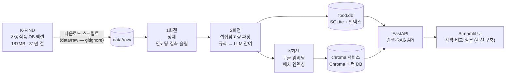
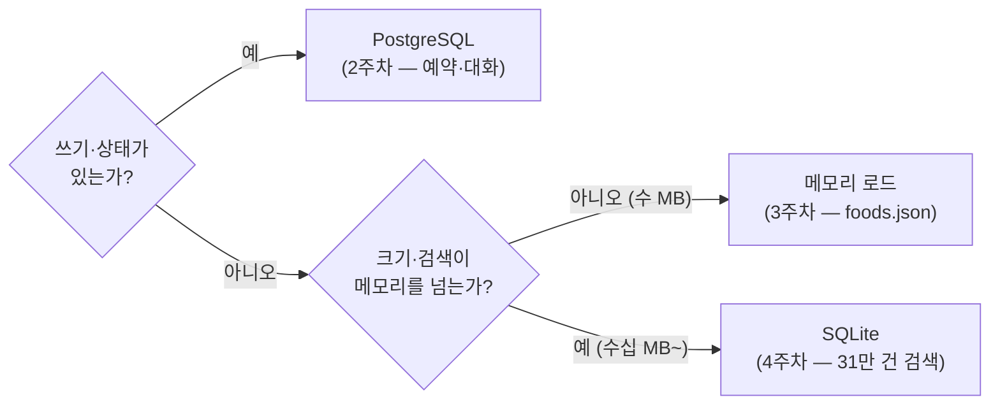
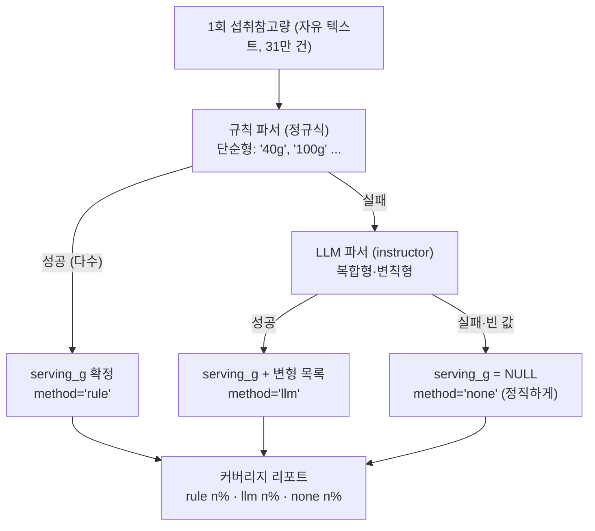

> A반(교육 선행형) 4주차 라이브 세션 교안입니다. 세션은 2시간,
> 멘토 시연 중심으로 진행합니다.  
> 
> 운영안이 4주차에 요구하는 것(CSV/PDF/웹/API 수집, pandas 정제, 한국어 PDF
> 함정 대응, 산출물: 정제 데이터셋)의 주입니다. 3주차에서 예고한 대로, 같은
> 다운로드 페이지의 가공식품 DB(187MB, 약 31만 건) 원본을 직접 만나 정제하고,
> 정제된 데이터셋 위에 검색 서비스를 세웁니다. 여기서 한 걸음 더 나가,
> 구글 [[embedding|임베딩]]으로 벡터 인덱스를 만들어 의미 검색과
> [[rag|RAG]] 질의응답까지 잇습니다. 31만 건이라는 몸집이 있어야 "다 못
> 넣으니 찾아서 준다"는 RAG의 비용 논리가 실감으로 다가옵니다.  
> 
> 시연 코드·지시 프롬프트·영상은 세션 후 전부 공개되어, 각자의 속도로
> 재현할 수 있습니다.

- **주제**: 데이터 수집·정제와 RAG 검색 (정제되지 않은 실데이터를 서비스 가능한 데이터셋으로, 데이터셋을 의미 검색으로)
- **세션 포커스**: RAG 검색과 비용 사다리, 정제안됨 3종 관찰과 처방(개념 위주), Git Flow 4회전과 회전별 릴리즈(v0.2부터 v1.0까지)
- **시연 소재**: "가공식품 영양 탐색기". 31만 건 가공식품 정제 → SQLite → 키워드 검색 + 의미 검색·질의응답
- **데이터**: 식약처 가공식품 DB (187.42MB, 약 31만 건, K-FIND 파일 다운로드)
- **산출물**: 정제 데이터셋 (+ 그것을 소비하는 검색·RAG 서비스)
- **시연 저장소**: [week04-food-data-pipeline](https://github.com/2026-ai-service-engineering-a/week04-food-data-pipeline)
- **VOD 사전 시청**: S2 데이터 수집·문서 로딩, 청킹·임베딩
- **운영 방식**: 멘토 시연 → 코드·프롬프트 공개 → 영상 아카이브 (코드 따라 쓰기 없음)

> **이 자료를 내 컴퓨터에서 보기**: 강의 사이트 저장소를 클론해
> [[docker|Docker]]로 띄우면 이 문서와 슬라이드를 로컬에서 볼 수 있고,
> 새 자료가 올라오면 `git pull`로 받아봅니다.
>
> ```bash
> git clone https://github.com/2026-ai-service-engineering-a/ai_service_engineering-track_a
> cd ai_service_engineering-track_a
> docker compose up --build      # http://localhost:4321 접속
> # 새 자료 받기: git pull 한 뒤 다시 docker compose up --build
> ```
>
> 자세한 방법은 [로컬에서 강의 자료 보기](/article/viewing-locally/),
> Docker가 처음이라면 [Docker와 Docker Compose, 처음이라면](/article/docker-basics/)을
> 참고하세요.

> **참고**
>
> 이번 주 파이프라인은 대부분 LLM 없이 돕니다.  
> v0.1 투어, 1회전 정제, 3회전 SQLite·검색 서비스는 API 키가 없어도 재현할 수 있습니다.  
> 
> LLM이 등장하는 곳은 2회전의 잔여 파싱과 4회전의 RAG 답변 두 군데로,
> `PARSER_MODEL`용 프로바이더 키 하나면 됩니다. 3주차 키를 재사용하세요.
> 4회전의 임베딩에는 구글 키(`GEMINI_API_KEY`)가 추가로 필요하며,
> 샘플 1,000건 기준 임베딩 비용은 센트 단위입니다.

## 1. 세션 목표

**3주차가 깨끗했던 이유를 이번 주에 알게 됩니다.** 3주차의 foods.json은 누가
미리 치워둔 결과였습니다. 오늘은 치우기 전의 원본(깨진 글자, 빈 필드, 자유
텍스트)을 직접 만나 정제 데이터셋으로 만드는 과정을 봅니다. 다만 정제는
"이런 식으로 하면 된다"는 개념과 원칙을 얻는 것이 목적이라 빠르게 지나갑니다.
이번 주의 무게중심은 그 데이터셋 위에 세우는 **RAG 검색**입니다. 31만 건이라는
크기 때문에 생기는 문제(컨텍스트에 다 안 들어가고, 전량 LLM은 비쌉니다)를
검색으로 푸는 것이 오늘의 본론입니다.

세션이 끝나면 다음을 얻게 됩니다.

- 실데이터 정제안됨의 3종 분류와 각각의 처방
  - 인코딩 오염 (BOM, 깨진 문자) → 문자 처리
  - 결측 (수집 데이터의 숙명입니다. 분석값이 아니라 표시사항 수집이라 대부분 비어 있습니다) → 결측 정책
  - 비정형 (자유 텍스트 "1회 섭취참고량") → 파싱: 규칙 우선, LLM은 잔여
- 데이터 재현성의 원칙: **원본은 레포 밖, 받는 방법은 레포 안** (raw는 gitignore, 스크립트와 출처가 재현을 보장합니다)
- 저장 방식의 3단 선택 기준: 메모리(소형 참조) / SQLite(대형 참조·검색) / PostgreSQL(상태·쓰기)
- [[llm|LLM]]의 새로운 자리: 런타임 서비스가 아니라 **배치 데이터 처리 도구**로서의 LLM (3주차 instructor의 재등장)
- [[rag|RAG]]의 첫 개념: **다 주지 말고, 찾아서 준다**. 31만 건은 컨텍스트에 안 들어갑니다. [[embedding|임베딩]] 검색으로 관련 몇 건만 추려 LLM에 주는 구조가 RAG이고, 그 구조가 곧 비용 절감입니다
- 비용 사다리: SQL(공짜) → 임베딩(싸다) → LLM(비싸다) 순입니다. 싼 층에서 풀리는 문제를 비싼 층으로 가져가지 않는 것이 이번 주 전체를 관통하는 원칙입니다
- 정제의 검증: 전후 카운트, 파싱 커버리지, 스팟 체크. **정제는 코드가 아니라 리포트로 검증합니다.**

#### 3주차와 달라지는 것

| 구분 | 3주차 (식단 플래너) | 4주차 (가공식품 탐색기) |
| --- | --- | --- |
| 데이터 | 음식 DB (11MB·2만 건, 깨끗함) | **가공식품 DB** (187MB·31만 건, 더러움) |
| 데이터 취급 | 미리 정제된 스냅샷을 소비 | 정제 과정을 개념 수준으로 시연 |
| 저장 | json → 메모리 로드 | **SQLite** (파일형 DB, 인덱스) |
| 검색 | 없음 (코드가 후보 주입) | 키워드(SQL) + **의미 검색**(임베딩) |
| LLM의 자리 | 런타임 서비스 (계획자·검증자) | **배치 파싱 + RAG 답변** (검색이 추린 컨텍스트만) |
| 원본의 위치 | 레포 안 (작아서 가능) | **레포 밖**(gitignore), 스크립트가 재현 보장 |

## 2. 브리핑: 더러운 데이터의 세계

### 2-1. 데이터: 3주차와 같은 곳, 다른 몸집

- **출처**: [식품안전나라 K-FIND 식품영양성분 DB 내려받기](https://various.foodsafetykorea.go.kr/nutrient/general/down/historyList.do)
- **다운로드 대상**: "가공식품 DB", 187.42MB에 약 31만 건으로 3주차 음식 DB의 15배 규모입니다.
- 성격 차이가 더러움의 원인입니다. 음식 DB는 분석 기반(연구 데이터)이고, 가공식품 DB는 **표시사항 수집 기반**(제품 라벨을 긁어모은 것)입니다. 그래서 영양 필드 대부분이 비고, 표기가 제각각입니다.
- 187MB짜리 원본은 레포에 넣지 않습니다. 다운로드 스크립트와 출처 기록이 재현을 보장합니다.

실물 미리보기입니다 (샘플에서 발췌한 더러움 3종):

| 유형 | 실물 | 원인 |
| --- | --- | --- |
| 인코딩 오염 | `우리밀 한입 스콘` (BOM), `？스타곰탕` (깨진 문자) | 파일 병합·변환 과정의 인코딩 사고 |
| 결측 | 수분·칼슘·철·비타민 열이 통째로 빈칸 | 라벨에 없는 값은 수집되지 않음 |
| 비정형 | 1회 섭취참고량 = `"생·숙면 200g, 건면 100g, 당면 30g, 유탕면(봉지)120g, 유탕면(용기)80g"` | 규정 문구를 자유 텍스트로 그대로 수집 |

한국어 PDF 함정(줄바꿈, NFD 자모 분해, 스캔 페이지)은 오늘 소재(엑셀)에는
없지만 같은 계열의 문제입니다. VOD S2 문서 로딩 단위로 위임하고, 세션에서는
한 장으로 언급만 합니다.

### 2-2. 파이프라인 전체 그림



- 왼쪽 절반(수집에서 파싱까지)이 이번 주 산출물 "정제 데이터셋"이고, 오른쪽 절반(SQLite에서 UI까지)이 그것을 소비하는 서비스입니다.
- 벡터 인덱스는 [[vector-db|벡터 DB]]인 Chroma를 **서버 모드**로 씁니다. 4회전에서 [[docker-compose|Compose]]에 `chroma` 서비스 블록 하나를 더하면 벡터 DB 서버가 생기고, 데이터는 `data/chroma/` 볼륨에 남습니다. 서비스 추가가 compose.yml 몇 줄인 것, 이것이 compose의 장점입니다.
- 파이프라인은 **몇 번이고 다시 돌릴 수 있어야 합니다**. 원본이 갱신되면 스크립트 재실행으로 food.db가 재생산됩니다 (재현성)

### 2-3. 저장 방식의 3단 선택 기준



- SQLite는 서버가 아니라 **파일**입니다. compose에 서비스가 늘지 않고 api + ui 그대로입니다. "DB를 쓴다"와 "DB 서버를 운영한다"는 다른 결정입니다.
- 4회전의 벡터 인덱스는 반대쪽 답을 고릅니다. 수천 건이면 SQLite 확장(sqlite-vec)이나 메모리 전수 비교로도 되지만, 31만 건 의미 검색에는 ANN(근사 최근접) 인덱스가 필요해서 Chroma를 **서버 모드**로 씁니다. "의미 검색을 켠다"가 "서비스를 하나 더 운영한다"가 되는 선택이지만, compose에서는 2주차 PostgreSQL처럼 서비스 블록 하나를 더하는 일이라 부담이 작습니다.
- 2주차엔 왜 PostgreSQL이었고, 3주차엔 왜 파일이었고, 이번 주는 왜 SQLite인가. 이 세 답을 갖고 있으면 10주차 기획에서 저장 고민이 끝납니다.

### 2-4. LLM의 자리: 기본은 배치, 런타임엔 답변 한 곳

- 키워드 검색 서비스에는 LLM이 없습니다. 정제된 데이터와 SQL이면 충분합니다 ("AI가 필요 없는 곳에 안 쓰는 것도 설계")
- LLM은 2회전의 **잔여 파싱**에 등장합니다. 규칙(정규식)이 못 푸는 자유 텍스트 섭취참고량을 instructor [[structured-output|structured output]]으로 구조화합니다.
- **규칙 우선, LLM은 잔여** 원칙:
  - 31만 건 전부 LLM에 넣으면 비용·시간이 터집니다. 규칙이 다수를 처리하고, 규칙이 실패한 소수만 LLM으로 보냅니다.
  - 규칙은 결정적(같은 입력 → 같은 출력, 무료, 즉시)이고, LLM은 유연하지만 비결정적·유료입니다. 각자의 자리가 있습니다.
- 배치 LLM은 런타임 LLM과 다릅니다. 중간 저장·재개가 가능해야 하고, 건너뛴 건 기록하고, 비용 상한을 정해두고 돌립니다. 이 3종 안전장치가 2회전 지시에 그대로 들어갑니다.
- 런타임 LLM은 4회전에 딱 한 곳 돌아옵니다. 질문에 문장으로 답하는 자리이고, 그때도 검색이 추린 몇 건만 들고 옵니다. 이것이 다음 절의 RAG입니다.

### 2-5. RAG: 다 주지 말고, 찾아서 준다

"나트륨 낮은 매콤한 분식 간식 뭐 있어?"에 LLM으로 답하고 싶다고 합시다.
가장 순진한 방법은 데이터를 통째로 컨텍스트에 넣는 것입니다.

- 31만 건은 수백만 토큰이라 애초에 컨텍스트에 들어가지 않습니다. 샘플 1,000건만 넣어도 호출당 수만 토큰이 들어가, 질문 하나에 수십 원씩 나갑니다.
- [[rag|RAG]]는 순서를 뒤집습니다. 먼저 **검색**(retrieval)으로 관련 몇 건을 찾고, 그 몇 건만 컨텍스트로 **증강**(augmentation)한 뒤 **생성**(generation)합니다. 컨텍스트가 수만 토큰에서 수백 토큰으로 줄고, 컨텍스트가 곧 비용입니다.
- 검색의 눈이 [[embedding|임베딩]]입니다. 텍스트를 의미가 보존되는 벡터로 바꾸면 "매콤한 분식"과 "떡볶이"가 가까운 점이 됩니다. 키워드가 못 잇는 것을 의미가 잇습니다.
- 임베딩은 구글 임베딩 API(`gemini-embedding-001`)를 [[litellm|LiteLLM]] 경유로 씁니다. 3주차의 호출 관례 그대로이고, LLM 생성과는 가격 자릿수가 다릅니다 (100만 토큰에 $0.15 수준, 정확한 값은 요금표에서 확인하세요)
- 이번 주의 원칙이 하나로 모입니다. **비용 사다리**, 곧 SQL(공짜) → 임베딩(싸다) → LLM(비싸다) 순입니다. 2회전의 "규칙 우선, LLM은 잔여"와 같은 원칙의 검색판입니다.

## 3. 시연 1: v0.1 투어 + 원본 관찰

### 3-1. v0.1 투어: 명령으로

> **v0.1로 시작하기**: 저장소의 기본 브랜치 `main`은 완성본이라, 그냥 클론하면
> 정답을 받습니다. 시작점은 v0.1 태그에서 작업 브랜치로 잡습니다.
>
> ```bash
> git clone https://github.com/2026-ai-service-engineering-a/week04-food-data-pipeline.git
> cd week04-food-data-pipeline
> git switch -c week04 v0.1   # v0.1 태그에서 작업 브랜치 생성
> ```
>
> 회전마다 릴리즈 태그를 자릅니다: v0.1(시작) → v0.2(정제) → v0.3(파싱) →
> v0.4(검색 서비스) → v1.0(RAG) 순입니다. 각 회전의 실행은 해당 태그에서
> 재현할 수 있고, 회전 사이의 차이는 `git diff v0.2 v0.3`처럼 봅니다.

```bash
cp .env.example .env
docker compose -f docker-compose.yml -f docker-compose.dev.yml up -d
docker compose ps        # api · ui 두 서비스 (SQLite는 파일이라 서비스가 아님)
```

- 브라우저에서 UI를 열면 **빈 상태 화면**이 뜹니다: "데이터가 아직 없습니다. 아래 절차로 food.db를 준비하세요"
- v0.1이 v1.0이 되는 순간은 코드가 아니라 **이 화면이 채워지는 순간**입니다.

```bash
ls data/raw/             # 비어 있음 — 원본 187MB는 레포 밖 (.gitignore)
ls scripts/              # download_file.py · download_api.py — 받는 방법은 레포 안
```

- 다운로드 스크립트 2종을 소개만 하고 실행은 하지 않습니다. 기본 권장은 파일 경로이고, Open-API 경로는 인증키가 필요하며 09\~19시 제한 안내가 스크립트 출력에 포함됩니다.

### 3-2. 원본 관찰: 샘플로 더러움 실물 확인

레포에 커밋된 `data/sample/raw_sample.csv`(1,000건)를 명령으로 엽니다.

```bash
docker compose exec api uv run python - <<'EOF'
import pandas as pd
df = pd.read_csv("data/sample/raw_sample.csv")

# ① 깨진 문자
print(df[df["식품명"].str.contains("？", na=False)][["식품코드","식품명"]].head(3))

# ② 열별 결측률 상위
print((df.isna().mean().sort_values(ascending=False).head(6)*100).round(1))

# ③ 섭취참고량의 실체
print(df["1회 섭취참고량"].dropna().sample(5).tolist())
EOF
```

출력 예입니다:

```plaintext
             식품코드                 식품명
12   P114-103010200-0827   ？스타곰탕 냉면 무김치

수분        98.2
칼슘        97.5
레티놀      96.9
비타민 D    96.4
철          95.1
식이섬유    93.8

['40g', '100g', '생·숙면 200g, 건면 100g, 당면 30g, 유탕면(봉지)120g, 유탕면(용기)80g', '30g', '1회 40g']
```

출력에서 읽어야 할 것:

- ①: 이름부터 깨져 있습니다. "이 행을 어떻게 할지가 정제 **정책**의 첫 결정입니다"
- ②: 결측률 90%대의 열들입니다. "표시사항 수집 데이터의 실체입니다. 이 열들을 끌고 갈 이유가 없습니다 → 슬림"
- ③: 단순형과 복합형이 한 컬럼에 섞여 있습니다. "이게 2회전의 주인공입니다"
- 이번 주 파이프라인은 전부 이 샘플 1,000건으로 개발하고, 전체 31만 건은 과제에서 돌립니다. **큰 데이터는 작은 데이터로 개발합니다.**

## 4. 시연 2: Git Flow 1회전 (`feature/clean`)

기본 정제입니다. 인코딩·결측·컬럼 슬림을 처리하는 파이프라인을 만듭니다.
1·2회전은 개념 시연이라 빠르게 갑니다. 무엇을 왜 하는지(분류·NULL 정책·리포트
검증)만 챙기면 충분하고, 시간의 무게중심은 4회전 RAG에 있습니다.

**회전 진행 형식** (모든 회전 공통): ① 지시 프롬프트 작성·설명 →
② 무엇이 만들어졌나(코드에서 그 부분 짚기) → ③ 커밋·PR·머지 후 **릴리즈** →
④ 릴리즈 버전에서 명령으로 실행. 3주차 관례에서 한 가지가 바뀝니다.
실행이 릴리즈 뒤로 갑니다. 회전마다 릴리즈를 자르고 그 태그에서 실행하므로,
재현자는 같은 태그를 체크아웃해 같은 명령으로 같은 결과를 봅니다.

| 회전 | 브랜치 | 릴리즈 |
| --- | --- | --- |
| 1회전 정제 | `feature/clean` | v0.2 |
| 2회전 섭취참고량 파싱 | `feature/serving-parse` | v0.3 |
| 3회전 SQLite 서비스 | `feature/sqlite-service` | v0.4 |
| 4회전 RAG 검색 | `feature/rag-search` | v1.0 |

### 4-1. 지시 프롬프트

```plaintext
가공식품 데이터 정제 파이프라인의 1단계를 만들어줘.

- 입력: data/raw/*.xlsx 또는 data/sample/raw_sample.csv (같은 스키마)
- pandas 기반. 처리 내용:
  - 문자열 컬럼의 BOM·제어문자 제거, 앞뒤 공백 정리
  - 식품명에 대체불가 깨진 문자(？ 등)가 포함된 행은 별도 목록으로 분리 저장
    (버리지 말고 reports/rejected.csv로 — 왜 빠졌는지 사유 컬럼 포함)
  - 컬럼 슬림: 코드·식품명·분류(대/중)·제조사·에너지·단백질·지방·탄수화물·
    당류·나트륨·1회 섭취참고량(원문 유지)·식품중량만 남김
  - 영양 수치 결측은 NULL 유지 (0으로 채우지 마 — 0과 모름은 다르다)
- 출력: data/clean/foods_clean.parquet + reports/clean_report.txt
  (입력 행수, 출력 행수, 제외 행수·사유별 집계, 열별 결측률)
- 정제 함수들은 순수 함수로 분리하고 유닛테스트 작성
  (BOM 제거, 깨진 문자 탐지 — 정상·오염 케이스)
- CLI로 실행 가능하게: uv run python -m pipeline.clean --input ... --output ...
- 작업 단위마다 커밋하면서 진행해라 — 문자 정리 함수 → 분리·슬림 →
  CLI·리포트 순으로 커밋을 나누고, 각 커밋 메시지에 의도를 남겨라
```

줄별 의도 포인트:

- "버리지 말고 별도 분리": 정제의 제1원칙, **삭제가 아니라 분류**입니다. 몇 건이 왜 빠졌는지 설명 못 하는 정제는 검증이 불가능합니다.
- "0으로 채우지 마": 결측 정책의 핵심 한 줄입니다. 나트륨 '모름'을 0으로 채우면 검색 결과가 거짓말을 합니다 (저나트륨 검색에 걸려버립니다)
- "clean_report.txt": 정제는 코드가 아니라 **리포트로 검증**합니다. 전후 카운트가 안 맞으면 어딘가에서 데이터가 새는 것입니다.
- "순수 함수 + 유닛테스트"와 "작업 단위마다 커밋": 2·3주차 관례의 연속입니다.

### 4-2. 무엇이 만들어졌나: 코드에서 이 부분

`git log --oneline`으로 문자 정리 → 분리·슬림 → CLI 순의 커밋을 확인한 뒤,
파일별로 한 군데씩 봅니다.

| 파일 | 보는 곳 | 왜 중요한가 |
| --- | --- | --- |
| `pipeline/textclean.py` | `strip_bom_and_controls(s)` 순수 함수 | "정제의 최소 단위입니다. 문자열 하나 받아 문자열 하나 반환하니 테스트가 쉽습니다" |
| `pipeline/clean.py` | 깨진 문자 행 분리 + 사유 부여 | "삭제가 아니라 분류. rejected에 사유가 남는 지점" |
| `pipeline/clean.py` | 슬림 컬럼 목록 상수 | "140여 개 중 12개. 버린 게 아니라 안 실은 것입니다. 원본은 raw에 그대로 있습니다" |
| `pipeline/report.py` | 전후 카운트·결측률 집계 | "리포트가 곧 검증. 입력=출력+제외가 안 맞으면 버그입니다" |

### 4-3. 커밋 → PR → 머지 → 릴리즈 v0.2

- 커밋 여러 개가 쌓인 PR("과정이 남는 PR") → CI → 머지 → **v0.2 태그**
- 회전 하나가 끝나면 릴리즈 하나를 자릅니다. 재현자가 같은 지점에 설 수 있게 하는 장치입니다.

### 4-4. 실행: v0.2에서 실제로 이렇게 처리된다

재현자 시작점: `git checkout v0.2` (이후 회전도 같은 방식이라, 이 안내는 매 실행 절 첫 줄에 반복됩니다)

```bash
docker compose exec api uv run python -m pipeline.clean \
  --input data/sample/raw_sample.csv --output data/clean/sample_clean.parquet
cat reports/clean_report.txt
```

출력 예입니다:

```plaintext
[clean] 입력: 1,000행 · 142열
[clean] 출력: 987행 · 12열 → data/clean/sample_clean.parquet
[clean] 제외: 13행 → reports/rejected.csv
        - 깨진 문자 포함: 9
        - 식품명 결측: 4
[clean] 열별 결측률(출력 기준 상위): 당류 41.2% · 나트륨 8.9% · ...
```

- 검산이 맞습니다. 1,000 = 987 + 13이니 데이터가 새지 않았습니다.

```bash
head -3 reports/rejected.csv
```

```plaintext
식품코드,식품명,사유
P114-103010200-0827,？스타곰탕 냉면 무김치,깨진 문자 포함
...
```

- 빠진 13건이 어디서 왜 빠졌는지 파일로 남습니다. 나중에 "데이터 왜 줄었어요?"라는 질문에 대한 답이 여기 있습니다.

```bash
docker compose exec api uv run pytest tests/test_textclean.py -v
```

```plaintext
test_textclean.py::test_strip_bom PASSED
test_textclean.py::test_detect_broken_char PASSED
```

## 5. 시연 3: Git Flow 2회전 (`feature/serving-parse`)

자유 텍스트 "1회 섭취참고량"의 구조화입니다. **규칙 우선, LLM은 잔여.**
비용 사다리의 첫 실전이고, 4회전 RAG 비용 논리의 예고편입니다.

### 5-1. 왜 이 필드가 문제인가

- 검색 서비스에서 "한 봉지 먹으면 나트륨 얼마?"에 답하려면 1회 제공량(g)이 숫자여야 합니다. 3주차 환산의 재회입니다.
- 실물 분포: 다수는 `"40g"` 같은 단순형이고, 소수가 복합형·변칙형·빈 값입니다.



### 5-2. 지시 프롬프트

```plaintext
2단계: 1회 섭취참고량 파싱을 추가해줘.

- 1차: 규칙 파서 — 정규식으로 단순형('40g', '100 g', '1회 40g' 등)을 파싱.
  순수 함수로 만들고 유닛테스트 작성 (단순형·공백 변형·실패 케이스)
- 2차: 규칙이 실패한 행만 LLM으로 파싱. LiteLLM 경유(PARSER_MODEL 환경변수),
  instructor 사용. 출력 스키마:
  ServingInfo — serving_g(int|None), variants(형태별 g 목록, 예: 건면 100g),
  confidence(high/low), note
- 빈 값이거나 LLM도 실패하면 serving_g는 NULL — 지어내지 마
- 각 행에 파싱 방법(rule/llm/none)을 기록해라
- 배치 실행 안전장치: 중간 저장(재실행 시 이미 파싱된 행 건너뜀),
  LLM 호출 수 상한 옵션(--llm-limit), 진행 로그
- 디버그 로그: LOG_LEVEL=debug일 때 LLM 파싱의 프롬프트 전문·모델 원출력·
  건별 토큰·비용을 로그로 남겨라
- 출력: data/clean/foods_parsed.parquet + reports/parse_report.txt
  (방법별 커버리지, LLM 호출 수·비용 합계)
- 작업 단위마다 커밋 — 규칙 파서 → LLM 파서 → 배치 러너·리포트 순
```

줄별 의도 포인트:

- "규칙이 실패한 행만 LLM으로": 비용 설계가 요구사항 문장이 된 것입니다. 전량 LLM의 비용을 ③에서 실제 숫자로 계산해 보입니다.
- "지어내지 마"와 NULL: 결측 정책의 반복입니다. LLM은 빈칸을 채우고 싶어 합니다. 그 충동을 스키마와 지시로 막습니다.
- "중간 저장·상한·진행 로그": 배치 LLM의 3종 안전장치입니다. 런타임 호출과 다른 규율입니다.
- "방법 기록": 나중에 llm 파싱분만 스팟 체크할 수 있게 합니다. 검증 가능성을 데이터에 심는 것입니다.
- "디버그 로그": 3주차와 동일합니다. 관측 가능성도 요구사항이고, ③의 관찰이 이 줄로 성립합니다.

### 5-3. 무엇이 만들어졌나: 코드에서 이 부분

| 파일 | 보는 곳 | 왜 중요한가 |
| --- | --- | --- |
| `pipeline/serving_rule.py` | 정규식 + `parse_simple(s) -> int\|None` | "다수를 공짜로 처리하는 층입니다. 실패하면 None을 돌려줄 뿐, 화내지 않습니다" |
| `schemas/serving.py` | `class ServingInfo`의 `serving_g: int \| None` | "None이 허용된 스키마. '모름'이 일급 시민입니다" |
| `pipeline/serving_llm.py` | `response_model=ServingInfo` 호출 | "3주차 instructor가 배치 안으로 이사 왔습니다" |
| `pipeline/batch.py` | 캐시 확인 → 건너뜀 / `--llm-limit` 카운터 | "배치의 예의입니다. 죽어도 다시 이어 달리고, 지갑에 상한이 있습니다" |

### 5-4. 커밋 → PR → 머지 → 릴리즈 v0.3

- 커밋 이력(규칙 → LLM → 배치 순) 확인 → PR → CI → 머지 → **v0.3 태그**
- 3주차와 이어집니다. 지난주 instructor는 서비스 안에 있었고, 이번 주는 파이프라인 안에 있습니다. structured output은 어디서든 "LLM을 함수처럼" 쓰는 도구입니다.

### 5-5. 실행: v0.3에서 실제로 이렇게 처리된다

재현자 시작점: `git checkout v0.3`

**배치 실행 (샘플, LLM 상한 30건)**

```bash
docker compose exec api uv run python -m pipeline.serving_parse \
  --input data/clean/sample_clean.parquet --llm-limit 30
```

출력 예입니다:

```plaintext
[rule] 842/987 파싱 성공 (85.3%)
[llm ] 잔여 145건 중 30건 처리 (--llm-limit=30)
[llm ] P108-008000200-0095 "생·숙면 200g, 건면 100g, 당면 30g, ..." → serving_g=200, variants=4
[cost] llm 30건 · 입력 12.4k tok · 출력 3.1k tok · $0.02
[done] rule 842 · llm 30 · none 115 → data/clean/foods_parsed.parquet
```

- 비용을 계산해 봅니다. 건당 약 $0.0007이니 31만 건 전량이면 약 $210입니다. 규칙이 85%를 공짜로 막아주니 잔여만 돌리면 약 $30입니다. **정규식 한 뭉치의 가격이 $180**인 셈입니다.

**LLM이 실제로 받은 것·뱉은 것** (디버그 로그)

```bash
docker compose exec api env LOG_LEVEL=debug uv run python -m pipeline.serving_parse \
  --input data/clean/sample_clean.parquet --llm-limit 1
```

```plaintext
[debug] PARSER PROMPT ─ user:
  다음 '1회 섭취참고량' 원문을 구조화해라. 지어내지 마라. 판단 불가면 serving_g=null.
  원문: "생·숙면 200g, 건면 100g, 당면 30g, 유탕면(봉지)120g, 유탕면(용기)80g"
[debug] PARSER RAW OUTPUT: {"serving_g": 200, "variants": [
  {"형태":"생·숙면","g":200},{"형태":"건면","g":100},{"형태":"당면","g":30},
  {"형태":"유탕면(봉지)","g":120},{"형태":"유탕면(용기)","g":80}], "confidence":"high", ...}
```

- 규칙은 이 문장 앞에서 손을 들었고, LLM은 다섯 형태를 전부 갈라냈습니다. 각자의 자리가 있습니다.

**중간 저장 증명: 같은 명령 재실행**

```bash
docker compose exec api uv run python -m pipeline.serving_parse \
  --input data/clean/sample_clean.parquet --llm-limit 30
```

```plaintext
[skip] 캐시에서 872건 건너뜀 (data/clean/.parse_cache.jsonl)
[llm ] 0건 호출 · $0.00
```

- 두 번째 실행은 공짜입니다. 배치는 죽고 다시 살아나는 것까지가 설계입니다. 31만 건 돌리다 끊겨도 이어 달립니다.

**스팟 체크: llm 파싱분 무작위 대조**

```bash
docker compose exec api uv run python -m pipeline.spot_check --method llm -n 3
```

```plaintext
원문: "1회 제공량 35g(2조각)"        → serving_g=35   ✓
원문: "생·숙면 200g, 건면 100g, ..." → serving_g=200, variants=4  ✓
원문: "총 4회 제공"                  → serving_g=None (판단 불가)  ✓ (지어내지 않음)
```

**리포트와 테스트**

```bash
cat reports/parse_report.txt
docker compose exec api uv run pytest tests/test_serving_rule.py -v
```

## 6. 시연 4: Git Flow 3회전 (`feature/sqlite-service`)

정제 데이터셋을 SQLite로 굳히고, 검색 서비스에 연결해 UI를 살립니다.

### 6-1. 지시 프롬프트

```plaintext
3단계: SQLite 구축과 검색 API를 만들어줘.

- data/clean/foods_parsed.parquet → data/food.db (SQLite) 적재 스크립트
  - 테이블: foods (정제된 컬럼 그대로 + serving_g, parse_method)
  - 인덱스: 식품명, 분류, 나트륨, 당류
- 검색 API: GET /foods — 이름 키워드, 분류, 나트륨/당류/칼로리 상한 필터,
  정렬(나트륨·당류·에너지), 페이지네이션
- 상세 API: GET /foods/{code} — 100g 기준값과 1회 제공량 환산값을 함께 반환.
  serving_g가 NULL이면 환산값도 NULL로 두고 사유(원문)를 함께 표시 — 지어내지 마
- 시작 시 food.db가 없으면 안내 메시지와 함께 뜨되 /health는 동작
- LLM 없음 — 이 서비스는 SQL이면 충분하다
- 작업 단위마다 커밋 — 적재 스크립트 → 검색 API → 상세·환산 순
```

- "LLM 없음" 줄을 일부러 넣습니다. AI를 안 쓰는 결정도 지시에 명시된다는 것을 보여주는 줄입니다.
- 이 줄은 4회전에서 뒤집히는 것이 아니라 정교해집니다. LLM이 돌아오되, 검색이 추린 몇 건만 들고 돌아옵니다.

### 6-2. 무엇이 만들어졌나: 코드에서 이 부분

| 파일 | 보는 곳 | 왜 중요한가 |
| --- | --- | --- |
| `pipeline/load_sqlite.py` | `CREATE INDEX ...` 4줄 | "31만 건에서 검색이 안 느린 이유가 이 네 줄입니다" |
| `api/routes/foods.py` | 필터 조합 쿼리 빌더 | "LLM 없이 SQL만. AI가 필요 없는 곳입니다" |
| `api/routes/foods.py` | 상세의 환산부, `if serving_g is None` 분기 | "2회전의 NULL 정책이 API 응답까지 관통하는 지점" |

### 6-3. 커밋 → PR → 머지 → 릴리즈 v0.4

- PR → CI → 머지 → **v0.4 태그**. 아직 v1.0이 아닙니다. 마지막 회전이 남았습니다.

### 6-4. 실행: v0.4에서 UI가 살아나는 순간

재현자 시작점: `git checkout v0.4`

**적재와 확인**

```bash
docker compose exec api uv run python -m pipeline.load_sqlite \
  --input data/clean/foods_parsed.parquet --db data/food.db
docker compose exec api uv run python -c \
  "import sqlite3; print(sqlite3.connect('data/food.db').execute('select count(*) from foods').fetchone())"
```

```plaintext
(987,)
```

**검색 API**

```bash
curl -s "localhost:8000/foods?q=떡볶이&sort=sodium_desc&limit=3" | jq '.items[] | {name, sodium_mg, serving_g}'
```

```json
{ "name": "Yeschef BIG TTEOKBOKKI 국물떡볶이", "sodium_mg": 259, "serving_g": 100 }
{ "name": "金세기 쫀득쫀득 밀떡볶이", "sodium_mg": 310, "serving_g": 100 }
...
```

**키워드 검색의 한계: 4회전의 예고**

```bash
curl -s "localhost:8000/foods?q=매콤한 분식 간식" | jq '.total'
```

```plaintext
0
```

- "떡볶이"라고 쳐야 떡볶이가 나옵니다. 글자가 다르면 의미가 같아도 0건입니다. 이 0이 4회전의 출발점입니다.

**상세: 파싱 결과가 쓰이는 곳 (NULL 케이스 포함)**

```bash
curl -s localhost:8000/foods/P108-008000200-0095 | jq '{name, per_100g: .per_100g.sodium_mg, per_serving: .per_serving}'
```

```json
{ "name": "李家메밀소바",
  "per_100g": 926,
  "per_serving": { "serving_g": 200, "sodium_mg": 1852, "method": "llm" } }
```

```bash
curl -s localhost:8000/foods/P1xx-...(serving 없음 케이스) | jq '.per_serving'
```

```json
{ "serving_g": null, "note": "1회 제공량 정보 없음 (원문: '')" }
```

- 환산값 1,852mg입니다. 2회전에서 LLM이 갈라낸 "생·숙면 200g"이 여기서 일합니다. 그리고 모르는 것은 모른다고 답합니다. 정직한 NULL이 사용자 신뢰입니다.

**UI 전환**

- UI를 새로고침하면 **빈 상태 화면이 검색 화면으로** 바뀝니다. UI 코드는 v0.1 그대로입니다 (헤드리스 분리의 증명, 3주차와 동일한 장면)
- 검색 → 나트륨 정렬 → 상세에서 1회 제공량 환산을 확인합니다.
- 1회전의 정제, 2회전의 파싱이 없었으면 이 화면의 숫자는 전부 거짓말이거나 빈칸이었습니다.

## 7. 시연 5: Git Flow 4회전 (`feature/rag-search`)

이번 주의 클라이맥스입니다. 3회전의 마지막 curl이 남긴 0건에서 시작합니다.
정제 데이터셋에 구글 임베딩 벡터 인덱스를 세워 의미 검색을 열고, 검색이 추린
몇 건만 컨텍스트로 LLM을 불러 질문에 답합니다. **검색 우선, LLM은 답변만.**

### 7-1. 지시 프롬프트

```plaintext
4단계: 의미 검색과 RAG 질의응답을 추가해줘.

- docker-compose.yml에 chroma 서비스 추가: chromadb/chroma 이미지,
  데이터는 data/chroma 볼륨에 영속, api는 CHROMA_HOST 환경변수로 접속
- 임베딩 인덱스 구축: foods_parsed.parquet의 식품명·분류(대/중)·제조사를
  한 문장으로 합쳐 구글 임베딩(LiteLLM 경유, EMBEDDING_MODEL 환경변수)으로
  벡터화하고, chroma 서비스의 foods 컬렉션에 저장
  - id는 식품코드, 메타데이터로 분류·나트륨·당류·에너지·serving_g 저장
    (검색 결과 필터와 컨텍스트 조립에 사용)
  - 배치 호출로 묶고, 중간 저장·재개(이미 임베딩된 행 건너뜀), 진행 로그,
    --limit 옵션 — 2단계와 같은 배치 안전장치
  - reports/embed_report.txt: 건수, 토큰 합계, 비용 합계
- 의미 검색 API: GET /foods/semantic — 질의를 임베딩해 top-k 반환.
  LLM 호출 없음
- RAG 질의응답 API: POST /ask — 의미 검색 top-5를 컨텍스트로 LLM에 전달해
  답변 생성 (PARSER_MODEL 재사용)
  - 컨텍스트에 없는 내용은 지어내지 말고 모른다고 답하게 해라
  - 응답에 근거 식품 목록(코드·이름)과 토큰·비용을 함께 반환
- 디버그 로그: LOG_LEVEL=debug일 때 검색 결과·조립된 컨텍스트 전문·비용
- 작업 단위마다 커밋 — chroma 서비스 → 임베딩 인덱스 → 의미 검색 → /ask 순
```

줄별 의도 포인트:

- "chroma 서비스 추가": DB 서버가 필요해지면 compose에 블록 하나를 더합니다. 2주차 PostgreSQL과 같은 자리이고, 인프라 확장이 diff 몇 줄로 리뷰되는 것이 compose를 쓰는 이유입니다.
- "식품명·분류·제조사를 한 문장으로": 무엇을 임베딩하느냐가 검색 품질을 정합니다. 영양 수치는 벡터에 넣지 않습니다. 숫자는 필터의 일이고, 여기서도 각자의 자리가 있습니다.
- "메타데이터로 저장": 벡터는 찾기용, 숫자는 거르기용입니다. Chroma의 where 필터로 "나트륨 500mg 이하만" 같은 조건을 의미 검색과 함께 겁니다.
- "LLM 호출 없음": 의미 검색까지는 임베딩만으로 됩니다. 챗봇으로 풀고 싶은 문제의 절반은 검색으로 끝납니다.
- "top-5를 컨텍스트로": RAG의 본체가 이 한 줄입니다. 31만 건이 아니라 5건입니다. 컨텍스트가 곧 비용입니다.
- "지어내지 마": 1·2회전의 NULL 정책이 답변에도 이어집니다. 근거 없는 답은 RAG의 실패입니다.
- "근거 목록 반환": 검증 가능성입니다. 스팟 체크와 같은 정신이고, 답이 어느 행에서 왔는지 추적할 수 있어야 합니다.
- "배치 안전장치": 임베딩도 배치 LLM과 같은 예의를 지킵니다. 2회전 3종 안전장치의 재사용입니다.

### 7-2. 무엇이 만들어졌나: 코드에서 이 부분

| 파일 | 보는 곳 | 왜 중요한가 |
| --- | --- | --- |
| `docker-compose.yml` | 새 `chroma` 서비스 블록 | "서비스 추가가 diff 몇 줄입니다. 인프라 변경도 코드 리뷰를 지나갑니다" |
| `pipeline/embed_index.py` | 배치 루프 + Chroma upsert | "2회전 배치 러너와 같은 예의입니다. 재개·상한·진행 로그" |
| `api/routes/semantic.py` | 질의 임베딩 → 컬렉션 top-k 질의 | "검색은 벡터 연산 하나. LLM이 없습니다" |
| `api/routes/ask.py` | 컨텍스트 조립부 (top-5 → 프롬프트) | "RAG의 심장. 다 주지 않고 찾아서 줍니다" |
| `api/routes/ask.py` | "모르면 모른다" 시스템 지시 | "환각을 막는 최소 장치. 근거 밖 답변을 금지합니다" |

### 7-3. 커밋 → PR → 머지 → 릴리즈 v1.0

- 커밋 이력(chroma 서비스 → 임베딩 인덱스 → 의미 검색 → /ask 순) 확인 → PR → CI → 머지 → **v1.0 태그** + PROMPT.md(지시 4개) 확인

### 7-4. 실행: v1.0에서 0건이 답변이 되는 순간

재현자 시작점: `git checkout v1.0`

**chroma 서비스 기동**

```bash
docker compose up -d     # 4회전이 추가한 chroma 서비스가 새로 뜹니다
docker compose ps        # api · ui · chroma 세 서비스
```

**임베딩 인덱스 구축 (샘플)**

```bash
docker compose exec api uv run python -m pipeline.embed_index \
  --input data/clean/foods_parsed.parquet --db data/food.db
cat reports/embed_report.txt
```

```plaintext
[embed] 987건 · 배치 100건 × 10회
[embed] 입력 21.7k tok · $0.003
[done ] chroma 서비스 foods 컬렉션 987건 (볼륨 data/chroma/)
```

- 비용을 봅니다. 987건에 $0.003이고, 31만 건 전량이어도 약 $1입니다. **의미 검색 인덱스 전체가 라면 한 봉지 값**입니다. 2회전 LLM 파싱(잔여만 약 $30)과 가격 자릿수가 다릅니다.

**의미 검색: LLM 없이 0건이 3건으로**

```bash
curl -s "localhost:8000/foods/semantic?q=매콤한 분식 간식&limit=3" | jq '.items[] | {name, sodium_mg, score}'
```

```json
{ "name": "신전 매운 국물떡볶이", "sodium_mg": 1120, "score": 0.63 }
{ "name": "화끈불끈 쌀떡꼬치", "sodium_mg": 310, "score": 0.58 }
{ "name": "매운맛 어묵바 순한고추", "sodium_mg": 480, "score": 0.55 }
```

- 키워드로 0건이던 질의가 의미로는 3건을 찾아옵니다. 여기까지 LLM은 등장하지 않았습니다. 질의 임베딩 한 번이니 사실상 공짜입니다.

**RAG 질의응답: 검색이 추린 5건만 들고**

```bash
curl -s -X POST localhost:8000/ask -H 'Content-Type: application/json' \
  -d '{"q": "나트륨이 낮은 매콤한 분식 간식 추천해줘"}' | jq
```

```json
{
  "answer": "검색된 제품 중 나트륨이 가장 낮은 것은 '화끈불끈 쌀떡꼬치'(100g당 310mg)입니다. ...",
  "sources": [
    { "code": "P115-402000100-1123", "name": "화끈불끈 쌀떡꼬치" },
    { "code": "P108-301050300-0441", "name": "매운맛 어묵바 순한고추" }
  ],
  "usage": { "input_tok": 642, "output_tok": 118, "cost_usd": 0.0005 }
}
```

- 컨텍스트는 5건, 약 600토큰입니다. 샘플 1,000건을 통째로 넣으면 호출당 4만 토큰으로 60배이고, 31만 건이면 애초에 들어가지도 않습니다. **검색이 컨텍스트를 만들고, 컨텍스트가 비용을 정합니다.**

**모르는 것은 모른다고: 근거 밖 질문**

```bash
curl -s -X POST localhost:8000/ask -H 'Content-Type: application/json' \
  -d '{"q": "이 중에 비건 인증을 받은 제품은?"}' | jq '.answer'
```

```json
"제공된 데이터에는 비건 인증 여부 정보가 없어 답할 수 없습니다."
```

- 2회전의 정직한 NULL이 문장이 된 모습입니다. 근거에 없으면 없다고 답합니다.

**디버그 로그: 조립된 컨텍스트 실물**

```bash
docker compose exec api env LOG_LEVEL=debug uv run python -c "..." # /ask 한 건 재현
```

```plaintext
[debug] RAG CONTEXT (5건 · 598 tok):
  1. 신전 매운 국물떡볶이 — 나트륨 1120mg/100g, 1회 150g ...
  2. 화끈불끈 쌀떡꼬치 — 나트륨 310mg/100g, 1회 80g ...
[debug] ANSWER PROMPT ─ system: 아래 제품 정보에서만 답해라. 없으면 모른다고 답해라.
```

- LLM이 실제로 받은 것이 31만 건이 아니라 이 다섯 줄임을 눈으로 확인합니다. RAG의 전부가 이 로그 안에 있습니다.

**UI 마지막 전환**

- UI를 새로고침하면 "질문하기" 탭이 살아납니다. UI 코드는 여전히 v0.1 그대로입니다.

## 8. 저장소 설계: v0.1에서 v1.0으로

**저장소**: [week04-food-data-pipeline](https://github.com/2026-ai-service-engineering-a/week04-food-data-pipeline),
조직 소유, template repository로 지정합니다.

### 8-1. v0.1: 시연 시작점 (사전 준비)

```plaintext
week04-food-data-pipeline (v0.1)
├── api/
│   ├── app/
│   │   └── main.py          # FastAPI — /health 동작, /foods는 "food.db 없음" 안내
│   ├── Dockerfile
│   └── pyproject.toml       # pandas, pyarrow, litellm, instructor, fastapi, pytest, openpyxl, chromadb
├── ui/
│   ├── app.py               # Streamlit (사전 구축) — 빈 상태 화면 + 검색·상세·질문 화면
│   └── Dockerfile
├── data/
│   ├── sample/
│   │   └── raw_sample.csv   # 원본에서 뽑은 1,000건 (더러움 보존 — 커밋됨)
│   ├── raw/                 # 전체 원본 자리 (.gitignore — 187MB는 레포 밖)
│   ├── clean/               # 파이프라인 출력 자리 (.gitignore)
│   └── chroma/              # chroma 서비스 볼륨 자리 (.gitignore — 4회전이 채움)
├── scripts/
│   ├── download_file.py     # K-FIND 파일 다운로드 (기본 권장 경로)
│   └── download_api.py      # Open-API 경로 (인증키 필요, 09~19시 제한 안내 출력)
├── docker-compose.yml       # api + ui (SQLite는 파일이라 서비스 아님 — chroma 서비스는 4회전이 추가)
├── docker-compose.dev.yml
├── .env.example             # PARSER_MODEL, EMBEDDING_MODEL, 키, LOG_LEVEL, 호출 상한 기본값
├── PROMPT.md                # 자리만
└── README.md                # 데이터 출처·버전 기록(2026-07-28판), 다운로드 절차 2종, 빈 상태 안내
```

clone 직후 동작하는 것:

- `compose up` → api(`/health`)와 ui(빈 상태 화면) 기동
- 샘플 원본으로 더러움 관찰이 가능합니다 (다운로드 없이 시연 도입부 성립)
- 다운로드 스크립트 2종 실행 가능 (실행은 사용자 선택, 원본은 레포 밖)

### 8-2. v1.0: 시연 종료점

- 릴리즈 태그 사다리: v0.1 → v0.2 → v0.3 → v0.4 → v1.0. 태그 하나가 회전 하나의 완결 상태이고, 교안의 실행 블록과 1:1로 대응합니다
- docker-compose.yml은 4회전에서 `chroma` 서비스가 더해져 api·ui·chroma 세 서비스가 됩니다. 인프라 변경도 PR diff에 남습니다
- `pipeline/`: textclean·clean(1회전), serving_rule·serving_llm·batch(2회전), load_sqlite(3회전), embed_index(4회전), spot_check와 CLI
- `reports/` 출력 체계: clean_report·parse_report·embed_report·rejected.csv (정제는 리포트로 검증)
- `/foods` 검색·상세, `/foods/semantic` 의미 검색, `/ask` RAG 질의응답 API 동작. UI가 검색·질문 화면으로 전환됩니다 (UI 코드는 v0.1 그대로)
- `tests/`: 문자 정리·규칙 파서 유닛테스트
- `PROMPT.md`: 지시 프롬프트 4개 누적, PR 4개 머지 이력

## 9. 재현할 때 유의할 점

- **엑셀 로딩이 오래 걸립니다.** 187MB xlsx는 pandas 로드만으로도 상당한 시간이 듭니다. 파이프라인 개발은 샘플 1,000건으로 하고, 전체 실행은 마지막에 한 번만 돌리세요.
- **LLM 파싱은 비용이 듭니다.** `--llm-limit`으로 상한을 걸고 시작하세요. 중간 저장이 있으므로 끊어서 여러 번 돌려도 이어집니다.
- **임베딩은 싸지만 무료 티어는 속도 제한이 있습니다.** 구글 무료 티어 키는 분당 요청 수 제한이 있어 배치가 느릴 수 있습니다. `--limit`과 중간 저장으로 끊어 돌리세요. 비용 자체는 샘플 기준 센트 단위입니다.
- **임베딩 차원은 줄여서 저장하세요.** `gemini-embedding-001`의 기본 3072차원을 31만 건 전량 저장하면 인덱스가 수 GB로 커집니다. 출력 차원 축소를 지원하므로 768차원 정도로 낮춰 저장하는 것을 권장하고, 검색 품질 차이는 스팟 체크로 확인합니다.
- **문서의 수치는 예시입니다.** 규칙·LLM·실패 비율(85/3/12), 건당 비용, 절감액, 임베딩 단가는 모델·데이터 버전·요금표에 따라 달라집니다. 본인 실행의 리포트 숫자가 정답입니다.
- **데이터 버전을 확인하세요.** 저장소 README에 다운로드 시점의 DB 버전(2026-07-28판)이 적혀 있습니다. 원본을 새로 받으면 행 수와 수치가 달라져 리포트가 이 문서와 어긋날 수 있습니다.
- **원본은 레포 밖에 둡니다.** 187MB를 커밋하지 마세요. `data/raw/`는 gitignore돼 있고, 재현은 다운로드 스크립트가 보장합니다.

## 10. 과제·마무리

### 10-1. 재현 과제: 이번 주는 전체 데이터로

- 시연은 샘플 1,000건으로 했습니다. 재현자는 **187MB 전체를 직접 다운로드**해서 파이프라인을 완주하는 것이 과제입니다.
  - 다운로드는 K-FIND 파일 경로(제공 스크립트)를 권장합니다. Open-API 경로는 인증키가 필요하고 09\~19시 제한에 유의합니다.
  - 2회전 LLM 파싱은 비용이 드는 구간입니다. `--llm-limit`으로 잔여분 일부만 돌려도 과제로 인정합니다 (전량은 선택)
  - 4회전 임베딩 인덱스는 샘플 1,000건으로 재현해도 인정합니다. 전량은 선택이며, 예시 단가로 전량 비용을 직접 계산해 보는 것 자체가 과제의 일부입니다.
  - 중간에 막히면 그 회전의 릴리즈 태그(v0.2부터 v1.0까지)로 점프해 이어가도 됩니다. 태그가 곧 체크포인트입니다.
  - 산출: 본인의 clean_report·parse_report·embed_report를 디스코드에 공유합니다. **리포트가 곧 제출물입니다.**
- 3주차와 달리 "돌려본다"가 아니라 "규모를 겪는다"가 목적입니다. 31만 건에서 걸리는 시간, 비용 계산, 중간 저장의 고마움을 몸으로 겪습니다.

### 10-2. 더 가보려면

- **로컬 임베딩**: 이번 주는 API 임베딩(구글)이었습니다. sentence-transformers의 `bge-m3` 같은 로컬 모델은 GPU 없이 CPU로도 돌고 호출 비용이 0이 됩니다. 대신 모델을 직접 들고 다녀야 합니다. "빌리는 것"과 "직접 드는 것"의 저울이 임베딩에도 있습니다.
- **벡터 저장의 위아래**: 이번 주는 Chroma를 compose 서비스로 띄우는 서버 모드였습니다. 규모가 작으면 내려갈 수 있습니다. Chroma **임베디드 모드**는 서버 없이 api 안의 라이브러리로 돌고, sqlite-vec는 SQLite 확장이라 벡터가 food.db 안에 들어갑니다. 반대로 수백만 벡터·동시 쓰기·분산이 필요해지면 Qdrant·pgvector로 올라갑니다. 저장 3단 선택 기준의 벡터판입니다.
- **청킹**: 이번 주 RAG는 행 단위라 자를 것이 없었습니다. 문서(PDF·매뉴얼) RAG에서는 문서를 어떻게 자르느냐(청킹)가 검색 품질을 정합니다. VOD S2의 청킹·임베딩 단위가 이 주제를 다룹니다.
- **시맨틱 캐시**: 4회전의 임베딩으로 2회전을 더 줄일 수도 있습니다. 잔여 원문을 LLM에 보내기 전에 이미 파싱된 유사 원문을 찾아 재사용하면, 규칙과 LLM 사이에 층이 하나 더 생깁니다. 확장 과제로 남겨둡니다.
