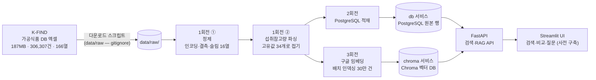
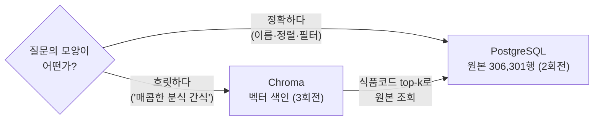

> A반(교육 선행형) 4주차 라이브 세션 교안입니다. 세션은 2시간,
> 멘토 시연 중심으로 진행합니다.  
> 
> 운영안이 4주차에 요구하는 것(CSV/PDF/웹/API 수집, pandas 정제, 한국어 PDF
> 함정 대응, 산출물: 정제 데이터셋)의 주입니다. 3주차에서 예고한 대로, 같은
> 다운로드 페이지의 가공식품 DB(187MB, 306,307건) 원본을 직접 만나 정제하고,
> 정제된 데이터셋 위에 검색 서비스를 세웁니다. 여기서 한 걸음 더 나가,
> 구글 [[embedding|임베딩]]으로 벡터 인덱스를 만들어 의미 검색과
> [[rag|RAG]] 질의응답까지 잇습니다. 30만 건이라는 몸집이 있어야 "다 못
> 넣으니 찾아서 준다"는 RAG의 비용 논리가 실감으로 다가옵니다.  
> 
> 시연 코드·지시 프롬프트·영상은 세션 후 전부 공개되어, 각자의 속도로
> 재현할 수 있습니다.

- **주제**: 데이터 수집·정제와 RAG 검색 (정제되지 않은 실데이터를 서비스 가능한 데이터셋으로, 데이터셋을 의미 검색으로)
- **세션 포커스**: RAG 검색과 비용 사다리, 정제안됨 3종 관찰과 처방(개념 위주), Git Flow 3회전과 회전별 릴리즈(v0.2·v0.3·v1.0)
- **시연 소재**: "가공식품 영양 탐색기". 30만 건 가공식품 정제 → PostgreSQL → 키워드 검색 + 의미 검색·질의응답
- **데이터**: 식약처 가공식품 DB (187.42 MiB, **306,307행 × 166열**, 2026-07-28판, K-FIND 파일 다운로드)
- **산출물**: 전량 306,307건 정제 데이터셋 + 그것을 소비하는 검색·RAG 서비스. 회전마다 릴리즈 태그와 함께 데이터 산출물을 배포합니다
- **시연 저장소**: [week04-food-data-pipeline](https://github.com/2026-ai-service-engineering-a/week04-food-data-pipeline)
- **VOD 사전 시청**: S2 데이터 수집·문서 로딩, 청킹·임베딩
- **운영 방식**: 멘토 시연 → 코드·프롬프트 공개 → 영상 아카이브 (코드 따라 쓰기 없음)

> **이 자료를 내 컴퓨터에서 보기**: 강의 사이트 저장소를 클론해
> [[docker|Docker]]로 띄우면 이 문서와 슬라이드를 로컬에서 볼 수 있고,
> 새 자료가 올라오면 `git pull`로 받아봅니다.
>
> ```bash
> git clone https://github.com/2026-ai-service-engineering-a/ai_service_engineering-track_a
> cd ai_service_engineering-track_a
> docker compose up --build      # http://localhost:4321 접속
> # 새 자료 받기: git pull 한 뒤 다시 docker compose up --build
> ```
>
> 자세한 방법은 [로컬에서 강의 자료 보기](/article/viewing-locally/),
> Docker가 처음이라면 [Docker와 Docker Compose, 처음이라면](/article/docker-basics/)을
> 참고하세요.

> **참고**
>
> 이번 주 파이프라인은 대부분 LLM 없이 돕니다.  
> v0.1 투어, 2회전 PostgreSQL·검색 서비스는 API 키가 없어도 재현할 수 있습니다.  
> 
> LLM이 등장하는 곳은 1회전의 잔여 파싱과 3회전의 RAG 답변 두 군데로,
> `PARSER_MODEL`용 프로바이더 키 하나면 됩니다. 3주차 키를 재사용하세요.
> 1회전 파싱은 고유값 5건 호출이라 1센트도 들지 않습니다.
> 3회전의 임베딩에는 구글 키(`GEMINI_API_KEY`)가 추가로 필요합니다.  
> 
> 다만 무거운 배치(전량 LLM 파싱, 전량 임베딩 인덱싱)는 미리 돌려 둔 산출물을
> 배포하니 직접 돌리지 않아도 됩니다. 배포물을 쓸 때 키가 실제로 필요한 곳은
> 의미 검색의 질의 임베딩(질의 한 건이라 사실상 공짜)과 `/ask`의 답변 생성뿐입니다.

## 1. 세션 목표

**3주차가 깨끗했던 이유를 이번 주에 알게 됩니다.** 3주차의 foods.json은 누가
미리 치워둔 결과였습니다. 오늘은 치우기 전의 원본(깨진 글자, 빈 필드, 자유
텍스트)을 직접 만나 정제 데이터셋으로 만드는 과정을 봅니다. 다만 정제는
"이런 식으로 하면 된다"는 개념과 원칙을 얻는 것이 목적이라 빠르게 지나갑니다.
이번 주의 무게중심은 그 데이터셋 위에 세우는 **RAG 검색**입니다. 30만 건이라는
크기 때문에 생기는 문제(컨텍스트에 다 안 들어가고, 전량 LLM은 비쌉니다)를
검색으로 푸는 것이 오늘의 본론입니다.

세션이 끝나면 다음을 얻게 됩니다.

- 실데이터 정제안됨의 3종 분류와 각각의 처방
  - 인코딩 오염 (BOM, 제어문자, 깨진 문자) → 고칠 수 있으면 고치고, 못 고치면 사유를 붙여 분리
  - 결측 (무작위가 아닙니다. 라벨 **의무 표시** 9종만 채워져 있고 나머지 157열은 거의 비어 있습니다) → 결측 정책과 컬럼 슬림
  - 비정형 (자유 텍스트로 보이는 "1회 섭취참고량") → 파싱: **먼저 세고**, 규칙 우선, LLM은 잔여
- **데이터를 안 보고 견적을 내지 않기**: `nunique()` 한 줄이 30달러를 0.0008달러로 만듭니다. 이번 주에서 가장 값싼 한 줄이고, 비용 사다리의 맨 아랫칸입니다
- 데이터 재현성의 원칙: **원본은 레포 밖, 받는 방법은 레포 안** (raw는 gitignore, 스크립트와 출처가 재현을 보장합니다)
- 저장소의 역할 분담: 정확 질의는 정형 DB(PostgreSQL)가, 의미 검색은 벡터 DB(Chroma)가 맡습니다. 원본은 한 곳에 두고 색인은 옆에 둡니다
- [[llm|LLM]]의 새로운 자리: 런타임 서비스가 아니라 **배치 데이터 처리 도구**로서의 LLM입니다. 3주차 instructor의 재등장이고, 여기에 그 배치를 **접을 수 있는지 먼저 보는 습관**이 붙습니다
- [[rag|RAG]]의 첫 개념: **다 주지 말고, 찾아서 준다**. 30만 건은 컨텍스트에 안 들어갑니다. [[embedding|임베딩]] 검색으로 관련 몇 건만 추려 LLM에 주는 구조가 RAG이고, 그 구조가 곧 비용 절감입니다
- 비용 사다리: **세기(공짜) → SQL(공짜) → 임베딩(싸다) → LLM(비싸다)** 순입니다. 싼 층에서 풀리는 문제를 비싼 층으로 가져가지 않는 것이 이번 주 전체를 관통하는 원칙입니다
- 정제의 검증: 전후 카운트, 파싱 커버리지, 스팟 체크. **정제는 코드가 아니라 리포트로 검증합니다.**

#### 3주차와 달라지는 것

| 구분 | 3주차 (식단 플래너) | 4주차 (가공식품 탐색기) |
| --- | --- | --- |
| 데이터 | 음식 DB (11MB·2만 건·11열, 깨끗함) | **가공식품 DB** (187MB·306,307건·166열, 더러움) |
| 데이터 취급 | 미리 정제된 스냅샷을 소비 | 정제 과정을 개념 수준으로 시연 |
| 저장 | json → 메모리 로드 | **PostgreSQL** + **Chroma** (원본과 벡터 색인) |
| 검색 | 없음 (코드가 후보 주입) | 키워드(SQL) + **의미 검색**(임베딩) |
| LLM의 자리 | 런타임 서비스 (계획자·검증자) | **배치 파싱 + RAG 답변** (검색이 추린 컨텍스트만) |
| 비용 | 호출당 몇 센트 | **견적을 먼저 내고 줄인다** (30달러 → 0.0008달러) |
| 원본의 위치 | 레포 안 (작아서 가능) | **레포 밖**(gitignore), 스크립트가 재현 보장 |

## 2. 브리핑: 더러운 데이터의 세계

### 2-1. 데이터: 3주차와 같은 곳, 다른 몸집

- **출처**: [식품안전나라 K-FIND 식품영양성분 DB 내려받기](https://various.foodsafetykorea.go.kr/nutrient/general/down/historyList.do)
- **다운로드 대상**: "가공식품 DB". 2026-07-28판이 187.42 MiB에 **306,307행 × 166열**로, 3주차 음식 DB(2만 건·11열)의 15배 규모입니다.
- 성격 차이가 더러움의 원인입니다. 음식 DB는 분석 기반(연구 데이터)이고, 가공식품 DB는 **표시사항 수집 기반**(제품 라벨을 긁어모은 것)입니다. 그래서 영양 필드 대부분이 비고, 표기가 제각각입니다.
- 187MB짜리 원본은 레포에 넣지 않습니다. 다운로드 스크립트와 출처 기록이 재현을 보장합니다.

전수 조사한 실물입니다. 숫자는 전부 306,307건 기준 실측치입니다.

| 유형 | 규모 | 실물 |
| --- | --- | --- |
| 인코딩 오염 | **54건 (0.018%)** | NFD 30 · 제어문자 10 · 대체불가 문자 6 · BOM 5 · 앞뒤공백 3 |
| 결측 | **166열 중 125열이 90%+** (11열은 100%) | 수분 99.8% · 철 98.5% · 칼슘 97.5%. 반면 라벨 의무 표시 9종은 0.0\~0.03% |
| 비정형 | **고유값 34개** | `30g`(44,134건) · `드레싱 15g, 덮밥소스 165g`(9,762건) · `1식`(3,138건) |

세 줄 다 예상과 다릅니다. 더러움은 생각보다 **희귀하고**, 결측은 무작위가
아니라 **제도를 따라 갈리고**, 자유 텍스트인 줄 알았던 열은 사실
**통제 어휘**였습니다. 셋 다 데이터를 열어봐야 알 수 있는 것들이고,
셋 다 처방이 달라집니다.

한국어 PDF 함정(줄바꿈, NFD 자모 분해, 스캔 페이지)은 오늘 소재(엑셀)에는
없다고 생각하기 쉽지만, 실제로 줄바꿈 10건과 NFD 30건이 식품명 안에
들어 있습니다. 같은 계열의 문제입니다. 깊은 내용은 VOD S2 문서 로딩 단위로
위임하고, 세션에서는 이 숫자만 짚습니다.

### 2-2. 파이프라인 전체 그림



- 왼쪽 절반(수집에서 파싱까지)이 이번 주 산출물 "정제 데이터셋"이고, 오른쪽 절반(PostgreSQL에서 UI까지)이 그것을 소비하는 서비스입니다.
- 저장소는 두 개입니다. 원본 행은 PostgreSQL에 살고, 벡터 색인은 [[vector-db|벡터 DB]]인 Chroma에 삽니다. 2회전이 [[docker-compose|Compose]]에 `db` 서비스를, 3회전이 `chroma` 서비스를 더합니다. 서비스 추가가 compose.yml 몇 줄인 것, 이것이 compose의 장점입니다. 왜 두 개가 필요한지는 다음 절에서 다룹니다.
- 파이프라인은 **몇 번이고 다시 돌릴 수 있어야 합니다**. 원본이 갱신되면 스크립트 재실행으로 DB와 색인이 재생산됩니다 (재현성)

### 2-3. 저장소는 왜 두 개인가: 정형 DB와 벡터 DB



- 두 저장소는 서로 다른 질문에 답합니다. "이름에 떡볶이가 들어간 것, 나트륨 낮은 순"처럼 조건이 명확한 질의는 PostgreSQL의 일입니다. "매콤한 분식 간식"처럼 글자가 아니라 의미로 물어야 하는 질의는 Chroma의 일입니다.
- 서로 대체하지 못합니다. 벡터 검색은 결과를 유사도 순으로만 주므로 정렬·집계·페이지네이션을 못 하고, SQL은 글자가 다른 동의어("매콤한 분식"과 "떡볶이")를 잇지 못합니다. 대체가 아니라 분담입니다.
- 원본은 한 벌, 색인은 옆에 둡니다. 식품 행의 원본은 PostgreSQL에만 있고, Chroma에는 벡터와 필터용 최소 메타데이터만 둡니다. 의미 검색도 식품코드 top-k를 얻은 뒤 원본 행은 PostgreSQL에서 꺼내 옵니다. 답의 근거가 항상 원본 한 곳에서 나오는 설계입니다.
- PostgreSQL은 2주차의 재등장입니다. 그때는 예약·대화의 쓰기 상태를 맡았고, 이번엔 30만 건 읽기 검색을 맡습니다. compose에 `db` 서비스 블록 하나를 더하는 것도 그때와 같은 모양입니다.
- 2주차엔 왜 PostgreSQL 하나였고, 3주차엔 왜 메모리 로드였고, 이번 주는 왜 DB가 두 개인가. 이 답을 갖고 있으면 10주차 기획에서 저장 고민이 끝납니다.

### 2-4. LLM의 자리: 기본은 배치, 런타임엔 답변 한 곳

- 키워드 검색 서비스에는 LLM이 없습니다. 정제된 데이터와 SQL이면 충분합니다 ("AI가 필요 없는 곳에 안 쓰는 것도 설계")
- LLM은 1회전의 **잔여 파싱**에 등장합니다. 규칙(정규식)이 못 푸는 섭취참고량을 instructor [[structured-output|structured output]]으로 구조화합니다.
- **세고, 규칙 우선, LLM은 잔여** 순서입니다. 앞의 두 층이 공짜라 순서가 곧 비용입니다.
  - **세기**: 30만 건이 실은 34개 문자열이었습니다. 행 단위로 부르면 42,378번이고, 고유값으로 접으면 12번입니다. 3,500배가 `nunique()` 한 줄에 달려 있습니다.
  - **규칙**: 그 34개 중 28개는 정규식이 풉니다. 결정적(같은 입력 → 같은 출력)이고, 무료이고, 즉시입니다.
  - **LLM**: 남은 5개만 갑니다. 유연하지만 비결정적·유료라, 마지막에 씁니다.
- 이 순서가 없으면 "30만 건 LLM 파싱은 얼마죠?"라는 질문에서 시작하게 되고, 그 질문은 처음부터 틀렸습니다.
- 배치 LLM은 런타임 LLM과 다릅니다. 중간 저장·재개가 가능해야 하고, 건너뛴 건 기록하고, 비용 상한을 정해두고 돌립니다. 이 3종 안전장치가 2회전 지시에 그대로 들어갑니다.
- 런타임 LLM은 3회전에 딱 한 곳 돌아옵니다. 질문에 문장으로 답하는 자리이고, 그때도 검색이 추린 몇 건만 들고 옵니다. 이것이 다음 절의 RAG입니다.

### 2-5. RAG: 다 주지 말고, 찾아서 준다

"나트륨 낮은 매콤한 분식 간식 뭐 있어?"에 LLM으로 답하고 싶다고 합시다.
가장 순진한 방법은 데이터를 통째로 컨텍스트에 넣는 것입니다.

- 30만 건은 수백만 토큰이라 애초에 컨텍스트에 들어가지 않습니다. 1,000건만 잘라 넣어도 호출당 수만 토큰이 들어가, 질문 하나에 수십 원씩 나갑니다.
- [[rag|RAG]]는 순서를 뒤집습니다. 먼저 **검색**(retrieval)으로 관련 몇 건을 찾고, 그 몇 건만 컨텍스트로 **증강**(augmentation)한 뒤 **생성**(generation)합니다. 컨텍스트가 수만 토큰에서 수백 토큰으로 줄고, 컨텍스트가 곧 비용입니다.
- 검색의 눈이 [[embedding|임베딩]]입니다. 텍스트를 의미가 보존되는 벡터로 바꾸면 "매콤한 분식"과 "떡볶이"가 가까운 점이 됩니다. 키워드가 못 잇는 것을 의미가 잇습니다.
- 임베딩은 구글 임베딩 API(`gemini-embedding-001`)를 [[litellm|LiteLLM]] 경유로 씁니다. 3주차의 호출 관례 그대로이고, LLM 생성과는 가격 자릿수가 다릅니다 (100만 토큰에 $0.15 수준, 정확한 값은 요금표에서 확인하세요)
- 이번 주의 원칙이 하나로 모입니다. **비용 사다리**, 곧 세기(공짜) → SQL(공짜) → 임베딩(싸다) → LLM(비싸다) 순입니다. 1회전의 "세고, 규칙 우선, LLM은 잔여"와 같은 원칙의 검색판입니다.

## 3. 시연 1: v0.1 투어 + 원본 관찰

### 3-1. v0.1 투어: 명령으로

> **v0.1로 시작하기**: 저장소의 기본 브랜치 `main`은 완성본이라, 그냥 클론하면
> 정답을 받습니다. 시작점은 v0.1 태그에서 작업 브랜치로 잡습니다.
>
> ```bash
> git clone https://github.com/2026-ai-service-engineering-a/week04-food-data-pipeline.git
> cd week04-food-data-pipeline
> git switch -c week04 v0.1   # v0.1 태그에서 작업 브랜치 생성
> ```
>
> 회전마다 릴리즈 태그를 자릅니다: v0.1(시작) → v0.2(정제·파싱) →
> v0.3(검색 서비스) → v1.0(RAG) 순입니다. 각 회전의 실행은 해당 태그에서
> 재현할 수 있고, 회전 사이의 차이는 `git diff v0.2 v0.3`처럼 봅니다.

```bash
cp .env.example .env
docker compose -f docker-compose.yml -f docker-compose.dev.yml up -d
docker compose ps        # api · ui 두 서비스 (db·chroma 서비스는 2·3회전이 추가)
```

- 브라우저에서 UI를 열면 **빈 상태 화면**이 뜹니다: "데이터가 아직 없습니다. 아래 절차로 데이터를 적재하세요"
- v0.1이 v1.0이 되는 순간은 코드가 아니라 **이 화면이 채워지는 순간**입니다.

```bash
ls data/raw/             # 비어 있음 — 원본 187MB는 레포 밖 (.gitignore)
ls scripts/              # download_file.py · download_api.py · make_sample.py
docker compose exec api uv run python scripts/download_file.py
```

```plaintext
[list] 제공 중인 가공식품 DB 버전을 조회합니다…
[list] 2건
  - 2024-09-25     51.97MB  (식품의약품안전처)
  - 2024-08-01      52.6MB  (식품의약품안전처)

────────────────────────────────────────────────────────────────
내려받기는 브라우저에서 진행합니다. K-FIND가 파일을 주기 전에
기관유형·소속·사용목적을 묻는 짧은 설문을 받기 때문입니다.
```

- **다운로드를 자동화하지 않은 것이 이 스크립트의 요점입니다.** 인증이 아니라 설문이고, 답은 사람이 해야 합니다. 스크립트가 아무 값이나 채워 통과시키는 것은 데이터 제공자와의 약속을 우회하는 일입니다. 대신 그 앞뒤(버전 목록 조회, 받은 뒤 행수·컬럼·SHA-256 검증)를 자동화했습니다. **안 하기로 한 결정도 코드에 남습니다.**
- Open-API 경로(`download_api.py`)는 대조군입니다. 인증키가 필요하고, 1,000건씩 307번을 부르고, 09\~19시에만 응답합니다. 파일 경로를 기본으로 권장하는 이유가 이 제약들입니다.

### 3-2. 원본 관찰: 샘플로 더러움 실물 확인

레포에 커밋된 `data/sample/raw_sample.csv`(1,000건)를 명령으로 엽니다.

> **이 샘플은 무작위가 아닙니다.** 전수 조사해 보면 인코딩 오염이 306,307건 중
> 54건(0.018%)뿐이라, 무작위로 1,000건을 뽑으면 기대값이 0.18건입니다. 대체로 한 건도
> 안 잡힙니다. 그래서 **희귀 케이스 40건 + 계통 추출 960건**의 층화 샘플로
> 만들었습니다. 일부러 심었다는 사실 자체가 오늘의 첫 교훈입니다.
> **희귀 결함은 찾아 나서야 보입니다.** 결측률·섭취참고량 분포 같은
> "전체의 성질"은 계통 추출 층이 그대로 보존합니다.

```bash
docker compose exec api uv run python - <<'EOF'
import pandas as pd
df = pd.read_csv("data/sample/raw_sample.csv")

# ① 인코딩 오염 — 대체불가 문자와 BOM
print(df[df["식품명"].str.contains("？|\ufeff", na=False, regex=True)]
        [["식품코드","식품명"]].head(4).to_string(index=False))

# ② 결측률 — 라벨 의무 표시 9종 vs 나머지
rate = df.isna().mean()*100
print("[의무]  " + " · ".join(f"{c} {rate[c]:.1f}%" for c in ["에너지(kcal)","나트륨(mg)","당류(g)"]))
print("[나머지] " + " · ".join(f"{c} {rate[c]:.1f}%" for c in ["식이섬유(g)","칼슘(mg)","수분(g)"]))
print(f"90%+ 결측 열: {(rate>=90).sum()}개 / 전체 {len(df.columns)}열 · 통째로 빈 열: {(rate==100).sum()}개")

# ③ 섭취참고량 — 먼저 세어본다
print(f"고유값 {df['1회 섭취참고량'].nunique()}개 / 빈 값 {df['1회 섭취참고량'].isna().sum()}건")
print(df["1회 섭취참고량"].value_counts().head(3).to_string())
EOF
```

실제 출력입니다:

```plaintext
               식품코드                식품명
P114-103010200-0827       ？스타곰탕 냉면 무김치
P101-104000100-1203     우리밀 한입 스콘 초코칩
P101-406000100-0078 우리밀 한입 스콘 오트밀 레이즌
P101-406000100-0077     우리밀 한입 스콘 쑥고물

[의무]  에너지(kcal) 0.0% · 나트륨(mg) 0.0% · 당류(g) 0.0%
[나머지] 식이섬유(g) 97.1% · 칼슘(mg) 96.9% · 수분(g) 99.6%
90%+ 결측 열: 125개 / 전체 166열 · 통째로 빈 열: 13개

고유값 29개 / 빈 값 172건
30g     140
70g     112
200ml   101
```

출력에서 읽어야 할 것:

- ①: **두 종류의 오염이 다릅니다.** `？`는 원래 글자가 뭐였는지 알 수 없고(`스팸？마요`는 아마 `스팸&마요`), BOM은 눈에 안 보이지만 문자열 맨 앞에 붙어 있습니다. "복구 가능한 것은 고치고, 불가능한 것은 사유를 붙여 빼놓습니다. 이 갈림이 정제 **정책**의 첫 결정입니다"
- ②: **결측이 무작위가 아닙니다.** 라벨에 반드시 적어야 하는 9종은 0%이고, 나머지 157열은 대부분 90%대이며 13열은 통째로 비어 있습니다. "결측률이 데이터의 성질이 아니라 **제도**를 비추고 있습니다. 표시 의무가 없는 성분은 수집될 원천 자체가 없습니다 → 166열 중 16열만 싣습니다"
- ③: **여기가 오늘의 반전입니다.** 자유 텍스트인 줄 알았던 열의 고유값이 29개이고, 전량 기준으로는 34개입니다. "30만 건이 34개 문자열을 나눠 씁니다. 규정 표준값이라 사실상 통제 어휘였습니다. 이 한 줄이 1회전 견적서를 다시 쓰게 만듭니다"
- 눈으로 보는 일은 이 샘플로 합니다. 187MB 엑셀은 여는 데만 몇 분이 걸려서, 관찰용으로는 커밋된 1,000건이 낫습니다. **큰 데이터는 작은 데이터로 개발합니다.** 다만 개발이 끝난 파이프라인은 전량에 태웁니다.

### 3-3. 오늘의 실행 방식: 전량을 미리 돌려 두고, 산출물을 나눕니다

- 오늘 시연하는 파이프라인은 샘플이 아니라 **전량 306,307건**을 대상으로 돕니다. 화면에 뜨는 리포트 숫자는 전부 전량 기준 실측치입니다.
- 다만 187MB 엑셀 로딩과 30만 건 임베딩은 2시간 세션 안에 끝나는 일이 아닙니다. 무거운 구간은 **미리 돌려 둔 결과**를 보여줍니다. 명령은 전부 그대로 공개하니, 시간과 비용을 쓸 의향이 있으면 같은 명령으로 재현할 수 있습니다.
- 그리고 **회전마다 산출물을 배포합니다.** 정제 parquet, PostgreSQL 덤프, Chroma 인덱스를 받아 `data/` 아래에 풀고 `docker compose up`을 하면, compose가 그대로 컨테이너에 물려 전량 데이터 위에서 검색과 RAG가 바로 돕니다. 임베딩을 직접 돌리지 않아도 의미 검색이 되고, 두 시간을 기다리지 않아도 `/ask`가 답합니다.
- 100MB 이하는 릴리즈 자산으로 붙이고, 그보다 큰 것(전량 벡터 인덱스)은 Google Drive 링크로 배포합니다. 어느 쪽이든 받는 방법은 저장소 README에 적습니다. **원본은 레포 밖, 받는 방법은 레포 안**이라는 원칙이 산출물에도 그대로 적용됩니다.
- 그래서 오늘 이후에 할 일은 재현이 아니라 **관찰**입니다. 별도 제출 과제는 없습니다. 리포트를 읽고, 스팟 체크로 의심하고, 본인 질문을 `/ask`에 던져 보는 쪽에 시간을 쓰세요.

## 4. 시연 2: Git Flow 1회전 (`feature/clean`)

정제와 파싱을 한 회전에서 끝냅니다. 인코딩·결측·컬럼 슬림으로 데이터셋의
모양을 잡고, 이어서 자유 텍스트 "1회 섭취참고량"을 숫자로 바꿉니다.
개념 시연이라 빠르게 가지만, 여기서 **비용 사다리의 첫 실전**이 나옵니다.

**회전 진행 형식** (모든 회전 공통): ① 지시 프롬프트 작성·설명 →
② 무엇이 만들어졌나(코드에서 그 부분 짚기) → ③ 커밋·PR·머지 후 **릴리즈** →
④ 릴리즈 버전에서 명령으로 실행. 3주차 관례에서 한 가지가 바뀝니다.
실행이 릴리즈 뒤로 갑니다. 회전마다 릴리즈를 자르고 그 태그에서 실행하므로,
재현자는 같은 태그를 체크아웃해 같은 명령으로 같은 결과를 봅니다.
릴리즈에는 코드만이 아니라 **그 회전이 만든 데이터 산출물**도 함께 답니다.
태그 하나가 "이 지점의 코드 + 이 지점의 데이터"를 통째로 가리킵니다.

| 회전 | 브랜치 | 릴리즈 | 함께 배포되는 산출물 |
| --- | --- | --- | --- |
| 1회전 정제 + 섭취참고량 파싱 | `feature/clean` | v0.2 | `foods_parsed.parquet` (약 21MB) · 리포트 3종 |
| 2회전 PostgreSQL 검색 서비스 | `feature/pg-service` | v0.3 | `foods.dump` (pg_dump, 약 36MB) |
| 3회전 RAG 검색 | `feature/rag-search` | v1.0 | `chroma_foods.tar.gz` (약 0.9GB, Google Drive) · `embed_report.txt` |

### 4-1. 지시 프롬프트

```plaintext
가공식품 데이터 정제 파이프라인을 만들어줘.

[1단계 — 정제]
- 입력: data/raw/*.xlsx 또는 data/sample/raw_sample.csv (같은 166열 스키마)
- pandas 기반. 처리 내용:
  - 문자열 컬럼의 BOM·제어문자 제거, 앞뒤 공백 정리, 유니코드 NFC 정규화
  - 식품명에 대체불가 깨진 문자(？ U+FF1F, U+FFFD)가 포함된 행은 별도 목록으로
    분리 저장 (버리지 말고 reports/rejected.csv로 — 사유 컬럼 포함)
  - 컬럼 슬림: 166열 중 16열만 남김
    식별 5 (식품코드·식품명·대분류·중분류·제조사명)
    + 라벨 의무 표시 9 (에너지·탄수화물·당류·지방·트랜스지방·포화지방·
      콜레스테롤·단백질·나트륨)
    + 1회 섭취참고량(원문 유지)·식품중량
  - 영양 수치 결측은 NULL 유지 (0으로 채우지 마 — 0과 모름은 다르다)

[2단계 — 섭취참고량 파싱]
- 파싱하기 전에 df["1회 섭취참고량"].nunique()를 찍고 그 수를 리포트에 남겨라.
- 파싱은 행이 아니라 **고유값 단위**로 한다. 고유값별로 한 번만 풀고
  결과를 map으로 되붙여라.
- 1차 규칙 파서(정규식): '30g', '200ml' 같은 숫자+단위. 순수 함수 + 유닛테스트
- 2차 규칙 확장: '5g(ml)', '250ml(g)'처럼 단위를 괄호로 병기한 꼴
- 3차 LLM: 규칙이 못 푼 고유값만. LiteLLM 경유(PARSER_MODEL), instructor 사용.
  출력 스키마 ServingInfo — serving_g(int|None), variants(형태별 g 목록),
  confidence(high/low), note
- 숫자로 환산할 수 없으면 serving_g는 NULL — 지어내지 마
- 각 고유값에 파싱 방법(rule/llm/none)을 기록해라
- 배치 안전장치: 고유값 캐시(재실행 시 이미 푼 값 건너뜀), --llm-limit, 진행 로그
- 디버그 로그: LOG_LEVEL=debug일 때 LLM 프롬프트 전문·원출력·건별 토큰·비용

- 출력: data/clean/foods_parsed.parquet
  + reports/clean_report.txt (입력·출력 행수, 제외 사유별, 열별 결측률)
  + reports/parse_report.txt (고유값 수, 방법별 커버리지 — 고유값 기준과 행 기준
    둘 다, LLM 호출 수·비용, 순진한 행 단위 배치였다면 들었을 비용 추정)
- 작업 단위마다 커밋 — 문자 정리 → 분리·슬림 → 규칙 파서 → LLM 잔여 → 리포트
```

줄별 의도 포인트:

- **"파싱 전에 `nunique()`를 찍어라"**: 이번 주에서 가장 값싼 한 줄입니다. 이 줄이 없으면 "30만 건이니 LLM 비용이 얼마"라는 계산으로 시작하게 되고, 그 계산은 처음부터 틀렸습니다.
- **"행이 아니라 고유값 단위로"**: 비용 설계가 요구사항 문장이 된 자리입니다. 같은 문자열을 4만 번 다시 물을 이유가 없습니다.
- "버리지 말고 별도 분리": 정제의 제1원칙, **삭제가 아니라 분류**입니다. 몇 건이 왜 빠졌는지 설명 못 하는 정제는 검증이 불가능합니다.
- "0으로 채우지 마": 결측 정책의 핵심 한 줄입니다. 나트륨 '모름'을 0으로 채우면 저나트륨 검색이 거짓말을 합니다. 이 데이터에는 나트륨이 **진짜 0인 제품**(튀김전용유 같은 유지류)이 실제로 있어서, 모름과 0을 섞으면 구분이 영영 불가능해집니다.
- "리포트 2종": 정제는 코드가 아니라 **리포트로 검증**합니다. 전후 카운트가 안 맞으면 어딘가에서 데이터가 새는 것입니다.
- "순수 함수 + 유닛테스트"와 "작업 단위마다 커밋": 2·3주차 관례의 연속입니다.

### 4-2. 무엇이 만들어졌나: 코드에서 이 부분

`git log --oneline`으로 문자 정리 → 분리·슬림 → 규칙 → LLM 순의 커밋을
확인한 뒤, 파일별로 한 군데씩 봅니다.

| 파일 | 보는 곳 | 왜 중요한가 |
| --- | --- | --- |
| `pipeline/textclean.py` | `strip_bom_and_controls(s)` 순수 함수 | "정제의 최소 단위입니다. 문자열 하나 받아 문자열 하나 반환하니 테스트가 쉽습니다" |
| `pipeline/clean.py` | 깨진 문자 행 분리 + 사유 부여 | "삭제가 아니라 분류. rejected에 사유가 남는 지점" |
| `pipeline/clean.py` | `SLIM_COLUMNS` 상수 16개 | "166개 중 16개. 버린 게 아니라 안 실은 것입니다. 원본은 raw에 그대로 있습니다" |
| `pipeline/serving.py` | `unique()` → 파싱 → `map()` 되붙이기 | **"이 세 줄이 오늘의 하이라이트입니다. 42,378번 부를 일을 12번으로 접습니다"** |
| `schemas/serving.py` | `class ServingInfo`의 `serving_g: int \| None` | "None이 허용된 스키마. '모름'이 일급 시민입니다" |
| `pipeline/serving_llm.py` | `response_model=ServingInfo` 호출 | "3주차 instructor가 파이프라인 안으로 이사 왔습니다" |
| `pipeline/report.py` | 전후 카운트·결측률·커버리지 집계 | "리포트가 곧 검증. 입력=출력+제외가 안 맞으면 버그입니다" |

### 4-3. 커밋 → PR → 머지 → 릴리즈 v0.2

- 커밋 여러 개가 쌓인 PR("과정이 남는 PR") → CI → 머지 → **v0.2 태그** + `foods_parsed.parquet`·리포트 3종을 릴리즈 자산으로 첨부
- 회전 하나가 끝나면 릴리즈 하나를 자릅니다. 재현자가 같은 지점에 설 수 있게 하는 장치입니다.

### 4-4. 실행: v0.2에서 실제로 이렇게 처리된다

재현자 시작점: `git checkout v0.2` (이후 회전도 같은 방식이라, 이 안내는 매 실행 절 첫 줄에 반복됩니다)

**정제 (전량)**

```bash
docker compose exec api uv run python -m pipeline.clean \
  --input data/raw/20260728_가공식품DB_306307건.xlsx \
  --output data/clean/foods_clean.parquet
cat reports/clean_report.txt
```

출력입니다 (엑셀 로딩 포함 약 6분):

```plaintext
[clean] 입력: 306,307행 · 166열
[clean] 문자 정리: BOM 5 · 제어문자 10 · NFD 30 · 앞뒤공백 3 (고쳐서 실음)
[clean] 출력: 306,301행 · 16열 → data/clean/foods_clean.parquet
[clean] 제외: 6행 → reports/rejected.csv
        - 대체불가 문자 포함: 6
        - 식품명 결측: 0
[clean] 열별 결측률(출력 기준): 1회 섭취참고량 18.3% · 식품중량 5.3%
        · 나트륨 0.02% · 트랜스지방 0.03% · 나머지 의무표시 9종 0.0%
```

- 검산이 맞습니다. 306,307 = 306,301 + 6이니 데이터가 새지 않았습니다. 30만 줄을 사람이 셀 수는 없고, 이 한 줄 검산이 그 일을 대신합니다.
- **제외가 6행입니다.** 30만 건 중 6건. 리포트가 없었으면 이 6건은 영영 안 보였을 것이고, 보이지 않는 6건이 나중에 검색 결과에서 이상한 이름으로 튀어나옵니다.
- 문자 정리와 분리는 다릅니다. BOM·제어문자·NFD 48건은 **고쳐서 싣고**, 대체불가 문자 6건은 **분리합니다.** `？`는 원래 글자가 무엇이었는지 복구할 방법이 없기 때문입니다. 고칠 수 있으면 고치고, 못 고치면 사유를 붙여 빼놓습니다.

```bash
cat reports/rejected.csv
```

```plaintext
식품코드,식품명,사유
P114-103010200-0827,？스타곰탕 냉면 무김치,대체불가 문자 포함
P123-201020300-2959,햇반컵반 스팸？마요덮밥,대체불가 문자 포함
P123-201020300-2958,햇반컵반 스팸？김치덮밥,대체불가 문자 포함
P116-705060000-1436,프리미엄 곡물 효소 골드 with 카무트？브랜드 밀,대체불가 문자 포함
...
```

- 빠진 6건이 어디서 왜 빠졌는지 파일로 남습니다. `스팸？마요`는 아마 `스팸&마요`였을 것이고, `카무트？브랜드`는 `카무트®브랜드`였을 겁니다. 추측은 되지만 확정할 수 없으니 지어내지 않고 빼놓습니다. 나중에 "데이터 왜 줄었어요?"라는 질문에 대한 답이 여기 있습니다.

**파싱: 먼저 세어본다**

```bash
docker compose exec api uv run python -m pipeline.serving \
  --input data/clean/foods_clean.parquet
cat reports/parse_report.txt
```

```plaintext
[count] 1회 섭취참고량 고유값: 34개 (306,301행 중)
        └ 30만 건이 34개 문자열을 나눠 씁니다. 규정 표준값이라 사실상 통제 어휘입니다.
[rule ] 1차(숫자+g)      16개 고유값 → 166,995행
[rule ] 2차(단위 병기)    12개 고유값 →  60,292행
[llm  ]  5개 고유값 호출 →  19,909행
        입력 2.1k tok · 출력 0.6k tok · $0.0008
[none ]  1개 고유값('1식') 3,138행 + 빈 값 55,973행 → serving_g = NULL
[done ] rule 227,281 · llm 19,909 · none 59,111 → data/clean/foods_parsed.parquet

[cost ] 실제 지출          $0.0008  (고유값 5건 호출)
[cost ] 행 단위였다면      $29.66   (42,378건 호출 추정)
        └ 3만 7천 배. nunique() 한 줄의 값입니다.
```

- 순서를 보세요. **세고 → 규칙으로 접고 → 남은 것만 LLM.** 이번 주 전체를 관통하는 비용 사다리가 이 다섯 줄에 있습니다.
- "30만 건을 LLM으로 파싱하면 얼마죠?"라는 질문 자체가 함정입니다. 데이터를 안 보고 견적을 내면 3만 7천 배 틀립니다.

**잔여 12개를 눈으로 본다**

```bash
docker compose exec api uv run python -m pipeline.serving --show-residual
```

```plaintext
[residual] 규칙이 못 푼 고유값 12개 — 전부 출력합니다 (12개는 볼 수 있는 크기입니다)
   7,482  5g(ml)                     → 2차 규칙으로 흡수
   7,190  250ml(g)                   → 2차 규칙으로 흡수
   1,717  100g(ml)                   → 2차 규칙으로 흡수
   1,615  200ml(g)                   → 2차 규칙으로 흡수
     754  150ml(g)                   → 2차 규칙으로 흡수
     573  80ml(g)                    → 2차 규칙으로 흡수
   9,762  드레싱 15g, 덮밥소스 165g              → LLM
   8,151  생·숙면 200g, 건면 100g, 당면 30g, ...  → LLM
   1,640  액상 150ml, 호상 100ml(g)             → LLM
     355  레토르트 200g 기타 25g                 → LLM
       1  분말 20g, 액상 200ml                  → LLM
   3,138  1식                        → 판단 불가 (NULL)
```

- **30만 건은 못 보지만 12개는 봅니다.** 보고 나면 무엇이 필요한지 압니다. 여섯 개는 정규식 한 줄이면 되고, 다섯 개만 구조를 뽑아야 하고, 하나는 숫자가 없어서 아무도 못 풉니다.
- 마지막 줄이 재밌습니다. `분말 20g, 액상 200ml`은 306,307건 중 **딱 1건**입니다. 롱테일의 끝이고, 이 1건 때문에 LLM 층이 존재합니다. 규칙으로는 이런 것을 미리 예상할 수 없습니다.
- `1식`은 정직하게 NULL입니다. "1식이 몇 그램인가"는 데이터에 답이 없고, LLM에 물으면 그럴듯한 숫자를 지어냅니다. 스키마의 `int | None`과 지시의 "지어내지 마"가 그 충동을 막습니다.

**LLM이 실제로 받은 것·뱉은 것** (디버그 로그)

```bash
docker compose exec api env LOG_LEVEL=debug uv run python -m pipeline.serving \
  --input data/clean/foods_clean.parquet --llm-limit 1 --no-cache
```

```plaintext
[debug] PARSER PROMPT ─ user:
  다음 '1회 섭취참고량' 원문을 구조화해라. 지어내지 마라. 판단 불가면 serving_g=null.
  원문: "생·숙면 200g, 건면 100g, 당면 30g, 유탕면(봉지)120g, 유탕면(용기)80g"
[debug] PARSER RAW OUTPUT: {"serving_g": 200, "variants": [
  {"형태":"생·숙면","g":200},{"형태":"건면","g":100},{"형태":"당면","g":30},
  {"형태":"유탕면(봉지)","g":120},{"형태":"유탕면(용기)","g":80}], "confidence":"high", ...}
[debug] 이 고유값 하나가 8,151행에 적용됩니다
```

- 규칙은 이 문장 앞에서 손을 들었고, LLM은 다섯 형태를 전부 갈라냈습니다. 각자의 자리가 있습니다.
- 마지막 줄이 고유값 접기의 배당금입니다. **한 번 물어서 8,151행을 채웁니다.**

**캐시 증명: 같은 명령 재실행**

```bash
docker compose exec api uv run python -m pipeline.serving \
  --input data/clean/foods_clean.parquet
```

```plaintext
[count] 고유값 34개
[skip ] 캐시에서 34개 전부 건너뜀 (data/clean/.serving_cache.json)
[llm  ] 0건 호출 · $0.00
```

- 캐시 파일이 34줄짜리 JSON입니다. 30만 건 파이프라인의 LLM 상태 전부가 이 34줄에 들어갑니다.

**스팟 체크: llm 파싱분 대조**

```bash
docker compose exec api uv run python -m pipeline.spot_check --method llm
```

```plaintext
원문: "드레싱 15g, 덮밥소스 165g"     → serving_g=15,  variants=2  ✓
원문: "생·숙면 200g, 건면 100g, ..."  → serving_g=200, variants=5  ✓
원문: "레토르트 200g 기타 25g"        → serving_g=200, variants=2  ✓
원문: "1식"                          → serving_g=None (판단 불가)  ✓ (지어내지 않음)
```

- llm 파싱분이 5건뿐이라 **전수 검사가 가능합니다.** 표본 검사가 아니라 전수 검사입니다. 고유값으로 접었더니 검증까지 싸졌습니다.

**테스트**

```bash
docker compose exec api uv run pytest tests/test_textclean.py tests/test_serving_rule.py -v
```

```plaintext
test_textclean.py::test_strip_bom PASSED
test_textclean.py::test_strip_control_chars PASSED
test_textclean.py::test_detect_broken_char PASSED
test_textclean.py::test_nfc_normalize PASSED
test_serving_rule.py::test_simple_gram PASSED
test_serving_rule.py::test_unit_in_parens PASSED
test_serving_rule.py::test_returns_none_on_failure PASSED
```

**받아서 쓰기**: 6분과 파싱을 건너뛰려면 v0.2 릴리즈 자산의 `foods_parsed.parquet`를 `data/clean/`에 두면 됩니다. 다음 회전의 입력이 곧바로 준비됩니다.

## 5. 시연 3: Git Flow 2회전 (`feature/pg-service`)

정제 데이터셋을 PostgreSQL에 적재하고, 검색 서비스에 연결해 UI를 살립니다.

### 5-1. 지시 프롬프트

```plaintext
2단계: PostgreSQL 적재와 검색 API를 만들어줘.

- docker-compose.yml에 db 서비스 추가: postgres 이미지,
  데이터는 data/pg 볼륨에 영속, api는 DATABASE_URL 환경변수로 접속
- data/clean/foods_parsed.parquet → db의 foods 테이블 적재 스크립트
  - 테이블: foods (정제된 16컬럼 + serving_g, parse_method)
  - 인덱스: 식품명, 대분류, 나트륨, 당류, 에너지
  - 30만 행 적재는 INSERT 반복이 아니라 COPY로
- 검색 API: GET /foods — 이름 키워드, 분류, 나트륨/당류/칼로리 상한 필터,
  정렬(나트륨·당류·에너지), 페이지네이션
- 상세 API: GET /foods/{code} — 100g 기준값과 1회 제공량 환산값을 함께 반환.
  serving_g가 NULL이면 환산값도 NULL로 두고 사유(원문)를 함께 표시 — 지어내지 마
- 시작 시 foods 테이블이 없거나 비어 있으면 안내 메시지와 함께 뜨되 /health는 동작
- LLM 없음 — 이 서비스는 SQL이면 충분하다
- 작업 단위마다 커밋 — db 서비스 → 적재 스크립트 → 검색 API → 상세·환산 순
```

- db 서비스가 이번 주 첫 인프라 추가입니다. 2주차의 PostgreSQL이 같은 모양으로 돌아오고, compose에서는 서비스 블록 하나를 더하는 일입니다. 3회전의 chroma가 이 패턴을 한 번 더 반복합니다.
- "COPY로" 한 줄이 30만 행에서 분 단위와 시간 단위를 가릅니다. 규모가 커지면 "어떻게 넣는가"가 성능 요구사항이 됩니다.
- "LLM 없음" 줄을 일부러 넣습니다. AI를 안 쓰는 결정도 지시에 명시된다는 것을 보여주는 줄입니다.
- 이 줄은 3회전에서 뒤집히는 것이 아니라 정교해집니다. LLM이 돌아오되, 검색이 추린 몇 건만 들고 돌아옵니다.

### 5-2. 무엇이 만들어졌나: 코드에서 이 부분

| 파일 | 보는 곳 | 왜 중요한가 |
| --- | --- | --- |
| `docker-compose.yml` | 새 `db` 서비스 블록 | "2주차 PostgreSQL의 재등장입니다. 서비스 추가는 블록 하나" |
| `pipeline/load_pg.py` | `COPY ... FROM STDIN` | "30만 행을 INSERT로 넣으면 커피를 마시고 와야 합니다" |
| `pipeline/load_pg.py` | `CREATE INDEX ...` 5줄 | "30만 건에서 검색이 안 느린 이유가 이 다섯 줄입니다" |
| `api/routes/foods.py` | 필터 조합 쿼리 빌더 | "LLM 없이 SQL만. AI가 필요 없는 곳입니다" |
| `api/routes/foods.py` | 상세의 환산부, `if serving_g is None` 분기 | "1회전의 NULL 정책이 API 응답까지 관통하는 지점" |

### 5-3. 커밋 → PR → 머지 → 릴리즈 v0.3

- PR → CI → 머지 → **v0.3 태그** + `foods.dump` 첨부. 아직 v1.0이 아닙니다. 마지막 회전이 남았습니다.

### 5-4. 실행: v0.3에서 UI가 살아나는 순간

재현자 시작점: `git checkout v0.3`

**db 서비스 기동**

```bash
docker compose up -d     # 2회전이 추가한 db(PostgreSQL) 서비스가 새로 뜹니다
docker compose ps        # api · ui · db 세 서비스
```

**적재와 확인**

```bash
docker compose exec api uv run python -m pipeline.load_pg \
  --input data/clean/foods_parsed.parquet
docker compose exec db psql -U app -d food -c "select count(*) from foods"
```

```plaintext
  count
--------
 306301
```

- 1회전 리포트의 출력 행수와 같습니다. 정제에서 적재까지 숫자가 한 번도 어긋나지 않았다는 뜻입니다.

**받아서 쓰기**: v0.3 릴리즈 자산의 `foods.dump`를 받아 복원하면 적재를 건너뜁니다.

```bash
docker compose exec -T db pg_restore -U app -d food --clean --if-exists < foods.dump
```

**검색 API**

```bash
curl -s "localhost:8000/foods?q=떡볶이&sort=sodium_desc&limit=3" | jq '.total, (.items[] | {name, sodium_mg, serving_g})'
```

```json
2703
{ "name": "떡볶이분말 보통맛", "sodium_mg": 7756, "serving_g": null }
{ "name": "상상떡볶이 카레", "sodium_mg": 6000, "serving_g": null }
{ "name": "오리지널 떡볶이용 소스", "sodium_mg": 5938, "serving_g": 15 }
```

- 떡볶이가 2,703건입니다. 3주차 음식 DB 전체가 2만 건이었으니, 이름에 "떡볶이"가 든 가공식품만으로도 그 10분의 1이 넘습니다. 몸집이 실감 나는 지점입니다.
- 나트륨 7,756mg/100g은 분말이라 그렇습니다. 100g을 그대로 먹는 제품이 아니고, 그래서 1회 제공량이 필요합니다. 그런데 이 행은 `serving_g`가 NULL입니다. **모르는 것은 화면에서도 모른다고 나옵니다.**

**키워드 검색의 한계 ①: 글자가 다르면 0건**

```bash
curl -s "localhost:8000/foods?q=매콤한 분식 간식" | jq '.total'
```

```plaintext
0
```

**키워드 검색의 한계 ②: 글자가 같으면 엉뚱한 게 걸린다**

```bash
curl -s "localhost:8000/foods?q=튀김&sort=sodium_asc&limit=4" | jq '.items[] | {name, category, sodium_mg}'
```

```json
{ "name": "해피스푼콩기름튀김전용유", "category": "식물성유지류", "sodium_mg": 0 }
{ "name": "하림 튀김유", "category": "식용유지가공품", "sodium_mg": 0 }
{ "name": "픽스치킨 튀김전용유", "category": "식물성유지류", "sodium_mg": 0 }
{ "name": "튀김전용유", "category": "식물성유지류", "sodium_mg": 0 }
```

- "나트륨 낮은 튀김"을 찾았더니 **튀김전용유**가 나옵니다. 기름이니 나트륨이 0인 게 맞고, SQL도 틀리지 않았습니다. 글자만 봤을 뿐입니다.
- 두 실패가 짝입니다. 하나는 **의미가 같은데 글자가 달라서** 0건, 다른 하나는 **글자가 같은데 의미가 달라서** 헛것. 이 둘이 3회전의 출발점입니다.
- 참고로 여기 `sodium_mg: 0`은 **진짜 0**입니다. 결측을 0으로 채웠다면 이 화면에서 진짜 0과 모름이 뒤섞여 구분할 방법이 없었을 겁니다. 1회전의 "0으로 채우지 마"가 여기서 값을 합니다.

**상세: 파싱 결과가 쓰이는 곳**

```bash
curl -s "localhost:8000/foods/$(curl -s 'localhost:8000/foods?q=오리지널 떡볶이용 소스&limit=1' | jq -r '.items[0].code')" | jq
```

```json
{ "name": "오리지널 떡볶이용 소스",
  "per_100g": { "sodium_mg": 5938, "energy_kcal": 336 },
  "per_serving": {
    "serving_g": 15,
    "sodium_mg": 891,
    "method": "llm",
    "variants": [{"형태": "드레싱", "g": 15}, {"형태": "덮밥소스", "g": 165}]
  } }
```

- 5,938mg이 891mg이 됩니다. 1회전에서 LLM이 갈라낸 "드레싱 15g"이 여기서 일합니다. 덮밥소스로 쓰면 165g이라 9,798mg이고, 그 선택지까지 화면에 남습니다.

**NULL 케이스**

```bash
curl -s "localhost:8000/foods?q=떡볶이분말 보통맛&limit=1" | jq -r '.items[0].code' \
  | xargs -I{} curl -s localhost:8000/foods/{} | jq '.per_serving'
```

```json
{ "serving_g": null, "note": "1회 제공량 정보 없음 (원문: '')" }
```

- 모르는 것은 모른다고 답합니다. 정직한 NULL이 사용자 신뢰입니다.

**UI 전환**

- UI를 새로고침하면 **빈 상태 화면이 검색 화면으로** 바뀝니다. UI 코드는 v0.1 그대로입니다 (헤드리스 분리의 증명, 3주차와 동일한 장면)
- 검색 → 나트륨 정렬 → 상세에서 1회 제공량 환산을 확인합니다.
- 1회전의 정제와 파싱이 없었으면 이 화면의 숫자는 전부 거짓말이거나 빈칸이었습니다.

## 6. 시연 4: Git Flow 3회전 (`feature/rag-search`)

이번 주의 클라이맥스입니다. 2회전이 남긴 두 실패(0건과 튀김전용유)에서
시작합니다. 정제 데이터셋에 구글 임베딩 벡터 인덱스를 세워 의미 검색을 열고,
검색이 추린 몇 건만 컨텍스트로 LLM을 불러 질문에 답합니다.
**검색 우선, LLM은 답변만.**

여기서 배치가 다시 진짜가 됩니다. 1회전에서는 고유값 34개로 접혔지만,
식품명은 **30만 건이 전부 다릅니다.** 접을 것이 없는 배치가 무엇을 요구하는지가
이 회전의 부수적 주제입니다.

### 6-1. 지시 프롬프트

```plaintext
3단계: 의미 검색과 RAG 질의응답을 추가해줘.

- docker-compose.yml에 chroma 서비스 추가: chromadb/chroma 이미지,
  데이터는 data/chroma 볼륨에 영속, api는 CHROMA_HOST 환경변수로 접속
- 임베딩 인덱스 구축: db의 foods 테이블에서 식품명·분류(대/중)·제조사를
  한 문장으로 합쳐 구글 임베딩(LiteLLM 경유, EMBEDDING_MODEL 환경변수)으로
  벡터화하고, chroma 서비스의 foods 컬렉션에 저장
  - 출력 차원은 EMBEDDING_DIM(기본 768)으로 축소해서 저장
  - id는 식품코드, 메타데이터는 where 필터용 분류·나트륨만.
    검색 응답과 컨텍스트는 식품코드로 foods 테이블 원본 행을 조회해 조립
  - 30만 건은 접을 수 없는 배치다. 배치 안전장치를 제대로 넣어라:
    EMBED_BATCH_SIZE 단위로 묶어 호출, 중간 저장·재개(이미 임베딩된 식품코드
    건너뜀), 진행 로그(건수·경과·예상 잔여), --limit 옵션, 실패 배치 재시도
  - reports/embed_report.txt: 건수, 토큰 합계, 비용 합계, 소요 시간
- 의미 검색 API: GET /foods/semantic — 질의를 임베딩해 top-k 반환.
  LLM 호출 없음
- RAG 질의응답 API: POST /ask — 의미 검색 top-5를 컨텍스트로 LLM에 전달해
  답변 생성 (PARSER_MODEL 재사용)
  - 컨텍스트에 없는 내용은 지어내지 말고 모른다고 답하게 해라
  - 응답에 근거 식품 목록(코드·이름)과 토큰·비용을 함께 반환
- 디버그 로그: LOG_LEVEL=debug일 때 검색 결과·조립된 컨텍스트 전문·비용
- 작업 단위마다 커밋 — chroma 서비스 → 임베딩 인덱스 → 의미 검색 → /ask 순
```

줄별 의도 포인트:

- "chroma 서비스 추가": DB 서버가 필요해지면 compose에 블록 하나를 더합니다. 2회전 db 서비스에 이은 두 번째 반복이고, 인프라 확장이 diff 몇 줄로 리뷰되는 것이 compose를 쓰는 이유입니다.
- "식품명·분류·제조사를 한 문장으로": 무엇을 임베딩하느냐가 검색 품질을 정합니다. 영양 수치는 벡터에 넣지 않습니다. 숫자는 필터의 일이고, 여기서도 각자의 자리가 있습니다.
- "출력 차원 768로 축소": 기본 3072를 30만 건 저장하면 인덱스가 4GB에 가까워집니다. 768이면 0.9GB입니다. 저장 비용도 설계 결정입니다.
- "메타데이터는 필터용만, 원본은 조회": 벡터 DB는 색인이고 원본은 PostgreSQL 한 곳입니다. Chroma의 where 필터로 "나트륨 500mg 이하만" 같은 조건을 의미 검색과 함께 걸고, 답에 쓸 내용은 식품코드로 원본에서 꺼냅니다.
- **"30만 건은 접을 수 없는 배치다"**: 1회전과의 대비를 지시에 못 박습니다. 접을 수 있으면 접고, 못 접으면 안전장치를 답니다. 두 대응이 다릅니다.
- "LLM 호출 없음": 의미 검색까지는 임베딩만으로 됩니다. 챗봇으로 풀고 싶은 문제의 절반은 검색으로 끝납니다.
- "top-5를 컨텍스트로": RAG의 본체가 이 한 줄입니다. 30만 건이 아니라 5건입니다. 컨텍스트가 곧 비용입니다.
- "지어내지 마": 1회전의 NULL 정책이 답변에도 이어집니다. 근거 없는 답은 RAG의 실패입니다.
- "근거 목록 반환": 검증 가능성입니다. 스팟 체크와 같은 정신이고, 답이 어느 행에서 왔는지 추적할 수 있어야 합니다.

### 6-2. 무엇이 만들어졌나: 코드에서 이 부분

| 파일 | 보는 곳 | 왜 중요한가 |
| --- | --- | --- |
| `docker-compose.yml` | 새 `chroma` 서비스 블록 | "서비스 추가가 diff 몇 줄입니다. 인프라 변경도 코드 리뷰를 지나갑니다" |
| `pipeline/embed_index.py` | 배치 루프 + 재개 지점 | "1회전에서 34줄 캐시로 끝났던 일이 여기서는 진짜 배치가 됩니다" |
| `pipeline/embed_index.py` | 실패 배치 재시도 | "무료 티어 속도 제한에 걸리는 자리입니다. 30만 건에서는 반드시 걸립니다" |
| `api/routes/semantic.py` | 질의 임베딩 → 컬렉션 top-k 질의 | "검색은 벡터 연산 하나. LLM이 없습니다" |
| `api/routes/ask.py` | 컨텍스트 조립부 (top-5 식품코드 → 원본 조회 → 프롬프트) | "RAG의 심장. 다 주지 않고 찾아서 줍니다" |
| `api/routes/ask.py` | "모르면 모른다" 시스템 지시 | "환각을 막는 최소 장치. 근거 밖 답변을 금지합니다" |

### 6-3. 커밋 → PR → 머지 → 릴리즈 v1.0

- 커밋 이력(chroma 서비스 → 임베딩 인덱스 → 의미 검색 → /ask 순) 확인 → PR → CI → 머지 → **v1.0 태그** + PROMPT.md(지시 3개) 확인
- 벡터 인덱스는 0.9GB라 릴리즈 자산에 못 붙입니다. Google Drive 링크를 README에 답니다. **100MB가 GitHub 릴리즈 자산의 실질적 경계이고, 그 위는 다른 방법이 필요합니다.**

### 6-4. 실행: v1.0에서 0건이 답변이 되는 순간

재현자 시작점: `git checkout v1.0`

**chroma 서비스 기동**

```bash
docker compose up -d     # 3회전이 추가한 chroma 서비스가 새로 뜹니다
docker compose ps        # api · ui · db · chroma 네 서비스
```

**임베딩 인덱스 구축 (전량)**

```bash
docker compose exec api uv run python -m pipeline.embed_index
cat reports/embed_report.txt
```

```plaintext
[embed] 대상 306,301건 · 배치 100건 × 3,064회 · 768차원
[embed] 진행 100,000/306,301 (32.6%) · 경과 41분 · 예상 잔여 85분
[retry] 배치 1,204 재시도 1회 (429 rate limit)
[embed] 입력 6.7M tok · $0.93
[done ] chroma 서비스 foods 컬렉션 306,301건 · 소요 2시간 07분 (볼륨 data/chroma/, 0.9GB)
```

- 비용을 봅니다. 30만 건 전량을 인덱싱하고 **$0.93**입니다. 의미 검색 인덱스 전체가 라면 한 봉지 값입니다.
- 그런데 2시간이 걸렸습니다. 여기서 비용과 시간이 갈립니다. **싸다고 빠른 게 아닙니다.** 무료 티어 속도 제한이 병목이고, 그래서 재개와 재시도가 필수입니다.
- 1회전과 비교해 보세요. 거기서는 34개로 접혀 캐시가 34줄이었고, 여기서는 30만 개가 전부 고유해서 접을 것이 없습니다. **접을 수 있으면 접고, 못 접으면 안전장치를 답니다.**

**받아서 쓰기**: Google Drive의 `chroma_foods.tar.gz`(약 0.9GB)를 받아 풀면 2시간을 건너뜁니다.

```bash
tar xzf chroma_foods.tar.gz -C data/chroma/
docker compose restart chroma
```

**의미 검색 ①: 0건이 결과로**

```bash
curl -s "localhost:8000/foods/semantic?q=매콤한 분식 간식&limit=3" | jq '.items[] | {name, category, sodium_mg, score}'
```

```json
{ "name": "신전 매운 국물떡볶이", "category": "즉석식품류", "sodium_mg": 1120, "score": 0.63 }
{ "name": "화끈불끈 쌀떡꼬치", "category": "과자류·빵류 또는 떡류", "sodium_mg": 310, "score": 0.58 }
{ "name": "매운맛 어묵바", "category": "수산가공식품류", "sodium_mg": 480, "score": 0.55 }
```

- 키워드로 0건이던 질의가 의미로는 결과를 찾아옵니다. 여기까지 LLM은 등장하지 않았습니다. 질의 임베딩 한 번이니 사실상 공짜입니다.

**의미 검색 ②: 튀김전용유가 안 걸린다**

```bash
curl -s "localhost:8000/foods/semantic?q=나트륨 낮은 튀김 간식&limit=3" | jq '.items[] | {name, category}'
```

```json
{ "name": "고구마튀김", "category": "즉석식품류" }
{ "name": "새우튀김", "category": "수산가공식품류" }
{ "name": "오징어링 튀김", "category": "즉석식품류" }
```

- 같은 "튀김"인데 기름이 아니라 간식이 나옵니다. 임베딩은 "튀김전용유"가 조리 도구이고 "고구마튀김"이 음식이라는 것을 문장 전체의 맥락에서 구분합니다. 2회전의 두 실패가 한 번에 해결됩니다.

**RAG 질의응답: 검색이 추린 5건만 들고**

```bash
curl -s -X POST localhost:8000/ask -H 'Content-Type: application/json' \
  -d '{"q": "나트륨이 낮은 매콤한 분식 간식 추천해줘"}' | jq
```

```json
{
  "answer": "검색된 제품 중 나트륨이 가장 낮은 것은 '화끈불끈 쌀떡꼬치'(100g당 310mg)입니다. ...",
  "sources": [
    { "code": "P115-402000100-1123", "name": "화끈불끈 쌀떡꼬치", "sodium_mg": 310 },
    { "code": "P108-301050300-0441", "name": "매운맛 어묵바", "sodium_mg": 480 }
  ],
  "usage": { "input_tok": 642, "output_tok": 118, "cost_usd": 0.0005 }
}
```

- 컨텍스트는 5건, 약 600토큰입니다. 30만 건 중 1,000건만 잘라 넣어도 호출당 4만 토큰으로 60배이고, 전량은 애초에 들어가지도 않습니다. 인덱스에 30만 건이 있든 3천만 건이 있든 LLM이 받는 것은 늘 다섯 건입니다. **검색이 컨텍스트를 만들고, 컨텍스트가 비용을 정합니다.**

**모르는 것은 모른다고: 근거 밖 질문**

```bash
curl -s -X POST localhost:8000/ask -H 'Content-Type: application/json' \
  -d '{"q": "이 중에 비건 인증을 받은 제품은?"}' | jq '.answer'
```

```json
"제공된 데이터에는 비건 인증 여부 정보가 없어 답할 수 없습니다."
```

- 1회전의 정직한 NULL이 문장이 된 모습입니다. 근거에 없으면 없다고 답합니다. 166열 중 16열만 실었으니 없는 정보가 많고, 없는 것을 없다고 말하는 것이 이 시스템의 일입니다.

**디버그 로그: 조립된 컨텍스트 실물**

```bash
docker compose exec api env LOG_LEVEL=debug uv run python -m api.tools.replay_ask \
  --q "나트륨이 낮은 매콤한 분식 간식 추천해줘"
```

```plaintext
[debug] SEMANTIC top-5 (질의 임베딩 1회 · 8ms):
  P115-402000100-1123  화끈불끈 쌀떡꼬치        score 0.58
  P108-301050300-0441  매운맛 어묵바            score 0.55
  ...
[debug] RAG CONTEXT (5건 · 598 tok):
  1. 신전 매운 국물떡볶이 — 나트륨 1120mg/100g, 1회 150g, 즉석식품류
  2. 화끈불끈 쌀떡꼬치 — 나트륨 310mg/100g, 1회 80g, 과자류·빵류 또는 떡류
  ...
[debug] ANSWER PROMPT ─ system: 아래 제품 정보에서만 답해라. 없으면 모른다고 답해라.
```

- LLM이 실제로 받은 것이 30만 건이 아니라 이 다섯 줄임을 눈으로 확인합니다. RAG의 전부가 이 로그 안에 있습니다.

**UI 마지막 전환**

- UI를 새로고침하면 "질문하기" 탭이 살아납니다. UI 코드는 여전히 v0.1 그대로입니다.

## 7. 저장소 설계: v0.1에서 v1.0으로

**저장소**: [week04-food-data-pipeline](https://github.com/2026-ai-service-engineering-a/week04-food-data-pipeline),
조직 소유, template repository로 지정합니다.

### 7-1. v0.1: 시연 시작점 (사전 준비)

```plaintext
week04-food-data-pipeline (v0.1)
├── api/
│   ├── app/main.py          # FastAPI — /health 동작, /foods는 "데이터 없음" + 단계 체크리스트
│   ├── tests/test_health.py # 빈 상태도 정상 응답이어야 한다
│   ├── Dockerfile
│   └── pyproject.toml       # pandas, pyarrow, openpyxl, litellm, instructor,
│                            #   fastapi, psycopg, chromadb, pytest
├── ui/
│   ├── app.py               # Streamlit (사전 구축) — 빈 상태 + 검색·의미 검색·질문 3탭
│   └── Dockerfile
├── data/
│   ├── sample/
│   │   └── raw_sample.csv   # 원본에서 뽑은 층화 샘플 1,000건 (166열, 더러움 보존 — 커밋됨)
│   ├── raw/                 # 전체 원본 자리 (.gitignore — 187MB는 레포 밖)
│   ├── clean/               # 파이프라인 출력 자리 (.gitignore)
│   ├── pg/                  # db 서비스 볼륨 자리 (.gitignore — 2회전이 채움)
│   └── chroma/              # chroma 서비스 볼륨 자리 (.gitignore — 3회전이 채움)
├── reports/                 # 리포트 자리 (.gitignore — 릴리즈 자산으로 배포)
├── scripts/
│   ├── download_file.py     # 버전 목록 조회 + 받은 파일 검증 (기본 권장 경로)
│   ├── download_api.py      # Open-API 경로 (인증키 필요, 09\~19시 제한 안내 출력)
│   └── make_sample.py       # 원본 → 층화 샘플 1,000건 재생성
├── docker-compose.yml       # api + ui (db는 2회전, chroma는 3회전이 추가)
├── docker-compose.dev.yml
├── .env.example             # PARSER_MODEL, EMBEDDING_MODEL, 키, DB 접속값,
│                            #   배치 상한 기본값, LOG_LEVEL
├── PROMPT.md                # 자리만
└── README.md                # 데이터 출처·버전(2026-07-28판), 전수 조사 결과,
                             #   샘플 설계 근거, 회전별 산출물 배포 링크
```

clone 직후 동작하는 것:

- `compose up` → api(`/health`)와 ui(빈 상태 화면) 기동
- 샘플 원본으로 더러움 관찰이 가능합니다 (다운로드 없이 시연 도입부 성립)
- 다운로드 스크립트 실행 가능 (실행은 사용자 선택, 원본은 레포 밖)

### 7-2. v1.0: 시연 종료점

- 릴리즈 태그 사다리: v0.1 → v0.2 → v0.3 → v1.0. 태그 하나가 회전 하나의 완결 상태이고, 교안의 실행 블록과 1:1로 대응합니다
- 태그마다 그 회전의 **데이터 산출물**이 붙습니다. v0.2의 parquet과 v0.3의 pg 덤프는 릴리즈 자산으로, v1.0의 벡터 인덱스는 0.9GB라 Google Drive로 갑니다. 링크는 README에 모읍니다
- docker-compose.yml은 2회전의 `db`, 3회전의 `chroma` 서비스가 더해져 api·ui·db·chroma 네 서비스가 됩니다. 인프라 변경도 PR diff에 남습니다
- `pipeline/`: textclean·clean·serving·serving_llm(1회전), load_pg(2회전), embed_index(3회전), spot_check와 CLI
- `reports/` 출력 체계: clean_report·parse_report·embed_report·rejected.csv (정제는 리포트로 검증)
- `/foods` 검색·상세, `/foods/semantic` 의미 검색, `/ask` RAG 질의응답 API 동작. UI가 검색·질문 화면으로 전환됩니다 (UI 코드는 v0.1 그대로)
- `tests/`: 문자 정리·규칙 파서 유닛테스트, 빈 상태 API 테스트
- `PROMPT.md`: 지시 프롬프트 3개 누적, PR 3개 머지 이력

## 8. 재현할 때 유의할 점

- **무거운 구간은 다시 돌리지 않아도 됩니다.** 회전별 산출물(정제 parquet, pg 덤프, Chroma 인덱스)이 배포됩니다. 받아서 `data/` 아래에 풀고 `docker compose up`이면 전량 데이터 위에서 v1.0이 돕니다. 아래 항목들은 직접 돌려 보기로 한 사람을 위한 안내입니다.
- **엑셀 로딩이 오래 걸립니다.** 187MB xlsx는 pandas 로드만으로도 상당한 시간이 듭니다. 파이프라인을 고칠 때는 `data/sample/raw_sample.csv`(1,000건)로 반복하고, 확정된 뒤에 전량에 한 번 태우세요.
- **파싱 비용은 걱정하지 않아도 됩니다.** 고유값이 34개뿐이라 LLM 호출이 5건입니다. 다만 `--llm-limit`은 그대로 두세요. 다음 버전 DB에서 고유값이 34개일 보장은 없습니다.
- **임베딩은 싸지만 오래 걸립니다.** 30만 건 전량이 $1 안팎인데 시간은 두 시간대입니다. 구글 무료 티어는 분당 요청 수 제한이 있어 429가 납니다. `--limit`과 중간 저장으로 끊어 돌리고, 재시도가 도는지 확인하세요.
- **임베딩 차원은 줄여서 저장하세요.** `gemini-embedding-001`의 기본 3072차원을 30만 건 저장하면 인덱스가 4GB에 가까워집니다. 768차원이면 0.9GB이고, 검색 품질 차이는 스팟 체크로 확인합니다.
- **배포된 인덱스와 같은 설정을 쓰세요.** 직접 인덱싱한 벡터와 배포된 벡터를 섞으면 안 됩니다. 모델과 차원이 다르면 유사도 점수가 의미를 잃습니다. 컬렉션을 지우고 한 설정으로 다시 채우는 편이 낫습니다.
- **문서의 수치는 예시입니다.** 고유값 34개, 결측률, 제외 6건은 2026-07-28판 실측치입니다. 비용과 소요 시간은 모델·요금표·네트워크에 따라 달라집니다. 본인 실행의 리포트 숫자가 정답입니다.
- **데이터 버전을 확인하세요.** 저장소 README에 다운로드 시점의 DB 버전(2026-07-28판, 306,307건)과 SHA-256이 적혀 있습니다. 원본을 새로 받으면 행 수와 수치가 달라져 리포트가 이 문서와 어긋날 수 있습니다.
- **원본은 레포 밖에 둡니다.** 187MB를 커밋하지 마세요. `data/raw/`는 gitignore돼 있고, 재현은 다운로드 스크립트가 보장합니다.

## 9. 마무리

이번 주를 관통한 원칙은 셋입니다. 비용 사다리(세기 → SQL → 임베딩 → LLM),
리포트로 하는 검증, 원본 한 벌과 그 옆의 색인. 셋 다 30만 건이라는 몸집이
있어야 실감이 나는 이야기였고, 그래서 이번 주는 샘플이 아니라 전량으로
돌렸습니다.

가장 남기고 싶은 것은 사다리의 맨 아랫칸입니다. `nunique()` 한 줄이 30달러를
0.0008달러로 만들었습니다. **비싼 도구를 잘 쓰는 법보다, 비싼 도구가 필요한
자리를 줄이는 법이 먼저입니다.**

**별도 제출 과제는 없습니다.** 대신 배포된 산출물로 v1.0을 띄워 본인이 궁금한
질문을 `/ask`에 던져 보세요. 답이 이상하면 `sources`의 식품코드로 PostgreSQL
원본 행을 조회해 어디서 어긋났는지 추적할 수 있습니다. 검색이 엉뚱한 다섯 건을
집었는지, 원본 값이 애초에 비어 있었는지, LLM이 근거를 벗어났는지가 갈립니다.
그 추적 한 번이 오늘 배운 것을 전부 한 번에 씁니다.

### 9-1. 규모를 직접 겪어 보려면 (선택)

- 원본 187MB를 직접 받아 세 회전을 완주해 보는 것은 여전히 값어치가 있습니다. 3주차의 "돌려본다"와 달리 "규모를 겪는다"가 목적입니다. 30만 건에서 걸리는 시간, 비용 계산, 재개의 고마움은 겪어야 압니다.
- 다운로드는 K-FIND 파일 경로를 권장합니다. 파일을 받기 전에 기관유형·사용목적을 묻는 짧은 설문이 있고, 그건 사람이 통과해야 합니다. Open-API 경로는 인증키가 필요하고 09\~19시 제한에 유의합니다.
- 전량을 다 돌릴 필요는 없습니다. `--limit`으로 일부만 돌려 본 뒤, 리포트의 건당 비용과 건당 소요로 전량을 계산해 보는 것으로 충분합니다. 계산이 곧 설계 감각입니다.
- 막히면 그 회전의 릴리즈 태그(v0.2·v0.3·v1.0)와 배포 산출물로 점프해 이어가면 됩니다. 태그가 곧 체크포인트입니다.
- 본인 리포트 숫자가 배포된 리포트와 다르다면 그 차이가 관찰거리입니다. 데이터 버전인지, 모델인지, 요금표인지. 디스코드에서 이야기해 보세요.

### 9-2. 더 가보려면

- **로컬 임베딩**: 이번 주는 API 임베딩(구글)이었습니다. sentence-transformers의 `bge-m3` 같은 로컬 모델은 GPU 없이 CPU로도 돌고 호출 비용이 0이 되며, 무엇보다 **분당 요청 제한이 없습니다.** 30만 건 인덱싱의 병목이 비용이 아니라 시간이었으니 이쪽이 더 빠를 수도 있습니다. 대신 모델을 직접 들고 다녀야 합니다. "빌리는 것"과 "직접 드는 것"의 저울이 임베딩에도 있습니다.
- **벡터 저장의 위아래**: 이번 주는 정형 DB(PostgreSQL)와 벡터 DB(Chroma)를 나란히 뒀습니다. 규모가 작으면 Chroma **임베디드 모드**(서버 없이 api 안의 라이브러리)로 내려갈 수 있고, pgvector 확장을 쓰면 운영 중인 PostgreSQL 한 대에 벡터까지 합칠 수도 있습니다. 수백만 벡터·분산이 필요해지면 Qdrant 같은 전용 서버로 올라갑니다. 어디에 두든 원본과 색인을 분리하는 원칙은 같습니다.
- **청킹**: 이번 주 RAG는 행 단위라 자를 것이 없었습니다. 문서(PDF·매뉴얼) RAG에서는 문서를 어떻게 자르느냐(청킹)가 검색 품질을 정합니다. VOD S2의 청킹·임베딩 단위가 이 주제를 다룹니다.
- **고유값 접기가 안 통할 때**: 이번 주는 고유값이 34개라 운이 좋았습니다. 식품명처럼 30만 개가 전부 다르면 접을 수 없고, 그때는 3회전 임베딩처럼 안전장치를 답니다. 그 사이에 **시맨틱 캐시**가 있습니다. 완전히 같지는 않지만 의미가 가까운 입력을 찾아 재사용하는 층이고, 3회전에서 만든 임베딩이 그대로 재료가 됩니다. 확장 과제로 남겨둡니다.
