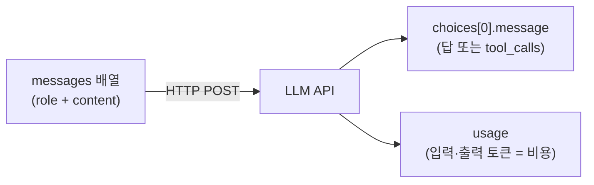
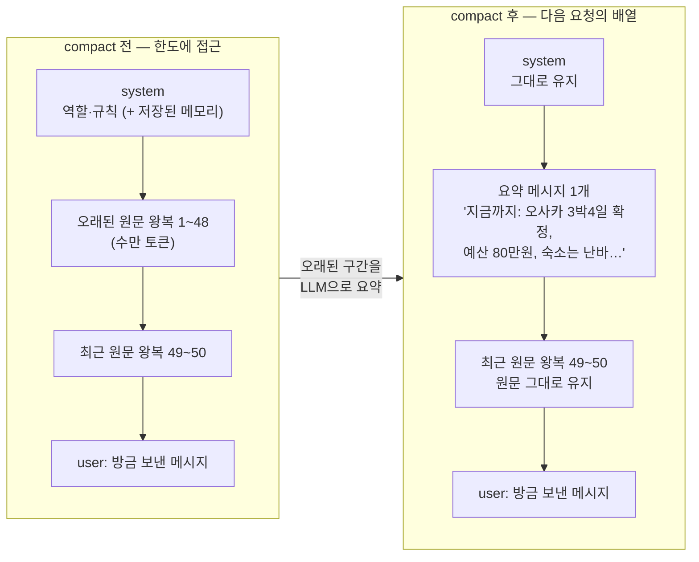
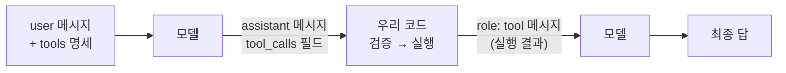
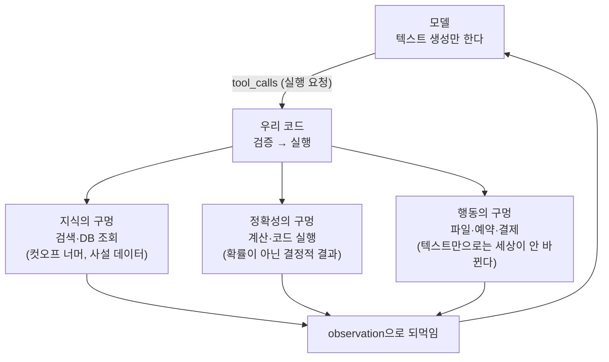
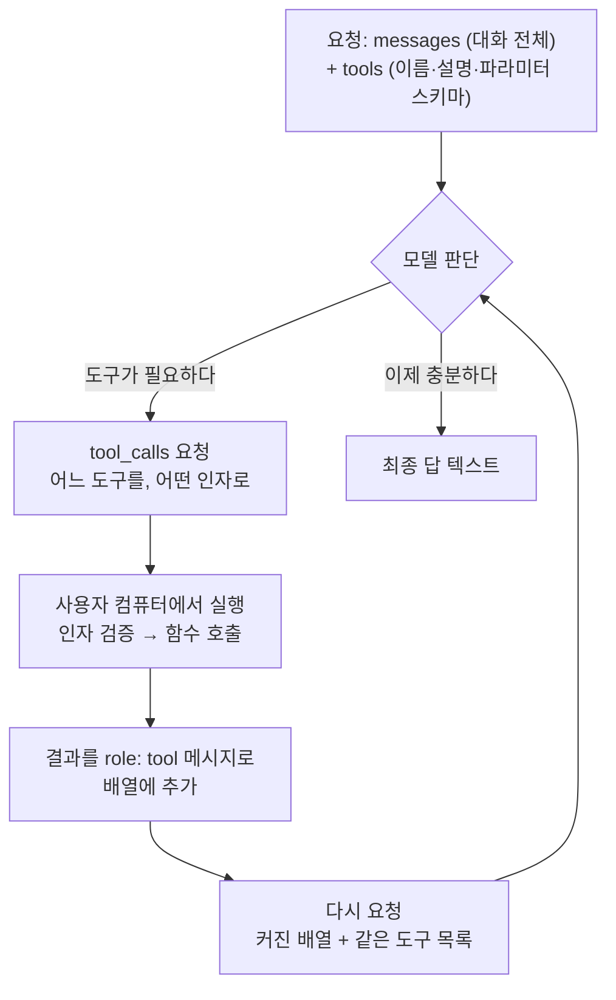
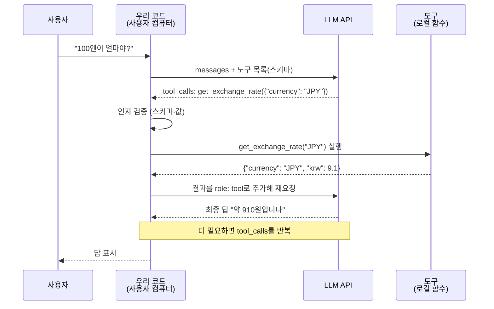

> 라이브 세션의 상세 교안입니다. 이번 주는 시연 저장소가 서비스가 아니라
> **실습 랩**입니다. 예제 31종을 하나씩 실행하며 원리를 손으로 확인합니다.

- **교재**: [week05-agent-lab](https://github.com/2026-ai-service-engineering-a/week05-agent-lab) 저장소
- **형태**: compose 실습 랩. `lab` 컨테이너 하나를 띄우고 예제·에이전트를 전부 터미널에서 실행
- **실행**: `docker compose exec lab python examples/...`
- **이어지는 주**: [6주차](/course/session-06/)에서 이 에이전트에 루프와 하네스가 실립니다

## 1. 세션 목표

1\~4주차에서 우리는 LLM을 **썼습니다**. 3주차의 파이프라인은 코드가
제어했고, 4주차의 RAG는 검색이 추린 것을 넘겼습니다. 그 사이 API 호출 자체는
`instructor`와 LiteLLM 뒤에 가려 있었습니다. 이번 주는 그 가림막을 걷습니다.

- **LLM API의 전부를 본다**: messages 배열을 보내면 choices가 돌아온다.
  역할·토큰·무상태·비용이 전부 이 한 줄에서 파생됩니다
- **통합 레이어를 제대로 쓴다**: 3주차에 이미 쓴 [[litellm|LiteLLM]]을
  이번엔 폴백·재시도·캐싱·라우터·비용 콜백까지 열어서 씁니다
- **[[tool-calling|tool calling]]을 바닥까지 해부한다**: 모델은 함수를
  실행하지 못합니다. "실행해 달라"고 요청할 뿐이고, 실행은 우리 코드의 일입니다
- **에이전트가 도구를 든다**: 세션 끝에서 여행 플래너가 v0.2로 오릅니다

이번 주의 마지막 문장은 이것입니다. **도구를 들었지만 아직 루프가 없다.**
그 결핍이 6주차의 출발점입니다.

## 2. 브리핑: 실습 랩 기동

### 2-1. 이번 주 저장소는 서비스가 아니라 랩입니다

1\~4주차의 시연 저장소는 동작하는 서비스였습니다. 이번 주는 다릅니다.
`lab` 컨테이너 하나를 띄워 두고, 예제 파일을 하나씩 실행하며 결과를 읽습니다.
각 파일 상단 docstring에 "무엇을 보는가"와 실행 명령이 적혀 있습니다.

- 모든 예제는 self-contained입니다. 하나가 망가져도 나머지는 돕니다
- 예제 31종 전부를 수업에서 실행합니다. 이 문서에 실행 결과가 함께 실려
  있어, 재현할 때 자기 출력과 대조할 수 있습니다
- 유닛 테스트는 키·네트워크 없이 돕니다: `docker compose exec lab pytest`

### 2-2. 릴리즈 사다리: 이번 주는 두 단

[[release-ladder|릴리즈 사다리]]는 지금까지와 같습니다. 태그 하나가 그 시점의
코드이고, 어느 단에서든 그 시점의 테스트가 통과합니다.

```bash
git checkout v0.1 && docker compose up --build -d   # 그 시점의 코드로 그 시점의 동작
git diff v0.1 v0.2                                  # 이번 feature가 코드로는 무엇이었나
docker compose exec lab pytest                      # 어느 태그에서든 그 시점의 테스트가 통과
```

| 릴리즈 | 상태 | 테스트 |
| --- | --- | --- |
| v0.1 | 예제 31종 + 에이전트 뼈대 (도구 없음) | 5개 통과 |
| v0.2 | 도구 장착: 예산 계산 도구가 스키마로 실림 | 16개 통과 |

6주차 랩은 이 v0.2에서 이어집니다. 그래서 그쪽의 첫 태그가 v0.1이 아니라
**v0.2**입니다.

### 2-3. 랩 기동과 환경 점검

```bash
git clone https://github.com/2026-ai-service-engineering-a/week05-agent-lab.git
cd week05-agent-lab
cp .env.sample .env        # 편집기로 열어 키 채우기 (셋 중 하나면 됨)
docker compose up --build -d
docker compose exec lab python check_env.py
```

3주차에 발급한 키를 그대로 쓰면 됩니다. `check_env.py`가 확인하는 것은 세
가지입니다. 키 유효성(채워진 키로 실제 호출 1회), 사용 가능한 모델, 컨테이너
내 패키지 버전.

```text
=== 패키지 버전 ===
  python   3.13.15
  litellm  1.96.2
  pydantic 2.13.4
  pytest   8.4.2

=== 키 점검 (채워진 키만, 프로바이더별 1회 호출) ===
  GEMINI_API_KEY       ✓ gemini/gemini-3.5-flash-lite — OK
  OPENAI_API_KEY       ✓ openai/gpt-5.4-nano — OK
  ANTHROPIC_API_KEY    ✓ anthropic/claude-haiku-4-5 — OK
```

키가 하나도 없으면 해결 방법을 안내하고 종료 코드 1로 끝납니다. 셋 중 하나만
채워도 과정 전체가 돕니다.

### 2-4. 비용은 얼마나 드나

호출 한 번은 티끌이지만 에이전트는 루프라서, 비용 감각을 장비처럼 챙깁니다.
아래는 이 랩의 실제 코드로 잰 값입니다.

| 하는 일 | 비용 |
| --- | --- |
| `check_env.py` 1회 (3사 각 1콜) | $0.0001 미만 |
| 예제 하나 실행 (호출 1\~5회) | $0.001 \~ $0.01 수준 |
| 여행 플래너 풀런 1회 (루프 + 도구 3종) | $0.003 \~ $0.010 |
| 루프가 8스텝을 다 쓰는 최악 시나리오 | $0.007 \~ $0.033 |

- 예제 31종을 전부 따라 돌리고 에이전트를 여러 번 실행해도 하루 $1
  안쪽입니다
- 유닛 테스트(`pytest`)는 LLM을 부르지 않으므로 0원입니다
- 키 없이 도는 예제(토큰 세기·단가표·스키마 생성·비용 계산)도 0원입니다
- 이 랩의 기본 모델 3종은 전부 각 사의 저가 티어입니다. 다만 프로바이더마다
  가격 하한이 달라 Anthropic이 상대적으로 비쌉니다

비용을 직접 계산하는 법은 3장 12절에서, 모델별 단가표는 4장 10절에서
다룹니다. 누적 비용에 상한을 거는 [[budget-guard|budget guard]]는 6주차입니다.

## 3. LLM API의 본질

교재는 `examples/01_api/` 11종입니다. **11종을 전부 실행합니다.** 아래에는
11종 전부의 실제 실행 결과가 실려 있습니다. 실측 환경은 litellm 1.96.2,
기본 모델 `gemini-3.5-flash-lite`입니다.

- **교재**: [examples/01_api](https://github.com/2026-ai-service-engineering-a/week05-agent-lab/tree/main/examples/01_api)
- **핵심 문장**: [[llm|LLM]] API의 전부는 "messages 배열을 보내면 choices가 돌아온다"
- **참고**: 예제의 `completion()`은 [[litellm|LiteLLM]]의 통일 인터페이스입니다. 공식 SDK 대신 이것을 쓰는 이유는 4장 1절에서 다룹니다



이 장의 예제 11종은 전부 이 그림 하나의 변주입니다. 무엇을 실어 보내는가
(역할·이미지·히스토리), 무엇이 돌아오는가(문장·JSON·델타 청크), 그리고
usage가 곧 돈이라는 것.

### 3-1. 최소 호출: 요청과 응답의 전부

코드: [`01_hello_completion.py`](https://github.com/2026-ai-service-engineering-a/week05-agent-lab/blob/main/examples/01_api/01_hello_completion.py)

#### 무엇을 보는가

요청에 무엇이 실려 가고 응답에 무엇이 담겨 오는지, JSON 원문을 그대로 봅니다.

#### 코드 발췌

```python
request = {
    "model": model,
    "messages": [{"role": "user", "content": "안녕하세요! 한 문장으로 인사해 주세요."}],
}
response = completion(**request)
print(response.model_dump_json(indent=2))
```

#### 코드 실행

```bash
docker compose exec lab python examples/01_api/01_hello_completion.py
```

#### 실행 결과

```text
=== 응답 원문 (모델이 돌려주는 것 전체) ===
{
  "model": "gemini-3.5-flash-lite",
  "choices": [
    {
      "finish_reason": "stop",
      "message": {
        "content": "안녕하세요! 만나서 반가운데, 오늘 어떤 도움이 필요하신가요?",
        "role": "assistant",
        "tool_calls": null,
        "provider_specific_fields": { "thought_signatures": ["El4KXAERTTIP…"] }
      }
    }
  ],
  "usage": { "completion_tokens": 16, "prompt_tokens": 11, "total_tokens": 27 }
}

=== 그중 실제로 쓰는 것 ===
  choices[0].message.content = '안녕하세요! 만나서 반가운데, 오늘 어떤 도움이 필요하신가요?'
  usage = 입력 11 토큰 + 출력 16 토큰
```

#### 결과 읽기

쓰는 것은 `content`와 `usage` 두 곳뿐이지만, `tool_calls: null` 자리를
기억해 두세요. 5장에서 저 자리가 채워지는 순간 에이전트가 시작됩니다.
`provider_specific_fields`처럼 프로바이더 고유 필드가 섞여 오는 것도
실물에서만 보이는 부분입니다.

### 3-2. 역할: system이 내용과 형식을 정한다

코드: [`02_roles.py`](https://github.com/2026-ai-service-engineering-a/week05-agent-lab/blob/main/examples/01_api/02_roles.py)

#### 무엇을 보는가

같은 질문("오사카에서 꼭 먹어야 할 것 하나만")에 system만 바꿔 붙입니다.

#### 코드 발췌

```python
personas = {
    "(system 없음)": None,
    "미슐랭 심사위원": "당신은 미슐랭 심사위원입니다. 미식가의 기준으로 깐깐하게 답하세요.",
    "초등학생 눈높이": "당신은 초등학생에게 설명하는 선생님입니다. …",
    "JSON 응답기": "반드시 {\"추천\": ..., \"이유\": ...} 형태의 JSON으로만 답하세요.",
}
```

#### 코드 실행

```bash
docker compose exec lab python examples/01_api/02_roles.py
```

#### 실행 결과

```text
=== system = (system 없음) ===
오사카 여행에서 단 하나만 먹어야 한다면 … '오코노미야키'를 추천합니다.

=== system = 미슐랭 심사위원 ===
… 미슐랭 심사위원의 엄격한 기준으로, 오직 단 하나의 미식 경험을 꼽아야
한다면 저는 망설임 없이 '제대로 된 갓포 요리(割烹)'를 선택하겠습니다.

=== system = 초등학생 눈높이 ===
와, 오사카 여행 정말 부럽다! 선생님은 타코야키를 꼭 추천할게! …

=== system = JSON 응답기 ===
{"추천": "타코야키", "이유": "오사카의 소울 푸드로, …"}
```

#### 결과 읽기

답의 내용(갓포 요리 vs 타코야키)과 형식(산문 vs JSON)이 전부 system에서
갈렸습니다. 에이전트의 성격·규칙·말투가 실리는 자리이고, 6주차의 하네스에서
이 자리가 방어선이 됩니다.

### 3-3. 토큰: 한글이 더 비싼 이유

코드: [`03_tokens.py`](https://github.com/2026-ai-service-engineering-a/week05-agent-lab/blob/main/examples/01_api/03_tokens.py)

#### 무엇을 보는가

API 호출 없이 토크나이저만으로 도는 예제라 키가 필요 없습니다.

#### 코드 실행

```bash
docker compose exec lab python examples/01_api/03_tokens.py
```

#### 실행 결과

```text
   한국어 |   영어 | 문장
    11 |    9 | 안녕하세요, 오늘 날씨가 정말 좋네요.…
    23 |   23 | 3박 4일 오사카 여행 일정을 짜 주세요. 예산은 80…
    19 |   10 | 대규모 언어 모델은 토큰 단위로 텍스트를 처리합니다.…
  합계: 한국어 53 토큰 vs 영어 42 토큰 (약 1.3배)
```

#### 결과 읽기

과금·컨텍스트 한도는 글자 수가 아니라 토큰 수 기준입니다. 같은 뜻을
한국어로 쓰면 이 랩 기준 약 1.3배의 토큰을 쓰고, 세 번째 문장(19 vs 10)처럼
2배 가까이 벌어지기도 합니다.

### 3-4. 컨텍스트 한도: 넘치면 잘리는 게 아니라 거부된다

코드: [`04_context_limit.py`](https://github.com/2026-ai-service-engineering-a/week05-agent-lab/blob/main/examples/01_api/04_context_limit.py)

#### 무엇을 보는가

채워진 키 중 한도가 가장 작은 모델을 골라, 한도의 1.5배를 보냅니다.
요청이 거부되므로 과금되지 않습니다.

#### 코드 발췌

```python
model = min(available_models(), key=lambda m: get_model_info(m)["max_input_tokens"])
limit = get_model_info(model)["max_input_tokens"]
text = chunk * (int(limit * 1.5) // chunk_tokens + 1)   # 확실히 초과
```

#### 코드 실행

```bash
docker compose exec lab python examples/01_api/04_context_limit.py
```

#### 실행 결과

```text
=== anthropic/claude-haiku-4-5의 입력 한도 ===
  max_input_tokens = 200,000

=== 일부러 초과 요청 ===
  보내는 입력: 약 300,001 토큰 (한도의 1.5배)

=== 에러 원문 ===
  ContextWindowExceededError
  … "prompt is too long: 275024 tokens > 200000 maximum"
```

#### 결과 읽기

두 가지가 보입니다. ① 초과분은 잘리는 게 아니라 요청 자체가 거부된다.
② 우리가 근사 토크나이저로 센 30만 토큰을 프로바이더는 27.5만으로 셌다.
토큰 수는 모델마다 다르게 세므로, 한도 근처의 계산은 항상 여유를 둬야 합니다.
에이전트 루프에서 히스토리가 무한히 자라면 정확히 이 에러를 만납니다.

### 3-5. temperature: 재현성과 다양성의 손잡이

코드: [`05_temperature.py`](https://github.com/2026-ai-service-engineering-a/week05-agent-lab/blob/main/examples/01_api/05_temperature.py)

#### 무엇을 보는가

temperature 0과 1로 같은 질문을 5번씩 던집니다.

#### 코드 발췌

```python
# Gemini 3+는 temperature를 시스템 지침으로 옮기는 중이라(호출마다 경고),
# 이 파라미터의 시연은 다른 프로바이더를 우선한다.
model = next((m for m in models if not m.startswith("gemini/")), models[0])
```

#### 코드 실행

```bash
docker compose exec lab python examples/01_api/05_temperature.py
```

#### 실행 결과

```text
(시연 모델: openai/gpt-5.4-nano)

=== temperature = 0.0 ===
  1회: 도쿄 / 2회: 도쿄 / 3회: 도쿄 / 4회: 도쿄 / 5회: 도쿄
  → 서로 다른 답 1종

=== temperature = 1.0 ===
  1회: **도쿄** / 2회: 도쿄 / 3회: 도쿄 / 4회: **오사카** / 5회: 도쿄 (Tokyo)
  → 서로 다른 답 4종
```

#### 결과 읽기

0이면 5번 모두 같은 답, 1이면 내용도 표기도 흩어집니다. 재현성이
필요한 자리(도구 선택·채점·검증)는 0, 발상이 필요한 자리는 높게 씁니다.
곁가지 발견 하나: Gemini 3+는 이 파라미터 자체를 은퇴시키는 중입니다.
같은 파라미터도 프로바이더마다 지원 상태가 다르다는 실례입니다.

### 3-6. 스트리밍: 답은 조각으로 온다

코드: [`06_streaming.py`](https://github.com/2026-ai-service-engineering-a/week05-agent-lab/blob/main/examples/01_api/06_streaming.py)

#### 무엇을 보는가

stream=True로 같은 질문을 던지고, 완성된 답 대신 흘러오는 델타 청크의
원문을 그대로 관찰합니다. 채팅 UI가 글자를 한 글자씩 흘리는 것의 실체입니다.

#### 코드 실행

```bash
docker compose exec lab python examples/01_api/06_streaming.py
```

#### 실행 결과

```text
=== 처음 5개 청크 원문 ===
  chunk[0] delta='**'
  chunk[1] delta='"먹다 지쳐 쓰러진다는 \'구이도락(食い'
  chunk[2] delta="倒れ)'의 본고장이자, 화려한 네온사인과 정겨운 인간미가 공존"
  chunk[3] delta='하는 일본 최고의 활기찬 도시."**'
  chunk[4] delta=''

=== 조각을 이어붙인 전체 답 ===
  **"먹다 지쳐 쓰러진다는 '구이도락(食い倒れ)'의 본고장이자, …"** (총 6개 청크)
```

#### 결과 읽기

채팅 UI가 글자를 흘리는 것의 실체가 이 델타 조각들입니다. 조각의 크기와
경계는 프로바이더 마음이라(청크 0은 `**` 두 글자, 청크 2는 한 구절), 이어붙이는
쪽이 완성 텍스트를 책임집니다.

### 3-7. 병렬 호출: 동시에 물으면 몇 배 빠른가

코드: [`07_async_parallel.py`](https://github.com/2026-ai-service-engineering-a/week05-agent-lab/blob/main/examples/01_api/07_async_parallel.py)

#### 무엇을 보는가

도시 5곳의 대표 음식을 순차로 묻고, 다시 동시에 묻습니다.

#### 코드 발췌

```python
tasks = [acompletion(model=model, messages=[…]) for city in cities]
await asyncio.gather(*tasks)
```

#### 코드 실행

```bash
docker compose exec lab python examples/01_api/07_async_parallel.py
```

#### 실행 결과

```text
=== 순차 호출 (5회) ===   5.2초
=== 병렬 호출 (5회 동시) ===   1.5초
=== 비교 ===   순차 5.2초 → 병렬 1.5초 (약 3.4배)
```

#### 결과 읽기

LLM 호출은 네트워크 대기가 대부분이라 병렬화 이득이 큽니다.
`acompletion` + `gather` 패턴 하나면 충분합니다. 여러 곳을 동시에 물어보는
에이전트라면 이 패턴이 그대로 확장판이 됩니다.

### 3-8. 무상태: 기억은 서버가 아니라 배열에 있다

코드: [`08_multiturn_stateless.py`](https://github.com/2026-ai-service-engineering-a/week05-agent-lab/blob/main/examples/01_api/08_multiturn_stateless.py)

#### 무엇을 보는가

이름을 알려준 뒤 두 가지로 다시 묻습니다. 히스토리 없이, 그리고 히스토리를
실어서. 기억이 서버에 있는지 배열에 있는지를 가르는 실험입니다.

#### 코드 실행

```bash
docker compose exec lab python examples/01_api/08_multiturn_stateless.py
```

#### 실행 결과

```text
=== 1턴: 자기소개 ===
  김철수님, 안녕하세요! 오사카 여행 계획을 세우고 계시다니 …

=== 2턴 (히스토리 없이): 제 이름이 뭐라고 했죠? ===
  죄송하지만, 이전 대화에서 이름을 말씀해 주지 않으셔서 저는 아직 성함을
  모릅니다.

=== 2턴 (히스토리 포함): 같은 질문 ===
  철수님의 이름은 김철수님이십니다!
```

#### 결과 읽기

서버는 아무것도 기억하지 않습니다. "이어지는 대화"는 클라이언트가
messages 배열 전체를 매번 다시 보내서 만드는 착시입니다. 이 배열이 스텝마다
부풀어 비싸지는 것이 에이전트 루프의 비용 구조이고(6주차에서 그래프로 봅니다),
이 배열을 관리하는 일이 곧 컨텍스트 엔지니어링입니다.

### 3-9. 기억의 정체: 채팅이 나를 기억하는 이유와 compact

8번에서 서버가 아무것도 기억하지 않는 것을 확인했습니다. 그런데 우리가 쓰는
채팅 서비스는 분명히 나를 기억합니다. 이 간극을 메우는 장치가 전부
messages 배열의 관리 기법입니다.

#### 채팅이 항상 나를 기억하는 이유

- **같은 대화 안에서의 기억**: 8번 그대로입니다. 클라이언트가 대화 전체를
  매번 다시 보냅니다. 서비스가 기억하는 게 아니라 배열이 기억합니다
- **대화를 새로 열어도 남는 기억**: ChatGPT의 메모리, Claude의 프로젝트
  지식 같은 기능은 별도 저장소에 적어 둔 사실("사용자는 개발자다",
  "반말을 선호한다")을 다음 대화의 system 메시지 근처에 끼워 넣습니다.
  모델이 기억하는 게 아니라, 매번 읽고 시작하는 쪽지가 있는 것입니다

#### 그런데 배열은 자라기만 한다

대화가 길어질수록 매 턴의 재전송 분량이 커집니다. 방치하면 세 가지 벽에
부딪힙니다.

- **한도**: 4번에서 본 그대로, 넘치는 순간 요청 자체가 거부됩니다
- **비용**: 12번의 산수대로, 입력 토큰은 매 턴 전체를 다시 냅니다
- **품질**: 컨텍스트가 길어지면 모델이 오래된 세부를 놓치기 시작합니다

그래서 Claude Code 같은 도구는 대화가 차오르면 **compact**를 돌립니다.
오래된 원문을 LLM으로 요약해, 짧은 메시지 하나로 갈아끼우는 작업입니다.

#### compact가 배열을 바꾸는 모양



- **유지되는 것**: system 메시지, 최근 왕복 몇 개의 원문, 방금 보낸 메시지.
  최근 원문을 남기는 이유는 진행 중인 작업의 세부(코드 조각, 직전 지시)가
  요약으로 뭉개지면 안 되기 때문입니다
- **치환되는 것**: 오래된 왕복 수십 개가 요약 메시지 하나로 줄어듭니다.
  수만 토큰이 수백 토큰이 됩니다
- **모델 입장에서는 구분이 없다**: 요약도 그냥 배열 속 메시지 하나입니다.
  서버는 여전히 무상태이고, 바뀐 것은 우리가 보내는 배열의 내용뿐입니다

#### 대가: 요약은 손실 압축이다

compact 직후에 한참 전의 세부("아까 그 함수 이름 뭐였지?")를 물으면 모델이
모르는 이유가 이것입니다. 요약에서 빠진 내용은 배열에서 사라진 것이고,
사라진 것은 존재하지 않는 것입니다. 무엇을 요약에 남길 것인가가 곧 도구의
품질이고, 이 판단의 자동화가 컨텍스트 엔지니어링의 한 축입니다.

6주차에서 우리 에이전트의 컨텍스트가 스텝마다 부푸는 것을 실측하는데, 그
곡선의 끝에서 만나는 해법이 바로 이 구조입니다.

### 3-10. JSON 강제: 부탁이 아니라 계약으로

코드: [`09_json_mode.py`](https://github.com/2026-ai-service-engineering-a/week05-agent-lab/blob/main/examples/01_api/09_json_mode.py)

#### 무엇을 보는가

같은 요청을 두 방식으로 보냅니다. 프롬프트로 부탁만 한 버전과
response_format으로 강제한 버전. 각각을 json.loads에 통과시켜 봅니다.

#### 코드 실행

```bash
docker compose exec lab python examples/01_api/09_json_mode.py
```

#### 실행 결과

````text
=== 그냥 부탁만 한 경우 ===
  오사카의 대표적인 명소 2곳을 담은 JSON 배열입니다.
  ```json
  [ { "name": "오사카 성", … } ]
  ```
  → json.loads 실패: Expecting value: line 1 column 1 (char 0)

=== response_format으로 강제한 경우 ===
  [{"name": "오사카 성", "fee": "600엔"}, {"name": "우메다 스카이 빌딩", "fee": "2000엔"}]
  → json.loads 통과
````

#### 결과 읽기

부탁하면 설명 문장과 코드펜스가 섞여 와서 파싱이 깨집니다. 강제하면
파싱이 계약이 됩니다. 다만 형태의 계약일 뿐 값의 계약은 아니라서(fee가
"600엔"이라는 문자열), 타입까지 묶는 방법은 5장의 구조화 출력에서 잇습니다.

### 3-11. 이미지 입력: 멀티모달도 같은 구조

코드: [`10_vision.py`](https://github.com/2026-ai-service-engineering-a/week05-agent-lab/blob/main/examples/01_api/10_vision.py)

#### 무엇을 보는가

공개 이미지를 직접 내려받아 base64 data URL로 싣습니다.

#### 코드 발췌

```python
req = urllib.request.Request(image_url, headers={"User-Agent": "week05-agent-lab/1.0"})
image_b64 = base64.b64encode(urllib.request.urlopen(req).read()).decode()
content = [
    {"type": "text", "text": "이 사진의 건물이 무엇인지 한 문장으로 답해 주세요."},
    {"type": "image_url", "image_url": {"url": f"data:image/jpeg;base64,{image_b64}"}},
]
```

#### 코드 실행

```bash
docker compose exec lab python examples/01_api/10_vision.py
```

#### 실행 결과

```text
=== 이미지 입력의 모양 ===
  원본 86KB(base64)가 data URL로 content 배열에 들어간다

=== 응답 ===
  이 사진 속 주요 건물은 일본 오사카에 위치한 역사적인 랜드마크인 오사카성입니다.
```

#### 결과 읽기

content가 문자열에서 [text 조각, image 조각] 배열로 바뀌었을 뿐, 구조는
같습니다. 참고로 이 예제는 처음에 이미지 URL을 그대로 넘기다가 호스트의
User-Agent 차단과 썸네일 정책에 두 번 깨졌습니다. 이미지를 직접 받아 base64로
싣는 지금 방식이 실전에서도 안전한 형태입니다.

### 3-12. 비용 계산: 토큰 곱하기 단가

코드: [`11_cost_calc.py`](https://github.com/2026-ai-service-engineering-a/week05-agent-lab/blob/main/examples/01_api/11_cost_calc.py)

#### 무엇을 보는가

키 없이 돕니다. 비용 = 입력 토큰 × 입력 단가 + 출력 토큰 × 출력 단가.

#### 코드 실행

```bash
docker compose exec lab python examples/01_api/11_cost_calc.py
```

#### 실행 결과

```text
=== 모델별 비용 (litellm 내장 단가표) ===
  모델                              입력단가/1M   출력단가/1M      이 호출
  gemini/gemini-3.5-flash-lite     $     0.30   $     2.50   $ 0.001257
  openai/gpt-5.4-nano              $     0.20   $     1.25   $ 0.000630
  anthropic/claude-haiku-4-5       $     1.00   $     5.00   $ 0.002523
```

#### 결과 읽기

"3박 4일 오사카" 요청에 500토큰짜리 답을 가정한 계산입니다. 호출 한
번은 티끌이지만 에이전트는 루프입니다. 스텝 10번, 부푸는 히스토리, 멀티
에이전트 N명이면 자릿수가 달라집니다. 그래서 6주차에서
[[budget-guard|budget guard]]를 답니다.

## 4. LiteLLM 통합 레이어

교재는 `examples/02_litellm/` 10종입니다. **10종을 전부 실행합니다.** 아래에는
10종 전부의 실제 실행 결과가 실려 있습니다. 3사 키를 전부 채운 상태에서
잰 값입니다.

- **교재**: [examples/02_litellm](https://github.com/2026-ai-service-engineering-a/week05-agent-lab/tree/main/examples/02_litellm)
- **핵심 문장**: [[litellm|LiteLLM]]에서 프로바이더 교체는 model= 문자열 한 줄이다

### 4-1. 왜 LiteLLM인가: 공식 SDK 대신 통합 레이어

3장의 예제들이 이미 `from litellm import completion`을 썼습니다. 각 사가
공식 SDK를 제공하는데도 이 랩이 LiteLLM 하나로 통일한 이유를, 장비 투어에
들어가기 전에 정리하고 갑니다.

#### 공식 SDK의 세계

OpenAI는 `openai`, Google은 `google-genai`, Anthropic은 `anthropic` 패키지를
제공합니다. 셋은 함수 이름도, 인자도, 응답 구조도 다릅니다.

```python
# 세 회사의 공식 SDK — 같은 일을 세 가지 문법으로
openai.OpenAI().chat.completions.create(model="gpt-5.4-nano", messages=[…])
genai.Client().models.generate_content(model="gemini-3.5-flash-lite", contents="…")
anthropic.Anthropic().messages.create(model="claude-haiku-4-5", max_tokens=1024, messages=[…])

# LiteLLM — 셋 다 이 한 줄. 바뀌는 것은 model 문자열뿐
litellm.completion(model="<프로바이더/모델>", messages=[…])
```

공식 SDK로 3사를 지원하려면 호출부 세 벌, 응답 파싱 세 벌, 에러 처리 세 벌을
유지해야 합니다. LiteLLM은 그 셋을 OpenAI 호환 형태 하나로 통일합니다.

#### 장점: 왜 쓰는가

- **교체 비용이 문자열 한 줄**: 프로바이더를 바꾸는 일이 코드 수정이 아니라
  설정 변경이 됩니다. 이 랩이 2026-08-14 하루에 Gemini와 OpenAI 기본 모델을
  갈아끼우고도 예제를 한 줄도 안 고친 것이 그 실증입니다. 이 장 끝의
  사례 절이 그 기록입니다
- **셋 중 어떤 키를 채워도 같은 코드**: 이 과정의 요구사항입니다. 수강생마다
  가진 키가 달라도 모든 예제가 그대로 돕니다
- **부대 장비 내장**: 단가표(`get_model_info`), 토큰 카운터, 폴백, 재시도,
  캐시, 라우터, 비용 콜백. 이 장에서 하나씩 씁니다
- **넓은 커버리지**: 100개 이상의 프로바이더를 같은 인터페이스로 다룹니다

#### 단점: 무엇을 대가로 치르는가

- **추상화 한 겹의 비용**: 에러가 litellm 예외로 감싸여 오고, 디버깅 시
  스택이 한 층 깊어집니다
- **프로바이더 고유 기능의 지연·누수**: 새 기능은 litellm이 지원할 때까지
  기다리거나, 3장 1절의 응답 원문에서 본 `provider_specific_fields`처럼
  표준 밖 필드로 새어 나옵니다. Gemini 3+의 temperature 은퇴를 경고로만
  전달하던 3장의 temperature 예제도 같은 결입니다
- **라이브러리 자체에 의존**: 단가표의 최신성, 새 모델 등재 속도, 버그가
  전부 litellm 버전에 묶입니다. 이 랩이 버전을 고정한 이유입니다

#### 판단 기준

- 프로바이더 하나를 확정했고 그 고유 기능을 깊이 쓴다면: 공식 SDK
- 멀티 프로바이더, 교체 가능성, 비용·품질 비교가 필요하다면: 통합 레이어
- 이 과정은 3사를 오가며 비교하는 것 자체가 커리큘럼이므로 LiteLLM입니다.
  폴백·라우터·캐시 같은 실전 장비를 지금부터 하나씩 돌려 봅니다

### 4-2. 프로바이더 교체는 문자열 한 줄

코드: [`01_provider_swap.py`](https://github.com/2026-ai-service-engineering-a/week05-agent-lab/blob/main/examples/02_litellm/01_provider_swap.py)

#### 무엇을 보는가

호출 코드는 한 글자도 바뀌지 않습니다. 바뀌는 것은 `model=` 문자열뿐입니다.

#### 코드 발췌

```python
for model in available_models():          # 키가 채워진 프로바이더들
    answer = completion(
        model=model, messages=[{"role": "user", "content": question}]
    ).choices[0].message.content
```

#### 코드 실행

```bash
docker compose exec lab python examples/02_litellm/01_provider_swap.py
```

#### 실행 결과

```text
=== gemini/gemini-3.5-flash-lite ===
  저는 구글(Google)에서 개발한 대규모 언어 모델, 제미나이(Gemini)입니다.

=== openai/gpt-5.4-nano ===
  저는 OpenAI의 ChatGPT(대화형 AI) 모델입니다.

=== anthropic/claude-haiku-4-5 ===
  저는 Anthropic이 만든 Claude라는 AI 어시스턴트입니다.
```

#### 결과 읽기

세 회사의 세 모델이 같은 `completion()` 하나로 답했습니다. 이 랩의
모델 문자열은 전부 `agent/config.py` 한 곳에 있고, 예제 어디에도 하드코딩이
없습니다. 이 통일이 이후 모든 것(폴백·라우팅·모델 배정)의 토대입니다.

### 4-3. 3사 비교: 응답·지연·비용을 나란히

코드: [`02_three_way_compare.py`](https://github.com/2026-ai-service-engineering-a/week05-agent-lab/blob/main/examples/02_litellm/02_three_way_compare.py)

#### 무엇을 보는가

"어느 모델을 쓸까"는 감이 아니라 측정의 문제입니다.

#### 코드 실행

```bash
docker compose exec lab python examples/02_litellm/02_three_way_compare.py
```

#### 실행 결과

```text
=== 비교 표 ===
  모델                                 지연    입력tk    출력tk        비용
  gemini/gemini-3.5-flash-lite       1.5s      24      90 $  0.000232
  openai/gpt-5.4-nano                1.7s      30     120 $  0.000156
  anthropic/claude-haiku-4-5         2.3s      43     124 $  0.000663
```

#### 결과 읽기

같은 프롬프트("오사카 1일 코스 세 줄")인데 입력 토큰부터 다릅니다.
프로바이더마다 토크나이저와 내부 포장이 다르기 때문입니다. 품질은 눈으로
(전체 로그에 세 답이 나란히 있습니다), 지연과 비용은 숫자로 비교합니다.

### 4-4. 폴백: 주 모델이 죽으면 이어받는다

코드: [`03_fallback.py`](https://github.com/2026-ai-service-engineering-a/week05-agent-lab/blob/main/examples/02_litellm/03_fallback.py)

#### 무엇을 보는가

일부러 존재하지 않는 모델을 1순위로 두고 실제 모델을 폴백으로 답니다.

#### 코드 발췌

```python
resp = completion(
    model="openai/gpt-없는-모델",          # 반드시 실패하는 1순위
    messages=[…],
    fallbacks=["gemini/gemini-3.5-flash-lite"],
)
```

#### 코드 실행

```bash
docker compose exec lab python examples/02_litellm/03_fallback.py
```

#### 실행 결과

```text
LiteLLM:ERROR: … Fallback attempt failed for model openai/gpt-없는-모델:
  litellm.BadRequestError: OpenAIException - invalid model ID

=== 결과 ===
  실제 응답한 모델: gemini-3.5-flash-lite
  답: 폴백 성공
```

#### 결과 읽기

1순위의 실패 로그가 찍히고, 같은 `completion()` 한 번 안에서 폴백이
응답을 완성했습니다. 이 장 끝의 "모델 교체 사례"처럼 모델은 예고 없이
은퇴합니다. 폴백은 옵션이 아니라 기본 장비입니다.

### 4-5. 재시도와 타임아웃: 순간 장애의 방어

코드: [`04_retry_timeout.py`](https://github.com/2026-ai-service-engineering-a/week05-agent-lab/blob/main/examples/02_litellm/04_retry_timeout.py)

#### 무엇을 보는가

일부러 불가능한 타임아웃(0.001초)으로 Timeout 에러를 재현하고, 정상
설정(30초 + 재시도 2회)이 조용히 통과하는 것과 대조합니다.

#### 코드 실행

```bash
docker compose exec lab python examples/02_litellm/04_retry_timeout.py
```

#### 실행 결과

```text
=== 타임아웃 재현 (timeout=0.001초) ===
  litellm.Timeout: Connection timed out …

=== 정상 설정 (timeout=30초, num_retries=2) ===
  답: 2
  실패하면 최대 2회까지 자동으로 다시 시도한 뒤에야 에러를 낸다
```

#### 결과 읽기

timeout은 "이 시간 안에 답이 없으면 끊는다", num_retries는 "끊기면 몇 번
다시"입니다. 폴백(모델 장애)과 재시도(순간 장애)와 백오프(rate limit)는 각각
다른 종류의 장애를 맡는 세 겹의 방어입니다.

### 4-6. 캐싱: 같은 질문 두 번째는 공짜·즉시

코드: [`05_cache.py`](https://github.com/2026-ai-service-engineering-a/week05-agent-lab/blob/main/examples/02_litellm/05_cache.py)

#### 무엇을 보는가

인메모리 캐시를 켜고 같은 요청을 두 번 보냅니다. 두 번째가 API까지
다녀오는지, 캐시에서 즉시 돌아오는지를 지연 시간으로 확인합니다.

#### 코드 발췌

```python
litellm.cache = Cache(type="local")       # 프로세스 안 인메모리 캐시
r1 = completion(model=model, messages=messages, caching=True)
r2 = completion(model=model, messages=messages, caching=True)   # 캐시에서
```

#### 코드 실행

```bash
docker compose exec lab python examples/02_litellm/05_cache.py
```

#### 실행 결과

```text
=== 1회차 (API까지 다녀옴) ===   2.09초
=== 2회차 (같은 요청) ===   0.002초
=== 비교 ===   2.09초 → 0.002초. 같은 답인가: True
```

#### 결과 읽기

1,000배 빠르고 비용은 0입니다. FAQ·반복 질의가 많은 서비스의 기본
손잡이입니다. 단, 같은 요청이어야 하고(messages가 1바이트라도 다르면 미스),
신선도가 중요한 질문에는 쓰지 않습니다.

### 4-7. 비용 콜백: 호출마다 장부에 쌓인다

코드: [`06_cost_callback.py`](https://github.com/2026-ai-service-engineering-a/week05-agent-lab/blob/main/examples/02_litellm/06_cost_callback.py)

#### 무엇을 보는가

호출부에는 한 줄도 손대지 않고 콜백 하나만 등록한 뒤, 호출 3건의 비용이
장부에 저절로 쌓이는 것을 봅니다.

#### 코드 발췌

```python
def track_cost(kwargs, completion_response, start_time, end_time):
    ledger["calls"] += 1
    ledger["cost"] += kwargs.get("response_cost") or 0.0

litellm.success_callback = [track_cost]
```

#### 코드 실행

```bash
docker compose exec lab python examples/02_litellm/06_cost_callback.py
```

#### 실행 결과

```text
  호출: '1+1은?' / '오사카는 어느 나라?' / '라멘 한 그릇 평균 가격은?'

=== 장부 ===
  호출 3건, 누적 비용 $0.000870
```

#### 결과 읽기

호출부에는 비용 코드가 한 줄도 없습니다. 콜백 하나 등록하면 모든
completion의 비용이 장부로 흘러듭니다. 6주차의 [[budget-guard|budget guard]]가
정확히 이 자리에서 누적 비용을 지켜봅니다.

### 4-8. rate limit: 백오프로 살아남기

코드: [`07_rate_limit.py`](https://github.com/2026-ai-service-engineering-a/week05-agent-lab/blob/main/examples/02_litellm/07_rate_limit.py)

#### 무엇을 보는가

429를 만나면 1초 → 2초 → 4초 기다렸다 재시도하는 백오프를 달고, 빠른 연속
호출 15번으로 한도를 만나러 갑니다.

#### 코드 실행

```bash
docker compose exec lab python examples/02_litellm/07_rate_limit.py
```

#### 실행 결과

```text
=== 연속 15회 빠른 호출 (한도를 만나러 간다) ===
  1회 성공 … 15회 성공

=== 정리 ===
  한도는 장애가 아니라 일상이다. 백오프는 에이전트 루프의 기본 장비다.
```

#### 결과 읽기

이번 실측은 유료 티어라 15연속으로도 한도에 닿지 않았고, 백오프 코드는
할 일 없이 통과했습니다. 무료 티어에서 같은 코드를 돌리면 중간에
`429! 1초 백오프 후 재시도` 줄이 등장합니다. 걸리든 안 걸리든 코드는 같아야
한다는 것이 요점입니다.

### 4-9. 라우터: 별명 하나 뒤에 배포 여러 개

코드: [`08_router.py`](https://github.com/2026-ai-service-engineering-a/week05-agent-lab/blob/main/examples/02_litellm/08_router.py)

#### 무엇을 보는가

실모델 여러 개를 travel-llm이라는 별명 하나로 묶고, 같은 별명으로 요청
6건을 보내 어느 모델이 받는지 관찰합니다.

#### 코드 발췌

```python
deployments = [
    {"model_name": "travel-llm", "litellm_params": {"model": m}}
    for m in available_models()
]
router = Router(model_list=deployments, routing_strategy="simple-shuffle")
resp = router.completion(model="travel-llm", messages=[…])
```

#### 코드 실행

```bash
docker compose exec lab python examples/02_litellm/08_router.py
```

#### 실행 결과

```text
=== 배포 3개에 요청 6건 분산 ===
  요청 1 → 처리한 모델: claude-haiku-4-5-20251001
  요청 2 → 처리한 모델: gpt-5.4-nano-2026-03-17
  요청 3 → 처리한 모델: gpt-5.4-nano-2026-03-17
  요청 4 → 처리한 모델: claude-haiku-4-5-20251001
  요청 5 → 처리한 모델: claude-haiku-4-5-20251001
  요청 6 → 처리한 모델: gemini-3.5-flash-lite
```

#### 결과 읽기

호출부는 `travel-llm`이라는 별명 하나만 압니다. 어떤 실모델이 받을지는
라우터의 일이고, 6건이 3사에 흩어졌습니다. 쉬운 질문은 싼 모델로, 어려운
질문은 좋은 모델로 나누는 배정이 이 구조 위에 섭니다.

### 4-10. 모델 메타데이터: 한도와 단가를 코드로 읽는다

코드: [`09_model_info.py`](https://github.com/2026-ai-service-engineering-a/week05-agent-lab/blob/main/examples/02_litellm/09_model_info.py)

#### 무엇을 보는가

키 없이 도는 예제입니다. litellm이 내장한 모델 메타데이터를 읽습니다.

#### 코드 실행

```bash
docker compose exec lab python examples/02_litellm/09_model_info.py
```

#### 실행 결과

```text
=== 이 랩이 쓰는 모델들 ===
  모델                                입력한도     출력한도   입력$/1M   출력$/1M
  gemini/gemini-3.5-flash-lite      1,048,576    65,536      0.30      2.50
  openai/gpt-5.4-nano                 272,000   128,000      0.20      1.25
  anthropic/claude-haiku-4-5          200,000    64,000      1.00      5.00
  gemini/gemini-embedding-001           2,048         0      0.15      0.00
```

#### 결과 읽기

"이 입력이 들어가는가"와 "이 호출은 얼마인가"를 코드가 실행 전에 판단할
수 있다는 뜻입니다. 3장의 한도 초과 예제가 저 입력한도 열을 읽었고,
6주차의 사전 비용 추정이 저 단가 열을 읽습니다.

### 4-11. 임베딩: 같은 인터페이스의 다른 출구

코드: [`10_embedding.py`](https://github.com/2026-ai-service-engineering-a/week05-agent-lab/blob/main/examples/02_litellm/10_embedding.py)

#### 무엇을 보는가

completion이 문장을 돌려준다면 embedding은 숫자 벡터를 돌려줍니다.
Google 키가 필요한 예제입니다.

#### 코드 실행

```bash
docker compose exec lab python examples/02_litellm/10_embedding.py
```

#### 실행 결과

```text
=== 벡터의 모양 ===
  문장 1개 → 3072차원 벡터
  앞 6개 값: [0.0116, -0.004, 0.0088, -0.0772, -0.0033, -0.0068]

=== 코사인 유사도 ===
  '국물 요리' vs '탕이나 찌개' = 0.843  (의미가 가깝다)
  '국물 요리' vs '주가 상승'   = 0.599  (멀다)
```

#### 결과 읽기

단어가 하나도 겹치지 않는 "든든한 국물 요리"와 "뜨끈한 탕이나 찌개"가
0.843으로 가깝게 잡혔습니다. 4주차의 의미 검색이 바로 이 [[embedding|임베딩]]
벡터 위에 섰습니다.

### 4-12. 사례: 모델 교체가 실제로 일어났다

이 랩의 Gemini 기본 모델은 원래 `gemini-2.5-flash`였는데, 2026-08-14에
신규 발급 키에서 404(NotFoundError)가 나는 것이 확인되어
`gemini-3.5-flash-lite`로 교체했습니다. 단가는 동일하고, hotfix `v1.0.1`로
나갔습니다.

- 같은 날 OpenAI 쪽도 정렬했습니다. `gpt-5-mini`(2025-08)는 아직 돌지만
  세 세대 뒤라 같은 은퇴 리스크가 있어, 현행 세대의 동급 티어인
  `gpt-5.4-nano`(2026-03)로 바꿨습니다. 이쪽은 hotfix `v1.0.2`입니다.
  Anthropic은 Claude 5 패밀리에 아직 haiku가 없어 `claude-haiku-4-5`가
  그대로 현행입니다
- 두 번 모두 고친 파일은 `agent/config.py` **한 곳**입니다. 예제 전부와
  에이전트 본체는 한 줄도 바뀌지 않았습니다. "모델 이름은 한 곳에만"의
  실증입니다
- 교체 전 검증도 이 장의 도구로 했습니다: 후보 모델들을 실제 1회 호출로
  확인하고, litellm 단가표 등재 여부를 `get_model_info`로 조회한 뒤,
  에이전트를 끝까지 돌려 도구 호출 품질을 비교했습니다
- 프로바이더 장애·모델 은퇴는 예외 상황이 아니라 일상입니다. 폴백과 통일
  인터페이스가 있는 이유입니다

## 5. Tool calling 심화

교재는 `examples/03_tools/` 10종이고, 이 장 끝에서 릴리즈 사다리의 **v0.2**로
오릅니다. **10종을 전부 실행합니다.** 아래에는 10종 전부의 실제 실행 결과가
실려 있습니다.

- **교재**: [examples/03_tools](https://github.com/2026-ai-service-engineering-a/week05-agent-lab/tree/main/examples/03_tools)
- **핵심 문장**: 모델은 함수를 실행하지 못한다. "실행해 달라"고 요청할 뿐이고, 실행은 우리 코드의 일이다



[[tool-calling|tool calling]]의 전부가 이 왕복 한 번입니다. 모델이 보내는
것도, 우리가 돌려주는 것도 결국 messages 배열에 쌓이는 평범한 메시지입니다.

### 5-1. 왕복 한 번을 끝까지 손으로

코드: [`01_single_tool.py`](https://github.com/2026-ai-service-engineering-a/week05-agent-lab/blob/main/examples/03_tools/01_single_tool.py)

#### 무엇을 보는가

환율 조회 도구 1개짜리 최소 구성입니다.

#### 코드 발췌

```python
def get_exchange_rate(currency: str) -> dict:
    return {"currency": currency, "krw": RATES[currency]}

resp = completion(model=model, messages=messages, tools=tools)
call = resp.choices[0].message.tool_calls[0]          # ① 모델의 실행 요청
result = get_exchange_rate(**json.loads(call.function.arguments))  # ② 우리가 실행
messages.append({"role": "tool", "tool_call_id": call.id,
                 "content": json.dumps(result)})       # ③ 결과 회신
```

#### 코드 실행

```bash
docker compose exec lab python examples/03_tools/01_single_tool.py
```

#### 실행 결과

```text
=== 1왕복: 모델이 도구를 요청한다 ===
  요청된 함수: get_exchange_rate
  요청된 인자: {"currency": "JPY"}

=== 2왕복: 우리가 실행하고, 결과를 되돌려준다 ===
  실행 결과: {'currency': 'JPY', 'krw': 9.1}

=== 최종 답 ===
  현재 환율 기준으로 100엔은 약 **910원**입니다.
```

#### 결과 읽기

"100엔이 얼마쯤이죠?"라는 자연어가 `{"currency": "JPY"}`라는 구조화된
인자로 바뀌었습니다. 이 번역이 모델의 몫이고, 실행과 회신은 전부 우리 코드의
몫입니다.

### 5-2. tool call의 실체: 메시지 필드 하나

코드: [`02_roundtrip_raw.py`](https://github.com/2026-ai-service-engineering-a/week05-agent-lab/blob/main/examples/03_tools/02_roundtrip_raw.py)

#### 무엇을 보는가

같은 왕복을 이번엔 원문으로 봅니다.

#### 코드 실행

```bash
docker compose exec lab python examples/03_tools/02_roundtrip_raw.py
```

#### 실행 결과

```text
=== ① 모델이 보낸 assistant 메시지 원문 ===
{
  "content": null,
  "role": "assistant",
  "tool_calls": [
    {
      "function": { "arguments": "{\"city\": \"오사카\"}", "name": "get_weather" },
      "id": "call_85312__thought__El4KXAER…",
      "type": "function"
    }
  ]
}

=== ③ 이 시점의 messages 배열 전체 구조 ===
  [0] role=user      content
  [1] role=assistant tool_calls
  [2] role=tool      content

=== ④ 최종 답 ===
  오사카의 오늘 날씨는 맑고, 기온은 21도입니다. 야외활동하기 좋은 날씨네요!
```

#### 결과 읽기

"모델이 함수를 호출한다"의 실체는 assistant 메시지의 `tool_calls` 필드
하나입니다. `content`는 null이고, 우리가 돌려주는 것도 role이 tool인 평범한
메시지입니다. Gemini는 call id에 자기 내부 서명을 붙여 보내는 것도 원문에서만
보입니다. 프로바이더마다 이런 결이 다르고, 그것을 담요처럼 덮는 것이
LiteLLM의 일입니다.

### 5-3. 도구의 개요: AI는 도구로 세상과 닿는다

1번과 2번이 왕복의 기계 장치를 보여줬으니, 한 발 물러서서 봅니다. 도구란
무엇이고, 우리가 매일 쓰는 AI 제품 속에서 어떻게 일하고 있으며, 만들 때는
무엇을 지켜야 하는가. 이 지도를 갖고 가면 뒤의 예제 여덟 개가 전부 이 지도의
한 칸씩입니다.

#### 우리가 매일 만나는 도구들

모델 자체는 텍스트를 생성하는 것밖에 못 합니다. 그런데 우리가 쓰는 제품들은
분명히 그 이상을 합니다.

- ChatGPT가 "검색 중…"을 띄우는 순간: 웹 검색 도구가 불린 것입니다
- Claude가 첨부 문서를 읽고 표를 고치는 순간: 파일 읽기·쓰기 도구입니다
- Claude Code가 코드를 고치고 테스트를 돌리는 순간: Read·Edit·Bash 같은
  도구들이고, 그것을 반복하는 루프가 6주차에서 만들 [[react|ReAct]]입니다

전부 1번에서 손으로 밟은 왕복, 그대로입니다. 모델이 요청하고, 제품의 코드가
실행하고, 결과를 되먹입니다. 그래서 **같은 모델이라도 쥐여준 도구 목록이
다르면 다른 제품**이 됩니다. 모델이 "할 수 있는 일"의 경계는 모델이 아니라
도구 목록이 긋습니다.

#### 도구가 메우는 세 가지 구멍



- **지식**: 모델은 학습 시점 이후를 모르고, 우리 회사 DB는 아예 모릅니다.
  검색·조회 도구가 그 구멍을 메웁니다
- **정확성**: 모델의 산수는 그럴듯한 확률이지 계산이 아닙니다. 환율표를
  뒤지는 1번의 도구처럼, 정확해야 하는 값은 결정적 코드가 냅니다
- **행동**: 답변 텍스트는 세상을 바꾸지 못합니다. 예약이 잡히고 파일이
  써지는 것은 도구가 실행됐기 때문입니다. 그래서 행동 도구에는 권한이
  따라붙습니다 (6주차의 게이트)

#### 만들 때 지켜야 하는 것

이 장의 남은 예제들이 하나씩 증명할 규율의 목록입니다.

- **모델에게 도구는 문자열이 전부다**: 코드가 아니라 이름·설명·스키마만
  보입니다. 설명이 곧 프롬프트입니다 (11번에서 실측)
- **인자는 모델이 지어낸 값이다**: 형태는 스키마가, 값의 실재는 실행 직전의
  검증 코드가 책임집니다 (4번과 9번)
- **에러는 죽이지 말고 되먹인다**: 실패를 알려주면 모델이 방법을 바꿉니다
  (8번)
- **좁게 준다**: 필요한 최소 도구만 쥐여줍니다. 목록이 길수록 선택 품질이
  떨어지고, 위험 도구가 섞일수록 공격면이 넓어집니다 (11절과 6주차)

### 5-4. Pydantic: 스키마와 검증이 한 몸

코드: [`03_pydantic_schema.py`](https://github.com/2026-ai-service-engineering-a/week05-agent-lab/blob/main/examples/03_tools/03_pydantic_schema.py)

#### 무엇을 보는가

스키마 생성 부분은 키 없이 돕니다.

#### 코드 발췌

```python
class BudgetArgs(BaseModel):
    """여행 예산 계산 인자 — 이 docstring이 그대로 설명이 된다."""
    nights: int = Field(ge=0, description="숙박 일수")
    people: int = Field(ge=1, description="인원 수")
    include_flight: bool = Field(default=True, description="항공권 포함 여부")

schema = BudgetArgs.model_json_schema()      # ① 모델에게 보여줄 스키마
BudgetArgs.model_validate(raw_args)          # ② 도착한 인자의 검증
```

#### 코드 실행

```bash
docker compose exec lab python examples/03_tools/03_pydantic_schema.py
```

#### 실행 결과

```text
=== pydantic 모델에서 뽑은 JSON 스키마 ===
{
  "properties": {
    "nights": { "minimum": 0, "type": "integer", … },
    "people": { "minimum": 1, "type": "integer", … },
    "include_flight": { "default": true, "type": "boolean", … }
  },
  "required": ["nights", "people"], …
}

=== 도착한 인자의 검증도 같은 모델로 ===
  정상 인자 → nights=3 people=2 include_flight=True
  불량 인자 → ValidationError (ge 제약이 잡았다)
```

#### 결과 읽기

손으로 쓰던 JSON 스키마가 파이썬 클래스에서 자동으로 나오고, 같은
클래스가 도착한 인자를 검증합니다. 명세와 검증이 한 몸이라 어긋날 수가
없습니다. 아래 v0.2에서 보듯 에이전트 본체의 도구가 전부 이 방식입니다.

### 5-5. 병렬 도구 호출: 독립 조회는 한 턴에

코드: [`04_parallel_tools.py`](https://github.com/2026-ai-service-engineering-a/week05-agent-lab/blob/main/examples/03_tools/04_parallel_tools.py)

#### 무엇을 보는가

항공과 숙소, 서로 의존이 없는 조회 2건을 한 질문에 담습니다. 모델이
tool_calls 배열에 두 요청을 함께 실어 보내는지 봅니다.

#### 코드 실행

```bash
docker compose exec lab python examples/03_tools/04_parallel_tools.py
```

#### 실행 결과

```text
=== 한 턴에 실려 온 도구 요청: 2건 ===
  search_flights({"city": "오사카"})
  search_hotels({"city": "오사카"})

=== 두 결과를 함께 반영한 답 ===
  * 항공권 (최저가 기준): 약 310,000원 (LCC 기준)
  * 숙소 (1박 기준): 난바 지역 기준 약 120,000원
```

#### 결과 읽기

tool_calls는 배열입니다. 서로 의존이 없는 조회면 모델이 두 요청을 한
턴에 실어 보내고, 왕복이 줄어든 만큼 싸고 빠릅니다.

### 5-6. 인자 제약: 스키마는 프롬프트보다 강하다

코드: [`05_arg_constraints.py`](https://github.com/2026-ai-service-engineering-a/week05-agent-lab/blob/main/examples/03_tools/05_arg_constraints.py)

#### 무엇을 보는가

키 없이 돕니다. 선택 인자·기본값·enum이 스키마에 실리는 모양입니다.

#### 코드 실행

```bash
docker compose exec lab python examples/03_tools/05_arg_constraints.py
```

#### 실행 결과

```text
  "category": {
    "anyOf": [ { "enum": ["관광", "식당", "카페"], "type": "string" },
               { "type": "null" } ],
    "default": null, …
  },
  "max_results": { "default": 5, "maximum": 20, "minimum": 1, … },
  "required": ["city"]
```

#### 결과 읽기

enum은 "이 셋 중 하나만", default는 "안 주면 이 값", required 밖은 "안
줘도 됨"을 모델에게 선언합니다. "카테고리는 관광·식당·카페 중 하나로 해줘"라는
프롬프트 문장보다, 스키마에 박힌 enum이 강합니다.

### 5-7. tool_choice: 쓸지 말지를 코드가 정한다

코드: [`06_tool_choice.py`](https://github.com/2026-ai-service-engineering-a/week05-agent-lab/blob/main/examples/03_tools/06_tool_choice.py)

#### 무엇을 보는가

도구가 전혀 필요 없는 인사말에 tool_choice 세 값을 시험합니다.

#### 코드 실행

```bash
docker compose exec lab python examples/03_tools/06_tool_choice.py
```

#### 실행 결과

```text
=== tool_choice = auto (기본) ===      인사말에 대한 반응: 그냥 답변
=== tool_choice = none (금지) ===      인사말에 대한 반응: 그냥 답변
=== tool_choice = required (강제) ===  인사말에 대한 반응: 도구 요청 calc_budget
```

#### 결과 읽기

required가 인사에도 예산 도구를 부르게 만들었습니다. 강제는 강력하지만
질문과 무관한 호출도 만듭니다. 구조화 출력(10번)처럼 제어권을 코드가 가져야
하는 자리에 골라 씁니다.

### 5-8. 에러 되먹임: 실패를 알려주면 복구한다

코드: [`07_tool_error.py`](https://github.com/2026-ai-service-engineering-a/week05-agent-lab/blob/main/examples/03_tools/07_tool_error.py)

#### 무엇을 보는가

도구는 THB(태국 바트)를 모릅니다. 예외를 죽이는 대신 에러를 결과로
돌려줍니다.

#### 코드 발췌

```python
except ValueError as e:
    result = json.dumps({"error": str(e)}, ensure_ascii=False)
messages.append({"role": "tool", "tool_call_id": call.id, "content": result})
```

#### 코드 실행

```bash
docker compose exec lab python examples/03_tools/07_tool_error.py
```

#### 실행 결과

```text
=== [1] get_exchange_rate({'currency': 'THB'}) → 실패를 되먹임 ===
  {"error": "지원하지 않는 통화: THB. 지원 목록: ['JPY', 'USD']"}

=== [1] get_exchange_rate({'currency': 'JPY'}) → 성공 ===

=== [2] 최종 답 ===
  죄송합니다. 현재 바트(THB) 환율은 직접 조회할 수 없습니다.
  대신 엔화(JPY) 환율을 기준으로 대략적인 금액을 …
```

#### 결과 읽기

에러 메시지를 읽은 모델이 지원 통화(JPY)로 방법을 바꿔 답을
완성했습니다. 좋은 에러 메시지는 사람을 위한 것이기 전에 모델을 위한
것입니다. 지원 목록을 에러에 담았기에 복구가 한 번에 됐습니다.

### 5-9. 인자 환각: 스키마는 통과해도 값은 허구일 수 있다

코드: [`08_hallucinated_args.py`](https://github.com/2026-ai-service-engineering-a/week05-agent-lab/blob/main/examples/03_tools/08_hallucinated_args.py)

#### 무엇을 보는가

호텔 목록을 알려주지 않고 예약을 시키면, 모델은 이름을 지어냅니다.

#### 코드 실행

```bash
docker compose exec lab python examples/03_tools/08_hallucinated_args.py
```

#### 실행 결과

```text
=== 모델이 보낸 인자 ===
  {'nights': 3, 'hotel': '오사카 오션뷰 호텔'}

=== 실행 전 검증 ===
  차단: Value error, 존재하지 않는 호텔: '오사카 오션뷰 호텔'.
        목록: ['난바 그랜드', '우메다 스카이', '신사이바시 인']
  → 스키마는 통과했지만 값이 허구다. 검증이 없었다면 유령 예약이 실행됐다
```

#### 결과 읽기

'오사카 오션뷰 호텔'은 문자열 타입이라 스키마는 통과합니다. 값이
실재하는지는 스키마가 모릅니다. pydantic validator의 존재 확인이 실행 직전에
잡았습니다. LLM이 만든 값은 실행 직전에 코드로 검증한다, 예외 없이.
3주차 식단 플래너의 검증자가 같은 규율의 다른 얼굴이었습니다.

### 5-10. 구조화 출력: LLM을 타입 있는 함수처럼

코드: [`09_structured_output.py`](https://github.com/2026-ai-service-engineering-a/week05-agent-lab/blob/main/examples/03_tools/09_structured_output.py)

#### 무엇을 보는가

도구를 실행할 생각이 없어도, 원하는 출력 구조를 스키마로 강제할 수 있습니다.

#### 코드 발췌

```python
tool = {"type": "function", "function": {
    "name": "emit_trip_plan",
    "parameters": TripPlan.model_json_schema()}}
resp = completion(…, tools=[tool],
                  tool_choice={"type": "function", "function": {"name": "emit_trip_plan"}})
plan = TripPlan.model_validate(json.loads(raw))   # 여기서부터는 파이썬 객체
```

#### 코드 실행

```bash
docker compose exec lab python examples/03_tools/09_structured_output.py
```

#### 실행 결과

```text
=== 검증까지 통과한 타입 있는 결과 ===
  city = 교토, budget = 400,000원, days = 2일
  1일차: 아침 교토역 도착 및 아라시야마 대나무숲 산책 / 점심 니시키 시장 … / 저녁 기온 거리 …
  2일차: 아침 후시미이나리 신사 … / 점심 산넨자카 두부 요리 … / 저녁 기요미즈데라 야간개장 …
```

#### 결과 읽기

3장의 JSON 모드가 형태만 보장했다면, 이것은 `plan.days[0].lunch`처럼
타입까지 보장합니다. 자유 문장이 검증된 객체가 되는 순간이고, 문자열 파싱은
없습니다.

### 5-11. 도구 선택: 이름과 설명이 품질을 가른다

코드: [`10_tool_selection.py`](https://github.com/2026-ai-service-engineering-a/week05-agent-lab/blob/main/examples/03_tools/10_tool_selection.py)

#### 무엇을 보는가

같은 10개 도구를 ① 성의 있는 이름·설명, ② 익명 이름(tool_0…)·무성의한 설명
두 벌로 등록하고 같은 질문("이번 주말 오사카에 축제 하나요?")을 던집니다.

#### 코드 실행

```bash
docker compose exec lab python examples/03_tools/10_tool_selection.py
```

#### 실행 결과

```text
=== 성의 있는 이름·설명 ===
  선택된 도구: event_calendar  (정답: event_calendar)

=== 익명 이름·무성의한 설명 ===
  선택된 도구: tool_0  (정답: tool_8)
```

#### 결과 읽기

실행 코드는 한 줄도 바뀌지 않았는데, 문자열을 지우자 선택이
틀렸습니다. tool_0은 장소 검색 자리입니다. 모델이 보는 것은 코드가 아니라
이름과 설명 문자열뿐입니다. 도구 설명은 곧 프롬프트입니다.

### 5-12. 전체 그림: 요청에서 답까지, 도구 호출의 한 바퀴

세션을 닫으며 전 과정을 한 장으로 정리합니다. 지금까지의 예제 열한 개가
전부 이 그림 안의 어느 화살표였습니다.

#### 요청에 실려 가는 것

매 요청에는 두 가지가 함께 실립니다.

- **messages**: 지금까지의 대화 전체. 이전의 도구 요청과 결과도 여기
  쌓여 있습니다
- **tools**: 도구 목록. 도구마다 이름, 설명(문서화), 파라미터 스키마가
  들어갑니다

한 가지 유의할 점: 스키마가 선언하는 것은 **입력(파라미터)뿐**입니다. 리턴
타입 선언란은 없습니다. 결과는 role이 tool인 메시지의 문자열로 돌아갈
뿐이고, 모델은 도구 설명과 관찰한 결과로 리턴의 모양을 파악합니다. 결과
JSON의 키를 일관되게 유지하는 것이 중요한 이유입니다.

#### 구조도: 판단과 실행의 순환



모델은 매번 "다른 도구가 더 필요한가, 이제 답할 수 있는가"만 판단합니다.
이 순환에 종료 조건을 달아 돌리는 것이 6주차의 [[react|ReAct]]입니다.

#### 역할별 흐름: 누가 무엇을 하는가



- **모델(LLM API)**: 판단만 합니다. 어떤 도구를 어떤 인자로 쓸지 정하고,
  결과를 읽고, 답을 씁니다. 실행 능력은 없습니다
- **우리 코드(사용자 컴퓨터)**: 실행의 전부를 쥡니다. 검증, 함수 호출, 결과
  회신, 그리고 위험 도구 앞의 게이트까지. 방어선이 전부 여기인 이유입니다
- **도구(로컬 함수)**: 모델의 존재를 모릅니다. 그냥 파이썬 함수입니다.
  단위 테스트가 쉬운 이유이기도 합니다

#### 이 구조가 알려주는 것

- **실행 주체는 항상 사용자 쪽입니다**: ChatGPT의 검색도, Claude Code의
  파일 수정도, 실행은 서비스의 코드가 합니다. 모델은 끝까지 텍스트(요청)만
  보냅니다
- **도구 목록은 매 요청 반복 전송됩니다**: 도구 스키마도 토큰입니다. 도구가
  많을수록 매번 내는 비용이 커집니다. 3번에서 말한 "좁게 준다"의 이유가
  하나 더 늘었습니다
- **결과도 그냥 메시지입니다**: 3장의 무상태 원칙이 여기서도 성립합니다.
  왕복의 기억은 전부 배열에 있습니다

### 5-13. v0.2 코드 포인트: 예산 계산 도구가 스키마로 실리는 지점

에이전트 본체에 도구 3종(검색·이동시간·예산)이 실립니다. 코드에서 보는 곳은
[agent/tools.py](https://github.com/2026-ai-service-engineering-a/week05-agent-lab/blob/main/agent/tools.py)입니다.

```python
class BudgetArgs(BaseModel):
    """숙박·식비·항공을 합쳐 여행 예산(원)을 계산한다."""
    nights: int = Field(ge=0, le=30, description="숙박 일수")
    people: int = Field(ge=1, le=10, description="인원 수")
    style: Literal["절약", "보통", "고급"] = Field(default="보통", …)
    include_flight: bool = Field(default=True, …)

REGISTRY = {
    "search_places": (SearchPlacesArgs, search_places),
    "estimate_travel_time": (TravelTimeArgs, estimate_travel_time),
    "calc_budget": (BudgetArgs, calc_budget),
}

def run_tool(name: str, raw_arguments: str) -> str:
    """도구 실행의 단일 관문: 검증 → 실행 → JSON 문자열."""
```

- docstring이 곧 도구 설명입니다. 11번 예제의 교훈이 구조로 박힌 자리입니다
- `run_tool` 관문 하나로만 실행합니다. 검증 실패·미등록 도구도 예외가 아니라
  에러 결과로 돌려줘서, 8번 예제의 복구 패턴이 항상 성립합니다
- 이 지점의 유닛 테스트 11개가 예산 산수·스키마 제약·관문의 방어를 박제합니다

```bash
git checkout v0.2
docker compose exec lab python -m agent.main "3박 4일 오사카 2명, 예산 얼마나 들까?"
docker compose exec lab pytest        # 이 시점의 테스트 16개 통과
```

v0.2의 에이전트는 도구를 딱 1왕복만 씁니다. 여러 도구를 오가며 반복하는
루프는 6주차 랩의 v0.3에서 완성됩니다.

## 6. 이 세션이 남기는 것

**API의 바닥 (3장)**

- 응답에서 쓰는 곳은 `content`와 `usage`, 그리고 이번 주에 채워진 `tool_calls`
- 기억은 서버가 아니라 messages 배열에 있고, 그 배열이 비용이다
- 채팅의 기억도, compact도 전부 배열 관리 기법이다. 요약은 손실 압축이다

**통합 레이어 (4장)**

- 공식 SDK 세 벌 대신 통합 레이어 한 벌. 그 이득과 대가를 알고 쓴다
- 프로바이더 교체는 문자열 한 줄, 모델 이름은 `agent/config.py` 한 곳
- 장애의 종류마다 다른 방어: 재시도(순간), 폴백(모델), 백오프(한도)
- 비용은 콜백으로 집계하고, 한도·단가는 실행 전에 코드로 읽는다

**tool calling (5장)**

- tool call의 실체는 메시지 필드 하나, 실행·회신은 전부 우리 코드
- 모델의 능력 경계는 도구 목록이 긋는다. 지식·정확성·행동의 구멍을 도구가 메운다
- pydantic 모델 하나 = 스키마 생성 + 인자 검증. 명세와 검증이 한 몸
- 에러도 결과다. 잘 쓴 에러 메시지가 모델의 복구를 만든다
- 스키마는 형태만 안다. 값의 실재는 실행 직전의 검증 코드가 책임진다

**그리고 남은 결핍**

v0.2의 에이전트는 도구를 딱 한 번 씁니다. 여러 도구를 오가며 반복하려면
루프가 필요하고, 루프가 생기면 멈출 조건이 필요하고, 도구가 물어온 것을
믿어도 되는지 판단할 경계가 필요합니다. 그것이 [6주차](/course/session-06/)입니다.
