import RoutingRules from '../../../../components/RoutingRules.astro';
import HandoffRules from '../../../../components/HandoffRules.astro';
import CostGate from '../../../../components/CostGate.astro';

> 라이브 세션의 상세 교안입니다. 이번 주는 예제 랩이 아니라 **완성된 시연
> 저장소 3종**을 해부합니다. 코드를 새로 짜지 않고, 돌아가는 제품의
> 트레이스와 실측을 읽습니다.  
> 이 문서의 실행 결과·화면은 같은 코드의 원본 시연 저장소를
> 2026-08-15\~16에 실제로 돌린 실측입니다.

- **교재**: [week07-energy-agent](https://github.com/2026-ai-service-engineering-a/week07-energy-agent) ·
  [week07-support-agent](https://github.com/2026-ai-service-engineering-a/week07-support-agent) ·
  [week07-coding-agent](https://github.com/2026-ai-service-engineering-a/week07-coding-agent)
- **형태**: compose 시연 저장소 3종. 각각 독립된 제품이고, `demos/` 스크립트와
  대시보드로 관찰
- **앞선 주**: [6주차](/course/session-06/)에서 루프·하네스·MCP까지 얹은
  에이전트를 완성했습니다

## 1. 세션 목표

6주차의 마지막 문장은 "루프 여럿을 엮는다"였습니다. 이번 주는 그 엮는
방법을 배웁니다. 저장소 하나에 에이전트가 하나였던 세계가 끝나고,
에이전트가 그래프의 노드가 됩니다.

- **언제 나누는가**: 나누지 않는 것이 기본입니다. 단일 에이전트가 무너지는
  신호를 먼저 배우고, 나누는 대가를 숫자로 확인합니다
- **[[supervisor|Supervisor]]**: 중앙이 조율하고 결과가 중앙으로 돌아오는
  구조. 나누면 무엇이 좋아지고 나빠지는지를 실측으로 봅니다
- **[[handoff|Handoff]]**: 제어권 자체가 넘어가고 돌아오지 않는 구조.
  넘길 자유가 만드는 사고를 재현하고 규칙으로 묶습니다
- **병렬 실행**: 계획이 태스크를 만들어 동시에 던지는 구조. 5\~7주차의
  개념이 코딩 에이전트 하나에서 전부 제자리를 찾습니다
- **[[langgraph|LangGraph]] 맛보기**: 6주차에 for 루프로 손수 만든 제어
  흐름을, 프레임워크는 그래프로 선언합니다. 최소 문법만 익힙니다

## 2. 브리핑: 시연 저장소 3종

### 2-1. 이번 주의 진행 방식

5·6주차 랩은 예제를 하나씩 실행하는 방식이었습니다. 이번 주는 다릅니다.
완성된 제품 셋을 놓고, 기준점 버전과 완성 버전을 **같은 질문으로 나란히
돌려** 차이를 숫자로 읽습니다. 수업은 세 저장소 모두 `main` 하나로
진행합니다. 릴리즈 태그(v0.1\~v1.0)는 만들어 온 순서의 기록이고, 기준점
버전은 태그를 오가지 않아도 코드 안에 살아 있습니다. 단일 에이전트 모드,
분류만 하는 모드, 순차 실행 모드가 전부 스위치로 남아 있기 때문입니다.

| 저장소 | 제품 | 얹는 개념 | 컨테이너 |
| --- | --- | --- | --- |
| week07-energy-agent | 전력 상담 대시보드 | [[supervisor\|supervisor]], 하이브리드 라우팅 | app · ui · db |
| week07-support-agent | 통신사 상담 채팅 | [[handoff\|handoff]], 라우팅 기준, [[rag\|RAG]] 재사용 | app · ui · db · rag |
| week07-coding-agent | SPEC → 웹 앱 코딩 에이전트 | 병렬 실행, 비용 게이트, 재계획 | app · ui + 산출물 compose |

```bash
git clone https://github.com/2026-ai-service-engineering-a/week07-energy-agent.git
cd week07-energy-agent
cp .env.sample .env        # 5주차부터 쓰던 키를 그대로
docker compose up --build -d
docker compose exec app pytest        # 각본 LLM 테스트. 키·네트워크 불필요
```

세 저장소가 포트 8000(app)·8501(ui)을 공유하므로 **한 번에 하나만
띄웁니다**. 다음 저장소로 넘어갈 때는 `docker compose down`으로 내리고
갑니다. coding-agent는 산출물이 8080에 하나 더 뜹니다.

### 2-2. 오늘의 그림

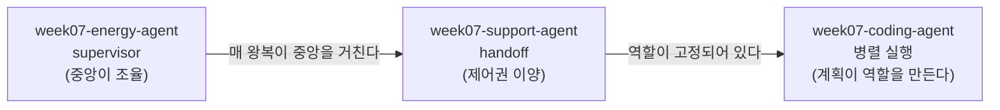

앞의 두 저장소는 사람이 역할을 미리 정해 둔 구조입니다. 분석·시각화·상담,
또는 요금·기술지원·해지방어처럼 담당이 고정되어 있습니다. 세 번째에서는
planner가 SPEC을 읽고 태스크를 그때그때 만들어 병렬로 던집니다. 역할이
설계 시점이 아니라 **실행 시점에** 정해지는 것이 세 번째 단계의 차이입니다.

이번 주에도 사고를 재현합니다. supervisor에서는 **자료 없이 상담문을 쓰는
과잉·과소 라우팅**(4장), handoff에서는 **핑퐁과 말로만 넘김**(5장),
코딩 에이전트에서는 **통합 테스트 실패**(6장)입니다.

## 3. 멀티 에이전트 설계 원칙

세 저장소를 열기 전에, 오늘의 질문을 하나로 좁힙니다. **언제 나누고,
어떻게 잇는가.**

### 3-1. 나누지 않는 것이 기본이다

멀티 에이전트는 유행이라서 쓰는 구조가 아닙니다. 나누면 반드시 대가를
치르므로, 단일 에이전트로 먼저 만들고 그것이 무너지는 지점을 확인한 뒤에
나눕니다. 무너지는 신호는 셋입니다.

- **도구 선택 품질 저하**: 5주차에서 "좁게 준다: 목록이 길수록 선택 품질이
  떨어진다"는 원칙을 세웠고, 같은 도구 10개를 이름·설명만 바꿔 두 벌로
  등록하면 선택이 갈리는 것을 예제(`10_tool_selection.py`)로 확인했습니다.
  도구 목록이 자랄수록 그 갈림은 잦아집니다
- **지침 간섭**: 서로 다른 역할의 지침이 한 시스템 프롬프트에 쌓이면서
  서로 간섭합니다. 분석 지침과 상담 말투가 한 문서 안에서 다툽니다
- **컨텍스트 팽창과 오염**: 팽창은 6주차 3-4절에서 실측했습니다. 첫 스텝
  810토큰이 여섯 스텝 만에 1,552토큰이 됐고, 합계 7,400토큰의 대부분이
  재전송이었습니다. 역할이 섞이면 거기에 **오염**이 얹힙니다. 분석용
  원자료가 상담 단계까지 따라와, 뒤 작업이 앞 작업의 찌꺼기를 계속 실어
  나릅니다

증거의 수준을 구분해 둡니다. 컨텍스트 팽창과 도구 선택의 갈림은
실측했습니다. "개수가 늘면 정확도가 몇 % 떨어진다" 같은 곡선은 이 과정
어디에서도 재지 않았고, 원칙과 체감으로만 세워 둡니다. 4장에서 실측으로
확인하는 것도 품질 향상이 아니라 **무게의 감소**입니다.

### 3-2. 나누는 대가

- **왕복이 늘어납니다.** 라우팅 판단 자체가 LLM 호출이라, 에이전트 사이를
  오갈 때마다 호출이 더해지고 지연과 비용도 함께 늘어납니다
- **상태 전달을 설계해야 합니다.** 전부 넘기면 오염이 따라가고, 요약해서
  넘기면 정보가 샙니다. 무엇을 넘길지가 곧 설계입니다
- **라우팅이라는 새 실패 모드가 생깁니다.** 도구를 잘못 고르면 결과가
  이상해지지만, 일을 엉뚱한 에이전트에게 보내면 그럴듯한 답이 엉뚱한
  근거 위에 세워집니다

### 3-3. 나누기로 했다면 정할 것 넷

단일 에이전트에서는 생각할 필요가 없던 결정들입니다. 오늘 볼 세 저장소는
같은 네 질문에 각각 다르게 답한 결과입니다.

| 결정 | 질문 | 이 과정의 답 |
| --- | --- | --- |
| **경계** | 누가 무엇을 맡는가 | 역할별로 도구를 나눈다. 볼 수 없는 도구는 잘못 부를 수도 없다 |
| **이양** | 제어권이 어떻게 움직이는가 | 중앙 복귀(supervisor)냐 넘겨주고 손 떼기(handoff)냐 |
| **화물** | 무엇을 함께 보내는가 | 요약만 보낼 것인가, 대화를 통째로 보낼 것인가 |
| **정지** | 언제 멈추는가 | 왕복·이양·수정에 각각 숫자로 된 한도를 건다 |

넷 중 앞의 셋은 설계이고, 마지막 하나는 안전장치입니다. 그리고 안전장치는
판단이 아니라 숫자여야 합니다. 6주차에서 스텝 한도를 걸었던 것과 같은
이유입니다. 판단하는 안전장치는 판단이 틀리면 함께 틀립니다.

### 3-4. 두 패턴: supervisor와 handoff

나누기로 했다면 다음 질문은 하나입니다. **제어권을 누가 쥐는가.** 답이
둘로 갈리고, 그 둘이 오늘 볼 패턴입니다.

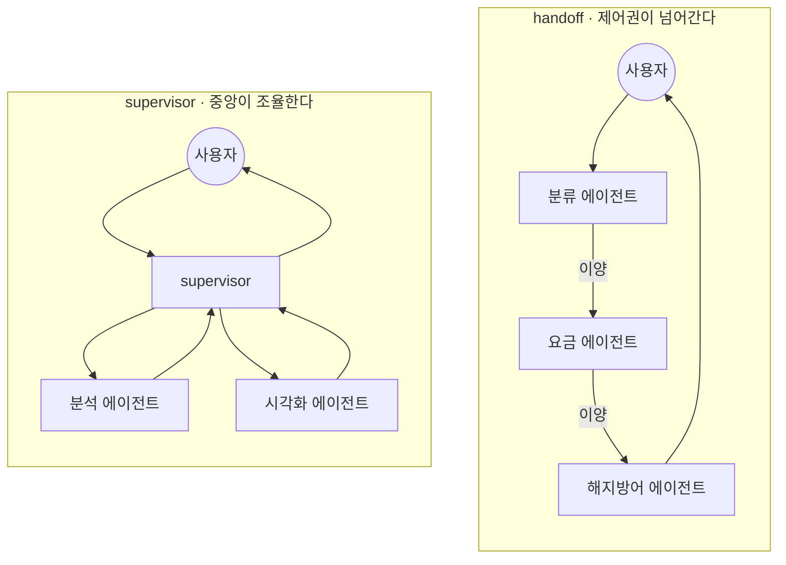

| | [[supervisor\|supervisor]] | [[handoff\|handoff]] |
| --- | --- | --- |
| 제어권 | 중앙이 계속 쥔다 | 넘긴 쪽은 손을 뗀다 |
| 결과가 가는 곳 | 하위 에이전트가 supervisor에게 돌려준다 | 이어받은 에이전트가 사용자에게 직접 답한다 |
| 대화의 주인 | 언제나 supervisor | 지금 대화를 들고 있는 에이전트 |
| 어울리는 문제 | 한 요청을 여러 전문 작업으로 쪼개 합치는 일 | 대화의 성격이 바뀌며 담당이 옮겨가는 일 |
| 비용 구조 | 왕복마다 중앙을 거치며 컨텍스트가 다시 실린다 | 넘긴 뒤에는 그 에이전트만 돌아 왕복이 짧다 |
| 새 실패 모드 | 과잉 라우팅: 필요 없는 하위 에이전트를 부른다 | 오배송과 핑퐁: 엉뚱한 곳으로 넘기거나 서로 떠넘긴다 |

어느 쪽이 옳은 패턴인지는 문제의 모양이 정합니다. **결과를 모아야 하면
supervisor, 담당이 바뀌면 handoff.**

이 둘이 전부는 아닙니다. 다만 나머지는 대개 이 둘의 변형이거나 둘을 섞은
것입니다.

| 모양 | 무엇인가 | 왜 오늘 따로 다루지 않는가 |
| --- | --- | --- |
| 파이프라인 | 순서가 고정된 줄 세우기 (A → B → C) | 라우팅 판단이 없다. 함수 셋을 차례로 부르는 것과 같다 |
| 네트워크 | 누구나 누구에게 넘길 수 있다 | handoff의 제한을 푼 것이다. 실패 모드(핑퐁)가 그대로 커진다 |
| 계층 | supervisor 위에 supervisor를 둔다 | supervisor를 한 번 이해하면 겹치는 일이다. 규모가 커질 때 필요해진다 |
| 동적 팀 구성 | 계획이 역할을 그때그때 만든다 | 오늘 셋째 저장소(coding-agent)가 정확히 이것이다 |

### 3-5. LangGraph 최소 문법: 손 루프의 정식 표기법

세 저장소는 [[langgraph|LangGraph]]로 짜여 있습니다. 새 프레임워크지만
새 개념은 아닙니다. 5주차에서 바닥 API를 손으로 만진 뒤 [[litellm|LiteLLM]]
추상화를 얹었던 것과 같은 순서로, 6주차에서 손으로 짠 루프를 이해했으니
이제 그것을 선언적으로 적는 표기법을 얹는 것입니다.

6주차 ReAct 루프의 뼈대와 나란히 놓으면 이렇습니다.

```python
# 6주차: 손으로 짠 루프                    # LangGraph: 같은 제어 흐름을 그래프로
for step_no in range(1, max_steps + 1):    graph = StateGraph(State)
    response = completion(...)             graph.add_node("agent", agent_node)
    if not message.tool_calls:             graph.add_node("tools", tools_node)
        return result                      graph.add_conditional_edges(
    ...도구 실행...                            "agent", should_continue, ["tools", END])
    # 루프 선두로 돌아간다                  graph.add_edge("tools", "agent")
```

| 6주차 손 루프 | LangGraph | 하는 일 |
| --- | --- | --- |
| 루프 안의 코드 블록 | **노드**: 상태를 받아 상태 조각을 돌려주는 함수 | 일을 한다 |
| `if not tool_calls: break` | **조건부 엣지**: 상태를 보고 다음 노드 이름을 돌려주는 함수 | 갈 곳을 정한다 |
| `for` 루프의 되돌아감 | 노드에서 앞 노드로 이어지는 **엣지** | 순환을 만든다 |
| `messages.append(...)` | **리듀서**: `Annotated[list, operator.add]` | 상태를 덮어쓰지 않고 쌓는다 |
| 지역 변수 뭉치 | **상태 스키마**: TypedDict | 노드 사이를 흐르는 데이터 |

노드는 정하고, 엣지는 나릅니다. 그리고 중요한 것 하나. **LLM 호출은
여전히 `litellm.completion`입니다.** 세 저장소 어디에도 모델을 감싸는
다른 층이 없습니다. 프레임워크가 가져간 것은 모델이 아니라 제어 흐름이고,
6주차까지 배운 도구 스키마·검증·하네스 규율은 그대로 통용됩니다.

문법 둘은 아껴 뒀다가 처음 필요해지는 자리에서 배웁니다. 다음 노드를
엣지가 아니라 노드 자신이 정하는 `Command`는 5장(handoff)에서, 같은
노드를 여러 벌 동시에 띄우는 `Send`는 6장(병렬)에서 나옵니다.

## 4. Supervisor: week07-energy-agent

- **제품**: 전기 요금이 왜 이렇게 나왔는지 수치와 그래프로 답하는 상담
  대시보드
- **핵심 문장**: 나누는 것이 이득인지는 주장이 아니라 숫자로 확인한다

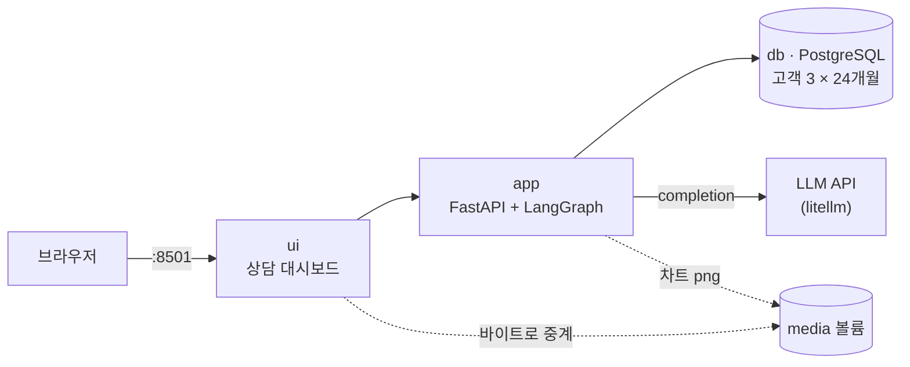

4주차에서 익힌 compose 구성 그대로입니다. 새로 생긴 것은 `media` 볼륨
하나입니다. 차트는 app이 파일로 쓰고, ui는 그 주소를 화면에 박지 않고
바이트를 받아 전달합니다. 브라우저는 `app`이라는 컨테이너 이름을 해석할
수 없기 때문입니다.

### 4-1. 데이터: 요금이 튀는 이유가 데이터 안에 있어야 한다

"지난달 요금이 왜 이렇게 많이 나왔나"라고 물으려면 실제로 튄 달이
있어야 합니다. 시드 생성기(`scripts/build_seed.py`)가 난수 씨앗을 고정한
채 고객 3명의 24개월치를 만들고, 그 결과를 `db/init/02_seed.sql`로
커밋합니다. 날짜가 `CURRENT_DATE` 기준 상대값이라 언제 띄워도 마지막
달이 "지난달"입니다.

| 고객 | 성격 | 최근 달 |
| --- | --- | --- |
| 김한전 (4인 가구, 5kW) | 여름 냉방으로 크게 튄다 | 754kWh · 208,070원 |
| 박전기 (1인 가구, 3kW) | 계절을 타지 않는다 | 낮고 평탄 |
| 이절전 (2인 가구, 3kW) | 전기 난방이라 겨울이 높다 | 여름은 낮다 |

요금은 주택용 누진 3단계를 근사해 계산합니다. 200kWh까지 kWh당 120.0원,
400kWh까지 214.6원, 그 위는 307.3원입니다. 754kWh가 3단계에 깊이 들어가면
사용량이 2배 늘 때 요금은 3배가 됩니다. **사용량 증가율과 요금 증가율이
다르다는 것**이 이 제품이 설명해야 할 핵심이고, 그 설명이 가능하도록
데이터를 만든 것입니다. 같은 계산표를 시드 생성기와 `app/agent/tools.py`가
함께 씁니다. 도구가 돌려주는 숫자와 db에 든 숫자가 어긋날 수 없게 하기
위해서입니다.

### 4-2. 기준점: 단일 에이전트로 먼저 만든다

첫 버전은 일부러 나누지 않고 만듭니다. advisor 하나가 도구 다섯 개를 들고
분석도 하고 추이도 정리하고 상담 말투도 씁니다. 이 단일 에이전트는 v0.2
이후에도 `app/agent/single.py`에 그대로 남아 있고, API도 두 모드를 다
받습니다. 비교 기준점을 지우지 않는 것이 이 저장소의 첫 규율입니다.

```bash
docker compose exec app python demos/single_agent.py
```

```text
[질문] 지난달 요금이 왜 이렇게 많이 나왔나요?
  프롬프트 1,105자 · 답변 직전 컨텍스트 2,640자 · LLM 호출 3회
    - advisor: 도구: compare_usage
    - advisor: 도구: bill_breakdown
    - advisor: 답변 작성

[질문] 제 계약전력이 몇 kW인가요?
  프롬프트 1,105자 · 답변 직전 컨텍스트 1,638자 · LLM 호출 2회
    - advisor: 도구: customer_profile
    - advisor: 답변 작성
```

여기서 볼 것은 답변의 품질이 아니라 **1,105라는 같은 숫자**입니다.
"계약전력이 몇 kW인가"라는 한 줄짜리 질문에도 추이 정리 지침과 상담 말투
지침이 통째로 실려 나갔습니다. 그리고 답변을 쓰는 순간까지 도구가 물어온
원자료가 컨텍스트에 그대로 남아 있습니다. 3-1절의 신호 셋이 전부 이 안에
있습니다.

### 4-3. supervisor로 나눈다: 라우터는 에이전트가 아니다

advisor 하나를 네 역할로 쪼갭니다. 조율하는 supervisor, 수치를 캐는
analyst, 그림을 그리는 visualizer, 말을 만드는 counselor입니다.

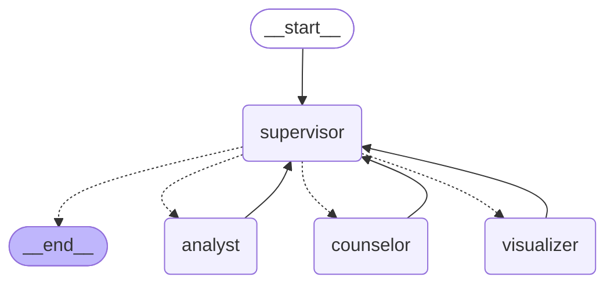

모든 실선이 supervisor로 돌아옵니다. 하위 에이전트는 서로를 부르지 않고,
자기 일을 마치면 중앙으로 복귀합니다. 이 되돌아옴이 supervisor 패턴의
정의이자 5장에서 볼 [[handoff|handoff]]와 갈리는 지점입니다.

이름 때문에 오해하기 쉬운데, supervisor는 일을 하지 않습니다. **다음에
누가 일할지만 정합니다.** 하는 일이 그것뿐이라 출력도 그것뿐입니다.

```python
# supervisor가 모델에게 받는 것은 이 한 줄이 전부다
{"next": "analyst", "why": "요금 내역을 먼저 조회해야 한다"}
```

그래서 supervisor 노드에는 도구가 없고, 답변도 쓰지 않습니다. 상태를 보고
이름 하나를 고르는 일을 조건부 엣지로 잇습니다. 3-5절에서 본 그
문법입니다. "도구를 부를까 답할까"를 가르던 조건부 엣지가, 여기서는
"누구에게 보낼까"를 가릅니다.

나눌 때 실제로 나누는 것은 세 가지입니다.

- **지침**: 역할마다 자기 문장만 이고 갑니다
- **도구**: analyst는 조회 도구 넷, visualizer는 `make_chart` 하나만
  봅니다. 볼 수 없는 도구는 잘못 부를 수도 없습니다
- **문맥**: 하위 에이전트는 <strong>요약(findings)</strong>만 위로
  올립니다. 도구가 물어온 원자료(data)는 상태에 쌓이되 다음 에이전트의
  프롬프트에는 실리지 않습니다

### 4-4. 실측: 같은 질문, 두 구조

```bash
docker compose exec app python demos/compare.py
```

```text
=== 지난달 요금이 왜 이렇게 많이 나왔나요? ===

[single] 에이전트 1 · 지침 1,105자 · 컨텍스트 2,640자 · LLM 호출 3회
    advisor     도구: compare_usage
    advisor     도구: bill_breakdown
    advisor     답변 작성

[supervisor] 에이전트 4 · 지침 199자 · 컨텍스트 466자 · LLM 호출 5회
    supervisor  라우팅 → analyst (규칙: 자료가 없으면 분석부터)
    analyst     도구: compare_usage
    analyst     도구: monthly_usage
    analyst     도구: bill_breakdown
    analyst     분석 요약
    supervisor  라우팅 → counselor (분석 데이터가 확보되었으므로 답변 작성)
    counselor   답변 작성 (근거 1건 사용)
    supervisor  라우팅 → done (규칙: 답변이 나왔다)
```

| | 단일 (v0.1) | supervisor (v0.2) |
| --- | --- | --- |
| 답변을 쓴 에이전트의 지침 | 1,105자 | 199자 |
| 답변 직전 컨텍스트 | 2,640자 | 466자 |
| LLM 호출 | 3회 | 5회 |

역할별 지침을 다 합치면 1,018자로, 단일의 1,105자와 크게 다르지 않습니다.

```text
supervisor  532자
analyst     140자
visualizer  147자
counselor   199자
```

**줄어든 것은 총량이 아니라 한 번의 호출이 이고 가는 무게입니다.** 상담문을
쓰는 순간 필요한 것은 199자짜리 말투 지침이지, 도구 사용법과 차트 규칙이
아닙니다. 단일 구조는 그 전부를 매 호출마다 함께 보냈습니다.

지침은 5분의 1, 컨텍스트는 6분의 1로 줄었고, 호출은 3회에서 5회로
늘었습니다. 나누어서 좋아지는 것과 나빠지는 것이 이 표 한 장에 같이
있습니다.

#### 그냥 에이전트 하나로 하면 되는 것 아닌가

맞는 질문이고, 이 규모에서는 맞는 답이기도 합니다. 단일 advisor도 세
질문에 모두 그럴듯하게 답했습니다. 실측이 증명한 것은 품질 향상이 아니라
무게의 감소이고, 품질은 어느 쪽이 낫다고 재지 않았습니다.

그래서 결론은 "나누면 좋다"가 아닙니다. **무게가 정확도를 깎기 시작하는
신호(3-1절)가 보이면, 왕복 증가와 라우팅 위험(3-2절)을 값으로 치르고
나눈다**입니다. 도구 다섯 개짜리 시연에서는 신호가 약합니다. 도구가
스무 개, 역할이 예닐곱이 되는 실제 제품에서 이 트레이드가 이득으로
돌아섭니다. 시연이 작게 만들어진 것은 구조가 눈에 보이게 하기 위해서이고,
나누는 판단 자체는 규모가 아니라 신호로 합니다.

#### 왜 요약만 위로 올리는가

컨텍스트를 예산이라고 생각하면 이해가 빠릅니다. 한 번의 호출에 실을 수
있는 분량은 정해져 있고, 거기에 무엇을 넣을지가 설계입니다.

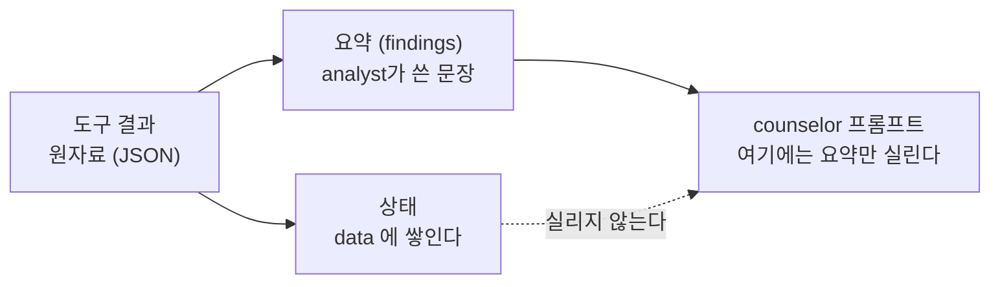

원자료는 상태에 남습니다. 사라지는 것이 아니라 다음 호출에 실리지 않을
뿐입니다. 트레이스에서는 여전히 볼 수 있습니다.

이 선택에는 대가가 있습니다. 요약하는 순간 정보가 샙니다. analyst가
"직전 달 대비 116% 증가"라고만 적으면, counselor는 월별 수치를 다시 볼 수
없습니다. 무엇을 요약에 남길지는 하위 에이전트의 프롬프트가 정하고,
그것이 이 구조의 가장 섬세한 부분입니다. 5장의 handoff는 정확히 반대
선택을 합니다. 요약하지 않고 대화를 통째로 넘깁니다.

### 4-5. 서브 에이전트 안에는 6주차의 루프가 돈다

analyst가 도구 셋을 연달아 부른 것을 위 트레이스에서 봤습니다. 그 안을
열면 익숙한 코드가 나옵니다.

```python
def _run_with_tools(system, question, customer_id, tool_names, agent):
    """하위 에이전트 하나의 작은 루프. (요약, 원자료, 트레이스, 호출 수)."""
    messages = [{"role": "system", "content": system},
                {"role": "user", "content": question}]
    for _ in range(MAX_TOOL_ROUNDS):                      # 왕복 한도 3
        response = completion(model=pick_model(), messages=messages,
                              tools=tool_schemas(tool_names))
        message = response.choices[0].message.model_dump()
        messages.append(message)
        if not message.get("tool_calls"):                 # 종료: 최종 요약
            return message.get("content") or "", data, trace, calls
        for call in message["tool_calls"]:
            raw = run_tool(name, call["function"]["arguments"], customer_id)
            messages.append({"role": "tool", "tool_call_id": call["id"],
                             "content": raw})
    return "(도구 왕복 한도 초과)", data, trace, calls
```

6주차 3장의 ReAct 루프 그대로입니다. 분기 조건은 "tool_calls가 있는가"
하나, 종료는 최종 답과 왕복 한도 둘. **서브 에이전트란 여러분이 6주차에
만든 그 에이전트의 축소판이고, supervisor 패턴이란 그 루프를 여러 벌
복제해 위에 라우터를 얹은 것입니다.** 시연에서는 각 역할이 도구를 한둘만
들지만, 실제 제품에서는 이 자리에 도구 4\~10개와 자기 하네스를 지닌
6주차급 에이전트가 들어갑니다.

도구 실행이 `run_tool` 관문 하나로 지나는 것, `customer_id`가 도구
스키마에 없고 상태에서 주입되는 것도 5·6주차 규율 그대로입니다.

### 4-6. 사고 재현: 라우팅은 흔들린다

차트는 visualizer의 일인데, 언제 visualizer를 부를지는 supervisor의
판단입니다. 판단은 매번 같지 않습니다. 라우팅을 전부 LLM에게 맡긴 채
같은 질문을 세 번씩 던져 봅니다.

```bash
docker compose exec app python demos/over_routing.py
```

```text
=== ① 라우팅을 전부 LLM에게 맡김 ===

최근 1년 추이를 그래프로 보여주세요
    그래프 3/3회 · LLM 호출 9~12회
    경로: analyst → visualizer → counselor → done
    경로: analyst → visualizer → counselor → visualizer → done

요금이 좀 이상한 것 같은데 확인해 주세요
    그래프 0/3회 · LLM 호출 6~7회
    경로: analyst → counselor → done

제 계약전력이 몇 kW인가요?
    그래프 0/3회 · LLM 호출 3~6회
    경로: analyst → counselor → done
    경로: counselor → done
```

같은 질문, 같은 코드, 같은 데이터인데 경로가 갈립니다. 두 군데를
보십시오.

- **그래프를 두 번 그린 실행**: counselor가 답을 쓴 뒤에 supervisor가
  visualizer를 한 번 더 불렀습니다. 결과는 크게 다르지 않지만 호출은
  9회에서 12회로 늘었습니다
- **analyst를 건너뛴 실행**: "계약전력이 몇 kW인가"에 supervisor가 곧장
  counselor를 불렀습니다. counselor에게는 도구가 없습니다. **자료를 한
  번도 조회하지 않은 채 상담문을 쓴 것**입니다

두 번째가 더 무섭습니다. 출력만 보면 그럴듯한 답이 나오기 때문에,
트레이스를 세지 않으면 사고가 났다는 사실 자체를 모릅니다. 6주차의 문장
그대로, 에이전트를 이해한다는 것은 트레이스를 읽을 줄 안다는 뜻입니다.
멀티 에이전트에서 새로 생긴 실패 모드는 이렇게 생겼습니다.

경계 설계가 사고의 모양을 정한 것도 봐 두십시오. counselor에게 도구가
없다는 경계 덕분에 "잘못 부른 도구" 사고는 없지만, 그 대신 라우팅이
틀리면 "조회 없는 상담문" 사고가 납니다.

### 4-7. 하이브리드 라우팅: 확실한 것은 코드가 정한다

여기서 supervisor를 더 똑똑하게 만들려 하지 않습니다. 프롬프트로 판단을
교정하는 대신, **판단이 필요 없는 자리**를 골라 코드로 확정합니다.

```python
def _rule_route(state):
    if state.get("answer"):                      # 답이 나왔으면 끝이다
        return "done", "규칙: 답변이 나왔다"
    if "analyst" not in done_agents:             # 자료 없이 할 수 있는 것은 없다
        return "analyst", "규칙: 자료가 없으면 분석부터"
    if wants_chart(state["question"]) and "visualizer" not in done_agents:
        return "visualizer", "규칙: 그래프를 명시적으로 요청했다"
    return None                                  # 애매하면 LLM에게 묻는다
```

```text
=== ② 하이브리드: 확실한 것은 코드, 애매한 것만 LLM ===

최근 1년 추이를 그래프로 보여주세요   LLM 호출 6~6회
    경로: analyst → visualizer → counselor → done

요금이 좀 이상한 것 같은데 확인해 주세요   LLM 호출 5~5회
    경로: analyst → counselor → done

제 계약전력이 몇 kW인가요?             LLM 호출 4~4회
    경로: analyst → counselor → done
```

| 질문 | LLM 라우팅 | 하이브리드 |
| --- | --- | --- |
| 그래프 요청 | 9\~12회 · 경로 2종 | 6회 고정 · 경로 1종 |
| 애매한 요청 | 6\~7회 · 경로 1종 | 5회 고정 · 경로 1종 |
| 단순 조회 | 3\~6회 · 경로 2종 | 4회 고정 · 경로 1종 |

**호출 수가 줄어든 것보다 폭이 사라진 것이 중요합니다.** 실행마다
달라지던 경로가 하나로 고정되면, 그때부터 트레이스는 디버깅에 쓸 수 있는
기록이 됩니다. 단순 조회에서 최소 호출이 3회에서 4회로 늘어난 것은 손해가
아닙니다. 자료 없이 답하던 그 3회짜리 실행이 사라진 값입니다.

프롬프트는 부탁이고 게이트는 물리 법칙이라던 6주차 하네스의 문장이,
여기서는 라우팅에 적용된 것입니다. 규칙으로 끝낼 수 있으면 규칙으로
끝내고, 애매한 자리만 모델에게 넘깁니다. 트레이스에는 어느 쪽이 정했는지가
`규칙:`으로 남습니다.

<RoutingRules />

질문을 바꿔 가며 규칙이 어디서 멈추는지 보십시오. "그래프로 보여
주세요"에는 규칙이 끝까지 정하고, "요금이 좀 이상한데요"에는 두 번째
결정에서 멈춥니다. **멈추는 자리가 곧 모델에게 값을 치르는 자리입니다.**

`make_chart` 도구는 몇 개월치를 그릴지와 제목만 받고, 수치는 받지
않습니다. 도구가 db에서 직접 조회해 그립니다. LLM이 옮겨 적은 숫자로
그리면 막대 높이가 원본과 어긋날 수 있고, 그것은 화면에서 확인할 방법이
없는 종류의 오류입니다. 4주차의 "원본 한 벌" 규율과 같은 이유입니다.

### 4-8. 완성 화면

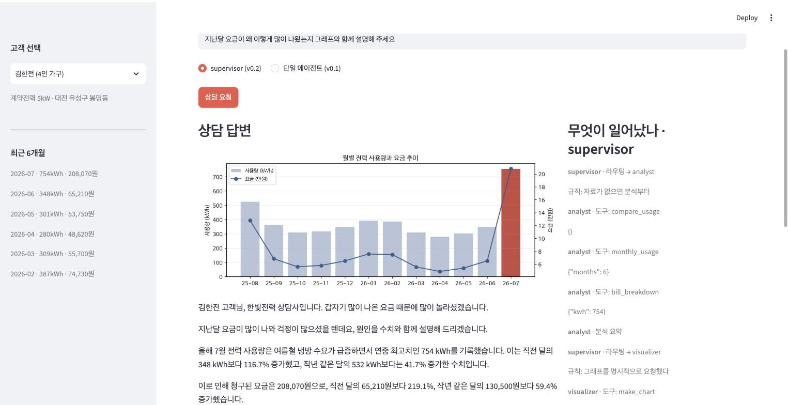

화면 위 라디오 버튼이 v0.1과 v0.2를 오가는 스위치입니다. 오른쪽 트레이스
패널이 이 장의 실습 도구입니다. 어느 에이전트가 무슨 도구를 어떤 인자로
불렀는지, 그리고 각 라우팅을 규칙이 정했는지 LLM이 정했는지가 그대로
남습니다.

```bash
docker compose exec app pytest        # 각본 LLM + 실제 db 테스트
```

## 5. Handoff: week07-support-agent

- **제품**: 가상 통신사 누리통신의 고객 상담 채팅. 접수 상담원이 문의를
  받아 요금·기술지원·해지방어 담당에게 넘긴다
- **핵심 문장**: 넘길 자유가 크다는 것은 잘못 넘길 자유도 크다는 뜻이다

energy-agent의 supervisor 구조에서는 하위 에이전트가 일을 마치면 반드시
중앙으로 돌아왔습니다. 여기서는 돌아오지 않습니다. 이 한 줄의 차이가
코드와 상태와 실패 모드를 모두 바꿉니다.

| | week07-energy-agent (supervisor) | week07-support-agent (handoff) |
| --- | --- | --- |
| 제어권 | 늘 중앙으로 복귀 | 넘어간 곳에 남는다 |
| 넘기는 것 | 요약(findings) | 대화 전체 |
| 다음 턴 | 다시 supervisor부터 | 담당이 바로 받는다 |
| 중앙의 역할 | 매 왕복을 조율 | 첫 배분 이후 사라진다 |
| 새 실패 모드 | 라우팅 실수 | 잘못 넘긴 뒤 돌아올 길이 없음 |

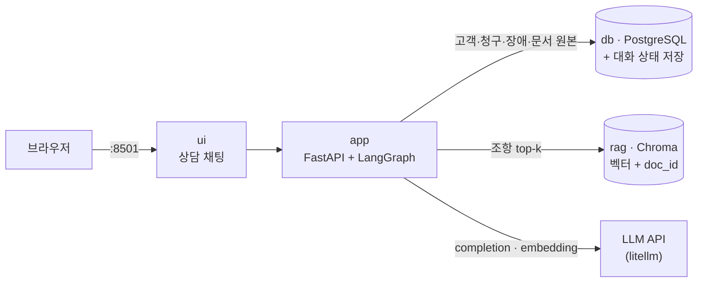

4주차에서 만든 그 구성이 돌아왔습니다. PostgreSQL과 Chroma가 나란히 서고,
원본은 db에 한 벌, 색인은 옆에 둡니다. 다른 점은 쓰임새입니다. 4주차에서
검색은 제품 자체였고, 여기서는 담당 하나가 쓰는 도구입니다. 색인 구축에는
4주차와 같은 `gemini/gemini-embedding-001` 768차원을 쓰므로
`GEMINI_API_KEY`가 필요합니다.

### 5-1. 데이터: 상담이 성립하려면 사연이 있어야 한다

고객 넷이 각자 다른 문의를 들고 옵니다.

| 고객 | 사연 | 어디로 갈 문의인가 |
| --- | --- | --- |
| 김누리 | 20GB 요금제에 데이터 초과 6GB + 로밍 38,500원 | 요금 |
| 박서준 | 어제 대전 서구 인터넷 4시간 장애 | 기술지원 |
| 이하늘 | 약정이 이번 달 만료, 떠나려 한다 | 해지방어 |
| 최민수 | 요금도 늘었고 인터넷도 끊겼다 | 복합 (5-4절의 주인공) |

약관·요금제·정책 문서 50건은 강의용으로 지어낸 것입니다. 중요한 것은
문장이 그럴듯한지가 아니라 **조항 번호로 가리킬 수 있는 단위로 쪼개져
있는지**입니다. 5-5절의 인용 검증이 이 구조 위에서만 성립합니다.

### 5-2. 기준점: 말만 하는 분류

첫 버전은 접수 상담원 하나입니다. 문의를 듣고 어디로 보낼지 정하고, "요금
담당으로 연결해 드리겠습니다"라고 말합니다. 그리고 아무 일도 일어나지
않습니다.

```bash
docker compose exec app python demos/classify_only.py
```

```text
[김누리] 이번 달 요금이 왜 이렇게 많이 나왔나요?
    분류: 요금 · 담당: triage
[김누리] 그래서 얼마인데요?
    분류: 요금 · 담당: triage
[김누리] 언제 고쳐지나요?
    분류: 불명 · 담당: triage
```

세 턴 내내 담당이 변하지 않습니다. 접수 상담원에게는 조회 도구가
없으므로 금액도 원인도 말할 수 없고, 그래서 같은 약속만 반복합니다.


**분류는 판단이고, 판단만으로는 아무도 움직이지 않습니다.** 이것이 handoff와
비교할 기준점입니다.

### 5-3. 제어권이 실제로 넘어간다

#### 먼저: `Command`가 무엇인가

3-5절에서 아껴 둔 첫 문법입니다. 지금까지 노드는 상태 조각을 돌려주었고,
어디로 갈지는 미리 그려 둔 엣지가 정했습니다. supervisor 구조에서도
그랬습니다. `Command`는 그 둘을 하나로 합칩니다. **상태 갱신과 다음
노드를 노드 자신이 함께 돌려줍니다.**

```python
# 지금까지: 상태만 돌려주고, 이동은 엣지가 정한다
def supervisor(state):
    return {"route": "analyst"}          # 엣지가 이 값을 읽는다

# Command: 상태 갱신과 이동을 한 번에 돌려준다
def triage(state):
    return Command(goto="billing",       # 다음은 요금 담당
                   update={"current_agent": "billing"})
```

| | 조건부 엣지 | `Command` |
| --- | --- | --- |
| 이동을 정하는 곳 | 그래프(엣지 함수) | 노드 자신 |
| 상태 갱신과의 관계 | 두 단계로 나뉜다 | 한 번에 |
| 어울리는 구조 | 중앙이 다음을 정하는 supervisor | 각자가 다음을 정하는 handoff |

handoff에 `Command`가 맞는 이유는 구조가 그렇게 생겼기 때문입니다. 요금
담당이 해지방어에게 넘길 때, 그 결정을 아는 것은 요금 담당뿐입니다.
중앙에 물어보고 옮기는 것이 아니라 자기가 옮깁니다.

#### 세 가지가 이 구조를 만든다

**① 넘기는 행위가 도구입니다.** 모델이 `transfer_to_billing`을 부르면
코드가 그것을 이동으로 바꿉니다. 인자는 이유 한 줄뿐입니다. 5주차에서
배운 도구 호출이, 여기서는 제어권 이양의 문법이 된 것입니다.

```python
if called in HANDOFF_TARGETS:              # 여기서 제어권이 넘어간다
    target = HANDOFF_TARGETS[called]
    return Command(goto=target, update={
        "current_agent": target,
        "handoffs": [{"from": name, "to": target, "reason": reason}],
        "came_from": name,
    })
```

**② 넘어가는 것은 대화 전체입니다.** supervisor 구조에서는 하위 에이전트가
요약만 위로 올렸고, 원자료는 상태에 남았습니다. 여기서는 반대입니다.
받는 쪽이 고객의 말을 직접 읽습니다. 요약하는 사람이 중간에 없기
때문입니다.

**③ 담당이 다음 턴까지 남습니다.** 대화 상태는 PostgreSQL에 저장됩니다.
LangGraph에서는 이 저장 장치를 체크포인터라고 부르는데, 여기서 나르는
것은 "지금 담당이 누구인가" 하나입니다. 이것이 없으면 handoff가 아니라 한
번의 우회일 뿐입니다.

```python
def entry(state):
    current = state.get("current_agent") or ""
    if current in ("billing", "tech", "retention"):
        return Command(goto=current)      # 접수를 거치지 않는다
    return Command(goto="triage")
```

#### 실측: 같은 대화, 두 구조

```bash
docker compose exec app python demos/handoff.py
```

```text
=== 분류만 ===
[고객] 이번 달 요금이 왜…      받은 사람: 접수 상담원
[고객] 그래서 얼마나…          받은 사람: 접수 상담원
[고객] 그냥 해지할래요.        받은 사람: 접수 상담원

=== handoff ===
[고객] 이번 달 요금이 왜…      받은 사람: 요금 담당
[고객] 그래서 얼마나…          받은 사람: 요금 담당
[고객] 그냥 해지할래요.        받은 사람: 해지방어 담당

이양 기록
    접수 상담원 → 요금 담당 (요금 과다 청구 및 납부 관련 문의)
    요금 담당 → 해지방어 담당 (고객이 해지를 요청하여 이관)
```

두 번째 마디에서 접수를 다시 거치지 않은 것이 저장된 담당의 몫이고, 세
번째 마디에서 요금 담당이 해지방어에게 **직접** 넘긴 것이 handoff의
몫입니다.

개발 중에 실제로 겪은 함정 하나를 남겨 둡니다. 두 번째 턴에도 습관처럼
`current_agent: ""`를 함께 보냈더니, 저장돼 있던 담당을 덮어써서 매 턴
접수부터 다시 시작했습니다. 화면상으로는 잘 도는 것처럼 보였고,
트레이스를 세어야 보였습니다. **상태에 남겨야 할 것과 매 턴 새로 보낼
것을 나누는 일**이 handoff 구조에서는 설계의 일부입니다.

### 5-4. 사고 재현: 넘길 자유가 크면 잘못 넘길 자유도 크다

규칙 없는 handoff에 같은 문의를 3회씩 던져 세어 봅니다.

```bash
docker compose exec app python demos/routing.py
```

```text
=== ① 규칙 없이 ===

[복합 문의] 요금도 이상하고 인터넷도 안 돼요.
    이양 0회 · 말로만 넘김 2/3 · 되물음 1/3

[이어지는 불만] 너무 비싸네요. 그냥 해지할래요.
    이양 2~4회 · 핑퐁 1/3 · 경로 2종
    경로: 접수 → 요금 → 해지방어 → 요금 → 해지방어
    경로: 접수 → 요금 → 해지방어

[분류 불가] 저기요, 좀 답답해서 전화드렸어요.
    이양 0회 · 말로만 넘김 3/3
```

- **말로만 넘김**: 접수가 도구를 부르지 않고 "연결해 드리겠습니다"라고만
  합니다. 기준점 버전으로 되돌아간 셈인데, 답변만 보면 알 수 없습니다
- **핑퐁**: 넘겨받은 담당이 대화 전체를 읽고 "이건 저쪽 일"이라며 도로
  넘깁니다. 한 턴 이양 상한(`MAX_HANDOFFS = 3`)이 막아 주지 않았다면 계속
  돌았을 것입니다
- **경로 흔들림**: 같은 문의인데 실행마다 다른 길로 갑니다

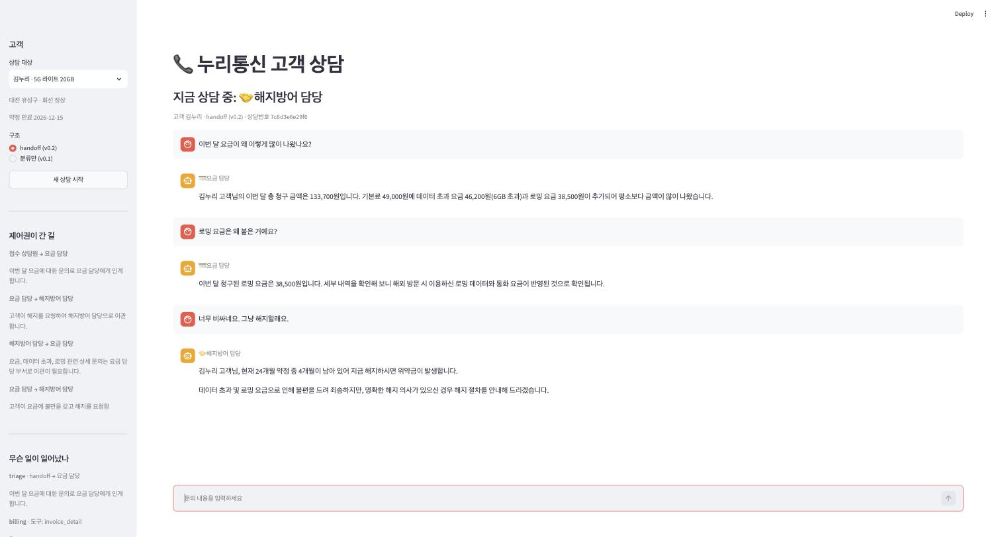

### 5-5. 라우팅 기준 셋을 코드로

energy-agent에서 배운 것과 같은 방식입니다. 프롬프트로 타이르지 않고,
판단이 필요 없는 자리를 코드가 가져옵니다.

```python
def _routing_plan(state, name):
    # ② 방금 넘겨준 곳으로 되돌리지 않는다
    back = transfer_tool_of(state.get("came_from"))
    if back in allowed:
        allowed.remove(back)

    # ③ 두 갈래가 섞여 들어오면 접수는 넘기지 않고 되묻는다
    if name == "triage" and len(topics_in(last_user_message)) >= 2:
        return [], True, "규칙: 문의가 둘 이상이라 되묻는다"

    # ① 접수의 출력은 언제나 도구 호출이다
    return allowed, name == "triage", note
```

#### `tool_choice`: 쥐어주는 것과 쓰게 하는 것은 다르다

①의 "말로만 넘김"은 도구를 안 준 문제가 아닙니다. **줬는데 안 쓴**
문제입니다. 도구 목록을 넘길 때 모델이 그것을 어떻게 대할지는 5주차에서
지나쳤던 인자 하나로 정해집니다.

| `tool_choice` | 뜻 | 여기서 |
| --- | --- | --- |
| `"auto"` (기본) | 쓸지 말지 모델이 정한다 | 전문 담당. 답하는 것이 일이므로 강제하지 않는다 |
| `"required"` | 반드시 하나는 부른다 | 접수 상담원. 넘기거나 되묻거나 둘 중 하나 |
| `"none"` | 부르지 못한다 | 쓰지 않음 |

접수에 `required`를 걸면 말로 얼버무리기가 문법적으로 불가능해집니다.
다만 그것만으로는 부족합니다. 넘길 곳이 없는데 반드시 부르라고 하면 아무
데나 넘기게 되므로, "판단이 안 선다"에도 갈 곳을 만들어 줘야 합니다.
그것이 `ask_clarification` 도구입니다.

```python
schemas = handoff_schemas(allowed) + [ASK_TOOL]          # 넘기거나, 되묻거나
completion(..., tools=schemas, tool_choice="required")   # 둘 중 하나는 반드시
```

**강제하기 전에 도망갈 문을 만들어 두는 것**이 이 규칙의 핵심입니다.
강제만 하면 모델은 가장 그럴듯한 거짓말을 고릅니다.

```text
=== ② 기준을 세우고 ===

[복합 문의]      이양 0회 · 되물음 3/3
[이어지는 불만]  이양 2회 고정 · 문제 없음 · 경로 1종
[분류 불가]      이양 0회 · 되물음 3/3
```

모델이 더 똑똑해진 것이 아닙니다. 되묻기는 원래 좋은 상담원이 하는
일이고, 그것을 규칙이 보장한 것입니다.

<HandoffRules />

"요금도 이상하고 인터넷도 안 돼요"를 접수에게 주면 넘길 곳이 전부 닫히고
되묻기만 남습니다. 요금 담당이 넘긴 상태에서 해지방어를 골라 보면 요금
담당으로 되돌아가는 길이 막혀 있습니다. **규칙은 고르지 않고 좁힙니다.**

### 5-6. RAG가 부품이 된다

마지막 버전은 요금 담당과 해지방어 담당에게 약관 검색 도구를 줍니다.
기술지원 담당에게는 주지 않습니다. **4주차에서 제품이었던 것이 여기서는
두 담당이 나눠 쓰는 부품입니다.** 원본 한 벌 규율은 그대로입니다. 본문은
PostgreSQL의 `documents` 표에만 있고, Chroma에는 벡터와 `doc_id`만
둡니다. 색인이 통째로 날아가도 `build_index.py` 한 번이면 복구됩니다.

```bash
docker compose exec app python demos/citation.py
```

```text
[김누리] 데이터 초과 요금은 어떻게 계산되나요? 근거 조항도 알려주세요.
    받은 사람: 요금 담당
    검색: 제9조 2항 · 정책 D-1 · 제9조 3항 · 제7조 4항
    답변: 제9조 2항에 따르면, 기본 제공 데이터를 모두 사용한 이후의
          사용량에는 요금제별 초과 요율이 적용됩니다…
    인용: 제9조 2항 — 확인
```

인용마다 두 가지를 따로 봅니다.

- **존재**: 그 조항이 실제로 있는가. 없으면 지어낸 것입니다
- **근거**: 이번 턴에 실제로 검색한 조항인가. 아니면 기억으로 말한
  것입니다. 존재하는 조항이라도 찾아보지 않고 말했다면 맞은 것은
  우연입니다

검증자(`app/agent/citations.py`)는 문장을 읽지 않습니다. 정규식으로
**번호만 봅니다.** 그래서 결정적이고, LLM 채점이 아니라 6주차 출력
필터와 같은 급의 코드 방어입니다. 인용을 번호로 하게 만드는 것이 검증의
전제입니다.


### 5-7. 두 패턴을 언제 고르는가

| | supervisor가 어울리는 문제 | handoff가 어울리는 문제 |
| --- | --- | --- |
| 일의 성격 | 여러 결과를 모아 하나를 만든다 | 한 담당이 끝까지 맡는 것이 자연스럽다 |
| 대화 | 한 번의 요청과 한 번의 답 | 여러 턴이 이어진다 |
| 문맥 | 요약해도 되는 것 | 원문이 필요한 것 |
| 비용 | 왕복마다 중앙 호출이 붙는다 | 넘길 때만 붙는다 |
| 위험 | 중앙이 병목이자 단일 실패점 | 잘못 넘기면 돌아올 길이 없다 |

energy-agent는 분석·시각화·상담을 모아 한 답을 만드는 일이었고,
support-agent는 상담원이 바뀌는 일입니다. **구조가 문제를 따라간 것이지
그 반대가 아닙니다.**

## 6. 병렬 실행: week07-coding-agent

- **제품**: `SPEC.md`를 주면 태스크로 쪼개고, 여러 에이전트가 각자의
  브랜치에서 코드를 짜고, 머지해서 테스트하고, 도커로 띄우는 코딩
  에이전트
- **핵심 문장**: 병렬화는 모델의 문제가 아니라 작업 공간의 문제다

이 장은 새 개념을 얹는 자리가 아니라, 5\~7주차에 배운 것들이 각자의
자리를 찾는 자리입니다.

| 어디서 왔나 | 여기서 무엇이 되었나 |
| --- | --- |
| 5주차 [[tool-calling\|tool calling]] | `write_file` 하나. "에이전트가 코드를 짠다"의 실체 |
| 6주차 [[harness\|하네스]] | 스텝·수정·재계획 한도. 폭주하지 않는 이유 |
| 6주차 [[plan-execute\|Plan-and-Execute]] | planner가 SPEC을 세 태스크로 쪼갠다 |
| 6주차 [[reflexion\|Reflexion]] | 빌드 실패 로그를 fixer에게 되먹인다 |
| 6주차 [[budget-guard\|budget guard]] | 실행 전에 값을 묻는 비용 게이트로 진화 |
| 7주차 병렬 실행 | `Send`로 셋을 동시에, worktree로 격리 |

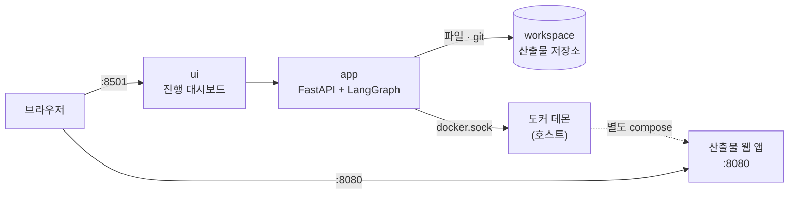

산출물은 이 compose가 아니라 `workspace/todo-app/docker-compose.yml`로
따로 뜹니다. 대시보드가 죽어도 산출물은 돌고, 산출물을 내려도 대시보드는
남습니다. **만드는 것과 만들어진 것을 섞지 않는 것**이 이 저장소의 첫
규율입니다. 컨테이너 안에서 도커를 부르려고 호스트의 docker 소켓을 빌려
쓰는 구성이라, 실습 환경에 따라 이 지점이 가장 잘 깨집니다. 시연이
막히면 아래 실측과 화면으로 진행합니다.

### 6-1. 경계를 먼저 긋는다

셋이 한 제품을 나눠 만들 때 흔한 사고는 둘입니다. 같은 파일을 동시에
고치는 것과, 서로 다른 규약을 가정하는 것입니다. 병렬로 짜기 **전에**
코드로 못 박습니다.

| | 누가 쓰는가 | 왜 |
| --- | --- | --- |
| `app.py` | backend 에이전트 | 제품 코드 |
| `static/index.html` | frontend 에이전트 | 제품 코드 |
| `tests/test_api.py` | tests 에이전트 | 제품 코드 |
| `Dockerfile` · `docker-compose.yml` · `requirements.txt` | 골격 | 매번 흔들릴 이유가 없다 |
| 브랜치 · 커밋 · 머지 · 빌드 | 하네스 | 모델이 git을 부를 이유가 없다 |

소유권 밖의 파일에 쓰려 하면 코드가 거부합니다. 엔드포인트 규약은 골격이
정해 세 프롬프트에 그대로 실립니다. 3-3절의 "경계" 결정이 여기서는 파일
소유권으로 나타난 것입니다.

### 6-2. 기준점: 한 사람이 하나씩

```bash
docker compose exec app python demos/sequential_run.py
```

```text
역할        모델                                          구간
backend   gemini-3.5-flash-lite             2.0s →   3.9s  완료
frontend  gemini-3.5-flash-lite             3.9s →   8.6s  완료
tests     gemini-3.5-flash-lite             8.6s →  11.2s  완료

전체 13.4초 · LLM 4회 · 출력 3,191 토큰 · $0.0086
머지 True · 테스트 True · 기동 True
```

동작합니다. 그리고 **구간이 겹치지 않습니다.** 셋은 서로의 결과를 기다릴
이유가 없는데도 줄을 서 있습니다. planner가 계획을 먼저 세우고 실행이
따르는 모양은 6주차의 Plan-and-Execute 그대로인데, 실행이 순차라는 것만
다릅니다.

### 6-3. Send와 worktree

#### `Send`가 무엇인가

3-5절에서 아껴 둔 두 번째 문법입니다. 조건부 엣지는 지금까지 문자열
하나를 돌려주었습니다. 같은 자리에서 `Send`의 **리스트**를 돌려주면 뜻이
달라집니다. 같은 노드를 **여러 벌 동시에** 띄웁니다.

```python
def fan_out(state):
    """여기가 병렬화의 전부다. 태스크마다 worker 하나씩."""
    return [Send("worker", {"task": task, "spec": state["spec"], "index": index})
            for index, task in enumerate(state["tasks"])]
```

`Send(노드_이름, 페이로드)`에서 페이로드는 그 실행분의 입력이 됩니다.
worker 노드가 받는 것은 전체 상태가 아니라 자기 몫의 딕셔너리 하나입니다.

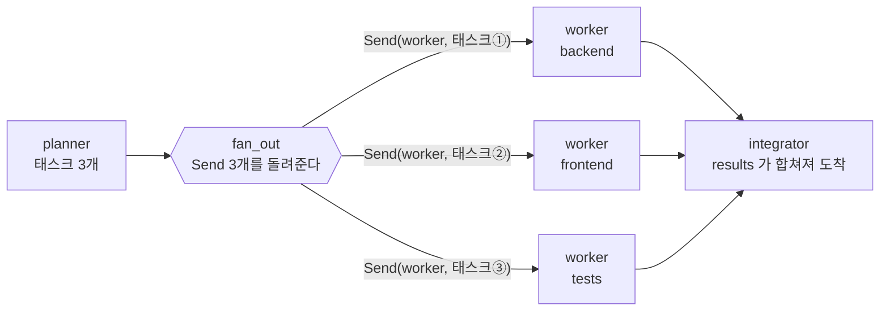

돌아오는 길은 리듀서가 맡습니다. 세 worker가 각각 `{"results": [결과]}`를
돌려주면 `Annotated[list, operator.add]`가 하나로 합칩니다. 3-5절 대응표의
그 리듀서입니다. **병렬의 절반은 리듀서가 이미 하고 있었습니다.**

미리 엣지를 세 개 그려 두는 것과 무엇이 다른가 하면, **개수가 실행
시점에 정해진다**는 점입니다. SPEC이 태스크 다섯 개로 쪼개지면 worker도
다섯이 됩니다. 그래프를 다시 그리지 않습니다. 역할을 사람이 미리 정한
supervisor·handoff와 갈리는 지점이 정확히 여기입니다.

#### 브랜치와 작업 트리는 다른 것이다

그리고 worktree. 이것이 없으면 위의 한 줄은 사고입니다. git을 오래 써도
헷갈리는 지점인데, **브랜치는 이름표이고 작업 트리는 실제 파일이 놓인
디렉터리입니다.** 평소에는 저장소 하나에 작업 트리가 하나뿐이라 둘이
붙어 다니는 것처럼 보입니다. `git checkout`은 그 하나뿐인 디렉터리의
파일을 통째로 갈아 끼우는 명령이므로, 셋이 동시에 checkout 하면
마지막으로 실행한 것이 이깁니다. 브랜치를 나눈 것과 무관하게 파일은 한
벌뿐이기 때문입니다.

`git worktree add`는 같은 저장소에 작업 디렉터리를 하나 더 붙입니다.
커밋 이력은 공유하고 파일만 따로 씁니다.

```python
worktree = runner.project.add_worktree(task["role"], task["branch"])
try:
    result = work_on(runner, task, payload["spec"], task["model"], worktree)
finally:
    runner.project.remove_worktree(task["role"])   # 브랜치는 남고 디렉터리만 치운다
```

정리하면 이렇습니다. **병렬로 벌고 싶은 것은 모델이 파일을 쓰는 시간이고,
그것을 벌려면 파일이 놓일 자리가 따로 있어야 합니다.** git 명령 자체는
오히려 자물쇠로 줄을 세웁니다. worktree 장부를 동시에 건드려서 얻을 것은
없기 때문입니다.

```bash
docker compose exec app python demos/parallel_run.py
```

```text
=== 순차 ===
backend      2.0s →   3.9s          ██████
frontend     3.9s →   8.6s                ████████████████
tests        8.6s →  11.2s                                 █████████
전체 13.4초 · $0.0086 · 기동 True

=== 병렬 (Send + worktree) ===
backend      2.5s →   4.8s                 █████████████
frontend     2.5s →   6.7s                 █████████████████████████
tests        2.5s →   4.9s                 ██████████████
전체 8.8초 · $0.0085 · 기동 True
```

**시간은 줄고 비용은 그대로입니다.** 같은 일을 같은 모델로 하기
때문입니다. 6주차 4장에서 루프마다 계산서를 재던 그 눈으로 보면, 병렬화가
파는 물건은 시간 하나뿐이라는 것이 이 계산서에 그대로 있습니다.

### 6-4. 값을 먼저 묻는 문

planner와 worker 사이에 문이 하나 섭니다. 난이도에 따라 모델을 배정하고,
예상 비용을 계산하고, 상한을 넘으면 사람에게 묻습니다. 6주차의 사전
추정(5-8절)과 budget guard(5-9절)가 실행 전 승인 게이트로 진화한 것입니다.
실행을 멈춰 세우고 사람의 답을 기다리는 데는 LangGraph의 `interrupt`
장치를 씁니다.

```bash
docker compose exec app python demos/cost_gate.py
```

```text
=== ① 상한 $0.05 — 넉넉하다 ===
    묻지 않고 끝까지 갔다 · 8.8초 · 실측 $0.0087
    추정 $0.0114 vs 실측 $0.0087

=== ② 상한 $0.005 — 빠듯하다, 승인한다 ===
    backend   gemini-3.5-flash-lite   출력 1500 토큰  $0.0040
    frontend  gemini-3.5-flash-lite   출력 1800 토큰  $0.0047
    tests     gemini-3.5-flash-lite   출력 1000 토큰  $0.0027
    합계                                             $0.0114  (상한 $0.0050)
    사람이 승인한다 → 7.7초 · 실측 $0.0089

=== ③ 상한 $0.005 — 빠듯하다, 중단한다 ===
    비용 상한을 넘어 사용자가 중단했습니다
    실측 $0.0011 — planner 한 번뿐이다. worker는 돌지 않았다.
```

세 번째가 이 기능의 값어치입니다. **거절할 수 있어야 문입니다.** 매번
묻는 문은 문이 아니고, 거절할 수 없는 물음은 물음이 아닙니다.

추정은 일부러 거칩니다. 역할별 예상 출력 토큰에 가격표를 곱한 것이
전부이고, 자릿수만 맞으면 상한은 제 일을 합니다. 화면에 추정과 실측을
나란히 두면 얼마나 맞는지까지 함께 배웁니다.

<CostGate />

backend 하나만 hard로 바꿔 보십시오. 상위 모델이 배정되면서 추정이 세 배
가까이 뜁니다. **난이도 판정 한 번이 비용을 가르고, 그 판정을 planner가
합니다.** 게이트가 있어야 하는 이유가 여기 있습니다.

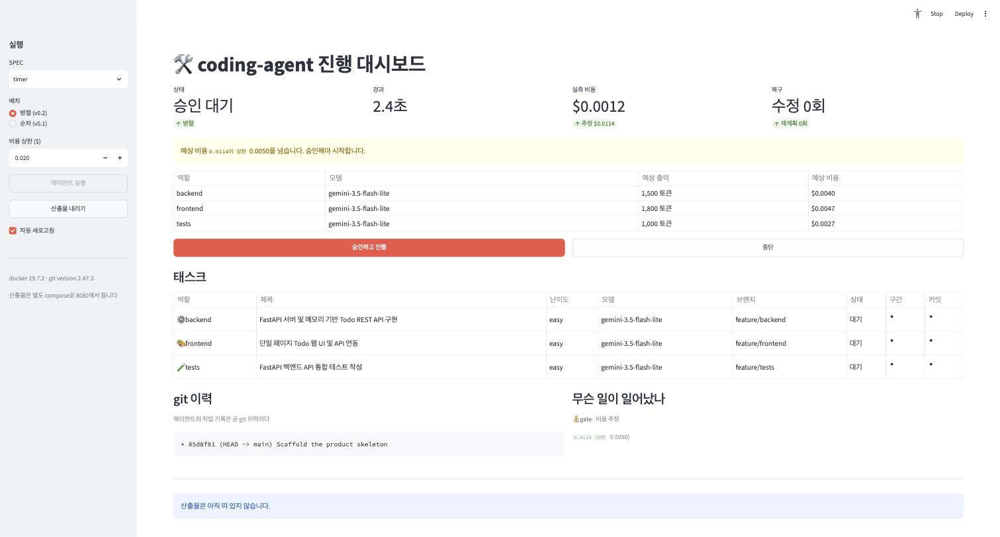

### 6-5. 실패한 뒤가 진짜 일이다

셋이 따로 짜면 규약의 빈틈에서 어긋납니다. 이 저장소에서 실제로 난
실패는 이랬습니다.

```text
FAILED tests/test_api.py::test_create_todo - assert 201 == 200
```

backend는 생성에 201을 돌려주고 tests는 200을 기대했습니다. 규약이 상태
코드를 못 박지 않았기 때문입니다. 사람 팀에서도 똑같이 나는 사고입니다.
복구는 세 겹입니다.

- **고치기**: integrator가 실패 로그를 fixer에게 되먹입니다. fixer는
  로그와 세 제품 파일과 규약을 보고 **한 번에 한 파일만** 다시 씁니다.
  여러 개를 한꺼번에 고치면 무엇이 나았는지 알 수 없습니다. 최대 2회.
  6주차 Reflexion의 "평가를 들고 다시 생성"이 여기서는 "실패 로그를 들고
  다시 작성"입니다
- **재계획**: 그래도 안 되면 planner로 돌아갑니다. 실패 로그를 붙여 다시
  계획하고, worker는 새 브랜치 `-r2`에서 짭니다. 최대 1회. 6주차의
  재계획 예제와 같은 원형입니다
- **포기**: 그다음은 멈춥니다. 무한히 도는 자동화는 자동화가 아닙니다

```bash
docker compose exec app python demos/recovery.py
```

```text
=== ① 통합 실패를 심는다 ===
    FAILED tests/test_api.py::test_create_returns_the_item - assert 200 == 12345

=== ② integrator가 로그를 읽고 한 파일을 고친다 ===
    수정 1회차 · 고친 파일 ['tests/test_api.py'] ac44a9f → 테스트 True
    비용: $0.0089 (1회, 수정은 상위 모델로)
```

**fixer는 테스트를 고쳤습니다.** 규약과 어긋난 쪽이 테스트였기
때문입니다. 무엇을 고칠지는 모델이 정하고, 한 번에 한 파일이라는 제약만
코드가 겁니다. 한도의 값어치는 계속 실패시켜 보면 드러납니다.

```text
수정 1회 · 재계획 1회 · 기동 False
비용 $0.0942 — 한도가 없었다면 여기서 멈추지 않았다.
```

### 6-6. 전체 실행

SPEC을 고르고, 상한을 걸고, 실행하고, 승인하고, 결과를 봅니다.


태스크 구간이 30초대에서 시작하는 것은 병렬이라서가 아니라 **사람이 승인
버튼을 누를 때까지 기다렸기 때문**입니다. 게이트는 돈만 쓰는 것이 아니라
시간도 씁니다. git 이력이 곧 작업 기록이라는 것도 화면에서 확인합니다.
누가 어느 가지에서 무엇을 했는지, 실패 후 두 번째 시도가 어느 브랜치에서
났는지가 전부 남습니다.

그리고 마지막으로, 에이전트가 만든 웹 앱이 브라우저에서 돕니다.


`specs/`의 SPEC을 타이머 앱(`timer.md`)으로 바꾸면 같은 에이전트가 다른
제품을 만듭니다. 바뀐 것은 문서 한 장이고, 코드는 그대로입니다.

## 7. 이 세션이 남기는 것

**원칙 (3장)**

- 나누지 않는 것이 기본이다. 나누는 기준은 유행이 아니라 무너지는 신호다
- 정할 것 넷: 경계·이양·화물·정지. 앞의 셋은 설계, 마지막은 숫자 안전장치
- 결과를 모아야 하면 supervisor, 담당이 바뀌면 handoff
- LangGraph는 손으로 짠 루프의 정식 표기법이다. LLM 호출은 여전히
  litellm이다

**Supervisor (4장)**

- supervisor는 에이전트가 아니라 라우터다. 도구도 답변도 없다
- 줄어드는 것은 총량이 아니라 한 번의 호출이 이고 가는 무게다.
  지침 5분의 1, 컨텍스트 6분의 1, 대신 호출은 3회에서 5회로
- 서브 에이전트는 6주차 루프의 축소판이다. 새 물건이 아니다
- 라우팅은 흔들린다. 확실한 것은 코드가 정하고, 애매한 것만 LLM에게

**Handoff (5장)**

- 넘긴다는 것은 코드로 도구 호출을 `Command(goto=…)`로 바꾸는 것이다
- 대화 전체가 넘어가고, 담당은 다음 턴까지 저장된다
- 망가지는 모양: 말로만 넘김, 핑퐁, 경로 흔들림
- 묶는 규칙: 반드시 도구로(`required` + 도피 도구), 되돌리지 않기, 섞이면
  되묻기

**병렬 (6장)**

- 병렬화는 모델의 문제가 아니라 작업 공간의 문제다. worktree가 없으면
  서로를 밟는다
- 병렬로 버는 것은 시간뿐이다. 비용은 그대로다
- 비용은 실행 전에 묻는다. 거절할 수 있어야 문이다
- 실패는 로그를 되먹여 한 파일씩 고치고, 안 되면 재계획하고, 한도를
  넘으면 멈춘다

**그리고 다음**

8주차에는 FastAPI로 서비스화합니다. 오늘 본 구조들이, 그리고 5·6주차에
만든 루프와 하네스가 서버 안으로 들어갑니다. 입력 검증과 에러 처리와
스트리밍이 그 위에 얹힙니다.
