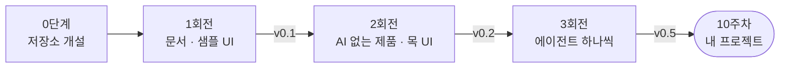
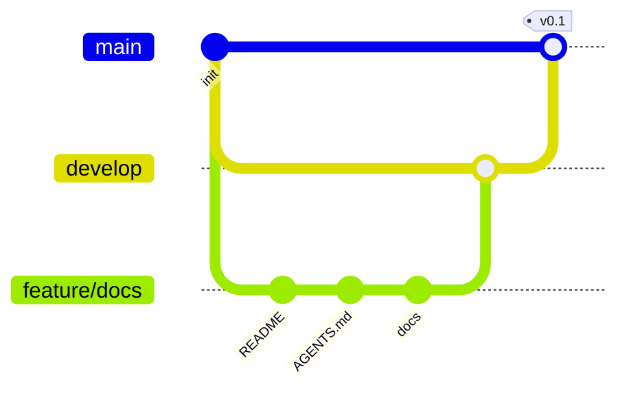
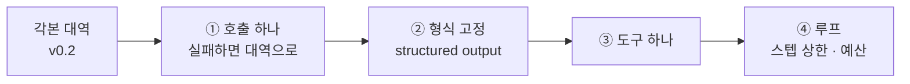
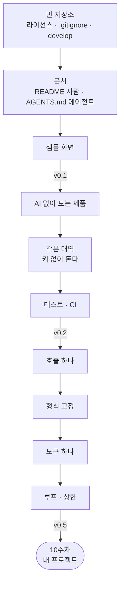

> 9주차 라이브 시연 교안입니다. 세션은 2시간, 멘토 시연 중심으로 진행합니다.  
> 이 교안에는 **실행 결과가 실려 있지 않습니다.** 저장소가 아직 없기
> 때문입니다. 오늘 현장에서 만들고, 소재도 현장에서 고릅니다.  
> 지시 프롬프트와 명령은 미리 적어 두었습니다. 시연이 끝나면 저장소를
> 조직에 공개하고 태그 셋과 함께 이 문서에 링크를 답니다.

- **주제**: 빈 저장소에서 AI 서비스 하나를 세우는 순서 (저장소 → 문서 → AI 없는 제품 → 에이전트)
- **세션 포커스**: git flow 3회전과 회전별 릴리즈(v0.1·v0.2·v0.5), AI를 마지막에 얹는 순서, 사람용 문서와 에이전트용 문서의 분리
- **시연 소재**: 현장에서 고릅니다 (후보와 고르는 기준은 2장 4절)
- **산출물**: 태그 셋이 찍힌 시연 저장소 + 10주차 첫 사흘 체크리스트
- **시연 저장소**: 세션 중 개설 (세션 후 `2026-ai-service-engineering-a` 조직에 공개)
- **함께 보는 문서**: 오늘 짓는 것이 끝까지 자라면 [9주차 레퍼런스 구현](/course/session-09/)의 모양이 됩니다
- **운영 방식**: 멘토 시연 → 저장소·지시 프롬프트 공개 → 영상 아카이브 (코드 따라 쓰기 없음)

## 1. 세션 목표

9주 동안 우리는 한 번도 빈 저장소에서 시작한 적이 없습니다. 매주 `v0.1`이
준비되어 있었고, 의존성이 선언되어 있었고, `docker compose up` 한 줄이면
무언가 떴습니다. 덕분에 두 시간 안에 루프와 도구와 하네스를 볼 수 있었습니다.

그런데 다음 주에 각자가 마주하는 것은 그 `v0.1`이 **아직 없는 상태**입니다.

> **가장 안 배운 구간이 프로젝트의 첫 사흘입니다.**

이번 주의 한 문장은 이것입니다.

> **AI를 마지막에 얹는다.**

순서를 거꾸로 잡으면 어떻게 되는지는 다들 한 번쯤 보셨을 겁니다. 모델 호출부터
붙이면 사흘 만에 뭔가 대답하는 화면이 뜹니다. 그리고 4주 뒤 배포 단계에서
멈춥니다. 키가 없으면 아무것도 안 뜨고, 테스트를 돌릴 수가 없고, 무엇이
좋아졌는지 잴 기준이 없기 때문입니다.

| 오늘 보는 것 | 오늘 보지 않는 것 |
| --- | --- |
| 저장소를 열고 첫 커밋을 넣는 순서 | 새로운 프레임워크 |
| 사람에게 쓰는 문서와 에이전트에게 쓰는 문서 | 특정 소재의 도메인 지식 |
| AI 없이 도는 제품을 먼저 만드는 이유 | 완성품 해부 (그건 [9주차 레퍼런스](/course/session-09/)입니다) |
| 에이전트를 한 층씩 얹으며 확인하는 법 | 배포 (12주차입니다) |
| 회전마다 태그를 찍는 진행 | |

오늘 새로 배우는 기술은 사실상 없습니다. **순서**를 배웁니다.

## 2. 브리핑: 오늘은 빈 저장소에서 시작합니다

### 2-1. 이번 주는 두 문서입니다

9주차에는 교안이 둘입니다. 역할이 다릅니다.

| | 무엇인가 | 언제 읽나 |
| --- | --- | --- |
| **이 문서 (라이브 빌드)** | 빈 저장소에서 v0.5까지 짓는 순서 | 세션 시간에 함께 봅니다 |
| [9주차 레퍼런스 구현](/course/session-09/) | 다 자란 제품 하나의 해부 | 막혔을 때 열어 봅니다 |

레퍼런스 쪽은 화면 층([[ag-ui\|AG-UI]]·[[shared-state\|공유 상태]]·승인 카드)과
9주간 쌓은 층들이 한 제품에서 맞물리는 그림입니다. **먼 목표**입니다.
오늘 짓는 v0.5는 그 목표의 두 번째 칸쯤입니다. 둘을 나란히 두는 이유는
하나입니다. 도착지를 봤으니 이제 출발선을 봅니다.

### 2-2. 진행 방식: 세 회전, 세 태그

1\~4주차 시연에서 쓰던 [[release-ladder\|릴리즈 사다리]] 방식 그대로입니다.
브랜치 하나가 회전 하나이고, 회전이 끝나면 태그를 찍습니다.



| 태그 | 무엇까지 | 이 상태에서 할 수 있는 것 |
| --- | --- | --- |
| `v0.1` | README·AGENTS.md·개발 문서·샘플 UI | 남에게 "무엇을 만들 겁니다"를 보여줄 수 있다 |
| `v0.2` | AI 없이 도는 기본 기능 + 목 UI | **키 없이 데모가 된다.** 테스트가 돈다 |
| `v0.5` | 에이전트가 한 자리에 들어옴 | AI가 무엇을 덜어 주는지 v0.2와 비교해 말할 수 있다 |

태그를 찍는 이유가 셋입니다.

- **되돌아갈 지점이 생깁니다.** 3회전에서 헤매다 망가지면 `v0.2`로 돌아가 다시 갑니다
- **발표 자료가 저절로 생깁니다.** 14주차에 "이렇게 자랐습니다"를 태그 셋으로 말합니다
- **재현자가 단을 밟아 옵니다.** `git diff v0.2 v0.5` 하나면 에이전트가 붙으며 무엇이 바뀌었는지가 통째로 보입니다

### 2-3. 이 시연은 git flow로 갑니다

혼자 하는 프로젝트에 브랜치 모델까지 필요하냐는 질문이 매년 나옵니다.
필요합니다. 이유는 협업이 아니라 **되돌리기와 검수**입니다.

| 브랜치 | 역할 |
| --- | --- |
| `main` | 배포되는 것만 올라간다. 직접 커밋하지 않는다 |
| `develop` | 통합 브랜치. 모든 회전이 여기서 갈라지고 여기로 돌아온다 |
| `feature/<이름>` | 회전 하나. `develop`에서 분기해 `develop`으로 머지 |
| `release/<버전>` | 태그를 찍기 전 버전 표기와 변경 기록을 정리하는 자리 |
| `hotfix/<이름>` | 배포된 것이 고장났을 때만. `main`에서 분기 |

AI 코딩 에이전트와 함께 지을 때 이 모델이 값을 하는 자리는 분명합니다.

- **에이전트가 만든 것은 브랜치 위에 쌓입니다.** 마음에 안 들면 브랜치째 버립니다. `develop`은 늘 돌아가는 상태입니다
- **PR 하나가 검수 단위입니다.** 파일을 하나씩 열어 읽는 대신 diff를 봅니다. 사람이 하는 일이 작성에서 **판단**으로 옮겨 간 자리입니다
- **`main`이 잠겨 있으면 실수로 배포되지 않습니다.** 12주차 배포는 `main` push가 방아쇠입니다

이 저장소(강의 사이트) 자체가 같은 규약으로 굴러갑니다. 규칙 전문은
[git-workflow.md](https://github.com/2026-ai-service-engineering-a/ai_service_engineering-track_a/blob/main/docs/git-workflow.md)에
있고, 오늘 1회전에서 시연 저장소에도 같은 문서를 한 장 만듭니다.

한 회전의 모양은 이렇습니다.



커밋 규칙도 그대로 가져옵니다.

- **커밋하면서 진행합니다.** 논리 단위가 끝나면 바로 커밋합니다. 지시 하나가 브랜치라면, 커밋은 그 안의 작업 단위입니다
- **한 커밋에는 한 가지 주제만** 담습니다
- 커밋 메시지 제목은 **영어 명령형 한 줄**. 왜 그랬는지는 본문에 적습니다

### 2-4. 소재는 현장에서 고릅니다

오늘 무엇을 만들지는 세션에서 정합니다. 미리 정해 오지 않는 이유가 있습니다.
**소재를 고르는 일 자체가 10주차 기획의 첫 단계**이고, 그 판단을 보여주는
것이 이 회차의 절반입니다.

고르는 기준은 넷입니다.

| 기준 | 왜 |
| --- | --- |
| **AI를 빼도 제품이 되는가** | 그래야 v0.2가 존재한다. 빼면 아무것도 없는 소재는 오늘 순서로 못 짓는다 |
| **데이터를 오늘 구할 수 있는가** | 파일 하나로 시작할 수 있어야 한다. 수집부터 이틀 걸리는 소재는 시연에 안 맞는다 |
| **좋아졌는지 잴 수 있는가** | "맞았다/틀렸다"를 사람이 눈으로 판정할 수 있어야 한다 |
| **두 시간 안에 한 기능이 끝나는가** | 기능 하나를 끝까지. 다섯 기능을 반쯤 만드는 것보다 낫다 |

현장 후보로 준비해 둔 셋입니다. 셋 다 10주차 트랙과 맞물립니다.

| 후보 | 기본 기능 (AI 없음) | 에이전트가 얹히는 자리 | 트랙 |
| --- | --- | --- | --- |
| 문의 분류기 | 문의 목록을 올리고 사람이 라벨을 단다 | 라벨 초안을 제안한다 | 추천·분류 |
| 회의록 정리기 | 텍스트를 올리고 문단을 접었다 편다 | 요약과 할 일 목록을 뽑는다 | 업무 자동화 |
| 저장소 훑개 | 파일 목록과 코드를 보여 준다 | 바뀐 부분을 설명한다 | 개발자 도구 |

세 후보의 공통점이 보이실 겁니다. **AI가 없으면 사람이 손으로 하던 일**이고,
제품은 그 손을 덜어 주는 물건입니다. 이 형태가 아니면 v0.2에서 화면이 텅
빕니다.

### 2-5. 시간 배분

두 시간을 이렇게 씁니다. 무게중심이 2회전에 있습니다.

| | 구간 | 분 |
| --- | --- | --- |
| 0단계 | 저장소 개설 | 10 |
| 1회전 | 문서와 샘플 UI, v0.1 | 25 |
| 2회전 | AI 없는 제품과 목 UI, v0.2 | 40 |
| 3회전 | 에이전트 얹기, v0.5 | 35 |
| 마무리 | 10주차로 넘기기 | 10 |

생성 자체는 빠릅니다. 시간을 쓰는 곳은 **무엇을 시킬지 정하는 자리**와
**나온 것을 보는 자리**입니다.

## 3. 0단계: 저장소부터

### 3-1. GitHub 먼저입니다

로컬에 폴더를 만들고 나중에 원격을 붙이는 순서도 됩니다. 하지만 오늘은
GitHub에서 시작합니다. 라이선스와 `.gitignore`를 개설 화면에서 같이 고르면
첫 커밋부터 들어가기 때문입니다.

```bash
gh repo create <저장소이름> --public --clone \
  --license mit --gitignore Python
cd <저장소이름>
```

`gh`가 없다면 웹에서 만들고 클론해도 같습니다. 개설 화면에서 체크할 것은
셋입니다.

| 항목 | 고르는 값 | 왜 |
| --- | --- | --- |
| 공개 범위 | **Public** | 포트폴리오로 가져갑니다. 키를 넣지 않는 습관도 여기서 생깁니다 |
| `.gitignore` | 언어에 맞는 것 | `.env`와 가상환경이 첫날부터 막힙니다 |
| 라이선스 | MIT 등 | 13주차에 고르려면 늦습니다. 오픈소스 산출물의 최소 조건입니다 |

저장소 이름은 **소문자와 하이픈**으로 짓습니다. 주소가 되고, 폴더 이름이 되고,
컨테이너 이름이 됩니다.

### 3-2. 빈 저장소에 처음 들어가는 것

개설 직후 저장소에는 세 파일뿐입니다.

```plaintext
<저장소이름>/
├── .gitignore
├── LICENSE
└── README.md      # 이름 한 줄
```

여기서 흔히 하는 실수가 **곧바로 `src/`를 만드는 것**입니다. 아직 만들지
않습니다. 무엇을 만들지가 문장으로 정해지기 전에 폴더 구조를 잡으면, 그
구조가 나중에 판단을 가둡니다.

### 3-3. develop을 만들고 main을 잠급니다

```bash
git switch -c develop
git push -u origin develop
gh repo edit --default-branch develop
```

기본 브랜치를 `develop`으로 옮기는 이유는 실수 방지입니다. 클론하면
`develop`에 서 있고, PR을 열면 대상이 `develop`이 됩니다. `main`으로 가려면
의식적으로 골라야 합니다.

`main` 보호 규칙은 저장소 설정의 Rules에서 켭니다. 혼자 하는 프로젝트라면
**직접 push 금지** 하나만으로도 충분합니다.

### 3-4. 여기까지 코드는 한 줄도 없습니다

10분이 지났고 만든 것은 빈 저장소와 브랜치 둘입니다. 초조해 보이지만 이
10분이 12주차까지 갑니다.

- 되돌릴 수 있는 바닥이 생겼습니다
- 라이선스와 `.gitignore`가 첫 커밋에 들어갔습니다. 나중에 넣으면 그 사이 커밋에 `.env`가 섞여 들어갑니다
- 배포 방아쇠가 될 `main`이 이미 잠겼습니다

## 4. 1회전: 문서 (`feature/docs`) → v0.1

```bash
git switch develop
git switch -c feature/docs
```

### 4-1. 왜 코드보다 문서가 먼저인가

사람 혼자 짓는다면 문서는 나중에 써도 됩니다. **에이전트와 같이 지으면
순서가 뒤집힙니다.**

| | 문서가 없으면 | 문서가 있으면 |
| --- | --- | --- |
| 지시할 때 | 매 지시마다 전제를 다시 적는다 | "규칙은 AGENTS.md에 있다" 한 줄 |
| 에이전트가 틀릴 때 | 말로 고쳐 준다. 다음 대화에서 또 틀린다 | 문서를 고친다. 다음부터 안 틀린다 |
| 구조를 정할 때 | 코드가 먼저 정해 버린다 | 문장이 먼저 정한다 |

3주차에서 본 것과 같은 이야기입니다. 지시 프롬프트가 길어지는 이유는 대개
**전제가 문서에 없어서**입니다. 그 전제를 파일로 내려놓는 것이 1회전입니다.

### 4-2. README는 사람에게, AGENTS.md는 에이전트에게

같은 저장소를 설명하는 문서가 둘인 이유는 독자가 다르기 때문입니다.

| | README.md | AGENTS.md |
| --- | --- | --- |
| 독자 | 사람 (심사자·동료·미래의 나) | 코딩 에이전트 |
| 답하는 질문 | **무엇을 왜 만드는가** | **여기서 어떻게 일하는가** |
| 들어가는 것 | 문제, 쓰는 사람, 실행 방법, 데이터 출처, 라이선스 | 개발 명령, 검증 명령, 커밋·브랜치 규칙, 건드리면 안 되는 것 |
| 길어지면 | 읽히지 않는다 | **지켜지지 않는다** |

AGENTS.md는 짧을수록 지켜집니다. 첫날에 들어갈 것은 이 정도입니다.

```markdown
# AGENTS.md

<한 줄 소개>

## 개발 명령
- 실행: `docker compose up`
- 테스트: `pytest`

## 커밋 전 검증
- `pytest`가 통과해야 한다
- 작업 단위마다 커밋한다. 한 커밋에 한 주제

## 규칙
- 새 작업은 `develop`에서 `feature/*`로 분기한다. `main`에 직접 커밋하지 않는다
- 커밋 메시지 제목은 영어 명령형 한 줄
- `.env`와 키는 절대 커밋하지 않는다
- 의존성을 새로 추가하기 전에 물어본다
```

마지막 두 줄이 실제로 사고를 막는 자리입니다. 키가 커밋에 섞이는 일과,
의존성이 조용히 늘어나는 일은 둘 다 되돌리기가 번거롭습니다.

도구에 따라 파일 이름이 다를 수 있습니다. 내용은 같고, 한쪽을 원본으로 두고
다른 쪽에서 가리키게 하면 두 벌이 어긋나지 않습니다.

### 4-3. 개발 문서는 세 장이면 시작됩니다

`docs/` 아래 세 장입니다. 더 늘리지 않습니다.

| 문서 | 무엇을 적나 | 왜 첫날에 |
| --- | --- | --- |
| `architecture.md` | 층 그림 하나와 각 층의 책임. **AI 자리는 비워 둔다** | 5장에서 그 빈칸을 채웁니다 |
| `git-workflow.md` | 브랜치 모델과 커밋 규칙 (2장 3절 그대로) | 에이전트가 이걸 읽고 브랜치를 만듭니다 |
| `decisions.md` | 정한 것과 정하지 않은 것, 그리고 이유 | 10주차 기획 리뷰에서 그대로 씁니다 |

`decisions.md`가 낯설 수 있습니다. 한 줄짜리 기록입니다.

```markdown
## 2026-09-18
- 데이터는 파일로 시작한다. DB는 규모가 커지면 (아직 아님)
- 화면은 정적 HTML 한 장. 프레임워크는 v0.5 이후에 판단
- AI는 <어디>에 들어간다. 그 자리 외에는 안 쓴다
```

"아직 아님"과 "이후에 판단"이 핵심입니다. **미룬 결정을 미뤘다고 적어 두면
나중에 그것이 빚인지 판단인지 구분됩니다.**

### 4-4. 샘플 UI: 화면을 먼저 그립니다

v0.1에 화면 한 장이 들어갑니다. 동작하지 않습니다. 버튼을 눌러도 아무 일도
일어나지 않습니다. 그래도 넣습니다.

| 왜 | |
| --- | --- |
| 기획이 화면에서 굳는다 | "입력이 뭐고 출력이 뭔가"가 그림 한 장에서 정해진다 |
| 남에게 보여줄 것이 생긴다 | 첫날부터 링크 하나로 설명이 끝난다 |
| 2회전의 목표가 명확해진다 | 이 화면이 **진짜로 도는 것**이 v0.2다 |

정적 HTML 한 장이면 충분합니다. 이 단계에서 프런트엔드 프레임워크를 고르면
두 시간이 거기서 끝납니다.

### 4-5. 지시 프롬프트

```plaintext
저장소 문서를 세우자. 코드는 아직 만들지 마.

- README.md: 이 서비스가 누구의 무슨 불편을 더는지 세 문단.
  그 아래에 실행 방법(지금은 "아직 없음"이라고 정직하게),
  데이터 출처, 라이선스
- AGENTS.md: 너에게 주는 규칙. 개발 명령, 커밋 전 검증,
  커밋 메시지 규칙, 브랜치 규칙, 하지 말 것.
  30줄을 넘기지 마라
- docs/architecture.md: 층 그림 하나(mermaid)와 층별 책임.
  AI가 들어갈 자리는 "미정"으로 두고 자리만 표시해라
- docs/git-workflow.md: git flow 브랜치 모델과 커밋 규칙
- docs/decisions.md: 오늘 정한 것과 미룬 것을 날짜와 함께
- web/index.html: 동작하지 않는 샘플 화면 한 장.
  입력 자리, 실행 버튼, 결과 자리. 프레임워크 쓰지 마라
- 문서 한 장이 커밋 하나다. 커밋하면서 진행해라
```

줄별 의도 포인트입니다.

- **"코드는 아직 만들지 마"**: 없으면 에이전트가 친절하게 `src/`를 만들어 줍니다. 구조를 지금 정하지 않는 것이 이 회전의 요점입니다
- **"누구의 무슨 불편"**: 기능 목록이 아니라 문제로 적게 합니다. 10주차 기획서의 첫 문단이 여기서 나옵니다
- **"정직하게"**: 아직 없는 실행 방법을 그럴듯하게 적어 두면 README가 첫날부터 거짓말을 시작합니다
- **"30줄을 넘기지 마라"**: 상한을 주지 않으면 규칙이 길어지고, 긴 규칙은 지켜지지 않습니다
- **"자리만 표시해라"**: 빈칸을 남기는 지시입니다. 채우라고 하면 채웁니다
- **"프레임워크 쓰지 마라"**: 샘플 UI는 그림입니다. 여기서 빌드 도구가 들어오면 회전이 끝나지 않습니다

### 4-6. 커밋 → PR → 머지 → v0.1

나온 것을 봅니다. 이 회전에서 볼 것은 문장입니다.

- `git log --oneline`: 문서 한 장이 커밋 하나로 갈라졌는지
- README 첫 문단: **문제가 적혔는지, 기능이 적혔는지.** 기능이 적혔으면 고칩니다
- AGENTS.md: 줄 수. 넘치면 잘라냅니다
- `architecture.md`: AI 자리가 비어 있는지

```bash
git push -u origin feature/docs
gh pr create --base develop --title "Set up project docs and a sample screen"
gh pr merge --merge
```

머지하고 태그를 찍습니다.

```bash
git switch develop && git pull
git switch -c release/v0.1
# 버전 표기와 변경 기록 정리
git switch main && git merge --no-ff release/v0.1
git tag -a v0.1 -m "Docs, conventions, and a sample screen"
git push origin main --tags
git switch develop && git merge --no-ff release/v0.1
git push
```

혼자 하는 저장소라면 `release/*`를 건너뛰고 `develop`을 `main`에 바로 머지해
태그를 찍어도 됩니다. **다만 건너뛰었다는 것을 알고 건너뜁니다.**
`release` 브랜치가 따로 있는 이유는 태그를 준비하는 동안에도 `develop`이
계속 흐를 수 있게 하기 위해서이고, 혼자일 때는 흐르지 않기 때문입니다.

## 5. 2회전: AI 없는 제품 (`feature/core`) → v0.2

```bash
git switch develop
git switch -c feature/core
```

오늘 가장 긴 회전입니다. 그리고 **AI 서비스 과정에서 모델을 한 번도 부르지
않는 유일한 회전**입니다.

### 5-1. AI를 빼고 도는 것부터

v0.2의 목표는 하나입니다. **키가 하나도 없는 사람이 클론해서 띄우면 무언가
쓸모 있는 일이 일어난다.**

| v0.2에 있는 것 | v0.2에 없는 것 |
| --- | --- |
| 데이터를 읽고 화면에 뿌리는 경로 | 모델 호출 |
| 사람이 손으로 하는 핵심 동작 | API 키 |
| 목 UI (버튼이 실제로 동작) | 프롬프트 |
| 테스트와 CI | 에이전트 |

AI를 뒤로 미루는 이유가 넷입니다.

- **기준선이 생깁니다.** v0.2에서 그 일을 손으로 하는 데 몇 번 클릭이 드는지 세어 두면, v0.5에서 무엇이 좋아졌는지를 숫자로 말할 수 있습니다. 기준선 없는 "좋아졌습니다"는 발표에서 통하지 않습니다
- **키 없이 도는 데모가 남습니다.** 9주차 랩이 키 없이 테스트 65개를 통과하는 것이 이 구조 덕분입니다
- **테스트가 성립합니다.** 모델 응답은 매번 다릅니다. 매번 같은 부분을 먼저 만들어 두면 그 위에 테스트가 붙습니다
- **모델이 안 될 때 떨어질 자리가 생깁니다.** 요금이 끊기거나 제공자가 죽어도 화면은 삽니다

### 5-2. AI가 들어갈 자리를 표시합니다

여기가 이 회전의 설계 지점입니다. 코드를 짜기 전에 **어디에 AI가 들어갈지를
함수 하나로 못 박습니다.**

```python
# core/assist.py
from typing import Protocol

class Assistant(Protocol):
    """<소재>에서 사람이 손으로 하던 판단 한 가지를 대신한다."""

    def suggest(self, item: Item) -> Suggestion:
        ...
```

이 시그니처가 v0.5까지 갑니다. 안쪽 구현만 각본 대역에서 진짜 모델로 바뀝니다.

자리를 고를 때 따지는 것 넷입니다.

| 질문 | 좋은 자리 | 나쁜 자리 |
| --- | --- | --- |
| 입력이 정해지나 | 화면에 있는 것 하나가 들어간다 | "전체 맥락"이 들어간다 |
| 출력을 검사할 수 있나 | 목록 중 하나, 숫자, 짧은 글 | 자유 서술 한 페이지 |
| 틀리면 어떻게 되나 | 사람이 보고 고친다 | 그대로 반영된다 |
| 없으면 막히나 | **안 막힌다.** 사람이 하면 된다 | 이것만 AI다 |

**AI 자리는 하나로 시작합니다.** 두 군데 이상 뚫으면 v0.5에서 어느 쪽이 값을
했는지 가릴 수 없습니다.

### 5-3. 각본 대역: 키 없이 도는 상태

빈 자리를 `NotImplementedError`로 두지 않습니다. **정해진 입력에 정해진 값을
돌려주는 구현**을 하나 만들어 둡니다.

```python
# core/assist_scripted.py
class ScriptedAssistant:
    """키 없이 도는 대역. 테스트와 목 UI가 이걸 쓴다."""

    def suggest(self, item: Item) -> Suggestion:
        return Suggestion(label="문의", reason="각본 대역이 낸 값입니다")
```

화면에 **"각본 대역이 낸 값"이라고 적히게** 하는 것이 요령입니다. 시연 중에
어느 쪽이 답했는지 눈으로 구분됩니다.

각본 대역이 덮어 버리는 것도 알아 둡니다. 우리가 쓴 값을 그대로 돌려주므로,
표기가 미끄러지는 것이나 프롬프트에 빠진 항목은 진짜 모델을 붙이기 전까지
보이지 않습니다. 9주차 레퍼런스의 12장이 그 목록입니다.

### 5-4. 목 UI: 화면이 진짜처럼 돕니다

v0.1의 샘플 UI와 v0.2의 목 UI는 다릅니다.

| | v0.1 샘플 UI | v0.2 목 UI |
| --- | --- | --- |
| 버튼 | 눌러도 아무 일 없음 | 서버를 부른다 |
| 데이터 | 하드코딩된 예시 | 실제 파일에서 온다 |
| AI 자리 | 자리만 | 각본 대역이 답한다 |
| 실패 | 없음 | **화면이 말한다** |

마지막 줄을 여기서 만들어 둡니다. 진행 표시와 에러 자리입니다. 빈 화면은
고장과 구분되지 않고, 이것을 나중에 넣으면 영영 안 넣게 됩니다.

### 5-5. 지시 프롬프트

```plaintext
AI 없이 도는 제품을 만들자. 모델 호출은 한 줄도 넣지 마.

- <소재>의 핵심 기능 하나를 끝까지 동작시켜라.
  기능을 늘리지 말고 하나를 끝까지
- 데이터는 data/ 아래 파일 하나로. DB는 아직 쓰지 마라
- AI가 들어갈 자리는 Protocol 하나로 선언하고,
  각본 대역 구현을 하나 만들어라. 화면에 "각본 대역" 표시가 뜨게
- 화면은 web/index.html을 목 UI로 키워라.
  버튼이 서버를 부르고, 진행 표시와 에러 자리가 실제로 동작해야 한다
- 테스트: 핵심 경로가 각본 대역으로 키 없이 통과해야 한다.
  GitHub Actions에서도 돌게 워크플로를 한 장 넣어라
- docs/architecture.md의 "미정" 자리를 방금 만든 Protocol로 채워라
- 작업 단위마다 커밋해라. 데이터 읽기 → 핵심 기능 → 화면 → 테스트 순으로
```

줄별 의도 포인트입니다.

- **"모델 호출은 한 줄도"**: 이 줄이 없으면 에이전트가 친절하게 `openai`를 임포트합니다
- **"기능을 늘리지 말고"**: 기능 셋이 반쯤 되는 것보다 하나가 끝까지 도는 편이 낫습니다. 10주차 MVP 범위 잡기의 예행연습입니다
- **"DB는 아직"**: 파일로 시작하는 것은 게으름이 아니라 판단입니다. 규모가 근거를 줄 때 옮깁니다 (4주차에서 30만 건일 때 옮긴 것을 봤습니다)
- **"화면에 각본 대역 표시"**: 시연에서 대역과 진짜를 눈으로 구분하기 위한 장치입니다
- **"키 없이 통과"**: 테스트가 키를 요구하면 CI에서 안 돕니다. 그러면 테스트는 곧 방치됩니다
- **"architecture.md의 미정 자리를 채워라"**: 문서를 코드와 같은 커밋에서 갱신하게 합니다. 따로 시키면 안 합니다

### 5-6. 여기서 테스트가 생깁니다

테스트를 v0.2에 만드는 이유는 **여기가 결정적인 마지막 지점**이기 때문입니다.
v0.5부터는 같은 입력에 다른 답이 나옵니다.

| 테스트 | 무엇을 지키나 |
| --- | --- |
| 핵심 경로 | 데이터를 읽어 화면까지 가는 길이 살아 있다 |
| 경계 | 빈 입력, 없는 항목, 깨진 파일에서 죽지 않는다 |
| **자리 교체** | 각본 대역을 다른 구현으로 갈아 끼워도 호출부가 안 바뀐다 |

세 번째가 3회전의 보험입니다. 이 테스트가 통과하면 진짜 모델을 끼우는 일이
**구현 하나를 바꿔 끼우는 일**로 줄어듭니다.

### 5-7. 커밋 → PR → 머지 → v0.2

볼 자리입니다.

| 어디 | 무엇을 확인 |
| --- | --- |
| 화면 | 버튼을 눌러 끝까지 돈다. 실패했을 때 메시지가 뜬다 |
| `core/assist.py` | 시그니처가 하나인지. 둘이면 하나로 줄입니다 |
| 테스트 | 키 없이 통과. CI 뱃지가 초록 |
| `docs/architecture.md` | 미정 자리가 채워졌는지 |
| `git log` | 커밋이 단계별로 갈라졌는지 |

PR을 열고 머지한 뒤 `v0.2` 태그를 찍습니다. 절차는 4장 6절과 같습니다.

**여기서 한 번 멈춥니다.** 지금 저장소는 AI가 한 줄도 없는데 제품입니다.
많은 개인 프로젝트가 12주차에 도달하지 못하는 이유는 이 상태를 한 번도 거치지
않았기 때문입니다.

## 6. 3회전: 에이전트를 얹는다 (`feature/agent`) → v0.5

```bash
git switch develop
git switch -c feature/agent
```

### 6-1. 구조 탐색: 사다리를 아래에서부터

"어떤 에이전트 구조를 쓸까"를 먼저 고르지 않습니다. **제일 아래 칸에서
시작해, 막히는 것이 생길 때만 한 칸 올라갑니다.**

| 칸 | 무엇 | 언제 올라가나 | 배운 곳 |
| --- | --- | --- | --- |
| 1 | 모델 호출 한 번 | 출발점 | 3주차 |
| 2 | [[structured-output\|structured output]] | 답을 코드가 받아써야 한다 | 3주차 |
| 3 | 도구 하나 ([[tool-calling\|tool calling]]) | 모델이 모르는 것을 찾아와야 한다 | 5주차 |
| 4 | 루프 ([[react\|ReAct]]) | 몇 번 부를지 미리 못 정한다 | 6주차 |
| 5 | 그래프·멀티 ([[langgraph\|LangGraph]]·[[supervisor\|supervisor]]) | 분기·병렬·역할 분리가 실제로 있다 | 7주차 |

**대부분의 개인 프로젝트는 2칸이나 3칸에서 멈춥니다.** 그리고 그것으로 충분한
제품이 됩니다. 5칸까지 올라가야 할 것 같으면 그 판단을 `decisions.md`에
근거와 함께 적습니다.

탐색하는 방법은 종이 한 장입니다. **요청 하나를 적고 손으로 따라갑니다.**

| 따라가며 세는 것 | 알려 주는 것 |
| --- | --- |
| 모델을 몇 번 부르나 | 1회면 1\~2칸. 횟수를 못 정하면 4칸 |
| 모델이 모르는 정보가 있나 | 있으면 3칸 (도구나 검색) |
| 갈림길이 있나 | 조건이 확실하면 코드가 가른다. 모델이 아니라 |
| 되돌릴 수 없는 행동이 있나 | 있으면 [[harness\|하네스]]가 필수입니다 |

세 번째 줄은 7주차 라우팅 원칙 그대로입니다. **확실한 것은 코드가 정합니다.**

### 6-2. 하나씩 올립니다

한 번에 다 얹지 않습니다. 네 걸음이고, 걸음마다 커밋하고 화면에서 확인합니다.



| 걸음 | 넣는 것 | 넣지 않는 것 |
| --- | --- | --- |
| ① | [[litellm\|LiteLLM]] 호출 하나, 실패 시 각본 대역으로 폴백 | 프롬프트 튜닝 |
| ② | 응답 스키마 하나 | 스키마 여러 개 |
| ③ | 데이터를 읽는 도구 하나 | 쓰기 도구 |
| ④ | 스텝 상한과 [[budget-guard\|budget guard]] | 병렬 |

①의 폴백이 이 회전의 안전선입니다. 키가 없거나 제공자가 죽으면 v0.2의
동작으로 떨어집니다. **제품이 죽지 않습니다.**

③에서 쓰기 도구를 넣지 않는 이유는 게이트 때문입니다. 되돌릴 수 없는 행동을
넣는 순간 승인 절차가 함께 필요해지고, 그것은 오늘 회전의 크기를 넘습니다.
9주차 레퍼런스의 승인 카드가 그 자리입니다.

### 6-3. 단계마다 무엇을 확인하나

걸음마다 화면을 한 번씩 봅니다. 전부 만들고 마지막에 보면 어디서 틀어졌는지
못 찾습니다.

| 걸음 | 확인 | 틀어지면 보이는 것 |
| --- | --- | --- |
| ① | 화면 표시가 "각본 대역"에서 실제 모델로 바뀐다 | 여전히 대역이면 키나 분기 문제 |
| ② | 응답이 코드로 그대로 들어간다 | 파싱 에러, 필드 누락 |
| ③ | 도구가 불렸다는 흔적이 로그에 남는다 | 모델이 도구를 안 쓰고 지어낸다 |
| ④ | 스텝 수와 비용이 응답에 실린다 | 상한이 안 걸리면 루프가 돈다 |

④의 "응답에 실린다"를 챙깁니다. 6주차에서 본 것처럼 **장부에 안 잡히는
호출이 하나라도 있으면 예산 게이트는 반쪽**입니다.

프롬프트에 데이터를 실어 보낼 때 하나 더 봅니다. 사용자가 올린 텍스트 안에
지시가 섞여 들어올 수 있습니다. [[prompt-injection|프롬프트 인젝션]]입니다.
오늘 도구가 읽기 하나뿐이라 피해가 크지 않지만, **판정은 코드가 한다**는
경계는 지금 그어 둡니다.

### 6-4. 지시 프롬프트

```plaintext
각본 대역 자리에 진짜 모델을 넣자. 한 걸음씩, 걸음마다 커밋해라.

1) LiteLLM로 호출 하나. 모델은 환경변수로.
   키가 없거나 호출이 실패하면 각본 대역으로 떨어지게 하고,
   화면에 어느 쪽이 답했는지 표시해라
2) 응답 형식을 Pydantic 스키마로 고정해라.
   core/assist.py의 Suggestion을 그대로 쓴다
3) 도구를 하나 붙여라. data/를 읽는 조회 도구만.
   쓰기·삭제 도구는 만들지 마라
4) 루프를 붙여라. 스텝 상한과 누적 비용 상한을 같이 넣고,
   스텝 수와 비용을 응답에 실어라

- 프롬프트는 prompts/ 아래 파일로 빼라. 코드에 박지 마라
- 각 걸음이 끝나면 테스트가 여전히 통과해야 한다.
  각본 대역 경로의 테스트는 그대로 둔다
- 2회전에서 만든 시그니처는 바꾸지 마라. 바꿔야 한다면 먼저 말해라
```

줄별 의도 포인트입니다.

- **"키가 없으면 대역으로"**: 제품이 키에 종속되지 않게 하는 한 줄입니다. 발표장에서 키가 안 먹는 사고는 실제로 일어납니다
- **"어느 쪽이 답했는지 표시"**: 시연의 클라이맥스를 눈에 보이게 만드는 장치입니다
- **"쓰기 도구는 만들지 마라"**: 권한을 좁히는 것이 방어의 본체입니다. 6주차의 문장 그대로입니다
- **"프롬프트는 파일로"**: 프롬프트가 코드에 박히면 무엇을 고쳤을 때 무엇이 나아졌는지 diff로 안 보입니다
- **"시그니처는 바꾸지 마라, 바꿔야 하면 먼저 말해라"**: 에이전트가 조용히 설계를 바꾸는 것을 막습니다. 바꿔야 한다면 그건 사람이 내릴 결정입니다

### 6-5. 커밋 → PR → 머지 → v0.5

PR의 diff를 v0.2와 견줍니다. **`git diff v0.2 v0.5`가 곧 "AI를 얹으면서 무엇이
늘어났는가"의 답**입니다. 발표 자료에 그대로 씁니다.

| 늘어난 것 | 늘어나지 않아야 하는 것 |
| --- | --- |
| `core/assist_llm.py`, `prompts/`, 설정 | 화면 코드 (자리를 미리 뚫어 뒀으니까) |
| 의존성 한둘 | 테스트 (대역 경로는 그대로 통과) |
| 스텝·비용 표시 | 핵심 기능의 시그니처 |

머지하고 `v0.5` 태그를 찍습니다.

### 6-6. 왜 v1.0이 아닌가

에이전트가 붙었는데 0.5인 이유입니다. 1.0에는 네 가지가 더 필요합니다.

| 1.0의 조건 | 언제 |
| --- | --- |
| 남의 기계에서 뜬다 (`docker compose up` 한 줄) | 11주차 |
| 실패해도 화면이 말한다 | 11주차 |
| 되돌릴 수 없는 행동에 게이트가 있다 | 기능이 생길 때 |
| **좋아졌는지 재는 기준이 있다** | 12주차 |

마지막 줄이 제일 자주 빠집니다. v0.2라는 기준선을 오늘 만들어 둔 이유가
여기 있습니다.

## 7. 라이브에서 눈여겨볼 것

### 7-1. 에이전트가 틀리는 자리

시연 중에 실패가 나오면 그대로 봅니다. 감추지 않습니다. 매번 같은 자리에서
틀립니다.

| 자리 | 증상 | 처방 |
| --- | --- | --- |
| 범위 | 시키지 않은 것까지 만든다 | 지시에 "하지 마라"를 적는다 |
| 구조 | 남의 설계를 조용히 바꾼다 | "바꿔야 하면 먼저 말해라" |
| 의존성 | 라이브러리를 새로 끌어온다 | AGENTS.md에 금지 규칙 |
| 문서 | 코드만 고치고 문서는 그대로 | 같은 지시에 문서 갱신을 함께 |
| 커밋 | 한 커밋에 전부 담는다 | "작업 단위마다 커밋해라" |
| 검증 | 안 돌려 보고 됐다고 한다 | 검증 명령을 AGENTS.md에 박는다 |

마지막 줄이 1회전에서 AGENTS.md를 만든 값입니다. 검증 명령이 문서에 적혀
있으면 에이전트가 스스로 돌립니다.

### 7-2. 되돌리는 세 가지 방법

시연에서 자주 쓰는 순서대로입니다.

```bash
git restore <파일>          # 커밋 전, 이 파일만 되돌린다
git reset --hard HEAD       # 커밋 전, 워킹 트리 전부
git switch develop && git branch -D feature/agent   # 회전째 버린다
```

세 번째를 주저하지 않는 것이 중요합니다. **30분치를 버리는 것이 어긋난 설계
위에 두 시간을 쌓는 것보다 쌉니다.** 회전을 브랜치로 나눈 이유가 이것입니다.

### 7-3. 지시가 길어지면 쪼갭니다

지시 하나가 스무 줄을 넘어가면 대개 회전이 둘입니다. 기준은 이렇습니다.

| 쪼개는 신호 | 어떻게 |
| --- | --- |
| "그리고"가 세 번 넘게 나온다 | 브랜치를 나눈다 |
| 새 개념이 둘 이상 들어온다 | 개념 하나에 회전 하나 |
| 검증 방법이 여러 개다 | 검증 하나에 회전 하나 |

3주차·4주차 시연이 회전을 둘셋으로 나눈 기준도 같았습니다.

### 7-4. 이 순서가 막는 흔한 실패 다섯

| 실패 | 어디서 막히나 |
| --- | --- |
| 모델 호출부터 시작해 기준선이 없다 | 2회전 |
| 키가 없으면 화면이 텅 빈다 | 5장 3절의 각본 대역 |
| 테스트가 없어 고칠 때마다 무섭다 | 5장 6절 |
| 무엇을 정했는지 기억이 안 난다 | 4장 3절 `decisions.md` |
| 되돌아갈 지점이 없다 | 태그 셋 |

## 8. 내 프로젝트로 가져가기

다음 주부터 각자의 프로젝트입니다. 오늘 두 시간에 한 것이 여러분의 첫 사흘에
해당합니다.

### 8-1. 10주차 첫 사흘

| 날 | 오늘의 어디 | 끝났다는 신호 |
| --- | --- | --- |
| 1일차 | 0단계 + 1회전 | `v0.1` 태그. 링크 하나로 "무엇을 만드는지" 설명이 된다 |
| 2\~3일차 | 2회전 | `v0.2` 태그. **키 없이 도는 제품** |
| 그다음 | 3회전 | `v0.5` 태그. v0.2와 비교해 좋아진 것을 말할 수 있다 |

소재가 정해졌다면 1일차는 반나절이면 됩니다. 정해지지 않았다면 2장 4절의
기준 넷으로 먼저 거릅니다. **소재를 못 고른 채 코드를 시작하는 것이 가장
비쌉니다.**

### 8-2. 건너뛰어도 되는 것과 아닌 것

| | 건너뛰어도 되나 | 왜 |
| --- | --- | --- |
| `release/*` 브랜치 | **된다** | 혼자면 develop이 흐르지 않는다. 태그는 찍는다 |
| 샘플 UI | 된다 | 화면이 없는 제품이면 (자동화 트랙 등) |
| `decisions.md` | 된다 | 다만 기획 리뷰에서 다시 쓰게 됩니다 |
| CI | 조건부 | 혼자여도 테스트는 돌립니다. 자동화는 나중에 |
| **각본 대역** | **안 된다** | 빼면 키 없이 도는 상태가 사라진다 |
| **v0.2 기준선** | **안 된다** | 빼면 좋아졌다는 말을 증명할 수 없다 |
| **`main` 보호** | **안 된다** | 12주차 배포 방아쇠입니다 |

### 8-3. 기획 리뷰가 보는 것

10주차 기획 리뷰에서 묻는 것이 오늘 만든 것과 겹칩니다.

| 묻는 것 | 오늘 어디서 나오나 |
| --- | --- |
| 누구의 무슨 불편인가 | README 첫 문단 (4장 5절) |
| AI가 없으면 어떻게 하던 일인가 | v0.2 그 자체 |
| AI는 어디에 들어가나 | `core/assist.py`의 시그니처 하나 |
| 데이터는 어디서 오나 | README 데이터 출처 |
| 4주 안에 되나 | 태그 셋의 진행 속도 |

기획서를 따로 쓰는 것이 아니라, **저장소가 기획서가 되게** 만드는 것이 오늘
순서의 부수 효과입니다.

## 9. 재현할 때 유의할 점

- **소재를 바꿔도 순서는 그대로입니다.** 바뀌는 것은 데이터와 기능 하나이고, 저장소·문서·대역·태그의 구조는 그대로입니다
- **`gh` CLI가 없어도 됩니다.** 웹에서 저장소를 만들고 PR을 열어도 같습니다. 명령은 빠를 뿐입니다
- **기본 브랜치를 `develop`으로 바꾸는 것을 잊지 않습니다.** 잊으면 PR이 자꾸 `main`으로 열립니다
- **첫 커밋에 `.gitignore`가 없으면** 가상환경과 캐시가 저장소에 들어갑니다. 나중에 지워도 이력에는 남습니다
- **키는 `.env`에만 둡니다.** `.env.example`에는 이름만 적고 값은 비웁니다. 브라우저로 나가는 설정에 키를 넣지 않는 것은 9주차 레퍼런스 11장 5절의 그 규칙입니다
- **에이전트에게 태그를 찍게 하지 않습니다.** 태그는 사람이 "여기까지 됐다"고 판단하는 자리입니다
- **v0.2에서 한 번 멈춰 봅니다.** 그 상태로 남에게 보여 주고 반응을 들으면, 3회전에서 무엇을 얹을지가 달라지는 경우가 많습니다

## 10. 이 세션이 남기는 것

**순서**

- 다음 주에 마주하는 것은 빈 저장소다. 9주 동안 한 번도 안 본 구간이다
- **AI를 마지막에 얹는다.** 먼저 AI 없이 도는 제품을 만든다
- 저장소·라이선스·`.gitignore`·기본 브랜치는 첫 10분에 끝난다. 나중에 하면 이력에 흔적이 남는다
- 코드보다 문서가 먼저다. 사람 혼자면 선택이지만, 에이전트와 같이 지으면 순서가 뒤집힌다

**문서**

- README는 사람에게 "무엇을 왜", AGENTS.md는 에이전트에게 "어떻게 일할지"
- AGENTS.md는 짧을수록 지켜진다. 검증 명령을 박아 두면 에이전트가 스스로 돌린다
- 미룬 결정을 미뤘다고 적어 두면 나중에 그것이 빚인지 판단인지 구분된다
- 샘플 화면 한 장이 기획을 굳힌다. 동작하지 않아도 값을 한다

**AI 없는 제품 (v0.2)**

- 키 없이 도는 상태를 한 번 만들어 두면 테스트·데모·폴백이 전부 거기서 나온다
- AI 자리는 함수 시그니처 하나로 못 박고, 자리는 하나로 시작한다
- 각본 대역은 우리가 쓴 값을 돌려준다. 그래서 덮는 것이 있다는 것도 같이 안다
- 빈 화면은 고장과 구분되지 않는다. 진행 표시와 에러 자리를 이때 만든다
- **여기가 결정적인 마지막 지점이다.** 테스트는 여기서 붙인다

**에이전트 (v0.5)**

- 구조는 고르는 것이 아니라 아래에서부터 올라가는 것이다. 대부분 2\~3칸에서 멈춘다
- 한 걸음에 하나씩 얹고, 걸음마다 화면에서 확인한다
- 실패하면 각본 대역으로 떨어진다. 제품이 키에 종속되지 않는다
- 도구는 읽기부터. 되돌릴 수 없는 행동에는 게이트가 함께 와야 한다
- 장부에 안 잡히는 호출이 하나라도 있으면 예산 게이트는 반쪽이다
- 0.5인 이유는 배포와 평가가 남아 있기 때문이다

**git flow**

- 브랜치 모델은 협업이 아니라 되돌리기와 검수를 위해 쓴다
- 회전 하나가 브랜치 하나, 그 안의 작업 단위가 커밋 하나
- 마음에 안 들면 브랜치째 버린다. 30분을 버리는 것이 두 시간을 쌓는 것보다 싸다
- 태그는 되돌아갈 지점이고, 발표 자료이고, 재현자의 사다리다

**한 장으로**



**그리고 다음**

오늘 만든 저장소는 세션 후 조직에 공개합니다. 지시 프롬프트도 함께
올라가므로, 각자의 소재로 같은 순서를 밟아 볼 수 있습니다.

10주차에 가져올 것은 코드가 아니라 **문제 하나**입니다. 그 문제가 정해지면
오늘의 순서가 첫 사흘을 밀어 줍니다. 기획 리뷰에서 만납니다.
