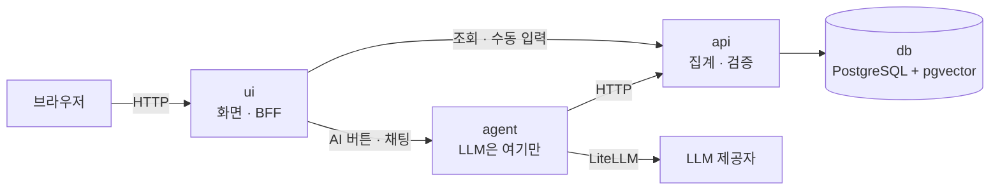
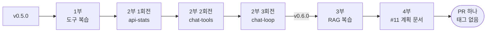
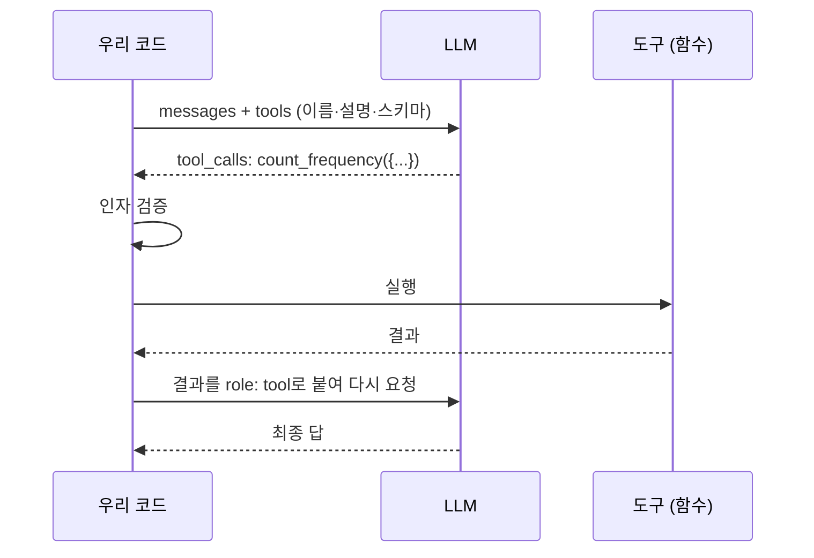
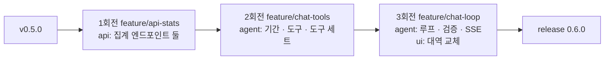
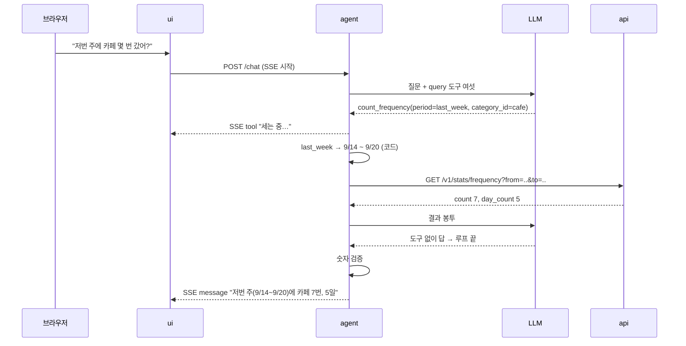
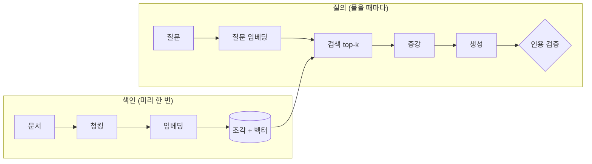
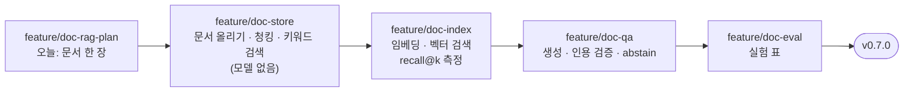
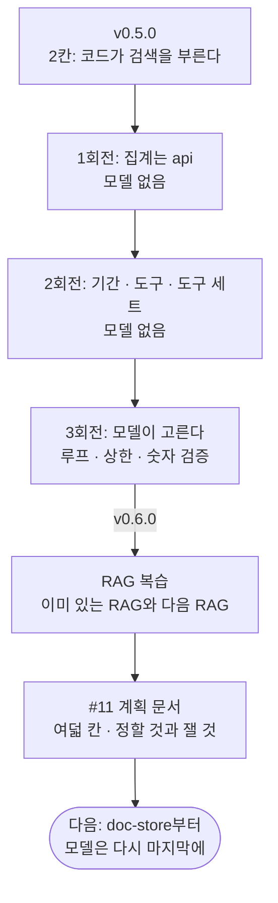

> 9주차 라이브 빌드의 두 번째 교안입니다. 세션은 2시간이고, 멘토 시연 중심으로 진행합니다.  
> 이 교안에는 **실행 결과가 실려 있지 않습니다.** 오늘 현장에서 짓기 때문입니다.  
> 지시 프롬프트와 명령은 미리 적어 두었습니다. 시연이 끝나면 태그와 PR 링크를
> 이 문서에 답니다.  
> 앞 시간은 **만들고**, 뒤 시간은 **계획합니다.** 두 시간의 성격이 다릅니다.

- **주제**: 실제 제품에 도구를 얹는 순서, 그리고 아직 짓지 않을 기능을 문서로 계획하는 법
- **세션 포커스**: tool calling과 ReAct 복습, 도구 설계 규약, "모델은 마지막 회전에", RAG 파이프라인 복습, 기능 문서의 틀과 실험 설계
- **시연 저장소**: [account-book](https://github.com/2026-ai-service-engineering-a/account-book) (출발점 `v0.5.0`)
- **다루는 이슈**: #8 대화로 묻는 통계 (만든다 → `v0.6.0`), #11 문서 Q&A (계획만 → 기능 문서 PR)
- **산출물**: `v0.6.0` 태그 + `docs/ai/document-rag.md` 한 장
- **앞선 문서**: 빈 저장소에서 v0.5까지 가는 순서는 [9주차 라이브 빌드](/course/session-09-2/)에 있습니다
- **운영 방식**: 멘토 시연 → 저장소·지시 프롬프트 공개 → 영상 아카이브 (코드 따라 쓰기 없음)

## 1. 세션 목표

지난 라이브 빌드의 한 문장은 "AI를 마지막에 얹는다"였습니다. 가계부는 그
순서대로 자랐습니다. 문서가 먼저 서고, AI 없이 도는 가계부가 섰고, 그 위에
에이전트가 두 자리에 들어왔습니다.

그런데 그 에이전트는 **아직 도구를 한 번도 고른 적이 없습니다.** 무엇을
언제 부를지는 전부 코드가 정했고, 모델은 정해진 자리에서 한 번 판단했을
뿐입니다. 5주차 사다리로 치면 2칸입니다.

오늘의 한 문장은 둘입니다.

> **모델이 고르고, 코드가 실행한다.**

> **짓기 전에 무엇을 잴지부터 적는다.**

앞의 것은 #8에서, 뒤의 것은 #11에서 봅니다.

| 오늘 보는 것 | 오늘 보지 않는 것 |
| --- | --- |
| 도구를 실제 제품의 계층에 넣는 순서 | 새로운 프레임워크 (LangGraph 없이 갑니다) |
| 도구 하나의 모양과 규약 | 쓰기 도구와 승인 카드 (9주차 레퍼런스에 있습니다) |
| 모델 없이 테스트되는 도구, 마지막에 들어오는 모델 | 멀티 에이전트 |
| RAG 단계마다 품질을 가르는 손잡이 | RAG 구현 (오늘은 계획만) |
| 기능 문서의 틀, 정할 것과 실험에 맡길 것 | 배포 (12주차입니다) |

## 2. 브리핑: 가계부는 지금 어디까지 왔나

### 2-1. 출발점: v0.5.0

`v0.5.0`의 가계부는 서비스 넷이 compose 하나로 뜹니다. 화면이 없는 서비스가
둘(`api`, `agent`)이고, 사람이 보는 화면은 `ui`가 맡습니다.



| 서비스 | 하는 일 | 모르는 것 |
| --- | --- | --- |
| `ui` | 화면, 세션 | LLM. 프롬프트 한 줄도 없다 |
| `agent` | 기록·분류의 판단, 임베딩 | DB 접속 정보 |
| `api` | 거래·집계·예산·카테고리 검색 | LLM 키 |
| `db` | 거래와 벡터 | |

오늘 지을 것도 이 경계를 그대로 따릅니다. 집계는 `api`가 하고, 판단은
`agent`가 하고, `ui`는 둘 다 모릅니다.

### 2-2. AI 자리 넷과 지금 서 있는 것

지난 라이브 빌드 5장에서 "AI가 들어갈 자리는 Protocol 하나로 못 박는다"고
했습니다. 가계부에는 그 자리가 넷입니다.

| 자리 (포트) | 대신하는 판단 | v0.5.0 |
| --- | --- | --- |
| `CaptureReader` | 카드 문자·한 줄 → 거래 칸 | **진짜** (`agent`의 `POST /capture`) |
| `CategorySuggester` | 가맹점 → 카테고리 | **진짜** (`agent`의 `POST /classify`) |
| `ChatAgent` | 대화로 묻는 답 | 각본 대역 |
| `ReportNarrator` | 리포트의 "눈에 띈 것" 문장 | 각본 대역 |

오늘 #8이 세 번째 줄을 진짜로 바꿉니다. 화면 코드는 고치지 않습니다. 자리를
미리 뚫어 두었기 때문입니다.

### 2-3. 오늘의 두 이슈: 하나는 짓고, 하나는 계획한다

| | #8 대화로 묻는 통계 | #11 문서 Q&A |
| --- | --- | --- |
| 무엇 | "저번 주에 카페 몇 번 갔어?"에 답한다 | 카드 혜택 안내 같은 문서를 근거로 답한다 |
| 오늘 하는 일 | **짓는다** (세 회전) | **계획한다** (문서 한 장) |
| 새 개념 | [[tool-calling\|tool calling]], [[react\|ReAct]] | 전통 [[rag\|RAG]] (청킹부터 인용 검증까지) |
| 설계 문서 | 이미 있다 (`docs/ai/chat-analytics.md`) | 오늘 쓴다 (`docs/ai/document-rag.md`) |
| 끝나면 | `v0.6.0` 태그 | 기능 문서 PR. **태그는 찍지 않는다** |

같은 시간에 두 성격의 일을 하는 이유가 있습니다. #8은 설계가 끝나 있어서
짓기만 하면 됩니다. #11은 아직 **정할 것이 남아 있습니다.** 정할 것이 남은
기능을 바로 지으면, 그 결정은 코드가 대신 내립니다. 그리고 아무도 그것이
결정이었다는 걸 모릅니다.

### 2-4. 사다리에서 지금 어디인가

지난 라이브 빌드 6장 1절의 사다리입니다. 가계부의 AI 자리를 올려 보면
이렇습니다.

| 칸 | 무엇 | 가계부에서 |
| --- | --- | --- |
| 1 | 모델 호출 한 번 | |
| 2 | [[structured-output\|structured output]] | **기록, 카테고리 고르기** (v0.5.0) |
| 3 | 도구 ([[tool-calling\|tool calling]]) | **#8에서 올라간다** |
| 4 | 루프 ([[react\|ReAct]]) | **#8에서 올라간다** (짧게) |
| 5 | 그래프·멀티 | 올라가지 않는다 |

카테고리 고르기에도 검색이 있지만 2칸입니다. **검색을 부르는 것이 코드이기
때문입니다.** 모델은 검색 결과를 받아 하나를 고를 뿐입니다. 이 차이가 1부의
핵심입니다.

### 2-5. 진행과 시간 배분



| | 구간 | 분 |
| --- | --- | --- |
| 브리핑 | 출발점 확인 | 5 |
| 1부 | 도구 복습: 가계부에 아직 도구가 없는 이유 | 15 |
| 2부 | #8 짓기: 세 회전과 `v0.6.0` | 55 |
| 3부 | RAG 복습: 이미 있는 RAG와 오늘 계획할 RAG | 15 |
| 4부 | #11 계획 문서 쓰기 | 25 |
| 마무리 | 내 프로젝트로 | 5 |

### 2-6. 수강생 재현: 출발점에 서기

시연을 따라 보려면 `v0.5.0`에 섭니다.

```bash
git clone https://github.com/2026-ai-service-engineering-a/account-book.git
cd account-book
git switch -c try-v0.5.0 v0.5.0
make dev        # http://localhost:8080
```

`.env`가 없으면 `make`가 `.env.sample`에서 만들어 줍니다. 키를 비워 두면
AI 자리 넷 모두에 각본 대역이 섭니다. 키를 넣으면 기록과 카테고리 고르기만
진짜로 바뀝니다.

채팅 화면에서 세 줄을 쳐 봅니다.

```plaintext
이번 달 식비 얼마 썼어?
저번 주에 카페 몇 번 갔어?
지난달보다 식비 늘었어?
```

어느 줄을 대역이 알아듣고 어느 줄에서 막히는지 봐 둡니다. **오늘 끝에 같은
세 줄을 진짜가 받습니다.** 그 차이가 `v0.6.0`입니다.

## 3. 1부: 도구 복습, 그리고 가계부에 아직 도구가 없는 이유

### 3-1. 도구는 이름·설명·입력 스키마 셋이다

5주차 3장 3절의 정의를 그대로 가져옵니다.

> **도구는 모델이 이름으로 부를 수 있게 등록해 둔 우리 코드의 함수입니다.**

모델에게 보이는 것은 셋뿐입니다.

- **이름**: `count_frequency`
- **설명**: "기간 안의 거래 건수와 거래가 있던 날 수를 센다"
- **입력 스키마**: `period`는 정해진 이름 중 하나, `category_id`는 선택

모델은 실행하지 못합니다. "이 도구를 이 인자로 실행해 달라"는 **요청**을
만들 뿐이고, 실행은 우리 코드가 합니다.



이 그림에서 기억할 것은 셋입니다.

- **판단은 모델, 실행은 코드.** 방어선이 전부 코드 쪽에 있는 이유입니다
- **도구 목록은 매 요청 다시 실립니다.** 도구가 늘면 매번 내는 토큰도 늡니다
- **결과도 그냥 메시지입니다.** 왕복의 기억은 전부 배열에 있습니다

### 3-2. 도구를 반복하면 루프다

6주차의 [[react|ReAct]]는 위 왕복에 종료 조건을 단 것입니다. 모델은 매번
"도구가 더 필요한가, 이제 답할 수 있는가"만 판단합니다.

| 정지 조건 | 왜 필요한가 |
| --- | --- |
| 도구 없이 답이 왔다 | 정상 종료 |
| 스텝 상한 | 같은 곳을 맴돌며 예산을 태우는 것을 막는다 |
| 비용·시간 상한 | [[budget-guard\|budget guard]]의 자리 |

6주차 3장 5절에서 스텝 한도를 빼면 무엇이 일어나는지 봤습니다. 오늘도 같은
상한이 들어갑니다.

### 3-3. 도구가 아닌 것: RAG와의 경계

5주차 3장 3절에는 이런 줄이 있었습니다.

> 4주차에서 검색이 추려 프롬프트에 넣어 준 것은 **우리가 넣어 준 것**이지
> 모델이 요청한 것이 아닙니다. 같은 검색이라도 모델이 필요하다고 판단해
> 부르면 그때부터 도구입니다.

이 경계가 오늘 두 번 나옵니다. 지금 가계부의 카테고리 고르기가 정확히 "넣어
준 것"이고, 4부에서 계획할 문서 Q&A도 처음에는 "넣어 준 것"으로
시작합니다. 5장 3절에서 다시 봅니다.

### 3-4. 가계부에는 아직 도구가 없다

README에는 도구 표가 있습니다. `search_transactions`, `summarize_spending`,
`suggest_category` 같은 이름이 적혀 있습니다. 그런데 코드를 열면 **모델이
도구를 고르는 곳이 한 군데도 없습니다.**

`agent`가 모델을 부르는 포트는 메서드 하나뿐입니다.

```python
# src/agent/application/ports/language_model.py
class LanguageModel(Protocol):
    """구조화 출력을 내는 LLM. 어느 제공자인지는 조립 지점만 안다."""

    async def complete_json(self, prompt: Prompt) -> Mapping[str, object]:
        """`prompt.schema` 모양의 JSON 객체 하나를 낸다."""
        ...
```

[[structured-output|structured output]]만 있고 `tools=`는 없습니다. 카테고리
고르기는 이렇게 돕니다.

| 순서 | 누가 정하나 |
| --- | --- |
| 1. 규칙 표를 본다 | 코드 |
| 2. `api`의 벡터 검색을 부른다 | **코드** |
| 3. 후보와 근거로 하나를 고른다 | 모델 (한 번) |

`suggest_category`는 이름만 도구이고 실제로는 코드가 부르는 HTTP 호출입니다.
이것이 틀린 설계는 아닙니다. **판단 자리가 하나뿐이면 단발이 맞습니다.** 6주차
라우팅 원칙 그대로입니다. 확실한 것은 코드가 정합니다.

### 3-5. #8에는 왜 도구가 필요한가

가계부 문서(`docs/ai/agent-loop.md`)에 판정 한 줄이 적혀 있습니다.

> **다음에 무엇을 부를지가 이전 결과에 달려 있나?**  
> 아니오 → Plan-and-Execute. 예 → ReAct. 애초에 부를 것이 하나다 → 단발.

카테고리 고르기는 "부를 것이 하나"입니다. 대화 통계는 다릅니다. 질문을 받기
전에는 어느 집계를 부를지 모릅니다.

| 질문 | 도구 | 인자 |
| --- | --- | --- |
| 저번 주에 카페 몇 번 갔어? | `count_frequency` | `period=last_week`, `category_id=cafe` |
| 이번 달 식비 얼마 썼어? | `summarize_spending` | `period=this_month`, `category_id=food` |
| 지난달보다 식비 늘었어? | `compare_periods` | `a=last_month`, `b=this_month`, `category_id=food` |
| 예산 안에 있어? | `get_budget_status` | `period=this_month` |
| 이번 주에 뭐 샀어? | `search_transactions` | `period=this_week` |

**이 표가 #8의 핵심입니다.** 질문을 도구 호출로 번역하는 일을 모델이 맡습니다.
그리고 결과가 0건이면 "카페는 카테고리가 아니라 가게 이름인가?"를 보고 다음
수를 바꿔야 합니다. 그래서 루프가 필요합니다. 다만 짧게 돕니다. 통계 질문은
보통 두 스텝이면 끝납니다.

### 3-6. 모델이 정하는 것과 정하지 않는 것

도구를 쓴다고 모델에게 다 맡기지 않습니다. 가계부의 원칙 첫 줄이 "숫자는
DB가 낸다"입니다.

| | 모델이 정한다 | 코드가 정한다 |
| --- | --- | --- |
| 도구 | 어느 도구를 부를지 | 도구 목록. 질의에는 **읽기 도구만 준다** |
| 기간 | 기간의 **이름** (`last_week`) | 실제 날짜 경계 |
| 대상 | 사전에서 고른 `category_id` | 사전. 사전 밖 값은 버린다 |
| 숫자 | 하나도 정하지 않는다 | 건수·합계·평균 전부 `api` |
| 문장 | 해석 한 줄 | 숫자 표는 템플릿이 그린다 |

두 줄에 밑줄을 칩니다.

- **쓰기 도구를 목록에서 뺍니다.** "지우지 마"를 프롬프트에 적는 것과 목록에서 빼는 것 중 지켜졌는지 확인할 수 있는 것은 뒤쪽뿐입니다. 6주차 5장 5절의 "권한을 좁히는 것이 방어의 본체"입니다
- **날짜 계산도 산수입니다.** "저번 주"를 모델이 계산하면 주가 일요일에 시작하기도 하고, 오늘이 포함되기도 하고, 타임존이 UTC가 되기도 합니다. 셋 다 숫자가 그럴듯하게 나와서 사용자가 알아채지 못합니다

## 4. 2부: #8 대화로 묻는 통계, 세 회전

### 4-1. 순서 한눈에: 모델은 마지막 회전에만

지난 라이브 빌드의 "AI를 마지막에 얹는다"를 기능 하나 안에서 한 번 더
씁니다. 세 회전 중 **모델을 부르는 것은 3회전뿐입니다.**



| 회전 | 브랜치 | 서비스 | 모델 호출 | 끝나면 할 수 있는 것 |
| --- | --- | --- | --- | --- |
| 1 | `feature/api-stats` | `api` | 없음 | 횟수·비교 숫자를 HTTP로 받는다 |
| 2 | `feature/chat-tools` | `agent` | 없음 | 도구를 손으로 부르면 숫자가 온다 |
| 3 | `feature/chat-loop` | `agent`, `ui` | **여기서 처음** | 채팅에서 물으면 답한다 |

이 순서를 지키면 3회전에서 문제가 생겼을 때 의심할 곳이 좁아집니다. 숫자가
틀리면 1회전, 기간이 틀리면 2회전, 도구를 잘못 고르면 3회전입니다.

### 4-2. 시작 전: 계획을 먼저 보여 준다

가계부 저장소에서는 기능을 시작하기 전에 계획을 먼저 받습니다. 에이전트가
쓰고, 사람이 보고, 승인한 뒤에 브랜치를 땁니다.

```plaintext
#8 대화로 묻는 통계를 하려고 한다. 코드는 아직 고치지 마.

- docs/ai/chat-analytics.md, tools.md, agent-loop.md 4장을 읽고
  구현 계획을 세워라
- feature를 몇 개로 나눌지, 각 feature가 어느 서비스를 건드리는지
- 모델 호출은 마지막 feature에만 들어가게 나눠라
- 새로 생기는 엔드포인트·도구·환경변수를 표로
- 요청 하나의 흐름을 mermaid sequence로
- 설계 문서와 어긋나는 곳이 있으면 고치지 말고 먼저 말해라
```

- **"코드는 아직 고치지 마"**: 계획과 구현이 한 번에 나오면 계획을 리뷰할 틈이 없습니다
- **"모델 호출은 마지막 feature에만"**: 오늘의 순서를 지시로 박습니다. 없으면 에이전트는 루프부터 만듭니다. 제일 재미있는 부분이기 때문입니다
- **"어긋나는 곳이 있으면 먼저 말해라"**: 설계 문서가 정본입니다. 조용히 다르게 만들면 문서가 거짓말을 시작합니다

계획이 나오면 4장 1절의 표와 견줍니다. 회전 수가 다르면 이유를 묻습니다.

### 4-3. 1회전: 집계는 api가 (`feature/api-stats`)

```bash
git switch develop && git pull
git flow feature start api-stats
```

#### 무엇이 없나

`api`에는 이미 `/v1/summary`(합계)와 `/v1/budgets/status`(예산)가 있습니다.
없는 것은 둘입니다.

| 엔드포인트 | 대응 도구 | 돌려주는 것 |
| --- | --- | --- |
| `GET /v1/stats/frequency` | `count_frequency` | 건수, 거래가 있던 **날 수**, 평균 간격, 회당 평균 |
| `GET /v1/stats/compare` | `compare_periods` | 두 기간의 카테고리별 합계와 증감 |

**횟수는 합계와 다른 질문입니다.** 거래 목록을 받아 `agent`가 세면, 같은
계산이 두 군데 생깁니다. 건수와 날 수를 같이 내는 이유도 있습니다. 카페 7건이
5일에 걸쳤는지 하루에 몰렸는지는 전혀 다른 이야기입니다.

엔드포인트는 날짜를 `from`·`to`로 받습니다. 기간 이름(`last_week`)을 받지
않습니다. 이름을 푸는 것은 `agent`의 일이고, `api`는 경계가 정해진 질의만
받습니다.

#### 지시 프롬프트

```plaintext
#8의 첫 feature다. api에 집계 엔드포인트 둘을 더하자. Refs #8

- GET /v1/stats/frequency: from, to, category_id 또는 merchant
  → 건수, 거래가 있던 날 수, 평균 간격(일), 회당 평균 금액
- GET /v1/stats/compare: 기간 둘(a_from, a_to, b_from, b_to), category_id
  → 카테고리별 두 합계와 증감(금액·비율)
- 집계는 SQL로. 파이썬에서 거래를 불러와 세지 마라
- 걸름 규칙은 /v1/summary와 같게. 목록과 다른 거래를 세면 안 된다
- 기간 이름은 받지 마라. from/to만
- docs/api-contract.md 6장에 줄을 옮기고, docs/ai/README.md 7.2에서 지워라
- 유스케이스 → 저장소 → 라우터 순으로, 단위마다 커밋. 모델 호출은 없다
```

줄별 의도 포인트입니다.

- **"집계는 SQL로"**: `/v1/summary`와 같은 방식입니다. 거래를 메모리로 끌어와 세면 3년치에서 무너집니다
- **"걸름 규칙은 summary와 같게"**: 목록에서는 7건인데 횟수는 8건으로 나오면 사용자는 둘 다 안 믿습니다
- **"기간 이름은 받지 마라"**: 경계를 두 서비스가 따로 풀면 언젠가 어긋납니다. 푸는 곳은 한 곳입니다
- **"계약에 옮기고 7.2에서 지워라"**: 가계부의 규칙입니다. 설계만 있는 줄은 "아직 반영하지 않은 줄"에 두고, 구현과 함께 계약으로 옮깁니다

#### 확인할 것

| 어디 | 무엇을 |
| --- | --- |
| `curl` 한 번 | 지난주 카페 건수가 거래 목록 화면의 줄 수와 같다 |
| 0건 | 오류가 아니라 `count: 0`이 온다 |
| `make test-db` | 실제 Postgres에서 집계가 돈다 |
| `docs/api-contract.md` | 줄이 늘었고, `docs/ai/README.md` 7.2에서 줄었다 |

```bash
make all
make review
git flow feature finish api-stats
```

**여기까지 모델은 없습니다.** 그래도 이 회전이 #8의 숫자 전부를 냅니다.

### 4-4. 2회전: 도구는 모델 없이 선다 (`feature/chat-tools`)

```bash
git flow feature start chat-tools
```

이 회전에서 도구가 생깁니다. 하지만 **모델은 아직 부르지 않습니다.** 도구는
모델의 존재를 모르는 그냥 함수이고(5주차 6장 13절), 그래서 모델 없이
테스트됩니다.

#### 기간 이름 → 날짜 경계

모델은 이름만 고르고, 경계는 `agent`의 domain 코드가 사용자 타임존으로
계산합니다.

| 이름 | 경계 |
| --- | --- |
| `today` · `yesterday` | 사용자 타임존의 하루 |
| `this_week` | 이번 주 월요일 00:00부터 지금까지 |
| `last_week` | 지난주 월요일 00:00부터 일요일 24:00까지 |
| `this_month` · `last_month` | 달 경계 |
| `this_year` | 1월 1일부터 지금까지 |
| `last_n_days` | `n`일 전 00:00부터 지금까지 (`n`은 1\~365) |
| `month` | `YYYY-MM`을 같이 받는다 |

**주의 시작은 월요일이고, "저번 주"에 오늘은 들어가지 않습니다.** 이런 결정은
문서에 적혀 있어야 합니다. 코드에만 있으면 두 사람이 다르게 기억합니다.

이 함수는 순수 함수입니다. 오늘 날짜를 주입받아 경계를 돌려줍니다. 테스트가
가장 촘촘해야 하는 자리입니다. 기간이 틀리면 그 뒤의 숫자는 전부 정확하게
틀립니다.

#### 도구 하나의 모양

```python
# src/agent/domain/tools/count_frequency.py
class CountFrequencyInput(BaseModel):
    period: PeriodName          # 이름만. 날짜 계산은 코드가 한다
    category_id: CategoryId | None = None
    merchant: str | None = None


class CountFrequencyOutput(BaseModel):
    count: int
    day_count: int
    avg_gap_days: float
    avg_amount: Money
```

| 부분 | 규칙 |
| --- | --- |
| 이름 | `동사_목적어`. `get_data` 같은 이름은 모델도 어디에 쓸지 모른다 |
| 설명 | 한 줄은 무엇을, **한 줄은 언제 쓰지 말아야 하는지** |
| 입력·출력 | Pydantic. `dict`를 돌려주는 도구는 만들지 않는다 |
| 권한 | 읽기 · 쓰기(확인 필요) · 쓰기(항상 확인) |

설명의 둘째 줄이 첫째 줄보다 중요합니다.

```plaintext
count_frequency — 기간 안의 거래 건수와 거래가 있던 날 수를 센다.
                  금액 합계가 필요하면 이 도구가 아니라 summarize_spending을 쓴다.
```

5주차 6장 11절에서 "이름과 설명이 품질을 가른다"를 실측했습니다. 도구가
여덟 개일 때는 티가 안 나고, 열둘이 되면 엉뚱한 도구를 부르는 비율이 눈에
보이게 올라갑니다.

#### 결과 봉투

모든 도구는 같은 봉투로 답합니다.

```json
{
  "call_id": "call_3",
  "ok": true,
  "data": { "count": 7, "day_count": 5, "avg_gap_days": 1.4 },
  "meta": { "row_count": 7, "truncated": false, "elapsed_ms": 38 }
}
```

- **`call_id`**: 감사 로그의 키가 되고, 같은 도구를 두 번 부른 대화에서 어느 결과인지 가립니다
- **`ok: false`**: 실패도 봉투에 담아 모델에게 보여 줍니다. 5주차 6장 8절의 "에러 되먹임"입니다
- **`truncated`**: 잘렸으면 문장으로도 알립니다. 조용히 자르면 모델은 그게 전부라고 믿고 답합니다
- **금액은 정수와 통화로.** `"8,500원"` 같은 문자열은 만들지 않습니다. 서식은 화면의 일입니다

#### 자리마다 도구를 좁힌다

같은 도구 목록을 모든 자리에 주지 않습니다. 이 회전에서 **질의 모드의 도구
세트**를 코드로 고정합니다.

| 모드 | 쓰는 곳 | 주는 도구 | 쓰기 |
| --- | --- | --- | --- |
| `classify` | 카테고리 고르기 | `suggest_category` | 없다 |
| `query` | **#8 대화 조회** | 읽기 여섯 | **없다** |
| `capture` | 대화로 기록 | 검색 둘 + 쓰기 넷 | 확인 게이트 |

모드는 코드가 정합니다. 사용자 발화나 모델 출력이 모드를 바꿀 수 없습니다.
바꿀 수 있으면 "이제 기록 모드로 전환해"라고 적힌 메모가 언젠가 들어옵니다.
6주차 5장 3절의 간접 [[prompt-injection|프롬프트 인젝션]]입니다.

#### 지시 프롬프트

```plaintext
#8의 두 번째 feature다. agent에 도구를 세우자. 모델은 아직 부르지 마. Refs #8

- domain: 기간 이름(PeriodName)과 경계 계산. docs/ai/chat-analytics.md 5장의 표 그대로.
  오늘 날짜와 타임존을 주입받는 순수 함수로. 주는 월요일에 시작한다
- domain/tools: 읽기 도구 여섯의 입력·출력 스키마와 설명.
  설명은 두 줄. 둘째 줄은 "언제 이 도구를 쓰지 않는가"
- application: 도구 실행기. 이름과 인자를 받아 기간을 풀고,
  api를 부르고, docs/ai/tools.md 3.1의 결과 봉투로 돌려준다.
  실패도 봉투로(ok: false). 재시도하지 마라
- 모드별 도구 세트. query 모드에는 쓰기 도구가 들어가지 않는다는 테스트를 넣어라
- 테스트는 가짜 api로. LLM은 어디에도 없다
- 기간 → 도구 → 실행기 → 도구 세트 순으로 커밋
```

줄별 의도 포인트입니다.

- **"모델은 아직 부르지 마"**: 이 회전의 정의입니다. 도구가 모델 없이 선다는 것을 증명하는 회전입니다
- **"오늘 날짜를 주입받는"**: `datetime.now()`를 함수 안에서 부르면 테스트가 요일마다 다르게 돕니다
- **"둘째 줄은 언제 쓰지 않는가"**: 상한을 주듯이 형식을 줍니다. 형식을 안 주면 설명이 한 줄로 끝납니다
- **"재시도하지 마라"**: 재시도는 루프의 일입니다. 도구 안에서도 재시도하면 실패 한 번이 아홉 번이 됩니다
- **"쓰기 도구가 들어가지 않는다는 테스트"**: 프롬프트로 막은 것은 테스트할 수 없고, 목록으로 막은 것은 테스트할 수 있습니다

#### 확인할 것

| 어디 | 무엇을 |
| --- | --- |
| 기간 테스트 | 월요일·일요일·월말·연초에 `last_week`가 어떻게 풀리는가 |
| 도구 설명 | 여섯 개 모두 둘째 줄이 있는가. 서로 겹치는 설명이 없는가 |
| 실행기 | `api`가 죽으면 예외가 아니라 `ok: false` 봉투가 오는가 |
| 도구 세트 | `query`에 `create_`, `update_`, `delete_`, `set_`이 없다 |
| `git diff` | `litellm`을 임포트한 줄이 없다 |

```bash
make all
make review
git flow feature finish chat-tools
```

### 4-5. 3회전: 모델이 고른다 (`feature/chat-loop`)

```bash
git flow feature start chat-loop
```

여기서 처음으로 모델이 도구를 고릅니다. 이 회전에서 넣는 것은 다섯입니다.

1. `LanguageModel` 포트에 도구 호출 메서드
2. ReAct 루프와 정지 조건
3. 답의 숫자 검증
4. `agent`의 `POST /chat` ([[sse|SSE]])
5. `ui`의 대역 교체

#### 먼저 정할 것: 도구 호출을 어떻게 받나

지금 포트에는 `complete_json()`뿐입니다. 길이 둘입니다.

| | A. 네이티브 tool calling | B. `complete_json` 재사용 |
| --- | --- | --- |
| 방식 | [[litellm\|LiteLLM]] `acompletion(tools=[...])`. 모델이 `tool_calls`로 답한다 | "다음 행동"(도구+인자 또는 최종 답)을 JSON 스키마로 받는다 |
| 장점 | 제공자들이 이 용도로 학습시켰다. 5주차에 배운 그대로다 | 어댑터를 거의 그대로 쓴다 |
| 단점 | 포트에 메서드가 하나 는다 | tool calling을 손으로 흉내 내는 셈이다. 도구가 늘면 스키마가 커진다 |

**A로 갑니다.** 제공자 차이는 LiteLLM이 흡수하고, 그 차이는 어댑터 안에만
머뭅니다. 도구 스키마는 2회전의 Pydantic 모델에서 그대로 뽑습니다. 이 결정은
사람이 내리는 것이고, 시연에서는 4장 2절의 계획 단계에서 이미 정해 둡니다.

#### 요청 하나의 흐름



LLM 호출은 보통 **두 번**입니다. 첫 번째가 도구와 인자를 고르고, 두 번째가
결과를 한 줄로 읽습니다.

#### 정지 조건과 루프 감지

| 조건 | 결과 |
| --- | --- |
| 도구 없이 답이 왔다 | 정상 종료. 숫자를 검증하고 낸다 |
| 스텝 상한 (`AGENT_MAX_STEPS`) | 지금까지의 답 + "여기까지 해봤어요" |
| 비용 상한 (`AGENT_MAX_COST_USD`) | 같다 |
| 같은 (도구, 인자)가 두 번 | **그 자리에서 끊는다** |

두 환경변수는 `v0.5.0`의 `.env.sample`에 이미 있습니다. 새로 만들지 않습니다.

마지막 줄이 6주차에 없던 것입니다. 읽기 도구는 다시 불러도 같은 답이 옵니다.
모델이 같은 걸 다시 부르는 것은 대개 원하는 숫자가 안 나와서이고, 그 다음
스텝도 같을 것입니다. 끊고, 그때까지 모은 숫자를 냅니다. 이 감지가 자주
발동하면 도구 설명이 부족한 것입니다. 2회전으로 돌아갑니다.

#### 답의 숫자는 도구에서 왔나

두 번째 호출이 결과를 읽고 한 줄을 씁니다. 여기서 숫자를 지어낼 수 있습니다.
"7건, 평균 5,200원"을 보고 "총 36,400원 썼네요"라고 쓰는 식입니다. 곱셈이
맞든 틀리든 그 숫자는 DB가 낸 값이 아닙니다.

- 도구 결과에 있던 수치를 집합으로 모읍니다 (천 단위 구분·퍼센트 표기 정규화)
- 문장의 숫자가 그 집합에 있는지 봅니다. 날짜와 기간 경계는 예외입니다
- 집합 밖 숫자가 있으면 **문장을 버리고 표만 냅니다**

완벽한 방어는 아닙니다. 그래도 "지어낸 합계"라는 가장 흔하고 가장 나쁜
실패를 잡고, **지켜졌는지 확인할 수 있습니다.** 프롬프트에 "계산하지 마"를
적는 것과의 차이입니다.

#### 화면은 고치지 않는다

`ui`는 채팅 화면의 SSE 이벤트 표를 그대로 씁니다. 진행 줄은 기존 `tool`
이벤트, 답은 기존 `message` 이벤트입니다. **통계 전용 이벤트를 만들지
않습니다.**

`ui`에서 바뀌는 것은 조립 지점 한 곳입니다. `AGENT_BASE_URL`이 있으면
`ScriptedChatAgent` 대신 `agent`를 부르는 구현을 끼웁니다. 비어 있으면 여전히
각본 대역이 섭니다. 기록과 카테고리 고르기가 붙을 때와 같은 방식입니다.

#### 평가 세트

`tests/fixtures/ai/questions.json`에 질문 30개와 정답 도구·인자를 적습니다.

| 묶음 | 건수 | 보는 것 |
| --- | --- | --- |
| 한 도구로 끝나는 질문 | 15 | 도구·인자가 라벨과 같은가 |
| 기간 표현 | 8 | `저번 주` · `지난달` · `최근 3일` · `9월` |
| 도구 둘을 엮는 질문 | 4 | 호출 순서는 안 보고 결과 숫자만 본다 |
| 거절해야 하는 질문 | 3 | "다음 달 얼마 쓸 것 같아?" 같은 예측·인과. **못 한다고 말했는가** |

| 지표 | 목표 |
| --- | --- |
| 기간 해석 정확도 | **100%**. 틀린 기간의 정확한 합계는 정확해 보인다 |
| 숫자 일치율 | **100%**. 도구 결과에 없는 숫자가 답에 있으면 실패 |
| 도구 선택 정확도 | 라벨과 일치 |
| 건당 LLM 호출 | 2회 |

단위 테스트는 LLM을 부르지 않습니다. 가짜 모델이 정해진 `tool_calls`를
돌려주게 하고 **경로**를 검증합니다. 실제 모델을 부르는 평가는 `make eval`처럼
사람이 필요할 때만 돌리고, 숫자를 커밋 메시지에 남깁니다.

#### 지시 프롬프트

```plaintext
#8의 마지막 feature다. 모델이 도구를 고르게 하자. Refs #8

1) LanguageModel 포트에 도구 호출 메서드를 더해라.
   LiteLLM의 tools=로. 도구 스키마는 2회전의 Pydantic 모델에서 뽑는다.
   complete_json은 그대로 둔다
2) ReAct 루프. docs/ai/agent-loop.md 4장의 정지 조건 넷.
   AGENT_MAX_STEPS, AGENT_MAX_COST_USD를 쓴다. 새 상한을 만들지 마라
3) 답의 숫자 검증. chat-analytics.md 7.2. 실패하면 문장을 버리고 표만
4) POST /chat SSE. 이벤트는 ui_docs/pages/chat.md 4.1의 것만 쓴다.
   tool 이벤트에 인자를 싣지 마라
5) ui: AGENT_BASE_URL이 있으면 agent를 부르는 ChatAgent를 끼워라.
   화면 코드는 고치지 마라
6) tests/fixtures/ai/questions.json 30건. 묶음은 chat-analytics.md 9장대로

- 단위 테스트는 가짜 모델로. 실제 모델 평가는 -m integration으로 갈라라
- 번호마다 커밋. 각 커밋에서 make all이 통과해야 한다
- 2회전의 도구 스키마를 바꿔야 하면 먼저 말해라
```

줄별 의도 포인트입니다.

- **"complete_json은 그대로"**: 기록과 카테고리 고르기가 쓰고 있습니다. 새 길을 내면서 옛 길을 건드리지 않습니다
- **"새 상한을 만들지 마라"**: 상한이 서비스마다, 기능마다 생기면 무엇이 걸렸는지 아무도 모릅니다
- **"이벤트는 4.1의 것만"**: 이벤트가 하나 늘면 화면에 분기가 하나 늘고, 그 분기는 통계에만 쓰입니다
- **"tool 이벤트에 인자를 싣지 마라"**: 화면에 필요한 것은 "무엇을 하는 중"이지 "어떤 값으로"가 아닙니다. 로그 규칙과 같은 이유입니다
- **"화면 코드는 고치지 마라"**: 2장 2절에서 자리를 미리 뚫어 둔 값이 여기서 나옵니다
- **"스키마를 바꿔야 하면 먼저 말해라"**: 지난 라이브 빌드 6장 4절의 그 줄입니다. 설계 변경은 사람이 내릴 결정입니다

#### 확인할 것

| 걸음 | 확인 | 틀어지면 보이는 것 |
| --- | --- | --- |
| 1 | 가짜 모델이 낸 `tool_calls`가 실행기로 간다 | 인자 파싱 에러 |
| 2 | 같은 도구를 두 번 부르게 한 가짜 모델에서 루프가 끊긴다 | 상한까지 돈다 |
| 3 | "총 36,400원"을 쓰는 가짜 모델에서 문장이 버려진다 | 지어낸 숫자가 화면에 |
| 4 | 진행 줄이 "세는 중…"으로 바뀐다 | 말풍선이 한참 비어 있다 |
| 5 | 2장 6절의 세 줄을 다시 친다. 이번에는 진짜가 답한다 | 여전히 대역이면 `AGENT_BASE_URL` |
| 6 | `make eval`로 30건. 기간 정확도 100% | 기간 표현 묶음에서 틀린다 |

5번이 이 시연의 클라이맥스입니다. 같은 세 줄에 대역과 진짜가 어떻게 다르게
답하는지 나란히 봅니다.

```bash
make all
make review
git flow feature finish chat-loop
```

### 4-6. 릴리즈 v0.6.0

```bash
git flow release start 0.6.0
# VERSION과 CHANGELOG. 업그레이드 절에 새 환경변수가 없다는 것도 적는다
make all
make review BASE=main
git flow release finish 0.6.0
git push origin main develop --tags
```

`git diff v0.5.0 v0.6.0`이 "도구를 얹으면서 무엇이 늘었나"의 답입니다.

| 늘어난 것 | 늘어나지 않아야 하는 것 |
| --- | --- |
| `api`의 엔드포인트 둘 | `ui`의 화면 코드 |
| `agent`의 기간·도구·실행기·루프 | SSE 이벤트 종류 |
| 포트의 메서드 하나 | 환경변수 (상한은 이미 있었다) |
| 평가 세트 30건 | 쓰기 경로 |

마지막으로 이슈 #8에 결과를 적고 닫습니다. 세 feature의 머지 커밋과 평가
숫자를 남깁니다.

## 5. 3부: RAG 복습

여기서부터는 짓지 않습니다. 2부에서 무엇을 언제 정했는지 기억하며 봅니다.
**#8은 설계가 끝나 있어서 지을 수 있었습니다.** #11은 아직 아닙니다.

### 5-1. 다 주지 말고, 찾아서 준다

4주차 2장 5절의 문장입니다. 데이터를 통째로 컨텍스트에 넣지 않고, 먼저
**검색**으로 관련된 몇 건을 찾고, 그것만 넣어 **증강**한 뒤 **생성**합니다.
검색의 눈이 [[embedding|임베딩]]입니다.

전통 RAG는 이것을 문서에 적용합니다. 색인과 질의, 두 길입니다.



### 5-2. 가계부에는 이미 RAG가 하나 있다

카테고리 고르기(#7)가 RAG입니다. 가맹점 이름을 임베딩하고, 과거 거래 중
가까운 이웃을 찾고, 그 이웃의 카테고리를 근거로 하나를 고릅니다. 그런데
#11과 나란히 놓으면 다른 점이 많습니다.

| | 카테고리 고르기 (#7) | 문서 Q&A (#11) |
| --- | --- | --- |
| 검색 단위 | 거래 한 줄 (짧다) | 문서 조각 (길다) |
| 청킹 | **없다.** 한 줄이 한 단위다 | **있다.** 품질을 가장 크게 가르는 자리 |
| 출력 | 카테고리 id 하나 | 인용이 달린 문장 |
| 검증 | 답이 사전 안에 있나 | 인용이 넘겨준 조각 안에 있나 |
| 근거가 없으면 | 사람이 고른다 | 모른다고 답한다 |
| 자유도 | 낮다 (답이 목록 안) | 높다 (답이 문장) |

청킹과 생성이 새로 들어옵니다. 둘 다 "잘 됐는지"를 눈으로 판정하기 어려운
자리입니다. **그래서 계획부터 씁니다.**

### 5-3. 넣어 준 것으로 시작해 도구로 간다

3장 3절의 경계를 다시 봅니다. #11에는 길이 둘입니다.

| | 별도 화면의 단발 질문 | 채팅의 도구 (`search_documents`) |
| --- | --- | --- |
| 검색을 부르는 것 | 코드 | 모델 |
| 이름 | RAG ("넣어 준 것") | 도구 ("요청한 것") |
| 단계가 보이나 | 잘 보인다. 검색 결과를 화면에 띄울 수 있다 | 루프 안에 묻힌다 |
| 평가 | 검색과 생성을 따로 잰다 | 도구 선택까지 섞인다 |

학습 목적이면 **별도 화면이 먼저입니다.** 단계가 눈에 보이고 단계마다 잴 수
있습니다. 그 뒤 2부에서 만든 `query` 모드에 `search_documents`를 일곱째 도구로
얹으면, "내 카드 스타벅스 할인 돼?"를 채팅에서 물을 수 있게 됩니다. 오늘
2부와 4부가 거기서 만납니다.

### 5-4. 단계마다 품질을 가르는 손잡이

전통 RAG를 "처음부터 끝까지 한 번" 만드는 이유는 이 표 때문입니다. 단계마다
손잡이가 있고, 어느 손잡이가 답을 바꾸는지는 **재 봐야** 압니다.

| 단계 | 손잡이 | 잘못 잡으면 |
| --- | --- | --- |
| 청킹 | 경계(제목·문단·길이), 크기, 겹침 | 표가 반으로 잘리고, "단, 월 1만 원까지" 같은 조건이 다른 조각으로 간다 |
| 임베딩 | 모델, 차원 | 바꾸면 전부 다시 색인해야 한다 |
| 검색 | k, 하이브리드(BM25), 재랭킹 | 숫자·고유명사 질문을 벡터만으로 놓친다 |
| 증강 | 조각에 id를 붙여 데이터 마커 안에 | 문서 속 문장을 지시로 읽는다 ([[prompt-injection\|인젝션]]) |
| 생성 | 답 + 인용 id를 스키마로 | 인용 없이 그럴듯하게 말한다 |
| 검증 | 인용 ⊂ 넘겨준 조각 | 없는 조각을 인용한다 |

그리고 보는 숫자입니다.

| 단계 | 지표 | 뜻 |
| --- | --- | --- |
| 검색 | recall@k | 정답 조각이 top-k 안에 들었나 |
| 검색 | MRR | 정답 조각이 몇 번째에 나왔나 |
| 생성 | 근거 충실도 | 답의 주장이 인용 조각에 있나 |
| 생성 | abstain율 | 답 없는 질문에 모른다고 했나 |

**검색을 먼저 잽니다.** 정답 조각이 top-k에 없으면 생성이 아무리 좋아도 답이
틀립니다. 생성 품질을 고치기 전에 recall부터 봅니다.

## 6. 4부: #11을 문서로 계획한다

### 6-1. 왜 짓지 않고 계획만 하나

#11에는 아직 정할 것이 남았습니다. 어디서 묻는지, 청킹을 무엇으로 자르는지,
하이브리드를 붙일지. 이걸 정하지 않고 지으면 **에이전트가 대신 정합니다.**
그리고 그것이 결정이었다는 기록이 남지 않습니다.

계획 문서가 하는 일은 셋입니다.

- **정할 것을 정합니다.** 이유와 함께 적어서 나중에 뒤집을 수 있게 합니다
- **실험에 맡길 것을 가릅니다.** 청크 크기 같은 것은 지금 정하면 안 됩니다. 재서 정합니다
- **평가를 먼저 정합니다.** 무엇을 잴지 정하지 않고 지으면, 다 지은 뒤 그것에 맞춰 평가를 고르게 됩니다 (10주차 5장의 "정답 10건을 기획 단계에서"와 같은 이야기입니다)

계획 PR에는 태그를 찍지 않습니다. **태그는 동작하는 것에 찍습니다.**

### 6-2. 기능 문서의 틀: 여덟 칸

가계부의 AI 기능 문서는 모두 같은 차례를 따릅니다. `docs/ai/README.md` 6장의 틀입니다.
#8의 `chat-analytics.md`도 이 틀이었습니다. #11을 칸마다 채우면 이렇습니다.

| 칸 | 묻는 것 | #11에서 |
| --- | --- | --- |
| 1. 목적 | 이게 없으면 사용자가 무엇을 손으로 하나 | 카드 혜택 안내를 열어 "커피 업종"을 찾아 읽는다 |
| 2. 경계 | 어느 서비스에서 도나. LLM이 정하는 것과 정하지 않는 것 | `api`는 조각 저장과 검색, `agent`는 임베딩·생성·검증. 계산은 하지 않는다 |
| 3. 흐름 | 요청 하나가 지나가는 길 | 5장 1절의 두 길 |
| 4. 스키마 | LLM에게 주는 것과 받는 것 | 조각 id가 붙은 증강, 답 + 인용 id |
| 5. 검증과 폴백 | 틀린 결과를 어떻게 잡나. 못 하면 무엇으로 | 인용 부분집합 검사, 근거 없으면 abstain |
| 6. 평가 | 고정 세트와 보는 숫자 | 질문 30 + 답 없는 질문 5, 5장 4절의 지표 |
| 7. 결정과 이유 | 갈렸던 선택 | 6장 4절 |
| 8. 하지 않는 것 | 지금 범위 밖 | PDF·OCR, 실제 약관 수집, 문서×거래 계산 |

**4번과 5번을 붙여 둔 것이 이 틀의 요점입니다.** 스키마를 적으면서 "이게
틀리면 어떻게 아나"를 같이 쓰게 됩니다.

### 6-3. 4번과 5번을 붙여 쓰는 예

모델에게 받는 것입니다.

```json
{
  "answer": "스타벅스 결제는 10% 청구 할인이고, 월 1만 원까지입니다.",
  "citations": ["card-a#coffee-2", "card-a#limits-1"],
  "abstain": false
}
```

이걸 받자마자 코드가 하는 검사입니다.

| 검사 | 걸리면 |
| --- | --- |
| `citations`가 넘겨준 조각 id의 부분집합인가 | 버린다. 없는 조각을 인용했다 |
| `abstain: false`인데 `citations`가 비었나 | abstain으로 바꾼다. 근거 없는 주장이다 |
| 답에 숫자가 있는데 인용 조각에 그 숫자가 없나 | 버린다. 2부 4장 5절의 숫자 검증과 같은 생각이다 |

세 번째 줄이 2부에서 넘어온 것입니다. **숫자는 출처에서 온 것만 말한다**는
원칙이 출처가 DB에서 문서로 바뀌어도 그대로 섭니다.

### 6-4. 정할 것과 실험에 맡길 것

계획 문서의 "결정과 이유" 칸에 들어갈 것들입니다. 핵심은 **지금 정하는 것과
재서 정하는 것을 나누는 것**입니다.

| 질문 | 지금 정한다 / 재서 정한다 | 계획에 적을 것 |
| --- | --- | --- |
| 어디서 묻나 | **지금** | 별도 화면이 먼저, 채팅 도구는 2차 (5장 3절) |
| 자료 | **지금** | 학습용 가상 문서. 카드 혜택 2\~3종과 연말정산 1종이고, 실제 약관은 저작권 문제가 있다 |
| 저장 | **지금** | `documents`, `document_chunks`. 벡터 DB를 따로 세우지 않는다 (pgvector) |
| 색인 방향 | **지금** | `agent`가 색인 안 된 조각을 당겨 와 임베딩한다. `api`가 `agent`를 부르지 않는다 |
| 청킹 경계 | **지금** | 제목 경계가 먼저, 그다음 길이 상한 |
| 청크 크기·겹침 | **재서** | 후보 값 셋을 적고, recall@k로 고른다 |
| k | **재서** | 3·5·8을 비교한다 |
| 하이브리드(BM25) | **재서** | 붙였을 때와 뗐을 때를 비교한다 |
| 재랭킹 | **재서** | 위가 끝난 뒤에. 하나씩 바꾼다 |

"재서"라고 적은 줄은 **비워 두는 것이 아니라 실험 계획을 적는 것**입니다.
후보 값, 보는 지표, 비교 기준을 적습니다.

### 6-5. 실험 설계를 계획에 적는다

```plaintext
고정: 질문 30 + 답 없는 질문 5 (tests/fixtures/ai/document_qa.json)
      정답 조각 id를 질문마다 라벨로

기준선: 검색 없이 LLM에게만 물은 답

바꾸는 것 (한 번에 하나):
  청크 크기   300 / 600 / 1000자
  겹침        0 / 15%
  k           3 / 5 / 8
  하이브리드  없음 / BM25 결합

보는 것:
  검색  recall@k, MRR
  생성  근거 충실도, abstain율 (답 없는 5건)
```

두 줄에 밑줄을 칩니다.

- **기준선이 있습니다.** 지난 라이브 빌드의 v0.2와 같은 역할입니다. 검색 없이 물은 답보다 나아야 RAG를 붙인 의미가 있습니다
- **한 번에 하나만 바꿉니다.** 청크 크기와 k를 같이 바꾸면 무엇이 좋아졌는지 모릅니다

### 6-6. 이후 회전도 계획에 적는다

#11이 지어질 때의 회전도 계획에 넣습니다. 2부와 같은 원칙입니다. **모델은
마지막에 들어옵니다.**



`doc-store`가 2부의 1회전과 같은 자리입니다. 임베딩 없이도 키워드 검색으로
"스타벅스"가 든 조각을 찾아 화면에 띄울 수 있습니다. 그게 기준선 하나가 되고,
키 없이 도는 상태가 됩니다.

`doc-index`에서 생성 없이 **검색만 먼저 잽니다.** recall@k가 낮으면 `doc-qa`로
가지 않고 청킹으로 돌아갑니다.

### 6-7. 지시 프롬프트

```bash
git switch develop && git pull
git flow feature start doc-rag-plan
```

```plaintext
#11 문서 Q&A의 계획 문서를 쓰자. 코드는 만들지 마. Refs #11

- docs/ai/document-rag.md를 docs/ai/README.md 6장의 여덟 칸 틀로 써라
- 4번(스키마)과 5번(검증과 폴백)은 붙여서. 스키마마다
  "이게 틀리면 어떻게 아나"를 같이 적어라
- 결정과 이유: 지금 정하는 것과 실험으로 정하는 것을 나눠라.
  실험으로 정하는 것은 후보 값, 지표, 비교 기준을 적어라
- 평가: 고정 세트의 모양(질문 30 + 답 없는 질문 5)과 기준선(검색 없는 LLM)
- 이후 feature 나누기. 모델 호출은 뒤쪽 feature에만
- docs/ai/README.md 1장 표에 한 줄, 7장 "아직 반영하지 않은 줄"에
  엔드포인트·테이블·환경변수를 적어라. 계약 문서는 아직 고치지 마라
- 이슈 #11의 "정할 것"에 답이 나왔으면 문서에 적고, 못 정한 것은 못 정했다고 적어라
```

줄별 의도 포인트입니다.

- **"코드는 만들지 마"**: 지난 라이브 빌드 1회전의 그 줄입니다. 없으면 에이전트가 친절하게 청킹 함수를 만들어 줍니다
- **"이게 틀리면 어떻게 아나를 같이"**: 4번과 5번을 붙이는 틀을 지시로 박습니다
- **"지금 정하는 것과 실험으로 정하는 것을 나눠라"**: 이 줄이 없으면 에이전트는 청크 크기를 그럴듯한 숫자 하나로 정해 버립니다. 그 숫자에는 근거가 없습니다
- **"계약 문서는 아직 고치지 마라"**: 설계만 있는 것을 계약에 적으면 "있다고 적혀 있는데 없는" 표가 됩니다. 가계부가 #8에서 지킨 규칙입니다
- **"못 정한 것은 못 정했다고"**: 미룬 결정을 미뤘다고 적으면 나중에 그것이 빚인지 판단인지 구분됩니다. 지난 라이브 빌드 4장 3절의 `decisions.md`와 같은 이야기입니다

### 6-8. PR 리뷰에서 보는 것

계획 PR은 코드가 없어서 diff가 문장입니다. 이 표로 읽습니다.

| 어디 | 무엇을 |
| --- | --- |
| 1. 목적 | 기능이 아니라 사람이 손으로 하던 일이 적혔나 |
| 4·5번 | 스키마마다 검증이 붙었나 |
| 결정과 이유 | "재서 정한다" 줄에 후보 값과 지표가 있나. 숫자 하나로 정해 버린 줄은 없나 |
| 평가 | 답 없는 질문이 섞였나. 기준선이 있나 |
| 회전 계획 | 모델이 마지막에 들어오나. 검색만 재는 회전이 따로 있나 |
| 하지 않는 것 | 셋 이상, 이유와 함께 |

통과하면 develop에 합치고, 이슈 #11에 계획 문서 링크를 답니다. 이슈는 닫지
않습니다. **지어질 때 닫습니다.**

```bash
make all
make review
git flow feature finish doc-rag-plan
```

## 7. 라이브에서 눈여겨볼 것

### 7-1. 도구를 얹을 때 에이전트가 틀리는 자리

| 자리 | 증상 | 처방 |
| --- | --- | --- |
| 순서 | 루프부터 만든다 | "모델 호출은 마지막 feature에만" |
| 날짜 | 프롬프트에 오늘 날짜를 넣고 모델에게 "저번 주"를 계산시킨다 | 기간은 이름만. 경계는 domain 함수 |
| 권한 | 편의상 모든 도구를 한 목록에 준다 | 모드별 도구 세트 + 쓰기 도구 부재 테스트 |
| 설명 | 도구 설명이 한 줄로 끝난다 | "둘째 줄은 언제 쓰지 않는가" |
| 숫자 | 해석 줄에 합계를 지어낸다 | 숫자 검증. 실패하면 표만 |
| 테스트 | 테스트가 실제 모델을 부른다 | 가짜 모델이 정해진 `tool_calls`를 돌려준다 |
| 상한 | 기능마다 새 상한을 만든다 | 있는 환경변수를 쓴다 |

### 7-2. 계획을 쓸 때 에이전트가 틀리는 자리

| 자리 | 증상 | 처방 |
| --- | --- | --- |
| 범위 | 계획을 쓰다가 코드를 만든다 | "코드는 만들지 마" |
| 숫자 | 청크 크기를 512로 정해 버린다 | "실험으로 정하는 것은 후보 값과 지표를" |
| 평가 | 평가 칸이 "정확도를 본다" 한 줄 | 세트 모양, 지표, 기준선을 칸으로 요구 |
| 계약 | 아직 없는 엔드포인트를 계약 문서에 적는다 | "계약 문서는 아직 고치지 마라" |
| 인프라 | 별도 벡터 DB를 제안한다 | "하지 않는 것"에 이유와 함께 |

### 7-3. 되돌리는 자리

2부에서 3회전이 꼬이면 `feature/chat-loop`를 버리고 다시 땁니다. 1·2회전은
이미 develop에 있으니 잃는 것은 30분입니다. 회전을 셋으로 나눈 값이 여기서
나옵니다.

```bash
git switch develop
git branch -D feature/chat-loop
git flow feature start chat-loop
```

## 8. 내 프로젝트로 가져가기

### 8-1. 사다리 3칸으로 올라가는 신호

10주차 기획에서 AI 자리를 2칸으로 잡은 분이 많을 것입니다. 3칸(도구)으로
올라갈 때는 이 신호를 봅니다.

| 신호 | 3칸으로 |
| --- | --- |
| 질문을 받기 전에는 무엇을 조회할지 모른다 | 올라간다 |
| 조회할 것이 하나로 정해져 있다 | **올라가지 않는다.** 코드가 부른다 |
| 결과를 보고 다음 조회를 바꿔야 한다 | 4칸(루프)까지 |
| 조회가 여럿이지만 서로 독립이다 | [[plan-execute\|Plan-and-Execute]]를 본다 |

### 8-2. 도구를 넣기 전 체크리스트

- [ ] 숫자를 내는 쪽이 도구 뒤의 코드인가 (모델이 아니라)
- [ ] 날짜·단위·식별자를 모델이 계산하거나 지어내지 않는가
- [ ] 도구 설명에 "언제 쓰지 않는가"가 있는가
- [ ] 이 자리에 쓰기 도구가 목록에 없는가
- [ ] 도구가 모델 없이 테스트되는가
- [ ] 스텝·비용 상한이 있는가
- [ ] 답의 숫자가 도구 결과에서 왔는지 확인하는가

### 8-3. 계획 문서는 기획서의 다음 장이다

10주차의 `docs/proposal.md`가 "무엇을 왜"라면, 오늘의 기능 문서는 AI 자리
하나의 "어떻게, 그리고 어떻게 잴지"입니다. 프로젝트에 AI 자리가 생기면 여덟
칸 틀로 한 장씩 씁니다. 특히 두 칸을 빼먹지 않습니다.

- **평가**: 정답 세트의 모양과 기준선
- **결정과 이유**: 지금 정한 것과 재서 정할 것

## 9. 재현할 때 유의할 점

- **`v0.5.0`에서 시작합니다.** develop의 끝에서 시작하면 시연과 다른 지점에 섭니다
- **키 없이도 2회전까지는 전부 됩니다.** 3회전의 단위 테스트도 가짜 모델로 돕니다. 키가 필요한 것은 화면 확인과 `make eval`뿐입니다
- **`make dev`를 오래 띄워 두었다면** `.env`를 바꾼 뒤 다시 띄웁니다. compose watch는 시작할 때의 설정을 들고 갑니다
- **기간 테스트는 오늘 날짜에 기대지 않습니다.** 금요일에 통과하고 월요일에 깨지는 테스트가 가장 찾기 어렵습니다
- **평가 숫자는 커밋 메시지에 남깁니다.** 프롬프트를 고쳤을 때 되돌릴 근거가 됩니다
- **계획 PR은 코드 없이 합칩니다.** 계획과 첫 구현을 한 PR에 섞으면 계획을 리뷰할 수 없습니다
- **에이전트에게 태그를 찍게 하지 않습니다.** `v0.6.0`은 사람이 세 줄을 쳐 보고 찍습니다

## 10. 이 세션이 남기는 것

**도구**

- 도구는 이름·설명·입력 스키마로 등록한 우리 코드의 함수다. 모델은 요청만 한다
- 검색이 있어도 코드가 부르면 도구가 아니다. 판단 자리가 하나면 단발이 맞다
- "다음에 무엇을 부를지가 이전 결과에 달려 있나"가 도구와 루프를 부르는 질문이다
- 도구의 설명에는 "언제 쓰지 않는가"가 들어간다
- 쓰기 도구는 프롬프트가 아니라 목록에서 뺀다. 그래야 테스트할 수 있다

**숫자**

- 숫자는 DB가 낸다. 날짜 계산도 산수다
- 모델은 기간의 이름만 고르고, 경계는 코드가 푼다. 답에는 해석한 기간을 밝힌다
- 답의 숫자가 도구 결과에 없으면 문장을 버리고 표만 낸다

**순서**

- 기능 하나 안에서도 모델은 마지막 회전에 들어온다
- 1회전이 틀리면 숫자가, 2회전이 틀리면 기간이, 3회전이 틀리면 도구 선택이 틀린다. 나눠 두면 의심할 곳이 좁다
- 자리를 미리 뚫어 두면 진짜가 들어올 때 화면 코드는 그대로다

**RAG와 계획**

- 다 주지 말고 찾아서 준다. 검색을 먼저 재고, 생성은 그다음이다
- 청킹은 품질을 가장 크게 가르는 손잡이이고, 그래서 재서 정한다
- 계획 문서는 정할 것을 정하고, 실험에 맡길 것을 가르고, 평가를 먼저 정한다
- 스키마 옆에 검증을 적는다. "이게 틀리면 어떻게 아나"
- 태그는 동작하는 것에 찍는다. 계획에는 찍지 않는다

**한 장으로**



**그리고 다음**

#11은 오늘 쓴 계획 문서대로 지어집니다. 그때도 첫 회전에는 모델이 없습니다.
키워드 검색으로 조각을 찾아 화면에 띄우는 것부터 시작합니다.
