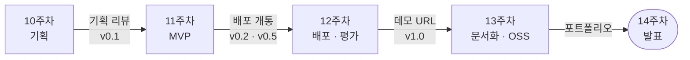
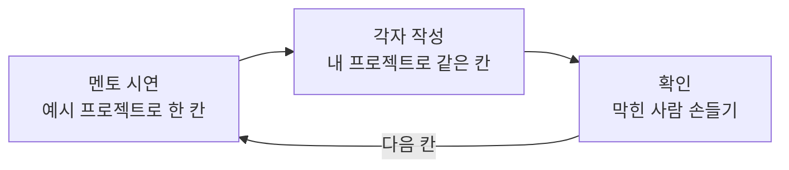
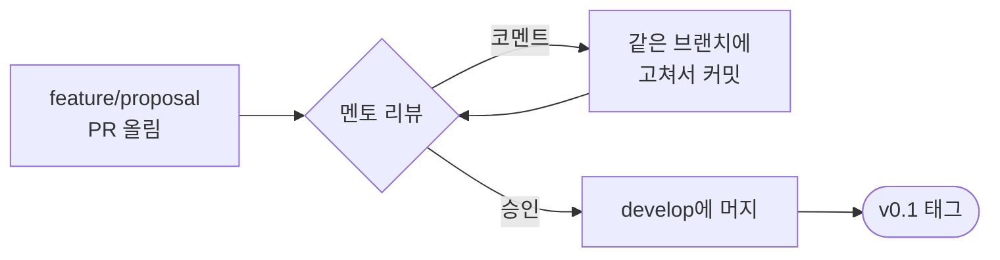
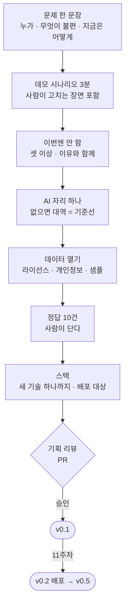

> 10주차 라이브 세션 교안입니다. 개인 프로젝트 구간의 첫 회차입니다.  
> 세션은 2시간이고, 지금까지와 진행이 다릅니다. 멘토가 예시 프로젝트 하나로
> 기획서의 칸을 채우는 것을 보여 주면, 바로 이어서 각자 자기 칸을 채웁니다.  
> 이 교안의 예시 프로젝트는 설명을 위해 지어낸 가상의 사례입니다. 숫자도
> 예시이고 실측이 아닙니다.  
> 기획서 틀과 지시 프롬프트는 이 문서에 전부 실려 있어, 세션에 오지 못해도
> 같은 순서로 쓸 수 있습니다.

- **주제**: 개인 프로젝트 기획 (문제 정의, MVP 범위, 데이터·스택 선정)
- **세션 포커스**: 문제 문장 쓰기, 데모 시나리오와 "이번엔 안 함" 목록, 데이터 열기와 정답 10건, 층 고르기, 짝 리뷰
- **산출물**: 프로젝트 기획서 (`docs/proposal.md`) + 기획 리뷰 통과 + `v0.1` 태그
- **앞선 주**: [9주차 라이브 빌드](/course/session-09-2/)에서 빈 저장소에서 v0.5까지 가는 순서를 봤습니다. 이번 주는 그 순서에 넣을 문제를 고릅니다
- **막히면 여는 문서**: [9주차 레퍼런스 구현](/course/session-09/) 11장 "프로젝트로 가져가기"
- **운영 방식**: 칸마다 멘토 시연 → 각자 작성 → 짝 리뷰. 기획 리뷰는 세션 후 PR로 받습니다

## 1. 세션 목표

9주차의 마지막 문장은 "10주차에 가져올 것은 코드가 아니라 문제 하나"였습니다.
이번 주는 그 문제 하나를 고르고, 고른 것을 남이 읽을 수 있는 한 장으로
내려놓는 회차입니다.

이번 주의 한 문장은 이것입니다.

> **기획은 무엇을 만들지가 아니라 무엇을 만들지 않을지 정하는 일이다.**

남은 시간은 네 주입니다. 그중 기능을 짓는 데 쓸 수 있는 시간은 생각보다
짧습니다. 12주차는 배포와 평가, 13주차는 문서화, 14주차는 발표입니다. 그래서
기획의 대부분은 **자르는 일**이고, 잘라 낸 것을 잘라 냈다고 적어 두는 일입니다.

| 오늘 하는 것 | 오늘 하지 않는 것 |
| --- | --- |
| 문제를 사람과 불편으로 한 문장에 적는다 | 코드 (v0.2는 다음 주입니다) |
| 3분 데모 시나리오 하나로 범위를 정한다 | 기능 목록 늘어놓기 |
| 데이터를 실제로 열어 보고 정답 10건을 적는다 | "나중에 크롤링하면 된다" |
| 9주 동안 배운 층에서 스택을 고른다 | 새 프레임워크 탐색 |
| 기획서 한 장을 PR로 올린다 | 슬라이드로 된 기획서 |

오늘 새로 배우는 기술은 없습니다. **판단**을 연습합니다. 그리고 그 판단을
문장으로 남깁니다.

## 2. 브리핑: 남은 네 주와 기획 리뷰

### 2-1. 남은 네 주의 지도

10주차부터 14주차까지는 주마다 하나의 관문이 있습니다.



| 주차 | 관문 | 이 관문에서 묻는 것 |
| --- | --- | --- |
| 10 | **기획 리뷰** | 4주 안에 끝나는 문제인가 |
| 11 | 배포 파이프라인 사전 개통 | `main`에 push하면 어딘가에 뜨는가 |
| 12 | 데모 URL과 평가 로그 | 좋아졌다는 것을 숫자로 말할 수 있는가 |
| 13 | 포트폴리오 | 남이 클론해서 띄울 수 있는가 |
| 14 | 최종 발표 | 무엇을 만들었고 무엇을 만들지 않았는가 |

표의 오른쪽 열을 다시 보면, **11\~14주차의 질문 대부분이 오늘 기획서에서
답이 정해집니다.** 평가할 데이터가 없으면 12주차가 막히고, 데이터 라이선스를
모르면 13주차가 막힙니다. 오늘 한 시간을 더 쓰는 것이 4주 뒤 하루를 아낍니다.

### 2-2. 기획서는 저장소 안에 있습니다

9주차 라이브 빌드 8장 3절에서 "저장소가 기획서가 되게 만든다"고 했습니다.
이번 주에 그 말을 구체적으로 만듭니다.

| 기획 리뷰가 보는 것 | 저장소의 어디 |
| --- | --- |
| 기획서 본문 | `docs/proposal.md` (오늘 쓰는 한 장) |
| 누구의 무슨 불편인가 | `README.md` 첫 문단 |
| 무엇을 정했고 무엇을 미뤘나 | `docs/decisions.md` |
| AI는 어디에 들어가나 | `docs/architecture.md`의 빈 자리 |
| 데이터가 실제로 있나 | `data/sample/` 아래 몇 줄 |
| 좋아졌는지 무엇으로 재나 | `eval/golden.jsonl` 10건 |

슬라이드나 워드 파일로 따로 쓰지 않는 이유가 셋입니다.

- **한 벌만 있습니다.** 기획서와 저장소가 따로 있으면 11주차부터 둘이 어긋나기 시작합니다. 어긋난 쪽은 대개 기획서이고, 아무도 고치지 않습니다
- **코딩 에이전트가 읽습니다.** `docs/proposal.md`가 있으면 "범위는 proposal.md에 있다" 한 줄로 지시가 끝납니다. 범위를 벗어나는 제안을 에이전트가 스스로 거릅니다
- **리뷰가 PR이 됩니다.** 리뷰 코멘트가 줄 단위로 남고, 고친 흔적이 커밋으로 남습니다. 14주차 발표에서 "처음 기획과 무엇이 달라졌나"를 `git log` 하나로 보여 줄 수 있습니다

### 2-3. 진행 방식: 칸마다 시연 하나, 작성 하나

지금까지는 멘토가 시연하고 수강생은 보는 회차였습니다. 오늘은 다릅니다.
**칸 하나마다 멘토가 예시로 먼저 채우고, 바로 이어서 각자 같은 칸을 채웁니다.**



오늘 예시 프로젝트는 **쇼핑몰 문의 분류 보조**입니다. 9주차 라이브 빌드의
현장 후보 셋 중 하나였습니다. 정답이 분명해서 평가 칸을 설명하기 좋아
골랐습니다. 다시 한 번 짚지만 가상의 사례입니다.

### 2-4. 시간 배분

| | 구간 | 분 |
| --- | --- | --- |
| 브리핑 | 남은 네 주와 기획서 (이 장) | 15 |
| 문제 | 문제 문장과 거르는 기준 (3장) | 20 |
| 범위 | 데모 시나리오와 "이번엔 안 함" (4장) | 20 |
| 데이터·평가 | 데이터 열기와 정답 10건 (5장) | 25 |
| 스택 | 층 고르기와 배포 대상 (6장) | 15 |
| 리뷰 | 짝 리뷰 (8장 4절) | 20 |
| 마무리 | PR 올리기와 11주차 예고 | 5 |

무게중심이 데이터에 있습니다. 문제와 범위는 머릿속에서 정할 수 있지만,
**데이터는 열어 보기 전까지 모릅니다.** 오늘 열어 보고 문제를 바꾸는 사람이
매년 나오고, 그것이 오늘 일어나는 편이 11주차에 일어나는 것보다 훨씬 쌉니다.

### 2-5. 준비물

세션에 이것들을 가지고 옵니다.

- 1주차에 만든 개인 저장소, 또는 9주차 라이브 빌드 순서로 새로 만든 저장소
- 문제 후보 둘에서 셋 (한 줄씩이면 충분합니다)
- 후보마다 데이터를 구할 곳 하나 (링크 하나면 충분합니다)

후보가 하나뿐이어도 괜찮습니다. 다만 3장의 거르는 기준에서 떨어지면 세션
중에 다른 후보를 찾아야 하므로, 둘 이상이면 편합니다.

## 3. 문제: 기술이 아니라 사람에서 시작합니다

```bash
git switch develop
git switch -c feature/proposal
mkdir -p docs eval data/sample
```

오늘의 작업은 브랜치 하나입니다. 칸 하나가 끝날 때마다 커밋합니다.

### 3-1. 거꾸로 시작하면 어디서 막히나

매년 가장 흔한 첫 문장이 이것입니다.

> "LangGraph로 멀티 에이전트를 만들어 보고 싶은데, 뭘 만들면 좋을까요?"

기술에서 출발한 기획은 거의 같은 경로로 막힙니다.

| 주차 | 기술에서 시작하면 | 문제에서 시작하면 |
| --- | --- | --- |
| 10 | 구조 그림은 화려한데 누가 쓰는지 비어 있다 | 쓰는 사람이 한 문장으로 적혀 있다 |
| 11 | 에이전트는 도는데 무엇을 입력할지 모른다 | 입력이 정해져 있어 바로 돌려 본다 |
| 12 | "좋아졌다"를 무엇과 비교할지 없다 | AI 없이 하던 방법이 기준선이다 |
| 14 | "이런 기술을 썼습니다"로 발표가 끝난다 | "이 불편이 이만큼 줄었습니다"로 끝난다 |

기술은 문제가 정해진 다음에 고릅니다. 9주차 레퍼런스 11장 2절의 표가 그
고르는 기준입니다. 이번 주 6장에서 다시 씁니다.

### 3-2. 문제 문장의 틀

문제는 이 틀로 한 문장에 적습니다.

```plaintext
<누가> <언제> <무엇을 하느라> <얼마나> 불편하다.
지금은 <어떻게> 하고 있다.
```

두 번째 문장이 중요합니다. **지금 하는 방법이 곧 v0.2이고, 12주차의
기준선입니다.**

예시 프로젝트로 채우면 이렇습니다.

```plaintext
혼자 운영하는 온라인 쇼핑몰 운영자가 매일 아침
밤사이 쌓인 문의 40건 남짓을 배송·교환·환불·상품·기타로 나누고
급한 것부터 답하느라 한 시간 가까이 쓴다.
지금은 메일함을 위에서부터 읽으며 머릿속으로 분류하고 있다.
```

나쁜 문장과 견줘 봅니다.

| 나쁜 문장 | 무엇이 빠졌나 | 고친 방향 |
| --- | --- | --- |
| "AI 고객센터 챗봇" | 누가, 무엇이 불편한지 | 누가 무엇을 하느라 불편한지부터 |
| "문의를 자동으로 분류하는 서비스" | 기능만 있다 | 그 분류를 지금 누가 손으로 하고 있는지 |
| "모든 쇼핑몰의 CS를 혁신한다" | 범위가 없다 | 한 사람, 한 가지 일로 좁힌다 |
| "RAG와 에이전트로 문의 응대 자동화" | 기술이 주어다 | 기술 이름을 문장에서 뺀다 |

마지막 줄이 요령입니다. **문제 문장에는 기술 이름이 하나도 없어야 합니다.**
기술 이름이 들어가면 문제가 아니라 해법을 적은 것입니다.

### 3-3. 거르는 기준 여섯

9주차 라이브 빌드 2장 4절의 기준 넷에, 4주짜리 공개 프로젝트라서 생기는 둘을
더합니다.

| 기준 | 떨어지는 예 | 왜 |
| --- | --- | --- |
| **AI를 빼도 제품이 되는가** | "AI가 대화해 주는 것"이 전부 | 빼면 v0.2가 존재하지 않는다 |
| **데이터를 오늘 구할 수 있는가** | "업체에 요청해 볼 예정" | 다음 주에 바로 짓기 시작해야 한다 |
| **좋아졌는지 잴 수 있는가** | "더 자연스러운 답변" | 사람이 맞다/틀리다를 판정할 수 있어야 한다 |
| **4주 안에 한 경로가 끝나는가** | 화면 다섯 개, 역할 셋 | 하나가 끝까지 도는 편이 낫다 |
| **공개해도 되는가** | 회사 내부 문서, 실제 고객 이름 | 저장소도 데모도 공개된다 |
| **데모를 3분에 보여줄 수 있는가** | 효과가 한 달 뒤에 나타난다 | 14주차 발표에서 보여줘야 한다 |

여섯 줄 중 하나라도 걸리면 그 후보는 오늘 내려놓습니다. 걸린 줄을 고칠 수
있으면 고쳐서 다시 올립니다. 예를 들어 "회사 내부 문서"는 공개된 공공 문서로
바꾸면 같은 문제를 그대로 풀 수 있는 경우가 많습니다.

예시 프로젝트로 거르면 이렇습니다.

| 기준 | 예시 프로젝트 | 판정 |
| --- | --- | --- |
| AI를 빼도 제품이 되는가 | 문의 목록을 띄우고 사람이 라벨을 다는 화면 | 통과 |
| 데이터를 오늘 구할 수 있는가 | 실제 문의는 못 쓴다. 공개 데이터셋 + 직접 쓴 문의로 | **조건부** |
| 좋아졌는지 잴 수 있는가 | 라벨이 정답과 같은가 | 통과 |
| 4주 안에 한 경로가 끝나는가 | 분류 하나. 답장 초안은 뺀다 | 통과 |
| 공개해도 되는가 | 실제 고객 문의는 쓰지 않는다 | 통과 (데이터를 바꾼 덕에) |
| 데모를 3분에 보여줄 수 있는가 | 문의 20건을 올리고 분류 결과를 본다 | 통과 |

"조건부"는 실패가 아닙니다. 조건을 기획서에 적으면 됩니다. 5장에서 이 조건을
풉니다.

### 3-4. "AI 없이는 어떻게 하던 일인가"

이 질문에 대한 답이 세 종류로 나옵니다.

| 답 | 뜻 | 판정 |
| --- | --- | --- |
| "사람이 손으로 한다" | AI가 덜어 줄 손이 있다 | 좋은 문제 |
| "규칙이나 검색으로 한다" | AI가 규칙보다 나은지 견줄 수 있다 | **아주 좋은 문제** |
| "아무도 안 한다" | 불편이 없거나, 문제가 아직 문장이 안 됐다 | 다시 생각한다 |

두 번째가 가장 좋은 이유는 **기준선이 이미 코드로 있기 때문**입니다. 예시
프로젝트라면 "제목에 '환불'이 있으면 환불"이라는 키워드 규칙이 기준선이 되고,
AI는 그 규칙보다 몇 건을 더 맞히는지로 값을 증명합니다. 4주차에서 "AI가 필요
없는 곳에 안 쓰는 것도 설계"라고 했던 것과 같은 이야기입니다.

세 번째 답이 나왔다면 문제를 버리기 전에 한 번 더 묻습니다. **"그럼 그 사람은
지금 무엇 때문에 시간을 쓰고 있나."** 대개 그쪽에 진짜 문제가 있습니다.

### 3-5. 트랙별로 보면

1주차에 소개한 다섯 트랙은 이번 주에 확정합니다. 트랙을 고르는 것이 목적은
아닙니다. 문제를 적고 나면 트랙은 저절로 정해집니다.

| 트랙 | 좋은 문제 문장의 예 | 기준선 (AI 없이) |
| --- | --- | --- |
| 문서 기반 RAG | 신입이 사내 규정을 찾느라 같은 질문을 선배에게 하루 몇 번씩 한다 | 키워드 검색 |
| 업무 자동화 | 회의가 끝날 때마다 할 일을 정리해 공유하는 데 20분이 든다 | 손으로 정리 |
| 데이터 분석 | 매주 같은 지표 표를 엑셀에서 새로 만든다 | 고정된 SQL 몇 개 |
| 추천·분류 | 하루 수십 건의 문의를 손으로 나눈다 | 키워드 규칙 |
| 개발자 도구 | PR마다 바뀐 이유를 설명하는 데 리뷰어가 시간을 쓴다 | `git diff` 그대로 |

어느 트랙에도 맞지 않는 자유 주제도 됩니다. 다만 거르는 기준 여섯은
똑같이 적용합니다.

### 3-6. 이 칸을 기획서에 옮깁니다

`docs/proposal.md`의 첫 칸입니다. 기획서 전체 틀은 7장에 있고, 여기서는 이
칸만 씁니다.

```markdown
## 1. 문제

혼자 운영하는 온라인 쇼핑몰 운영자가 매일 아침 밤사이 쌓인 문의
40건 남짓을 배송·교환·환불·상품·기타로 나누고 급한 것부터 답하느라
한 시간 가까이 쓴다. 지금은 메일함을 위에서부터 읽으며 머릿속으로
분류하고 있다.

- 쓰는 사람: 1인 쇼핑몰 운영자
- 지금 방법 (기준선): 손 분류. 비교용으로 키워드 규칙을 하나 만든다
- 트랙: 추천·분류
```

같은 문단을 `README.md` 첫 문단에도 넣습니다. README는 사람에게 "무엇을 왜"를
말하는 문서이고, 그 답이 이 문단입니다.

```bash
git add docs/proposal.md README.md
git commit -m "Write the problem statement"
```

## 4. 범위: 무엇을 만들지 않을지

### 4-1. 실제로 쓸 수 있는 시간을 셉니다

범위를 정하기 전에 시간부터 셉니다. 대부분 생각한 것의 절반입니다.

| 주차 | 그 주에 하는 일 | 기능을 짓는 데 쓸 수 있는 몫 |
| --- | --- | --- |
| 10 | 기획 (오늘) | 없음 |
| 11 | v0.2 + 배포 개통 + v0.5 | **대부분** |
| 12 | 배포 안정화 + 평가 + 개선 | 절반 |
| 13 | 문서화 + 라이선스 + 기여 | 거의 없음 |
| 14 | 발표 준비 | 없음 |

자기 숫자를 넣어 봅니다. 한 주에 프로젝트에 쓸 수 있는 시간이 열 시간이라면,
기능을 짓는 데 쓸 수 있는 시간은 **15시간 남짓**입니다. 이 숫자를
기획서에 적어 둡니다. 범위가 클 때 그 이유를 이 숫자로 말할 수 있습니다.

### 4-2. 데모 시나리오 하나로 범위를 정합니다

기능 목록으로 범위를 정하면 목록이 늘어납니다. 대신 **14주차 발표에서 보여줄
3분짜리 시나리오 하나**를 먼저 적습니다. 그 시나리오에 등장하지 않는 기능은
범위 밖입니다.

```plaintext
1. 운영자가 밤사이 문의 20건이 든 파일을 올린다
2. 화면에 문의 목록이 뜨고, 각 줄에 분류 제안과 이유 한 줄이 붙는다
3. 운영자가 틀린 두 건을 고친다. 고친 것은 표시가 남는다
4. "환불" 칸만 골라 급한 순서로 본다
5. 화면 아래에 "오늘 제안 20건 중 18건을 그대로 썼다"가 뜬다
```

다섯 줄을 쓰고 나면 범위가 저절로 보입니다.

- **입력**: 파일 하나 (메일 연동이 아니다)
- **AI 자리**: 2번의 분류 제안 하나
- **사람 자리**: 3번의 고치기. 사람이 최종 판단을 한다
- **평가**: 5번이 곧 평가 지표다

시나리오에 **사람이 고치는 장면**이 꼭 들어가게 씁니다. AI가 틀렸을 때
어떻게 되는지가 시나리오에 없으면, 틀렸을 때를 설계하지 않은 것입니다.

### 4-3. "반드시"와 "이번엔 안 함"

시나리오가 정해지면 떠오르는 기능을 두 칸으로 나눕니다. 중간 칸("있으면
좋음")은 만들지 않습니다. 중간 칸에 들어간 것은 결국 만들게 되기 때문입니다.

| 반드시 (시나리오에 나온다) | 이번엔 안 함 (그리고 이유) |
| --- | --- |
| 파일 올리기 | 메일함 연동. 인증이 붙으면 한 주가 사라진다 |
| 분류 제안 + 이유 한 줄 | 답장 초안. AI 자리가 둘이 된다 |
| 사람이 고치기 | 고친 것으로 다시 학습. 평가 체계가 먼저다 |
| 분류별로 보기 | 대시보드와 통계 화면 |
| 제안 채택률 표시 | 여러 사용자와 로그인 |

**"이번엔 안 함" 칸이 기획서에서 가장 중요한 칸입니다.** 셋 이상 적습니다.
이유도 적습니다. 이유가 없으면 11주차에 슬그머니 다시 들어옵니다.

이 목록은 `docs/decisions.md`에도 그대로 옮깁니다. 9주차 라이브 빌드에서 말한
"미룬 결정을 미뤘다고 적어 두면 나중에 그것이 빚인지 판단인지 구분된다"가
이 자리입니다.

### 4-4. AI 자리를 하나로 적습니다

9주차 라이브 빌드 5장 2절의 네 질문을 그대로 씁니다. 차이는 오늘은 코드가
아니라 **문장으로** 적는다는 것뿐입니다.

| 질문 | 예시 프로젝트의 답 |
| --- | --- |
| 입력이 정해지나 | 문의 한 건 (제목 + 본문) |
| 출력을 검사할 수 있나 | 다섯 라벨 중 하나 + 급함 여부 + 이유 한 줄 |
| 틀리면 어떻게 되나 | 운영자가 보고 고친다. 고친 것이 그대로 남는다 |
| 없으면 막히나 | 안 막힌다. 키워드 규칙이 대신 제안한다 |

마지막 줄의 "키워드 규칙이 대신 제안한다"가 9주차의 각본 대역 자리입니다.
그리고 그 대역이 이번에는 **기준선을 겸합니다.** 규칙 버전과 AI 버전을 같은
정답 10건에 돌려 견주면 12주차 평가가 됩니다.

시그니처도 한 줄 적어 둡니다. 다음 주 `core/assist.py`가 될 줄입니다.

```python
def suggest(inquiry: Inquiry) -> Suggestion: ...
# Suggestion = label(5종 중 하나) + urgent(bool) + reason(한 줄)
```

### 4-5. 사다리에서 몇 칸까지 올라갈지

9주차 라이브 빌드 6장 1절의 사다리입니다. 기획서에는 **목표 칸과 그 근거**를
적습니다.

| 칸 | 무엇 | 언제 올라가나 |
| --- | --- | --- |
| 1 | 모델 호출 한 번 | 출발점 |
| 2 | [[structured-output\|structured output]] | 답을 코드가 받아써야 한다 |
| 3 | 도구 하나 ([[tool-calling\|tool calling]]) 또는 검색 ([[rag\|RAG]]) | 모델이 모르는 것을 찾아와야 한다 |
| 4 | 루프 ([[react\|ReAct]]) | 몇 번 부를지 미리 못 정한다 |
| 5 | 그래프·멀티 ([[langgraph\|LangGraph]]·[[supervisor\|supervisor]]) | 분기·병렬·역할 분리가 실제로 있다 |

예시 프로젝트는 **2칸**입니다. 문의 한 건을 넣고 정해진 모양의 답을 받으면
끝이고, 모델이 따로 찾아와야 할 정보가 없습니다.

4칸 이상을 적었다면 근거를 한 문장 더 적습니다. "몇 번 부를지 미리 못
정하는" 요청을 하나 예로 들 수 있어야 합니다. 들 수 없으면 한 칸 내립니다.
**올라가는 것은 언제든 할 수 있지만, 내려오는 것은 지은 것을 버리는 일입니다.**

### 4-6. 범위가 큰 신호

기획서를 다 쓰고 이 표를 한 번 훑습니다. 둘 이상 걸리면 범위를 줄입니다.

| 신호 | 처방 |
| --- | --- |
| 데모 시나리오가 다섯 줄을 넘는다 | 시나리오를 둘로 나누고 하나를 버린다 |
| AI 자리가 둘 이상이다 | 하나만 남기고 나머지는 "이번엔 안 함"으로 |
| 화면이 둘 이상이다 | 한 화면에 들어가지 않는 것은 뺀다 |
| 로그인·결제·알림이 들어 있다 | 데모에는 필요 없다. 이번엔 안 함 |
| 외부 서비스 연동이 둘 이상이다 | 하나는 파일 업로드로 바꾼다 |
| 처음 써 보는 기술이 둘 이상이다 | 6장 1절 |
| "그리고"가 문제 문장에 들어 있다 | 문제가 둘이다. 하나를 고른다 |

### 4-7. 태그로 일정을 적습니다

일정은 날짜보다 태그로 적습니다. 9주차 라이브 빌드에서 본 [[release-ladder\|릴리즈 사다리]]
그대로입니다.

| 태그 | 무엇까지 | 언제 |
| --- | --- | --- |
| `v0.1` | 기획서·문서·샘플 화면, **기획 리뷰 통과** | 10주차 |
| `v0.2` | AI 없이 도는 제품 + 각본 대역 + 테스트, **어딘가에 배포됨** | 11주차 전반 |
| `v0.5` | AI 자리 하나에 진짜 모델 | 11주차 후반 |
| `v1.0` | 데모 URL 안정 + 평가 로그 | 12주차 |
| `v1.x` | 문서·라이선스 정리 | 13주차 |

`v0.2`에 "어딘가에 배포됨"이 들어간 것이 9주차와 다른 점입니다. 11주차의
"배포 파이프라인 사전 개통"이 이 줄입니다. **키 없이 도는 v0.2를 먼저
배포합니다.** 각본 대역 덕분에 키를 클라우드에 넣지 않고도 첫 배포가 됩니다.
키 설정은 v0.5에서 한 번만 고민하면 됩니다.

```bash
git add docs/proposal.md docs/decisions.md
git commit -m "Cut the scope to one demo scenario"
```

## 5. 데이터: 오늘 열어 봅니다

### 5-1. "구할 수 있다"와 "열어 봤다"는 다릅니다

기획 리뷰에서 가장 자주 돌려보내는 칸이 데이터입니다. "공공데이터포털에
있다", "크롤링하면 된다"는 아직 데이터가 아닙니다. 오늘은 **실제로 받아서
열어 봅니다.**

```bash
# 받아서 몇 줄 봅니다
head -n 5 data/raw/inquiries.csv

# 몇 행·몇 열인지, 비어 있는 칸이 얼마나 되는지
python -c "
import pandas as pd
df = pd.read_csv('data/raw/inquiries.csv')
print(df.shape)
print(df.isna().mean().round(2))
print(df.sample(5, random_state=0))
"
```

열어 보면 매번 무언가 나옵니다. 4주차에 가공식품 DB를 열었을 때 인코딩이
깨져 있었고, 9주차에 박스오피스를 받았을 때 영화 이름에 순위 꼬리표가 붙어
있었습니다. **그것을 오늘 발견하면 기획을 고치고, 11주차에 발견하면 일정이
무너집니다.**

### 5-2. 데이터 칸에 적는 것

| 항목 | 적는 것 | 왜 |
| --- | --- | --- |
| 출처 | 링크와 받은 날짜 | 13주차 README에 그대로 들어간다 |
| 라이선스 | 이용 조건 원문 한 줄 | **공개 저장소에 올려도 되는지** 여기서 갈린다 |
| 크기 | 행 수, 파일 크기 | 저장소에 넣을지, 받는 스크립트로 둘지 정한다 |
| 개인정보 | 이름·연락처·주소가 있나 | 있으면 쓰지 않거나 지운다 |
| 오늘 본 더러움 | 깨진 글자, 빈 칸, 섞인 형식 | 11주차 첫 작업이 된다 |
| 갱신 | 한 번 받고 끝인가, 계속 바뀌나 | 바뀐다면 다시 받는 경로가 필요하다 |

저장소가 공개라는 것을 다시 짚습니다. 데이터가 크거나 재배포가 안 되는
조건이면 **데이터는 넣지 않고 받는 스크립트만 넣습니다.** 4주차의 원칙
"원본은 레포 밖, 받는 방법은 레포 안" 그대로입니다. 그때도 187MB 원본은
`.gitignore`로 막고 관찰용 샘플만 커밋했습니다. 저장소에는 `data/sample/`
아래 몇십 줄만 둡니다. 테스트와 각본 대역은 그 샘플로 돕니다.

### 5-3. 데이터가 없을 때

예시 프로젝트가 그 경우입니다. 실제 고객 문의는 공개할 수 없습니다. 길은 셋입니다.

| 길 | 좋은 점 | 조심할 점 |
| --- | --- | --- |
| 공개 데이터셋을 찾는다 | 양이 많고 출처가 분명하다 | 내 문제와 모양이 조금씩 다르다 |
| 공공 데이터를 쓴다 | 라이선스가 대개 분명하다 | 형식이 낡았거나 깨져 있다 (4·9주차) |
| 직접 쓴다 | 내 문제에 꼭 맞는다 | **양이 적고, 내가 쓴 것을 내가 맞히는 함정** |

마지막 줄의 함정을 짚습니다. 직접 쓴 문의는 내가 정답을 알고 쓴 문장이라서,
분류하기 쉬운 문장만 쓰게 됩니다. 그 데이터에서 정확도가 높게 나와도 실제로는
의미가 없습니다.

LLM으로 데이터를 지어내는 것도 같은 함정입니다. 지어낸 문의를 같은 계열의
모델이 분류하면 점수가 높게 나옵니다. 9주차 레퍼런스 12장에서 "각본 대역이
덮고 있던 것"을 봤던 것처럼, 지어낸 데이터는 **실제 데이터가 가진 지저분함을
덮습니다.**

예시 프로젝트는 이렇게 정했습니다.

- 공개된 한국어 고객 문의 데이터셋을 찾아 라이선스를 확인하고 쓴다
- 거기에 없는 유형(교환·환불이 섞인 문의 등)만 직접 쓴 문의로 보탠다
- 직접 쓴 것은 파일을 따로 두고, 평가에서 따로 센다

### 5-4. 정답 10건을 오늘 적습니다

이번 주에서 가장 새로운 칸입니다. **평가 데이터를 기획 단계에서 만듭니다.**

12주차에 "테스트셋·품질 개선 로그"가 산출물입니다. 그때 처음 만들면 이미 지은
것에 맞춰 테스트셋을 고르게 됩니다. 오늘 10건을 적어 두면 그 10건이 처음부터
과녁이 됩니다.

```jsonl
{"id": "q001", "input": "주문한 지 일주일인데 아직 배송 준비중이에요", "label": "배송", "urgent": true}
{"id": "q002", "input": "사이즈가 작아서 한 치수 큰 걸로 바꾸고 싶어요", "label": "교환", "urgent": false}
{"id": "q003", "input": "받았는데 박스가 젖어 있고 안에 제품이 깨졌어요", "label": "환불", "urgent": true}
{"id": "q004", "input": "이 니트 세탁기로 빨아도 되나요?", "label": "상품", "urgent": false}
{"id": "q005", "input": "교환 신청했는데 그냥 환불로 바꿀 수 있나요", "label": "환불", "urgent": false}
```

적을 때의 규칙입니다.

- **실제 데이터에서 고릅니다.** 데이터가 생긴 뒤에 그 안에서 10건을 뽑습니다. 머리로 지어낸 문장은 5장 3절의 함정에 빠집니다
- **정답은 사람이 답니다.** 모델에게 정답을 달게 하면 모델을 모델로 채점하게 됩니다
- **어려운 것을 섞습니다.** q005처럼 두 라벨에 걸치는 것, 짧아서 단서가 없는 것을 셋 이상 넣습니다. 쉬운 것만 있으면 키워드 규칙도 만점이 나옵니다
- **정답이 애매하면 적어 둡니다.** 사람끼리도 갈리는 문의라면 그 문의는 평가에서 빼거나 "둘 다 정답"으로 적습니다

정답 형식이 프로젝트마다 다릅니다. 트랙별로 무엇을 적는지입니다.

| 트랙 | 한 건의 모양 | 맞았다는 판정 |
| --- | --- | --- |
| 문서 기반 RAG | 질문 + 답이 있는 문서·문단 위치 | 근거 문단을 찾아왔는가 |
| 업무 자동화 | 입력 문서 + 빠지면 안 되는 항목 목록 | 항목이 다 들어 있는가 |
| 데이터 분석 | 질문 + 정답 숫자 | 숫자가 같은가 |
| 추천·분류 | 항목 + 정답 라벨 | 라벨이 같은가 |
| 개발자 도구 | 실제 PR·이슈 + 핵심 변경 목록 | 핵심 변경을 짚었는가 |

판정이 "같은가"로 끝나는 트랙일수록 평가가 쉽습니다. 업무 자동화처럼 판정이
흐릿한 트랙은 **"빠지면 안 되는 항목"을 체크리스트로 바꾸는 것**이 요령입니다.
"좋은 요약인가"는 판정할 수 없지만 "결정 사항 셋이 다 들어 있는가"는 판정할 수
있습니다.

```bash
git add eval/golden.jsonl data/sample/ docs/proposal.md
git commit -m "Add the data source and ten golden cases"
```

## 6. 스택: 배운 것 중에서 고릅니다

### 6-1. 새 기술은 하나까지만

스택을 고르는 규칙은 하나입니다.

> **처음 써 보는 기술은 프로젝트당 하나까지만 들인다.**

9주 동안 모두가 같은 스택을 손에 익혔습니다. 그것이 기본값입니다. 새 기술은
그 기술이 **문제를 푸는 데 꼭 필요할 때만** 하나 들이고, 기획서에 이유를
적습니다.

새 기술이 둘이 되면 11주차에 무엇이 문제인지 가릴 수 없게 됩니다. 처음 쓰는
벡터 DB와 처음 쓰는 화면 프레임워크가 동시에 안 돌면, 어느 쪽 문제인지
찾는 데 하루가 갑니다.

### 6-2. 층별 기본값

9주 동안 배운 것을 층별로 다시 모았습니다. 왼쪽 열이 기본값이고, 오른쪽 열의
조건이 실제로 있을 때만 바꿉니다.

| 층 | 기본값 | 배운 곳 | 바꾸는 조건 |
| --- | --- | --- | --- |
| 실행 환경 | [[docker-compose\|docker compose]] | 2주차 | 바꾸지 않는다 |
| 모델 호출 | [[litellm\|LiteLLM]] | 3·5주차 | 바꾸지 않는다 |
| 출력 형식 | Pydantic + instructor | 3주차 | 바꾸지 않는다 |
| 저장 | 파일 | 3주차 | 쓰기가 생기거나 수십만 건이면 PostgreSQL (2·4주차) |
| 의미 검색 | 없음 | | 모델이 모르는 문서가 필요하면 임베딩 + Chroma (4주차) |
| 루프 | 없음 | | 사다리 4칸이면 손 루프 (6주차) |
| 그래프 | 없음 | | 분기·병렬이 실제로 있으면 LangGraph (7주차) |
| [[harness\|하네스]] | 스텝 상한 + [[budget-guard\|budget guard]] | 6주차 | 쓰기·삭제·질의 생성이 있으면 게이트 추가 |
| API | FastAPI | 8주차 | 화면이 따로 없으면 생략할 수도 있다 |
| 화면 | 정적 HTML 한 장 | 9주차 라이브 빌드 | 파이썬으로 빠르게 가려면 Streamlit·Gradio, 공유 상태가 필요하면 [[ag-ui\|AG-UI]] |
| 테스트·CI | pytest + GitHub Actions | 2주차 | 바꾸지 않는다 |

"바꾸지 않는다"가 네 줄입니다. 이 넷은 다른 것을 고를 이유가 거의 없고,
고르면 그것이 곧 새 기술 한 자리를 씁니다.

예시 프로젝트의 스택은 이렇습니다. 새 기술은 0개입니다.

```markdown
## 6. 스택

- 실행: docker compose (서비스 하나: app)
- 모델: LiteLLM, 기본 모델은 각 계열의 가장 싼 모델
- 출력: Pydantic 스키마 하나 (Suggestion)
- 저장: 파일 (data/sample/, 업로드는 메모리)
- API: FastAPI 엔드포인트 둘 (/upload, /suggest)
- 화면: 정적 HTML 한 장
- 하네스: 문의 한 건당 호출 1회, 하루 예산 상한
- 새 기술: 없음
```

### 6-3. 트랙별로 자주 들이는 새 기술

트랙에 따라 새 기술 한 자리가 거의 정해져 있습니다. 쓰더라도 그 하나만
씁니다.

| 트랙 | 자주 들이는 하나 | 대신 쓸 수 있는 배운 것 |
| --- | --- | --- |
| 문서 기반 RAG | LlamaIndex, Qdrant | 4주차의 임베딩 + Chroma 그대로 |
| 업무 자동화 | n8n의 새 노드, 외부 API | 8주차 n8n 문 그대로 |
| 데이터 분석 | DuckDB, Plotly | pandas + 9주차 차트 |
| 추천·분류 | scikit-learn, sentence-transformers | 4주차 임베딩 + 가까운 이웃 |
| 개발자 도구 | GitHub API | 8주차 HTTP 문 + 토큰 |

오른쪽 열로 충분하면 새 기술 자리를 비워 둡니다. 비워 둔 자리는 12주차에
개선할 때 씁니다.

### 6-4. 한 요청의 요금을 셉니다

모델을 고르기 전에 **한 요청에 모델을 몇 번 부르는지**를 셉니다. 9주차
레퍼런스 11장 5절에서 리포트 하나에 모델을 8\~10번 부르는 것을 봤습니다.

```plaintext
하루 비용 ≈ 하루 요청 수 × 요청당 호출 수 × 호출당 토큰 × 토큰 단가
```

예시 프로젝트를 넣어 봅니다.

| 항목 | 값 | 근거 |
| --- | --- | --- |
| 하루 요청 수 | 문의 40건 | 문제 문장 |
| 요청당 호출 수 | 1회 | 사다리 2칸 |
| 호출당 토큰 | 입력 수백 + 출력 수십 | 문의 한 건 + 지시문 |
| 데모 기간 | 3주 | 12\~14주차 |

토큰 단가는 고르는 날 [[litellm\|LiteLLM]]의 요금표나 제공자 가격표에서 확인합니다.
5주차의 비용 계산 예제(`11_cost_calc.py`)와 비용 콜백처럼 실제 호출 한 번의
비용을 재고, 거기에 횟수를 곱하면 됩니다.

이 계산이 기획서에 들어가는 이유는 숫자 자체보다 **예산 상한을 정하기
위해서**입니다. 하루 예산을 적어 두면 6주차의 budget guard에 넣을 숫자가
생깁니다. 데모 URL이 공개되면 누가 얼마나 부를지 모르기 때문에, 이 상한이
없는 공개 데모는 위험합니다.

### 6-5. 배포 대상을 오늘 정합니다

11주차의 관문이 "배포 파이프라인 사전 개통"입니다. 그 주에 고르기 시작하면
늦습니다. 오늘 후보를 정하고, 이번 주 안에 계정을 만들어 둡니다.

고르는 기준은 넷입니다.

| 기준 | 왜 |
| --- | --- |
| **컨테이너가 그대로 뜨나** | 2주차부터 만든 `docker compose`를 버리지 않는다 |
| 무료 범위 | 데모 기간 3주를 버티는가 |
| 잠드는가 | 한동안 안 쓰면 꺼지는 곳은 첫 화면이 늦게 뜬다 |
| 키를 비밀로 넣을 수 있나 | 저장소에 넣지 않고 배포 설정에만 둔다 |

후보로 자주 쓰는 곳은 Hugging Face Spaces(Docker), Render, Fly.io, Google
Cloud Run 같은 곳입니다. **무료 조건은 자주 바뀝니다.** 고르는 날 각 서비스의
문서에서 직접 확인하고, 확인한 날짜를 기획서에 적습니다. 자세한 배포 절차는
11·12주차에서 다룹니다.

```bash
git add docs/proposal.md
git commit -m "Pick the stack and a deploy target"
```

## 7. 기획서 한 장: `docs/proposal.md`

### 7-1. 여덟 칸

3\~6장에서 칸을 하나씩 채웠습니다. 모으면 이 모양입니다. 이 틀을 그대로 복사해
씁니다.

```markdown
# <프로젝트 이름> 기획서

## 1. 문제
<누가> <언제> <무엇을 하느라> <얼마나> 불편하다.
지금은 <어떻게> 하고 있다.

- 쓰는 사람:
- 지금 방법 (기준선):
- 트랙:

## 2. 데모 시나리오 (3분)
1.
2.
3.  ← 사람이 고치는 장면이 하나는 있어야 한다
4.
5.

## 3. 범위
| 반드시 | 이번엔 안 함 (이유) |
| --- | --- |
|  |  |

## 4. AI 자리 (하나)
- 입력:
- 출력:
- 틀리면:
- 없으면 (각본 대역 겸 기준선):
- 시그니처: `def suggest(x: ...) -> ...`
- 사다리 목표 칸과 근거:

## 5. 데이터
- 출처 (링크, 받은 날짜):
- 라이선스:
- 크기:
- 개인정보:
- 오늘 본 더러움:
- 저장소에 넣는 것: data/sample/ 몇 줄 / 받는 스크립트

## 6. 스택
- 층별 선택 (6장 2절 표 기준, 기본값에서 바꾼 것만 이유와 함께)
- 새 기술 (하나까지):
- 배포 대상 (확인한 날짜):

## 7. 평가
- 기준선:
- 지표:
- 정답 데이터: eval/golden.jsonl (지금 N건, 12주차까지 M건)
- 하루 예산 상한:

## 8. 일정과 위험
| 태그 | 무엇까지 | 언제 |
| --- | --- | --- |
| v0.1 | 기획 리뷰 통과 | 10주차 |
| v0.2 | AI 없는 제품 + 첫 배포 | 11주차 |
| v0.5 | AI 자리 하나 | 11주차 |
| v1.0 | 데모 URL + 평가 로그 | 12주차 |

- 프로젝트에 쓸 수 있는 시간: 주 N시간
- 가장 큰 위험 하나와, 그것이 터지면 할 일:
```

한 장을 넘기지 않습니다. 넘기면 범위가 크거나, 칸에 결정이 아니라 설명을
쓰고 있다는 신호입니다.

### 7-2. 마지막 칸: 위험 하나

8번 칸의 "가장 큰 위험 하나"를 가볍게 넘기지 않습니다. 위험을 적을 때는
**터지면 무엇을 할지**를 함께 적습니다.

| 위험 | 터지면 할 일 |
| --- | --- |
| 공개 데이터셋의 라벨이 내 다섯 라벨과 안 맞는다 | 라벨을 데이터셋 쪽에 맞춘다. 문제 문장은 그대로 |
| 무료 배포가 잠들어 첫 화면이 늦다 | 데모 직전에 한 번 깨운다. 발표 자료에 녹화본을 둔다 |
| 키워드 규칙이 AI보다 잘 맞힌다 | **그것도 결과다.** 규칙으로 가고, AI는 규칙이 못 푸는 문의에만 쓴다 |

세 번째 줄이 중요합니다. 기준선이 이기는 경우는 실제로 일어나고, 그것을
숨기지 않고 말하는 발표가 좋은 발표입니다. 기획 단계에서 이 가능성을 적어
두면 12주차에 당황하지 않습니다.

### 7-3. 코딩 에이전트에게 무엇을 시킬까

기획서를 에이전트에게 써 달라고 하면 그럴듯한 기획서가 3초 만에 나옵니다.
그리고 거기에는 **내 판단이 하나도 없습니다.** 문제도, 범위도, 정답 10건도
모델의 평균값입니다.

그래서 에이전트를 **작성자가 아니라 질문자**로 씁니다.

```plaintext
나는 개인 프로젝트 기획서를 쓰고 있다. 너는 작성자가 아니라 질문자다.

- docs/proposal.md의 여덟 칸을 읽고, 비어 있거나 모호한 칸마다
  질문을 하나씩 해라. 한 번에 하나씩만
- 내 대신 답을 지어내지 마라. 내가 답하면 그 문장을 다듬어
  해당 칸에 넣어라. 다듬을 때 뜻을 바꾸지 마라
- 1번 칸에서 "지금은 어떻게 하고 있나"에 내가 답하지 못하면
  다음 칸으로 넘어가지 마라
- 3번 칸에서는 내가 말한 기능마다 "이번엔 안 함"으로 옮길 수 있는지
  물어라
- eval/golden.jsonl의 정답을 네가 만들지 마라. 내가 쓴 것만 넣는다
- 문장에 기술 이름이 들어가면 1번 칸에서 빼라고 말해라
- 끝나면 8장 2절의 통과 기준 표를 보고 걸리는 줄만 알려 줘라.
  고치지는 마라
- 칸 하나가 끝날 때마다 커밋해라
```

줄별 의도 포인트입니다.

- **"작성자가 아니라 질문자"**: 역할을 처음에 못 박지 않으면 첫 질문 대신 완성된 기획서가 돌아옵니다
- **"한 번에 하나씩만"**: 질문 열 개를 한꺼번에 받으면 대충 답하게 됩니다. 하나씩 받으면 하나씩 생각합니다
- **"뜻을 바꾸지 마라"**: 다듬는다는 명목으로 "누구의 무슨 불편"이 "혁신적인 솔루션"으로 바뀌는 것을 막습니다
- **"넘어가지 마라"**: 기준선이 없으면 나머지 칸이 전부 흔들립니다. 막힌 자리에서 멈추게 하는 것이 질문자의 일입니다
- **"정답을 네가 만들지 마라"**: 5장 4절의 규칙을 에이전트에게도 적용합니다. 모델이 단 정답으로 모델을 채점하면 평가가 아닙니다
- **"고치지는 마라"**: 걸린 줄을 고치는 판단은 사람의 몫입니다. 9주차에서 "태그는 사람이 찍는다"고 한 것과 같은 자리입니다

이 프롬프트를 `prompts/proposal-interview.md`로 저장해 두면 11주차에도
씁니다. 범위가 흔들릴 때 같은 질문자를 다시 부르면 됩니다.

## 8. 기획 리뷰

### 8-1. 리뷰는 PR로 받습니다

기획 리뷰는 세션 후 주중에 PR로 진행합니다.

```bash
git push -u origin feature/proposal
gh pr create --base develop --title "Add the project proposal" \
  --body "기획 리뷰 요청: docs/proposal.md"
```

PR 링크를 디스코드 프로젝트 채널에 올리면 멘토가 리뷰합니다. 코멘트는 줄
단위로 달리고, 고친 것은 같은 브랜치에 커밋으로 올립니다. 승인되면 머지하고
`v0.1` 태그를 찍습니다.



`v0.1`에는 기획서와 함께 9주차 라이브 빌드 1회전의 문서들(README, AGENTS.md,
`docs/architecture.md`, `docs/git-workflow.md`)과 샘플 화면이 함께 들어갑니다.
오늘 아직 못 만들었다면 리뷰가 도는 동안 같은 브랜치에서 마저 만듭니다.

리뷰는 **11주차 세션 전까지** 통과하는 것이 목표입니다. 통과 전에도 `v0.2`
작업을 시작할 수는 있지만, 범위가 바뀌면 지은 것을 버리게 됩니다.

### 8-2. 통과 기준

리뷰어가 보는 표입니다. 미리 공개합니다. 스스로 먼저 훑고 올립니다.

| 칸 | 통과 기준 | 필수 |
| --- | --- | --- |
| 문제 | 사람과 불편으로 시작하고 기술 이름이 없다 | **필수** |
| 문제 | "지금은 어떻게 하는가"가 적혀 있다 | **필수** |
| 데모 | 시나리오가 다섯 줄 이내이고, 사람이 고치는 장면이 있다 | **필수** |
| 범위 | "이번엔 안 함"이 셋 이상, 각각 이유가 있다 | **필수** |
| AI 자리 | 하나이고, 없을 때 무엇이 대신하는지 적혀 있다 | **필수** |
| 데이터 | 실제로 받아서 `data/sample/`에 몇 줄이 있다 | **필수** |
| 데이터 | 라이선스와 개인정보 여부가 적혀 있다 | **필수** |
| 평가 | 사람이 정답을 단 10건이 `eval/golden.jsonl`에 있다 | **필수** |
| 스택 | 새 기술이 하나 이하이고, 있다면 이유가 있다 | 권장 |
| 스택 | 배포 대상 후보와 확인한 날짜 | 권장 |
| 평가 | 하루 예산 상한 | 권장 |
| 일정 | 가장 큰 위험 하나와 터지면 할 일 | 권장 |

필수 여덟 줄이 다 통과하면 승인입니다. 권장 줄은 코멘트로 남고, 11주차 중에
채우면 됩니다.

### 8-3. 자주 돌아오는 코멘트

| 코멘트 | 무엇이 문제인가 | 처방 |
| --- | --- | --- |
| "이건 챗봇입니다. 무엇을 덜어 주나요?" | 대화가 기능이 됐다 | 대화 없이 하던 일을 먼저 적는다 |
| "기능이 다섯입니다" | 데모 시나리오가 없거나 길다 | 시나리오 하나만 남긴다 |
| "데이터를 열어 보셨나요?" | 링크만 있다 | 받아서 `data/sample/`에 넣는다 |
| "정확도가 무엇과 비교해서인가요?" | 기준선이 없다 | 키워드 규칙이든 손 작업이든 하나 정한다 |
| "왜 멀티 에이전트인가요?" | 사다리 칸에 근거가 없다 | 근거를 적거나 한 칸 내린다 |
| "이 데이터, 공개 저장소에 올려도 되나요?" | 라이선스·개인정보 미확인 | 샘플만 넣고 받는 스크립트로 바꾼다 |
| "정답 10건이 전부 쉽습니다" | 어려운 사례가 없다 | 두 라벨에 걸치는 것을 셋 넣는다 |

첫 줄이 매년 가장 많습니다. 챗봇은 화면의 형태이지 문제가 아닙니다. 9주차
레퍼런스 3장에서 본 것처럼 화면 옆에 챗 위젯을 붙이는 것은 가장 흔하고 가장
약한 구조입니다.

### 8-4. 세션 안에서: 짝 리뷰 20분

PR을 올리기 전에 세션 안에서 옆 사람과 한 번 돌립니다. 둘씩 짝을 짓고 10분씩
서로의 기획서를 봅니다. 묻는 것은 셋뿐입니다.

1. **"이 문제 문장만 읽고, 누가 무엇 때문에 불편한지 내 말로 다시 말해 보겠습니다."** 다시 말한 것이 원래 뜻과 다르면 문장을 고칩니다
2. **"데모 시나리오의 3번에서 AI가 틀리면 화면에 무엇이 보이나요?"** 답이 없으면 시나리오를 고칩니다
3. **"이번엔 안 함에 넣은 것 중에 사실은 꼭 필요한 것이 있나요?"** 있으면 그것이 진짜 핵심이고, 다른 것을 빼야 합니다

리뷰를 받는 쪽은 변명하지 않고 받아 적기만 합니다. 설명이 필요했던 자리가
곧 기획서에서 빠진 자리입니다.

### 8-5. 통과하지 못하면

돌려받는 것은 실패가 아닙니다. 10주차에 돌려받는 것이 12주차에 막히는 것보다
쌉니다. 대개 둘 중 하나입니다.

| 상황 | 할 일 |
| --- | --- |
| 범위가 크다 | 데모 시나리오를 줄이고 "이번엔 안 함"으로 옮긴다. 문제는 그대로 둔다 |
| 문제가 거르는 기준에서 떨어진다 | 문제를 바꾼다. 데이터를 바꾸는 것으로 풀리는지 먼저 본다 |

문제를 바꾸는 것도 괜찮습니다. 바꿨다는 것과 이유를 `docs/decisions.md`에
날짜와 함께 남깁니다. 14주차 회고에서 그 한 줄이 가장 좋은 이야깃거리가 되는
경우가 많습니다.

## 9. 11주차로 가져가기

### 9-1. 다음 세션 전까지

| 할 일 | 끝났다는 신호 |
| --- | --- |
| 기획 리뷰 통과 | PR 승인, `v0.1` 태그 |
| 배포 대상 계정 개설 | 로그인해서 빈 서비스를 하나 만들어 봤다 |
| v0.2 시작 | `feature/core` 브랜치에 데이터 읽기 커밋 하나 |

세 번째 줄은 9주차 라이브 빌드 5장 그대로입니다. 오늘 정한 AI 자리를
`core/assist.py`의 Protocol 하나로 옮기고, 키워드 규칙이나 정해진 값으로 각본
대역을 만듭니다. 오늘 만든 정답 10건이 그 각본 대역의 첫 테스트가 됩니다.

### 9-2. 11주차에 하는 것

11주차의 두 관문은 **동작 MVP**와 **배포 파이프라인 사전 개통**입니다. 오늘
기획서의 4장 7절 표 그대로, `v0.2`를 배포하고 `v0.5`에서 AI를 얹습니다.

v0.2를 먼저 배포하는 이유를 한 번 더 적습니다.

- 배포가 막히는 원인 대부분은 **AI가 아니라 환경**입니다. 포트, 경로, 의존성, 파일 위치입니다. AI가 없을 때 풀어 두면 그 문제들만 따로 풉니다
- 키 없이 뜨므로 **키를 클라우드에 넣는 고민을 뒤로 미룹니다.** 그 고민은 v0.5에서 한 번만 합니다
- 12주차에 배포를 "안정화"하려면 **11주차에 이미 떠 있어야** 합니다

## 10. 이 세션이 남기는 것

**문제**

- 기술이 아니라 사람에서 시작한다. 문제 문장에는 기술 이름이 없다
- "지금은 어떻게 하는가"가 v0.2이고 12주차의 기준선이다
- 규칙이나 검색으로 하던 일이면 가장 좋은 문제다. 기준선이 이미 코드로 있다
- 거르는 기준 여섯 중 하나라도 걸리면 오늘 내려놓거나 고친다

**범위**

- 기획은 무엇을 만들지 않을지 정하는 일이다
- 기능 목록이 아니라 3분 데모 시나리오 하나로 범위를 정한다. 사람이 고치는 장면을 넣는다
- "이번엔 안 함"이 기획서에서 가장 중요한 칸이다. 셋 이상, 이유와 함께
- AI 자리는 하나. 없을 때 무엇이 대신하는지 적는다. 그 대역이 기준선을 겸한다
- 사다리는 올라가기 쉽고 내려오기 어렵다. 대부분 2\~3칸에서 멈춘다

**데이터와 평가**

- "구할 수 있다"와 "열어 봤다"는 다르다. 오늘 연다
- 공개 저장소에는 샘플만, 원본은 받는 스크립트로
- 지어낸 데이터는 실제 데이터의 지저분함을 덮는다
- **평가 데이터를 기획 단계에서 만든다.** 사람이 정답을 단 10건이 처음부터 과녁이 된다

**스택**

- 새 기술은 하나까지만. 나머지는 9주 동안 배운 기본값
- 한 번의 요금이 아니라 한 요청의 요금을 세고, 하루 예산 상한을 정한다
- 배포 대상은 오늘 고른다. 무료 조건은 고르는 날 확인하고 날짜를 적는다

**기획서와 리뷰**

- 기획서는 저장소 안의 한 장이다. 한 벌만 있고, 에이전트가 읽고, 리뷰가 PR이 된다
- 에이전트는 작성자가 아니라 질문자로 쓴다. 판단은 사람이 한다
- 돌려받는 것은 실패가 아니다. 10주차에 돌려받는 것이 12주차에 막히는 것보다 싸다

**한 장으로**



**그리고 다음**

오늘 쓴 한 장이 남은 네 주 동안 가장 자주 펴는 문서가 됩니다. 11주차에
기능을 하나 더 넣고 싶어질 때 "이번엔 안 함" 칸을 다시 읽고, 12주차에 평가할
때 정답 10건을 다시 꺼내고, 14주차에 발표할 때 첫 칸의 문장으로 시작합니다.

다음 주에는 기획서를 열어 둔 채로 `feature/core`를 엽니다. 9주차 라이브
빌드에서 본 순서 그대로, AI 없이 도는 제품부터 짓습니다.
