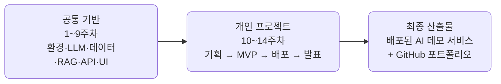

## AI 서비스 엔지니어링 Track A \{#overview}

공통 선행 VOD(ai_service_engineering)의 확장 과정입니다. 공통 기술 스택을
단계적으로 익힌 뒤, **개인별 배포 가능한 오픈소스 기반 AI 데모 서비스**를
완성하는 14주 실습 트랙입니다.

- **대상**: AI 서비스 경험이 적거나 단계적 실습이 필요한 참가자
- **운영 방식**: 공통 기술 스택을 먼저 익힌 뒤(1\~9주차) 후반부 개인 프로젝트 수행(10\~14주차)
- **과정 지원**: 과정 중간에도 Discord를 통한 프로젝트 문의·멘토링 진행 가능
- **공통 목표**: 개인별 배포 가능한 오픈소스 기반 AI 데모 서비스 완성 + GitHub 포트폴리오

## 과정 구조 \{#structure}

전반부에 모두가 같은 기술 스택을 실습으로 정렬하고, 후반부에 각자 선택한
트랙으로 개인 프로젝트를 완주합니다.

## 주차별 운영안 \{#weekly-plan}

### 1\~9주: 공통 역량 구간 \{#weeks-1-9}

| 주차 | 주제 | 세션 실습 포커스 | 산출물 |
| --- | --- | --- | --- |
| 1 | AI 서비스 전주기 이해 | 과정 조망, 엔지니어링 사다리, 프로젝트 트랙 소개, 개인 repo 개설 | 학습 목표 + 개인 repo |
| 2 | Python AI 개발환경 | devcontainer 구동, uv/pip, GitHub 워크플로, Codex/Claude 활용 세팅 | 동작하는 개발 환경 |
| 3 | [[llm\|LLM]] API와 프롬프트 | LiteLLM 멀티 프로바이더 호출, 프롬프트 패턴, structured output(instructor) | LLM 호출 실습 코드 |
| 4 | 데이터 수집·정제와 [[rag\|RAG]] 검색 | 30만 건 정제, PostgreSQL 검색, [[embedding\|임베딩]] [[vector-db\|벡터 인덱스]]와 질의응답 | 정제 데이터셋 + RAG 검색 서비스 |
| 5 | API 해부와 [[tool-calling\|tool calling]] | LLM API의 바닥, [[litellm\|LiteLLM]] 통합 레이어, 도구 스키마·검증 (예제 31종) | 도구를 든 [[agent\|에이전트]] (v0.2) |
| 6 | 에이전트 루프와 [[harness\|하네스]] | [[react\|ReAct]]와 고급 루프, [[prompt-injection\|인젝션]] 방어·[[budget-guard\|budget guard]], [[mcp\|MCP]] (예제 24종) | 완성된 에이전트 (v1.0) |
| 7 | 멀티 에이전트 패턴 | [[supervisor\|supervisor]]·[[handoff\|handoff]] 구조, 병렬 실행, [[langgraph\|LangGraph]] 맛보기 (시연 3종 해부) | 멀티 에이전트 시연 저장소 3종 |
| 8 | FastAPI 서비스화 | AI 기능 API화, 입력 검증·에러 처리·스트리밍 | AI API 서버 |
| 9 | 자유 UI 구현 | Streamlit / Gradio / Next.js / Swagger UI 선택 (라이브 브리핑 제공) | 웹 데모 초안 |

### 10\~14주: 개인 프로젝트 구간 \{#weeks-10-14}

| 주차 | 주제 | 세션 포커스 | 산출물 |
| --- | --- | --- | --- |
| 10 | 개인 프로젝트 기획 | 문제 정의, MVP 범위, 데이터·스택 선정, **기획 리뷰 통과** | 프로젝트 기획서 |
| 11 | 프로젝트 MVP 개발 | 핵심 AI 기능 + API/UI 연결, **배포 파이프라인 사전 개통** | 동작 MVP + 1차 배포 |
| 12 | 배포·평가·개선 | 무료 클라우드 배포 안정화, 테스트셋·품질 개선 로그 | 데모 URL + 평가 로그 |
| 13 | 문서화·OSS 정리 | README·아키텍처·라이선스, 오픈소스 기여 시도 | GitHub 포트폴리오 + 기여 기록 |
| 14 | 최종 발표 | 데모·회고·직무 전환 포인트, AI 도구 보조 구분 설명 | 최종 산출물 |

주차별 강의 자료는 [강의](/course/)에서, 발표 자료는 [슬라이드](/slides/)에서
볼 수 있습니다.

## 프로젝트 트랙 \{#tracks}

10주차부터 아래 다섯 트랙 중 하나를 선택하거나 자유 주제로 개인 프로젝트를
진행합니다. 트랙은 과정 중 Discord 멘토링으로 가늠해 두었다가 10주차 기획에서
확정합니다.

| 트랙 | 예시 프로젝트 | 주요 오픈소스 스택 |
| --- | --- | --- |
| 문서 기반 RAG | 정책/기술문서 Q&A, FAQ 챗봇 | LlamaIndex, LangChain, Chroma, Qdrant |
| 업무 자동화 | 회의록 요약, 이슈 분류, 보고서 초안 | LangGraph, n8n, FastAPI |
| 데이터 분석 | CSV 자연어 질의, 리포트 자동 생성 | pandas, DuckDB, Plotly, LLM API |
| 추천/분류 | 채용공고 매칭, 콘텐츠 추천 | scikit-learn, sentence-transformers |
| 개발자 도구 | 코드리뷰 보조, README 생성 | GitHub API, FastAPI, LLM |

## 📌 주요 링크 및 안내 \{#links}

### 프로젝트 관련 링크 \{#project-links}

| 구분 | 링크 | 비고 |
| --- | --- | --- |
| Awesome AI Stack | [바로가기](https://codecomposestudio.github.io/awesome-ai-stack/) | AI 스택에 관련된 모음 |

### 참고자료 \{#references}

LLM API 키 발급·세팅에 쓰는 프로바이더별 콘솔입니다. 무료 티어부터 시작하세요.

| 구분 | 링크 | 비고 |
| --- | --- | --- |
| Google AI Studio | [aistudio.google.com/api-keys](https://aistudio.google.com/api-keys) | Gemini API 호출 (AI 서비스) |
| Claude Platform Dashboard | [platform.claude.com/dashboard](https://platform.claude.com/dashboard) | Claude API 호출 (AI 서비스) |
| OpenAI API Keys | [platform.openai.com/api-keys](https://platform.openai.com/api-keys) | OpenAI API 호출 (AI 서비스) |
| Ollama API 세팅 | [ollama.com/settings/keys](https://ollama.com/settings/keys) | Ollama API 키 세팅 (AI 서비스) |
| Groq API Keys | [console.groq.com/keys](https://console.groq.com/keys) | Groq API 호출 |