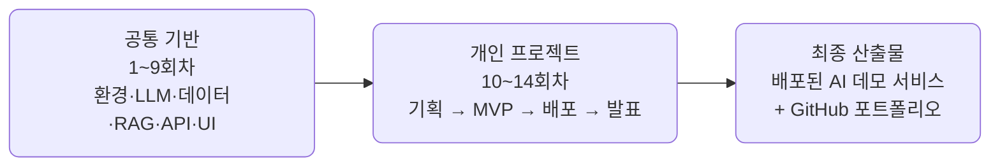

## AI 서비스 엔지니어링 — Track A \{#overview}

공통 선행 VOD(ai_service_engineering)의 확장 과정입니다. 공통 기술 스택을
단계적으로 익힌 뒤, **개인별 배포 가능한 오픈소스 기반 AI 데모 서비스**를
완성하는 14회차 실습 트랙입니다.

- **대상** — AI 서비스 경험이 적거나 단계적 실습이 필요한 참가자
- **운영 방식** — 공통 기술 스택을 먼저 익힌 뒤(1\~9회차) 후반부 개인 프로젝트 수행(10\~14회차)
- **공통 목표** — 개인별 배포 가능한 오픈소스 기반 AI 데모 서비스 완성 + GitHub 포트폴리오

## 과정 구조 \{#structure}

전반부에 모두가 같은 기술 스택을 실습으로 정렬하고, 후반부에 각자 선택한
트랙으로 개인 프로젝트를 완주합니다.

## 커리큘럼 \{#curriculum}

| 회차 | 주제 |
| --- | --- |
| 1 | AI 서비스 전주기 이해 |
| 2 | Python AI 개발환경 |
| 3 | [[llm\|LLM]] API와 프롬프트 |
| 4 | 데이터 수집·정제 |
| 5 | [[embedding\|임베딩]]·[[vector-db\|벡터DB]] |
| 6 | [[rag\|RAG]] 기본 구현 |
| 7 | 자동화·분석·추천 패턴 |
| 8 | FastAPI 서비스화 |
| 9 | 자유 UI 구현 |
| 10 | 개인 프로젝트 기획 |
| 11 | 프로젝트 MVP 개발 |
| 12 | 배포·평가·개선 |
| 13 | 문서화·OSS 정리 |
| 14 | 최종 발표 |

회차별 강의 자료는 [강의](/course/)에서, 발표 자료는 [슬라이드](/slides/)에서
볼 수 있습니다.

## 프로젝트 트랙 \{#tracks}

10회차부터 아래 다섯 트랙 중 하나를 선택하거나 자유 주제로 개인 프로젝트를
진행합니다. 7회차의 트랙별 미니 실습에서 각 트랙을 미리 체험하고 방향을
확정합니다.

| 트랙 | 예시 프로젝트 | 주요 오픈소스 스택 |
| --- | --- | --- |
| 문서 기반 RAG | 정책/기술문서 Q&A, FAQ 챗봇 | LlamaIndex, LangChain, Chroma, Qdrant |
| 업무 자동화 | 회의록 요약, 이슈 분류, 보고서 초안 | LangGraph, n8n, FastAPI |
| 데이터 분석 | CSV 자연어 질의, 리포트 자동 생성 | pandas, DuckDB, Plotly, LLM API |
| 추천/분류 | 채용공고 매칭, 콘텐츠 추천 | scikit-learn, sentence-transformers |
| 개발자 도구 | 코드리뷰 보조, README 생성 | GitHub API, FastAPI, LLM |