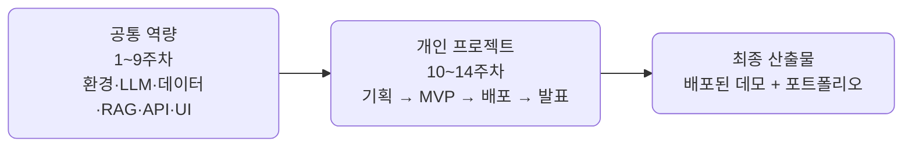

import Slide from 'stack-site-builder/components/Slide.astro';

<Slide class="cover">

# AI 서비스 엔지니어링 — Track A

1주차 · AI 서비스 전주기 이해

*CodeCompose · 2026-07-24*

</Slide>

<Slide class="center">

## 이 과정에서 만드는 것

**배포 가능한 오픈소스 기반 AI 데모 서비스** — 한 사람당 하나씩

</Slide>

<Slide>

## 14주 로드맵
::sub[전반부는 함께, 후반부는 각자]

</Slide>

<Slide>

## 오늘 다루는 것

- **과정 조망** — AI 서비스 전주기와 14주 로드맵
- **엔지니어링 사다리** — 스크립트에서 서비스까지
- **프로젝트 트랙 소개** — 다섯 트랙 + 자유 주제
- **개인 repo 개설** — 저장소 생성과 첫 커밋

</Slide>

<Slide class="center">

## 다음 주차

Python AI 개발환경 — devcontainer, uv/pip, GitHub 워크플로, Codex/Claude 세팅

**과제: 개인 학습 목표 작성해 오기**

</Slide>
