import Slide from 'stack-site-builder/components/Slide.astro';

<Slide class="cover">

# AI 서비스 엔지니어링 — Track A

1주차 · AI 서비스 전주기 이해와 첫 에이전트

*CodeCompose · 2026-07-24*

</Slide>

<Slide>

## 세션 목표
::sub[오늘 세션이 끝나면 얻게 되는 것]

- AI 서비스가 **5개 레이어** 위에서 어떻게 실행되는지에 대한 지도
- **엔지니어링 사다리**(프롬프트 → 컨텍스트 → 하네스)가 14주의 순서인 이유
- "이 시대에 에이전트를 만드는 방식" — 지시·검증·수정 사이클을 직접 목격
- 5개 프로젝트 트랙이 "무엇을 갈아끼우는가"의 차이라는 감각
- 개인 GitHub repo (학습 목표 작성 완료)

</Slide>

<Slide class="center">

## 1주차 시연의 성격

아직 VOD S1도 보기 전 —
목적은 코드 이해가 아니라 **"14주 뒤 내가 만들 것의 축소판"** 확인

코드 한 줄 한 줄이 아니라 **구조와 사이클**이 남으면 성공

</Slide>

<Slide>

## 오늘의 흐름
::sub[멘토 시연 중심 — 직접 손을 움직이는 건 개인 repo 실습뿐]

1. 오리엔테이션
2. 전주기 조망
3. 엔지니어링 사다리
4. 라이브 빌드 — 주문 에이전트
5. 코드 구조 분석 — v0.1과 v0.2
6. 프로젝트 트랙 소개
7. 개인 repo 개설 실습
8. 마무리

</Slide>

<Slide class="center">

## Part 1 — 오리엔테이션

과정 목표 · 14주 구조 · 운영 방식 · 운영 안내

</Slide>

<Slide class="center">

## 과정 목표

**개인별 배포 가능한 오픈소스 기반 AI 데모 서비스 1개 완성**

공개 데모 URL · GitHub 포트폴리오 (README·아키텍처·라이선스) · 최종 발표

</Slide>

<Slide>

## 14주 구조
::sub[1\~9주 공통 역량 → 10\~14주 개인 프로젝트]

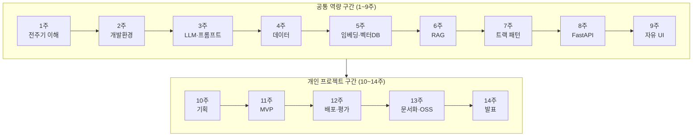

**매주 템플릿 실습이 제공됩니다** — 부품으로 재조립해도, 별개로 진행해도 됩니다.
템플릿은 출발점이지 제약이 아닙니다

</Slide>

<Slide>

## 운영 방식
::sub[VOD = 지식 전달 · 라이브 = 만드는 과정과 판단을 보는 시간]

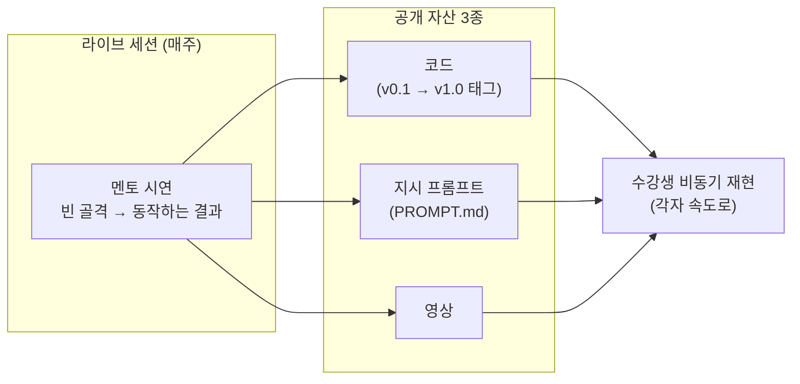

라이브 세션 = 멘토 시연 + 코칭 — **코드 따라 쓰기 없음**

</Slide>

<Slide>

## 개인 프로젝트는 1주차부터 시작됩니다
::sub[백그라운드 과제 — "무엇을 만들지" 계속 생각하기]

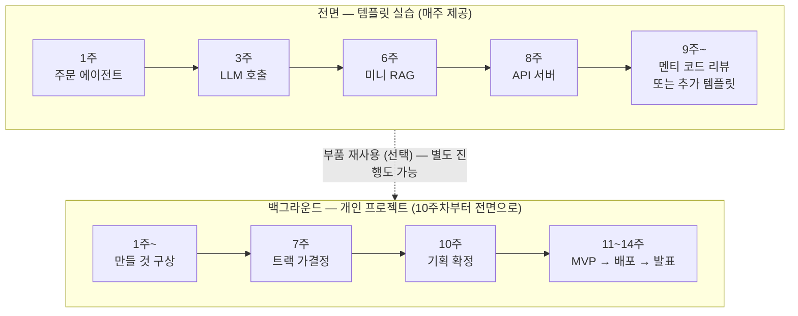

매주 시연을 보며 "내 프로젝트라면 이 부품을 어떻게 쓸까" —
트랙 가결정(7주차) → 기획 확정(10주차)은 체크포인트일 뿐,
두 레인은 10주차에 자리를 바꿉니다

</Slide>

<Slide>

## 질문은 디스코드로, 상시

- 시연 재현 중 막히는 지점
- 개인 프로젝트 구상·트랙 선택 논의
- 환경 문제 (devcontainer, 키 발급 등)

세션까지 기다릴 필요 없습니다

</Slide>

<Slide>

## 9주차부터 시연의 성격이 바뀔 수 있습니다

- 멘티가 동의하면 — **멘티 코드 리뷰** 형식으로 전환, 실제 프로젝트 코드를 함께 봅니다
- 동의하지 않으면 — 별도의 **추가 템플릿 에이전트**로 시연 계속
- 어느 쪽이든 멘티의 선택 — 공개는 권장 사항이지 요건이 아닙니다

AI 도구 활용 원칙: **"직접 판단한 부분과 AI가 보조한 부분을 구분한다"** —
오늘 멘토가 그 구분을 시연으로 먼저 보여드립니다

</Slide>

<Slide>

## 운영 안내

- **요일·시간** — 목요일 저녁 / 토요일 오후 2시 중 조율, 오늘 의견 수렴
  모든 세션은 녹화 제공 — 실시간 참석이 어려워도 지장 없습니다
- **저장소** — 조직은 멘토 코드 공유용, 수강생 레포는 **개인 계정 권장**
  개인 저장소 코칭 가능 · 프로젝트 제출물은 오픈소스로 (일부 분리 또는 별도 제작 권장)
- **오프라인 모임** — 월 1회, 강의 요일과 겹치지 않게 · 참석 자유

</Slide>

<Slide class="center">

## Part 2 — 전주기 조망

AI 서비스는 어떤 층 위에서 도는가

</Slide>

<Slide>

## 각 레이어의 책임

| 레이어 | 책임 | 대표 예시 |
| --- | --- | --- |
| Agents | 제어 루프 — 판단·도구 호출 | self managed / vendor managed |
| AI Platform | 모델 접근·라우팅·인증·관측 | Vertex AI, AI Studio, MCP 서버 |
| Models | 실제 추론 | Gemini, Claude, GPT, Llama |
| Data | 모델이 볼 재료 공급 | BigQuery, S3, Drive, Slack |
| AI Infrastructure | 연산이 실제로 도는 곳 | GPU/CPU, GKE, Compute |

</Slide>

<Slide>

## AI 서비스 스택 — 5레이어

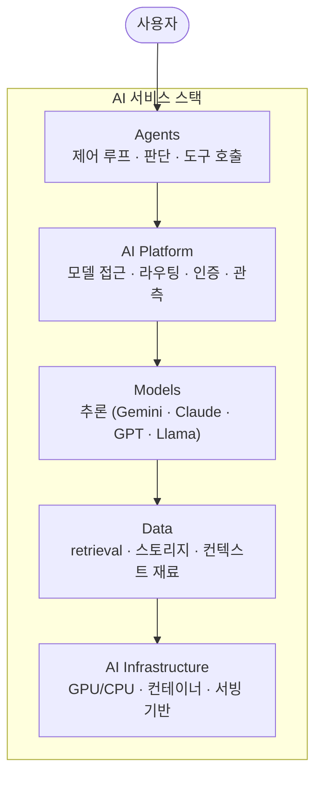

</Slide>

<Slide>

## 요청 하나가 스택을 타고 내려갑니다
::sub["참치김밥 두 줄 주세요" 한 문장의 여정]

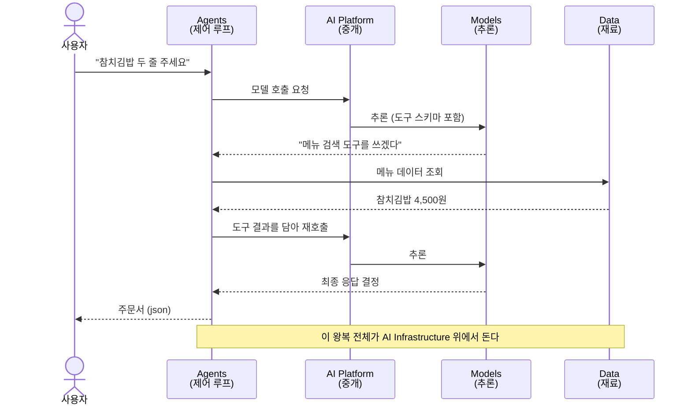

</Slide>

<Slide class="center">

## 에이전트는 모델이 아니라
## 이 스택 전체를 조립한 시스템입니다

모델은 한 층일 뿐 —
우리가 배우는 것은 나머지 층을 조립하는 기술

</Slide>

<Slide>

## 우리 과정의 스택
::sub[같은 그림을 오픈소스로 짓습니다]

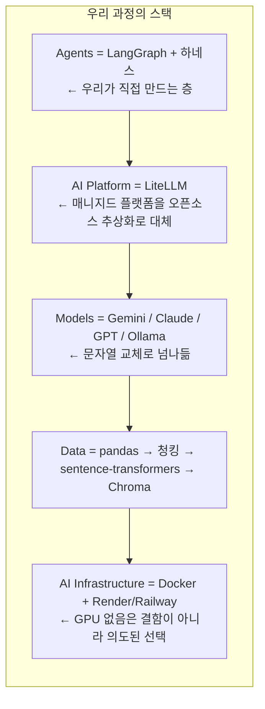

</Slide>

<Slide>

## 스택 읽기

- **Agents가 본체** — 직접 설계·구현하는 층, 나머지는 오픈소스 부품 조립
- **LiteLLM = Platform** — "여러 모델을 한 인터페이스로"를 라이브러리 하나로
- **Models는 갈아끼우는 소모품** — 프로바이더 독립이 설계 원칙
- **GPU 없음의 의미** — 추론은 API로, 임베딩은 CPU로
  "빌리는 것"과 "직접 드는 것"을 구분하는 판단이 곧 엔지니어링

</Slide>

<Slide>

## 주차별 좌표
::sub[매주 브리핑 첫 슬라이드에서 "오늘은 이 칸"]

| 주차 | 채우는 칸 |
| --- | --- |
| 2주 | Infrastructure (devcontainer, 개발 환경) |
| 3주 | Platform + Models (LiteLLM, 프롬프트) |
| 4\~6주 | Data (수집·정제 → 임베딩 → RAG) |
| 7주 | Agents (에이전트 패턴) |
| 8\~9주 | Infrastructure 위쪽 (API·UI 서비스화) |
| 10\~14주 | 전 층을 내 프로젝트로 |

</Slide>

<Slide class="center">

## Part 3 — 엔지니어링 사다리

전주기 조망이 **구성 요소의 축**이라면, 사다리는 **신뢰성의 축** —
두 축은 직교합니다

같은 스택 위에서, 얼마나 신뢰성 있게 만드느냐

</Slide>

<Slide>

## 3단 사다리
::sub[프롬프트는 지시, 컨텍스트는 재료, 하네스는 기계]

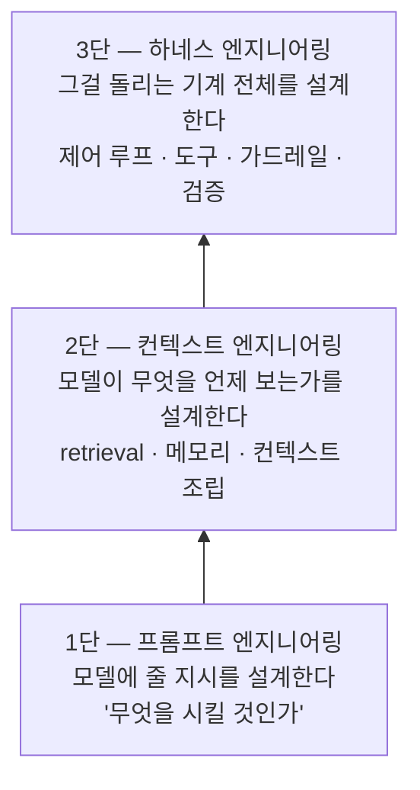

</Slide>

<Slide>

## 단이 쌓일수록

- **1단만 있으면** — 말은 잘 듣지만 아는 게 없는 모델 · 지어내기 시작합니다
- **2단이 더해지면** — 맞는 재료를 보고 답합니다 · 그러나 매번 사람이 차려줘야 합니다
- **3단이 더해지면** — 스스로 재료를 찾고, 검증하고, 실패를 복구합니다 · 이제 "시스템"입니다

</Slide>

<Slide>

## 사다리가 곧 14주의 순서

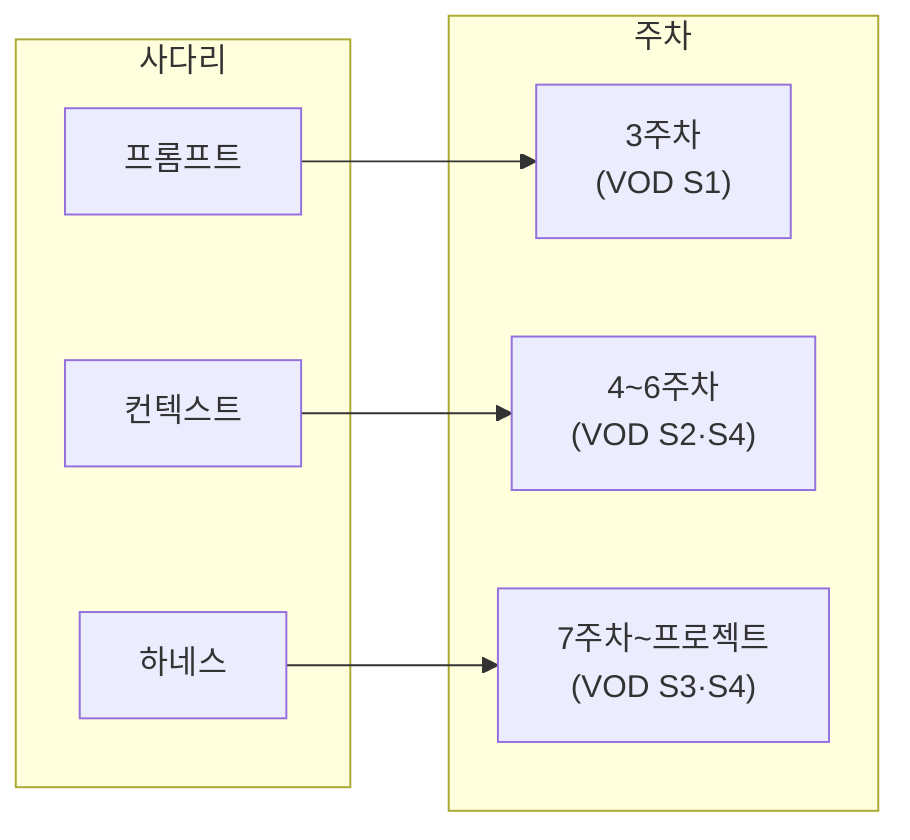

"이 과정은 모델을 만드는 법이 아니라,
모델 위에 이 사다리를 쌓는 법을 배웁니다"

</Slide>

<Slide class="center">

## Part 4 — 라이브 빌드

분식집 "분식왕"의 주문 접수 AI 점원

</Slide>

<Slide>

## 오늘 보여주는 것은 코드가 아니라 사이클

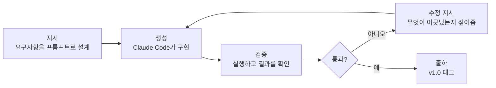

사람의 일 = **요구사항 설계(지시)와 검증(판단)**

</Slide>

<Slide>

## 왜 분식집인가

- 도메인 설명 0초 — 전 국민이 아는 주문
- 데이터가 레포에 그대로 — Gemini 키 하나로 끝
- 도구를 골라 쓰는 루프가 눈에 보임 — 메뉴 조회 → 재고 체크 → 합계 계산
- 결과가 주문서 json — LLM이 채팅이 아니라 **시스템 부품**이 됩니다
- 합계 검증은 암산으로 — "돈까스 되나요?" 같은 실패 케이스도 재밌습니다

</Slide>

<Slide>

## 완성 시스템의 구조 (v1.0 목표)

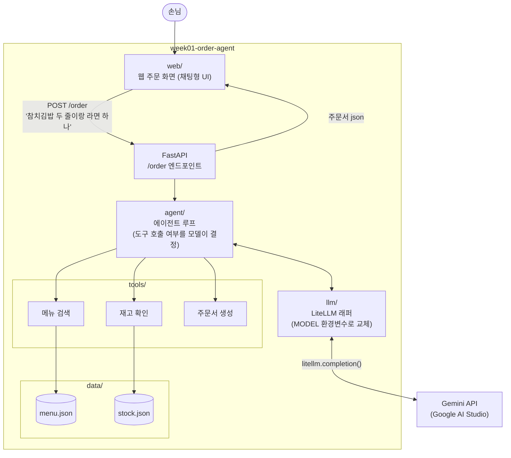

</Slide>

<Slide>

## 오늘 시연 안에 5레이어가 전부 등장합니다

- FastAPI (+ Docker는 추후) = **Infrastructure**
- agent/ = **Agents** — 오늘 만드는 것의 핵심
- llm/ (LiteLLM) = **Platform**
- Gemini = **Models**
- data/ + tools/ = **Data**

</Slide>

<Slide>

## 에이전트 루프
::sub[도구를 부를지, 몇 번 부를지, 언제 멈출지 — 코드가 아니라 모델이 결정합니다]

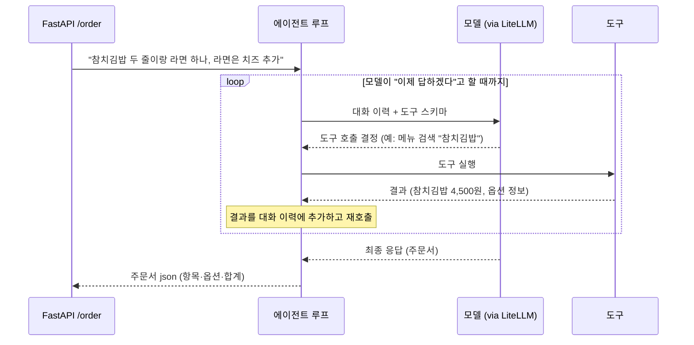

이 while 루프가 **하네스의 씨앗** — 가드레일·검증·메모리가 붙으면 하네스 엔지니어링

</Slide>

<Slide>

## v0.1에서 v1.0으로

- **v0.1 (시작점)** — FastAPI 목 + 웹 주문 화면 + 메뉴·재고 데이터
  `{"message": "죄송합니다, 아직 점원이 없어요"}` — 거짓말하는 API
- **라이브** — Claude Code가 agent/ · llm/ · tools/ 구현 → 리뷰·실행·수정
- **v1.0 (완성)** — 동작하는 주문 에이전트 + PROMPT.md 원문
- `git diff v0.1 v1.0` 하나로 시연 전체를 볼 수 있습니다

저장소: `2026-ai-service-engineering-a/week01-order-agent`
(template repository · **v0.1 태그 발행됨**)

</Slide>

<Slide>

## 저장소 구조 (v1.0)
::sub[화살표 부분이 라이브에서 생성됩니다 — 나머지는 v0.1 그대로]

```plaintext
week01-order-agent
├── app/
│   └── main.py          # /order가 에이전트 루프 호출
├── agent/               # 에이전트 루프          ← Claude Code 구현
├── llm/                 # LiteLLM 래퍼           ← Claude Code 구현
├── tools/               # 도구 3종               ← Claude Code 구현
├── web/
│   └── index.html       # 웹 주문 화면 (채팅형 UI)
├── data/
│   ├── menu.json        # 메뉴 22개 (이름·가격·옵션)
│   └── stock.json       # 재고 수량
├── Dockerfile · compose.yml · compose.dev.yml
├── PROMPT.md            # 시연에서 사용한 지시 프롬프트 원문
└── README.md            # 실행 방법 + 영상 링크
```

</Slide>

<Slide>

## 기술 원칙
::sub[시연 코드에 그대로 반영됩니다]

- 모든 LLM 호출은 **LiteLLM 경유** — 프로바이더 SDK 직접 호출 금지
- 프로바이더는 **Gemini** (Google AI Studio 무료 티어)
- 모델 문자열은 **환경변수 `MODEL`** — 이 문자열만 바꾸면 Claude도 로컬 모델도
- **모듈 분리** — llm / tools / agent, 단일 파일 금지
- **FastAPI `/order`** 엔드포인트로 노출
- 도구 3종 — 메뉴 검색 · 재고 확인 · 주문서 생성

</Slide>

<Slide>

## 지시 프롬프트
::sub[이 프롬프트 자체가 교재 — 요구사항을 정의하는 능력이 곧 설계 능력]

```plaintext
분식집 주문 접수 에이전트를 만들어줘.

- 모든 LLM 호출은 LiteLLM 경유. 프로바이더 SDK 직접 호출 금지
- 모델은 환경변수 MODEL로 교체 가능하게
- 도구 3개: 메뉴 검색, 재고 확인, 주문서 생성
- 에이전트 루프: 모델이 도구 호출 여부를 결정하고, 필요한 만큼 반복
- 주문서는 json으로: 항목 목록(메뉴·수량·옵션·단가), 합계 금액
- 메뉴에 없는 항목이나 재고 부족은 정중히 거절하고 대안 제시
- 기존 FastAPI의 /order 엔드포인트에 연결
- 모듈 분리: llm / tools / agent
```

</Slide>

<Slide>

## 프롬프트 줄별 의도

- **"LiteLLM 경유"** — 아키텍처 제약을 요구사항 문장으로 박습니다
  안 쓰면 가장 흔한 방식(SDK 직접 호출)으로 갑니다
- **"환경변수 MODEL"** — 프로바이더 독립을 코드 구조로 강제합니다
- **"정중히 거절하고 대안 제시"** — 실패 케이스를 미리 넣습니다 · 가드레일의 씨앗
- **"모듈 분리"** — 지시하지 않으면 한 파일로 나옵니다
  **구조는 시키는 사람의 책임입니다**

</Slide>

<Slide>

## 시연 진행

0. **환경 띄우기** — `docker compose -f compose.dev.yml up --build`
   소스가 마운트되어 있어 생성되는 파일이 즉시 서버에 반영됩니다
1. **v0.1 투어** — 웹 화면(localhost:8000)에서 주문 → "지금 이 API는 거짓말을 합니다"
2. **지시 프롬프트 작성** — 줄마다 의도를 설명하며 타이핑
3. **Claude Code 실행 + 생성 관찰** — while 루프(하네스층), litellm.completion(Platform층) 내레이션
4. **리뷰 + 실행 + 수정** — 정상 주문은 합계 암산으로, "돈까스 되나요?"는 거절·대안으로 검증
5. **마무리** — v1.0 태그 푸시, 공개 자산 3종 안내

</Slide>

<Slide>

## 라이브 시연의 리스크
::sub[라이브 LLM 코딩은 비결정적입니다 — 그래서 준비합니다]

- 같은 프롬프트로 **사전 리허설** — 소요 시간과 흔한 이탈 지점 파악
- **체크포인트 브랜치** — 심하게 샛길로 빠지면 "리허설 때는 이렇게 나왔다"로 전환
- 가벼운 실패는 피하지 않습니다 — **복구 과정을 보여주는 것도 콘텐츠**
- Gemini 무료 티어 rate limit — 쿼터 확보, 필요 시 보조 키 준비

</Slide>

<Slide>

## 수강생 여정
::sub[재현은 2주차 환경 구축 후 — "동작하는 개발 환경"의 확인 과제]

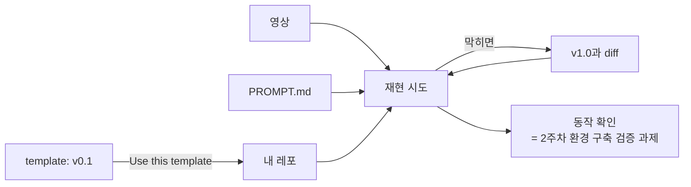

</Slide>

<Slide class="center">

## Part 5 — 코드 구조 분석

v0.1(시작점)과 v0.2(참고 구현) — 두 태그의 diff가 곧 오늘 만든 것

</Slide>

<Slide>

## v0.1 읽기 — 거짓말하는 API

- `app/main.py` — FastAPI 하나가 전부: `/order` 고정 응답, `/settings` ⚙️ 설정
- `web/index.html` — 채팅형 화면, 입력 한 건마다 `{"message"}` 하나를 POST
  **서버에는 세션·대화 이력이 없습니다**
- `data/` — 메뉴 22개 + 재고, 도구가 읽을 재료
- `pyproject.toml` — litellm·fastapi 미리 선언, 설치 대기 없음
- **없는 것** — agent/ · llm/ · tools/, 라이브에서 생성될 자리

</Slide>

<Slide>

## v0.2 읽기 — 에이전트가 붙은 구조
::sub[요구사항이 코드 구조로 어떻게 번역됐는가]

- `llm/client.py` — `complete()` 하나 · MODEL은 **호출 시점에** 읽음 (재시작 없이 교체)
- `tools/` — 도구마다 **스키마 + 순수 구현** 쌍 · 실패는 예외 대신 `{"error"}` 반환
  → 에러를 모델에게 보여 주고 스스로 고치게
- `tools/order.py` — **단가·합계는 코드가 계산** · LLM은 항목만 고름
- `agent/loop.py` — 시스템 프롬프트(지어내기 금지) + `MAX_TURNS = 8` 상한

루프 · 상한 · 역할 분리 — 하네스의 씨앗

</Slide>

<Slide>

## v0.2 모듈 구조

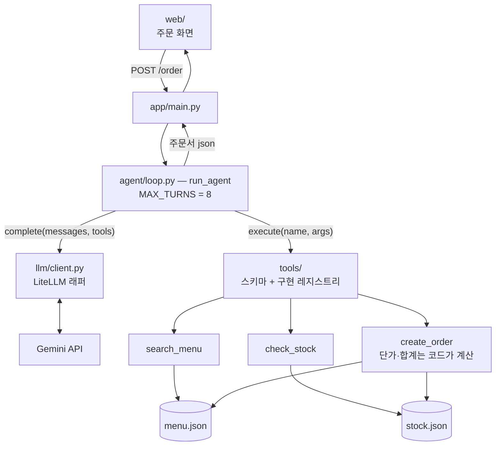

</Slide>

<Slide>

## v0.2의 한계 — 대화가 이어지지 않습니다

```python
def run_agent(user_message: str) -> dict:
    messages = [
        {"role": "system", "content": SYSTEM_PROMPT},
        {"role": "user", "content": user_message},  # 매 요청 새 대화
    ]
```

- 루프 안의 대화 이력은 **한 요청 안의 도구 왕복용**일 뿐
- "참치김밥 두 줄" → "치즈도 추가해 주세요" — 무엇에 추가하는지 모릅니다
- 주문은 **한 문장에** 다 담아야 합니다
- 결함이 아니라 의도된 범위 — 대화 메모리는 **컨텍스트 엔지니어링(사다리 2단)**,
  이후 주차의 주제

</Slide>

<Slide>

## 요청마다 새 대화
::sub[주문을 한 문장에 담아야 하는 이유]

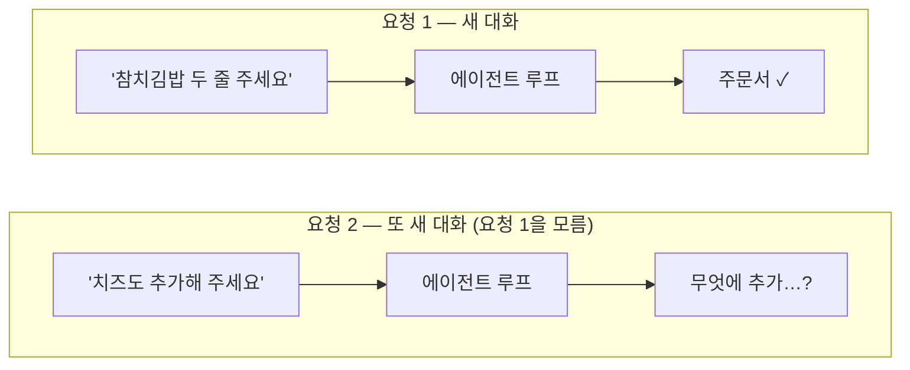

</Slide>

<Slide class="center">

## Part 6 — 프로젝트 트랙

같은 구조에서 무엇을 갈아끼우는가

</Slide>

<Slide>

## 갈아끼우기

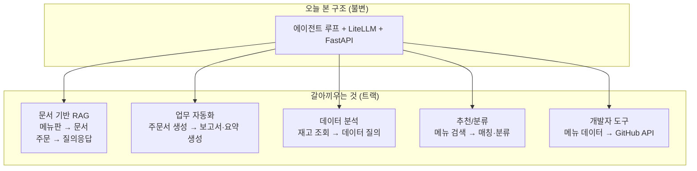

</Slide>

<Slide>

## 5개 트랙 + 자유 주제

| 트랙 | 갈아끼우는 것 | 예시 프로젝트 |
| --- | --- | --- |
| 문서 기반 RAG | 메뉴판 → 문서, 주문 → 질의응답 | 정책/기술문서 Q&A |
| 업무 자동화 | 주문서 생성 → 보고서·요약 | 회의록 요약, 이슈 분류 |
| 데이터 분석 | 재고 조회 → 데이터 질의 | CSV 자연어 질의 |
| 추천/분류 | 메뉴 검색 → 매칭·분류 | 채용공고 매칭 |
| 개발자 도구 | 메뉴 데이터 → GitHub API | 코드리뷰 보조 |

7주차 가결정 · 10주차 확정 — 지금은 관심 방향 가늠만.
오늘부터 매주, "내 프로젝트라면 무엇을 갈아끼울지" 생각하며 보세요

</Slide>

<Slide class="center">

## Part 7 — 개인 repo 개설

오늘 유일하게 직접 손을 움직이는 시간

</Slide>

<Slide>

## 할 일

1. GitHub 계정 준비 — 기존 계정 활용 권장
2. 개인 실습·프로젝트용 **public 레포** 생성 — 개인 계정 권장 (포트폴리오로 가져가는 것이므로)
3. README에 **개인 학습 목표 3줄** 작성

예시 프레임:

- 현재 상태
- 14주 뒤 만들고 싶은 것
- 관심 트랙 후보

막히면 Discord로 요청 — 멘토가 계정 문제·레포 설정을 지원합니다.
환경(devcontainer)은 오늘 없어도 됩니다 — 환경 구축은 2주차 주제

</Slide>

<Slide class="center">

## 다음 주차

Python AI 개발환경 — devcontainer · uv/pip · GitHub 워크플로

**VOD 사전 시청: S1 환경 셋업**

과제: 개인 repo 완성 (README 학습 목표 포함)

</Slide>

<Slide class="center">

## 오늘 본 것은 코드가 아니라 사이클입니다

지시하고, 검증하고, 고칩니다 —
14주 동안 배우는 것은 이 사이클을 **출하 가능한 품질**로 돌리는 법

코드·PROMPT.md·영상: `2026-ai-service-engineering-a` 조직 · 질문은 디스코드

</Slide>
