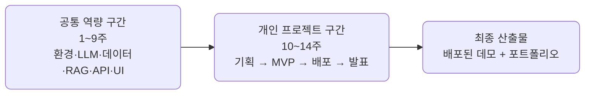
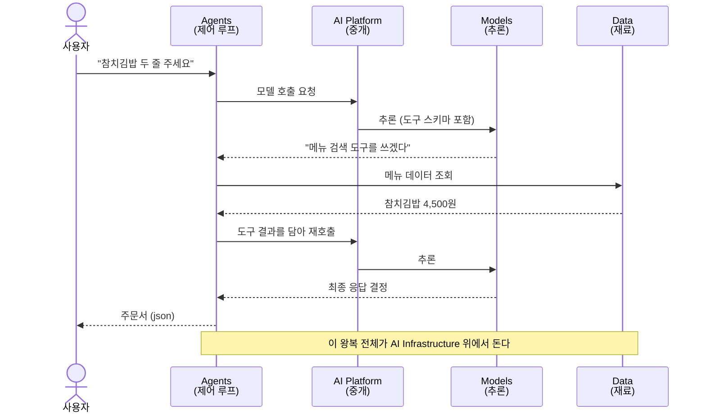
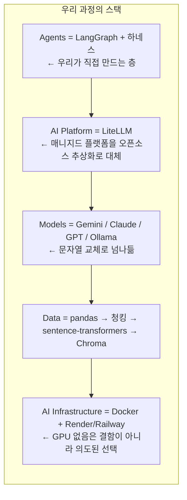
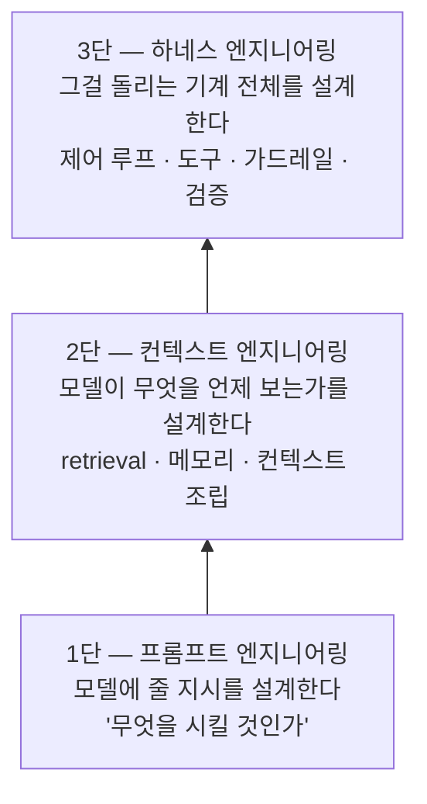
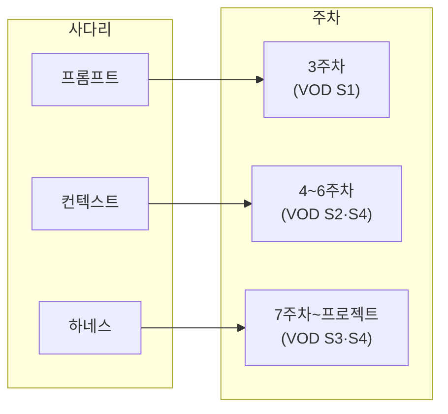
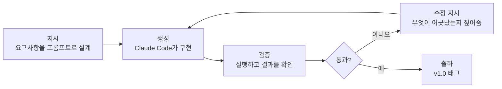
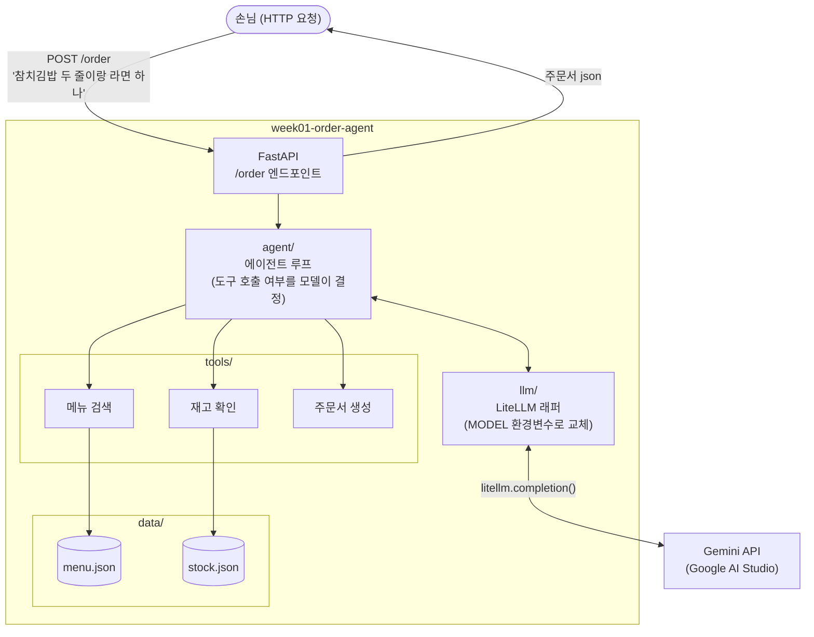
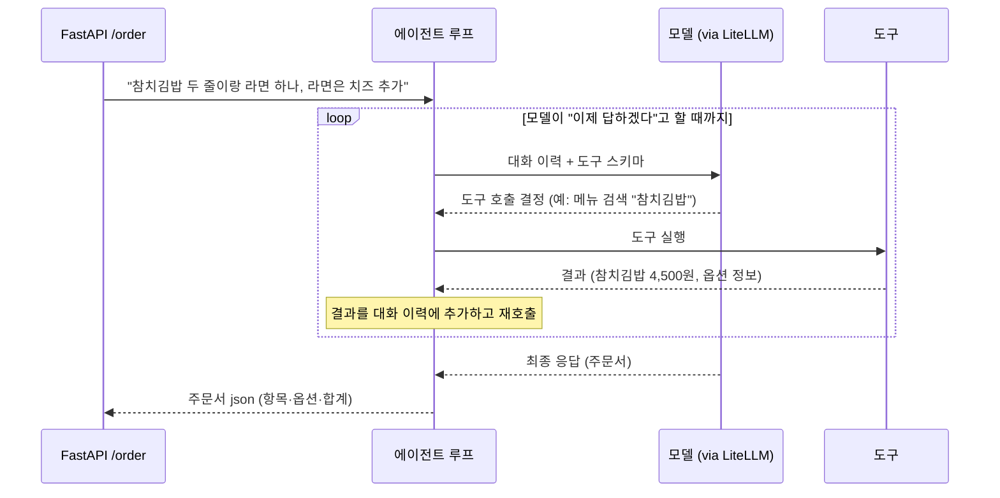
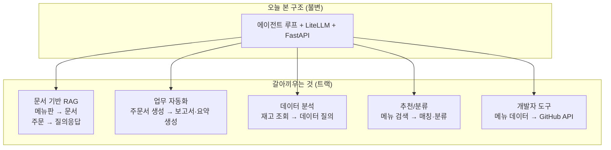

import Slide from 'stack-site-builder/components/Slide.astro';

<Slide class="cover">

# AI 서비스 엔지니어링 — Track A

1주차 · AI 서비스 전주기 이해와 첫 에이전트

*CodeCompose · 2026-07-24*

</Slide>

<Slide class="center">

## 이 과정에서 만드는 것

**배포 가능한 오픈소스 기반 AI 데모 서비스** — 한 사람당 하나씩

공개 데모 URL · GitHub 포트폴리오 · 최종 발표

</Slide>

<Slide>

## 오늘의 흐름
::sub[멘토 시연 중심 — 직접 손을 움직이는 건 개인 repo 실습뿐]

1. 오리엔테이션
2. 전주기 조망
3. 엔지니어링 사다리
4. 라이브 빌드 — 주문 에이전트
5. 프로젝트 트랙 소개
6. 개인 repo 개설 실습
7. 마무리

</Slide>

<Slide class="center">

## Part 1 — 오리엔테이션

과정 목표 · 14주 구조 · 운영 방식

</Slide>

<Slide>

## 14주 로드맵
::sub[전반부는 함께, 후반부는 각자]



**매주 템플릿 실습이 제공됩니다** — 그대로 개인 프로젝트의 부품으로 재조립해도
되고, 별개로 진행해도 됩니다. 템플릿은 출발점이지 제약이 아닙니다

</Slide>

<Slide>

## 운영 방식
::sub[VOD = 지식 전달 · 라이브 = 만드는 과정과 판단을 보는 시간]

- 라이브 세션 = 멘토 시연 + 코칭 — **코드 따라 쓰기 없음**
- 매주 공개 자산 3종
  - 코드 (v0.1 → v1.0 태그)
  - 지시 프롬프트 (PROMPT.md)
  - 영상
- 수강생은 각자 속도로 재현

</Slide>

<Slide>

## 개인 프로젝트는 1주차부터 시작됩니다
::sub[백그라운드 과제 — "무엇을 만들지" 계속 생각하기]

- 매주 시연을 보며 "내 프로젝트라면 이 부품을 어떻게 쓸까"
- 7주차 트랙 가결정 → 10주차 기획 확정은 체크포인트일 뿐
- 10주차에 두 레인이 자리를 바꿉니다 — 개인 프로젝트가 전면으로

</Slide>

<Slide>

## 질문은 디스코드로, 상시

- 시연 재현 중 막히는 지점
- 개인 프로젝트 구상·트랙 선택 논의
- 환경 문제 (devcontainer, 키 발급 등)

세션까지 기다릴 필요 없습니다

</Slide>

<Slide>

## 운영 안내

- **요일·시간** — 목요일 저녁 / 토요일 오후 2시 중 조율, 오늘 의견 수렴
  모든 세션은 녹화 제공 — 실시간 참석이 어려워도 지장 없습니다
- **저장소** — 조직은 멘토 코드 공유용, 수강생 레포는 **개인 계정 권장**
  개인 저장소 코칭 가능 · 프로젝트 제출물은 오픈소스로 (일부 분리 또는 별도 제작 권장)
- **오프라인 모임** — 월 1회, 강의 요일과 겹치지 않게 · 참석 자유

</Slide>

<Slide class="center">

## Part 2 — 전주기 조망

AI 서비스는 어떤 층 위에서 도는가

</Slide>

<Slide>

## AI 서비스 스택 — 5레이어


</Slide>

<Slide>

## 요청 하나가 스택을 타고 내려갑니다
::sub["참치김밥 두 줄 주세요" 한 문장의 여정]



</Slide>

<Slide class="center">

## 에이전트는 모델이 아니라
## 이 스택 전체를 조립한 시스템입니다

모델은 한 층일 뿐 —
우리가 배우는 것은 나머지 층을 조립하는 기술

</Slide>

<Slide>

## 우리 과정의 스택
::sub[같은 그림을 오픈소스로 짓습니다]



</Slide>

<Slide>

## 스택 읽기

- **Agents가 본체** — 직접 설계·구현하는 층, 나머지는 오픈소스 부품 조립
- **LiteLLM = Platform** — "여러 모델을 한 인터페이스로"를 라이브러리 하나로
- **Models는 갈아끼우는 소모품** — 프로바이더 독립이 설계 원칙
- **GPU 없음의 의미** — 추론은 API로, 임베딩은 CPU로
  "빌리는 것"과 "직접 드는 것"을 구분하는 판단이 곧 엔지니어링

</Slide>

<Slide>

## 주차별 좌표
::sub[매주 브리핑 첫 슬라이드에서 "오늘은 이 칸"]

| 주차 | 채우는 칸 |
| --- | --- |
| 2주 | Infrastructure (devcontainer, 개발 환경) |
| 3주 | Platform + Models (LiteLLM, 프롬프트) |
| 4\~6주 | Data (수집·정제 → 임베딩 → RAG) |
| 7주 | Agents (에이전트 패턴) |
| 8\~9주 | Infrastructure 위쪽 (API·UI 서비스화) |
| 10\~14주 | 전 층을 내 프로젝트로 |

</Slide>

<Slide class="center">

## Part 3 — 엔지니어링 사다리

같은 스택 위에서, 얼마나 신뢰성 있게 만드느냐

</Slide>

<Slide>

## 3단 사다리
::sub[프롬프트는 지시, 컨텍스트는 재료, 하네스는 기계]



</Slide>

<Slide>

## 단이 쌓일수록

- **1단만 있으면** — 말은 잘 듣지만 아는 게 없는 모델 · 지어내기 시작합니다
- **2단이 더해지면** — 맞는 재료를 보고 답합니다 · 그러나 매번 사람이 차려줘야 합니다
- **3단이 더해지면** — 스스로 재료를 찾고, 검증하고, 실패를 복구합니다 · 이제 "시스템"입니다

</Slide>

<Slide>

## 사다리가 곧 14주의 순서



"이 과정은 모델을 만드는 법이 아니라,
모델 위에 이 사다리를 쌓는 법을 배웁니다"

</Slide>

<Slide class="center">

## Part 4 — 라이브 빌드

분식집 "분식왕"의 주문 접수 AI 점원

</Slide>

<Slide>

## 오늘 보여주는 것은 코드가 아니라 사이클



사람의 일 = **요구사항 설계(지시)와 검증(판단)**

</Slide>

<Slide>

## 왜 분식집인가

- 도메인 설명 0초 — 전 국민이 아는 주문
- 데이터가 레포에 그대로 — Gemini 키 하나로 끝
- 도구를 골라 쓰는 루프가 눈에 보임 — 메뉴 조회 → 재고 체크 → 합계 계산
- 결과가 주문서 json — LLM이 채팅이 아니라 **시스템 부품**이 됩니다
- 합계 검증은 암산으로 — "돈까스 되나요?" 같은 실패 케이스도 재밌습니다

</Slide>

<Slide>

## 완성 시스템의 구조 (v1.0 목표)



</Slide>

<Slide>

## 오늘 시연 안에 5레이어가 전부 등장합니다

- FastAPI (+ Docker는 추후) = **Infrastructure**
- agent/ = **Agents** — 오늘 만드는 것의 핵심
- llm/ (LiteLLM) = **Platform**
- Gemini = **Models**
- data/ + tools/ = **Data**

</Slide>

<Slide>

## 에이전트 루프
::sub[도구를 부를지, 몇 번 부를지, 언제 멈출지 — 코드가 아니라 모델이 결정합니다]



이 while 루프가 **하네스의 씨앗** — 가드레일·검증·메모리가 붙으면 하네스 엔지니어링

</Slide>

<Slide>

## 지시 프롬프트
::sub[이 프롬프트 자체가 교재 — 요구사항을 정의하는 능력이 곧 설계 능력]

```plaintext
분식집 주문 접수 에이전트를 만들어줘.

- 모든 LLM 호출은 LiteLLM 경유. 프로바이더 SDK 직접 호출 금지
- 모델은 환경변수 MODEL로 교체 가능하게
- 도구 3개: 메뉴 검색, 재고 확인, 주문서 생성
- 에이전트 루프: 모델이 도구 호출 여부를 결정하고, 필요한 만큼 반복
- 주문서는 json으로: 항목 목록(메뉴·수량·옵션·단가), 합계 금액
- 메뉴에 없는 항목이나 재고 부족은 정중히 거절하고 대안 제시
- 기존 FastAPI의 /order 엔드포인트에 연결
- 모듈 분리: llm / tools / agent
```

구조는 시키는 사람의 책임 — 지시하지 않으면 한 파일로 나옵니다

</Slide>

<Slide>

## v0.1에서 v1.0으로

- **v0.1 (시작점)** — FastAPI 목 + 메뉴·재고 데이터
  `{"message": "죄송합니다, 아직 점원이 없어요"}` — 거짓말하는 API
- **라이브** — Claude Code가 agent/ · llm/ · tools/ 구현 → 리뷰·실행·수정
- **v1.0 (완성)** — 동작하는 주문 에이전트 + PROMPT.md 원문
- `git diff v0.1 v1.0` 하나로 시연 전체를 볼 수 있습니다
- **재현은 2주차 환경 구축 후** — "동작하는 개발 환경"의 확인 과제

</Slide>

<Slide class="center">

## Part 5 — 프로젝트 트랙

같은 구조에서 무엇을 갈아끼우는가

</Slide>

<Slide>

## 갈아끼우기



</Slide>

<Slide>

## 5개 트랙 + 자유 주제

| 트랙 | 갈아끼우는 것 | 예시 프로젝트 |
| --- | --- | --- |
| 문서 기반 RAG | 메뉴판 → 문서, 주문 → 질의응답 | 정책/기술문서 Q&A |
| 업무 자동화 | 주문서 생성 → 보고서·요약 | 회의록 요약, 이슈 분류 |
| 데이터 분석 | 재고 조회 → 데이터 질의 | CSV 자연어 질의 |
| 추천/분류 | 메뉴 검색 → 매칭·분류 | 채용공고 매칭 |
| 개발자 도구 | 메뉴 데이터 → GitHub API | 코드리뷰 보조 |

7주차 가결정 · 10주차 확정 — 지금은 관심 방향 가늠만.
오늘부터 매주, "내 프로젝트라면 무엇을 갈아끼울지" 생각하며 보세요

</Slide>

<Slide class="center">

## Part 6 — 개인 repo 개설

오늘 유일하게 직접 손을 움직이는 시간

</Slide>

<Slide>

## 할 일

1. GitHub 계정 준비 — 기존 계정 활용 권장
2. 개인 실습·프로젝트용 **public 레포** 생성 — 개인 계정 권장 (포트폴리오로 가져가는 것이므로)
3. README에 **개인 학습 목표 3줄** 작성

예시 프레임:

- 현재 상태
- 14주 뒤 만들고 싶은 것
- 관심 트랙 후보

환경(devcontainer)은 오늘 없어도 됩니다 — 환경 구축은 2주차 주제

</Slide>

<Slide class="center">

## 다음 주차

Python AI 개발환경 — devcontainer · uv/pip · GitHub 워크플로

**VOD 사전 시청: S1 환경 셋업**

과제: 개인 repo 완성 (README 학습 목표 포함)

</Slide>

<Slide class="center">

## 오늘 본 것은 코드가 아니라 사이클입니다

지시하고, 검증하고, 고칩니다 —
14주 동안 배우는 것은 이 사이클을 **출하 가능한 품질**로 돌리는 법

코드·PROMPT.md·영상: `2026-ai-service-engineering-a` 조직 · 질문은 디스코드

</Slide>
