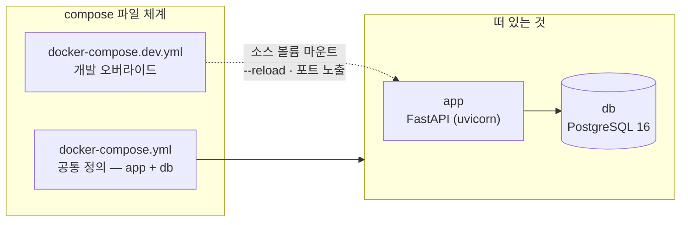
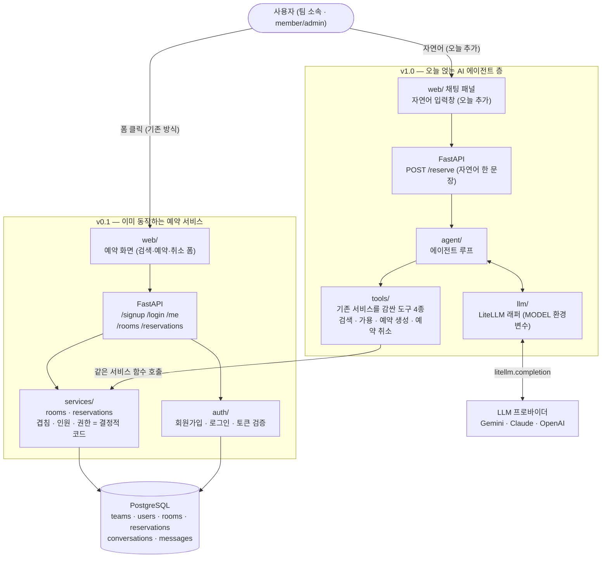
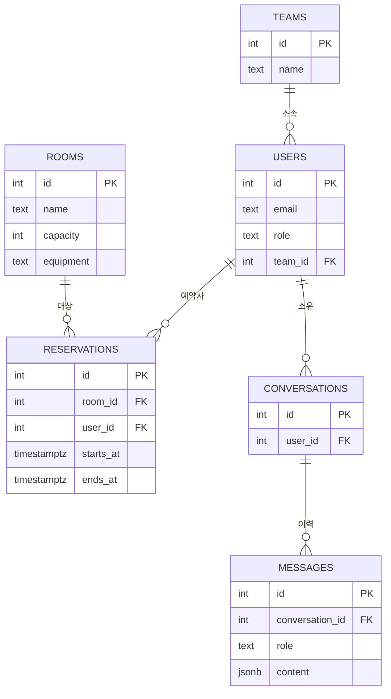
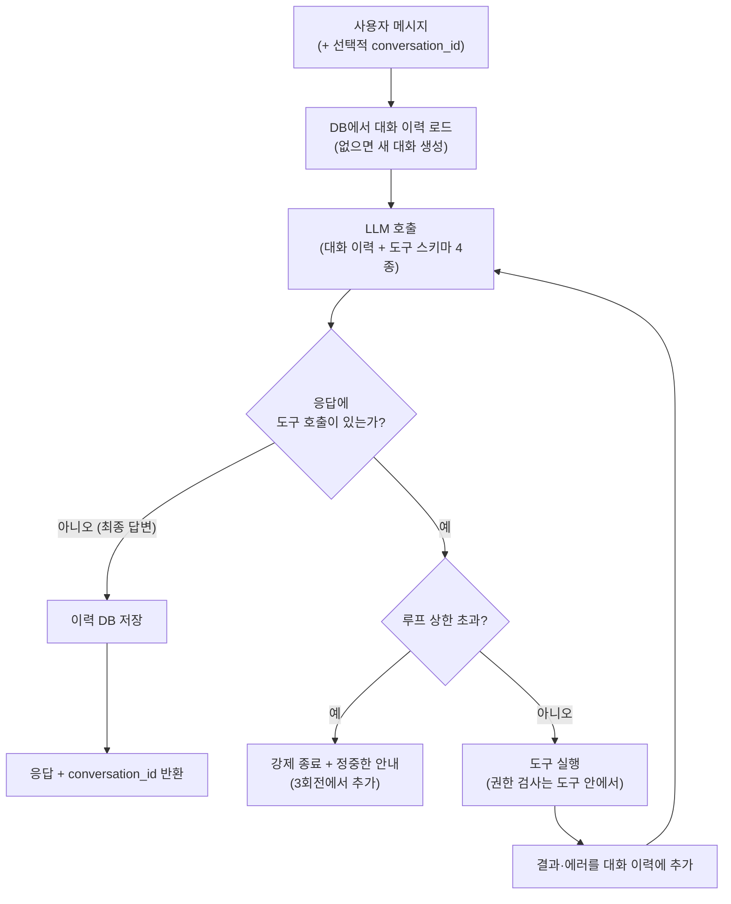
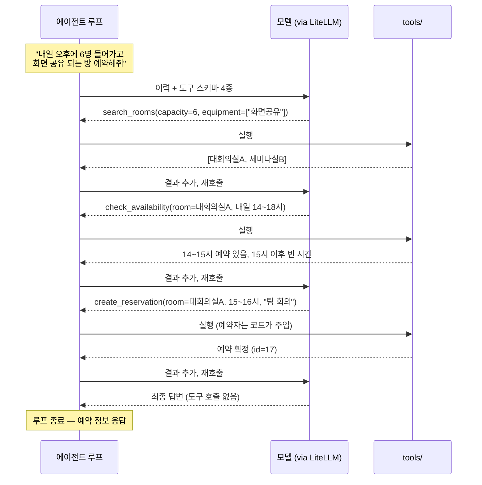

import Slide from 'stack-site-builder/components/Slide.astro';

<Slide class="cover">

# AI 서비스 엔지니어링: Track A

2주차 · 컨테이너 개발환경과 팀 워크플로

*CodeCompose · 2026-07-31*

</Slide>

<Slide>

## 이 자료, 내 컴퓨터에서 볼 수 있습니다
::sub[클론해서 띄우고, 새 자료는 git pull로]

```bash
git clone https://github.com/2026-ai-service-engineering-a/ai_service_engineering-track_a
cd ai_service_engineering-track_a
docker compose up --build      # → http://localhost:4321
```

- 새 자료가 올라오면: `git pull` 한 뒤 다시 `docker compose up --build`
- Docker가 처음이면: 사이트의 글 "Docker와 Docker Compose, 처음이라면" 참고

</Slide>

<Slide>

## 세션 목표
::sub[오늘 세션이 끝나면 얻게 되는 것]

- "DB가 붙는 순간 개발 환경은 **컨테이너 무리**가 된다"는 감각과 docker compose
- 실행 모드와 개발 모드가 같은 파일 체계에서 갈라지는 구조
- AI 도구 시대의 Git Flow: **지시 프롬프트 단위 = 브랜치 단위**
- PR → CI(자동 테스트) → 머지의 협업 워크플로 실물
- 이미 동작하는 예약 서비스에 **도구를 감싸 에이전트를 얹는 법**
- 함부로 못 건드리게 만드는 최소한의 방어: 권한 코드 강제 · 재시도·폴백 · 루프 가드

</Slide>

<Slide class="center">

## 2주차의 주인공

1주차가 "에이전트가 만들어지는 것"을 보여줬다면,
2주차는 **그 과정을 감싸는 개발 환경과 워크플로**

주제(회의실 예약)는 조연.
compose → 브랜치 → 지시 → 검증 → 커밋 → PR → CI → 머지 → 구동,
이 사이클이 주연입니다

</Slide>

<Slide>

## 1주차와 달라지는 것
::sub[난이도 상승은 에이전트가 아니라 에이전트를 둘러싼 것들에서]

| 구분 | 1주차 (분식왕) | 2주차 (회의실 예약) |
| --- | --- | --- |
| 환경 | 로컬 단일 프로세스 | docker compose (app + db) |
| 데이터 | json 파일 | PostgreSQL |
| 도구 성격 | 읽기 전용 | **상태 변경** (예약 쓰기 + 충돌 검사) |
| 사용자 | 익명 | 회원가입·로그인, 멀티 팀 |
| Git | 단일 브랜치 | **feature 브랜치 회전 + PR + CI** |
| 테스트 | 없음 (수동 검증) | 유닛 + 통합 + 권한 테스트 |
| 신뢰성 | — | 권한 코드 강제 · 폴백 · 루프 가드 |
| 지시 프롬프트 | 1개 | **브랜치당 1개** |

에이전트 루프·LiteLLM 부분은 1주차와 동형: 오히려 복습이 됩니다

</Slide>

<Slide>

## 오늘의 흐름
::sub[멘토 시연 중심 · 코드 따라 쓰기 없음]

1. 브리핑: DB가 붙는 순간
2. 시연 1: 환경 투어
3. 시연 2\~4: Git Flow 3회전 (검색 → 예약 → 하드닝)
4. 시연 5: 채팅 UI
5. 시연 6: 예약 내역 조회·취소
6. 시연 7: 구동·마무리
7. 과제 안내

</Slide>

<Slide class="center">

## Part 1: 브리핑

DB가 붙는 순간, 개발 환경은 컨테이너 무리가 됩니다

</Slide>

<Slide>

## devcontainer에서 compose로
::sub[개발 컨테이너를 다루는 방식은 하나가 아닙니다]

- **devcontainer**: 에디터 통합형 · "내 개발 컨테이너 하나" · 혼자, 단일 서비스일 때 최적
- **docker compose**: 서비스가 여러 개일 때의 표준 · 실행 환경과 개발 환경을 같은 파일 체계로
- 전환의 계기는 **DB가 붙는 순간**: "앱 + DB"라는 무리를 한 번에 띄우고 연결해야 합니다
- uv는 이미지 빌드 안에서 의존성 설치에 사용: "내 로컬엔 Python이 없어도 됩니다"

</Slide>

<Slide>

## compose 파일 체계
::sub[dev 파일은 별도 세계가 아니라 덮어쓰기]



- 실행 모드: `docker compose up`
- 개발 모드: `docker compose -f docker-compose.yml -f docker-compose.dev.yml up`
- 실행과 개발이 한 정의를 공유: "내 로컬에선 됐는데"가 구조적으로 줄어듭니다

</Slide>

<Slide>

## 오늘 만들 시스템
::sub[기존 서비스에 에이전트를 얹는다]

- 가상 회사에는 **이미 동작하는 멀티 팀 회의실 예약 서비스**가 있습니다 (v0.1)
  회원가입·로그인 → 화면에서 방 검색 → 폼으로 예약·취소
- 오늘 더하는 것: 같은 일을 **자연어 한 문장으로** 하는 통로
  "내일 오후에 6명 들어가고 화면 공유 되는 방 잡아줘"
- 1주차와의 결정적 차이: 에이전트가 **데이터를 실제로 바꿉니다**
- 다만 예약 로직(겹침·인원)을 새로 만들지 않습니다.
  v0.1에 이미 있는 결정적 코드를 **재사용**합니다

</Slide>

<Slide>

## 시스템 전체 그림



</Slide>

<Slide>

## v0.1에 이미 있는 것
::sub[무엇을 새로 만들지 않아도 되는가의 경계]

| 이미 있는 것 (v0.1) | 어디에 | 로그인만 하면 |
| --- | --- | --- |
| 회원가입 · 로그인 · 토큰 검증 | `auth/` | member로 가입하고 토큰 수령 |
| 회의실 검색 (인원·설비) | `services/rooms.py` | 조건에 맞는 방 목록 조회 |
| 예약 생성 (겹침·인원 검사) | `services/reservations.py` | 방·시간·목적으로 예약 확정 |
| 예약 취소 (본인·관리자) | `services/reservations.py` | 내 예약 취소, 관리자는 전체 |
| 예약 화면 (검색·예약·취소 폼) | `web/` | 브라우저에서 클릭으로 전부 |
| 테스트 (인증·겹침·예약) | `tests/` | pytest 초록불 |

겹침 판정은 순수 함수 overlaps()로 분리, 경계 케이스까지 유닛테스트로 지킴.
잘 설계된 기존 코드입니다

</Slide>

<Slide class="center">

## 지난주 v0.1은 거짓말하는 목,
## 이번 주 v0.1은 진짜로 동작하는 서비스

없는 건 딱 하나, **자연어로 부르는 길**

에이전트는 이 로직을 재발명하지 않습니다.
좋은 기존 코드를 알아보고, 존중하고, 재사용하는 것이
AI 도구로 실무에 들어갈 때의 첫 번째 능력

</Slide>

<Slide>

## 로그인 없이는 아무것도 안 됩니다
::sub[전역 인증 원칙]

- `/signup`·`/login`을 제외한 **모든 엔드포인트는 인증 필수**
  기존 `/rooms`·`/reservations`도, 새 `/reserve`도, `/me`도 토큰 없으면 401
- 에이전트 루프·도구 실행·LLM 호출은 전부 **인증된 요청 컨텍스트 안**
  익명 사용자가 모델을 돌리거나 도구를 건드릴 경로 자체가 없습니다
- 비용 관점: LLM 호출은 돈입니다.
  인증 없는 AI 엔드포인트는 남의 지갑으로 열어 둔 자판기
- 구현은 FastAPI 의존성 하나로 일괄 적용: 엔드포인트마다 검사 코드를 반복하지 않음

</Slide>

<Slide>

## 에이전트에게는 도구가 유일한 통로입니다
::sub[이 시스템의 핵심 설계 원칙]

- 모델에게는 DB도 엔드포인트도 직접 만질 수단을 주지 않습니다
  raw SQL 실행 도구 같은 것은 없습니다
- 모든 행동은 **권한 검사가 내장된 도구**로만: 검색 · 가용 · 예약 생성 · 예약 취소
- 도구는 v0.1 서비스 함수를 감싼 얇은 래퍼: 결정적 규칙은 서비스 한 곳,
  사람이 쓰든 에이전트가 쓰든 똑같이 적용됩니다
- 도구 목록 = 에이전트의 **능력 상한이자 보안 경계**
  모델이 무엇을 하도록 설득당하든, 도구가 허용하지 않는 일은 일어날 수 없습니다

</Slide>

<Slide>

## LLM 층은 프로바이더에 묶이지 않습니다
::sub[어떤 모델을 부를지는 코드가 아니라 설정이 정합니다]

- 모델 호출은 전부 LiteLLM 래퍼 한 곳 경유, 모델은 환경변수 `MODEL`
- 기본은 무료 티어가 있는 `gemini/gemini-2.5-flash`
  Claude·OpenAI로 바꾸거나 폴백할 수 있습니다
- 프로바이더별 키는 `.env`: LiteLLM이 모델 이름의 접두사를 보고 알맞은 키로 호출,
  애플리케이션 코드는 프로바이더를 알지 못합니다
- "실패하면 어디로 넘어갈지"도 설정: 3회전에서 폴백 순서를 환경변수로 갈아 끼웁니다

</Slide>

<Slide>

## 데이터 모델



</Slide>

<Slide>

## 대화 이어가기의 설계
::sub[서버는 무상태, 상태는 전부 DB에]

- `/reserve`는 선택적 `conversation_id`: 없으면 새 대화 생성, 있으면 DB에서 이력 로드
- 응답에 항상 `conversation_id` 포함: 다음 요청이 이어받습니다
- `messages.content`는 jsonb: 도구 호출·결과 메시지까지 그대로 저장 (루프 재개에 필요)
- 대화는 소유자만: 남의 `conversation_id`를 넣어도 거부
- 무료 티어 배포의 무상태 전제(12주차)와 같은 설계 원칙을 여기서 미리 몸에 익힙니다

</Slide>

<Slide>

## 스키마·시드는 파일 하나
::sub[db/init.sql: 첫 기동 시 자동 적용]

- 스키마 + 시드 = `db/init.sql` 한 파일
  PostgreSQL 컨테이너의 docker-entrypoint-initdb.d에 마운트하면 첫 기동 시 적용
- 시드: 팀 2개 · 사용자 4\~5명 (관리자 1명) · 회의실 4\~6개 · 기존 예약 여러 건
- 시연을 위한 장치가 심어져 있습니다
  겹침용 예약 · 인젝션용 **다른 팀 예약** · 도구 연쇄용 **꽉 찬 인기 방**
- 관리자는 시드에서만 지정: `/signup`은 항상 member, 승급 API 없음

</Slide>

<Slide>

## 에이전트의 실체: 루프 하나, 도구 넷
::sub[모델에게 보이는 것과 코드가 주입하는 것을 구분해서 보기]

| 도구 | 모델이 주는 인자 | 코드가 주입 (모델 지정 불가) |
| --- | --- | --- |
| `search_rooms` | 인원, 필요 설비 | — |
| `check_availability` | 회의실 id, 날짜·시간 범위 | — |
| `create_reservation` | 회의실 id, 시작·종료, 목적 | **예약자 = 현재 사용자** |
| `cancel_reservation` | 예약 id | **요청자 id·role** (본인·관리자 판정) |

- 네 도구 모두 `services/`의 함수를 부릅니다. 새로 만드는 것은 로직이 아니라 연결
- 읽기 도구 2개는 주입이 없고, 쓰기 도구 2개는 반드시 인증 컨텍스트가 주입됩니다
  "위험한 도구일수록 모델의 재량이 줄어듭니다"

</Slide>

<Slide>

## 루프의 구조
::sub[도구를 부를지, 답할지를 매 바퀴 모델이 결정합니다]



</Slide>

<Slide>

## 루프 읽기

- 종료 조건이 둘: 모델의 자발적 종료(정상)와 코드의 강제 종료(가드)
  "멈춤조차 모델에게만 맡기지 않습니다"
- 도구 실행이 실패해도 루프는 죽지 않습니다.
  에러가 이력에 추가되어 다음 바퀴의 판단 재료가 됩니다
- 루프의 시작과 끝이 DB: 이력을 로드해서 시작하고, 저장하고 끝납니다.
  **서버는 요청 사이에 아무것도 기억하지 않습니다**

</Slide>

<Slide>

## 한 요청의 실제 흐름
::sub[도구 이름이 그대로 드러나는 트레이스: 시연 4에서 로그와 대조할 기준 그림]



몇 바퀴를 돌지는 사전에 정해져 있지 않습니다.
**호출 횟수가 가변이라는 것 자체가 에이전트의 정의적 특징**

</Slide>
