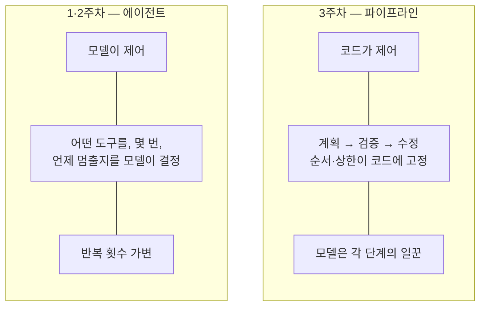
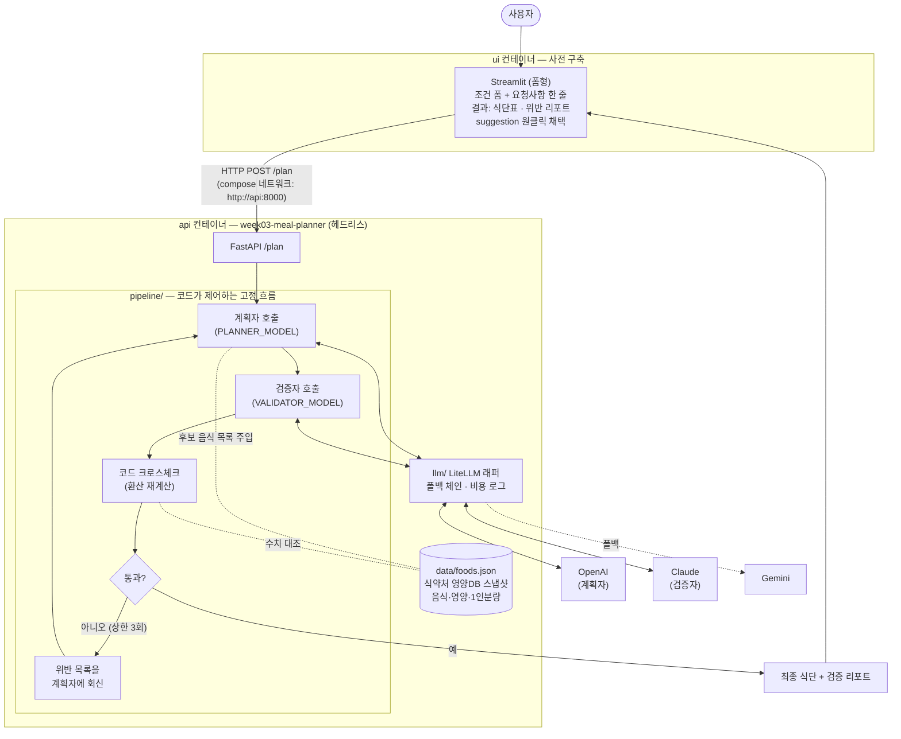
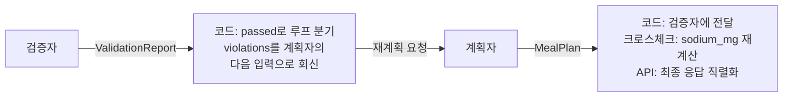
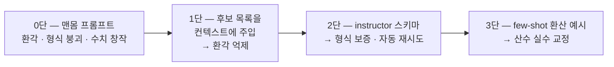
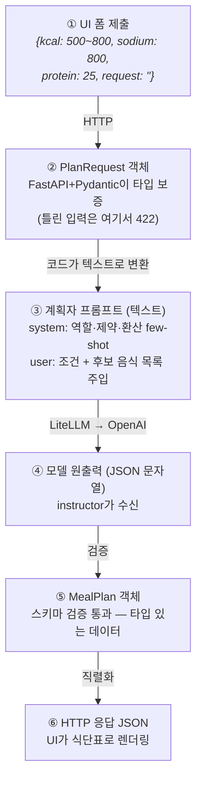
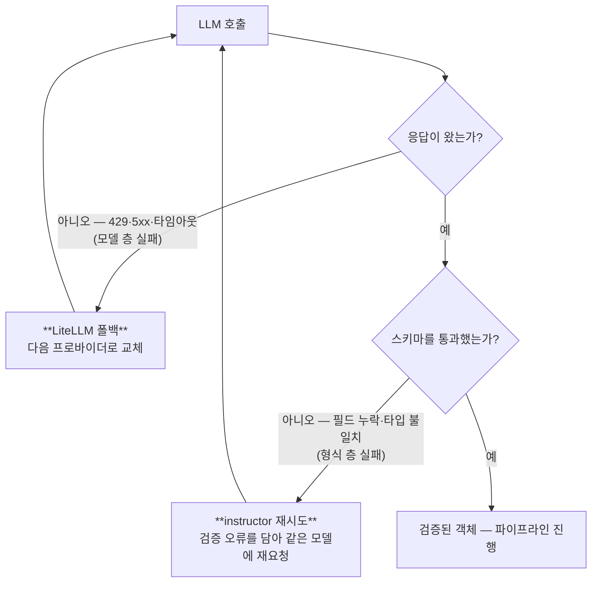
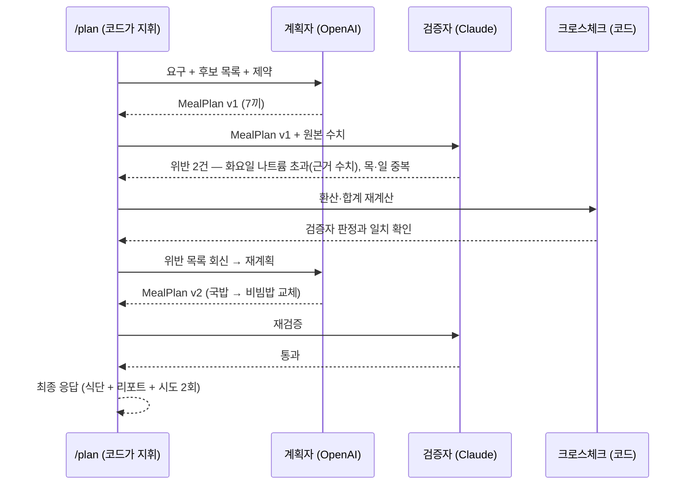
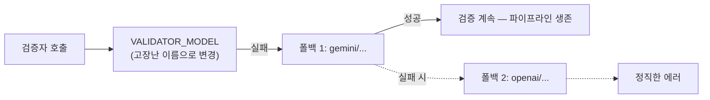
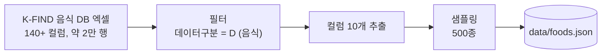

import Slide from 'stack-site-builder/components/Slide.astro';

<Slide class="cover">

# AI 서비스 엔지니어링: Track A

3주차 · LLM API와 프롬프트

*CodeCompose · 2026-08-07*

</Slide>

<Slide>

## 이 자료, 내 컴퓨터에서 볼 수 있습니다
::sub[클론해서 띄우고, 새 자료는 git pull로]

```bash
git clone https://github.com/2026-ai-service-engineering-a/ai_service_engineering-track_a
cd ai_service_engineering-track_a
docker compose up --build      # → http://localhost:4321
```

- 새 자료가 올라오면: `git pull` 한 뒤 다시 `docker compose up --build`
- Docker가 처음이면: 사이트의 글 "Docker와 Docker Compose, 처음이라면" 참고

</Slide>

<Slide class="center">

## 이번 주는 에이전트가 아닙니다

그게 핵심입니다

</Slide>

<Slide>

## 오늘 만드는 것: "AI를 활용한 API"

- 파이프라인의 순서·반복·종료를 전부 **코드가** 쥡니다
- 모델은 각 단계의 **일꾼**으로 부려집니다
- 모델이 제어하는 에이전트를 만들기 전에,
  에이전트가 딛고 설 층인 **신뢰할 수 있는 LLM 호출**부터 다지는 주
- 1주차 엔지니어링 사다리로 말하면 1단 프롬프트 엔지니어링의 주.
  다만 "잘 부탁하는 법"이 아니라 **부탁을 계약으로 바꾸는 법**

</Slide>

<Slide>

## 계약이란

- 응답이 자연어가 아니라 **미리 정한 타입**으로 돌아오는 것
- 그 타입을 어긴 응답은 **코드에 닿기 전에 걸러지는** 것

같은 질문("화요일 저녁 한 끼")에 같은 모델이 답해도,
받는 방식이 다르면 돌아오는 것이 달라집니다

</Slide>

<Slide>

## 자연어로 받으면 vs 계약으로 받으면

| 구분 | 자연어 | 계약 |
| --- | --- | --- |
| 모델 원출력 | `"화요일은 순대국밥 어떠세요? 약 4,000mg 😊"` | `{"day":"화","sodium_mg":4230.0,...}` |
| 코드가 쥐는 것 | 그 문자열 그대로 (아직 데이터가 아님) | 검증을 마친 Pydantic 객체 |
| 값을 꺼내려면 | 정규식·json.loads로 캐낸다 | `meal.sodium_mg > 800`처럼 바로 비교 |
| 형식이 틀리면 | 내가 알아채고 내가 고친다 | 검증 실패가 모델에게 되돌아가 자동 재시도 |

오른쪽은 "예쁘게 받기"가 아닙니다.
다음 단계의 코드가 곧바로 소비할 수 있는 **데이터**이고,
이 차이가 오늘 만들 파이프라인 전체를 지탱합니다

</Slide>

<Slide>

## 세션 목표 (1/2)
::sub[오늘 세션이 끝나면 얻게 되는 것]

- 역할별로 모델·회사가 갈리는 **LiteLLM 멀티 프로바이더** 구성
  계획자는 OpenAI, 검증자는 Claude, 그러나 같은 `litellm.completion` 인터페이스
- 생성자와 검증자를 **다른 회사 모델로 교차**시키는 이유
  self-preference bias: 자기 출력을 검사하면 후해집니다
- structured output이 왜 "형식 맞추기"가 아니라 **파이프라인의 배선**인지
  스키마 없이는 단계 간 연결 자체가 불가능합니다

</Slide>

<Slide>

## 세션 목표 (2/2)

- 폴백 체인의 가치: 검증자가 죽으면 **안전 검사가 통째로 서는** 구조에서 실감
- 프롬프트 패턴의 사다리: 나쁜 프롬프트의 실패를
  컨텍스트 주입 · 스키마 · few-shot으로 단계별 교정
- 서버(API)와 UI가 분리된 **헤드리스 구조**
  UI는 매주 템플릿의 표준 구성품(사전 구축), API는 UI를 몰라도 완결

</Slide>

<Slide>

## 운영안 요구사항과 이 예제의 대응

| 요구사항 | 드러나는 자리 |
| --- | --- |
| LiteLLM 멀티 프로바이더 | 계획자 `openai/...` · 검증자 `anthropic/...`, 역할마다 회사가 갈립니다 |
| 역할별 모델 env 분리 | `PLANNER_MODEL` / `VALIDATOR_MODEL` / `VALIDATOR_FALLBACKS` |
| LiteLLM 폴백 | 검증자 장애 = 파이프라인 정지. 폴백이 살립니다 |
| structured output (instructor) | 계획자 출력 = 검증자 입력, 검증자 출력 = 계획자의 다음 입력 |
| 프롬프트 패턴 | 0단(나쁜 프롬프트) → 컨텍스트 주입 → 스키마 → few-shot 사다리 |

</Slide>

<Slide>

## 1·2주차와 달라지는 것

| 구분 | 1·2주차 (에이전트) | 3주차 (파이프라인) |
| --- | --- | --- |
| 제어 주체 | 모델 (도구·횟수·종료를 결정) | **코드** (순서·반복·상한 고정) |
| 모델의 역할 | 조종사 | 단계별 일꾼 |
| 반복 횟수 | 가변 (에이전트의 정의적 특징) | 고정 상한 (예: 수정 3회) |
| 환경 | compose (app + db) | **compose (api + ui)**, DB 없음 |
| UI 형태 | 채팅형 (대화 상태가 서버에) | **폼형**, 무상태 계약의 정직한 번역 |
| 이번 주가 여는 것 | — | 1·2주차에 빠르게 지나간 LLM 호출 레이어 전부 |

</Slide>

<Slide>

## 오늘의 흐름
::sub[실행은 회전 중간이 아니라 태그로 고정된 버전에서]

1. 브리핑: 오늘은 에이전트가 아니다
2. 시연 1: **v0.1** 투어 + 0단 나쁜 프롬프트
3. 시연 2: Git Flow 1회전 (`feature/planner`)
4. 시연 3: Git Flow 2회전 (`feature/validator-loop`)
5. 시연 4: **v1.0**에서 실행 (파이프라인·조합 교체·폴백·UI)
6. 추가 과정: **v1.5** 관측 확장 (선택)
7. 과제 안내

버전마다 "이런 지시로 만들어졌고, 여기서 돌리면 이렇게 나온다"가 짝이 됩니다

</Slide>

<Slide class="center">

## Part 1: 브리핑

둘 다 LLM을 쓰지만,
조종간을 누가 쥐는지가 다릅니다

</Slide>

<Slide>

## 제어 주체의 대비



</Slide>

<Slide class="center">

## 세상의 AI 서비스 대부분은
## 사실 오른쪽(파이프라인)입니다

예측 가능하고, 디버깅 가능하고, 비용이 계산되기 때문

에이전트는 그 위에 얹는 선택지입니다

</Slide>

<Slide>

## 시연 소재: "한 주 밥상"
::sub[나트륨 예산 안에서 저녁 7끼를 짜는 식단 플래너 API]

- **데이터**: 식약처 식품영양성분DB 음식 DB (실데이터 스냅샷, 레포 내장)
- **세션 포커스**: 
  나쁜 프롬프트의 실패 관찰, 
  모델 조합 교체·폴백 시연
- 겉은 평범한 API, 안에서는 **두 회사의 모델(가령, Claude, OpenAI, Google)** 들이 코드의 지휘 아래 일합니다

</Slide>

<Slide>

## 시스템 전체 그림



</Slide>

<Slide>

## UI는 폼형입니다. 채팅이 아닙니다
::sub[UI의 형태는 백엔드 계약의 번역이어야 합니다]

- 이 API는 **무상태 단발 함수**: 채팅창을 붙이면 UI가
  "이전 대화를 기억한다"는 지키지 못할 약속을 하게 됩니다
- 2주차는 서버에 대화 상태(`conversations`·`messages`)가 있었으므로 채팅형이 정당,
  3주차는 무상태이므로 폼형이 정당
- **어울리는 UI를 고르는 눈이 곧 백엔드 아키텍처를 읽는 눈입니다**

</Slide>

<Slide>

## 요청사항 필드가 수정 경험을 만듭니다

- 폼에는 구조화된 조건(칼로리·나트륨·단백질)과 **자유 요청사항 한 줄**
- 검증 리포트의 `suggestion`("국물이 적은 밥류로 교체")을
  원클릭으로 요청사항에 채택해 재요청하면 **수정처럼** 느껴집니다
- 서버 입장에서는 매번 처음 보는 완결된 요청.
  필드를 클리어하면 전체가 초기 상태로
- **상태는 폼에만 있습니다**

</Slide>

<Slide>

## UI와 API는 별개 컨테이너, 대화는 HTTP뿐
::sub[이것이 헤드리스입니다]

- UI를 Streamlit에서 Next.js로 갈아끼워도 API는 **한 줄도** 안 바뀝니다
- compose 네트워크에서 서비스 이름(`api`)이 곧 호스트명
  (2주차 app↔db와 같은 원리)
- UI는 **사전 구축**: 2주차의 인증처럼 미리 만들어 제공.
  직접 만드는 것은 9주차, 다만 결과물(식단표)이 눈에 보여야 하므로
  매주 템플릿의 표준 구성품으로 포함

</Slide>

<Slide>

## LLM 호출 지점은 정확히 두 곳

- 계획자와 검증자, **둘뿐**입니다. 나머지는 전부 평범한 코드
  "AI 서비스라고 AI가 많은 게 아닙니다"
- 두 호출이 **다른 회사로** 갑니다:
  같은 `litellm.completion`에 모델 문자열만 다름
- 1주차부터 말한 "문자열 하나로 교체"가 여기서 실전이 됩니다
- 크로스체크(코드 재계산)가 검증자 옆에 있는 이유는 2회전에서

</Slide>

<Slide class="center">

## 만든 쪽이 검사하면 안 된다

회사를 가르는 이유는 취향이 아니라 편향

자기 출력에 후한 **self-preference bias**,
오래된 원칙의 LLM 버전입니다

</Slide>

<Slide>

## 데이터: 진짜 정부 데이터
::sub[실존하는 음식들의 분석 기반 영양 수치, 제작한 샘플이 아닙니다]

- 코드가 다루는 데이터는 `data/foods.json` 하나
- K-FIND 원본 엑셀(140여 컬럼, 약 2만 행)에서
  **음식 500종 · 컬럼 10개**만 추린 스냅샷, v0.1에 이미 내장
- 500종인 이유: 이 목록이 계획자 **프롬프트에 통째로** 들어가기 때문.
  컨텍스트에 실리는 크기여야 합니다
- 같은 페이지의 **가공식품 DB**(187MB, 31만 건)는 4주차의 주인공
  "오늘은 작고 깨끗한 쪽, 다음 주는 크고 더러운 쪽"

</Slide>

<Slide>

## 1인분량이 이 데이터의 함정이자 보석

- 영양값은 **100g 기준**, 1인분은 김밥 230g · 순대국밥 **900g**
- 사람이 먹는 단위로 환산해야 하고,
  이 환산이 **LLM이 정확히 틀리는 지점**
- 나트륨이 소재를 완성합니다:
  순대국밥 470mg/100g × 900g ≈ **한 그릇 4,200mg**
  WHO 하루 권장(2,000mg)의 두 배
- 국물 요리를 좋아할수록 예산이 터지고,
  수정 루프가 연출 없이 진짜로 돕니다

</Slide>

<Slide>

## env가 곧 조직도
::sub[역할이 곧 설정: 코드 어디에도 모델명이 없습니다]

```sh
# .env.example
PLANNER_MODEL=openai/gpt-...          # 계획자 — 식단 생성
VALIDATOR_MODEL=anthropic/claude-...  # 검증자 — 다른 회사로 교차
VALIDATOR_FALLBACKS=gemini/...,openai/...
OPENAI_API_KEY=
ANTHROPIC_API_KEY=
GEMINI_API_KEY=
```

- 조합 교체는 env 수정 + 재실행 (v1.0 실행에서 실증)

</Slide>

<Slide>

## 폴백이 검증자에 붙는 이유

- 계획자가 죽으면: "식단이 안 나옴" → **불편**
- 검증자가 죽으면: "검증 안 된 식단이 나감" → **위험**
- 신뢰성 투자는 위험한 쪽부터 합니다

</Slide>

<Slide>

## structured output은 어디서 나오나
::sub[모델의 출력을 자유 텍스트가 아니라 검증된 타입 데이터로 받는 것]

- 이 시스템에서는 LLM 호출 지점 **두 곳 모두**가 structured output
- 입구부터 타입: `/plan`의 입력도 Pydantic (UI 폼과 1:1 대응)

```python
class PlanRequest(BaseModel):   # ← /plan의 입력
    kcal_min: int = 500
    kcal_max: int = 800
    sodium_limit_mg: int = 800  # 저녁 몫 나트륨 예산
    protein_min_g: int = 25
    request: str = ""           # 자유 요청사항 — 비우면 순수 조건만으로
                                # 상태는 이 필드가 전부
```

</Slide>

<Slide>

## 계획자의 출력 계약: MealPlan

```python
class Meal(BaseModel):
    day: str                    # "월"
    food_code: str              # "D101-004310000-0001"
    food_name: str              # "국밥_순대국밥"
    serving_g: int              # 900  (1인분량)
    calories_kcal: float        # 675.0  (100g값 × 9 환산)
    protein_g: float
    sodium_mg: float
    reason: str                 # 선정 이유 한 줄

class MealPlan(BaseModel):      # ← 계획자의 출력
    meals: list[Meal]           # 7개
```

</Slide>

<Slide>

## 검증자의 출력 계약: ValidationReport

```python
class Violation(BaseModel):
    type: Literal["존재하지_않는_음식", "환산_오류", "제약_위반", "중복"]
    day: str
    food_code: str
    evidence: str               # "470mg/100g × 900g = 4,230mg > 800mg"
    severity: Literal["high", "medium", "low"]
    suggestion: str             # 수정 제안 한 줄

class ValidationReport(BaseModel):  # ← 검증자의 출력
    passed: bool
    violations: list[Violation]
```

- `evidence` 필드가 판정에 **근거**를 강제합니다

</Slide>

<Slide>

## 호출은 이렇게 바뀝니다

```python
# 0단 (나쁜 예): 문자열이 돌아옴 — 파싱·검증·재시도 전부 내 몫
text = litellm.completion(model=..., messages=...).choices[0].message.content

# instructor: 검증된 객체가 돌아옴 — 스키마 불일치면 자동 재시도
plan: MealPlan = client.chat.completions.create(
    model=os.environ["PLANNER_MODEL"],
    response_model=MealPlan,        # ← 이 한 줄이 structured output
    messages=[...],
)
plan.meals[1].sodium_mg             # 바로 코드에서 사용 — 파싱 코드 없음
```

</Slide>

<Slide>

## 실제로 나오는 데이터
::sub[검증자 출력 예]

```json
{
  "passed": false,
  "violations": [
    {
      "type": "제약_위반",
      "day": "화",
      "food_code": "D101-004310000-0001",
      "evidence": "순대국밥 나트륨 470mg/100g × 900g = 4,230mg > 한도 800mg",
      "severity": "high",
      "suggestion": "국물이 적은 밥류(비빔밥 등)로 교체"
    }
  ]
}
```

</Slide>

<Slide>

## 왜 두 출력 모두 structured여야 하는가
::sub[둘 다 사람이 읽는 글이 아니라 다음 코드가 소비하는 데이터]



- `passed` 필드 하나로 코드가 루프를 돌릴지 결정합니다
- `evidence`·`suggestion`은 계획자의 다음 프롬프트에 그대로 들어갑니다

</Slide>

<Slide class="center">

## structured output은 예쁘게 받기가 아닙니다

타입 있는 입력과 타입 있는 출력,
곧 **LLM을 함수처럼 쓰기**

그래야 LLM이 시스템의 부품이 됩니다

</Slide>

<Slide class="center">

## 시연 1: v0.1 투어 + 0단 프롬프트

</Slide>

<Slide>

## 시작점 내려받기
::sub[클론이 아니라 태그 ZIP: 버전이 고정되어 문서와 같은 상태에서]

- 클론하면 완성본 이력까지 딸려 와 정답을 먼저 보게 됩니다
- 버전별 코드는 저장소의 **Tags 페이지**에서:
  `github.com/2026-ai-service-engineering-a/week03-meal-planner/tags`
- 태그마다 `zip` 링크가 붙어 있어 필요한 버전을 골라 내려받으면 됩니다
- 지금은 **v0.1의 zip**을 받아 압축을 풉니다

</Slide>

<Slide>

## env 세팅과 구동

```bash
cd week03-meal-planner-0.1
cp .env.example .env             # 프로바이더 키 입력
docker compose -f docker-compose.yml -f docker-compose.dev.yml up
```

- api·ui 두 서비스가 뜹니다 (2주차 관례 그대로, DB만 없음)
- v0.1은 **키 없이도 뜹니다**: UI와 목 응답까지 확인 가능
- 파이프라인 실행에는 OpenAI·Anthropic·Gemini 3개 중 **2개 이상** 권장
  계획자·검증자를 다른 회사로 교차시키는 것이 이번 주의 핵심이라서

</Slide>

<Slide>

## v0.1 투어

1. 브라우저에서 UI 열기 → 조건 입력 → 목 응답:
   **"아직 영양사가 출근 전입니다"**
2. UI는 이미 완성돼 있고 이번 주에 건드리지 않습니다.
   만드는 것은 이 뒤의 **헤드리스 API**
3. curl이나 Swagger로 불러도 똑같이 동작:
   실제로 curl을 한 번 쳐서 같은 목 응답 확인 (분리의 증명)

</Slide>

<Slide>

## data/foods.json 열어보기

- 실제 음식들, 나트륨 수치, 1인분량이 보입니다
- 순대국밥 한 그릇의 나트륨을 지금 계산해 보면:
  470mg/100g × 900g = **약 4,200mg**
- 암산으로도 나오는 이 숫자가 오늘 시연의 드라마를 만듭니다

</Slide>

<Slide>

## 0단: 나쁜 프롬프트의 실패를 먼저
::sub[진행: 프롬프트 설명 → 실행 → 결과 관찰 → 파싱 시도 → 실패 확인]

미리 말해 둘 것:

- **첫 실행에서 바로 깨끗한 JSON이 나올 수도 있습니다**
- 모델 출력은 비결정적: 운 좋게 잘 나오는 회차가 있고,
  최신 모델일수록 그 확률이 높습니다
- 출력 예시는 **대표적인 실패 유형**이지, 매번 이렇게 나온다는 뜻이 아닙니다
- 핵심은 한 번 잘 나오는 것이 아니라 **매번 같게 나온다는 보장이 없다**는 것.
  잘 나온 회차조차 실패의 일부입니다

</Slide>

<Slide>

## ① 코드 열고 프롬프트 설명
::sub[v0.1에 포함된 examples/naive_plan.py 전문]

```python
"""이렇게 하면 안 되는 이유를 보여주는 파일 — 지우지 말 것"""
import os, litellm

resp = litellm.completion(
    model=os.environ["PLANNER_MODEL"],
    messages=[{
        "role": "user",
        "content": "일주일 저녁 식단을 나트륨 적게 JSON으로 짜줘",
    }],
)
print(resp.choices[0].message.content)
```

- 스키마 없음, 데이터 없음, "JSON으로"라는 **부탁**뿐
- 그럴듯해 보이는 것이 함정입니다

</Slide>

<Slide>

## ② 실행 1회차

```bash
docker compose exec api uv run python examples/naive_plan.py
```

```plaintext
물론이죠! 나트륨을 줄인 건강한 일주일 저녁 식단입니다 😊

{
  "월요일": {"메뉴": "연어 스테이크 샐러드", "나트륨": "350mg"},
  "화요일": {"메뉴": "두부 샐러드", "나트륨": "약 200mg"},
  ...
}
맛있게 드세요!
```

</Slide>

<Slide>

## 1회차 출력에서 읽어야 할 것

- **인사말과 이모지**가 JSON을 감싸고 있습니다. 이대로는 파싱이 안 됩니다
- **"연어 스테이크 샐러드"**: 우리 foods.json에 없는 음식, 곧 환각.
  `grep 연어 data/foods.json`을 쳐 보면 없다는 것이 확인됩니다
- **"약 200mg"**: 숫자가 아니라 문자열이고, 근거 없는 창작 수치

</Slide>

<Slide>

## ③ 실행 2회차: 같은 명령 다시

```bash
docker compose exec api uv run python examples/naive_plan.py
```

```plaintext
{
  "plan": [
    {"day": "Mon", "menu": "닭가슴살 구이", "sodium_mg": 320},
    ...
  ]
}
```

- 이번에는 인사말이 없고, **키 이름이 전부 바뀌었습니다**
  월요일은 day로, 메뉴는 menu로. "어제 짠 파싱 코드가 오늘 죽는 이유"
- 같은 프롬프트, 같은 모델, 다른 형식.
  **부탁으로 받은 JSON은 계약이 아닙니다**

</Slide>

<Slide>

## ④ 파싱 시도 → 실패 확인

```bash
docker compose exec api uv run python examples/naive_parse.py
# ①의 출력을 json.loads 하는 3줄짜리
```

```plaintext
json.decoder.JSONDecodeError: Expecting value: line 1 column 1 (char 0)
```

- 1회차 출력(인사말 포함)을 넣으면 **첫 글자에서 즉사**합니다
- 이 에러를 try/except와 정규식으로 막기 시작하면 늪입니다.
  그 늪의 이름이 "JSON 흉내"

</Slide>

<Slide>

## ⑤ 실패 3종 정리

| 화면에서 본 것 | 실패 유형 | 오늘의 처방 |
| --- | --- | --- |
| 연어 스테이크 샐러드 (DB에 없음) | 환각 | 후보 목록 **컨텍스트 주입** (1회전) |
| 인사말 포장, 회차마다 다른 키 | 형식 붕괴 | **instructor 스키마 강제** (1회전) |
| "약 200mg" (창작 수치) | 수치 창작 | **데이터 대조·크로스체크** (2회전) |

세 실패는 처방이 다릅니다.
이번 세션은 이 표의 오른쪽 열 순서대로 진행됩니다

</Slide>

<Slide>

## 처방의 사다리



</Slide>

<Slide class="center">

## 시연 2: Git Flow 1회전

`feature/planner`

`/plan`이 **형식이 보증된 식단 초안**을
반환하는 것까지 (검증은 아직 없음)

</Slide>

<Slide>

## 회전 진행 형식
::sub[두 회전 공통]

1. 지시 프롬프트 작성·설명
2. 무엇이 만들어졌나 (코드에서 그 부분 짚기)
3. 커밋 → PR → 머지

- 프롬프트 방식이라 생성은 빠릅니다. 시간의 무게중심은 ②
- **실행은 회전 중간에 하지 않습니다.**
  두 회전이 모두 머지된 v1.0 상태에서 한 번에
- 문서의 출력 예시도 전부 태그 기준:
  재현자가 같은 태그에서 돌리면 같은 기준으로 비교할 수 있습니다

</Slide>

<Slide>

## 1차 지시

```plaintext
식단 플래너의 1단계: 계획자를 만들어줘.

- POST /plan 입력: 구조화된 조건(칼로리 범위·나트륨 한도·단백질 최소)과
  자유 요청사항 문자열(request). 계획자 프롬프트에 둘 다 반영해라 —
  request가 비어 있으면 조건만으로 생성. 응답은 저녁 7끼 식단 초안
- 계획자 LLM 호출은 LiteLLM 경유, 모델은 환경변수 PLANNER_MODEL
- structured output은 instructor를 사용해라. Pydantic 스키마:
  MealPlan — 7개 항목, 각 항목은 요일, 식품코드, 식품명,
  1인분 기준 환산값(에너지 kcal·단백질 g·나트륨 mg), 선정 이유 한 줄
- 프롬프트에는 data/foods.json에서 조건에 맞는 후보 음식 목록
  (코드·이름·100g 영양값·1인분량)을 넣어줘라 — 목록에 없는 음식 금지
- 100g→1인분 환산 규칙과 예시 2개(few-shot)를 시스템 프롬프트에 포함해라
- 제약 기본값: 한 끼 500~800kcal, 단백질 25g 이상, 나트륨 800mg 이내,
  같은 대표식품 주 2회 이하 — 시스템 프롬프트에 명시
- 디버그 로그: LOG_LEVEL=debug일 때 모든 LLM 호출의 조립된 프롬프트 전문,
  모델 원출력, instructor 재시도 과정을 로그로 남겨라
- 아직 검증은 만들지 마 — 다음 단계
- 작업 단위마다 커밋하면서 진행해라 — 스키마 → 계획자 호출 →
  엔드포인트 연결 순으로 커밋을 나누고, 각 커밋 메시지에 의도를 남겨라
```

</Slide>

<Slide>

## 줄별 의도: 후보 주입
::sub["목록에 없는 음식 금지"]

- 0단 **환각**에 대한 처방:
  모델의 상상력을 데이터의 울타리 안에 가둡니다
- 4\~6주차 컨텍스트 엔지니어링·RAG의 첫 실물이기도 합니다
- 다만 지금 하는 것은 후보 500종을 **프롬프트에 통째로 싣는 것**.
  데이터가 작아서 되는 방식입니다

</Slide>

<Slide>

## 통째 주입이 오래 못 가는 세 가지 이유

- **환각이 완전히 사라지지 않습니다**
  컨텍스트 주입은 확률을 낮추는 일이지 보증이 아닙니다.
  검증자와 코드 크로스체크가 따로 필요한 이유
- **비용이 입력 토큰에 비례합니다**
  후보 목록은 호출마다 통째로 다시 실려 갑니다.
  수정 루프까지 돌면 `/plan` 한 번에 같은 목록을 네 번까지
- **큰 입력은 큰 모델을 요구합니다**
  컨텍스트 상한을 넘으면 더 비싼 모델로.
  비용을 피하려다 다시 비용으로 돌아옵니다

데이터가 커지면 **다 넣는 대신 골라 넣게** 됩니다.
그것이 검색이고 RAG입니다 (4\~6주차)

</Slide>

<Slide>

## 줄별 의도: 나머지

- **"instructor를 사용"**: 0단 형식 붕괴의 처방.
  "JSON으로 줘"라고 비는 것과, 스키마 검증 실패 시 자동 재시도의 차이
- **"few-shot 환산 예시"**: 0단 수치 창작의 처방 시도.
  **그래도 틀린다는 것**이 2회전의 복선
- **"디버그 로그"**: 프롬프트 전문·원출력·재시도가 로그에 남아야
  "실제로 이렇게 처리된다"를 열어 볼 수 있습니다.
  **관측 가능성도 요구사항입니다**
- **"작업 단위마다 커밋"**: 브랜치가 지시 단위라면 커밋은 그 안의 작업 단위.
  재현자가 diff로 만들어진 순서를 따라갈 수 있게

</Slide>

<Slide>

## 무엇이 만들어졌나: git log부터

- 생성이 끝나면 `git log --oneline`부터 봅니다
- 스키마 → 호출 → 연결 커밋이 쪼개져 쌓였는지 확인
- **이 이력이 곧 튜토리얼의 목차입니다**
- 그다음 파일별로 딱 한 군데씩. 전체를 읽지는 않습니다

</Slide>

<Slide>

## 코드에서 이 부분

| 파일 | 보는 곳 | 왜 중요한가 |
| --- | --- | --- |
| `schemas/meal.py` | `class MealPlan(BaseModel)` | 브리핑에서 본 그 스키마, 곧 계약서 |
| `llm/client.py` | `instructor.from_litellm(...)` | LiteLLM 위에 instructor를 씌우는 한 줄. 멀티 프로바이더 + 스키마 보증의 결합점 |
| `pipeline/planner.py` | 후보 필터 → 프롬프트 조립 → `response_model=MealPlan` | 조건으로 foods.json을 거르고, 텍스트로 펴서, 계약과 함께 보냅니다. 이 함수가 계획자의 전부 |
| `app/main.py` | `/plan`에서 `PlanRequest` 수신 → planner 호출 | 입구의 타입 보증(Pydantic)과 출구의 타입 보증(instructor)이 만나는 곳 |

</Slide>

<Slide>

## 커밋 → PR → 머지

- PR을 생성합니다. 커밋이 여러 개 쌓인 PR이 만들어집니다
- **과정이 남는 PR**과 결과만 있는 PR의 차이
- CI → 머지
- 이 상태의 `/plan`은 형식이 보증된 초안을 반환할 뿐, 검증은 아직 없습니다

</Slide>

<Slide class="center">

## 시연 3: Git Flow 2회전

`feature/validator-loop`

이번 주의 클라이맥스:
**다른 회사 모델이 계획자의 실수를 잡아내는 순간**

그 순간의 실물은 v1.0 실행에서

</Slide>

<Slide>

## 2차 지시

```plaintext
2단계: 검증자와 수정 루프를 추가해줘.

- 검증자 LLM 호출은 VALIDATOR_MODEL (계획자와 다른 프로바이더).
  LiteLLM 경유, 폴백 체인은 VALIDATOR_FALLBACKS 순서로
- 검증자 입력: MealPlan + 각 음식의 원본 100g 영양값·1인분량
- 검증자 출력도 instructor 스키마로:
  ValidationReport — 통과 여부, 위반 목록
  (위반 유형: 존재하지 않는 음식 / 환산 오류 / 제약 위반 / 중복,
   대상 요일·식품코드, 근거 수치, 심각도, 수정 제안 한 줄)
- 검증자와 별개로 코드 크로스체크를 넣어라:
  환산과 합계는 순수 함수로 재계산해서 검증자 결과와 대조.
  환산 함수에는 유닛테스트 작성
- 수정 루프: 위반 목록을 계획자에 되돌려 재생성, 최대 3회.
  3회 안에 통과 못 하면 마지막 안과 위반 목록을 함께 반환 (정직한 실패)
- /plan 응답에 최종 식단 + 검증 리포트 + 시도 횟수 +
  시도별 위반 이력(history) 포함 — 루프가 돌았다는 증거를 응답에 남겨라
- 작업 단위마다 커밋하면서 진행해라 — 검증자 스키마·호출 →
  크로스체크·테스트 → 수정 루프 연결 순으로 커밋을 나눠라
```

</Slide>

<Slide>

## 줄별 의도: 교차와 근거

- **"계획자와 다른 프로바이더"**: 교차 검증의 구조화.
  env를 보면 이 정책이 설정으로 보입니다
- **"근거 수치" 필드**: 검증자가 "나트륨 초과 같아요"가 아니라
  "화요일 순대국밥: 470mg/100g × 900g = 4,230mg > 800mg"을 내놓게 강제
- structured output이 판정의 **품질**을 끌어올리는 예

</Slide>

<Slide>

## 줄별 의도: 크로스체크와 정직한 실패

- **"코드 크로스체크"**: 정직한 설계 포인트.
  **산수만 필요하면 LLM 검증자는 필요 없습니다. 코드가 더 정확합니다**
- LLM 검증자의 값어치는 위반의 해석 · 심각도 판단 · 수정 제안.
  산수는 코드가 이중으로 보증합니다. **"믿되, 재계산하라"**
- LLM-as-judge의 예고편이자 한계 고지
- **"정직한 실패"**: 3회 상한. 파이프라인에도 루프 가드가 있습니다
  (2주차 에이전트 루프 가드의 재회)
- **"커밋을 나눠라"**: "검증자만 있는 상태"와 "루프까지 연결된 상태"가
  커밋으로 구분되어야 재현자가 단계를 밟을 수 있습니다

</Slide>

<Slide>

## 코드에서 이 부분

| 파일 | 보는 곳 | 왜 중요한가 |
| --- | --- | --- |
| `schemas/validation.py` | `evidence`·`suggestion` 필드 | 판정에 근거를 강제하는 계약 |
| `pipeline/validator.py` | `model=VALIDATOR_MODEL` + `response_model=ValidationReport` | 계획자와 같은 모양, 다른 회사. 교차 검증이 코드에서는 이 한 줄 차이 |
| `pipeline/crosscheck.py` | 환산·합계 순수 함수 | LLM 없이 도는 산수. 테스트가 붙는 곳 |
| `pipeline/loop.py` | `for attempt in range(3)`과 위반 회신 조립 | 수정 루프의 전부. 상한 3회가 하드코딩이 아니라 눈에 보이는 규칙 |

</Slide>

<Slide>

## 커밋 → PR → 머지 → v1.0 태그

- 커밋 이력 확인 → PR → CI → 머지. 1회전과 같은 절차라 빠르게
- 머지 후 **v1.0 태그**를 찍습니다
- PROMPT.md에는 지시 프롬프트 2개가 누적
- **여기까지가 라이브 세션의 종료점**, 이 상태에서 실행합니다

</Slide>

<Slide class="center">

## 시연 4: v1.0에서 실행

파이프라인이 실제로 어떻게 도는지,
두 회전이 모두 머지된 **v1.0 상태에서**

</Slide>

<Slide>

## v1.0 내려받아 띄우기
::sub[Tags 페이지에서 v1.0의 zip]

```bash
cd week03-meal-planner-1.0
cp ../week03-meal-planner-0.1/.env .
docker compose -f docker-compose.yml -f docker-compose.dev.yml up
```

- v0.1을 띄워 둔 상태라면 먼저 내립니다
- `.env`는 v0.1 폴더의 것을 복사
- 같은 지시를 직접 돌려 내 버전을 만들어 봤다면 파일 이름과
  로그 마커가 문서와 다를 수 있습니다. 요구사항을 만족하면 그것대로 성공

</Slide>

<Slide>

## v0.1에서 무엇이 달라졌나
::sub[두 회전이 더한 것이 전부]

| 구분 | v0.1 | v1.0 |
| --- | --- | --- |
| `/plan` | 목 응답 | 계획자 → 검증자 → 크로스체크 → 수정 루프 (상한 3회) |
| 응답 | 고정 문자열 | `meals` + `report` + `attempts` + `history` |
| `api/` 구성 | `app/main.py` 목 하나 | `schemas/` `llm/` `pipeline/` `tests/` 추가 |
| API 키 | 없어도 뜸 | 실호출 (2개 이상 권장) |
| UI·데이터 | 사전 구축 UI · foods.json | 변경 없음 (헤드리스 분리의 증명) |
| PROMPT.md | 자리만 | 지시 프롬프트 2개 누적 |

```bash
diff -r week03-meal-planner-0.1 week03-meal-planner-1.0 | less
```

</Slide>

<Slide>

## 계획자 층: 데이터의 여행
::sub[지도를 먼저 걸어두고, 각 지점을 명령 → 실물로 엽니다]



</Slide>

<Slide>

## 관문 ②: 틀린 입력은 LLM에 가기도 전에 죽는다

```bash
curl -s localhost:8000/plan -X POST -H 'Content-Type: application/json' \
  -d '{"kcal_min":500,"kcal_max":"많이","sodium_limit_mg":800,"protein_min_g":25}' | jq
```

```json
{ "detail": [ { "loc": ["body", "kcal_max"],
    "msg": "Input should be a valid integer", "input": "많이" } ] }
```

- LLM 요금이 나가기 전에 Pydantic이 **공짜로** 막았습니다. 첫 번째 관문

</Slide>

<Slide>

## 정상 호출 → 응답 실물

```bash
curl -s localhost:8000/plan -X POST -H 'Content-Type: application/json' \
  -d '{"kcal_min":500,"kcal_max":800,"sodium_limit_mg":800,"protein_min_g":25,"request":""}' | jq
```

```json
{
  "meals": [
    { "day": "월", "food_code": "D101-007280000-0001", "food_name": "김밥_소고기",
      "serving_g": 250, "calories_kcal": 447.5, "protein_g": 16.2,
      "sodium_mg": 667.5, "reason": "단백질 보강과 나트륨 여유를 함께 확보" },
    ...
  ],
  "report": { "passed": true, "violations": [] },
  "attempts": 1,
  "history": []
}
```

- 무난한 조건이라 1차 통과: `attempts: 1`, `history`는 빈 배열

</Slide>

<Slide>

## 응답에서 검증할 것

- 식품코드를 foods.json에서 `grep`으로 확인 (실존 여부)
- 환산값 하나를 암산으로 대조
- **틀린 끼니가 나오면 수정 루프의 복선**:
  few-shot을 줬는데도 틀립니다.
  프롬프트만으로 산수를 보증할 수 없습니다

</Slide>

<Slide>

## 관문 ③·④: 모델이 실제로 본 것과 뱉은 것
::sub[LOG_LEVEL=debug: 관측 가능성도 요구사항이었습니다]

```bash
docker compose logs api | grep -A 40 "PLANNER PROMPT"
```

```plaintext
[debug] PLANNER PROMPT ─ system:
  너는 식단 계획자다. 규칙: ... 환산 예시) 순대국밥 100g=75kcal, 1인분 900g → 675kcal ...
[debug] PLANNER PROMPT ─ user:
  조건: 500~800kcal, 나트륨≤800mg, 단백질≥25g
  후보 목록: [D101-007000000-0001 김밥 140kcal/100g 1인분230g Na307mg] [...]
[debug] PLANNER RAW OUTPUT: {"meals":[{"day":"월", ...
```

</Slide>

<Slide>

## 모델이 보는 것은 결국 이 텍스트

- 객체가 아니라 **텍스트**입니다.
  후보 목록이 여기 박혀 있으니 환각이 억제된 것
- 데이터가 **객체 → 텍스트 → JSON → 객체**를 여행하고,
  경계마다 보증자가 다릅니다
- 들어올 땐 Pydantic, 나올 땐 instructor

</Slide>

<Slide>

## 나오지 않을 때: 실패의 두 층



- 모델 층 실패(폴백)의 실물은 잠시 뒤 모의 장애로 봅니다

</Slide>

<Slide>

## instructor 재시도 관찰

```bash
docker compose logs api | grep -B 2 -A 8 "INSTRUCTOR RETRY"
```

```plaintext
[debug] PLANNER RAW OUTPUT: {"meals":[{"day":"월요일", ...     ← Literal["월",...] 위반
[debug] INSTRUCTOR RETRY 1/2 ─ validation error:
  meals.0.day: Input should be '월','화',... [type=literal_error]
[debug] (오류 내용을 담아 재요청)
[debug] PLANNER RAW OUTPUT: {"meals":[{"day":"월", ...          ← 통과
```

형식이 틀리면 사람이 고치는 것이 아니라,
**오류가 모델에게 되돌아가고 모델이 고칩니다.**
그것이 자동 재시도의 실체

</Slide>

<Slide>

## 수정 루프: 검증자가 계획자의 실수를 잡아낸다



</Slide>

<Slide>

## 위반을 유도하는 호출
::sub[국물 요리 유도로 나트륨 위반이 거의 확실히 발생합니다]

```bash
curl -s localhost:8000/plan -X POST -H 'Content-Type: application/json' \
  -d '{"kcal_min":500,"kcal_max":800,"sodium_limit_mg":800,"protein_min_g":25,
       "request":"국물 요리 위주로 짜줘"}' | jq
```

```json
{
  "meals": [ ... 최종 7끼 ... ],
  "report": { "passed": true, "violations": [] },
  "attempts": 2,
  "history": [
    { "attempt": 1, "passed": false, "violations": [
      { "type": "제약_위반", "day": "화", "food_code": "D101-004310000-0001",
        "evidence": "순대국밥 470mg/100g × 900g = 4,230mg > 800mg",
        "severity": "high", "suggestion": "국물이 적은 밥류(비빔밥 등)로 교체" } ] }
  ]
}
```

</Slide>

<Slide>

## 루프가 돌았다는 증거가 응답에 있습니다

- `attempts: 2`: 1차에서 검증자가 잡았고, 2차에서 통과
- `history`: 시도별 위반 이력이 그대로 남습니다
- 3회 안에 통과 못 하면 `passed: false`인 리포트와
  마지막 안이 그대로 나갑니다: **정직한 실패**

</Slide>

<Slide>

## 검증자가 실제로 받은 것·뱉은 것

```bash
docker compose logs api | grep -A 30 "VALIDATOR PROMPT"
```

```plaintext
[debug] VALIDATOR PROMPT ─ user:
  식단: 화 순대국밥(D101-0043...) serving 900g 칼로리 675 나트륨 4230 ...
  원본 수치: 순대국밥 100g당 75kcal, Na 470mg, 1인분량 900g ...
[debug] VALIDATOR RAW OUTPUT: {"passed": false, "violations":[{"type":"제약_위반", ...
```

- 1회전의 출력 객체(MealPlan)가 텍스트로 풀려서 2회전의 입력이 됐습니다
- **스키마가 배선**이라는 말의 실물

</Slide>

<Slide>

## 위반이 계획자에게 되돌아간 실물

```bash
docker compose logs api | grep -A 15 "PLANNER PROMPT (revision)"
```

```plaintext
[debug] PLANNER PROMPT (revision) ─ user:
  직전 식단에서 다음 위반이 발견됨. 반영해서 다시 계획해라:
  - [high] 화요일 순대국밥: 470mg/100g × 900g = 4,230mg > 800mg
    제안: 국물이 적은 밥류(비빔밥 등)로 교체
```

- 검증자의 `evidence`·`suggestion` 필드가 계획자의 입력 **문장**이 되는 순간
- structured output의 필드 하나가 시스템을 관통합니다

</Slide>

<Slide>

## 크로스체크와 테스트

```bash
docker compose exec api uv run pytest tests/test_conversion.py -v
```

```plaintext
test_conversion.py::test_serving_conversion PASSED
test_conversion.py::test_daily_sodium_sum PASSED
```

- 크로스체크 결과와 검증자 판정을 나란히 놓고 일치를 확인합니다
- 불일치가 나면 그것대로 볼거리: 누가 맞을까요.
  **산수는 코드가 맞습니다**

</Slide>

<Slide>

## 조합 교체: env만으로

```bash
# .env: PLANNER_MODEL=openai/gpt-...  →  PLANNER_MODEL=gemini/gemini-...
docker compose up -d --force-recreate api   # env 변경은 재기동으로 반영
curl -s localhost:8000/plan -X POST ... | jq '.meals[0]'   # 같은 요청 재실행
```

```plaintext
[debug] LLM CALL ─ role=planner model=gemini/gemini-...   ← 로그에서 확인
```

- 코드는 한 줄도 안 바뀌었습니다.
  diff가 없다는 것(`git status`가 깨끗함)이 이 시연의 증거

</Slide>

<Slide>

## 설정이 자유라는 것의 뜻

- 검증자를 계획자와 같은 모델로 바꾸면? **돌아는 갑니다**
- 하지만 교차 검증의 의미가 사라집니다
- 설정이 자유라는 것은
  **정책을 지킬 책임도 설정 관리에 있다**는 뜻입니다

</Slide>

<Slide>

## 폴백: 모의 장애



```bash
# .env: VALIDATOR_MODEL=anthropic/claude-...  →  anthropic/no-such-model
docker compose up -d --force-recreate api
curl -s localhost:8000/plan -X POST ... | jq '.report.passed'   # 그래도 검증이 됨
```

</Slide>

<Slide>

## 폴백 로그

```bash
docker compose logs api | grep -A 3 "FALLBACK"
```

```plaintext
[warn]  LLM CALL FAILED ─ role=validator model=anthropic/no-such-model (NotFoundError)
[info]  FALLBACK ─ validator → gemini/gemini-...  (VALIDATOR_FALLBACKS[0])
[debug] VALIDATOR RAW OUTPUT: {"passed": ...
```

- 응답은 정상, 로그에만 장애의 흔적
- 사용자는 프로바이더 장애를 몰랐습니다.
  검증자가 죽었는데 서비스는 살았고, 검증도 됐습니다

</Slide>

<Slide class="center">

## 폴백은 사치가 아니라
## 안전 검사의 가용성입니다

</Slide>

<Slide>

## UI 통주행
::sub[curl로 봤던 그 JSON이 같은 API 그대로 UI에서는 이렇게]

- 조건 폼 입력 → 식단표가 표로 렌더링
- 위반 리포트·시도 횟수가 함께 표시
- **요청사항 순환 시연**:
  리포트의 `suggestion`("국물이 적은 밥류로 교체")을
  원클릭으로 요청사항 필드에 채택 → 재요청 → 새 식단
- 이어서 요청사항 클리어 → 재요청 → 초기 조건만의 새 식단

</Slide>

<Slide class="center">

## 수정처럼 보였지만
## 서버는 매번 처음 보는 요청을 받았습니다

상태는 저 폼 필드가 전부

이것이 무상태 API 위에서
수정 경험을 만드는 방법

</Slide>

<Slide class="center">

## 이번 주 LLM 호출은 딱 두 군데였습니다

그 두 군데를 신뢰할 수 있게 만드는 데 2시간

멀티 프로바이더 · 스키마 · 폴백 · 크로스체크

다음에 에이전트를 만들 때, 이 층이 밑에 깔려 있습니다

</Slide>

<Slide class="center">

## 추가 과정 (v1.5): 관측을 얹는다

라이브 세션 범위 밖 · 선택 과정

v1.0으로 이번 주 목표는 완결,
v1.5는 그 위에 **관측(observability)과 재현 편의**

Tags 페이지에서 v1.5의 zip

</Slide>

<Slide>

## v1.5: 무엇이 더해졌나
::sub[PR 3개와 수정 1건, 과정은 git log v1.0..v1.5에]

| PR | 브랜치 | 더한 것 |
| --- | --- | --- |
| #3 | `feature/compose-data-prep` | 전처리를 compose 일회성 서비스 `prepare-data`로 |
| #4 | `feature/progress-and-audit` | `/plan/stream`(SSE) 진행 이벤트 + 응답에 `audit` |
| #5 | `feature/llm-call-inspector` | 응답에 `llm_calls` + `GET /config` |

세 PR도 두 회전과 같은 방식(지시 → 생성 → 검증 → PR)으로 만들어졌습니다

</Slide>

<Slide>

## audit: "통과"가 감상이 아니라 산수가 됩니다

- v1.0의 `report.passed`는 **검증자의 판정**
- `audit`은 끼니별 실존·환산·열량·단백질·나트륨을
  크로스체크 **순수 함수로 재계산한 근거표**
- 적용 기준(constraints)까지 응답에 에코:
  무엇을 기준으로 판정했는지가 응답만 봐도 드러납니다

```bash
curl -s localhost:8000/plan -X POST ... | jq '.audit'
```

</Slide>

<Slide>

## /plan/stream: 진행은 보여주되 무상태는 지킵니다

```bash
curl -sN localhost:8000/plan/stream -X POST -H 'Content-Type: application/json' \
  -d '{"kcal_min":500,"kcal_max":800,"sodium_limit_mg":800,"protein_min_g":25,
       "request":"국물 요리 위주로 짜줘"}'
```

```plaintext
data: {"event":"progress","stage":"planner","detail":"계획자 호출 — 식단 초안 생성 (시도 1/3)",...}
data: {"event":"progress","stage":"validator",...}
...
data: {"event":"result","data":{...}}
```

- 후보 선별 → 계획자(시도 n/3) → 검증자 → 위반 회신이 SSE 이벤트로
- 서버에 작업 상태 저장 없음: 진행 상태는 **HTTP 연결 안에만**
- `/plan` 계약은 그대로: 기존 소비자를 깨지 않는 확장

</Slide>

<Slide>

## llm_calls와 /config

- **llm_calls**: 로그에만 있던 것이 응답으로 올라옵니다.
  `grep`으로 캐던 "모델이 실제로 본 것과 뱉은 것"을 UI에서 열어봅니다
- 폴백이 동작했다면 **실제 사용된 모델**이,
  수정 루프라면 **시도 번호**가 함께 남습니다
- **GET /config**: 역할별 모델과 폴백 체인.
  키는 절대 내보내지 않습니다. 모델 문자열은 비밀이 아니라 정책

```bash
curl -s localhost:8000/config | jq
```

</Slide>

<Slide>

## 관측이 실제로 버그를 잡았습니다
::sub[UI 호출 기록으로 돌려 보다 검증자 오판 2건이 실물로]

- 검증자에게 주는 원본 수치 목록에 식품코드가 빠져
  "존재하지 않는 음식" **오판** 유발
- "주 2회 이하"인 2회를 중복으로 보고하는 노이즈가
  수정 루프를 3회까지 끌고 감
- 수정: 네 위반 유형 전부 **코드 재계산으로 확인될 때만 인정**

</Slide>

<Slide class="center">

## 판정은 코드가, 문장은 검증자가

크로스체크 원칙 "믿되, 재계산하라"의 완성

</Slide>

<Slide>

## v1.5 UI에서

- **진행 로그**가 실시간으로 차오릅니다 (SSE 소비)
- 결과 아래 **검증 상세 표**: 끼니별 판정
- **LLM 호출 기록**: 접힘 목록, 제목에 역할·시도·모델·토큰·비용,
  확대 모달로 입력·출력 전문
- **사이드바**에 `/config`의 모델 구성:
  env로 갈아끼운 조합이 이제 화면에서 확인됩니다

</Slide>

<Slide class="center">

## 저장소 설계

시작점 v0.1 · 세션 종료점 v1.0 · 세션 뒤 확장 v1.5

재현자는 필요한 지점의 zip을 내려받습니다

</Slide>

<Slide>

## v0.1: 시연 시작점 (사전 준비)

```plaintext
week03-meal-planner (v0.1)
├── api/
│   ├── app/main.py          # FastAPI — /plan 목 ("아직 영양사가 출근 전입니다")
│   ├── Dockerfile           # uv 기반 (2주차 패턴 재사용)
│   └── pyproject.toml       # litellm, instructor, pydantic, fastapi, pytest
├── ui/
│   ├── app.py               # Streamlit 폼형 UI (사전 구축)
│   └── Dockerfile
├── data/foods.json          # 식약처 영양DB 스냅샷 (전처리 완료, 출처 명기)
├── scripts/prepare_data.py  # 원본 엑셀 → foods.json 전처리
├── examples/
│   ├── naive_plan.py        # 0단 나쁜 프롬프트 (의도된 실패 예제)
│   └── naive_parse.py       # 0단 출력을 json.loads 시도 (3줄)
├── docker-compose.yml       # api + ui 두 서비스 (DB 없음)
├── docker-compose.dev.yml   # 개발 오버라이드
├── .env.example             # 모델 3종 + 키 3종
├── PROMPT.md                # 자리만
└── README.md                # 실행 방법, 데이터 출처, 키 안내
```

</Slide>

<Slide>

## v1.0: 시연 종료점

- `api/schemas/`: MealPlan · ValidationReport (instructor용 Pydantic)
- `api/llm/`: LiteLLM 래퍼 (역할별 모델 로딩, 폴백 체인, 비용 로그)
- `api/pipeline/`: 계획자, 검증자, 크로스체크(순수 함수), 수정 루프 (상한 3회)
- `/plan` 연결: 최종 식단 + 검증 리포트 + 시도 횟수 반환,
  **사전 구축 UI가 그대로 렌더링** (UI 코드는 v0.1에서 변경 없음)
- `tests/`: 환산·합계 순수 함수 유닛테스트
- `PROMPT.md`: 지시 프롬프트 2개 누적, PR 2개 머지 이력

</Slide>

<Slide>

## v1.5: 세션 뒤 확장

- compose에 `prepare-data` 일회성 서비스 (profiles가 tools라 `run`으로만)
- `/plan` 응답 확장: `audit` + `llm_calls`, 기존 필드는 그대로 (하위 호환)
- 새 엔드포인트: `POST /plan/stream` · `GET /config`
- UI: 진행 로그, 검증 상세 표, 호출 기록 뷰어, 사이드바 모델 구성
- 데이터 스냅샷을 K-FIND 원본에서 재생성한 500종으로 교체
  (순대국밥 앵커 유지, 연어 없음이라 환각 시연도 유지)
- PR 3개 머지 이력: `git log v1.0..v1.5`

</Slide>

<Slide>

## 재현할 때 유의할 점 (1/2)

- **키 3종이 전부 실호출입니다**: 잔액과 쿼터를 미리 확인.
  2주차 폴백 시연에서 발급한 키를 그대로 재사용
- **환산 실수가 재현되지 않을 수 있습니다**:
  "few-shot을 줘도 틀린다"는 계획자 모델 성능에 따라 안 나올 수 있음.
  안 나오면 그것대로 정상, 크로스체크에서 역할 분담을 확인
- **위반도 안 나올 수 있습니다**:
  나트륨 위반을 확실히 유도하려면 요청사항에 국물 요리를
  ("국물 요리 위주로 짜줘")

</Slide>

<Slide>

## 재현할 때 유의할 점 (2/2)

- **instructor 재시도가 길어질 수 있습니다**:
  스키마 불일치가 반복되면 응답이 느려집니다.
  스키마를 단순하게 하거나 few-shot을 보강하면 줄어듭니다
- **데이터 스냅샷에도 버전이 있습니다**:
  K-FIND 다운로드 시점의 DB 버전·일자가 저장소 README에 기록.
  원본을 새로 받으면 수치가 달라질 수 있습니다

</Slide>

<Slide>

## 이번 주 과제: week03 재현

- **v0.1 ZIP**을 내려받아 `compose up`부터:
  0단 관찰 → **v1.0 실행**을 순서대로
- 키 안내: 3개 중 폴백 재현까지는 **2개 이상**.
  1개뿐이면 같은 회사의 다른 모델로 구성 가능하지만
  교차 검증의 의미는 줄어듦
- 확장 과제 (선택): 하루 3끼 × 7일로 확장, 제약 커스터마이즈
- v1.5 살펴보기 (선택): `audit`·`llm_calls`가 응답에서 어떻게 생겼는지
- 막히면 디스코드로. 환경 문제는 오프라인 모임 활용

</Slide>

<Slide>

## 부록: foods.json은 어떻게 만들어졌나
::sub[재현에는 필요 없지만, 출처는 밝혀 둡니다]



```bash
# 원본을 data/food_data.xlsx로 이름 변경한 뒤 (prepare-data는 v1.5부터)
docker compose run --rm prepare-data data/food_data.xlsx
```

- 원본 엑셀은 커밋하지 않습니다. 결과물과 스크립트만 남깁니다.
  **출처와 가공 과정이 코드로 증명되는 셈**
- 이 원칙이 4주차의 본격 주제가 됩니다

</Slide>

<Slide class="center">

## 다음 주차

데이터 수집·정제

오늘 foods.json이 깔끔했던 것은 미리 전처리했기 때문.
다음 주엔 같은 페이지의 **가공식품 DB**(187MB, 31만 건) 원본:
깨진 글자, 빈 필드, 자유 텍스트

VOD 사전 시청: S2 데이터 수집·문서 로딩

</Slide>

<Slide class="center">

## 부탁으로 받은 JSON은 계약이 아닙니다

타입 있는 입력과 타입 있는 출력,
**LLM을 함수처럼 쓰기**

그래야 LLM이 시스템의 부품이 됩니다

코드·PROMPT.md·영상: `2026-ai-service-engineering-a` 조직 · 질문은 디스코드

</Slide>
