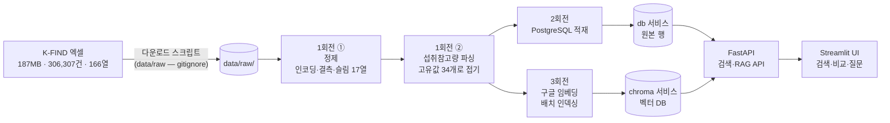
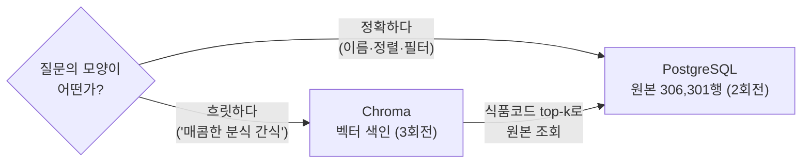
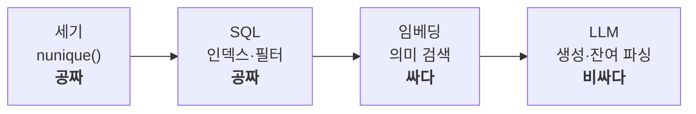
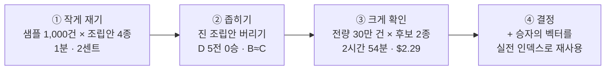

import Slide from 'stack-site-builder/components/Slide.astro';

<Slide class="cover">

# AI 서비스 엔지니어링: Track A

4주차 · 데이터 수집·정제와 RAG 검색

*CodeCompose · 2026-08-14*

</Slide>

<Slide class="center">

## 3주차의 foods.json은 깨끗했습니다

누가 미리 치워둔 결과였습니다

오늘은 치우기 전의 원본을 만납니다

</Slide>

<Slide>

## 오늘 만드는 것: "가공식품 영양 탐색기"
::sub[30만 건 정제 → PostgreSQL → 키워드 검색 + 의미 검색·질의응답]

- **데이터**: 식약처 가공식품 DB (187.42 MiB, **306,307행 × 166열**, 2026-07-28판)
  - 3주차 음식 DB(2만 건·11열)의 15배 규모, 그리고 더럽습니다
- **산출물**: 전량 306,307건 정제 데이터셋 + 그것을 소비하는 검색·RAG 서비스
- 회전마다 릴리즈 태그와 함께 **데이터 산출물**도 배포합니다
- 다만 **정제는 원칙만 얻고 빠르게 지나갑니다.**
  오늘의 본론은 그 데이터셋 위에 세우는 **RAG 검색**입니다
  - 30만 건은 컨텍스트에 다 안 들어가고, 전량 LLM은 비쌉니다
  - 그 문제를 **검색으로** 푸는 것이 오늘의 이야기입니다

</Slide>

<Slide>

### 이 자료, 내 컴퓨터에서 볼 수 있습니다
::sub[클론해서 띄우고, 새 자료는 git pull로]

```bash
git clone https://github.com/2026-ai-service-engineering-a/ai_service_engineering-track_a
cd ai_service_engineering-track_a
docker compose up --build      # → http://localhost:4321
```

- 새 자료가 올라오면: `git pull` 한 뒤 다시 `docker compose up --build`
- Docker가 처음이면: 사이트의 글 "Docker와 Docker Compose, 처음이라면" 참고

</Slide>

<Slide>

### 세션 목표 (1/2)
::sub[정제안됨 3종과 각각의 처방]

- **인코딩 오염** (BOM, 제어문자, 깨진 문자)
  - 고칠 수 있으면 고치고, 못 고치면 사유를 붙여 분리
- **결측** (무작위가 아닙니다. 166열이 꽉 찬 38열과 텅 빈 125열로 갈립니다)
  - 결측 정책과 컬럼 슬림
- **비정형** (자유 텍스트로 보이는 "1회 섭취참고량")
  - 파싱: 먼저 세고, 규칙 우선, LLM은 잔여

</Slide>

<Slide>

### 세션 목표 (2/2)

- **데이터를 안 보고 견적을 내지 않기**:
  샘플 1,000건에 쓴 2센트가 전량 실험을 절반 값으로 만듭니다
- 재현성의 원칙: **원본은 레포 밖, 받는 방법은 레포 안**
- 저장소의 역할 분담: 정확 질의는 PostgreSQL, 의미 검색은 Chroma
- LLM의 새로운 자리: 런타임 서비스가 아니라 **배치 데이터 처리 도구**
- RAG의 첫 개념: **다 주지 말고, 찾아서 준다**
- 비용 사다리: 세기(공짜) → SQL(공짜) → 임베딩(싸다) → LLM(비싸다)
- 정제의 검증: **코드가 아니라 리포트로 검증합니다**

</Slide>

<Slide>

### 3주차와 달라지는 것

| 구분 | 3주차 (식단 플래너) | 4주차 (가공식품 탐색기) |
| --- | --- | --- |
| 데이터 | 음식 DB (11MB·2만 건·11열, 깨끗함) | **가공식품 DB** (187MB·306,307건·166열, 더러움) |
| 데이터 취급 | 미리 정제된 스냅샷을 소비 | 정제 과정을 개념 수준으로 시연 |
| 저장 | json → 메모리 로드 | **PostgreSQL** + **Chroma** |
| 검색 | 없음 (코드가 후보 주입) | 키워드(SQL) + **의미 검색**(임베딩) |
| LLM의 자리 | 런타임 서비스 (계획자·검증자) | **배치 파싱 + RAG 답변** |
| 비용 | 호출당 몇 센트 | **견적을 먼저 내고 줄인다** |
| 원본의 위치 | 레포 안 (작아서 가능) | **레포 밖**, 스크립트가 재현 보장 |

</Slide>

<Slide>

## 오늘의 흐름
::sub[회전마다 릴리즈를 자르고, 실행은 그 태그에서]

1. 브리핑: 더러운 데이터의 세계와 비용 사다리
2. 시연 1: **v0.1** 투어 + 원본 관찰
3. 시연 2: Git Flow 1회전 (`feature/clean`) → **v0.2**
4. 시연 3: Git Flow 2회전 (`feature/pg-service`) → **v0.3**
5. 시연 4: Git Flow 3회전 (`feature/rag-search`) → **v1.0**
6. 되돌아가기: 3주차 식단 플래너 고쳐 보기 (v2.0 → v2.1)

회전마다 "이런 지시로 만들어졌고, 이 태그에서 돌리면 이렇게 나온다"가 짝이 됩니다

</Slide>

<Slide class="center">

## Part 1: 브리핑

더러운 데이터의 세계,

그리고 비용 사다리

</Slide>

<Slide>

### 데이터: 3주차와 같은 곳, 다른 몸집

- **출처**: [식품안전나라 K-FIND 식품영양성분 DB 내려받기](https://various.foodsafetykorea.go.kr/nutrient/general/down/historyList.do)
- **대상**: "가공식품 DB". 2026-07-28판이 187.42 MiB에 306,307행 × 166열
- 성격 차이가 더러움의 원인입니다
  - 음식 DB는 **분석 기반**(연구 데이터)
  - 가공식품 DB는 **표시사항 수집 기반**(제품 라벨을 긁어모은 것)
- 그래서 영양 필드 대부분이 비고, 표기가 제각각입니다
- 187MB짜리 원본은 레포에 넣지 않습니다

</Slide>

<Slide>

### 전수 조사한 실물
::sub[숫자는 전부 306,307건 기준 실측치]

| 유형 | 규모 | 실물 |
| --- | --- | --- |
| 인코딩 오염 | **54건 (0.018%)** | NFD 30 · 제어문자 10 · 대체불가 문자 6 · BOM 5 · 앞뒤공백 3 |
| 결측 | **38열은 1% 미만, 125열은 90% 이상** (11열은 100%) | 식별·출처 29열과 라벨 의무 표시 9종은 0.0\~0.03% · 수분 99.8% · 철 98.5% |
| 비정형 | **고유값 34개** | `30g`(44,134건) · `드레싱 15g, 덮밥소스 165g`(9,762건) · `1식`(3,138건) |

</Slide>

<Slide class="center">

### 세 줄 다 예상과 다릅니다

더러움은 생각보다 **희귀하고**,

결측은 무작위가 아니라 **제도를 따라 갈리고**,

자유 텍스트인 줄 알았던 열은 사실 **통제 어휘**였습니다

셋 다 데이터를 열어봐야 알 수 있는 것들입니다

</Slide>

<Slide>

### 결측: "대부분 비어 있다"가 아닙니다

| 결측 | 열 수 | 어떤 열인가 |
| --- | --- | --- |
| 1% 미만 | **38열** | 식별·분류·출처·제조사 등 메타데이터 29열 + 라벨 의무 표시 영양성분 9종 |
| 1\~90% | 3열 | 1회 섭취참고량 18.3% · 식품중량 5.3% · 원산지국코드 78.0% |
| 90% 이상 | **125열** | 나머지 영양성분 전부. 그중 11열은 한 건도 없이 100% |

- 가운데가 거의 비어 있습니다. 어중간하게 찬 열은 셋뿐입니다
- 라벨에 적을 의무가 있으면 채워지고, 없으면 수집될 원천 자체가 없습니다
- **결측률이 데이터의 성질이 아니라 제도를 비추고 있습니다**

</Slide>

<Slide>

### 파이프라인 전체 그림



</Slide>

<Slide>

### 이 그림에서 읽을 것

- 왼쪽 절반(수집에서 파싱까지)이 이번 주 산출물 **정제 데이터셋**
- 오른쪽 절반(PostgreSQL에서 UI까지)이 그것을 **소비하는 서비스**
- 저장소는 두 개입니다. 2회전이 compose에 `db` 서비스를, 3회전이 `chroma`를 더합니다
  - **서비스 추가가 compose.yml 몇 줄인 것**, 이것이 compose의 장점입니다
- 파이프라인은 **몇 번이고 다시 돌릴 수 있어야 합니다**
  - 원본이 갱신되면 스크립트 재실행으로 DB와 색인이 재생산됩니다

</Slide>

<Slide>

### 저장소는 왜 두 개인가



- 벡터 검색은 유사도 순으로만 주므로 정렬·집계·페이지네이션을 못 하고,
  SQL은 글자가 다른 동의어("매콤한 분식"과 "떡볶이")를 못 잇습니다
- **원본은 한 벌, 색인은 옆에 둡니다.** 답의 근거가 항상 원본 한 곳에서 나옵니다
- 2주차엔 왜 하나였고, 3주차엔 왜 메모리였고, 이번 주는 왜 둘인가.
  **이 답을 갖고 있으면 10주차 기획에서 저장 고민이 끝납니다**

</Slide>

<Slide>

### LLM의 자리: 기본은 배치, 런타임엔 답변 한 곳

- 키워드 검색 서비스에는 **LLM이 없습니다**. 정제된 데이터와 SQL이면 충분합니다
  - "AI가 필요 없는 곳에 안 쓰는 것도 설계"
- LLM은 1회전의 **잔여 파싱**에 등장합니다
  - 규칙(정규식)이 못 푸는 섭취참고량을 instructor로 구조화합니다
- 배치 LLM은 런타임 LLM과 다릅니다.
  중간 저장·재개가 되고, 건너뛴 건 기록하고, 비용 상한을 정해두고 돌립니다
- 런타임 LLM은 3회전에 딱 한 곳 돌아옵니다
  - 그때도 **검색이 추린 몇 건만** 들고 옵니다

</Slide>

<Slide>

### 세고, 규칙 우선, LLM은 잔여
::sub[앞의 두 층이 공짜라 순서가 곧 비용입니다]

- **세기**: 30만 건이 실은 34개 문자열이었습니다
  - 값의 종류를 먼저 세면 **견적의 분모가 바뀝니다.**
    이후 모든 층이 30만이 아니라 34를 상대합니다
- **규칙**: 그 34개 중 28개는 정규식이 풉니다
  - 결정적(같은 입력 → 같은 출력)이고, 무료이고, 즉시입니다
  - 이 층이 행으로는 227,282행을 걷어냅니다
- **LLM**: 남은 5개만 갑니다. 유연하지만 비결정적·유료라 마지막에

이 순서가 없으면 "30만 건 LLM 파싱은 얼마죠?"에서 시작하게 되고,
그 질문은 처음부터 틀렸습니다

</Slide>

<Slide class="center">

## RAG: 다 주지 말고, 찾아서 준다

30만 건은 컨텍스트에 안 들어갑니다

</Slide>

<Slide>

### 순진한 방법: 통째로 넣기

"나트륨 낮은 매콤한 분식 간식 뭐 있어?"에 LLM으로 답하고 싶다고 합시다.

- 가장 순진한 방법은 데이터를 통째로 컨텍스트에 넣는 것입니다
- 30만 건은 수백만 토큰이라 **애초에 들어가지 않습니다**
- 1,000건만 잘라 넣어도 호출당 수만 토큰, 질문 하나에 수십 원씩
- 그리고 그 값을 **호출할 때마다** 냅니다

</Slide>

<Slide>

### 그래서 RAG는 순서를 뒤집습니다


- 컨텍스트가 수만 토큰에서 수백 토큰으로 줄고, **컨텍스트가 곧 비용**입니다
- 인덱스에 30만 건이 있든 3천만 건이 있든 LLM이 받는 것은 늘 다섯 건입니다

</Slide>

<Slide>

### 검색의 눈이 임베딩입니다

- 텍스트를 **의미가 보존되는 벡터**로 바꾸면
  "매콤한 분식"과 "떡볶이"가 가까운 점이 됩니다
- 키워드가 못 잇는 것을 의미가 잇습니다
- 구글 임베딩 API(`gemini-embedding-001`)를 LiteLLM 경유로 씁니다
  - 3주차의 호출 관례 그대로입니다
- LLM 생성과는 **가격 자릿수가 다릅니다**
  - 100만 토큰에 $0.15 수준 (정확한 값은 요금표에서)

</Slide>

<Slide>

### 비용 사다리



- 1회전의 "세고, 규칙 우선, LLM은 잔여"와 같은 원칙의 검색판입니다
- **싼 층에서 풀리는 문제를 비싼 층으로 가져가지 않는 것**,
  이번 주 전체를 관통하는 원칙입니다

</Slide>

<Slide>

### 회전과 릴리즈 사다리

| 회전 | 브랜치 | 릴리즈 | 받을 것 | 어디서 |
| --- | --- | --- | --- | --- |
| (시작점) | | v0.1 | 없음 | 코드만 |
| 1회전 정제 + 파싱 | `feature/clean` | v0.2 | `week04-v0.2-data.tar.gz` (21MB) | 릴리즈 자산 |
| 2회전 PostgreSQL 검색 | `feature/pg-service` | v0.3 → v0.3.1 | `week04-v0.3-data.tar.gz` (34MB) | 릴리즈 자산 |
| 3회전 RAG 검색 | `feature/rag-search` | v1.0 → v1.0.1 | `week04-v1.0-data.tar.gz` (34MB) | 릴리즈 자산 |
| | | | `chroma_foods.tar.gz` (1.6GB) | Google Drive |

- **자산은 누적입니다.** v1.0 것 하나에 1·2회전 산출물이 다 들어 있습니다
- 태그가 둘인 회전은 릴리즈 뒤에 버그를 찾아 hotfix를 낸 것입니다

</Slide>

<Slide class="center">

## 시연 1: v0.1 투어 + 원본 관찰

</Slide>

<Slide>

### 시작점은 태그에서

```bash
git clone https://github.com/2026-ai-service-engineering-a/week04-food-data-pipeline.git
cd week04-food-data-pipeline
git switch -c week04 v0.1   # v0.1 태그에서 작업 브랜치 생성
```

- 기본 브랜치 `main`은 완성본이라, 그냥 클론하면 **정답을 받습니다**
- 회전마다 태그를 자릅니다: v0.1(시작) → v0.2(정제·파싱) → v0.3(검색) → v1.0(RAG)
- 회전 사이의 차이는 `git diff v0.2 v0.3`처럼 봅니다

</Slide>

<Slide>

### 다음 회전으로 넘어갈 때는 대문자 `-C`

```bash
git switch -C week04 v0.2   # 이미 있는 week04를 v0.2로 옮긴다
git describe --tags         # → v0.2   (제대로 왔는지 확인)
```

- `-c`는 "새로 만들기"라 브랜치가 이미 있으면 막힙니다
  - `fatal: a branch named 'week04' already exists`
- **프롬프트에는 태그가 안 뜹니다.** 브랜치에 올라탄 상태라 `week04`만 보이고,
  편집기 그래프에는 `origin/main`이 맨 위에 그려집니다. 둘 다 정상입니다
- 내 위치는 `git describe --tags`가 알려 줍니다

</Slide>

<Slide>

### v0.1 띄우기: 도착지를 먼저 보여줍니다

```bash
cp .env.example .env
docker compose -f docker-compose.yml -f docker-compose.dev.yml up -d
docker compose ps        # api · ui 두 서비스 (db·chroma는 2·3회전이 추가)
```

- UI를 열면 **탭 세 개가 이미 보입니다**: 검색·의미 검색·질문
  - 다만 셋 다 "N회전에서 살아나는 탭입니다"라고 말할 뿐입니다
- 위에는 `파이프라인 0/5 단계 완료`. 원본·정제·파싱·적재·색인이 빈 동그라미로
- v0.1이 v1.0이 되는 순간은 코드가 아니라
  **이 동그라미들이 채워지고 탭이 하나씩 살아나는 순간**입니다
- UI가 회전 번호를 아는 것은 아닙니다. **엔드포인트가 답하는지**로 판단합니다

</Slide>

<Slide>

### 다운로드: 자동화하지 않은 것이 요점입니다

```plaintext
[list] 제공 중인 가공식품 DB 버전을 조회합니다…
[list] 2건
  - 2024-09-25     51.97MB  (식품의약품안전처)
────────────────────────────────────────────────
내려받기는 브라우저에서 진행합니다. K-FIND가 파일을 주기 전에
기관유형·소속·사용목적을 묻는 짧은 설문을 받기 때문입니다.
```

- 인증이 아니라 **설문**이고, 답은 사람이 해야 합니다
- 스크립트가 아무 값이나 채워 통과시키는 것은 제공자와의 약속을 우회하는 일입니다
- 대신 그 앞뒤를 자동화했습니다. **안 하기로 한 결정도 코드에 남습니다**
- Open-API 경로는 대조군입니다. 인증키가 필요하고, 09\~19시에만 응답합니다

</Slide>

<Slide>

### 검증부터 합니다

```bash
docker compose exec api uv run python scripts/download_file.py \
  --verify data/raw/20260728_가공식품DB_306307건.xlsx
```

```plaintext
[verify] 크기: 187.42 MiB · 행수: 306,307 · 열수: 166
[verify] ✓ 필수 컬럼 6개 확인
[verify] SHA-256: 3861e9df7f9565288ed5c03768a30d0b9780b72639a3d645b337982e72a08c5b
```

- **30초짜리 검증이 3시간짜리 배치를 구합니다**
- 필수 컬럼 6개를 통과하면 최소한 스키마 때문에 죽지는 않습니다
- **해시를 README에 적어두는 이유는 재현입니다**
  - "리포트 숫자가 문서와 다른데요"에 먼저 물을 것은 **같은 파일을 보고 있느냐**
  - 데이터에도 버전이 있고, 해시가 그 버전의 이름입니다

</Slide>

<Slide>

### 원본이 없어도 오늘을 따라올 수 있습니다

- 187MB 원본은 저장소에도 릴리즈에도 없습니다
  - K-FIND가 설문을 받기 때문에, 재배포 대신 **받는 방법**을 저장소에 뒀습니다
- **정제·파싱·적재·색인의 산출물이 전부 릴리즈로 배포됩니다**
  - `data/dist/`에 두고 `compose up` 하면 원본을 안 만지고 v1.0까지 갑니다
- 원본이 입력인 명령은 셋뿐입니다
  - `pipeline.clean` · `--verify` · `make_sample.py`
  - 이 셋은 "이렇게 만들어졌다"를 보여 주는 참고로 읽으세요

</Slide>

<Slide>

### 원본 관찰: 이 샘플은 무작위가 아닙니다

- 인코딩 오염이 306,307건 중 54건(0.018%)뿐입니다
- 무작위로 1,000건을 뽑으면 기대값이 0.18건, 대체로 한 건도 안 잡힙니다
- 그래서 **희귀 케이스 40건 + 계통 추출 960건**의 층화 샘플로 만들었습니다
- 일부러 심었다는 사실 자체가 오늘의 첫 교훈입니다
  - **희귀 결함은 찾아 나서야 보입니다**
- 결측률·섭취참고량 분포 같은 "전체의 성질"은 계통 추출 층이 보존합니다
- 이 샘플도 같은 해시의 원본에서 나왔습니다. **커밋된 데이터에도 출처가 있어야 합니다**

</Slide>

<Slide>

### 샘플을 열어 봅니다

```bash
# -T는 TTY 할당을 끕니다. heredoc은 stdin이 터미널이 아니라 파이프라,
# 이게 없으면 "cannot attach stdin to a TTY-enabled container"로 죽습니다
docker compose exec -T api uv run python - <<'EOF'
import pandas as pd
df = pd.read_csv("data/sample/raw_sample.csv")
# ① 인코딩 오염  ② 결측률  ③ 섭취참고량 — 먼저 세어본다
print(f"고유값 {df['1회 섭취참고량'].nunique()}개")
EOF
```

```plaintext
P114-103010200-0827       ？스타곰탕 냉면 무김치
P101-104000100-1203     우리밀 한입 스콘 초코칩

[의무]  에너지(kcal) 0.0% · 나트륨(mg) 0.0% · 당류(g) 0.0%
[나머지] 식이섬유(g) 97.1% · 칼슘(mg) 96.9% · 수분(g) 99.6%
90%+ 결측 열: 125개 / 전체 166열 · 통째로 빈 열: 13개
고유값 29개 / 빈 값 172건
```

</Slide>

<Slide>

### ①: 두 종류의 오염이 다릅니다

- `？`는 원래 글자가 뭐였는지 **알 수 없습니다**
  - `스팸？마요`는 아마 `스팸&마요`였을 겁니다
- BOM은 **눈에 안 보이지만** 문자열 맨 앞에 붙어 있습니다
- 복구 가능한 것은 고치고, 불가능한 것은 사유를 붙여 빼놓습니다
- **이 갈림이 정제 정책의 첫 결정입니다**

</Slide>

<Slide>

### ②: 결측이 무작위가 아닙니다

- 라벨에 반드시 적어야 하는 9종은 0%, 나머지는 대부분 90%대, 13열은 통째로 비었습니다
- 표시 의무가 없는 성분은 **수집될 원천 자체가 없습니다**
- 함정 하나: 비어 있지 않은 열이 9개인 것은 아닙니다.
  메타데이터 29열도 결측이 0건이라 전량 기준 1% 미만인 열이 38개입니다

**그런데도 17열만 싣습니다.**

- 슬림의 기준은 결측률이 아니라 <strong>이 서비스가 쓰는가</strong>입니다
- 코드와 이름이 쌍이면 이름만, 수입업체·유통업체는 검색에도 답변에도 안 씁니다
- 166개 중 17개. **버린 게 아니라 안 실은 것**이고, 원본은 raw에 그대로 있습니다

</Slide>

<Slide>

### ③: 여기가 오늘의 반전입니다

- 자유 텍스트인 줄 알았던 열의 고유값이 **29개**입니다 (전량 기준 34개)
- 30만 건이 34개 문자열을 나눠 씁니다
- 규정 표준값이라 사실상 **통제 어휘**였습니다
- **이 한 줄이 1회전 견적서를 다시 쓰게 만듭니다**

</Slide>

<Slide class="center">

### 큰 데이터는 작은 데이터로 개발합니다

187MB 엑셀은 여는 데만 몇 분,

관찰용으로는 커밋된 1,000건이 낫습니다

다만 개발이 끝난 파이프라인은 **전량에 태웁니다**

</Slide>

<Slide>

### 오늘의 실행 방식

- 시연하는 파이프라인은 샘플이 아니라 **전량 306,307건**을 대상으로 돕니다
  - 화면에 뜨는 리포트 숫자는 전부 전량 기준 실측치입니다
- 187MB 로딩과 30만 건 임베딩은 2시간 세션 안에 끝나는 일이 아닙니다
  - 무거운 구간은 **미리 돌려 둔 결과**를 보여줍니다
- **회전마다 산출물을 배포합니다.** 받아서 `data/`에 풀고 `compose up`이면
  전량 데이터 위에서 검색과 RAG가 바로 돕니다
- 100MB 이하는 릴리즈 자산, 그보다 큰 것은 Google Drive
  - **원본은 레포 밖, 받는 방법은 레포 안**이 산출물에도 적용됩니다

</Slide>

<Slide class="center">

## 시연 2: Git Flow 1회전

`feature/clean`

정제와 파싱을 한 회전에서,

**비용 사다리의 첫 실전**

</Slide>

<Slide>

### 회전 진행 형식
::sub[모든 회전 공통]

지시 프롬프트 → 무엇이 만들어졌나 → 커밋·PR·머지 후 **릴리즈** →
**릴리즈 버전에서** 실행. 3주차 관례에서 **실행이 릴리즈 뒤로** 갑니다.

다만 이건 재현자의 동선이지 만드는 사람의 작업 순서가 아닙니다.

```bash
git push origin v0.2
#  ! [rejected]  v0.2 -> v0.2 (already exists)
git push origin :refs/tags/v0.2 && git push origin v0.2   # 지우고 다시
```

- 순서를 곧이곧대로 따랐다가 **v0.2를 세 번 다시 잘랐습니다**
- **태그는 "여기서 멈춰도 된다"는 선언입니다.** 멈춰도 되는지 확인한 뒤에 붙이세요

</Slide>

<Slide>

### 1차 지시: 정제

```plaintext
[1단계 — 정제]
- 입력: data/raw/*.xlsx 또는 data/sample/raw_sample.csv (같은 166열 스키마)
- pandas 기반. 처리 내용:
  - 문자열 컬럼의 BOM·제어문자 제거, 앞뒤 공백 정리, 유니코드 NFC 정규화
  - 식품명에 대체불가 깨진 문자가 포함된 행은 별도 목록으로 분리 저장
    (버리지 말고 reports/rejected.csv로 — 사유 컬럼 포함)
  - 컬럼 슬림: 166열 중 17열만 남김
    식별·분류 6 + 라벨 의무 표시 9 + 1회 섭취참고량·식품중량(원문 유지)
  - 영양 수치 결측은 NULL 유지 (0으로 채우지 마 — 0과 모름은 다르다)
  - 정제 후 빈 문자열은 NULL로 되돌려라. 라이브러리가 None을 ""로 바꾸면
    결측이 "값 있음"으로 둔갑한다
```

</Slide>

<Slide>

### 1차 지시: 파싱

```plaintext
[2단계 — 섭취참고량 파싱]
- 파싱하기 전에 df["1회 섭취참고량"].nunique()를 찍고 그 수를 리포트에 남겨라.
- 파싱은 행이 아니라 **고유값 단위**로 한다. 고유값별로 한 번만 풀고 map으로 되붙여라.
- 1차 규칙 파서(정규식): '30g', '200ml' 같은 숫자+단위. 순수 함수 + 유닛테스트
- 2차 규칙 확장: '5g(ml)', '250ml(g)'처럼 단위 병기. ml→g 가정은 note에 남겨라
- 3차 LLM: 규칙이 못 푼 고유값만. LiteLLM 경유(PARSER_MODEL), instructor 사용.
  출력 스키마 ServingInfo — serving_g(int|None), variants, confidence, note
- 숫자로 환산할 수 없으면 serving_g는 NULL — 지어내지 마
- 대표값 선택은 코드가 한다. LLM이 형태를 갈라내면 첫 형태를 대표로
- 배치 안전장치: 고유값 캐시, --llm-limit, 진행 로그
- 출력: parquet + clean_report.txt + parse_report.txt
- 작업 단위마다 커밋
```

</Slide>

<Slide>

### 줄별 의도

- **"파싱 전에 `nunique()`를 찍어라"**: 이번 주에서 가장 값싼 한 줄입니다
  - 이 줄이 없으면 "30만 건이니 LLM 비용이 얼마"라는 계산으로 시작하게 됩니다
- **"행이 아니라 고유값 단위로"**: 비용 설계가 요구사항 문장이 된 자리입니다
  - 같은 문자열을 4만 번 다시 물을 이유가 없습니다
- **"버리지 말고 별도 분리"**: 정제의 제1원칙, **삭제가 아니라 분류**
  - 몇 건이 왜 빠졌는지 설명 못 하는 정제는 검증이 불가능합니다
- **"0으로 채우지 마"**: 나트륨 '모름'을 0으로 채우면 저나트륨 검색이 거짓말을 합니다
  - 이 데이터에는 나트륨이 **진짜 0인 제품**(튀김전용유 같은 유지류)이 있어서,
    모름과 0을 섞으면 구분이 영영 불가능해집니다
- **"리포트 2종"**: 전후 카운트가 안 맞으면 어딘가에서 데이터가 새는 것입니다

</Slide>

<Slide>

### 여기서 두 번 당했습니다

- **"빈 문자열은 NULL로 되돌려라"** 줄이 없어서 한 번
  - pandas 3.0의 문자열 타입이 `None`을 `""`로 바꾸는 바람에
    **결측 55,972건이 "값 있음"으로 둔갑**해 있었습니다
  - 리포트에 결측률이 안 뜨는 게 이상해서 찾았습니다
- **"식품중량도 원문 유지"** 줄이 없어서 또 한 번
  - `500g` 같은 문자열인데 숫자로 바꾸려다 306,301건을 전부 NULL로 만들었습니다
  - 리포트가 "결측률 100%"라고 말해줘서 알았습니다
- 결측 정책은 지시로 선언하는 것만으로는 안 지켜집니다.
  **라이브러리 기본 동작이 조용히 뒤집습니다**

</Slide>

<Slide>

### 코드에서 이 부분

| 파일 | 보는 곳 | 왜 중요한가 |
| --- | --- | --- |
| `pipeline/textclean.py` | `strip_bom_and_controls(s)` | "정제의 최소 단위. 문자열 하나 받아 하나 반환하니 테스트가 쉽습니다" |
| `pipeline/clean.py` | 깨진 문자 행 분리 + 사유 | "삭제가 아니라 분류. rejected에 사유가 남는 지점" |
| `pipeline/clean.py` | `SLIM_COLUMNS` 상수 17개 | "버린 게 아니라 안 실은 것입니다" |
| `pipeline/serving.py` | `unique()` → 파싱 → `map()` | "파싱을 행이 아니라 값의 종류에 겁니다. 같은 문자열을 두 번 풀지 않고, 비싼 층 앞에 둘수록 값을 합니다" |
| `pipeline/serving.py` | `--show-residual` | "잔여를 출력하는 명령이 곧 다음 규칙의 설계도" |
| `schemas/serving.py` | `serving_g: int \| None` | "None이 허용된 스키마. '모름'이 일급 시민입니다" |
| `pipeline/report.py` | 전후 카운트·결측률 집계 | "입력=출력+제외가 안 맞으면 버그입니다" |

</Slide>

<Slide>

### 커밋 → PR → 머지 → 릴리즈 v0.2

```plaintext
d9738df  feat(pipeline): 문자 정리 순수 함수 + 유닛테스트
835cbab  feat(pipeline): 정제 본체 — 분리·슬림·결측 정책 + 리포트
fe6abb0  feat(pipeline): 섭취참고량 파싱 — 세고, 접고, 남은 것만 LLM
f60b46d  feat: data-restore — 받은 산출물을 제자리에 + 1회전 지시 기록
```

| 릴리즈 자산 경로 | 무엇 |
| --- | --- |
| `data/clean/foods_clean.parquet` | 정제 결과. 파싱의 **입력**이라 재실행에 필요 |
| `data/clean/foods_parsed.parquet` | 파싱까지 끝난 것. 2회전 적재의 입력 |
| `data/clean/.serving_cache.json` | 파싱 캐시. 있으면 LLM 호출 0건 |
| `reports/*.txt` · `rejected.csv` | 정제는 리포트로 검증합니다 |

- 태그 하나가 "이 지점의 코드 + 이 지점의 데이터"를 통째로 가리킵니다

</Slide>

<Slide>

### 수강생 재현: 받아서 v0.2에 서기

```bash
git switch -C week04 v0.2       # 처음이면 -c, 이미 만들었으면 -C
cp .env.example .env
mkdir -p data/dist
mv ~/Downloads/week04-v0.2-data.tar.gz data/dist/
docker compose up --build
```

- **압축을 풀 필요도, 경로를 맞출 필요도 없습니다.**
  `data-restore`가 저장소 구조 그대로 제자리에 놓습니다
- 아카이브 안의 경로가 `data/clean/…`인 것도 그래서입니다.
  **열어 보는 것이 곧 설명입니다**
- 두 번 돌려도 안전합니다. 복원 스크립트가 멱등하지 않으면 `compose up`을 두 번 못 합니다

| 이 상태에서 되는 것 | 안 되는 것 |
| --- | --- |
| 리포트 읽기 · 파싱 재실행 · `--show-residual` · 스팟 체크 · 테스트 | `pipeline.clean` (187MB 원본이 입력) |

</Slide>

<Slide>

### 실행 ①: 정제 (전량)

```bash
docker compose exec api uv run python -m pipeline.clean \
  --input data/raw/20260728_가공식품DB_306307건.xlsx
```

```plaintext
[clean] 입력: 306,307행 · 166열
[clean] 문자 정리: 2,048행 고쳐서 실음  식품명 1,143 · 제조사명 909
[clean] 출력: 306,301행 · 17열 → data/clean/foods_clean.parquet
[clean] 제외: 6행 → reports/rejected.csv
[check] 306,307 = 306,301 + 6  → OK
[time ] 1.4분
```

- 검산이 맞습니다. **30만 줄을 사람이 셀 수는 없고, 이 한 줄이 그 일을 대신합니다**
- 리포트가 없었으면 이 6건은 영영 안 보였을 것이고,
  보이지 않는 6건이 나중에 검색 결과에서 이상한 이름으로 튀어나옵니다

</Slide>

<Slide>

### 그런데 고친 것이 2,048행입니다

- 앞에서 센 오염은 54건이었는데요
- 차이는 **내부 중복 공백**입니다
  - `흰다리새우살(두절  탈각  내장제거)`처럼 두 칸씩 벌어진 이름이 2,000건 가까이
- 인코딩 사고는 아니지만 검색에서는 걸림돌이라 같이 정리합니다
- 고칠 수 있는 것은 **고쳐서 싣고**, 대체불가 문자 6건만 **분리합니다**
- **돌려보기 전에는 "오염 54건"이 전부인 줄 알았습니다**

</Slide>

<Slide>

### 제외된 6건 전부

```plaintext
식품코드,식품명,사유
P114-103010200-0827,？스타곰탕 냉면 무김치,대체불가 문자 포함
P123-201020300-2959,햇반컵반 스팸？마요덮밥,대체불가 문자 포함
P123-201020300-2958,햇반컵반 스팸？김치덮밥,대체불가 문자 포함
P116-705060000-1436,프리미엄 곡물 효소 골드 with 카무트？브랜드 밀,대체불가 문자 포함
P109-102010200-2312,인산 사시사철 무？생강진액,대체불가 문자 포함
P117-100010300-0364,동그란스팸？,대체불가 문자 포함
```

- `스팸？마요`는 `스팸&마요`, `동그란스팸？`은 `동그란스팸®`이었을 겁니다
- 추측은 되지만 **확정할 수 없습니다**

</Slide>

<Slide class="center">

### 여기서 정제 정책이 갈립니다

추측해서 고치면 데이터가 더 예뻐지지만
**근거 없는 값**이 들어갑니다

지어내지 않고 사유를 붙여 빼놓는 쪽을 택합니다

이 원칙이 파싱의 NULL로,
3회전 답변의 "모르면 모른다"로 이어집니다

</Slide>

<Slide>

### 실행 ②: 파싱, 먼저 세어본다

```plaintext
[count] 1회 섭취참고량 고유값: 34개 (306,301행 중)
        └ 30만 건이 34개 문자열을 나눠 씁니다. 사실상 통제 어휘입니다.
[rule ] 1차(숫자+g)      16개 고유값 → 166,991행
[rule ] 2차(단위 병기)    12개 고유값 →  60,291행
[llm  ]   5개 고유값 →  19,909행 · 이번 실행 호출 6건
        입력 2,923 tok · 출력 5,753 tok · $0.0039
[none ]   1개 고유값 + 빈 값 → serving_g = NULL (59,110행)
```

- 순서를 보세요. **세고 → 규칙으로 접고 → 남은 것만 LLM**
- 고유값·행수는 몇 번을 돌려도 같지만 **토큰과 비용은 실행마다 달라집니다.**
  LLM이 비결정적이라, 위 숫자는 "이 정도 자릿수"로 읽습니다

</Slide>

<Slide>

### `$0.0039` vs `$16.13`

행 단위로 불렀다면 23,047건 호출로 $16.13, 실제로는 6건에 $0.0039입니다.

- **다만 이 절감을 접기 한 줄의 공으로 돌리면 안 됩니다.**
  23,047행은 정규식이 28개를 걷어낸 **뒤에** 남은 6개 고유값이 덮는 행 수입니다
- 접기와 규칙은 같은 사다리의 다른 칸이고, 절감은 둘이 나눠 가집니다.
  **층을 섞어 한쪽 공으로 돌리면 견적이 또 틀립니다**
- 남는 것은 배율이 아니라 **분모**입니다.
  견적을 행 수로 내면 30만이고, 값의 종류로 내면 34입니다

</Slide>

<Slide>

### 잔여를 눈으로 봅니다

```plaintext
[residual] 규칙이 못 푼 고유값 6개 — 전부 출력합니다
    9,762  드레싱 15g, 덮밥소스 165g
    8,151  생·숙면 200g, 건면 100g, 당면 30g, 유탕면(봉지)120g, 유탕면(용기)80g
    3,138  1식
    1,640  액상 150ml, 호상 100ml(g)
      355  레토르트 200g 기타 25g
        1  분말 20g, 액상 200ml
```

- **30만 건은 못 보지만 여섯 개는 봅니다.** 보고 나면 무엇이 필요한지 압니다
- **잔여를 출력하는 명령이 곧 다음 규칙의 설계도입니다.** 2차 규칙 전에는 잔여가
  12개였고, 그중 여섯이 `5g(ml)` 꼴이라 정규식 한 줄로 흡수했습니다
  - **싼 층을 한 번 더 손보는 것이 비싼 층을 부르는 것보다 늘 낫습니다**
- 마지막 줄은 306,307건 중 **딱 1건**입니다. **이 1건 때문에 LLM 층이 존재합니다**
- `1식`은 정직하게 NULL입니다. 데이터에 답이 없고, LLM에 물으면 지어냅니다

</Slide>

<Slide>

### 파괴적 동작은 기본값이 아니어야 합니다

```plaintext
[abort] --llm-limit 1로는 잔여 6개를 다 못 풉니다.
        지금 저장하면 기존 foods_parsed.parquet이 반쪽 결과로 덮입니다.
        관찰만 하려면 --dry-run, 정말 다시 만들려면 상한을 올리세요.
```

- 상한을 1로 걸면 나머지 고유값이 `none`으로 남는데,
  그 반쪽 결과가 완성된 30만 행짜리 parquet을 덮어씁니다
- 실제로 한 번 당해서 llm 19,909행이 통째로 사라졌습니다
- **관찰하려던 명령이 산출물을 망가뜨리면,
  그건 쓰는 사람 잘못이 아니라 만든 사람 잘못입니다**

</Slide>

<Slide>

### LLM이 실제로 받은 것·뱉은 것

```plaintext
[debug] PARSER PROMPT ─ system: 원문에 있는 것만 옮겨라. 지어내지 마라. 숫자로
  환산할 수 없으면 serving_g를 null로 두고 note에 이유를 적어라.
[debug] PARSER PROMPT ─ user: 원문: '1식'
[debug] PARSER RAW OUTPUT: {"serving_g": null, "variants": [], "confidence": "low",
  "note": "원문에는 '1식'만 있으며 중량 정보가 없어 숫자로 환산할 수 없음."}
```

- **모델이 지어내지 않았습니다.** 스키마의 `int | None`이 그 선택지를 열어 두었기 때문
  - 타입이 없으면 지시만으로는 잘 안 지켜집니다
- 복합형에서는 반대로 일합니다. 다섯 형태를 갈라내는 **한 번의 호출이 8,151행을 채웁니다**

</Slide>

<Slide>

### 캐시 증명, 그리고 전수 스팟 체크

```plaintext
[skip ] 캐시에서 6개 고유값 건너뜀 (data/clean/.serving_cache.json)
[llm  ]   5개 고유값 →  19,909행 · 이번 실행 호출 0건 (전부 캐시)
[cost ] 이번 실행          $0.0000  (캐시 적중 — 두 번째부터는 공짜다)
```

- 리포트가 **"5개 고유값"과 "이번 실행 호출 0건"을 나눠 말합니다.**
  뭉뚱그렸다가 캐시 실행에서 "5건 호출"이라 거짓말하는 걸 보고 갈랐습니다
- **캐시는 비싼 것만 담습니다.** 규칙이 푸는 28개는 저장할 이유가 없습니다
- llm 파싱분이 고유값 5개뿐이라 **표본 검사가 아니라 전수 검사**입니다.
  접었더니 검증까지 싸졌습니다
- `pytest -q` → `37 passed`

</Slide>

<Slide>

### 배포물은 네 번 고쳤습니다
::sub[넷 다 같은 실수에서 나왔습니다]

- **처음엔 결과물만 줬습니다.** 파싱의 입력인 `foods_clean.parquet`이 빠져
  재실행이 전부 죽었습니다. 배포물은 "결과"가 아니라 **그 지점을 재현할 수 있는 것**
- **다음엔 파일명.** 릴리즈가 점으로 시작하는 이름을 안 받아서
  "이름을 바꾸세요"라고 적을 뻔했습니다. **배포 경로의 사정은 배포 경로가 흡수해야 합니다**
- **그다음엔 개수.** 자산 여섯 개면 여섯 번 클릭이고, 하나 빠뜨려도 조용히 실패합니다
- **마지막은 아카이브 안의 모양.** 저장소 구조를 그대로 담으니
  **열어보는 것이 곧 설명**이 됐습니다

**배포물은 받는 자리에서 확인해야 합니다**

</Slide>

<Slide class="center">

## 시연 3: Git Flow 2회전

`feature/pg-service`

정제 데이터셋을 PostgreSQL에 적재하고,

검색 서비스로 UI를 살립니다

</Slide>

<Slide>

### 2차 지시

```plaintext
2단계: PostgreSQL 적재와 검색 API를 만들어줘.

- docker-compose.yml에 db 서비스 추가: postgres 이미지, data/pg 볼륨에 영속
- foods_parsed.parquet → db의 foods 테이블 적재 스크립트
  - 한글 컬럼명은 경계에서 영문으로 갈아타라. SQL에 그대로 쓰면 매번 따옴표를
    붙여야 하고 오타가 조용히 지나간다
  - 인덱스: 식품명, 대분류, 나트륨, 당류, 에너지. 부분 일치이므로 pg_trgm
  - 30만 행 적재는 INSERT 반복이 아니라 COPY로. 인덱스는 적재 뒤에 만들어라
  - 상한 필터는 NULL을 통과시키지 마라 — '모름'을 '이하'로 세면 안 된다
  - 정렬 키는 화이트리스트로만 받아라 (SQL에 이어 붙는 자리다)
- 검색 API: GET /foods — 키워드·분류·상한 필터·정렬·페이지네이션
- 상세 API: GET /foods/{code} — 100g 기준값과 1회 제공량 환산값
- LLM 없음 — 이 서비스는 SQL이면 충분하다
- 작업 단위마다 커밋
```

</Slide>

<Slide>

### 줄별 의도

- **db 서비스가 이번 주 첫 인프라 추가**입니다
  - 2주차 PostgreSQL이 같은 모양으로 돌아오고, compose에서는 블록 하나
  - 3회전의 chroma가 이 패턴을 한 번 더 반복합니다
- **"COPY로"** 한 줄이 30만 행에서 분 단위와 시간 단위를 가릅니다
- **"LLM 없음"** 줄을 일부러 넣습니다
  - AI를 안 쓰는 결정도 지시에 명시된다는 것을 보여주는 줄입니다
  - 이 줄은 3회전에서 뒤집히는 것이 아니라 **정교해집니다**

</Slide>

<Slide>

### 코드에서 이 부분

| 파일 | 보는 곳 | 왜 중요한가 |
| --- | --- | --- |
| `docker-compose.yml` | 새 `db` 서비스 블록 | "2주차 PostgreSQL의 재등장. 서비스 추가는 블록 하나" |
| `pipeline/load_pg.py` | `COPY ... FROM STDIN` | "30만 행을 INSERT로 넣으면 커피를 마시고 와야 합니다" |
| `pipeline/load_pg.py` | `INDEXES` 리스트 | "30만 건에서 검색이 안 느린 이유가 이 여섯 줄" |
| `app/foods.py` | 필터 조합 쿼리 빌더 | "LLM 없이 SQL만. AI가 필요 없는 곳입니다" |
| `app/foods.py` | `SORTS` + `SORT_TIEBREAK` | "정렬 키가 하나면 동점 사이 순서가 안 정해집니다" |
| `app/foods.py` | `if serving_g is None` 분기 | "1회전의 NULL 정책이 API 응답까지 관통하는 지점" |

</Slide>

<Slide>

### v0.3 릴리즈와 재현

```bash
git switch -C week04 v0.3.1     # v0.3 뒤에 정렬 버그를 고쳤습니다
mkdir -p data/dist
mv ~/Downloads/week04-v0.3-data.tar.gz data/dist/
docker compose up --build
```

```plaintext
data-restore(완료) → db(healthy) → db-restore(완료) → api
```

- 자산이 **누적**입니다. "v0.2도 따로 받으세요"라고 하면 한 번은 반드시 빠뜨립니다
- **1회전과 방식이 다릅니다.** parquet은 파일을 옮기면 끝이지만,
  덤프는 PostgreSQL이 **받을 준비가 된 뒤에야** 넣을 수 있습니다
- `condition: service_healthy`를 겁니다.
  **컨테이너가 뜬 것과 받을 준비가 된 것은 다릅니다**

</Slide>

<Slide>

### 적재: 30만 행이 3초

```plaintext
[load ] 306,301행 · 21열 → db:5432/food
[copy ] 306,301행 · 3.0초 · 103,560행/초
[index] 6개 · 2.0초
[done ] foods 306,301행 · serving_g 있는 행 247,191 (80.7%)
```

- 1회전 리포트의 출력 행수와 같습니다.
  **정제에서 적재까지 숫자가 한 번도 어긋나지 않았습니다**
- **인덱스는 적재 뒤에** 만듭니다. 먼저 만들면 행마다 트리를 갱신하느라
  붓는 동안 계속 느려집니다
- **규모가 커지면 "어떻게 넣는가"가 성능 요구사항이 됩니다**
- 받아 쓴 사람은 이 적재를 안 돌립니다. 덤프가 같은 306,301행을 이미 넣어 뒀습니다

</Slide>

<Slide>

### 검색 API

```bash
curl -s -G localhost:8000/foods --data-urlencode "q=떡볶이" \
  -d sort=sodium_desc -d limit=3 | jq '.total, (.items[] | {name, sodium_mg, serving_g})'
```

```json
2703
{ "name": "떡볶이분말 보통맛", "sodium_mg": 7756, "serving_g": null }
{ "name": "오리지널 떡볶이용 소스", "sodium_mg": 5938, "serving_g": 15 }
```

- 떡볶이가 **2,703건**입니다. 3주차 음식 DB 전체가 2만 건이었습니다
- 7,756mg은 분말이라 그렇습니다. 그래서 1회 제공량이 필요한데 여기는 NULL입니다
- **한글을 URL에 그대로 쓰면 안 됩니다.** uvicorn이 요청 라인의 비-ASCII를 거부해
  400을 주고, `jq`는 그 문장을 읽으려다 죽습니다.
  **URL 인코딩은 클라이언트의 일**입니다

</Slide>

<Slide>

### 키워드 검색의 두 한계

```bash
curl -s -G localhost:8000/foods --data-urlencode "q=매콤한 분식 간식" | jq '.total'
#  → 0    ① 글자가 다르면 0건. "매콤한 분식"과 "떡볶이"는 SQL에게 남남입니다
```

```json
// ② 글자가 같으면 엉뚱한 게 걸린다 — "q=튀김", 나트륨 오름차순
{ "name": "연두부튀김", "category_big": "두부류 또는 묵류", "sodium_mg": 0.0 }
{ "name": "해피스푼콩기름튀김전용유", "category_big": "식용유지류", "sodium_mg": 0.0 }
{ "name": "튀김전용콩식용유", "category_big": "식용유지류", "sodium_mg": 0.0 }
```

- "나트륨 낮은 튀김"을 찾았더니 **튀김전용유**가 나옵니다
- 기름이니 나트륨이 0인 게 맞고, SQL도 틀리지 않았습니다. **글자만 봤을 뿐입니다**
- 여기 `sodium_mg: 0`은 **진짜 0**입니다
  - 결측을 0으로 채웠다면 진짜 0과 모름이 뒤섞여 구분할 방법이 없었을 겁니다
  - 1회전의 "0으로 채우지 마"가 여기서 값을 합니다

</Slide>

<Slide class="center">

### 두 실패가 짝입니다

하나는 **의미가 같은데 글자가 달라서** 0건

다른 하나는 **글자가 같은데 의미가 달라서** 헛것

이 둘이 3회전의 출발점입니다

</Slide>

<Slide>

### 여기서 발견한 버그: 1페이지의 행이 2페이지에 또

```plaintext
1페이지: P107-101010100-0045  P107-301030100-0069  P107-103010300-0064  P107-301030100-0145
2페이지: P107-301030100-0145  P107-117010100-0001  P107-101010100-0085  P107-101010100-0253
          ^^^^^^^^^^^^^^^^^^ 1페이지에 이미 나온 행
```

```python
SORT_TIEBREAK = "code asc"      # 유일한 값을 마지막 정렬 키로 붙여 전순서로
```

- 원인은 `order by sodium_mg asc` 한 줄. **동점 사이 순서를 안 정해 줬습니다**
- 나트륨이 정확히 0인 행만 **27,219개**라 동점은 예외가 아니라 기본입니다
- 이 버그는 **테스트가 아니라 교안을 쓰다가** 나왔습니다.
  **재현 가능한 문서를 쓰는 일이 곧 검증입니다**

</Slide>

<Slide>

### 상세: 파싱 결과가 쓰이는 곳

```json
{ "name": "오리지널 떡볶이용 소스",
  "per_100g": { "sodium_mg": 5938.0 },
  "per_serving": {
    "serving_g": 15, "method": "llm", "sodium_mg": 890.7,
    "variants": [
      { "form": "드레싱",   "grams": 15,  "sodium_mg": 890.7 },
      { "form": "덮밥소스", "grams": 165, "sodium_mg": 9797.7 }
    ] } }
```

- 5,938mg이 890.7mg이 됩니다. 1회전에서 LLM이 갈라낸 "드레싱 15g"이 여기서 일합니다
- 덮밥소스로 쓰면 165g이라 9,797.7mg이고, **그 선택지까지 화면에 남습니다**
- 대표값 하나로 줄이지 않은 1회전의 결정이 여기서 값을 합니다

</Slide>

<Slide>

### NULL 케이스와 UI 전환

```json
{ "serving_g": null, "note": "1회 제공량 정보 없음 (원문: '')" }
```

- 모르는 것은 모른다고 답합니다. **정직한 NULL이 사용자 신뢰입니다**
- UI를 새로고침하면 **빈 상태 화면이 검색 화면으로** 바뀝니다
  - UI 코드는 v0.1 그대로입니다 (헤드리스 분리의 증명, 3주차와 같은 장면)
- 1회전의 정제와 파싱이 없었으면
  **이 화면의 숫자는 전부 거짓말이거나 빈칸이었습니다**

</Slide>

<Slide class="center">

## 시연 4: Git Flow 3회전

`feature/rag-search`

이번 주의 클라이맥스.

2회전이 남긴 두 실패에서 시작합니다

**검색 우선, LLM은 답변만**

</Slide>

<Slide>

### 먼저: 무엇을 임베딩할 것인가

- 검색 품질은 **모델이 아니라 여기서** 갈립니다. 답은 데이터마다 다릅니다
- 1회전에서는 고유값 34개로 접혔지만, **식품명은 30만 건이 전부 다릅니다**
- 이 데이터에서는 그럴듯한 첫 후보인 "식품명"이 약합니다
  - 식품명 평균이 **10.4자**입니다. `소금빵`, `직화짜장덮밥소스`
  - 브랜드·외국어가 섞입니다. 사람도 이름만 보고는 무엇인지 모릅니다
- 반면 **분류 체계가 훨씬 강한 신호**입니다
  - 대·중·소·세분류가 전부 결측 0%, 소분류만 219종. 사람이 이미 붙여둔 라벨입니다

</Slide>

<Slide>

### 그런데 분류를 그대로 이어 붙이면 안 됩니다

```plaintext
파네토네 클라시코 · 과자류·빵류 또는 떡류 · 해당없음 · 빵류 · 해당없음
직화짜장덮밥소스 · 조미식품 · 소스류 · 소스 · 해당없음
```

- **`해당없음`이 문제입니다.** 30만 건 대부분에 공통으로 들어가는 문자열이
  벡터를 전부 같은 방향으로 밀어 유사도를 희석시킵니다
- **제조사명은 뺄 후보입니다.** 고유 제조사가 32,208개,
  `DE MATTEIS AGROALIMENTARE S.P.A` 같은 긴 법인명이 텍스트의 절반을 차지합니다
  - 제조사로 찾는 일은 SQL의 몫입니다

</Slide>

<Slide>

### 정답을 추측하지 말고 재봅니다



- ①에서 **후보를 넓게** 잡습니다. 싸니까 틀린 안도 넣어 봅니다
- ②에서 **버립니다.** 안 버리면 ③의 비용이 후보 수만큼 곱해집니다
- ④에서 승자의 벡터는 **그대로 실전 인덱스가 됩니다**

</Slide>

<Slide>

### ① 작게 재기: 조립안 4종

```plaintext
[조립안 실물] 같은 행을 네 가지로 조립하면
  A name             흰다리새우살(두절  탈각  내장제거  꼬리유) 750G
  B name+cat_raw     … · 수산가공식품류 · 기타 수산물가공품 · 해당없음
  C name+cat         … · 수산가공식품류 · 기타 수산물가공품
  D name+cat+maker   … · 수산가공식품류 · 기타 수산물가공품 · CA MAU SEAFOOD PROC

[평균 길이] A 10.4자 · B 37.0자 · C 34.0자 · D 49.0자
```

- 1,000건 × 4종 = 4,005건을 임베딩하고 질의 5개
- **59초, 119,284토큰, 2센트.** 전량 인덱싱의 1/100 비용으로 결정 근거를 삽니다

</Slide>

<Slide>

### ② 좁히기: 예상이 반쯤 빗나갔습니다

| 질의 | 이긴 조립안 | 왜 |
| --- | --- | --- |
| 매콤한 분식 간식 | **C** | A는 먹태·찹쌀과자를 물어왔고, C만 떡볶이를 찾았습니다 |
| 밥 대신 간단히 먹는 즉석식품 | **C** | A는 소스류를 1위로, C는 비빔밥 3종 |
| 나트륨 낮은 튀김 간식 | **A** | A는 새우튀김·오징어튀김, C는 포테이토스틱·스콘 |
| 아이 간식으로 좋은 부드러운 빵 | **A** | A는 식빵·브레드, C는 불고기 부리또 |
| 더울 때 시원하게 마실 음료 | **A** | A는 에이드 2종, C는 커피·매실진액 |

**A 3승, C 2승, D 0승.** "식품명+분류가 무조건 낫다"는 예상은 틀렸습니다

</Slide>

<Slide>

### 갈리는 지점이 보입니다

- 질의가 **부류를 가리키면** (분식, 즉석식품) 분류가 이깁니다
  - 그 부류의 이름이 벡터에 실제로 들어 있으니까요
- 질의가 **속성·감각을 가리키면** (부드러운, 시원한, 튀김) 식품명이 이깁니다
  - 분류를 붙이면 결과가 그 부류의 평균 쪽으로 끌려갑니다
- **점수가 높다고 좋은 게 아닙니다**
  - A의 유사도가 거의 항상 더 높습니다 (0.756 대 0.718)
  - 짧은 텍스트일수록 벡터가 한 방향으로 뭉쳐 점수가 올라갑니다
  - **조립안이 다르면 점수를 서로 비교할 수 없습니다**

</Slide>

<Slide>

### 여기서 두 개를 버립니다

- **D(제조사 포함) 탈락.** 5전 0승입니다
  - 긴 법인명이 텍스트의 30%를 먹고 아무 신호도 주지 않습니다
  - 예상대로였고, 이번엔 근거가 있습니다
- **B(`해당없음` 포함) 탈락.** C와 순위가 사실상 같습니다
  - 희석을 걱정했지만 실측으로는 작았습니다
  - **품질이 아니라 비용으로 고른 것**이고, 30만 건에서는 3자 차이가 토큰 값입니다

남은 진짜 질문은 **A냐 C냐** 하나입니다. 다음 단계가 절반 값이 됩니다

</Slide>

<Slide>

### ③ 크게 확인: 짧게 재서 길게 예측하면 안 됩니다

```bash
docker compose exec api uv run python scripts/embed_probe.py \
  --input data/raw/…306307건.xlsx --variants A,C --workers 8
```

- 1,000건에서 나온 순위가 조립안 때문인지, **코퍼스가 얇아서**인지 확인합니다
- 짧게 재본 처리량은 동시 8에서 **초당 351건**. 그 숫자로는 전량이 30분입니다
- 실제로는 **지속 처리량 초당 49건**, 전량 **2시간 54분**. **7배 차이입니다**
  - API의 속도 제한은 대체로 **토큰 버킷**이라, 처음엔 쌓아둔 여유를 쓰고
    그 뒤로는 보충 속도에 묶입니다
- **호출 5,123회 중 429가 1,319번.** 재시도가 없었으면 완주하지 못했습니다

</Slide>

<Slide>

### 곁길: 병렬로 풀리는 문제와 안 풀리는 문제

**임베딩은 병렬화하기에 이상적인 작업입니다.** 텍스트 하나당 순수 함수라
열 대에서 돌려도 결과는 비트 단위로 같습니다. **그런데 안 빨라집니다.**

```plaintext
# ① 돌아가는 작업은 그대로 둔 채, 100건짜리 요청 하나를 더 던져 본다
batch=100  RateLimitError: 429 You exceeded your current quota...
# ② 한 요청에 더 많이 실어 보낸다
batch=250  BadRequestError: 400 BatchEmbedContents ...
```

- **쿼터는 커넥션이 아니라 프로젝트에 걸려 있습니다.**
  같은 API 키를 쓰는 한 총량은 그대로이고, 늘어나는 것은 429뿐입니다
- **느린 것을 만나면 "내 코드가 느린가, 저쪽이 막는가"를 먼저 가려야 합니다**

</Slide>

<Slide>

### 실제로 처리량을 늘리는 방법

| 방법 | 효과 | 비고 |
| --- | --- | --- |
| 쿼터 상향 요청 | 직접적 | 콘솔에서 신청하고 승인을 기다립니다 |
| 배치·비동기 전용 API | 클 수 있음 | 임베딩용 배치 엔드포인트가 있는지 확인이 먼저입니다 |
| 로컬 임베딩 모델 | **제한 자체가 없음** | CPU·GPU가 한계입니다. 30만 건이면 오히려 빠를 수 있습니다 |
| 프로젝트를 여러 개로 | 산술적으로 N배 | 쿼터 우회 목적이라면 약관 확인이 먼저입니다 |

- **비용은 API가 싸고 처리량은 로컬이 이깁니다**
- 어느 쪽이 맞는지는 **얼마나 자주 다시 돌리느냐**가 정합니다

</Slide>

<Slide>

### 전량 결과 실물

```plaintext
■ "매콤한 분식 간식"
  A name       0.806  매콤떡볶이 / 매콤달콤한 떡볶이스낵 / 매콤떡볶이(SPICY RICE CAKE)
  C name+cat   0.747  매콤떡볶이(SPICY RICE CAKE) / 매콤한 국물 떡볶이 / 매콤달콤한 맛

■ "더울 때 시원하게 마실 음료"
  A name       0.762  시원한친구[기타음료] / 시원[증류주류] / 시원요[기타 농산가공품류]
  C name+cat   0.739  시원한 하루를 위한 하루한포 쿨대원[다류] / 더위를 시케[기타음료]

■ "아이 간식으로 좋은 부드러운 빵"
  A name       0.791  부드러운식빵 / 부드러운빵또아[아이스크림류] / 부드러운소금빵
  C name+cat   0.739  The 부드러운 우유식빵 / The 부드러운 오트식빵
```

</Slide>

<Slide>

### 판정이 뒤집혔습니다

| 질의 | 1,000건 | 306,307건 |
| --- | --- | --- |
| 매콤한 분식 간식 | C | **무승부** (둘 다 떡볶이만 냄) |
| 밥 대신 간단히 먹는 즉석식품 | C | **무승부** (둘 다 즉석밥만 냄) |
| 더울 때 시원하게 마실 음료 | A | **C** |
| 아이 간식으로 좋은 부드러운 빵 | A | **C** |
| 나트륨 낮은 튀김 간식 | A | A |

1,000건에서 A 3승 C 2승이던 것이, 전량에서는 **C 2승 A 1승 무승부 2**.
C가 지지 않습니다

</Slide>

<Slide>

### 왜 뒤집혔는가: 차이가 나는 곳은 실패의 모양

- 1,000건에서 A가 이긴 것은 A가 좋아서가 아니라
  **코퍼스에 좋은 후보가 없어서**였습니다
- 30만 건이 되자 두 조립안 모두 정답 근처를 찾아냅니다
- "시원하게 마실 음료"에 A는 **`시원`이라는 이름의 증류주**를 2위로 올렸습니다
  - 글자는 완벽히 맞고 물건은 술입니다
- "부드러운 빵"에 A는 **`부드러운빵또아`** 를 2위로 올렸습니다. 아이스크림류입니다
- **글자는 같은데 종류가 다릅니다.**
  2회전의 튀김전용유가 벡터 검색 안에서 그대로 재현됩니다
- **그런데도 점수는 여전히 A가 높습니다.** 증류주 `시원`이 0.762,
  진짜 음료들이 0.739입니다. **높은 유사도가 좋은 결과라는 보장은 없습니다**
- **"나트륨 낮은 튀김 간식"은 둘 다 실패했습니다.** 조건이 둘인 질의를
  임베딩 하나로 푸는 데는 한계가 있고, 이런 질의는
  의미 검색으로 후보를 좁힌 뒤 **SQL 필터**로 거는 쪽이 맞습니다

</Slide>

<Slide class="center">

### 싼 단계는 버리는 데,

### 비싼 단계는 고르는 데

①이 D와 B를 걸러줬기 때문에 ③이 **절반 값**으로 끝났습니다

①에서 A를 채택했다면
잘못된 결정을 30만 건에 실을 뻔했습니다

</Slide>

<Slide>

### ④ 결정과 그 한계

**C(식품명 + 대/중/소분류, `해당없음` 제거)를 채택합니다.**

- 전량에서 지지 않았고, 지지 않는 이유가 분명합니다
- 분류가 "이 물건이 무엇인가"를 못 박아, 이름만으로는 막을 수 없는 종류 착오를 막습니다

한계도 적어둡니다.

- 질의는 5개뿐이고 판정은 사람 눈입니다. 정답 집합이 없으니 정밀도를 숫자로 못 냅니다
- 조건이 둘인 질의는 조립안이 아니라 **검색과 필터의 분담**으로 풀 문제입니다
- 그리고 이 실험은 **버려지지 않습니다.** C의 벡터 30만 개가 그대로 실전 인덱스입니다

</Slide>

<Slide>

### 곁길 둘: 벡터 DB는 무엇을 주고 무엇을 가져가나

| | 전수 비교 (memmap + numpy) | 벡터 DB (Chroma·HNSW) |
| --- | --- | --- |
| 질의 시간 | 600ms | **14ms** (43배) |
| recall@10 | **100%** (정의상 정확) | 80% |
| 영속·공유 | 프로세스마다 1.5GB 적재 | 서비스 하나가 들고 있음 |
| 메타데이터 필터 | 직접 구현 | `where`로 질의와 함께 |
| 증분 갱신 | 파일 다시 만들기 | upsert |

- **속도를 정확도로 삽니다.** 이게 벡터 DB의 본질이고, 대조군을 손에 쥐어야 보입니다
- 30만이 3천만이 되면 0.6초가 60초가 됩니다. 근사 색인은 로그에 가깝게 자랍니다
- **"없어도 되는데 왜 쓰는가"를 답할 수 있어야 도입한 것입니다**

</Slide>

<Slide>

### 그리고 기본값을 믿으면 안 됩니다

```python
HNSW = {"space": "cosine", "max_neighbors": 32,      # 기본 16
        "ef_construction": 200, "ef_search": 200}     # 기본 100
```

- 처음 적재했을 때 recall@10이 **68%**였습니다. 열 건 중 셋을 놓친 것입니다
  - 진짜 1위가 **상위 30위 안에도** 없었고, `ef_search`를 1200까지 올려도 안 나왔습니다
  - **색인을 만들 때의 문제**였기 때문입니다
- 세 숫자를 올려 다시 적재하니 **68% → 80%**
  - 적재는 초당 1,150건에서 773건으로 느려졌고 색인은 커졌습니다
  - **정확도를 시간과 용량으로 산 것**입니다
- 어디서 멈출지는 서비스가 정합니다. 추천 목록이면 80%, 법령 검색이면 어림도 없습니다

</Slide>

<Slide>

### 3차 지시: 인덱스

```plaintext
3단계: 의미 검색과 RAG 질의응답을 추가해줘.

- docker-compose.yml에 chroma 서비스 추가, data/chroma 볼륨에 영속
- 임베딩 인덱스: foods 테이블에서 식품명 + 대/중/소분류를 한 문장으로 합쳐
  구글 임베딩(LiteLLM 경유)으로 벡터화하고 chroma의 foods 컬렉션에 저장
  - 분류가 '해당없음'이면 그 조각은 문장에서 빼라
  - 제조사명은 벡터에 넣지 말고 메타데이터로만 둬라
  - LiteLLM 호출 파라미터 세 가지를 정확히:
    · 차원 축소는 dimensions=다. output_dimensionality=는 조용히 무시된다
    · 문서는 task_type="RETRIEVAL_DOCUMENT", 질의는 "RETRIEVAL_QUERY"
    · 축소된 벡터는 L2 norm이 1이 아니다. 저장 전에 정규화해라
  - id는 식품코드, 메타데이터는 where 필터용만. 원본 행은 식품코드로 조회
  - 30만 건은 접을 수 없는 배치다. 안전장치를 제대로 넣어라
  - 429가 나면 응답의 retryDelay를 읽어 그만큼 기다려라. 지수 백오프로 찍지 마라
```

</Slide>

<Slide>

### 3차 지시: 검색과 답변

```plaintext
- 의미 검색 API: GET /foods/semantic — 질의를 임베딩해 top-k 반환.
  LLM 호출 없음
- RAG 질의응답 API: POST /ask — 의미 검색 top-5를 컨텍스트로 LLM에 전달해
  답변 생성 (PARSER_MODEL 재사용)
  - 컨텍스트에 없는 내용은 지어내지 말고 모른다고 답하게 해라
  - 응답에 근거 식품 목록(코드·이름)과 토큰·비용을 함께 반환
- 디버그 로그: LOG_LEVEL=debug일 때 검색 결과·조립된 컨텍스트 전문·비용
- 작업 단위마다 커밋 — chroma 서비스 → 임베딩 인덱스 → 의미 검색 → /ask 순
```

- **"top-5를 컨텍스트로"**: RAG의 본체가 이 한 줄입니다
  - 30만 건이 아니라 5건입니다. **컨텍스트가 곧 비용입니다**

</Slide>

<Slide>

### 줄별 의도: 세 줄 다 직접 밟은 함정입니다

- **"차원 축소는 `dimensions=`"**
  - `output_dimensionality=`를 쓰면 예외도 경고도 없이 3072차원이 돌아옵니다
  - 인덱스가 4배로 커진 걸 나중에 디스크 사용량을 보고서야 압니다
  - **결과의 모양을 확인하는 것이 유일한 방어입니다**
- **"task_type을 나눠라"**: 색인용과 질의용 임베딩이 다릅니다
  - 같은 문장에 둘을 주면 코사인 유사도가 1.0이 아니라 0.87입니다
  - 안 나누면 검색이 미묘하게 나빠지는데 **그 사실을 알아채기가 어렵습니다**
- **"정규화해라"**: 3072차원의 L2 norm은 1.0인데 앞 768만 자르면 0.59입니다
  - 정규화 없이 코사인을 재면 길이가 유사도로 새어 들어옵니다

</Slide>

<Slide>

### 줄별 의도: 나머지

- **"chroma 서비스 추가"**: DB 서버가 필요해지면 compose에 블록 하나
  - 인프라 확장이 diff 몇 줄로 리뷰되는 것이 compose를 쓰는 이유입니다
- **"30만 건은 접을 수 없는 배치다"**: 1회전과의 대비를 지시에 못 박습니다
- **"LLM 호출 없음"**: 의미 검색까지는 임베딩만으로 됩니다
  - **챗봇으로 풀고 싶은 문제의 절반은 검색으로 끝납니다**
- **"지어내지 마"**: 1회전의 NULL 정책이 답변에도 이어집니다
- **"근거 목록 반환"**: 답이 어느 행에서 왔는지 추적할 수 있어야 합니다

</Slide>

<Slide>

### 코드에서 이 부분

| 파일 | 보는 곳 | 왜 중요한가 |
| --- | --- | --- |
| `docker-compose.yml` | 새 `chroma` 서비스 블록 | "서비스 추가가 diff 몇 줄. 인프라 변경도 코드 리뷰를 지나갑니다" |
| `pipeline/embed_index.py` | `dedupe()` + `doc_id()` | "id가 내용에서 나와야 하는 이유. 순번이면 부분집합끼리 충돌합니다" |
| `pipeline/embed_index.py` | 배치 루프 + `already_indexed()` | "1회전에서 캐시 몇 줄로 끝났던 일이 여기서는 진짜 배치가 됩니다" |
| `pipeline/embed_index.py` | `sleep_for_retry()` | "429는 '언제 오라'고 알려 주는 응답입니다" |
| `app/semantic.py` | 질의 임베딩 → top-k | "검색은 벡터 연산 하나. LLM이 없습니다" |
| `app/ask.py` | 컨텍스트 조립부 | "RAG의 심장. 다 주지 않고 찾아서 줍니다" |
| `app/main.py` | 라우터 등록 순서 | "`/foods/{code}`를 먼저 붙이면 `/foods/semantic`이 코드로 잡힙니다" |

</Slide>

<Slide>

### v1.0 재현: 받을 것이 둘입니다

| 어디서 | 무엇 | 크기 |
| --- | --- | --- |
| 릴리즈 자산 | `week04-v1.0-data.tar.gz` (1·2회전 산출물 누적) | 34MB |
| Google Drive | `chroma_foods.tar.gz` (벡터 인덱스) | 1.6GB |

- 벡터 인덱스는 1.6GB라 릴리즈 자산에 못 붙입니다
- **100MB가 GitHub 릴리즈 자산의 실질적 경계이고, 그 위는 다른 방법이 필요합니다**
- 벡터 인덱스에는 컬렉션이 **둘**입니다.
  서비스가 쓰는 `foods_name_cat`(C)과 비교용 `foods_name`(A)

</Slide>

<Slide>

### 받아서 v1.0에 서기

```bash
git switch -C week04 v1.0.1     # v1.0 뒤에 진행 막대를 고쳤습니다
cp .env.example .env            # GEMINI_API_KEY 필요 (질의 임베딩은 매번 부릅니다)
mv ~/Downloads/week04-v1.0-data.tar.gz data/dist/
mv ~/Downloads/chroma_foods.tar.gz     data/dist/
docker compose up --build
```

```plaintext
data-restore(완료) → db(healthy) → db-restore(완료) ┐
data-restore(완료) → chroma                          ├→ api
```

- `service_completed_successfully`가 순서를 강제합니다.
  1.6GB를 푸는 중에 chroma가 열면 **반쯤 풀린 디렉터리**를 봅니다
- 전부 **멱등**합니다. **"할 일이 없음"은 실패가 아닙니다**
  - 배포물이 없을 때 종료 코드 1을 냈더니 스택 전체가 안 떴습니다

</Slide>

<Slide>

### 인덱스 구축은 돌리지 마세요
::sub[사전 완료됨. 이 명령과 출력은 "이렇게 만들어졌다"의 기록입니다]

- 그냥 불러도 사고는 안 납니다. `[skip] 배포 인덱스가 이미 들어 있습니다`
- 위험한 것은 `--reset`입니다. **$1.15와 1시간 반**이 실제로 나갑니다
  - 그 사이 의미 검색은 반쯤 찬 인덱스를 봅니다
- **맛보기도 안 됩니다.** `--limit 1000`을 붙여도 같은 `[skip]`이 나옵니다
  - 배포 인덱스와 직접 만든 인덱스는 **id 체계가 달라서**,
    섞이면 같은 문장이 두 벌 들어가고 검색 결과에 중복이 뜹니다
- 되돌리려면 **1.6GB를 다시 받아야** 합니다

</Slide>

<Slide>

### 실측: 30만 건이 $1.15에 1시간 반

```plaintext
[index] foods_name_cat · gemini-embedding-001 · 768차원 · 배치 100
[count] 306,301행 → 고유 문장 265,986건 (중복 제거 13.2%)
[embed] 입력 7.6M tok · $1.15 · 소요 1시간 30분
```

- 의미 검색 인덱스 전체가 **커피 한 잔 값**입니다
- 그런데 한 시간 반이 걸렸습니다.
  **싸다고 빠른 게 아니고, 병렬로 줄일 수 있는 시간도 아닙니다**
- **등급을 먼저 확인하세요.** 무료 티어에서는 분당 100건으로 묶여 **51시간**입니다
  - 배치로 못 피합니다. 쿼터는 요청 수가 아니라 **임베딩한 내용 수**로 셉니다
- 1회전과 비교해 보세요. 거기서는 34개로 접혀 호출이 6건,
  여기서는 26.6만 개가 남습니다. **그래도 13.2%는 접힙니다**

</Slide>

<Slide>

### id는 내용에서 나와야 합니다

- 이름과 분류가 완전히 같은 제품이 4만 건이고, 같은 문장은 같은 벡터입니다
- 34개로 접히던 것에 비할 바는 아니지만, `nunique()`는 여기서도 한 번 더 나옵니다
- **id를 순번으로 매기다 한 번 데었습니다**
  - `C:0`, `C:1`처럼 붙였더니 `--limit 1000`의 `C:0`과 전량의 `C:0`이 다른 문장
  - 같은 id에 다른 벡터가 덮이고, 검색은 **조용히 엉뚱한 것**을 돌려줍니다
  - **id는 내용에서 나와야 합니다.** 문장의 해시로 바꿔 해결했습니다
- 임베딩과 적재는 나눠 둡니다. 비싼 것은 임베딩이고 적재는 공짜니까요

</Slide>

<Slide>

### 의미 검색 ①: 0건이 결과로

```bash
curl -s -G localhost:8000/foods/semantic --data-urlencode "q=매콤한 분식 간식" \
  -d limit=3 | jq '.items[] | {name, sodium_mg, score}'
```

```json
{ "name": "매콤떡볶이(SPICY RICE CAKE)", "sodium_mg": 800.0, "score": 0.7469 }
{ "name": "매콤한 국물 떡볶이", "sodium_mg": 533.0, "score": 0.7444 }
{ "name": "매콤달콤한 맛 그대로 떡볶이 스낵", "sodium_mg": 365.0, "score": 0.742 }
```

- 키워드로 0건이던 질의가 의미로는 결과를 찾아옵니다
- **여기까지 LLM은 등장하지 않았습니다.** 질의 임베딩 한 번이니 사실상 공짜입니다

</Slide>

<Slide>

### 의미 검색 ②: 절반은 풀리고 절반은 안 풀립니다

```json
{ "name": "기름제로 현미칩 블랙페퍼 앤 솔트", "sodium_mg": 464.0, "score": 0.6993 }
{ "name": "팝타임 히말라야 핑크솔트 할라피뇨 (198g)", "sodium_mg": 452.0 }
{ "name": "팝타임 씨솔트 (28g)", "sodium_mg": 571.0 }
```

- **절반은 해결됐습니다.** 같은 "튀김"인데 기름이 아니라 간식이 나옵니다
  - 임베딩은 문장 전체의 맥락에서 조리 도구와 간식을 구분합니다
- **절반은 안 풀립니다.** 3위가 571mg입니다. "나트륨 낮은"이라고 물었는데요
  - 임베딩은 그 말을 **의미의 방향**으로만 쓰지 부등호로 읽지 못합니다
  - "솔트"가 들어간 이름들이 올라온 것도 당연합니다

</Slide>

<Slide>

### 그래서 숫자는 필터로 겁니다

```bash
curl -s -G localhost:8000/foods/semantic --data-urlencode "q=매콤한 분식 간식" \
  -d limit=3 -d sodium_max=400 | jq '.items[] | {name, sodium_mg}'
```

```json
{ "name": "매콤달콤한 맛 그대로 떡볶이 스낵", "sodium_mg": 365.0 }
{ "name": "떡볶퀸X사과떡볶이 Limited Edition #떡볶퀸어묵 조금매운맛", "sodium_mg": 372.0 }
{ "name": "급식대가 매콤달콤떡볶이", "sodium_mg": 284.0 }
```

- **이 필터는 chroma가 아니라 PostgreSQL이 겁니다**
  - 벡터 DB의 `where`로도 되지만, 그러려면 나트륨을 색인에 복사해야 하고
    그 순간 같은 값이 두 곳에 삽니다
- **의미는 색인이 알고, 숫자는 원본이 압니다**
- NULL은 통과시키지 않습니다. '모름'을 '이하'로 세면 검색이 거짓말을 합니다

</Slide>

<Slide>

### RAG 질의응답: 검색이 추린 5건만 들고

```json
{
  "answer": "매콤한 분식 간식 중 나트륨이 가장 낮은 제품은 떡볶퀸X사과떡볶이…로
    100g당 나트륨 372mg이며 1회 제공량 정보 없음입니다. 참고로 저당 매콤달콤
    학교앞떡볶이양념은 100g당 2226mg로 1회 15g당 약 334mg입니다.",
  "sources": [
    { "code": "P123-217020300-0762", "name": "저당떡볶이 매콤후추맛", "score": 0.721 },
    { "code": "P123-217020300-0425", "name": "떡볶퀸X사과떡볶이…", "score": 0.7132 }
  ],
  "usage": { "input_tok": 612, "output_tok": 1824, "cost_usd": 0.0038 }
}
```

- 2,226mg짜리를 **1회 15g으로 환산해 334mg**이라고 말합니다
- 1회전 LLM이 `드레싱 15g`을 갈라낸 것이 여기까지 와서 문장이 됩니다

</Slide>

<Slide class="center">

### 컨텍스트는 5건, **612토큰**입니다

1,000건만 잘라 넣어도 호출당 4만 토큰으로 60배,

전량은 애초에 들어가지도 않습니다

**검색이 컨텍스트를 만들고,
컨텍스트가 비용을 정합니다**

</Slide>

<Slide>

### 모르는 것은 모른다고

```bash
curl -s -X POST localhost:8000/ask -H 'Content-Type: application/json' \
  -d '{"q": "이 중에 비건 인증을 받은 제품은?"}' | jq '.answer'
```

```json
"제공된 자료로는 답할 수 없습니다."
```

- 1회전의 정직한 NULL이 문장이 된 모습입니다
- 166열 중 17열만 실었으니 없는 정보가 많고,
  **없는 것을 없다고 말하는 것이 이 시스템의 일입니다**

</Slide>

<Slide>

### 조립된 컨텍스트 실물 (LOG_LEVEL=debug)

```plaintext
DEBUG:ask:SEMANTIC top-5 — 질의 임베딩 1회
DEBUG:ask:  P123-217020300-0762  저당떡볶이 매콤후추맛  score 0.7210
DEBUG:ask:RAG CONTEXT (5건):
1. [P123-217020300-0762] 저당떡볶이 매콤후추맛 (즉석식품류 / (주)푸드엠코리아)
   100g당 — 에너지 128kcal · 나트륨 447mg · 당류 0.7g
   1회 제공량 정보 없음
```

- LLM이 실제로 받은 것이 30만 건이 아니라 **이 다섯 줄**임을 눈으로 확인합니다
- `1회 제공량 정보 없음`이 컨텍스트에 그대로 들어갑니다.
  0으로 채우지 않았으니 LLM도 "정보 없음"이라고 답할 수 있습니다
- **컨텍스트를 볼 수 없는 RAG는 고칠 수도 없습니다**

</Slide>

<Slide>

### UI 마지막 전환, 그리고 4/5 버그

- "질문하기" 탭이 살아납니다. UI 코드는 여전히 v0.1 그대로입니다
- 진행 막대가 **5/5**가 됩니다. 빈 동그라미 다섯 개였던 그 자리입니다

**그런데 배포본으로 재현한 화면은 4/5였습니다.** 원본 칸만 빈 동그라미였습니다.

- 배포본을 받아 쓰는 사람은 187MB 원본을 받을 일이 없습니다
- **뒷단계 산출물이 있는데 앞단계가 비어 있으면
  "덜 됐다"가 아니라 "그 단계를 남이 대신했다"는 뜻입니다**
- 그 칸 캡션에 `(배포본)`을 붙입니다. **채워진 것과 남이 채워 준 것은 다릅니다**
- 고친 자리가 `ui/app.py`가 **아니라** `api/app/status.py`입니다.
  화면 문제인데 서버에서 고쳤습니다. 헤드리스 분리는 이럴 때 값을 합니다

</Slide>

<Slide>

### 저장소 설계: v0.1에서 v1.0으로

```plaintext
week04-food-data-pipeline (v0.1)
├── api/app/main.py       # /health 동작, /foods는 "데이터 없음" + 단계 체크리스트
├── ui/app.py             # Streamlit — 진행 막대 + 검색·의미 검색·질문 3탭
├── data/
│   ├── sample/raw_sample.csv   # 층화 샘플 1,000건 (166열, 더러움 보존 — 커밋됨)
│   ├── raw/  clean/  pg/  chroma/     # 전부 .gitignore, 회전이 하나씩 채움
├── scripts/              # download_file.py · download_api.py · make_sample.py
├── docker-compose.yml    # api + ui (db는 2회전, chroma는 3회전이 추가)
└── PROMPT.md  README.md  # 지시 누적 · 데이터 출처와 전수 조사 결과
```

- v1.0에서는 compose가 api·ui·db·chroma 네 서비스가 됩니다
- 태그 하나가 회전 하나의 완결 상태이고, **교안의 실행 블록과 1:1로 대응합니다**

</Slide>

<Slide class="center">

## 되돌아가기

3주차 식단 플래너 고쳐 보기 (v2.0 → v2.1)

배운 것이 진짜 배운 것인지는,
**이미 돌아가는 코드를 고쳐 보면** 압니다

</Slide>

<Slide>

### 미리 말해 둘 것, 그리고 무엇이 문제였나

- **이 절의 결론은 "RAG를 넣었더니 좋아졌다"가 아닙니다.**
  넣어 보고, 재보고, **꺼 보고**, 정말로 값을 했는지까지 확인합니다

```plaintext
[D101-004310000-0001 국밥_순대국밥 75kcal/100g 단백질3.17g 나트륨126.0mg 1인분900.0g]
```

- 3주차의 계획자는 조건에 맞는 후보를 **통째로** 프롬프트에 넣었습니다.
  500종 중 210건, 후보 목록만 **27,250자**이고 수정 루프마다 다시 보냅니다
- 이 줄에는 숫자만 있고 **뜻이 없습니다.**
  "국물 요리 위주로" 같은 요청을 이 목록으로는 거를 수가 없습니다
- 실제로 **v1.5가 고른 것은 햄버거·샌드위치·초밥이었습니다**

</Slide>

<Slide>

### 설명문을 새로 만들어 붙입니다
::sub[6-1절의 결론이 그대로 옵니다. 이름만으로는 약합니다]

```plaintext
[count] 음식 500종 → 질의 후보 591개
[wiki ] 287/500종 (57.4%) — 전체 이름으로 117, 대표명으로 170
[llm  ] 위키백과에 없는 213종만 LLM에게 묻습니다 (전부 맡겼다면 500종)
```

| 분류 | 위키백과 적중 | | 분류 | 위키백과 적중 |
| --- | --- | --- | --- | --- |
| 면 및 만두류 | 29/30 (97%) | | 조림류 | 8/27 (30%) |
| 밥류 | 62/69 (90%) | | 볶음류 | 13/53 (25%) |

- **세기.** 500종의 대표명은 357개입니다. 볶음밥만 17종, 된장국 14종
- **싼 층 먼저.** 위키백과는 공짜지만 **고르게 채워 주지 않습니다.**
  남은 213종만 LLM에게 묻습니다. 1회전의 `rule → llm 잔여`와 같은 모양입니다

</Slide>

<Slide>

### 여기서 한 번 크게 틀릴 뻔했습니다

처음에는 세부명으로도 찾게 했습니다. 적중률이 88%로 올라갔는데, 그중 몇은 이랬습니다.

```plaintext
매운탕_대구    → 대구광역시(大邱廣域市)는 대한민국의 동남부인…
참치구이_머리  → 머리(영어: Head)는 인간이나 동물의 목 위의 부분을…
물회_오징어    → 오징어는 초형아강에 속하는 상목인 십완상목의 해양 연체동물…
```

- **57%의 빈칸보다 88%의 확신에 찬 거짓말이 나쁩니다**
- 1회전에서 `？`를 추측해 고치지 않고 사유를 붙여 빼놓은 것과 같은 판단입니다
- 질의는 전체 이름과 대표명 둘로 줄이고, 출처(`wikipedia` / `llm`)를 값 옆에 적습니다

</Slide>

<Slide>

### 그리고 벡터 DB를 쓰지 않습니다

| | 4주차 가공식품 | 3주차 식단 플래너 |
| --- | --- | --- |
| 규모 | 306,307행 → 265,986 벡터 | 500종 |
| 인덱싱 | 2시간 54분 · $2.29 | 16.6초 · $0.01 |
| 색인 크기 | 1.6GB | 1.5MB |
| 저장소 | Chroma 서비스 · HNSW 근사 색인 | **파일 하나** |
| 검색 | `ef_search` 튜닝, recall 80% | 전수 비교, recall 100% |
| 배포 | Google Drive | **git에 커밋** |
| 의존성 | chromadb | 표준 라이브러리 `array`뿐 |

- 벡터 DB가 필요한 이유는 영속성·필터·동시 접근·증분 갱신이었습니다.
  **500건에는 그중 어느 것도 절실하지 않습니다**
- **배포할 수 있느냐가 설계를 바꿉니다**

</Slide>

<Slide>

### 검색이 정답을 떨어뜨리면 안 됩니다

요청을 벡터로 만들어 가까운 40건만 프롬프트에 넣었더니, 7끼인데 음식이 4종이었습니다.

```plaintext
500종 → 느슨한 열량 조건 통과 210건
      → 실제 제약(500\~800kcal · 단백질 25g 이상 · 나트륨 800mg 이하) 통과 10건
```

- **500종 중 10개입니다.** 그리고 그 10개에 국·탕·찌개는 하나도 없습니다
- 유사도 상위 40건만 넘기면 그 10개 중 일부가 목록에서 빠지고,
  계획자는 **애초에 고를 수 없는 것들 사이에서** 고르게 됩니다
- 그래서 **제약을 통과하는 것은 유사도와 무관하게 되살립니다**
  - 4주차에서 HNSW recall을 68%에서 80%로 올린 것과 같은 이야기입니다

</Slide>

<Slide>

### 결과

| | v1.5 | v2.0 |
| --- | --- | --- |
| 프롬프트 후보 | 210건 · 27,250자 | **46건 · 5,852자** |
| 입력 토큰 | 21,888 | **7,234** (67% 감소) |
| 비용 | $0.0314 | $0.0233 |
| "국물 요리 위주로" 결과 | 햄버거·샌드위치·초밥 | **오리죽·콩국수·냉면** |

- 입력 토큰이 67% 줄었는데 **총비용은 26%밖에 안 줄었습니다**
  - 이 모델은 출력이 입력보다 여덟 배 비싸고, 비용을 지배하던 것은 출력 8,000토큰
  - **한 숫자만 보고 개선을 말하면 안 됩니다**

</Slide>

<Slide>

### 프롬프트에는 설명문을 안 싣습니다

| | 설명 60자 | **설명 없음** |
| --- | --- | --- |
| 입력 토큰 | 4,955 | **3,050** (38% 감소) |
| 검증 통과 | 3/3 | 3/3 |
| 평균 소요 | 84.7초 | 63.2초 |

- 처음에는 후보 줄 끝에 설명문 앞 60자를 붙였고,
  **후보 블록의 44%가 설명문**이었습니다
- 품질은 그대로고 토큰만 줄었습니다.
  **설명문은 검색 단계에서 이미 자기 일을 다 했습니다**
- **검색에 쓰는 텍스트와 프롬프트에 넣는 텍스트는 같을 필요가 없습니다**
  - 앞은 정확도의 문제이고 뒤는 비용의 문제입니다

</Slide>

<Slide>

### 그런데 시간은 왜 안 줄었나

```plaintext
planner    openai/gpt-5-mini          입력  3,050 · 출력  8,769 · 114.7s
           원출력 길이 1,853자
validator  anthropic/claude-haiku-4-5 입력  2,438 · 출력  1,412 ·   6.8s
```

- 원출력은 1,853자(약 800토큰)인데 출력 토큰이 8,769입니다
  - 나머지 8,000은 화면에 안 보이는 **추론 토큰**입니다
- 검증자를 보세요. 입력이 비슷한데 6.8초입니다. 차이는 입력이 아니라 출력입니다
- **컨텍스트를 줄이면 비용은 줄지만 시간은 안 줄 수 있습니다**
- 이번 주 내내 "컨텍스트가 곧 비용"이라고 했는데,
  **컨텍스트는 비용이지 시간이 아닙니다**

</Slide>

<Slide>

### 추론 강도와 모델을 바꿔 봅니다

| 손잡이 | 검증 통과 | 평균 소요 | 평균 비용 |
| --- | --- | --- | --- |
| 추론 기본 | 3/3 | 84.7초 | $0.0249 |
| 추론 `minimal` | **0/3** | 44.7초 | $0.0260 |
| `gemini-3.6-flash` | 3/3 | **40.2초** | $0.0892 |
| `gemini-3.5-flash-lite` | **0/3** | 32.3초 | $0.0382 |

- `minimal`은 계획자 한 번이 78.7초에서 **9.3초**로 빨랐지만,
  **검증을 세 번 다 실패**해 루프를 3회 돌았고 비용은 더 들었습니다
- **빠른 한 번이 느린 세 번이 됐습니다**
- 물어야 할 것은 <strong>한 번에 통과하는 모델 중</strong> 어느 것이 빠른가입니다

</Slide>

<Slide>

### 여기서 측정을 한 번 크게 틀렸습니다

- 처음에는 `PLANNER_MODEL=... docker compose up`으로 모델을 바꿔가며 쟀고,
  세 모델이 64초·73초·77초로 고만고만하다는 표를 만들었습니다
- 그런데 응답의 `model` 필드를 확인해 보니 **세 번 다 `gpt-5-mini`** 였습니다
  - compose의 `environment:`에 그 변수가 없어서 셸 값이 컨테이너까지 가지 않았고,
    `.env`의 값이 그대로 쓰인 겁니다
- **측정값이 그럴듯하면 측정 장치를 의심하지 않게 됩니다**
- `LlmCall`에 실제 사용된 모델을 기록해 둔 것이 여기서 값을 했습니다

</Slide>

<Slide>

### 진짜 손잡이: 산수를 코드로 되돌린다 (v2.1)

```plaintext
v2.0  [D103-172000000-0001 짬뽕 58kcal/100g 단백질2.79g 나트륨181.0mg 1인분800.0g]
v2.1  [D103-172000000-0001 짬뽕 1인분800g 464.0kcal 단백질22.32g 나트륨1448.0mg]
```

| | v2.0 | **v2.1** |
| --- | --- | --- |
| 계획자 출력 토큰 | 8,769 | **2,902** |
| 계획자 소요 | 75\~115초 | **13.1초** |
| `gemini-3.6-flash` 전체 | 40.2초 | **17.6초** (3/3) |

- 후보 줄을 미리 환산해 주고, 모델은 **요일·식품코드·이유만** 냅니다
- 3주차의 검증자와 `audit_plan()`이 **이미 같은 산수를 다시 하고 있었습니다**
- **모델을 고르기 전에 시킬 일을 줄이는 것이 먼저입니다**

</Slide>

<Slide>

### 환각의 표면적도 줄었습니다

- v2.0까지는 모델이 이름과 숫자를 받아쓰다 조용히 틀릴 수 있었고,
  그건 검증자가 환산을 대조하다 **뒤늦게** 걸렸습니다
- 이제 틀릴 자리가 식품코드 하나뿐이라 **스키마 검증에서 즉시 판정됩니다**
  - 후보 목록 밖의 코드면 `instructor`가 오류를 담아 같은 모델에 다시 묻습니다
  - 수정 루프를 한 바퀴 돌리는 것보다 쌉니다
- 실제로 잡혔습니다. 모델이 `D101-051200`처럼 **뒤가 잘린 코드**를 냈습니다
- 3회전에서 검색에 LLM을 안 쓴 것과 같은 판단이, 여기서는 산수에 적용됩니다.
  **모델에게 시킬 일과 코드가 할 일을 가르는 것이 설계입니다**

</Slide>

<Slide>

### 그래서 RAG는 무엇을 했나

정직하게 결산할 차례입니다. 벡터 파일을 치우고 같은 요청을 돌려 봤습니다.

```plaintext
검색 끄고: 오리죽 / 콩국수 / 냉면 / 덮밥_닭고기 / 고등어구이 / 초밥 / 회덮밥  → 통과 1회
검색 켜고: 콩국수 / 오리죽 / 덮밥_닭고기 / 회덮밥 / 냉면 / 고등어구이 / 초밥  → 통과 1회
```

- **같은 일곱 종입니다.** 순서만 다릅니다
- 제약을 다 통과하는 것이 **10개**뿐이고, 되살림이 그 10개를 무조건 넣어 줍니다
  - 검색이 나머지 36건을 어떻게 고르든 **모델의 실질 선택지는 같은 10개**입니다
- 후보 축소를 한 것은 **상한(`top_k`)이지 검색이 아닙니다**
- 환각을 억제하는 것은 v1.5부터 있던 **후보 목록 주입**입니다

</Slide>

<Slide>

### RAG의 값은 500종에서는 안 보입니다

| | 전체 | 조건 통과 | 제약 통과 | 조건 통과분을 전부 넣으면 |
| --- | --- | --- | --- | --- |
| 이 저장소 (샘플) | 500 | 210 | **10** | 6,484 토큰 |
| 원본 음식 DB | 19,422 | **8,031** | **68** | **279,248 토큰** |

- 전량에서는 조건 통과분을 다 넣는 것이 **불가능**합니다
- 제약 통과분이 68개라 **되살림만으로는 못 채웁니다.** 그것이 검색의 일입니다
- 4주차의 306,307건이 그 연장선입니다.
  거기서는 조건으로 거를 수조차 없어서 검색이 **유일한** 진입로였습니다
- **같은 기법이 규모에 따라 사치가 되기도 하고 필수가 되기도 합니다**

</Slide>

<Slide class="center">

### 효과가 있었다로 끝내는 것과,

### 꺼 보고 같은지 확인하는 것은 다릅니다

껐더니 같았다면
그 기법은 그 자리에서 일을 하지 않은 것이고,

그걸 아는 것이 다음 판단의 근거가 됩니다

</Slide>

<Slide>

### 재현할 때 유의할 점

- **무거운 구간은 다시 돌리지 않아도 됩니다.** 회전별 산출물이 배포됩니다
- **엑셀 로딩이 오래 걸립니다.** 고칠 때는 샘플 1,000건으로 반복하고,
  확정된 뒤에 전량에 한 번 태우세요
- **파싱 비용은 걱정하지 않아도 됩니다.** 고유값이 34개뿐이라 호출이 6건입니다
  - 다만 `--llm-limit`은 그대로 두세요. 다음 버전 DB에서 34개일 보장은 없습니다
- **임베딩은 싸지만 오래 걸리고, 등급이 시간을 정합니다**
  - 유료 등급에서 한 시간 반, **무료 티어에서는 51시간**입니다
- **임베딩 차원은 파라미터 이름을 확인하세요.** LiteLLM에서는 `dimensions=768`
- **문서의 수치는 예시입니다.** **본인 실행의 리포트 숫자가 정답입니다**

</Slide>

<Slide>

### 더 가보려면

- **로컬 임베딩**: `bge-m3` 같은 로컬 모델은 CPU로도 돌고 호출 비용이 0이며,
  무엇보다 **쿼터가 없습니다**
  - "빌리는 것"과 "직접 드는 것"의 저울추는 **얼마나 자주 다시 돌리느냐**입니다
- **벡터 저장의 위아래**: Chroma 임베디드 모드로 내려갈 수도,
  pgvector로 PostgreSQL 한 대에 합칠 수도, Qdrant 같은 전용 서버로 올라갈 수도
  - 어디에 두든 **원본과 색인을 분리하는 원칙**은 같습니다
- **청킹**: 이번 주 RAG는 행 단위라 자를 것이 없었습니다.
  문서 RAG에서는 청킹이 검색 품질을 정합니다 (VOD S2)
- **시맨틱 캐시**: 고유값 접기가 안 통할 때, 의미가 가까운 입력을 재사용하는 층

</Slide>

<Slide class="center">

## 이번 주를 관통한 원칙 셋

**비용 사다리** (세기 → SQL → 임베딩 → LLM)

**리포트로 하는 검증**

**원본 한 벌과 그 옆의 색인**

셋 다 30만 건이라는 몸집이 있어야 실감이 납니다

</Slide>

<Slide>

### 과제와 다음 걸음

- **별도 제출 과제는 없습니다.** 대신 배포된 산출물로 v1.0을 띄워
  본인이 궁금한 질문을 `/ask`에 던져 보세요
- 답이 이상하면 `sources`의 식품코드로 PostgreSQL 원본 행을 조회해
  어디서 어긋났는지 추적할 수 있습니다
  - 검색이 엉뚱한 다섯 건을 집었는지,
  - 원본 값이 애초에 비어 있었는지,
  - LLM이 근거를 벗어났는지
- **그 추적 한 번이 오늘 배운 것을 전부 한 번에 씁니다**
- 규모를 직접 겪어 보려면 원본 187MB를 받아 세 회전을 완주해 보세요.
  막히면 릴리즈 태그로 점프해 이어가면 됩니다. **태그가 곧 체크포인트입니다**

</Slide>

<Slide class="center">

### 넣어 보고, 재보고, **꺼 봤습니다**

껐더니 같은 일곱 종이 나왔습니다

그러면 그 자리에서 그 기법은 일을 하지 않은 것이고,
그걸 아는 것이 다음 판단의 근거가 됩니다

**비싼 도구를 잘 쓰는 법보다,
그 도구가 정말 필요한 자리인지 확인하는 법이 먼저입니다**

코드·PROMPT.md·영상: `2026-ai-service-engineering-a` 조직 · 질문은 디스코드

---

[오늘의 문서](https://github.com/2026-ai-service-engineering-a/ai_service_engineering-track_a)

[오늘의 코드](https://github.com/2026-ai-service-engineering-a/week04-food-data-pipeline)

</Slide>
