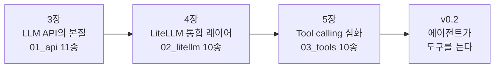
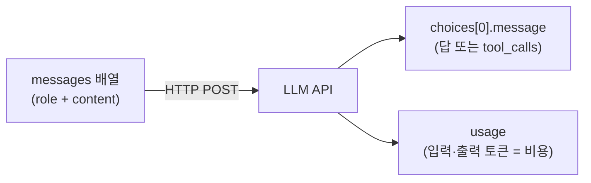
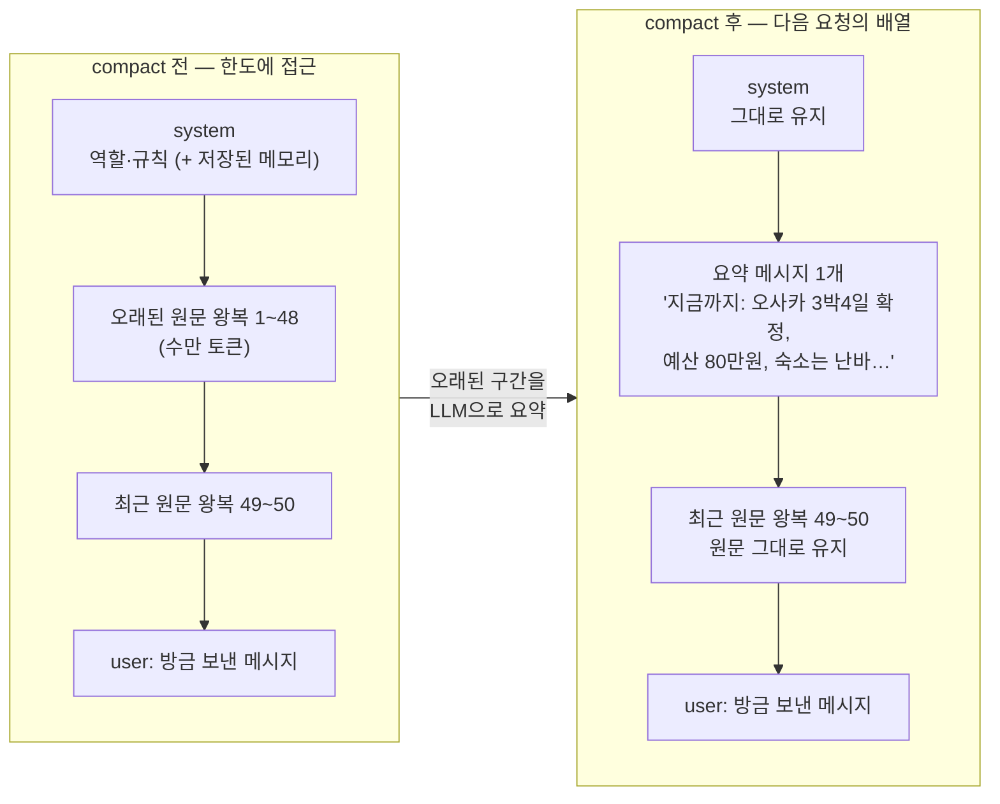
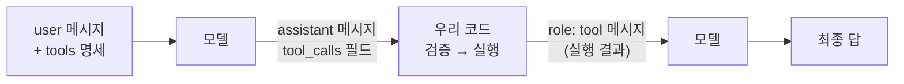
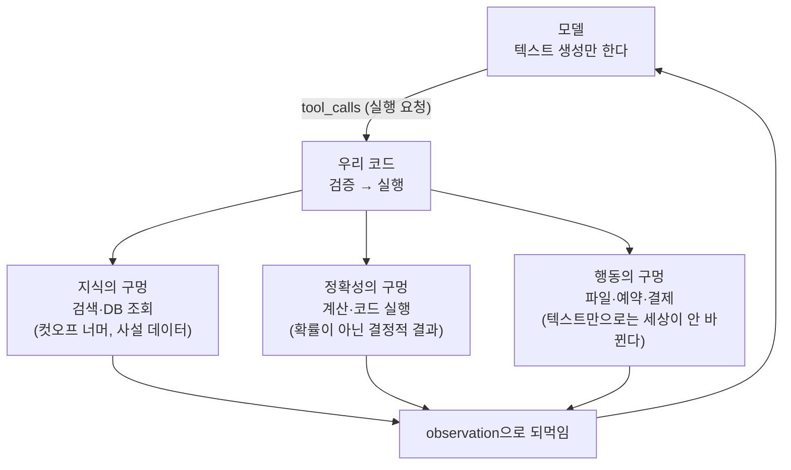
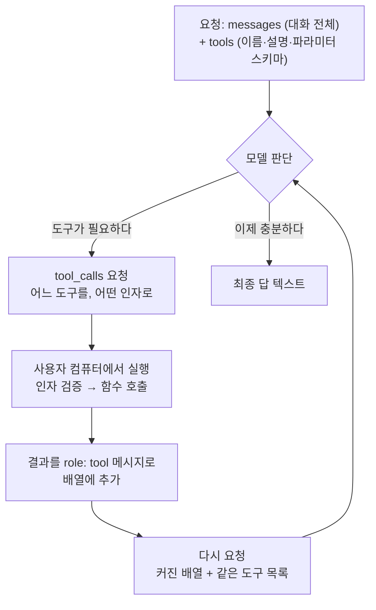
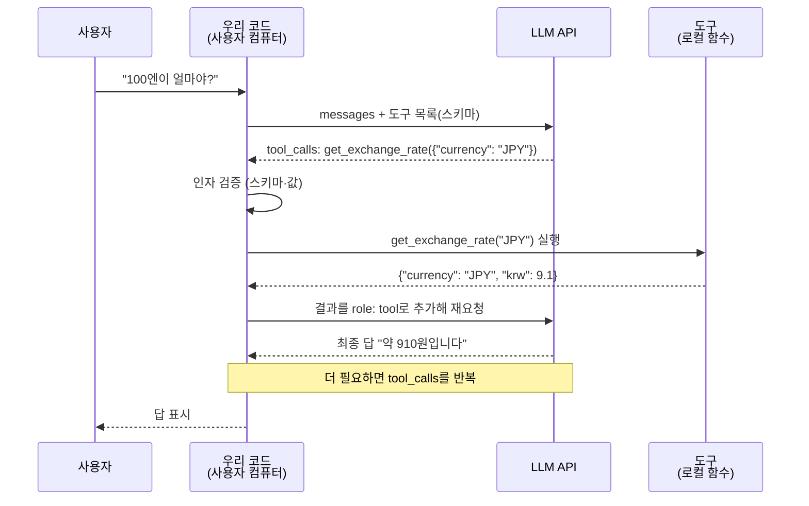

import Slide from 'stack-site-builder/components/Slide.astro';

{/* 슬라이드 작성 규칙은 docs/writing-rules.md의 "슬라이드 규칙"을 따릅니다. */}

<Slide class="cover">

# AI 서비스 엔지니어링: Track A

5주차 · API 해부와 tool calling

*CodeCompose · 2026-08-21*

</Slide>

<Slide class="center">

## 지금까지 우리는 LLM을 "썼습니다"

3주차의 파이프라인도, 4주차의 RAG도

정작 API 호출 자체는 라이브러리 뒤에 가려 있었습니다

</Slide>

<Slide>

## 오늘 하는 일
::sub[가림막을 걷고 바닥까지 내려갑니다]

- **LLM API의 전부**: messages를 보내면 choices가 온다
- **통합 레이어**: 교체·폴백·캐싱·라우터·비용 콜백
- **tool calling**: 모델은 함수를 실행하지 못한다. 요청할 뿐이다
- 예제 **31종을 전부 실행**하고, 끝에서 에이전트가 **v0.2**로 오릅니다

</Slide>

<Slide>

## 이번 주 저장소는 서비스가 아니라 랩입니다
::sub[따라 치지 않습니다. 읽고, 돌리고, 재현합니다]

- `lab` 컨테이너 하나를 띄워 두고 **예제 파일을 하나씩 실행**합니다
- 각 파일 상단 docstring에 "무엇을 보는가"와 실행 명령이 있습니다
- 코드는 전부 완성본. 세션은 강사 시연 + 코드 리딩
- 재현은 각자의 속도로. 같은 명령이 같은 결과를 냅니다

</Slide>

<Slide>

### 랩 기동

```bash
git clone https://github.com/2026-ai-service-engineering-a/week05-agent-lab.git
cd week05-agent-lab
cp .env.sample .env        # 편집기로 열어 키 채우기 (셋 중 하나면 됨)
docker compose up --build -d
docker compose exec lab python check_env.py
```

- 3주차에 발급한 키를 그대로 씁니다
- **로컬 Python 환경이 필요 없습니다**

</Slide>

<Slide class="center">

## 릴리즈 사다리

**v0.1 뼈대 → v0.2 도구**

그리고 6주차가 **v0.3 ReAct → v0.4 고급 루프 → v1.0 하네스**

</Slide>

<Slide>

### 사다리 사용법
::sub[태그 하나가 그 시점의 동작 전체를 재현합니다]

```bash
git checkout v0.1 && docker compose up --build -d   # 그 시점의 코드로 그 시점의 동작
git diff v0.1 v0.2                                  # 이번 feature가 코드로는 무엇이었나
docker compose exec lab pytest                      # 어느 태그에서든 그 시점의 테스트가 통과
```

"지금 우리는 v0.1에서 v0.2로 가는 중"이 늘 성립합니다.

</Slide>

<Slide>

### 이번 주 사다리는 두 단

| 릴리즈 | 상태 | 테스트 |
| --- | --- | --- |
| v0.1 | 예제 31종 + 에이전트 뼈대 (도구 없음) | 5개 통과 |
| v0.2 | 도구 장착: 예산 계산 도구가 스키마로 실림 | 16개 통과 |

6주차 랩은 이 v0.2에서 이어집니다.
그래서 그쪽의 첫 태그가 v0.1이 아니라 **v0.2**입니다.

</Slide>

<Slide>

## check_env.py가 확인하는 것

- **키 유효성**: 채워진 키로 실제 호출 1회
- **사용 가능한 모델**
- **컨테이너 내 패키지 버전**

```text
=== 패키지 버전 ===
  python   3.13.15
  litellm  1.96.2
  pydantic 2.13.4
  pytest   8.4.2
```

키가 하나도 없으면 해결 방법을 안내하고 종료 코드 1로 끝납니다.

</Slide>

<Slide>

### 잘 안 될 때

- `docker: command not found` → Docker Desktop이 실행 중인지 확인
- 키 인증 실패 → `.env`의 키 앞뒤 공백·따옴표 확인, 충전 여부 확인
- 그 외는 **지금 이 시간에 함께 해결합니다**

키는 셋 중 하나만 있어도 모든 예제가 돕니다.
임베딩 예제에는 Google 키가 필요합니다.

</Slide>

<Slide>

### 예제 실행 방법
::sub[전부 docker compose exec로 돕니다]

```bash
docker compose exec lab python examples/01_api/01_hello_completion.py
```

- **예제 31종을 전부 수업에서 실행합니다.**
  교안에 실행 결과가 함께 실려 있어, 재현할 때 자기 출력과 대조할 수 있습니다
- 키 없이 도는 것들: 토큰 세기, 단가표, 스키마 생성, 비용 계산
- 유닛 테스트는 키도 네트워크도 없이 돕니다: `docker compose exec lab pytest`

</Slide>

<Slide>

### 비용은 얼마나 드나

| 하는 일 | 비용 |
| --- | --- |
| `check_env.py` 1회 (3사 각 1콜) | $0.0001 미만 |
| 예제 하나 실행 (호출 1\~5회) | $0.001 \~ $0.01 수준 |
| 여행 플래너 풀런 1회 (루프 + 도구 3종) | $0.003 \~ $0.010 |
| 루프가 8스텝을 다 쓰는 최악 시나리오 | $0.007 \~ $0.033 |

- 예제 31종을 전부 돌리고 에이전트를 여러 번 실행해도 **하루 $1 안쪽**
- 유닛 테스트는 0원, 키 없이 도는 예제도 0원

</Slide>

<Slide>

## 오늘의 흐름



</Slide>

<Slide class="cover">

## 3장 · LLM API의 본질

`examples/01_api/` 11종

*프레임워크를 걷어내고 API의 바닥을 봅니다*

</Slide>

<Slide>

## 3장이 하는 일
::sub[프레임워크를 걷어내고 API의 바닥을 봅니다]

- `examples/01_api/` **11종을 전부 실행**합니다.
- 요청에 무엇을 싣고, 응답에서 무엇을 쓰는지 JSON 원문으로 확인
- 토큰·한도·비용이 왜 설계 문제인지 숫자로 확인
- 기억이 서버가 아니라 **messages 배열**에 있다는 것을 실험으로 확인

</Slide>
<Slide class="center">

## 핵심 문장

**LLM API의 전부는 "messages 배열을 보내면 choices가 돌아온다"**

오늘 볼 11종은 전부 이 문장 하나의 변주입니다.

</Slide>
<Slide>

## 그림 한 장



무엇을 실어 보내는가(역할·이미지·히스토리),
무엇이 돌아오는가(문장·JSON·델타 청크),
그리고 usage가 곧 돈이라는 것

</Slide>
<Slide>

## 오늘의 순서
::sub[예제 11종을 다섯 묶음으로]

1. 요청과 응답 (최소 호출, 역할)
2. 토큰·한도·온도 (토큰 수, 컨텍스트 초과, temperature)
3. 스트리밍과 병렬 (델타 청크, async)
4. 무상태와 기억 (히스토리, compact)
5. 계약과 비용 (JSON 강제, 이미지, 비용 계산)

</Slide>
<Slide class="center">

## Part 1. 요청과 응답

무엇을 보내고 무엇이 돌아오는가

</Slide>
<Slide>

### 1. 최소 호출
::sub[01_hello_completion.py · 요청·응답 JSON 원문을 그대로 본다]

- 코드

```python
request = {
    "model": model,
    "messages": [{"role": "user", "content": "안녕하세요! 한 문장으로 인사해 주세요."}],
}
response = completion(**request)
print(response.model_dump_json(indent=2))
```

- 실행

```bash
docker compose exec lab python examples/01_api/01_hello_completion.py
```

</Slide>
<Slide>

### 응답 원문: 모델이 돌려주는 것 전체

```text
{
  "model": "gemini-3.5-flash-lite",
  "choices": [
    {
      "finish_reason": "stop",
      "message": {
        "content": "안녕하세요! 만나서 반가운데, 오늘 어떤 도움이 필요하신가요?",
        "role": "assistant",
        "tool_calls": null,
        "provider_specific_fields": { "thought_signatures": ["El4KXAERTTIP…"] }
      }
    }
  ],
  "usage": { "completion_tokens": 16, "prompt_tokens": 11, "total_tokens": 27 }
}
```

</Slide>
<Slide>

### 실제로 쓰는 것은 두 곳뿐

```text
choices[0].message.content = '안녕하세요! 만나서 반가운데, …'
usage = 입력 11 토큰 + 출력 16 토큰
```

- `content`: 답
- `usage`: 비용
- `provider_specific_fields`처럼 프로바이더 고유 필드가 섞여 오는 것도
  실물에서만 보입니다.

</Slide>
<Slide class="center">

### `"tool_calls": null`

이 자리를 기억해 두세요.

**5장에서 저 자리가 채워지는 순간 에이전트가 시작됩니다**.

</Slide>
<Slide>

### 2. 역할: system이 내용과 형식을 정한다
::sub[02_roles.py · 같은 질문에 system만 갈아 끼운다]

```python
personas = {
    "(system 없음)": None,
    "미슐랭 심사위원": "당신은 미슐랭 심사위원입니다. 미식가의 기준으로 …",
    "초등학생 눈높이": "당신은 초등학생에게 설명하는 선생님입니다. …",
    "JSON 응답기": "반드시 {\"추천\": ..., \"이유\": ...} 형태의 JSON으로만 …",
}
```

질문은 하나로 고정: "오사카에서 꼭 먹어야 할 것 하나만"

```bash
docker compose exec lab python examples/01_api/02_roles.py
```

</Slide>
<Slide>

### system만 바꿨을 뿐인데

```text
=== system = (system 없음) ===
오사카 여행에서 단 하나만 먹어야 한다면 … '오코노미야키'를 추천합니다.

=== system = 미슐랭 심사위원 ===
… 저는 망설임 없이 '제대로 된 갓포 요리(割烹)'를 선택하겠습니다.

=== system = 초등학생 눈높이 ===
와, 오사카 여행 정말 부럽다! 선생님은 타코야키를 꼭 추천할게! …

=== system = JSON 응답기 ===
{"추천": "타코야키", "이유": "오사카의 소울 푸드로, …"}
```

</Slide>
<Slide>

### 결과 읽기: 내용도 형식도 system에서 갈렸다

- 답의 **내용**: 갓포 요리 vs 타코야키
- 답의 **형식**: 산문 vs JSON
- 에이전트의 성격·규칙·말투가 실리는 자리
- 6주차의 하네스에서 이 자리가 **방어선**이 됩니다.

</Slide>
<Slide class="center">

## Part 2. 토큰 · 한도 · 온도

돈과 벽, 그리고 재현성

</Slide>
<Slide>

### 3. 토큰: 한글이 더 비싼 이유
::sub[03_tokens.py · API 호출 없이 토크나이저만으로 돈다. 키 불필요]

- 실행

```bash
docker compose exec lab python examples/01_api/03_tokens.py
```

- 결과

```text
   한국어 |   영어 | 문장
    11 |    9 | 안녕하세요, 오늘 날씨가 정말 좋네요.…
    23 |   23 | 3박 4일 오사카 여행 일정을 짜 주세요. 예산은 80…
    19 |   10 | 대규모 언어 모델은 토큰 단위로 텍스트를 처리합니다.…
  합계: 한국어 53 토큰 vs 영어 42 토큰 (약 1.3배)
```

과금과 컨텍스트 한도는 **글자 수가 아니라 토큰 수** 기준입니다.  
세 번째 문장(19 vs 10)처럼 2배 가까이 벌어지기도 합니다.

</Slide>
<Slide>

### 4. 컨텍스트 한도: 넘치면 잘리는 게 아니라 거부된다
::sub[04_context_limit.py · 한도가 가장 작은 모델에 한도의 1.5배를 보낸다]

- 코드

```python
model = min(available_models(), key=lambda m: get_model_info(m)["max_input_tokens"])
limit = get_model_info(model)["max_input_tokens"]
text = chunk * (int(limit * 1.5) // chunk_tokens + 1)   # 확실히 초과
```

- 실행

```bash
docker compose exec lab python examples/01_api/04_context_limit.py
```

요청이 거부되므로 **과금되지 않습니다**.

</Slide>
<Slide>

### 에러 원문

```text
=== anthropic/claude-haiku-4-5의 입력 한도 ===
  max_input_tokens = 200,000

=== 일부러 초과 요청 ===
  보내는 입력: 약 300,001 토큰 (한도의 1.5배)

=== 에러 원문 ===
  ContextWindowExceededError
  … "prompt is too long: 275024 tokens > 200000 maximum"
```

</Slide>
<Slide>

### 결과 읽기: 두 가지가 보인다

- **① 초과분은 잘리는 게 아니라 요청 자체가 거부됩니다**.
- **② 토큰 수는 세는 쪽마다 다릅니다**
  우리 근사 토크나이저는 30만, 프로바이더는 27.5만으로 셌습니다.
- 한도 근처의 계산은 항상 여유를 둡니다.
- 에이전트 루프에서 히스토리가 무한히 자라면 정확히 이 에러를 만납니다.

</Slide>
<Slide>

### 5. temperature: 재현성과 다양성의 손잡이
::sub[05_temperature.py · 같은 질문을 0과 1로 5번씩]

- 실행

```bash
docker compose exec lab python examples/01_api/05_temperature.py
```

- 결과

```text
(시연 모델: openai/gpt-5.4-nano)

=== temperature = 0.0 ===
  1회: 도쿄 / 2회: 도쿄 / 3회: 도쿄 / 4회: 도쿄 / 5회: 도쿄
  → 서로 다른 답 1종

=== temperature = 1.0 ===
  1회: **도쿄** / 2회: 도쿄 / 3회: 도쿄 / 4회: **오사카** / 5회: 도쿄 (Tokyo)
  → 서로 다른 답 4종
```

</Slide>
<Slide>

### 결과 읽기: 0을 쓰는 자리가 따로 있다

- **0**: 도구 선택·채점·검증처럼 재현성이 필요한 자리
- **높게**: 발상이 필요한 자리
- 곁가지 발견 하나: Gemini 3+는 이 파라미터를 은퇴시키는 중입니다
  (호출마다 경고가 뜹니다)
- 같은 파라미터도 프로바이더마다 지원 상태가 다르다는 실례

</Slide>
<Slide class="center">

## Part 3. 스트리밍과 병렬

기다림을 다루는 두 가지 방법

</Slide>
<Slide>

### 6. 스트리밍: 답은 조각으로 온다
::sub[06_streaming.py · 채팅 UI가 글자를 흘리는 것의 실체]

- 실행

```bash
docker compose exec lab python examples/01_api/06_streaming.py
```

- 결과

```text
=== 처음 5개 청크 원문 ===
  chunk[0] delta='**'
  chunk[1] delta='"먹다 지쳐 쓰러진다는 \'구이도락(食い'
  chunk[2] delta="倒れ)'의 본고장이자, 화려한 네온사인과 정겨운 인간미가 공존"
  chunk[3] delta='하는 일본 최고의 활기찬 도시."**'
  chunk[4] delta=''
```

조각의 크기와 경계는 프로바이더 마음입니다.  
청크 0은 `**` 두 글자, 청크 2는 한 구절. **이어붙이는 쪽이 완성 텍스트를 책임집니다**.

</Slide>
<Slide>

### 7. 병렬 호출: 동시에 물으면 몇 배 빠른가
::sub[07_async_parallel.py · 도시 5곳을 순차로, 그리고 동시에]

- 코드

```python
tasks = [acompletion(model=model, messages=[…]) for city in cities]
await asyncio.gather(*tasks)
```

- 실행

```bash
docker compose exec lab python examples/01_api/07_async_parallel.py
```

- 결과

```text
=== 순차 호출 (5회) ===   5.2초
=== 병렬 호출 (5회 동시) ===   1.5초
=== 비교 ===   순차 5.2초 → 병렬 1.5초 (약 3.4배)
```

LLM 호출은 네트워크 대기가 대부분이라 병렬화 이득이 큽니다.  
`acompletion` + `gather` 패턴 하나면 충분하고,
여러 곳을 동시에 물어보는 에이전트가 이 패턴의 확장판입니다.

</Slide>
<Slide class="center">

## Part 4. 무상태와 기억

서버는 아무것도 기억하지 않습니다.

</Slide>
<Slide>

### 8. 무상태: 기억은 서버가 아니라 배열에 있다
::sub[08_multiturn_stateless.py · 히스토리 없이, 그리고 실어서]

- 실행

```bash
docker compose exec lab python examples/01_api/08_multiturn_stateless.py
```

- 결과

```text
=== 1턴: 자기소개 ===
  김철수님, 안녕하세요! 오사카 여행 계획을 세우고 계시다니 …

=== 2턴 (히스토리 없이): 제 이름이 뭐라고 했죠? ===
  죄송하지만, 이전 대화에서 이름을 말씀해 주지 않으셔서 저는 아직
  성함을 모릅니다.

=== 2턴 (히스토리 포함): 같은 질문 ===
  철수님의 이름은 김철수님이십니다!
```

</Slide>
<Slide>

### 결과 읽기: "이어지는 대화"는 착시다

- 서버는 아무것도 기억하지 않습니다.
- 클라이언트가 **messages 배열 전체를 매번 다시 보내서** 만드는 착시입니다.
- 이 배열이 스텝마다 부풀어 비싸지는 것이 에이전트 루프의 비용 구조
  (6주차에서 그래프로 봅니다)
- **이 배열을 관리하는 일이 곧 컨텍스트 엔지니어링입니다**.

</Slide>
<Slide>

### 그런데 채팅은 분명히 나를 기억한다
::sub[간극을 메우는 장치는 전부 배열 관리 기법입니다]

- **같은 대화 안에서의 기억**: 방금 본 그대로. 클라이언트가 대화 전체를
  매번 다시 보냅니다. 서비스가 기억하는 게 아니라 배열이 기억합니다.
- **대화를 새로 열어도 남는 기억**
  - 별도 저장소에 적어 둔 사실
  ("사용자는 개발자다")을 다음 대화의 system 근처에 끼워 넣습니다.
  - 모델이 기억하는 게 아니라, **매번 읽고 시작하는 쪽지**가 있는 것입니다.

</Slide>
<Slide>

### 그런데 배열은 자라기만 한다
::sub[방치하면 부딪히는 세 가지 벽]

- **한도**: 4번에서 본 그대로, 넘치는 순간 요청 자체가 거부됩니다.
- **비용**: 입력 토큰은 매 턴 전체를 다시 냅니다.
- **품질**: 컨텍스트가 길어지면 모델이 오래된 세부를 놓치기 시작합니다.

그래서 Claude Code 같은 도구는 대화가 차오르면 **compact**를 돌립니다.  
오래된 원문을 LLM으로 요약해 짧은 메시지 하나로 갈아끼우는 작업입니다.

</Slide>
<Slide>

### compact가 배열을 바꾸는 모양



</Slide>
<Slide>

### 무엇이 남고 무엇이 치환되나

- **유지**: system 메시지, 최근 왕복 몇 개의 원문, 방금 보낸 메시지
  진행 중인 작업의 세부(코드 조각, 직전 지시)가 요약으로 뭉개지면 안 됩니다.
- **치환**: 오래된 왕복 수십 개가 요약 메시지 하나로. 수만 토큰이 수백 토큰으로
- **모델 입장에서는 구분이 없습니다**
  - 요약도 그냥 배열 속 메시지 하나입니다.
  - 서버는 여전히 무상태이고, 바뀐 것은 우리가 보내는 배열의 내용뿐입니다.

</Slide>
<Slide class="center">

### 요약은 손실 압축이다

compact 직후 "아까 그 함수 이름 뭐였지?"에 모델이 답하지 못하는 이유

**요약에서 빠진 내용은 배열에서 사라진 것이고, 사라진 것은 존재하지 않습니다**.

</Slide>
<Slide class="center">

## Part 5. 계약과 비용

형태를 강제하고, 값을 세어 본다.

</Slide>
<Slide>

### 10. JSON 강제: 부탁이 아니라 계약으로
::sub[09_json_mode.py · 부탁한 버전과 강제한 버전을 json.loads에 통과시킨다]

- 실행

```bash
docker compose exec lab python examples/01_api/09_json_mode.py
```

- 결과

````text
=== 그냥 부탁만 한 경우 ===
  오사카의 대표적인 명소 2곳을 담은 JSON 배열입니다.
  ```json
  [ { "name": "오사카 성", … } ]
  ```
  → json.loads 실패: Expecting value: line 1 column 1 (char 0)

=== response_format으로 강제한 경우 ===
  [{"name": "오사카 성", "fee": "600엔"}, {"name": "우메다 스카이 빌딩", …}]
  → json.loads 통과
````

</Slide>
<Slide>

### 결과 읽기: 형태의 계약일 뿐 값의 계약은 아니다

- 부탁하면 설명 문장과 코드펜스가 섞여 와서 파싱이 깨집니다.
- 강제하면 파싱이 **계약**이 됩니다.
- 다만 `fee`가 `"600엔"`이라는 문자열입니다. 형태는 맞지만 타입은 아닙니다.
- 타입까지 묶는 방법은 **5장의 구조화 출력**에서 잇습니다.

</Slide>
<Slide>

### 11. 이미지 입력: 멀티모달도 같은 구조
::sub[10_vision.py · 이미지를 직접 받아 base64 data URL로 싣는다]

- 코드

```python
req = urllib.request.Request(image_url, headers={"User-Agent": "week05-agent-lab/1.0"})
image_b64 = base64.b64encode(urllib.request.urlopen(req).read()).decode()
content = [
    {"type": "text", "text": "이 사진의 건물이 무엇인지 한 문장으로 답해 주세요."},
    {"type": "image_url", "image_url": {"url": f"data:image/jpeg;base64,{image_b64}"}},
]
```

- 실행

```bash
docker compose exec lab python examples/01_api/10_vision.py
```

- 결과

```text
=== 응답 ===
  이 사진 속 주요 건물은 일본 오사카에 위치한 역사적인 랜드마크인 오사카성입니다.
```

</Slide>
<Slide>

### 결과 읽기: 구조는 그대로다

- `content`가 문자열에서 `[text 조각, image 조각]` 배열로 바뀌었을 뿐입니다.
- 이 예제는 처음에 이미지 URL을 그대로 넘기다가
  호스트의 User-Agent 차단과 썸네일 정책에 **두 번 깨졌습니다**.
- 이미지를 직접 받아 base64로 싣는 지금 방식이 실전에서도 안전합니다.

</Slide>
<Slide>

### 12. 비용 계산: 토큰 곱하기 단가
::sub[11_cost_calc.py · 키 없이 돈다]

- 실행

```bash
docker compose exec lab python examples/01_api/11_cost_calc.py
```

- 결과

```text
=== 모델별 비용 (litellm 내장 단가표) ===
  모델                              입력단가/1M   출력단가/1M      이 호출
  gemini/gemini-3.5-flash-lite     $     0.30   $     2.50   $ 0.001257
  openai/gpt-5.4-nano              $     0.20   $     1.25   $ 0.000630
  anthropic/claude-haiku-4-5       $     1.00   $     5.00   $ 0.002523
```

비용 = 입력 토큰 × 입력 단가 + 출력 토큰 × 출력 단가

</Slide>
<Slide class="center">

### 호출 한 번은 티끌이지만
## 에이전트는 루프입니다

스텝 10번, 부푸는 히스토리, 멀티 에이전트 N명이면 자릿수가 달라집니다.

그래서 6주차에서 budget guard를 답니다.

</Slide>
<Slide>

## 3장이 남기는 것

- 응답에서 쓰는 곳은 `content`와 `usage`, 그리고 아직 비어 있는 `tool_calls`
- 기억은 서버가 아니라 messages 배열에 있고, **그 배열이 비용이다**.
- 채팅의 기억도, compact도 전부 배열 관리 기법이다. 요약은 손실 압축이다.
- 형태는 강제할 수 있지만(JSON 모드), **값의 보증은 다음 장들의 몫이다**.

</Slide>
<Slide class="cover">

## 4장 · LiteLLM 통합 레이어

`examples/02_litellm/` 10종

*3장이 써 온 completion()의 정체를 밝힙니다*

</Slide>

<Slide>

## 4장이 하는 일
::sub[3장이 이미 써 온 completion()의 정체를 밝힙니다]

- 왜 공식 SDK 세 벌 대신 통합 레이어 한 벌인가, 그 **이득과 대가**
- `examples/02_litellm/` **10종을 전부 실행**합니다.
- 폴백·재시도·캐시·라우터·비용 콜백 같은 **실전 장비**를 하나씩 돌려 봅니다.

</Slide>
<Slide class="center">

## 핵심 문장

**LiteLLM에서 프로바이더 교체는 `model=` 문자열 한 줄이다**.

</Slide>
<Slide class="center">

## Part 1. 왜 LiteLLM인가

각 사가 공식 SDK를 주는데도 이 랩이 하나로 통일한 이유

</Slide>
<Slide>

### 같은 일을 세 가지 문법으로

```python
# 세 회사의 공식 SDK
openai.OpenAI().chat.completions.create(model="gpt-5.4-nano", messages=[…])
genai.Client().models.generate_content(model="gemini-3.5-flash-lite", contents="…")
anthropic.Anthropic().messages.create(model="claude-haiku-4-5", max_tokens=1024, …)

# LiteLLM — 셋 다 이 한 줄. 바뀌는 것은 model 문자열뿐
litellm.completion(model="<프로바이더/모델>", messages=[…])
```

공식 SDK로 3사를 지원하려면 **호출부 세 벌, 응답 파싱 세 벌, 에러 처리 세 벌**.
LiteLLM은 그 셋을 OpenAI 호환 형태 하나로 통일합니다.

</Slide>
<Slide>

### 장점: 왜 쓰는가

- **교체 비용이 문자열 한 줄**: 프로바이더 교체가 코드 수정이 아니라 설정 변경
- **셋 중 어떤 키를 채워도 같은 코드**: 이 과정의 요구사항입니다.
  수강생마다 가진 키가 달라도 모든 예제가 그대로 돕니다.
- **부대 장비 내장**: 단가표, 토큰 카운터, 폴백, 재시도, 캐시, 라우터, 비용 콜백.
  이 장에서 하나씩 씁니다.
- **넓은 커버리지**: 100개 이상의 프로바이더를 같은 인터페이스로

</Slide>
<Slide>

### 단점: 무엇을 대가로 치르는가

- **추상화 한 겹의 비용**: 에러가 litellm 예외로 감싸여 오고, 디버깅 시
  스택이 한 층 깊어집니다.
- **프로바이더 고유 기능의 지연·누수**
  - 새 기능은 litellm이 지원할 때까지
  기다리거나, 
  - `provider_specific_fields`처럼 표준 밖 필드로 새어 나옵니다.
- **라이브러리 자체에 의존**: 단가표의 최신성, 새 모델 등재 속도, 버그가
  전부 litellm 버전에 묶입니다. 이 랩이 버전을 고정한 이유입니다.

</Slide>
<Slide>

### 판단 기준

- 프로바이더 하나를 확정했고 그 고유 기능을 깊이 쓴다면: **공식 SDK**
- 멀티 프로바이더, 교체 가능성, 비용·품질 비교가 필요하다면: **통합 레이어**
- 이 과정은 3사를 오가며 비교하는 것 자체가 커리큘럼이므로 LiteLLM입니다.

</Slide>
<Slide class="center">

### 추상화를 고르는 일반 규칙

**갈아끼울 계획이 없으면 추상화는 비용입니다**.

갈아끼울 것이 확실하면 추상화가 그 비용을 갚습니다.  
모델은 갈아끼워집니다.  
오늘 실제로 두 번 갈았습니다.

</Slide>
<Slide class="center">

## Part 2. 교체와 비교

같은 코드로 3사를 오간다.

</Slide>
<Slide>

### 2. 프로바이더 교체는 문자열 한 줄
::sub[01_provider_swap.py · 호출 코드는 한 글자도 바뀌지 않는다]

- 코드

```python
for model in available_models():          # 키가 채워진 프로바이더들
    answer = completion(
        model=model, messages=[{"role": "user", "content": question}]
    ).choices[0].message.content
```

- 실행

```bash
docker compose exec lab python examples/02_litellm/01_provider_swap.py
```

- 결과

```text
=== gemini/gemini-3.5-flash-lite ===
  저는 구글(Google)에서 개발한 대규모 언어 모델, 제미나이(Gemini)입니다.
=== openai/gpt-5.4-nano ===
  저는 OpenAI의 ChatGPT(대화형 AI) 모델입니다.
=== anthropic/claude-haiku-4-5 ===
  저는 Anthropic이 만든 Claude라는 AI 어시스턴트입니다.
```

</Slide>
<Slide>

### 결과 읽기: 모델 이름은 한 곳에만

- 세 회사의 세 모델이 같은 `completion()` 하나로 답했습니다.
- 이 랩의 모델 문자열은 전부 `agent/config.py` **한 곳**에 있습니다.
  예제 어디에도 하드코딩이 없습니다.
- 이 통일이 이후 모든 것(폴백·라우팅·모델 배정)의 토대입니다.

</Slide>
<Slide>

### 3. 3사 비교: 응답·지연·비용을 나란히
::sub[02_three_way_compare.py · "어느 모델을 쓸까"는 감이 아니라 측정의 문제]

- 실행

```bash
docker compose exec lab python examples/02_litellm/02_three_way_compare.py
```

- 결과

```text
=== 비교 표 ===
  모델                                 지연    입력tk    출력tk        비용
  gemini/gemini-3.5-flash-lite       1.5s      24      90 $  0.000232
  openai/gpt-5.4-nano                1.7s      30     120 $  0.000156
  anthropic/claude-haiku-4-5         2.3s      43     124 $  0.000663
```

같은 프롬프트인데 **입력 토큰부터 다릅니다**.
프로바이더마다 토크나이저와 내부 포장이 다르기 때문입니다.  
품질은 눈으로, 지연과 비용은 숫자로 비교합니다.

</Slide>
<Slide>

### 모델 고를 때 보는 축

- **품질**: 우리 과제에서 도구 선택과 지시 준수가 얼마나 안정적인가
- **지연**: 사용자가 기다리는 시간. 에이전트는 스텝마다 곱해집니다.
- **비용**: 단가 × 토큰. 입력 토큰 수가 프로바이더마다 다른 것도 감안
- **가용성**: 은퇴 위험, rate limit, 지역 제한

**한 축만 보고 고르면 나중에 다시 고르게 됩니다**.

</Slide>
<Slide class="center">

## Part 3. 장애를 견디는 세 겹

재시도 · 폴백 · 백오프

</Slide>
<Slide>

### 4. 폴백: 주 모델이 죽으면 이어받는다
::sub[03_fallback.py · 존재하지 않는 모델을 1순위로 둔다]

- 코드

```python
resp = completion(
    model="openai/gpt-없는-모델",          # 반드시 실패하는 1순위
    messages=[…],
    fallbacks=["gemini/gemini-3.5-flash-lite"],
)
```

- 실행

```bash
docker compose exec lab python examples/02_litellm/03_fallback.py
```

- 결과

```text
LiteLLM:ERROR: … Fallback attempt failed for model openai/gpt-없는-모델:
  litellm.BadRequestError: OpenAIException - invalid model ID

=== 결과 ===
  실제 응답한 모델: gemini-3.5-flash-lite
  답: 폴백 성공
```

</Slide>
<Slide>

### 결과 읽기: 폴백은 옵션이 아니라 기본 장비

- 1순위의 실패 로그가 찍히고, **같은 `completion()` 한 번 안에서**
  폴백이 응답을 완성했습니다.
- 이 장 끝의 사례처럼 **모델은 예고 없이 은퇴합니다**.

</Slide>
<Slide>

### 5. 재시도와 타임아웃: 순간 장애의 방어
::sub[04_retry_timeout.py · 불가능한 타임아웃 0.001초로 에러를 재현]

- 실행

```bash
docker compose exec lab python examples/02_litellm/04_retry_timeout.py
```

- 결과

```text
=== 타임아웃 재현 (timeout=0.001초) ===
  litellm.Timeout: Connection timed out …

=== 정상 설정 (timeout=30초, num_retries=2) ===
  답: 2
  실패하면 최대 2회까지 자동으로 다시 시도한 뒤에야 에러를 낸다
```

- `timeout`: 이 시간 안에 답이 없으면 끊는다.
- `num_retries`: 끊기면 몇 번 다시

</Slide>
<Slide>

### 8. rate limit: 백오프로 살아남기
::sub[07_rate_limit.py · 429를 만나면 1초 → 2초 → 4초 기다렸다 재시도]

- 실행

```bash
docker compose exec lab python examples/02_litellm/07_rate_limit.py
```

- 결과

```text
=== 연속 15회 빠른 호출 (한도를 만나러 간다) ===
  1회 성공 … 15회 성공

=== 정리 ===
  한도는 장애가 아니라 일상이다. 백오프는 에이전트 루프의 기본 장비다.
```

이번 실측은 유료 티어라 한도에 닿지 않았고, 백오프 코드는 할 일 없이
통과했습니다.  
무료 티어에서는 `429! 1초 백오프 후 재시도` 줄이 등장합니다.  
**걸리든 안 걸리든 코드는 같아야 한다**는 것이 요점입니다.

</Slide>
<Slide class="center">

### 세 겹은 서로 다른 장애를 맡는다

**재시도**(순간 장애) · **폴백**(모델 장애) · **백오프**(한도)

하나로 다 막으려 하지 않습니다.

</Slide>
<Slide>

### 장애 종류별 처방

| 증상 | 원인 | 처방 |
| --- | --- | --- |
| 간헐적 타임아웃·연결 끊김 | 순간 네트워크 장애 | `num_retries` |
| 404, invalid model ID | 모델 은퇴·오타 | `fallbacks` |
| 429 Too Many Requests | 한도 초과 | 지수 백오프 |
| ContextWindowExceeded | 입력이 한도 초과 | 재시도해도 소용없음. 컨텍스트를 줄인다 |

**마지막 줄이 중요합니다.** 재시도로 못 고치는 에러도 있습니다.

</Slide>
<Slide class="center">

## Part 4. 돈과 속도

캐시와 장부

</Slide>
<Slide>

### 6. 캐싱: 같은 질문 두 번째는 공짜·즉시
::sub[05_cache.py · 인메모리 캐시를 켜고 같은 요청을 두 번]

- 코드

```python
litellm.cache = Cache(type="local")       # 프로세스 안 인메모리 캐시
r1 = completion(model=model, messages=messages, caching=True)
r2 = completion(model=model, messages=messages, caching=True)   # 캐시에서
```

- 실행

```bash
docker compose exec lab python examples/02_litellm/05_cache.py
```

- 결과

```text
=== 1회차 (API까지 다녀옴) ===   2.09초
=== 2회차 (같은 요청) ===   0.002초
=== 비교 ===   2.09초 → 0.002초. 같은 답인가: True
```

</Slide>
<Slide>

### 결과 읽기: 1,000배 빠르고 비용은 0

- FAQ·반복 질의가 많은 서비스의 기본 손잡이입니다.
- 단, **같은 요청이어야 합니다**. messages가 1바이트라도 다르면 미스
- 신선도가 중요한 질문에는 쓰지 않습니다.

</Slide>
<Slide>

### 7. 비용 콜백: 호출마다 장부에 쌓인다
::sub[06_cost_callback.py · 호출부에는 한 줄도 손대지 않는다]

- 코드

```python
def track_cost(kwargs, completion_response, start_time, end_time):
    ledger["calls"] += 1
    ledger["cost"] += kwargs.get("response_cost") or 0.0

litellm.success_callback = [track_cost]
```

- 실행

```bash
docker compose exec lab python examples/02_litellm/06_cost_callback.py
```

- 결과

```text
  호출: '1+1은?' / '오사카는 어느 나라?' / '라멘 한 그릇 평균 가격은?'

=== 장부 ===
  호출 3건, 누적 비용 $0.000870
```

</Slide>
<Slide>

### 결과 읽기: 이 자리가 budget guard의 자리

- 호출부에는 비용 코드가 **한 줄도 없습니다**.
- 콜백 하나 등록하면 모든 completion의 비용이 장부로 흘러듭니다.
- **6주차의 budget guard가 정확히 이 자리에서 누적 비용을 지켜봅니다**.

</Slide>
<Slide class="center">

## Part 5. 라우팅과 메타데이터

별명 뒤에 배포 여러 개, 그리고 실행 전에 읽는 숫자

</Slide>
<Slide>

### 9. 라우터: 별명 하나 뒤에 배포 여러 개
::sub[08_router.py · 실모델 여러 개를 travel-llm 하나로 묶는다]

- 코드

```python
deployments = [
    {"model_name": "travel-llm", "litellm_params": {"model": m}}
    for m in available_models()
]
router = Router(model_list=deployments, routing_strategy="simple-shuffle")
resp = router.completion(model="travel-llm", messages=[…])
```

- 실행

```bash
docker compose exec lab python examples/02_litellm/08_router.py
```

</Slide>
<Slide>

### 요청 6건이 3사에 흩어진다

```text
=== 배포 3개에 요청 6건 분산 ===
  요청 1 → 처리한 모델: claude-haiku-4-5-20251001
  요청 2 → 처리한 모델: gpt-5.4-nano-2026-03-17
  요청 3 → 처리한 모델: gpt-5.4-nano-2026-03-17
  요청 4 → 처리한 모델: claude-haiku-4-5-20251001
  요청 5 → 처리한 모델: claude-haiku-4-5-20251001
  요청 6 → 처리한 모델: gemini-3.5-flash-lite
```

호출부는 `travel-llm`이라는 별명 하나만 압니다.  
**쉬운 질문은 싼 모델로, 어려운 질문은 좋은 모델로 나누는 배정이
이 구조 위에 섭니다**.

</Slide>
<Slide>

### 10. 모델 메타데이터: 한도와 단가를 코드로 읽는다
::sub[09_model_info.py · 키 없이 돈다]

- 실행

```bash
docker compose exec lab python examples/02_litellm/09_model_info.py
```

- 결과

```text
=== 이 랩이 쓰는 모델들 ===
  모델                                입력한도     출력한도   입력$/1M   출력$/1M
  gemini/gemini-3.5-flash-lite      1,048,576    65,536      0.30      2.50
  openai/gpt-5.4-nano                 272,000   128,000      0.20      1.25
  anthropic/claude-haiku-4-5          200,000    64,000      1.00      5.00
  gemini/gemini-embedding-001           2,048         0      0.15      0.00
```

"이 입력이 들어가는가"와 "이 호출은 얼마인가"를 **실행 전에** 코드가 판단합니다.  
3장의 한도 초과 예제가 입력한도 열을,
6주차의 사전 비용 추정이 단가 열을 읽습니다.

</Slide>
<Slide>

### 11. 임베딩: 같은 인터페이스의 다른 출구
::sub[10_embedding.py · completion은 문장을, embedding은 숫자 벡터를]

- 실행

```bash
docker compose exec lab python examples/02_litellm/10_embedding.py
```

- 결과

```text
=== 벡터의 모양 ===
  문장 1개 → 3072차원 벡터
  앞 6개 값: [0.0116, -0.004, 0.0088, -0.0772, -0.0033, -0.0068]

=== 코사인 유사도 ===
  '국물 요리' vs '탕이나 찌개' = 0.843  (의미가 가깝다)
  '국물 요리' vs '주가 상승'   = 0.599  (멀다)
```

단어가 하나도 겹치지 않는 "든든한 국물 요리"와 "뜨끈한 탕이나 찌개"가
0.843으로 가깝게 잡혔습니다.  
**4주차의 의미 검색이 바로 이 벡터 위에 섰습니다**.

</Slide>
<Slide>

### completion과 embedding의 자리

| | completion | embedding |
| --- | --- | --- |
| 입력 | messages 배열 | 문자열 |
| 출력 | 문장 또는 tool_calls | 고정 길이 숫자 벡터 |
| 쓰는 곳 | 판단·생성 | 의미 비교·검색 |
| 비용 | 입력 + 출력 토큰 | 입력 토큰만 |

같은 `litellm` 인터페이스의 **다른 출구**입니다.  
키 관리도, 폴백도, 비용 콜백도 그대로 적용됩니다.

</Slide>
<Slide class="center">

## Part 6. 사례

모델 교체가 실제로 일어났다.

</Slide>
<Slide>

### 2026-08-14, 하루에 두 번

- 이 랩의 Gemini 기본 모델은 원래 `gemini-2.5-flash`였는데,
  - 신규 발급 키에서 404가 나는 것이 확인되어 `gemini-3.5-flash-lite`로 교체.
  - 단가는 동일하고, hotfix `v1.0.1`로 나갔습니다.
- 같은 날 OpenAI 쪽도 정렬했습니다. 
  - `gpt-5-mini`는 아직 돌지만 세 세대 뒤라
  같은 은퇴 리스크가 있어 `gpt-5.4-nano`로 바꿨습니다. 
  - hotfix `v1.0.2`
- Anthropic은 Claude 5 패밀리에 아직 haiku가 없어 `claude-haiku-4-5`가 현행

</Slide>
<Slide>

### 고친 파일은 한 곳

- 두 번 모두 고친 파일은 `agent/config.py` **한 곳**입니다.
  - 예제 전부와 에이전트 본체는 한 줄도 바뀌지 않았습니다.
- 교체 전 검증도 이 장의 도구로 했습니다.
  - 후보 모델을 실제 1회 호출로 확인하고, 단가표 등재 여부를 `get_model_info`로
  조회한 뒤,  
  에이전트를 끝까지 돌려 도구 호출 품질을 비교
- **프로바이더 장애와 모델 은퇴는 예외 상황이 아니라 일상입니다**.

</Slide>
<Slide>

## 4장이 남기는 것

- 공식 SDK 세 벌 대신 통합 레이어 한 벌. **그 이득과 대가를 알고 쓴다**.
- 프로바이더 교체는 문자열 한 줄, 모델 이름은 `agent/config.py` 한 곳
- 장애의 종류마다 다른 방어: 재시도(순간), 폴백(모델), 백오프(한도)
- 비용은 콜백으로 집계하고, 한도·단가는 실행 전에 코드로 읽는다.

</Slide>
<Slide class="cover">

## 5장 · Tool calling 심화

`examples/03_tools/` 10종 → **v0.2**

*3장에서 비어 있던 tool_calls 자리가 채워집니다*

</Slide>

<Slide>

## 5장이 하는 일
::sub[3장에서 비어 있던 tool_calls 자리가 채워집니다]

- 도구 호출 왕복을 **JSON 원문으로 해부**합니다.
- `examples/03_tools/` **10종을 전부 실행**합니다.
- Pydantic 모델 하나가 스키마와 검증을 겸하는 구조를 익힙니다.
- 세션 끝에서 에이전트가 **v0.2**로 오릅니다.

</Slide>
<Slide class="center">

## 핵심 문장

**모델은 함수를 실행하지 못한다**.

"실행해 달라"고 요청할 뿐이고, 실행은 우리 코드의 일이다.

</Slide>
<Slide>

## 왕복 한 번이 전부입니다



모델이 보내는 것도, 우리가 돌려주는 것도
결국 **messages 배열에 쌓이는 평범한 메시지**입니다.

</Slide>
<Slide>

## 오늘의 순서

1. 왕복 한 번을 손으로 (최소 구성, 원문 해부)
2. 도구란 무엇인가 (지도)
3. 스키마 (Pydantic, 병렬, 제약, tool_choice)
4. 에러와 환각 (되먹임, 검증)
5. 구조화 출력과 도구 선택
6. 전체 그림
7. v0.2: 에이전트에 도구가 실린다

</Slide>
<Slide class="center">

## Part 1. 왕복 한 번을 손으로

기계 장치를 먼저 봅니다.

</Slide>
<Slide>

### 요청에 tools를 실으면 이렇게 생겼습니다

```json
{
  "type": "function",
  "function": {
    "name": "get_exchange_rate",
    "description": "통화 코드의 원화 환율을 돌려준다.",
    "parameters": {
      "type": "object",
      "properties": { "currency": { "type": "string" } },
      "required": ["currency"]
    }
  }
}
```

도구 하나는 **이름 · 설명 · 파라미터 스키마** 세 가지가 전부입니다.

</Slide>
<Slide class="center">

### 모델에게 보이는 것은 이 JSON뿐입니다

함수 본문도, 리턴 값도, 파일 이름도 보이지 않습니다.

**설명 문자열이 곧 사용 설명서입니다**.

</Slide>
<Slide>

### 1. 환율 도구 하나짜리 최소 구성
::sub[01_single_tool.py]

- 코드

```python
def get_exchange_rate(currency: str) -> dict:
    return {"currency": currency, "krw": RATES[currency]}

resp = completion(model=model, messages=messages, tools=tools)
call = resp.choices[0].message.tool_calls[0]          # ① 모델의 실행 요청
result = get_exchange_rate(**json.loads(call.function.arguments))  # ② 우리가 실행
messages.append({"role": "tool", "tool_call_id": call.id,
                 "content": json.dumps(result)})       # ③ 결과 회신
```

- 실행

```bash
docker compose exec lab python examples/03_tools/01_single_tool.py
```

</Slide>
<Slide>

### 왕복 두 번, 그리고 답

```text
=== 1왕복: 모델이 도구를 요청한다 ===
  요청된 함수: get_exchange_rate
  요청된 인자: {"currency": "JPY"}

=== 2왕복: 우리가 실행하고, 결과를 되돌려준다 ===
  실행 결과: {'currency': 'JPY', 'krw': 9.1}

=== 최종 답 ===
  현재 환율 기준으로 100엔은 약 **910원**입니다.
```

"100엔이 얼마쯤이죠?"라는 자연어가 `{"currency": "JPY"}`로 바뀌었습니다.  
**이 번역이 모델의 몫이고, 실행과 회신은 전부 우리 코드의 몫입니다**.

</Slide>
<Slide>

### 세 줄로 요약하면

```python
call = resp.choices[0].message.tool_calls[0]   # ① 모델이 요청했다
result = 우리_함수(**json.loads(call.function.arguments))   # ② 우리가 실행했다
messages.append({"role": "tool", "tool_call_id": call.id, …})  # ③ 우리가 되돌려줬다
```

- `call.id`를 그대로 돌려주는 이유: 한 턴에 도구 요청이 여러 개 올 수 있어서,
  **어느 요청에 대한 결과인지 짝을 맞춰야** 합니다.
- `arguments`가 dict가 아니라 **문자열**인 것도 봐 두세요.
  JSON 문자열이므로 `json.loads`가 필요합니다.

</Slide>
<Slide>

### 2. tool call의 실체: 메시지 필드 하나
::sub[02_roundtrip_raw.py · 같은 왕복을 원문으로]

- 실행

```bash
docker compose exec lab python examples/03_tools/02_roundtrip_raw.py
```

- 결과

```text
=== ① 모델이 보낸 assistant 메시지 원문 ===
{
  "content": null,
  "role": "assistant",
  "tool_calls": [
    {
      "function": { "arguments": "{\"city\": \"오사카\"}", "name": "get_weather" },
      "id": "call_85312__thought__El4KXAER…",
      "type": "function"
    }
  ]
}
```

</Slide>
<Slide>

### 이 시점의 messages 배열

```text
=== ③ 이 시점의 messages 배열 전체 구조 ===
  [0] role=user      content
  [1] role=assistant tool_calls
  [2] role=tool      content

=== ④ 최종 답 ===
  오사카의 오늘 날씨는 맑고, 기온은 21도입니다. 야외활동하기 좋은 날씨네요!
```

- `content`는 `null`이고, 우리가 돌려주는 것도 role이 tool인 평범한 메시지
- Gemini는 call id에 자기 내부 서명을 붙여 보냅니다. 원문에서만 보입니다.
- 프로바이더마다 다른 이 결을 담요처럼 덮는 것이 LiteLLM의 일입니다.

</Slide>
<Slide class="center">

### "모델이 함수를 호출한다"의 실체는

**assistant 메시지의 `tool_calls` 필드 하나**

</Slide>
<Slide>

### 왜 `content`가 `null`인가

- 그 턴에 모델은 **답을 쓰지 않았습니다**. 실행 요청만 보냈습니다.
- 그래서 `content`는 비고, `tool_calls`만 채워집니다.
- 반대로 최종 답 턴에는 `content`가 차고 `tool_calls`가 `null`입니다.
- **6주차의 루프는 정확히 이 둘을 구분해 분기합니다**.

</Slide>
<Slide class="center">

## Part 2. 도구란 무엇인가

한 발 물러서서 보는 지도

</Slide>
<Slide>

### 우리가 매일 만나는 도구들
::sub[모델 자체는 텍스트 생성밖에 못 하는데, 제품들은 분명히 그 이상을 합니다]

- ChatGPT가 "검색 중…"을 띄우는 순간: **웹 검색 도구**가 불린 것
- Claude가 첨부 문서를 읽고 표를 고치는 순간: **파일 읽기·쓰기 도구**
- Claude Code가 코드를 고치고 테스트를 돌리는 순간:
  Read·Edit·Bash 같은 도구들이고, 그것을 반복하는 루프가 6주차의 ReAct

전부 1번에서 손으로 밟은 왕복, 그대로입니다.

</Slide>
<Slide class="center">

### 같은 모델이라도
## 쥐여준 도구 목록이 다르면 다른 제품입니다

모델이 "할 수 있는 일"의 경계는
모델이 아니라 **도구 목록**이 긋습니다.

</Slide>
<Slide>

### 도구가 메우는 세 가지 구멍



</Slide>
<Slide>

### 세 구멍 읽기

- **지식**: 모델은 학습 시점 이후를 모르고, 우리 회사 DB는 아예 모릅니다.
  검색·조회 도구가 그 구멍을 메웁니다.
- **정확성**: 모델의 산수는 그럴듯한 확률이지 계산이 아닙니다.
  정확해야 하는 값은 결정적 코드가 냅니다.
- **행동**: 답변 텍스트는 세상을 바꾸지 못합니다.  
  예약이 잡히고 파일이 써지는 것은 도구가 실행됐기 때문이고,
  그래서 행동 도구에는 **권한**이 따라붙습니다 (6주차의 게이트)

</Slide>
<Slide>

### 만들 때 지켜야 하는 것
::sub[남은 예제들이 하나씩 증명할 규율]

- **모델에게 도구는 문자열이 전부다**: 코드가 아니라 이름·설명·스키마만
  보입니다. 설명이 곧 프롬프트입니다.
- **인자는 모델이 지어낸 값이다**: 형태는 스키마가, 값의 실재는 실행 직전의
  검증 코드가 책임집니다.
- **에러는 죽이지 말고 되먹인다**: 실패를 알려주면 모델이 방법을 바꿉니다.
- **좁게 준다**: 목록이 길수록 선택 품질이 떨어지고,
  위험 도구가 섞일수록 공격면이 넓어집니다.

</Slide>
<Slide class="center">

## Part 3. 스키마

명세와 검증을 한 몸으로

</Slide>
<Slide>

### 4. Pydantic: 스키마와 검증이 한 몸
::sub[03_pydantic_schema.py · 스키마 생성 부분은 키 없이 돈다]

- 코드

```python
class BudgetArgs(BaseModel):
    """여행 예산 계산 인자 — 이 docstring이 그대로 설명이 된다."""
    nights: int = Field(ge=0, description="숙박 일수")
    people: int = Field(ge=1, description="인원 수")
    include_flight: bool = Field(default=True, description="항공권 포함 여부")

schema = BudgetArgs.model_json_schema()      # ① 모델에게 보여줄 스키마
BudgetArgs.model_validate(raw_args)          # ② 도착한 인자의 검증
```

- 실행

```bash
docker compose exec lab python examples/03_tools/03_pydantic_schema.py
```

</Slide>
<Slide>

### 파이썬 클래스에서 나온 JSON 스키마

```text
=== pydantic 모델에서 뽑은 JSON 스키마 ===
{
  "properties": {
    "nights": { "minimum": 0, "type": "integer", … },
    "people": { "minimum": 1, "type": "integer", … },
    "include_flight": { "default": true, "type": "boolean", … }
  },
  "required": ["nights", "people"], …
}

=== 도착한 인자의 검증도 같은 모델로 ===
  정상 인자 → nights=3 people=2 include_flight=True
  불량 인자 → ValidationError (ge 제약이 잡았다)
```

**명세와 검증이 한 몸이라 어긋날 수가 없습니다**.

</Slide>
<Slide>

### Field가 스키마의 어디로 가나

| 파이썬 쪽 | JSON 스키마 쪽 | 모델에게 주는 정보 |
| --- | --- | --- |
| 타입 힌트 `int` | `"type": "integer"` | 정수를 넣어라 |
| `Field(ge=0)` | `"minimum": 0` | 0 이상이어야 한다 |
| `Field(default=True)` | `"default": true` | 안 주면 이 값이다 |
| `Field(description=…)` | `"description"` | 이 인자가 뭔지 |
| docstring | 도구 `description` | 이 도구가 뭔지 |

**파이썬 클래스를 잘 쓰는 것이 곧 프롬프트를 잘 쓰는 것입니다**.

</Slide>
<Slide>

### 5. 병렬 도구 호출: 독립 조회는 한 턴에
::sub[04_parallel_tools.py · 항공과 숙소, 서로 의존이 없는 조회 2건]

- 실행

```bash
docker compose exec lab python examples/03_tools/04_parallel_tools.py
```

- 결과

```text
=== 한 턴에 실려 온 도구 요청: 2건 ===
  search_flights({"city": "오사카"})
  search_hotels({"city": "오사카"})

=== 두 결과를 함께 반영한 답 ===
  * 항공권 (최저가 기준): 약 310,000원 (LCC 기준)
  * 숙소 (1박 기준): 난바 지역 기준 약 120,000원
```

`tool_calls`는 **배열**입니다.  
서로 의존이 없으면 모델이 두 요청을 한 턴에 실어 보내고,
왕복이 줄어든 만큼 싸고 빠릅니다.

</Slide>
<Slide>

### 병렬 요청을 처리할 때 주의

- 결과 메시지는 **요청마다 하나씩**, `tool_call_id`를 맞춰 넣습니다.
- 하나라도 빠뜨리면 다음 호출에서 프로바이더가 거부합니다.
- 도구 실행 자체는 우리 코드의 일이므로,
  진짜로 동시에 돌릴지(스레드·async) 순서대로 돌릴지도 우리가 정합니다.
- 모델은 "이 둘은 서로 독립"이라고 알려 준 것뿐입니다.

</Slide>
<Slide>

### 6. 인자 제약: 스키마는 프롬프트보다 강하다
::sub[05_arg_constraints.py · 키 없이 돈다]

- 실행

```bash
docker compose exec lab python examples/03_tools/05_arg_constraints.py
```

- 결과

```text
  "category": {
    "anyOf": [ { "enum": ["관광", "식당", "카페"], "type": "string" },
               { "type": "null" } ],
    "default": null, …
  },
  "max_results": { "default": 5, "maximum": 20, "minimum": 1, … },
  "required": ["city"]
```

- `enum`: 이 셋 중 하나만
- `default`: 안 주면 이 값
- `required` 밖: 안 줘도 됨

"카테고리는 관광·식당·카페 중 하나로 해줘"라는 문장보다,
**스키마에 박힌 enum이 강합니다**.

</Slide>
<Slide>

### 7. tool_choice: 쓸지 말지를 코드가 정한다
::sub[06_tool_choice.py · 도구가 전혀 필요 없는 인사말에 세 값을 시험]

- 실행

```bash
docker compose exec lab python examples/03_tools/06_tool_choice.py
```

- 결과

```text
=== tool_choice = auto (기본) ===      인사말에 대한 반응: 그냥 답변
=== tool_choice = none (금지) ===      인사말에 대한 반응: 그냥 답변
=== tool_choice = required (강제) ===  인사말에 대한 반응: 도구 요청 calc_budget
```

`required`가 인사에도 예산 도구를 부르게 만들었습니다.  
강제는 강력하지만 질문과 무관한 호출도 만듭니다.  
**제어권을 코드가 가져야 하는 자리에 골라 씁니다**.

</Slide>
<Slide>

### tool_choice 세 값 정리

| 값 | 뜻 | 쓰는 자리 |
| --- | --- | --- |
| `auto` | 모델이 판단 | 기본. 에이전트 루프 |
| `none` | 도구 금지 | 마무리 답변만 받을 때 (6주차의 한도 종료) |
| `required` | 반드시 하나 호출 | 구조화 출력처럼 형식을 강제할 때 |
| 특정 도구 지정 | 그 도구만 | 출력 스키마를 확정할 때 (10번 예제) |

</Slide>
<Slide class="center">

## Part 4. 에러와 환각

모델이 만든 값을 그대로 믿지 않기

</Slide>
<Slide>

### 8. 에러 되먹임: 실패를 알려주면 복구한다
::sub[07_tool_error.py · 도구는 THB(태국 바트)를 모른다]

- 코드

```python
except ValueError as e:
    result = json.dumps({"error": str(e)}, ensure_ascii=False)
messages.append({"role": "tool", "tool_call_id": call.id, "content": result})
```

- 실행

```bash
docker compose exec lab python examples/03_tools/07_tool_error.py
```

- 결과

```text
=== [1] get_exchange_rate({'currency': 'THB'}) → 실패를 되먹임 ===
  {"error": "지원하지 않는 통화: THB. 지원 목록: ['JPY', 'USD']"}

=== [1] get_exchange_rate({'currency': 'JPY'}) → 성공 ===
```

</Slide>
<Slide>

### 모델이 스스로 방법을 바꾼다

```text
=== [2] 최종 답 ===
  죄송합니다. 현재 바트(THB) 환율은 직접 조회할 수 없습니다.
  대신 엔화(JPY) 환율을 기준으로 대략적인 금액을 …
```

- 예외를 죽이는 대신 **에러를 결과로** 돌려줬습니다.
- 좋은 에러 메시지는 사람을 위한 것이기 전에 **모델을 위한 것**입니다.
- 지원 목록을 에러에 담았기에 복구가 한 번에 됐습니다.

</Slide>
<Slide>

### 모델이 읽을 에러 메시지 쓰는 법

- **무엇이 잘못됐는지**: "지원하지 않는 통화: THB"
- **어떻게 고치면 되는지**: "지원 목록: ['JPY', 'USD']"
- 스택 트레이스나 내부 식별자는 넣지 않습니다. 토큰만 먹습니다.
- 나쁜 예: `KeyError: 'THB'`. 모델이 다음에 뭘 해야 할지 알 수 없습니다.

</Slide>
<Slide>

### 9. 인자 환각: 스키마는 통과해도 값은 허구일 수 있다
::sub[08_hallucinated_args.py · 호텔 목록을 안 알려주고 예약을 시킨다]

- 실행

```bash
docker compose exec lab python examples/03_tools/08_hallucinated_args.py
```

- 결과

```text
=== 모델이 보낸 인자 ===
  {'nights': 3, 'hotel': '오사카 오션뷰 호텔'}

=== 실행 전 검증 ===
  차단: Value error, 존재하지 않는 호텔: '오사카 오션뷰 호텔'.
        목록: ['난바 그랜드', '우메다 스카이', '신사이바시 인']
  → 스키마는 통과했지만 값이 허구다. 검증이 없었다면 유령 예약이 실행됐다
```

</Slide>
<Slide class="center">

### 스키마는 형태만 안다

'오사카 오션뷰 호텔'은 문자열 타입이라 스키마는 통과합니다.

**LLM이 만든 값은 실행 직전에 코드로 검증한다, 예외 없이**

3주차 식단 플래너의 검증자가 같은 규율의 다른 얼굴이었습니다.

</Slide>
<Slide>

### 검증은 두 층입니다

| 층 | 무엇을 보는가 | 누가 하는가 |
| --- | --- | --- |
| 스키마 검증 | 타입·필수·범위·enum | pydantic이 자동으로 |
| 값 검증 | 실재하는가, 권한이 있는가 | 우리가 validator에 써야 |

- 스키마 검증은 공짜로 따라옵니다.
- **값 검증은 도메인 지식이라 우리만 쓸 수 있습니다**.
- 호텔 목록, 사용자 소유 여부, 예약 가능 시간 같은 것들

</Slide>
<Slide class="center">

## Part 5. 구조화 출력과 도구 선택

도구 호출을 응용하는 법, 그리고 문자열의 힘

</Slide>
<Slide>

### 10. 구조화 출력: LLM을 타입 있는 함수처럼
::sub[09_structured_output.py · 실행할 생각이 없어도 스키마로 강제할 수 있다]

- 코드

```python
tool = {"type": "function", "function": {
    "name": "emit_trip_plan",
    "parameters": TripPlan.model_json_schema()}}
resp = completion(…, tools=[tool],
                  tool_choice={"type": "function",
                               "function": {"name": "emit_trip_plan"}})
plan = TripPlan.model_validate(json.loads(raw))   # 여기서부터는 파이썬 객체
```

- 실행

```bash
docker compose exec lab python examples/03_tools/09_structured_output.py
```

</Slide>
<Slide>

### 자유 문장이 검증된 객체가 되는 순간

```text
=== 검증까지 통과한 타입 있는 결과 ===
  city = 교토, budget = 400,000원, days = 2일
  1일차: 아침 교토역 도착 및 아라시야마 대나무숲 산책 / 점심 니시키 시장 …
  2일차: 아침 후시미이나리 신사 … / 저녁 기요미즈데라 야간개장 …
```

- 3장의 JSON 모드가 **형태만** 보장했다면,
  이것은 `plan.days[0].lunch`처럼 **타입까지** 보장합니다.
- 문자열 파싱은 없습니다.

</Slide>
<Slide>

### 세 가지 출력 강제 방식 비교

| 방식 | 보장하는 것 | 한계 |
| --- | --- | --- |
| 프롬프트로 부탁 | 없음 | 설명 문장·코드펜스가 섞인다 |
| JSON 모드 | 파싱 가능한 JSON | 필드 이름·타입은 보장 안 됨 |
| 도구 스키마 강제 | 필드·타입·제약까지 | 스키마를 미리 정해야 한다 |

에이전트가 다음 단계로 넘기는 값은 **세 번째 방식**으로 받습니다.  
파싱 실패를 예외 처리로 감당하지 않아도 됩니다.

</Slide>
<Slide>

### 11. 도구 선택: 이름과 설명이 품질을 가른다
::sub[10_tool_selection.py · 같은 10개 도구를 두 벌로 등록]

```bash
docker compose exec lab python examples/03_tools/10_tool_selection.py
```

- ① 성의 있는 이름·설명
- ② 익명 이름(`tool_0`…)과 무성의한 설명

같은 질문을 던집니다: **"이번 주말 오사카에 축제 하나요?"**

```text
=== 성의 있는 이름·설명 ===
  선택된 도구: event_calendar  (정답: event_calendar)

=== 익명 이름·무성의한 설명 ===
  선택된 도구: tool_0  (정답: tool_8)
```

</Slide>
<Slide class="center">

### 도구 설명은 곧 프롬프트입니다

실행 코드는 한 줄도 바뀌지 않았는데, 문자열을 지우자 선택이 틀렸습니다.

모델이 보는 것은 코드가 아니라 **이름과 설명 문자열뿐**입니다.

</Slide>
<Slide>

### 도구 설명 쓰는 법
::sub[사람이 아니라 모델이 읽습니다]

- **언제 쓰는 도구인지**를 씁니다. 무엇을 하는지만 쓰면 부족합니다.
- 비슷한 도구가 여럿이면 **차이**를 명시합니다.
  "장소 검색"과 "행사 일정 조회"는 겹쳐 보입니다.
- 지원 범위를 적습니다. "지원 도시: 오사카, 교토"
- 이름도 설명입니다. `tool_0`보다 `event_calendar`

</Slide>
<Slide class="center">

## Part 6. 전체 그림

요청에서 답까지, 한 바퀴

</Slide>
<Slide>

### 요청에 실려 가는 것

- **messages**: 지금까지의 대화 전체.
  이전의 도구 요청과 결과도 여기 쌓여 있습니다.
- **tools**: 도구 목록. 도구마다 이름, 설명, 파라미터 스키마

한 가지 유의할 점: 스키마가 선언하는 것은 **입력(파라미터)뿐**입니다.  
리턴 타입 선언란은 없습니다.  
결과는 role이 tool인 메시지의 문자열로 돌아갈
뿐이고, 모델은 도구 설명과 관찰한 결과로 리턴의 모양을 파악합니다.  
**결과 JSON의 키를 일관되게 유지해야 하는 이유입니다**.

</Slide>
<Slide>

### 구조도: 판단과 실행의 순환



모델은 매번 "다른 도구가 더 필요한가, 이제 답할 수 있는가"만 판단합니다.  
**이 순환에 종료 조건을 달아 돌리는 것이 6주차의 ReAct입니다**.

</Slide>
<Slide>

### 역할별 흐름: 누가 무엇을 하는가



</Slide>
<Slide>

### 세 주체의 책임

- **모델**: 판단만 합니다. 어떤 도구를 어떤 인자로 쓸지 정하고, 결과를 읽고,
  답을 씁니다. **실행 능력은 없습니다**.
- **우리 코드**: 실행의 전부를 쥡니다. 검증, 함수 호출, 결과 회신,
  그리고 위험 도구 앞의 게이트까지. **방어선이 전부 여기인 이유입니다**.
- **도구**: 모델의 존재를 모릅니다. 그냥 파이썬 함수입니다.
  단위 테스트가 쉬운 이유이기도 합니다.

</Slide>
<Slide>

### 이 구조가 알려주는 것

- **실행 주체는 항상 사용자 쪽입니다**
  - ChatGPT의 검색도, Claude Code의
  파일 수정도, 실행은 서비스의 코드가 합니다.
  - 모델은 끝까지 텍스트(요청)만 보냅니다.
- **도구 목록은 매 요청 반복 전송됩니다**: 도구 스키마도 토큰입니다.
  "좁게 준다"의 이유가 하나 더 늘었습니다.
- **결과도 그냥 메시지입니다**: 3장의 무상태 원칙이 여기서도 성립합니다.
  왕복의 기억은 전부 배열에 있습니다.

</Slide>
<Slide class="center">

## Part 7. v0.2

에이전트에 도구가 실린다.

</Slide>
<Slide>

### v0.2 코드 포인트: agent/tools.py

```python
class BudgetArgs(BaseModel):
    """숙박·식비·항공을 합쳐 여행 예산(원)을 계산한다."""
    nights: int = Field(ge=0, le=30, description="숙박 일수")
    people: int = Field(ge=1, le=10, description="인원 수")
    style: Literal["절약", "보통", "고급"] = Field(default="보통", …)
    include_flight: bool = Field(default=True, …)

REGISTRY = {
    "search_places": (SearchPlacesArgs, search_places),
    "estimate_travel_time": (TravelTimeArgs, estimate_travel_time),
    "calc_budget": (BudgetArgs, calc_budget),
}

def run_tool(name: str, raw_arguments: str) -> str:
    """도구 실행의 단일 관문: 검증 → 실행 → JSON 문자열."""
```

</Slide>
<Slide>

### 코드에서 보는 곳

- **docstring이 곧 도구 설명입니다**.
  11번 예제의 교훈이 구조로 박힌 자리입니다.
- **`run_tool` 관문 하나로만 실행합니다**. 검증 실패도, 미등록 도구도
  예외가 아니라 에러 결과로 돌려줘서 8번 예제의 복구 패턴이 항상 성립합니다.
- 이 지점의 유닛 테스트 11개가 예산 산수·스키마 제약·관문의 방어를 박제합니다.

</Slide>
<Slide>

### 확인

```bash
git checkout v0.2
docker compose exec lab python -m agent.main "3박 4일 오사카 2명, 예산 얼마나 들까?"
docker compose exec lab pytest        # 이 시점의 테스트 16개 통과
```

v0.2의 에이전트는 도구를 **딱 1왕복만** 씁니다.  
여러 도구를 오가며 반복하는 루프는 6주차 랩의 v0.3에서 완성됩니다.

</Slide>
<Slide>

### v0.1에서 v0.2로, diff로 읽으면

```bash
git diff v0.1 v0.2
```

- `agent/tools.py`가 새로 생깁니다: 인자 모델 3개 + 함수 3개 + 레지스트리 + 관문
- `agent/main.py`가 `tools=`를 실어 호출하고 결과를 되먹입니다.
- 테스트 5개에서 16개로. 늘어난 11개가 전부 도구 쪽입니다.

**릴리즈 하나 = feature 하나**라는 약속이 diff로 확인됩니다.

</Slide>
<Slide>

## 5장이 남기는 것

- tool call의 실체는 메시지 필드 하나, 실행·회신은 전부 우리 코드
- 모델의 능력 경계는 도구 목록이 긋는다.
  지식·정확성·행동의 구멍을 도구가 메운다.
- pydantic 모델 하나 = 스키마 생성 + 인자 검증. **명세와 검증이 한 몸**
- 에러도 결과다. 잘 쓴 에러 메시지가 모델의 복구를 만든다.
- 스키마는 형태만 안다. **값의 실재는 실행 직전의 검증 코드가 책임진다**.

</Slide>
<Slide class="center">

## 오늘 남는 문장

**도구를 들었지만 아직 루프가 없다**

한 번 부르고 끝납니다

</Slide>

<Slide>

## 이번 주가 남기는 것

- 기억은 서버가 아니라 messages 배열에 있고, **그 배열이 비용이다**
- 프로바이더 교체는 문자열 한 줄, 모델 이름은 `agent/config.py` 한 곳
- tool call의 실체는 메시지 필드 하나, 실행·회신은 전부 우리 코드
- pydantic 모델 하나 = 스키마 생성 + 인자 검증. **명세와 검증이 한 몸**
- 스키마는 형태만 안다. **값의 실재는 실행 직전의 검증 코드가 책임진다**

</Slide>

<Slide class="center">

## 다음 주

**에이전트 루프와 하네스** · `week06-agent-lab` → **v1.0**

오늘의 왕복을 루프에 넣고, 종료 조건과 방어선을 답니다

</Slide>
