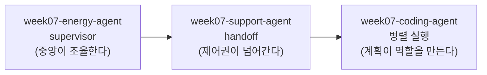
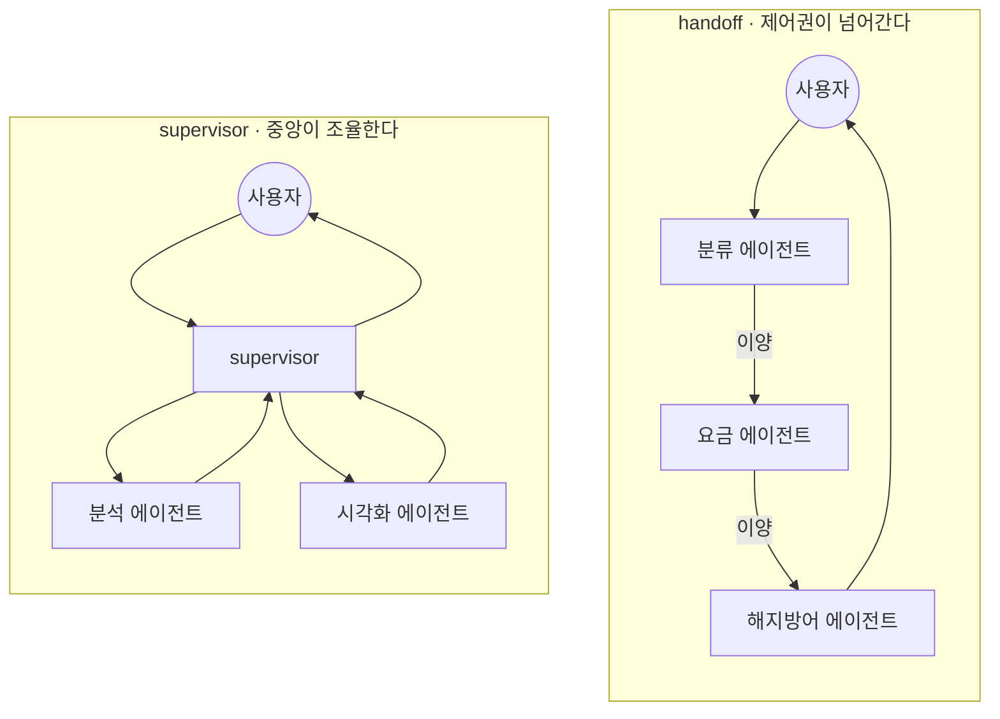
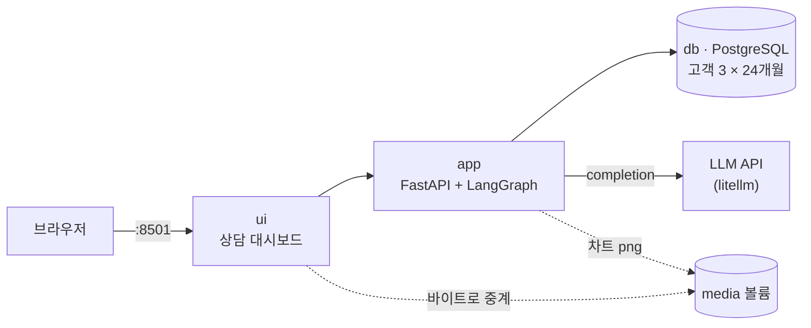
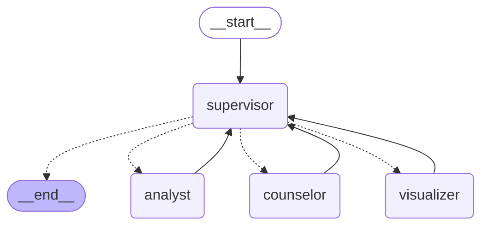
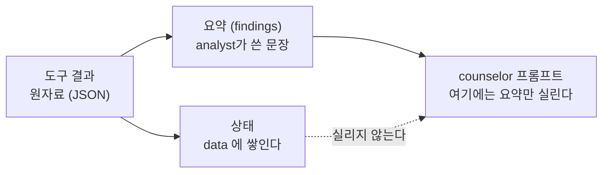
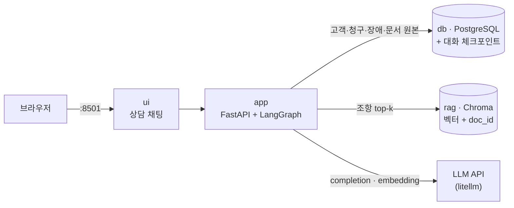
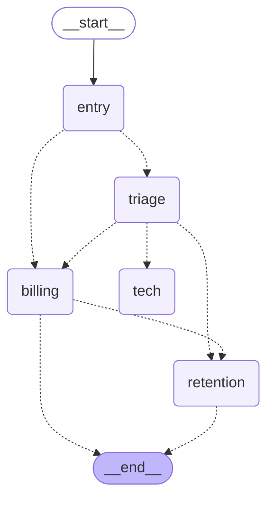
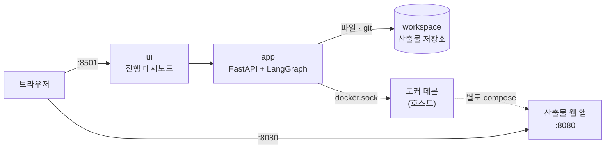
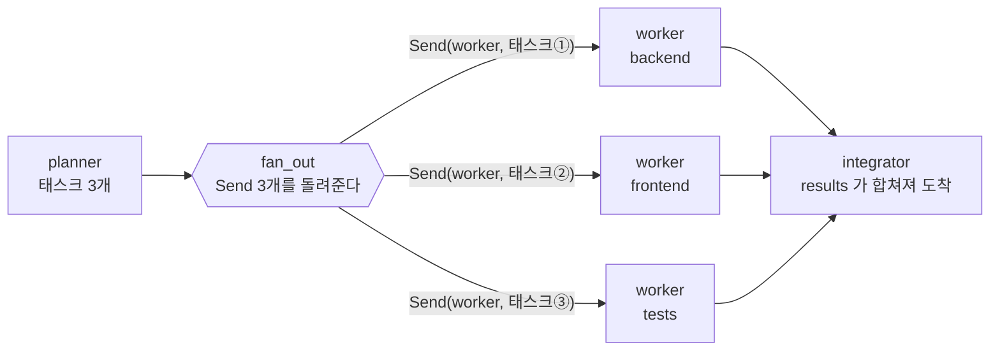
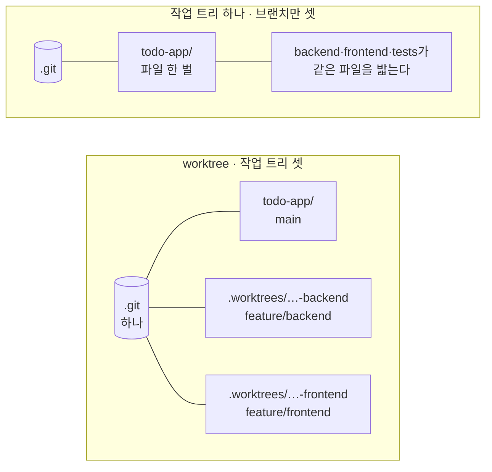

import Slide from 'stack-site-builder/components/Slide.astro';
import RoutingRules from '../../../../components/RoutingRules.astro';
import HandoffRules from '../../../../components/HandoffRules.astro';
import CostGate from '../../../../components/CostGate.astro';

{/* 슬라이드 작성 규칙은 docs/writing-rules.md의 "슬라이드 규칙"을 따릅니다. */}

<Slide class="cover">

# AI 서비스 엔지니어링: Track A

7주차 · 멀티 에이전트 패턴

*CodeCompose · 2026-09-04*

</Slide>

<Slide class="center">

## 지난주의 마지막 문장

**루프가 노드가 되는 구조들**

오늘 그 구조들을 하나씩 열어 봅니다

</Slide>

<Slide>

## 오늘 하는 일
::sub[오늘은 만들지 않고 읽습니다]

- **설계 원칙**: 언제 나누고, 어떻게 잇는가
- **supervisor**: 중앙이 조율하는 구조를 실측으로
- **handoff**: 제어권이 넘어가는 구조를 실측으로
- **병렬 실행**: 계획이 역할을 만드는 구조를 시연으로

완성된 시연 저장소 **3개를 해부**합니다. 이번 주는 실습 산출물이 없습니다.

</Slide>

<Slide>

### 시연 저장소 셋
::sub[따라 하지 않아도 됩니다. 화면으로 함께 봅니다]

```bash
git clone https://github.com/2026-ai-service-engineering-a/week07-energy-agent.git
git clone https://github.com/2026-ai-service-engineering-a/week07-support-agent.git
git clone https://github.com/2026-ai-service-engineering-a/week07-coding-agent.git
```

- 각 저장소는 `docker compose up --build -d`로 뜹니다.
- 시연은 각 저장소의 `demos/` 스크립트와 대시보드로 진행합니다.
- 이 덱의 실행 결과는 같은 코드로 2026-08에 실제로 돌린 실측입니다.

</Slide>

<Slide>

## 오늘의 그림



앞의 둘은 역할을 **사람이 미리 정한** 구조입니다.
셋째는 역할을 **실행 시점에 만드는** 구조입니다.

</Slide>

<Slide class="center">

## 오늘은 사고를 세 번 재현합니다

**과잉 라우팅** (4장) · **핑퐁** (5장) · **통합 실패** (6장)

먼저 터뜨리고, 트레이스를 읽고, 규칙이 잡는 것을 봅니다

</Slide>

<Slide class="cover">

## 3장 · 멀티 에이전트 설계 원칙

*언제 나누고, 어떻게 잇는가*

</Slide>

<Slide>

### 3장이 하는 일
::sub[구조를 보기 전에, 나눌지부터 정합니다]

- 지난주까지 저장소 하나에 에이전트는 **하나**였습니다.
- 그래프의 노드가 도구가 아니라 **다른 에이전트**가 되는 순간,
  새로 생각할 것이 생깁니다.
- 단일 에이전트가 무너지는 신호, 나누는 대가, 두 패턴의 갈림길,
  그리고 LangGraph 최소 문법까지 봅니다.

</Slide>

<Slide class="center">

### 핵심 문장

**나누지 않는 것이 기본이다**.

나누면 반드시 대가를 치른다

</Slide>

<Slide>

### 오늘의 순서

1. 단일 에이전트가 무너지는 신호 셋
2. 나누는 대가 셋
3. 나누기로 했다면 정할 것 넷
4. 두 패턴: supervisor와 handoff
5. LangGraph 최소 문법

</Slide>

<Slide class="center">

### Part 1. 무너지는 신호 셋

멀티 에이전트는 유행이라서 쓰는 구조가 아닙니다.

단일로 먼저 만들고, **무너지는 지점을 확인한 뒤에** 나눕니다.

</Slide>

<Slide>

#### 신호 ①: 도구 선택 품질
::sub[5주차에서 이미 체감한 현상입니다]

- 5주차의 규율: **좁게 준다**. 목록이 길수록 선택 품질이 떨어집니다.
- `10_tool_selection.py`에서 같은 10개 도구를 이름만 바꿔 등록했을 때
  선택이 갈리는 것을 봤습니다.
- 역할마다 필요한 도구만 쥐여 주면, 목록은 저절로 짧아집니다.
  **볼 수 없는 도구는 잘못 부를 수도 없습니다.**

</Slide>

<Slide>

#### 신호 ②: 지침 간섭

- 서로 다른 역할의 지침이 한 시스템 프롬프트에 쌓입니다.
- 분석 지침과 상담 말투가 **한 문서 안에서 다툽니다**.
- "계약전력이 몇 kW인가"라는 한 줄짜리 질문에도
  추이 정리 지침과 상담 말투 지침이 통째로 실려 나갑니다.

4장에서 이 낭비를 글자 수로 잽니다.

</Slide>

<Slide>

#### 신호 ③: 컨텍스트 팽창, 그리고 오염
::sub[6주차의 우상향 계단을 회수합니다]

- 6주차 실측: 첫 스텝 810토큰이 여섯 스텝 만에 1,552토큰.
  합계 7,400토큰 중 대부분이 **같은 내용의 재전송**이었습니다.
- 역할이 섞이면 거기에 **오염**이 얹힙니다.
  분석용 원자료가 상담 단계까지 따라와,
  뒤 작업이 앞 작업의 찌꺼기를 계속 실어 나릅니다.

</Slide>

<Slide class="center">

### Part 2. 나누는 대가

나누면 좋아지기만 한다면 전부 나눴을 것입니다.

대가가 셋 있습니다.

</Slide>

<Slide>

#### 대가 셋

- **왕복이 늘어납니다.** 에이전트 사이를 오갈 때마다 호출이 더해지고,
  지연과 비용도 함께 늘어납니다.
- **상태 전달을 설계해야 합니다.** 전부 넘기면 오염이 따라가고,
  요약해서 넘기면 정보가 샙니다. 무엇을 넘길지가 곧 설계입니다.
- **라우팅이라는 새 실패 모드가 생깁니다.** 도구를 잘못 고르면 결과가
  이상해지지만, 일을 엉뚱한 에이전트에게 보내면
  **그럴듯한 답이 엉뚱한 근거 위에** 세워집니다.

</Slide>

<Slide class="center">

### Part 3. 정할 것 넷

단일 에이전트에서는 생각할 필요가 없던 결정들입니다.

오늘 볼 세 저장소는 같은 네 질문에 각각 다르게 답한 결과입니다.

</Slide>

<Slide>

#### 경계 · 이양 · 화물 · 정지

| 결정 | 질문 | 이 과정의 답 |
| --- | --- | --- |
| **경계** | 누가 무엇을 맡는가 | 역할별로 도구를 나눈다 |
| **이양** | 제어권이 어떻게 움직이는가 | 중앙 복귀냐, 넘겨주고 손 떼기냐 |
| **화물** | 무엇을 함께 보내는가 | 요약만이냐, 대화 통째로냐 |
| **정지** | 언제 멈추는가 | 왕복·이양·수정에 숫자 한도 |

</Slide>

<Slide class="center">

#### 안전장치는 판단이 아니라 숫자다

6주차 스텝 한도와 같은 이유입니다.

판단하는 안전장치는 판단이 틀리면 함께 틀립니다

</Slide>

<Slide class="center">

### Part 4. 두 패턴

나누기로 했다면 다음 질문은 하나입니다.

**제어권을 누가 쥐는가.**

</Slide>

<Slide>

#### supervisor와 handoff



</Slide>

<Slide>

#### 두 패턴 비교

| | supervisor | handoff |
| --- | --- | --- |
| 제어권 | 중앙이 계속 쥔다 | 넘긴 쪽은 손을 뗀다 |
| 결과가 가는 곳 | 중앙으로 돌려준다 | 사용자에게 직접 답한다 |
| 어울리는 문제 | 여러 작업을 쪼개 합치는 일 | 담당이 옮겨가는 일 |
| 새 실패 모드 | 과잉 라우팅 | 오배송과 핑퐁 |

**결과를 모아야 하면 supervisor, 담당이 바뀌면 handoff.**

</Slide>

<Slide>

#### 둘 말고도 있는 것

| 모양 | 무엇인가 | 왜 오늘 따로 다루지 않는가 |
| --- | --- | --- |
| 파이프라인 | 순서가 고정된 줄 세우기 | 라우팅 판단이 없다 |
| 네트워크 | 누구나 누구에게 넘긴다 | handoff의 제한을 푼 것. 핑퐁이 커진다 |
| 계층 | supervisor 위에 supervisor | 한 번 이해하면 겹치는 일 |
| 동적 팀 구성 | 계획이 역할을 그때그때 만든다 | **6장이 정확히 이것이다** |

</Slide>

<Slide class="center">

### Part 5. LangGraph 최소 문법

세 저장소는 LangGraph 위에 서 있습니다.

새 개념이 아니라, 6주차에 손으로 짠 루프의 **정식 표기법**입니다.

</Slide>

<Slide>

#### 6주차의 for 루프와 1:1

| 6주차 손 루프 | LangGraph |
| --- | --- |
| 함수 하나가 한 단계 처리 | **노드**: 상태를 받아 조각을 돌려주는 함수 |
| `if not message.tool_calls` 분기 | **조건부 엣지** |
| `for` 되돌아가기 | 엣지가 앞 노드로 **되돌아온다** |
| `messages.append(...)` | **리듀서**: 덮어쓰지 않고 쌓는다 |
| `max_steps` | 라우팅 상한 |

</Slide>

<Slide>

#### 코드 포인트: 그래프 선언

```python
graph = StateGraph(State)
graph.add_node("supervisor", supervisor)   # 노드 = 함수
graph.add_node("analyst", analyst)
graph.add_edge("analyst", "supervisor")    # 일이 끝나면 중앙으로
graph.add_conditional_edges(               # 분기는 조건부 엣지
    "supervisor", route, ["analyst", "counselor", END])
app = graph.compile()
result = app.invoke({"question": "지난달 요금이 왜 이렇게 나왔나요?"})
```

- **노드는 정하고, 엣지는 나른다.**
- 6주차 루프의 `if`와 `for`가 엣지 선언으로 옮겨 왔을 뿐입니다.

</Slide>

<Slide>

#### 리듀서: 상태를 쌓는 규칙

```python
class State(TypedDict):
    question: str                                  # 덮어쓴다
    findings: Annotated[list[dict], operator.add]  # 쌓는다
    data: Annotated[list[dict], operator.add]      # 쌓는다
```

- 노드 둘이 같은 키에 리스트를 돌려주면 리듀서가 **합칩니다**.
- 손 루프의 `messages.append`가 선언으로 바뀐 것입니다.
- 6장의 병렬 실행에서 이 성질이 결정적으로 쓰입니다.

</Slide>

<Slide>

#### 오늘 처음 나오는 것 둘
::sub[여기서는 이름과 쓰임만 익혀 둡니다]

| 이름 | 한 줄로 | 어디서 |
| --- | --- | --- |
| `Command` | 상태 갱신과 다음 노드를 **한 번에** 돌려준다 | 5장 (handoff) |
| `Send` | 같은 노드를 **여러 벌 동시에** 띄운다 | 6장 (병렬) |

각각 처음 필요해지는 자리에서 자세히 봅니다.

</Slide>

<Slide>

### 3장이 남기는 것

- 나누지 않는 것이 기본이다. 신호를 확인한 뒤에 나눈다
- 신호 셋: 도구 선택 품질, 지침 간섭, 컨텍스트 오염
- 대가 셋: 왕복 증가, 상태 전달 설계, 라우팅이라는 새 실패 모드
- 결과를 모아야 하면 supervisor, 담당이 바뀌면 handoff
- LangGraph는 6주차 손 루프의 정식 표기법이다

</Slide>
<Slide class="cover">

## 4장 · Supervisor 패턴

`week07-energy-agent`

*전기 요금 상담 대시보드*

</Slide>

<Slide>

### 4장이 하는 일
::sub[나누는 것이 이득인지를 숫자로 확인합니다]

- 제품: "지난달 요금이 왜 이렇게 많이 나왔나요?"에
  수치와 그래프로 답하는 상담 대시보드
- 같은 질문을 **단일 에이전트와 supervisor 구조에 나란히** 던집니다.
- 라우팅이 흔들리는 사고를 재현하고, 규칙으로 되찾아옵니다.

</Slide>

<Slide class="center">

### 핵심 문장

**나누는 것이 이득인지는 주장이 아니라 숫자로 확인한다**.

</Slide>

<Slide>

### 오늘의 순서

1. 시스템 구조와 데이터
2. v0.1: 단일 에이전트라는 기준점
3. v0.2: supervisor로 나눈다, 그리고 실측
4. 사고 재현 ①: 라우팅은 흔들린다
5. v1.0: 하이브리드 라우팅

</Slide>

<Slide>

### 시스템 구조: 컨테이너 셋에 볼륨 하나



- 4주차에서 익힌 compose 구성 그대로입니다. 새것은 `media` 볼륨 하나
- LLM 호출은 전부 litellm입니다. 5주차의 그 한 줄입니다.

</Slide>

<Slide>

### 데이터: 요금이 튀는 달이 있어야 한다

| 고객 | 성격 | 최근 달 |
| --- | --- | --- |
| 김한전 (4인 가구) | 여름 냉방으로 크게 튄다 | 754kWh · 208,070원 |
| 박전기 (1인 가구) | 낮고 평탄하다 | 낮음 |
| 이절전 (2인 가구) | 전기 난방이라 겨울이 높다 | 중간 |

- 시드 생성기가 난수 씨앗을 고정해 만들고, 결과를 SQL로 커밋합니다.
- 누진 3단계 근사: 사용량이 2배 늘면 요금은 3배가 됩니다.
  **이 비선형이 제품이 설명해야 할 핵심**입니다.

</Slide>

<Slide class="center">

### Part 1. v0.1 · 단일 에이전트라는 기준점

첫 단은 일부러 **나누지 않고** 만듭니다.

advisor 하나가 도구 다섯을 들고 분석도 하고 상담 말투도 씁니다.

</Slide>

<Slide>

#### v0.1을 돌려 보면

```text
[질문] 지난달 요금이 왜 이렇게 많이 나왔나요?
  프롬프트 1,105자 · 답변 직전 컨텍스트 2,640자 · LLM 호출 3회
    - advisor: 도구: compare_usage
    - advisor: 도구: bill_breakdown
    - advisor: 답변 작성

[질문] 제 계약전력이 몇 kW인가요?
  프롬프트 1,105자 · 답변 직전 컨텍스트 1,638자 · LLM 호출 2회
```

- 볼 것은 답변 품질이 아니라 **1,105이라는 같은 숫자**입니다.
- 한 줄짜리 질문에도 추이 지침과 상담 말투가 통째로 실려 나갑니다.

</Slide>

<Slide class="center">

#### "그냥 에이전트 하나로 하면 되잖아?"

맞는 질문입니다. 실제로 **됩니다**. 방금 봤습니다.

나누는 기준은 유행이 아니라 신호이고, 답은 숫자로 확인합니다

</Slide>

<Slide>

### Part 2. v0.2 · supervisor로 나눈다



**모든 실선이 supervisor로 돌아옵니다.** 하위 에이전트는 서로를 부르지 않습니다.

</Slide>

<Slide>

#### supervisor는 에이전트가 아니라 라우터다

```python
# supervisor가 모델에게 받는 것은 이 한 줄이 전부다
{"next": "analyst", "why": "요금 내역을 먼저 조회해야 한다"}
```

- supervisor는 일을 하지 않습니다. **다음에 누가 일할지만 정합니다.**
- 그래서 도구가 없고, 답변도 쓰지 않습니다.

```python
graph.add_conditional_edges("supervisor", lambda state: state["route"],
                            ["analyst", "visualizer", "counselor", END])
```

6주차의 "도구를 부를까 답할까"가 "누구에게 보낼까"로 바뀌었을 뿐입니다.

</Slide>

<Slide>

#### 서브 에이전트의 안쪽은 6주차의 그 루프다

```python
def _run_with_tools(system, question, customer_id, tool_names, agent):
    """하위 에이전트 하나의 작은 루프. (요약, 원자료, 트레이스, 호출 수)."""
    messages = [{"role": "system", "content": system},
                {"role": "user", "content": question}]
    for _ in range(MAX_TOOL_ROUNDS):                     # 상한 3왕복
        response = completion(model=pick_model(), messages=messages,
                              tools=tool_schemas(tool_names))
        message = response.choices[0].message.model_dump()
        messages.append(message)
        if not message.get("tool_calls"):                # 종료: 요약이 나왔다
            return message.get("content") or "", data, trace, calls
        for call in message["tool_calls"]:
            raw = run_tool(call["function"]["name"],
                           call["function"]["arguments"], customer_id)
            messages.append({"role": "tool", "tool_call_id": call["id"],
                             "content": raw})            # (기록 코드는 생략)
    return "(도구 왕복 한도 초과)", data, trace, calls
```

- 6주차에 손으로 짠 ReAct 루프와 같은 뼈대입니다.
- 서브 에이전트 자리에 들어가는 것이 **여러분이 6주차에 만든 그 에이전트**입니다.

</Slide>

<Slide>

#### 나눌 때 실제로 나누는 것 세 가지

- **지침**: 역할마다 자기 문장만 이고 갑니다
- **도구**: analyst는 조회 도구 넷, visualizer는 `make_chart` 하나만 봅니다.
  볼 수 없는 도구는 잘못 부를 수도 없습니다
- **문맥**: 하위 에이전트는 **요약**(findings)만 위로 올립니다.
  도구가 물어온 원자료(data)는 상태에 쌓이되 프롬프트에는 실리지 않습니다

이 저장소는 시연을 위해 서브 에이전트를 **일부러 얇게** 만들었습니다.
실제 제품에서는 각 노드가 도구 열 개와 자기 하네스를 지닙니다.

</Slide>

<Slide>

#### 실측: 같은 질문, 두 구조

```text
=== 지난달 요금이 왜 이렇게 많이 나왔나요? ===

[single] 에이전트 1 · 지침 1,105자 · 컨텍스트 2,640자 · LLM 호출 3회
    advisor     도구: compare_usage
    advisor     도구: bill_breakdown
    advisor     답변 작성

[supervisor] 에이전트 4 · 지침 199자 · 컨텍스트 466자 · LLM 호출 5회
    supervisor  라우팅 → analyst (규칙: 자료가 없으면 분석부터)
    analyst     도구 3회 · 분석 요약
    supervisor  라우팅 → counselor
    counselor   답변 작성
    supervisor  라우팅 → done
```

</Slide>

<Slide>

#### 표 한 장에 얻은 것과 잃은 것이 같이 있다

| | 단일 (v0.1) | supervisor (v0.2) |
| --- | --- | --- |
| 답변을 쓴 에이전트의 지침 | 1,105자 | 199자 |
| 답변 직전 컨텍스트 | 2,640자 | 466자 |
| LLM 호출 | 3회 | 5회 |

역할별 지침을 다 합치면 1,018자. v0.1의 1,105자와 크게 다르지 않습니다.

```text
supervisor 532자 · analyst 140자 · visualizer 147자 · counselor 199자
```

</Slide>

<Slide class="center">

#### 줄어든 것은 총량이 아니라

**한 번의 호출이 이고 가는 무게입니다**

상담문을 쓰는 순간 필요한 것은 199자짜리 말투 지침이지,
도구 사용법과 차트 규칙이 아닙니다

</Slide>

<Slide>

#### 왜 요약만 위로 올리는가



- 원자료는 사라지지 않습니다. **다음 호출에 실리지 않을 뿐**입니다.
- 대가: 요약하는 순간 정보가 샙니다.
  무엇을 요약에 남길지가 이 구조의 가장 섬세한 부분입니다.

</Slide>

<Slide class="center">

### Part 3. 사고 재현 ①

차트 도구를 붙이면서 사고가 드러납니다.

차트는 visualizer의 일인데, **언제 부를지는 supervisor의 판단**입니다.

판단은 매번 같지 않습니다.

</Slide>

<Slide>

#### 같은 질문에 경로가 달라진다

```text
=== ① 라우팅을 전부 LLM에게 맡김 ===

최근 1년 추이를 그래프로 보여주세요
    그래프 3/3회 · LLM 호출 9~12회
    경로: analyst → visualizer → counselor → done
    경로: analyst → visualizer → counselor → visualizer → done

제 계약전력이 몇 kW인가요?
    그래프 0/3회 · LLM 호출 3~6회
    경로: analyst → counselor → done
    경로: counselor → done
```

같은 질문, 같은 코드, 같은 데이터인데 경로가 갈립니다.

</Slide>

<Slide>

#### 두 번째가 더 무섭다

- **그래프를 두 번 그린 실행**: counselor가 답을 쓴 뒤에
  visualizer를 한 번 더 불렀습니다. 호출이 9회에서 12회로
- **analyst를 건너뛴 실행**: supervisor가 곧장 counselor를 불렀습니다.
  counselor에게는 도구가 없습니다.
  **자료를 한 번도 조회하지 않은 채 상담문을 쓴 것**입니다.

</Slide>

<Slide class="center">

#### 출력만 보면 그럴듯한 답이 나옵니다

**트레이스를 세지 않으면 사고가 났다는 사실 자체를 모릅니다**

6주차의 문장이 여기서 한 번 더 값을 합니다

</Slide>

<Slide>

### Part 4. v1.0 · 하이브리드 라우팅

```python
def _rule_route(state):
    if state.get("answer"):                      # 답이 나왔으면 끝이다
        return "done", "규칙: 답변이 나왔다"
    if "analyst" not in done_agents:             # 자료 없이 할 수 있는 것은 없다
        return "analyst", "규칙: 자료가 없으면 분석부터"
    if wants_chart(state["question"]) and "visualizer" not in done_agents:
        return "visualizer", "규칙: 그래프를 명시적으로 요청했다"
    return None                                  # 애매하면 LLM에게 묻는다
```

- supervisor를 더 똑똑하게 만들지 않았습니다.
- **판단이 필요 없는 자리**를 골라 코드로 확정했습니다.

</Slide>

<Slide>

#### 규칙을 넣은 뒤

| 질문 | LLM 라우팅 | 하이브리드 |
| --- | --- | --- |
| 그래프 요청 | 9\~12회 · 경로 2종 | 6회 고정 · 경로 1종 |
| 애매한 요청 | 6\~7회 · 경로 1종 | 5회 고정 · 경로 1종 |
| 단순 조회 | 3\~6회 · 경로 2종 | 4회 고정 · 경로 1종 |

- 호출 수보다 **폭이 사라진 것**이 중요합니다.
  경로가 고정되면 트레이스가 디버깅 기록이 됩니다.
- 단순 조회의 최소 호출이 3회에서 4회로 는 것은 손해가 아닙니다.
  자료 없이 답하던 그 3회짜리 실행이 사라진 값입니다.

</Slide>

<Slide class="center">

#### 확실한 것은 코드가 정한다

프롬프트로 판단을 교정하지 않습니다.

6주차의 문장 그대로: **프롬프트는 부탁이고 게이트는 물리 법칙입니다**

</Slide>

<Slide>

#### 직접 돌려 보기: 규칙이 멈추는 자리

<RoutingRules />

</Slide>

<Slide>

#### 차트의 숫자는 어디서 오는가

- `make_chart`는 몇 개월치를 그릴지와 제목만 받습니다. **수치는 받지 않습니다.**
- 도구가 db에서 직접 조회해 그립니다.
- LLM이 옮겨 적은 숫자로 그리면 막대 높이가 원본과 어긋날 수 있고,
  그것은 화면에서 확인할 방법이 없는 종류의 오류입니다.
- 4주차의 "원본 한 벌" 규율과 같은 이유입니다.

</Slide>

<Slide>

### 4장이 남기는 것

- 단일로 먼저 만든다. v0.1은 지우지 않는다. **비교 기준점이다**
- 나누면 지침 5분의 1, 컨텍스트 6분의 1. 대신 호출 3회가 5회로
- 줄어드는 것은 총량이 아니라 한 번의 호출이 이고 가는 무게다
- 요약만 위로 올리고 원자료는 상태에 남긴다
- 라우팅은 흔들린다. 확실한 것은 코드가 정한다

</Slide>
<Slide class="cover">

## 5장 · Handoff 패턴

`week07-support-agent`

*가상 통신사 누리통신의 고객 상담 채팅*

</Slide>

<Slide>

### 5장이 하는 일
::sub[제어권이 넘어가고, 돌아오지 않습니다]

- 접수 상담원이 문의를 받아 요금·기술지원·해지방어 담당에게 넘깁니다.
- 넘긴다는 것이 **코드에서 무엇인지**, 넘긴 뒤 무엇이 망가지는지,
  그 자유를 어디까지 규칙으로 묶어야 하는지를 실측으로 봅니다.

</Slide>

<Slide class="center">

### 핵심 문장

**넘길 자유가 크다는 것은 잘못 넘길 자유도 크다는 뜻이다**.

</Slide>

<Slide>

### 오늘의 순서

1. supervisor와 무엇이 다른가
2. v0.1: 말만 하는 분류
3. v0.2: 제어권이 실제로 넘어간다 (`Command`)
4. 사고 재현 ②: 핑퐁과 말로만 넘김
5. v0.3: 라우팅 기준 셋
6. v1.0: RAG가 부품이 된다

</Slide>

<Slide>

### supervisor와 무엇이 다른가

| | supervisor (4장) | handoff (5장) |
| --- | --- | --- |
| 제어권 | 늘 중앙으로 복귀 | 넘어간 곳에 남는다 |
| 넘기는 것 | 요약(findings) | **대화 전체** |
| 다음 턴 | 다시 supervisor부터 | 담당이 바로 받는다 |
| 중앙의 역할 | 매 왕복을 조율 | 첫 배분 이후 사라진다 |
| 새 실패 모드 | 라우팅 실수 | 잘못 넘긴 뒤 돌아올 길이 없음 |

이 한 줄의 차이가 코드와 상태와 실패 모드를 모두 바꿉니다.

</Slide>

<Slide>

### 컨테이너 넷
::sub[4주차의 rag 컨테이너가 돌아왔습니다]



4주차에서 검색은 **제품 자체**였습니다. 여기서는 담당 하나가 쓰는 **도구**입니다.

</Slide>

<Slide>

### 데이터: 상담이 성립하려면 사연이 있어야 한다

| 고객 | 사연 | 어디로 갈 문의인가 |
| --- | --- | --- |
| 김누리 | 데이터 초과 6GB + 로밍 38,500원 | 요금 |
| 박서준 | 어제 대전 서구 인터넷 4시간 장애 | 기술지원 |
| 이하늘 | 약정이 이번 달 만료, 떠나려 한다 | 해지방어 |
| 최민수 | 요금도 늘었고 인터넷도 끊겼다 | **복합** |

약관·정책 문서 50건은 **조항 번호로 가리킬 수 있는 단위**로 쪼개져 있습니다.
v1.0의 인용 검증이 이 구조 위에서만 성립합니다.

</Slide>

<Slide>

### Part 1. v0.1 · 말만 하는 분류

```text
[김누리] 이번 달 요금이 왜 이렇게 많이 나왔나요?
    분류: 요금 · 담당: triage
[김누리] 그래서 얼마인데요?
    분류: 요금 · 담당: triage
[김누리] 언제 고쳐지나요?
    분류: 불명 · 담당: triage
```

- 세 턴 내내 담당이 변하지 않습니다.
- 접수 상담원에게는 조회 도구가 없으므로 금액도 원인도 말할 수 없고,
  "연결해 드리겠습니다"라는 같은 약속만 반복합니다.

</Slide>

<Slide class="center">

#### 분류는 판단이고

**판단만으로는 아무도 움직이지 않습니다**

이것이 v0.2와 비교할 기준점입니다

</Slide>

<Slide>

### Part 2. v0.2 · 제어권이 실제로 넘어간다



supervisor 그림과 나란히 놓고 보십시오.
**되돌아오는 화살표가 없습니다.** 대신 담당끼리 옆으로 잇는 화살표가 있습니다.

</Slide>

<Slide>

#### `Command`가 무엇인가

```python
# 지금까지: 상태만 돌려주고, 이동은 엣지가 정한다
def supervisor(state):
    return {"route": "analyst"}          # 엣지가 이 값을 읽는다

# Command: 상태 갱신과 이동을 한 번에 돌려준다
def triage(state):
    return Command(goto="billing",
                   update={"current_agent": "billing"})
```

| | 조건부 엣지 | `Command` |
| --- | --- | --- |
| 이동을 정하는 곳 | 그래프(엣지 함수) | **노드 자신** |
| 어울리는 구조 | 중앙이 다음을 정하는 supervisor | 각자가 다음을 정하는 handoff |

요금 담당이 해지방어에게 넘길 때, 그 결정을 아는 것은 요금 담당뿐입니다.
중앙에 물어보지 않고 **자기가 옮깁니다.**

</Slide>

<Slide>

#### 이양은 도구 호출이다

```python
if called in HANDOFF_TARGETS:              # 여기서 제어권이 넘어간다
    target = HANDOFF_TARGETS[called]
    return Command(goto=target, update={
        "current_agent": target,
        "handoffs": [{"from": name, "to": target, "reason": reason}],
        "came_from": name,
    })
```

- 모델이 `transfer_to_billing`을 부르면 코드가 이동으로 바꿉니다.
- 인자는 이유 한 줄뿐입니다.
- 5주차의 문장 그대로: 에이전트가 세계를 바꾸는 통로는 **도구 호출**입니다.

</Slide>

<Slide>

#### 함께 넘어가는 것, 남는 것

- **넘어가는 것은 대화 전체입니다.** supervisor는 요약만 올렸지만,
  여기서는 받는 쪽이 고객의 말을 직접 읽습니다.
  요약하는 사람이 중간에 없기 때문입니다.
- **담당은 체크포인터에 남습니다.** 이것이 없으면 handoff가 아니라
  한 번의 우회일 뿐입니다.

```python
def entry(state):
    current = state.get("current_agent") or ""
    if current in ("billing", "tech", "retention"):
        return Command(goto=current)      # 접수를 거치지 않는다
    return Command(goto="triage")
```

</Slide>

<Slide>

#### 실측: 같은 대화, 두 구조

```text
=== v0.1 분류만 ===
[고객] 이번 달 요금이 왜…      받은 사람: 접수 상담원
[고객] 그래서 얼마나…          받은 사람: 접수 상담원
[고객] 그냥 해지할래요.        받은 사람: 접수 상담원

=== v0.2 handoff ===
[고객] 이번 달 요금이 왜…      받은 사람: 요금 담당
[고객] 그래서 얼마나…          받은 사람: 요금 담당
[고객] 그냥 해지할래요.        받은 사람: 해지방어 담당

이양 기록
    접수 상담원 → 요금 담당 (요금 과다 청구 및 납부 관련 문의)
    요금 담당 → 해지방어 담당 (고객이 해지를 요청하여 이관)
```

- 두 번째 턴에서 접수를 다시 거치지 않은 것이 **체크포인터의 몫**
- 세 번째 턴에서 요금 담당이 직접 넘긴 것이 **handoff의 몫**

</Slide>

<Slide>

#### 함정: 매 턴 상태를 통째로 보내면 이양이 지워진다

```python
def new_turn(customer_id, customer_name, message):
    """이어지는 턴이 들고 오는 것은 고객이 방금 한 말뿐이다."""
    return {"messages": [{"role": "user", "content": message}],
            "customer_id": customer_id, "customer_name": customer_name,
            "turn_handoffs": 0, "came_from": ""}
```

- 개발 중 실제로 겪은 사고입니다. 습관처럼 `current_agent: ""`를 함께
  보냈더니, 체크포인터의 담당을 덮어써 **매 턴 접수부터** 다시 시작했습니다.
- 화면상으로는 잘 도는 것처럼 보였고, 트레이스를 세어야 보였습니다.
- 상태에 남길 것과 매 턴 새로 보낼 것을 나누는 일이 설계의 일부입니다.

</Slide>

<Slide class="center">

### Part 3. 사고 재현 ②

v0.2를 그대로 두고 같은 문의를 3회씩 던져 세어 봤습니다.

</Slide>

<Slide>

#### 핑퐁, 말로만 넘김, 경로 흔들림

```text
=== ① 규칙 없이 (v0.2) ===

[복합 문의] 요금도 이상하고 인터넷도 안 돼요.
    이양 0회 · 말로만 넘김 2/3 · 되물음 1/3

[이어지는 불만] 너무 비싸네요. 그냥 해지할래요.
    이양 2~4회 · 핑퐁 1/3 · 경로 2종
    경로: 접수 → 요금 → 해지방어 → 요금 → 해지방어

[분류 불가] 저기요, 좀 답답해서 전화드렸어요.
    이양 0회 · 말로만 넘김 3/3
```

- **말로만 넘김**: 도구를 부르지 않고 "연결해 드리겠습니다"라고만.
  v0.1로 되돌아간 셈인데, 답변만 보면 알 수 없습니다
- **핑퐁**: 넘겨받은 담당이 "이건 저쪽 일"이라며 도로 넘깁니다.
  한 턴 이양 상한이 없었다면 계속 돌았을 것입니다

</Slide>

<Slide>

### Part 4. v0.3 · 기준 셋을 코드로

```python
def _routing_plan(state, name):
    # ② 방금 넘겨준 곳으로 되돌리지 않는다
    back = transfer_tool_of(state.get("came_from"))
    if back in allowed:
        allowed.remove(back)

    # ③ 두 갈래가 섞여 들어오면 접수는 넘기지 않고 되묻는다
    if name == "triage" and len(topics_in(last_user_message)) >= 2:
        return [], True, "규칙: 문의가 둘 이상이라 되묻는다"

    # ① 접수의 출력은 언제나 도구 호출이다
    return allowed, name == "triage", note
```

4장과 같은 방식입니다. 프롬프트로 타이르지 않고,
**판단이 필요 없는 자리를 코드가 가져옵니다.**

</Slide>

<Slide>

#### `tool_choice`: 쥐어주는 것과 쓰게 하는 것은 다르다

| `tool_choice` | 뜻 | 여기서 |
| --- | --- | --- |
| `"auto"` (기본) | 쓸지 말지 모델이 정한다 | 전문 담당 |
| `"required"` | 반드시 하나는 부른다 | **접수 상담원** |
| `"none"` | 부르지 못한다 | 쓰지 않음 |

```python
schemas = handoff_schemas(allowed) + [ASK_TOOL]          # 넘기거나, 되묻거나
completion(..., tools=schemas, tool_choice="required")   # 둘 중 하나는 반드시
```

"말로만 넘김"은 도구를 안 준 문제가 아니라 **줬는데 안 쓴** 문제였습니다.

</Slide>

<Slide class="center">

#### 강제하기 전에 도망갈 문을 만들어 둔다

넘길 곳이 없는데 반드시 부르라고 하면 아무 데나 넘깁니다.

`ask_clarification`이라는 문이 있어야 `required`가 안전해집니다

</Slide>

<Slide>

#### 기준을 세우고

```text
=== ② 기준을 세우고 (v0.3) ===

[복합 문의]      이양 0회 · 되물음 3/3
[이어지는 불만]  이양 2회 고정 · 경로 1종
[분류 불가]      이양 0회 · 되물음 3/3
```

모델이 더 똑똑해진 것이 아닙니다.
되묻기는 원래 좋은 상담원이 하는 일이고, 그것을 **규칙이 보장한 것**입니다.

</Slide>

<Slide>

#### 직접 돌려 보기: 규칙은 고르지 않고 좁힌다

<HandoffRules />

</Slide>

<Slide>

### Part 5. v1.0 · RAG가 부품이 된다
::sub[4주차에 제품이었던 것이 도구가 됩니다]

- 요금·해지방어 담당에게 약관 검색 도구를 줍니다.
  기술지원 담당에게는 주지 않습니다.
- 원본 한 벌 규율 그대로: 본문은 PostgreSQL `documents` 표에만,
  Chroma에는 벡터와 `doc_id`만
- 색인이 통째로 날아가도 `build_index.py` 한 번이면 복구됩니다.

```text
[김누리] 데이터 초과 요금은 어떻게 계산되나요? 근거 조항도 알려주세요.
    받은 사람: 요금 담당
    검색: 제9조 2항 · 정책 D-1 · 제9조 3항 · 제7조 4항
    인용: 제9조 2항 — 확인
```

</Slide>

<Slide>

#### 인용마다 두 가지를 따로 본다

- **존재**: 그 조항이 실제로 있는가. 없으면 지어낸 것입니다
- **근거**: 이번 턴에 실제로 검색한 조항인가.
  존재하는 조항이라도 찾아보지 않고 말했다면 맞은 것은 우연입니다

```text
답변(가정): 제9조 2항과 제99조 3항에 따라 초과 요금이 산정됩니다.
판정: 인용 2건 · 없는 조항 제99조 3항
```

검증자는 문장을 읽지 않습니다. **번호만 봅니다.** 그래서 결정적입니다.
6주차 Reflexion에서 본 "검증은 코드로"의 그 자리입니다.

</Slide>

<Slide>

### 두 패턴을 언제 고르는가

| | supervisor | handoff |
| --- | --- | --- |
| 일의 성격 | 여러 결과를 모아 하나를 만든다 | 한 담당이 끝까지 맡는다 |
| 대화 | 한 번의 요청과 한 번의 답 | 여러 턴이 이어진다 |
| 문맥 | 요약해도 되는 것 | 원문이 필요한 것 |
| 비용 | 왕복마다 중앙 호출이 붙는다 | 넘길 때만 붙는다 |
| 위험 | 중앙이 병목이자 단일 실패점 | 잘못 넘기면 돌아올 길이 없다 |

**구조가 문제를 따라간 것이지 그 반대가 아닙니다.**

</Slide>

<Slide>

### 5장이 남기는 것

- 넘긴다는 것은 도구 호출을 `Command(goto=…)`로 바꾸는 것이다
- 함께 넘어가는 것은 대화 전체. 요약하는 사람이 중간에 없다
- 담당은 체크포인터에 남는다. 매 턴 덮어쓰면 이양이 지워진다
- 망가지는 모양: 말로만 넘김, 핑퐁, 경로 흔들림
- 규칙 셋: 반드시 도구로, 되돌리지 않기, 섞이면 되묻기
- RAG는 부품이 된다. 인용은 번호로, 검증은 코드로

</Slide>
<Slide class="cover">

## 6장 · 병렬 실행

`week07-coding-agent`

*SPEC 한 장을 웹 앱으로*

</Slide>

<Slide>

### 6장이 하는 일
::sub[5\~7주차가 여기서 합쳐집니다]

- 제품: SPEC 문서를 주면 태스크로 쪼개고, 여러 에이전트가 각자의
  브랜치에서 코드를 짜고, 머지해서 테스트하고, 도커로 띄웁니다.
- 새 개념은 둘뿐입니다. `Send`와 `git worktree`
- 나머지는 전부 배운 것이 각자의 자리를 찾은 것입니다.

</Slide>

<Slide class="center">

### 핵심 문장

**병렬화는 모델의 문제가 아니라 작업 공간의 문제다**.

</Slide>

<Slide>

### 배운 것이 각자의 자리를 찾는다

| 어디서 왔나 | 여기서 무엇이 되었나 |
| --- | --- |
| 5주차 도구 루프 | `write_file` 하나. "에이전트가 코드를 짠다"의 실체 |
| 6주차 Plan-and-Execute | planner가 SPEC을 세 태스크로 쪼갠다 |
| 6주차 Reflexion | 빌드 실패 로그를 fixer에게 되먹인다 |
| 6주차 하네스 | 스텝·수정·재계획 한도. 폭주하지 않는 이유 |
| 6주차 budget guard | 실행 전 추정으로 진화해 **사람에게 묻는 문**이 된다 |
| 7주차 병렬 실행 | `Send`로 셋을 동시에, worktree로 격리 |

</Slide>

<Slide>

### 오늘의 순서

1. 경계를 먼저 긋는다
2. v0.1: 순차라는 기준점
3. v0.2: `Send`와 worktree
4. v0.3: 값을 먼저 묻는 문
5. 사고 재현 ③: 실패한 뒤가 진짜 일이다
6. v1.0: 전체 실행

</Slide>

<Slide>

### 만드는 것과 만들어진 것



- 산출물은 이 compose가 아니라 자기 compose로 **따로** 뜹니다.
- 대시보드가 죽어도 산출물은 돌고, 산출물을 내려도 대시보드는 남습니다.
- **만드는 것과 만들어진 것을 섞지 않는 것**이 이 저장소의 첫 규율입니다.

</Slide>

<Slide>

### Part 1. 경계를 먼저 긋는다

| | 누가 쓰는가 | 왜 |
| --- | --- | --- |
| `app.py` | backend 에이전트 | 제품 코드 |
| `static/index.html` | frontend 에이전트 | 제품 코드 |
| `tests/test_api.py` | tests 에이전트 | 제품 코드 |
| Dockerfile · compose · requirements | **골격** | 매번 흔들릴 이유가 없다 |
| 브랜치 · 커밋 · 머지 · 빌드 | **하네스** | 모델이 git을 부를 이유가 없다 |

- 소유권 밖의 파일에 쓰려 하면 **코드가 거부**합니다.
- 엔드포인트 규약(CONTRACT)은 골격이 정해 세 프롬프트에 그대로 실립니다.

</Slide>

<Slide>

### Part 2. v0.1 · 한 사람이 하나씩

```text
역할        모델                              구간
backend   (저가 모델)             2.0s →   3.9s  완료
frontend  (저가 모델)             3.9s →   8.6s  완료
tests     (저가 모델)             8.6s →  11.2s  완료

전체 13.4초 · LLM 4회 · 출력 3,191 토큰 · $0.0086
머지 True · 테스트 True · 기동 True
```

- 동작합니다. 그리고 **구간이 겹치지 않습니다.**
- 셋은 서로의 결과를 기다릴 이유가 없는데도 줄을 서 있습니다.

</Slide>

<Slide>

### Part 3. v0.2 · `Send`가 무엇인가

```python
def fan_out(state):
    """여기가 v0.2의 전부다. 태스크마다 worker 하나씩."""
    return [Send("worker", {"task": task, "spec": state["spec"], "index": index})
            for index, task in enumerate(state["tasks"])]
```

- 조건부 엣지는 지금까지 **문자열 하나**를 돌려주었습니다.
- 같은 자리에서 `Send`의 **리스트**를 돌려주면,
  같은 노드가 **여러 벌 동시에** 뜹니다.
- 페이로드는 그 실행분의 입력입니다. worker가 받는 것은
  전체 상태가 아니라 자기 몫의 딕셔너리 하나입니다.

</Slide>

<Slide>

#### 갈라졌다가 모인다



돌아오는 길은 리듀서가 맡습니다. 세 worker의 `{"results": [결과]}`를
`Annotated[list, operator.add]`가 합칩니다.
**병렬의 절반은 리듀서가 이미 하고 있었습니다.**

</Slide>

<Slide>

#### 미리 그린 엣지와 무엇이 다른가

| | 미리 그린 병렬 엣지 | `Send` |
| --- | --- | --- |
| 개수 | 그래프를 짤 때 고정 | **실행 시점에 정해진다** |
| 각 실행의 입력 | 같은 상태 | 서로 다른 페이로드 |
| 어울리는 일 | 역할이 고정된 분업 | 목록을 훑는 일(map) |

SPEC이 태스크 다섯으로 쪼개지면 worker도 다섯이 됩니다.
그래프를 다시 그리지 않습니다. **계획이 역할을 만듭니다.**

</Slide>

<Slide>

#### 브랜치와 작업 트리는 다른 것이다



- **브랜치는 이름표이고, 작업 트리는 실제 파일이 놓인 디렉터리입니다.**
- 셋이 동시에 checkout 하면 마지막으로 실행한 것이 이깁니다.
  브랜치를 나눠도 **파일은 한 벌뿐**이기 때문입니다.

</Slide>

<Slide>

#### 코드 포인트: worktree 격리

```python
worktree = runner.project.add_worktree(task["role"], task["branch"])
try:
    result = work_on(runner, task, payload["spec"], task["model"], worktree)
finally:
    runner.project.remove_worktree(task["role"])   # 브랜치는 남고 디렉터리만 치운다
```

```sh
git worktree add -b feature/backend /workspace/.worktrees/todo-app-backend main
git worktree remove --force /workspace/.worktrees/todo-app-backend
```

같은 저장소에 작업 디렉터리를 하나 더 붙입니다.
커밋 이력은 공유하고 **파일만 따로** 씁니다.

</Slide>

<Slide class="center">

#### 병렬로 벌고 싶은 것은

**모델이 파일을 쓰는 시간입니다**

git 명령 자체는 오히려 자물쇠로 줄을 세웠습니다.
worktree 장부를 동시에 건드려서 얻을 것은 없기 때문입니다

</Slide>

<Slide>

#### 실측: 순차와 병렬

```text
=== v0.1 순차 ===
backend      2.0s →   3.9s          ██████
frontend     3.9s →   8.6s                ████████████████
tests        8.6s →  11.2s                                 █████████
전체 13.4초 · $0.0086 · 기동 True

=== v0.2 병렬 (Send + worktree) ===
backend      2.5s →   4.8s                 █████████████
frontend     2.5s →   6.7s                 █████████████████████████
tests        2.5s →   4.9s                 ██████████████
전체 8.8초 · $0.0085 · 기동 True
```

</Slide>

<Slide class="center">

#### 시간은 줄고 비용은 그대로입니다

같은 일을 같은 모델로 하기 때문입니다.

**병렬화가 파는 물건은 시간 하나뿐이고,
그것을 정확히 아는 것이 중요합니다**

</Slide>

<Slide>

### Part 4. v0.3 · 값을 먼저 묻는 문
::sub[6주차 budget guard의 진화형입니다]

```text
=== ① 상한 $0.05, 넉넉하다 ===
    묻지 않고 끝까지 갔다 · 8.8초 · 실측 $0.0087

=== ② 상한 $0.005, 빠듯하다. 승인한다 ===
    추정 합계 $0.0114 (상한 $0.0050)
    사람이 승인한다 → 7.7초 · 실측 $0.0089

=== ③ 상한 $0.005, 빠듯하다. 중단한다 ===
    비용 상한을 넘어 사용자가 중단했습니다
    실측 $0.0011. planner 한 번뿐이다. worker는 돌지 않았다.
```

- 6주차의 budget guard는 실행 **중**의 장부였습니다.
- 이 문은 실행 **전**의 추정이고, 넘으면 **사람에게 묻습니다**.

</Slide>

<Slide class="center">

#### 거절할 수 있어야 문이다

세 번째 사례가 이 기능의 값어치입니다.

매번 묻는 문은 문이 아니고,
거절할 수 없는 물음은 물음이 아닙니다

</Slide>

<Slide>

#### 직접 돌려 보기: 난이도 판정이 비용을 가른다

<CostGate />

</Slide>

<Slide class="center">

### Part 5. 사고 재현 ③

셋이 따로 짜면 규약의 빈틈에서 어긋납니다.

사람 팀에서도 똑같이 나는 사고입니다.

</Slide>

<Slide>

#### 실패한 뒤가 진짜 일이다

```text
FAILED tests/test_api.py::test_create_todo - assert 201 == 200
```

backend는 생성에 201을 돌려주고 tests는 200을 기대했습니다.
규약이 상태 코드를 못 박지 않았기 때문입니다.

- **고치기**: 실패 로그를 fixer에게 되먹입니다.
  로그와 세 파일과 규약을 보고 **한 번에 한 파일만** 다시 씁니다. 최대 2회
- **재계획**: 그래도 안 되면 planner로 돌아갑니다. 최대 1회
- **포기**: 그다음은 멈춥니다. **무한히 도는 자동화는 자동화가 아닙니다**

</Slide>

<Slide>

#### fixer는 테스트를 고쳤다

```text
=== integrator가 로그를 읽고 한 파일을 고친다 ===
    수정 1회차 · 고친 파일 ['tests/test_api.py'] → 테스트 True
    비용: $0.0089 (수정은 상위 모델로)
```

- 규약과 어긋난 쪽이 테스트였기 때문입니다.
  무엇을 고칠지는 모델이 정하고, 한 번에 한 파일이라는 제약만 코드가 겁니다.
- 6주차 Reflexion의 되먹임이 실제 제품에서 어떻게 생기는지가 이 모양입니다.

```text
계속 실패시키면: 수정 1회 · 재계획 1회 · 기동 False
비용 $0.0942 — 한도가 없었다면 여기서 멈추지 않았다.
```

</Slide>

<Slide>

### Part 6. v1.0 · 전체 실행

- SPEC을 고르고, 상한을 걸고, 실행하고, 승인하고, 결과를 봅니다.
- 마지막에는 에이전트가 만든 웹 앱이 8080에서 브라우저로 돕니다.
- 두 번의 시도가 git 이력에 그대로 남습니다.
  **브랜치와 커밋이 곧 작업 기록입니다.**

```text
* 41e1c81 (HEAD -> main) fix: app.py
| * cde5a7b (feature/backend-r2) backend: FastAPI 서버 구현
|/
* baf559f fix: app.py
| * f3c8b3f (feature/backend) backend: 메모리 기반 Todo API 구현
|/
* 488cab6 Scaffold the product skeleton
```

</Slide>

<Slide class="center">

#### SPEC을 바꾸면 다른 제품이 나온다

`specs/`의 SPEC을 타이머 앱으로 바꾸면 같은 에이전트가 다른 제품을 만듭니다.

**바뀐 것은 문서 한 장이고, 코드는 그대로입니다**

</Slide>

<Slide>

### 6장이 남기는 것

- "에이전트가 코드를 짠다"의 실체는 `write_file` 하나와 평범한 git·docker
- 병렬화의 어려움은 모델이 아니라 작업 공간에 있다. worktree가 격리한다
- 병렬로 버는 것은 시간뿐이다. 비용은 그대로다
- 비용은 실행 전에 묻는다. 거절할 수 있어야 문이다
- 실패하면 로그를 되먹여 한 파일씩 고치고, 안 되면 재계획하고, 한도를 넘으면 멈춘다

</Slide>

<Slide class="center">

## 오늘 남는 문장

**나누지 않는 것이 기본이다.**

**나눴다면, 확실한 것은 코드가 정한다.**

</Slide>

<Slide>

## 이번 주가 얹은 것

| 장 | 더해진 것 |
| --- | --- |
| (6주차) | 루프·하네스를 갖춘 에이전트 하나 |
| 3장 | 나누는 기준과 두 패턴, LangGraph 최소 문법 |
| 4장 | supervisor: 라우터, 요약 승격, 하이브리드 라우팅 |
| 5장 | handoff: `Command`, 체크포인터, 라우팅 기준 셋 |
| 6장 | 병렬: `Send`, worktree 격리, 비용 게이트와 복구 |

</Slide>

<Slide>

## 이번 주가 남기는 것

- 나누지 않는 것이 기본이다. 신호를 보고 나누고, **대가를 알고 나눈다**
- 줄어드는 것은 총량이 아니라 **한 번의 호출이 이고 가는 무게**다
- 결과를 모아야 하면 supervisor, 담당이 바뀌면 handoff
- 라우팅은 흔들린다. **확실한 것은 코드가 정한다**
- 병렬이 파는 물건은 시간뿐이다. 격리는 작업 공간에서 온다
- 서브 에이전트의 안쪽은 6주차의 그 루프다. **새것은 잇는 방법뿐이다**

</Slide>

<Slide class="center">

## 다음 주

**FastAPI 서비스화**

오늘 본 구조와 6주차의 루프가 서버 안으로 들어갑니다

</Slide>
