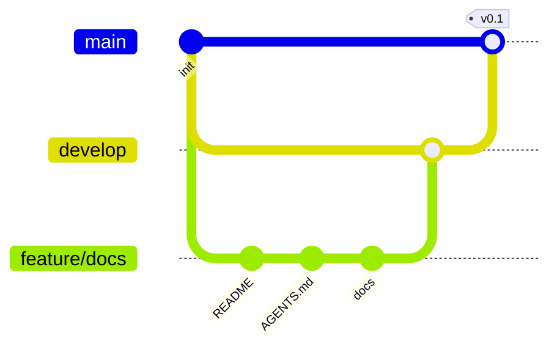
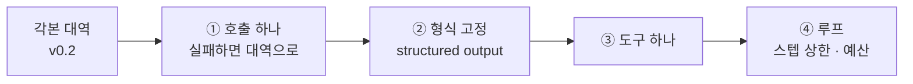
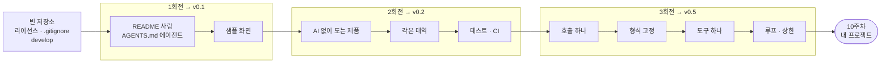

import Slide from 'stack-site-builder/components/Slide.astro';

{/* 슬라이드 작성 규칙은 docs/writing-rules.md의 "슬라이드 규칙"을 따릅니다. */}

<Slide class="cover">

# AI 서비스 엔지니어링: Track A

9주차 · 빈 저장소에서 v0.5까지

*CodeCompose · 2026-09-18*

</Slide>

<Slide class="center">

## 9주 동안 우리는

## 한 번도 빈 저장소에서

## 시작한 적이 없습니다

</Slide>

<Slide>

### 매주 이렇게 시작했습니다
::sub[시작점이 늘 준비되어 있었습니다]

```bash
git clone .../weekNN-....git
cd weekNN-...
docker compose up
```

- 의존성이 선언되어 있었고, 데이터가 들어 있었고, 화면이 떴습니다.
- 덕분에 두 시간 안에 루프와 도구와 하네스를 볼 수 있었습니다.
- 그런데 **그 `v0.1`을 누가 어떤 순서로 만들었는지**는 한 번도 안 봤습니다.

</Slide>

<Slide class="center">

## 다음 주에 마주하는 것은

## 그 v0.1이 아직 없는 상태입니다

**가장 안 배운 구간이 프로젝트의 첫 사흘입니다**

</Slide>

<Slide class="center">

## 오늘 한 문장

**AI를 마지막에 얹는다**

</Slide>

<Slide>

### 순서를 거꾸로 잡으면
::sub[사흘 만에 되는 데모와, 4주 뒤에 멈추는 프로젝트]

| | 모델 호출부터 | AI를 마지막에 |
| --- | --- | --- |
| 3일 뒤 | 뭔가 대답하는 화면이 뜬다 | 화면은 밋밋하다 |
| 키가 없으면 | **아무것도 안 뜬다** | 그대로 돈다 |
| 테스트 | 못 붙인다. 매번 답이 다르다 | 붙는다 |
| "좋아졌나" | 잴 기준이 없다 | v0.2와 비교한다 |
| 4주 뒤 | 배포 단계에서 멈춘다 | 배포로 간다 |

</Slide>

<Slide>

### 오늘 보는 것과 보지 않는 것

| 보는 것 | 보지 않는 것 |
| --- | --- |
| 저장소를 열고 첫 커밋을 넣는 순서 | 새로운 프레임워크 |
| 사람에게 쓰는 문서와 에이전트에게 쓰는 문서 | 특정 소재의 도메인 지식 |
| AI 없이 도는 제품을 먼저 만드는 이유 | 완성품 해부 (그건 레퍼런스 교안) |
| 에이전트를 한 층씩 얹으며 확인하는 법 | 배포 (12주차) |

**오늘 새로 배우는 기술은 없습니다. 순서를 배웁니다.**

</Slide>

<Slide>

### 이번 주는 두 문서입니다
::sub[역할이 다릅니다]

| | 무엇인가 | 언제 |
| --- | --- | --- |
| **라이브 빌드** | 빈 저장소에서 v0.5까지 짓는 순서 | 오늘 함께 |
| 레퍼런스 구현 | 다 자란 제품 하나의 해부 | 막혔을 때 |

- 레퍼런스 쪽은 화면 층(AG-UI·공유 상태·승인 카드)까지 자란 **먼 목표**입니다.
- 오늘 짓는 v0.5는 그 목표의 두 번째 칸쯤입니다.
- 도착지를 봤으니, 이제 출발선을 봅니다.

</Slide>

<Slide>

### 진행 방식: 세 회전, 세 태그


1\~4주차 시연에서 쓰던 **릴리즈 사다리** 그대로입니다.

</Slide>

<Slide>

### 태그 셋이 하는 일

| 태그 | 무엇까지 | 이 상태에서 |
| --- | --- | --- |
| `v0.1` | 문서 · 샘플 UI | 남에게 "무엇을 만들 겁니다"를 보여준다 |
| `v0.2` | AI 없이 도는 기본 기능 + 목 UI | **키 없이 데모가 된다** |
| `v0.5` | 에이전트가 한 자리에 | v0.2와 비교해 좋아진 것을 말한다 |

</Slide>

<Slide>

### 태그를 찍는 이유 셋

- **되돌아갈 지점이 생깁니다.** 3회전에서 망가지면 `v0.2`로 돌아갑니다
- **발표 자료가 저절로 생깁니다.** 14주차에 태그 셋으로 "이렇게 자랐습니다"
- **재현자가 단을 밟아 옵니다.** `git diff v0.2 v0.5` 하나로 전부 보입니다

</Slide>

<Slide>

### 이 시연은 git flow로 갑니다

| 브랜치 | 역할 |
| --- | --- |
| `main` | 배포되는 것만. 직접 커밋하지 않는다 |
| `develop` | 모든 회전이 여기서 갈라지고 여기로 돌아온다 |
| `feature/<이름>` | 회전 하나 |
| `release/<버전>` | 태그를 찍기 전 정리하는 자리 |
| `hotfix/<이름>` | 배포된 것이 고장났을 때만 |

</Slide>

<Slide>

### 혼자 하는 프로젝트인데 왜
::sub[협업이 아니라 되돌리기와 검수 때문입니다]

- **에이전트가 만든 것은 브랜치 위에 쌓입니다.** 마음에 안 들면 브랜치째 버립니다
- **PR 하나가 검수 단위입니다.** 파일을 읽는 대신 diff를 봅니다.
  사람이 하는 일이 작성에서 **판단**으로 옮겨 간 자리입니다
- **`main`이 잠겨 있으면 실수로 배포되지 않습니다.** 12주차 배포는 `main` push가 방아쇠입니다

</Slide>

<Slide>

### 한 회전의 모양



</Slide>

<Slide>

### 커밋 규칙도 그대로

- **커밋하면서 진행합니다.** 지시 하나가 브랜치라면, 커밋은 그 안의 작업 단위
- **한 커밋에는 한 가지 주제만** 담습니다
- 제목은 **영어 명령형 한 줄**. 왜 그랬는지는 본문에

</Slide>

<Slide>

### 소재는 현장에서 고릅니다
::sub[소재를 고르는 일 자체가 10주차 기획의 첫 단계입니다]

| 기준 | 왜 |
| --- | --- |
| **AI를 빼도 제품이 되는가** | 그래야 v0.2가 존재한다 |
| **데이터를 오늘 구할 수 있는가** | 파일 하나로 시작할 수 있어야 한다 |
| **좋아졌는지 잴 수 있는가** | 사람이 눈으로 판정할 수 있어야 한다 |
| **두 시간 안에 한 기능이 끝나는가** | 다섯 기능을 반쯤 만드는 것보다 낫다 |

</Slide>

<Slide>

### 현장 후보 셋

| 후보 | 기본 기능 (AI 없음) | 에이전트가 얹히는 자리 |
| --- | --- | --- |
| 문의 분류기 | 목록을 올리고 사람이 라벨을 단다 | 라벨 초안을 제안한다 |
| 회의록 정리기 | 텍스트를 올리고 문단을 접었다 편다 | 요약과 할 일을 뽑는다 |
| 저장소 훑개 | 파일 목록과 코드를 보여 준다 | 바뀐 부분을 설명한다 |

</Slide>

<Slide class="center">

## 공통점

**AI가 없으면 사람이 손으로 하던 일**

제품은 그 손을 덜어 주는 물건입니다

</Slide>

<Slide>

### 시간 배분
::sub[무게중심은 2회전에 있습니다]

| | 구간 | 분 |
| --- | --- | --- |
| 0단계 | 저장소 개설 | 10 |
| 1회전 | 문서와 샘플 UI, v0.1 | 25 |
| 2회전 | AI 없는 제품과 목 UI, v0.2 | 40 |
| 3회전 | 에이전트 얹기, v0.5 | 35 |
| 마무리 | 10주차로 넘기기 | 10 |

생성은 빠릅니다. 시간은 **무엇을 시킬지 정하는 자리**와 **나온 것을 보는 자리**에 씁니다.

</Slide>

<Slide class="cover">

## 0단계 · 저장소부터

*코드는 아직 한 줄도 없습니다*

</Slide>

<Slide>

### GitHub 먼저입니다
::sub[라이선스와 .gitignore를 개설 화면에서 같이 고릅니다]

```bash
gh repo create <저장소이름> --public --clone \
  --license mit --gitignore Python
cd <저장소이름>
```

`gh`가 없으면 웹에서 만들고 클론해도 같습니다. 명령은 빠를 뿐입니다.

</Slide>

<Slide>

### 개설 화면에서 체크할 셋

| 항목 | 값 | 왜 |
| --- | --- | --- |
| 공개 범위 | **Public** | 포트폴리오로 갑니다. 키를 안 넣는 습관도 여기서 |
| `.gitignore` | 언어에 맞는 것 | `.env`와 가상환경이 첫날부터 막힌다 |
| 라이선스 | MIT 등 | 13주차에 고르려면 늦다 |

저장소 이름은 **소문자와 하이픈**으로. 주소가 되고 폴더가 되고 컨테이너가 됩니다.

</Slide>

<Slide>

### 빈 저장소에 처음 들어가는 것

```plaintext
<저장소이름>/
├── .gitignore
├── LICENSE
└── README.md      # 이름 한 줄
```

여기서 흔한 실수가 **곧바로 `src/`를 만드는 것**입니다.

무엇을 만들지가 문장으로 정해지기 전에 폴더 구조를 잡으면,
그 구조가 나중에 판단을 가둡니다.

</Slide>

<Slide>

### develop을 만들고 main을 잠급니다

```bash
git switch -c develop
git push -u origin develop
gh repo edit --default-branch develop
```

- 클론하면 `develop`에 서 있고, PR을 열면 대상이 `develop`이 됩니다.
- `main`으로 가려면 **의식적으로** 골라야 합니다.
- 보호 규칙은 혼자라면 **직접 push 금지** 하나로 충분합니다.

</Slide>

<Slide class="center">

## 여기까지 10분

## 코드는 한 줄도 없습니다

되돌릴 바닥 · 라이선스 · 잠긴 배포 방아쇠

</Slide>

<Slide class="center">

## 시연 1: 저장소 개설

빈 저장소 · develop · main 잠그기

</Slide>

<Slide class="cover">

## 1회전 · 문서 → v0.1

*코드보다 문서가 먼저입니다*

</Slide>

<Slide>

### 왜 코드보다 문서가 먼저인가

| | 문서가 없으면 | 문서가 있으면 |
| --- | --- | --- |
| 지시할 때 | 매번 전제를 다시 적는다 | "규칙은 AGENTS.md에" 한 줄 |
| 틀릴 때 | 말로 고쳐 준다. 또 틀린다 | 문서를 고친다. 안 틀린다 |
| 구조를 정할 때 | 코드가 먼저 정해 버린다 | 문장이 먼저 정한다 |

</Slide>

<Slide class="center">

## 사람 혼자면 선택입니다

## 에이전트와 같이 지으면

## 순서가 뒤집힙니다

</Slide>

<Slide>

### README는 사람에게, AGENTS.md는 에이전트에게

| | README.md | AGENTS.md |
| --- | --- | --- |
| 독자 | 사람 (심사자·동료·미래의 나) | 코딩 에이전트 |
| 답하는 질문 | **무엇을 왜 만드는가** | **여기서 어떻게 일하는가** |
| 들어가는 것 | 문제·사용자·실행·데이터 출처·라이선스 | 개발 명령, 검증, 커밋·브랜치 규칙 |
| 길어지면 | 읽히지 않는다 | **지켜지지 않는다** |

</Slide>

<Slide>

### AGENTS.md 첫날
::sub[짧을수록 지켜집니다]

```markdown
## 개발 명령
- 실행: `docker compose up`
- 테스트: `pytest`

## 커밋 전 검증
- `pytest`가 통과해야 한다
- 작업 단위마다 커밋한다. 한 커밋에 한 주제

## 규칙
- `develop`에서 `feature/*`로 분기. `main`에 직접 커밋 금지
- 커밋 메시지 제목은 영어 명령형 한 줄
- `.env`와 키는 절대 커밋하지 않는다
- 의존성을 새로 추가하기 전에 물어본다
```

</Slide>

<Slide class="center">

## 마지막 두 줄이

## 실제로 사고를 막습니다

키가 커밋에 섞이는 일과 의존성이 조용히 느는 일은
둘 다 되돌리기가 번거롭습니다

</Slide>

<Slide>

### 개발 문서는 세 장이면 시작됩니다
::sub[더 늘리지 않습니다]

| 문서 | 무엇을 | 왜 첫날에 |
| --- | --- | --- |
| `architecture.md` | 층 그림 하나와 책임. **AI 자리는 비워 둔다** | 2회전에서 그 빈칸을 채웁니다 |
| `git-workflow.md` | 브랜치 모델과 커밋 규칙 | 에이전트가 읽고 브랜치를 만듭니다 |
| `decisions.md` | 정한 것과 정하지 않은 것, 이유 | 10주차 기획 리뷰에서 그대로 씁니다 |

</Slide>

<Slide>

### decisions.md는 한 줄짜리 기록입니다

```markdown
## 2026-09-18
- 데이터는 파일로 시작한다. DB는 규모가 커지면 (아직 아님)
- 화면은 정적 HTML 한 장. 프레임워크는 v0.5 이후에 판단
- AI는 <어디>에 들어간다. 그 자리 외에는 안 쓴다
```

**미룬 결정을 미뤘다고 적어 두면**
나중에 그것이 빚인지 판단인지 구분됩니다.

</Slide>

<Slide>

### 샘플 UI: 화면을 먼저 그립니다
::sub[동작하지 않습니다. 그래도 넣습니다]

| 왜 | |
| --- | --- |
| 기획이 화면에서 굳는다 | 입력과 출력이 그림 한 장에서 정해진다 |
| 남에게 보여줄 것이 생긴다 | 첫날부터 링크 하나로 설명이 끝난다 |
| 2회전의 목표가 명확해진다 | 이 화면이 **진짜로 도는 것**이 v0.2다 |

정적 HTML 한 장이면 충분합니다. 여기서 프레임워크를 고르면 두 시간이 끝납니다.

</Slide>

<Slide>

### 1회전 지시 프롬프트

```plaintext
저장소 문서를 세우자. 코드는 아직 만들지 마.

- README.md: 이 서비스가 누구의 무슨 불편을 더는지 세 문단.
  그 아래에 실행 방법(지금은 "아직 없음"이라고 정직하게),
  데이터 출처, 라이선스
- AGENTS.md: 너에게 주는 규칙. 개발 명령, 커밋 전 검증,
  커밋 메시지 규칙, 브랜치 규칙, 하지 말 것. 30줄을 넘기지 마라
- docs/architecture.md: 층 그림 하나(mermaid)와 층별 책임.
  AI가 들어갈 자리는 "미정"으로 두고 자리만 표시해라
- docs/git-workflow.md: git flow 브랜치 모델과 커밋 규칙
- docs/decisions.md: 오늘 정한 것과 미룬 것을 날짜와 함께
- web/index.html: 동작하지 않는 샘플 화면 한 장.
  입력 자리, 실행 버튼, 결과 자리. 프레임워크 쓰지 마라
- 문서 한 장이 커밋 하나다. 커밋하면서 진행해라
```

</Slide>

<Slide>

### 줄별 의도 ①

- **"코드는 아직 만들지 마"**: 없으면 친절하게 `src/`를 만들어 줍니다.
  구조를 지금 정하지 않는 것이 이 회전의 요점입니다
- **"누구의 무슨 불편"**: 기능 목록이 아니라 문제로 적게 합니다.
  10주차 기획서의 첫 문단이 여기서 나옵니다
- **"정직하게"**: 없는 실행 방법을 그럴듯하게 적으면
  README가 첫날부터 거짓말을 시작합니다

</Slide>

<Slide>

### 줄별 의도 ②

- **"30줄을 넘기지 마라"**: 상한이 없으면 규칙이 길어지고,
  긴 규칙은 지켜지지 않습니다
- **"자리만 표시해라"**: 빈칸을 남기는 지시입니다. 채우라고 하면 채웁니다
- **"프레임워크 쓰지 마라"**: 샘플 UI는 그림입니다.
  여기서 빌드 도구가 들어오면 회전이 끝나지 않습니다

</Slide>

<Slide class="center">

## 시연 2: 문서 생성

무엇이 만들어지는지보다
**무엇을 시키지 않았는지**를 봅니다

</Slide>

<Slide>

### 나온 것을 봅니다
::sub[이 회전에서 볼 것은 문장입니다]

- `git log --oneline`: 문서 한 장이 커밋 하나로 갈라졌는가
- README 첫 문단: **문제가 적혔는가, 기능이 적혔는가.** 기능이면 고칩니다
- AGENTS.md: 줄 수. 넘치면 잘라냅니다
- `architecture.md`: AI 자리가 **비어 있는가**

</Slide>

<Slide>

### 커밋 → PR → 머지 → v0.1

```bash
git push -u origin feature/docs
gh pr create --base develop --title "Set up project docs and a sample screen"
gh pr merge --merge
```

```bash
git switch develop && git pull
git switch -c release/v0.1
git switch main && git merge --no-ff release/v0.1
git tag -a v0.1 -m "Docs, conventions, and a sample screen"
git push origin main --tags
```

</Slide>

<Slide class="center">

## release 브랜치는 건너뛰어도 됩니다

**다만 건너뛰었다는 것을 알고 건너뜁니다**

태그를 준비하는 동안 develop이 계속 흐를 수 있게 하는 자리인데,
혼자일 때는 흐르지 않습니다

</Slide>

<Slide class="cover">

## 2회전 · AI 없는 제품 → v0.2

*오늘 가장 긴 회전입니다*

</Slide>

<Slide class="center">

## AI 서비스 과정에서

## 모델을 한 번도 부르지 않는

## 유일한 회전입니다

</Slide>

<Slide class="center">

## v0.2의 목표

**키가 하나도 없는 사람이 클론해서 띄우면**

**무언가 쓸모 있는 일이 일어난다**

</Slide>

<Slide>

### v0.2에 있는 것과 없는 것

| 있는 것 | 없는 것 |
| --- | --- |
| 데이터를 읽고 화면에 뿌리는 경로 | 모델 호출 |
| 사람이 손으로 하는 핵심 동작 | API 키 |
| 목 UI (버튼이 실제로 동작) | 프롬프트 |
| 테스트와 CI | 에이전트 |

</Slide>

<Slide>

### AI를 뒤로 미루는 이유 넷

- **기준선이 생깁니다.** 손으로 하는 데 몇 번 클릭이 드는지 세어 두면,
  v0.5에서 좋아진 것을 숫자로 말할 수 있습니다
- **키 없이 도는 데모가 남습니다.** 9주차 랩이 키 없이 테스트 65개를
  통과하는 것이 이 구조 덕분입니다
- **테스트가 성립합니다.** 매번 같은 부분을 먼저 만들어야 그 위에 붙습니다
- **모델이 안 될 때 떨어질 자리가 생깁니다.** 요금이 끊겨도 화면은 삽니다

</Slide>

<Slide>

### AI가 들어갈 자리를 표시합니다
::sub[코드를 짜기 전에 함수 하나로 못 박습니다]

```python
# core/assist.py
from typing import Protocol

class Assistant(Protocol):
    """<소재>에서 사람이 손으로 하던 판단 한 가지를 대신한다."""

    def suggest(self, item: Item) -> Suggestion:
        ...
```

이 시그니처가 v0.5까지 갑니다. **안쪽 구현만** 각본 대역에서 진짜 모델로 바뀝니다.

</Slide>

<Slide>

### 자리를 고를 때 따지는 넷

| 질문 | 좋은 자리 | 나쁜 자리 |
| --- | --- | --- |
| 입력이 정해지나 | 화면에 있는 것 하나 | "전체 맥락" |
| 출력을 검사할 수 있나 | 목록 중 하나, 숫자, 짧은 글 | 자유 서술 한 페이지 |
| 틀리면 어떻게 되나 | 사람이 보고 고친다 | 그대로 반영된다 |
| 없으면 막히나 | **안 막힌다** | 이것만 AI다 |

</Slide>

<Slide class="center">

## AI 자리는 하나로 시작합니다

두 군데 이상 뚫으면
v0.5에서 어느 쪽이 값을 했는지 못 가립니다

</Slide>

<Slide>

### 각본 대역: 키 없이 도는 상태
::sub[빈 자리를 NotImplementedError로 두지 않습니다]

```python
# core/assist_scripted.py
class ScriptedAssistant:
    """키 없이 도는 대역. 테스트와 목 UI가 이걸 쓴다."""

    def suggest(self, item: Item) -> Suggestion:
        return Suggestion(label="문의", reason="각본 대역이 낸 값입니다")
```

화면에 **"각본 대역이 낸 값"이라고 적히게** 하는 것이 요령입니다.

</Slide>

<Slide class="center">

## 각본 대역은

## 우리가 쓴 값을 돌려줍니다

그래서 진짜 모델을 붙이기 전까지 덮는 것이 있습니다

</Slide>

<Slide>

### 샘플 UI와 목 UI는 다릅니다

| | v0.1 샘플 UI | v0.2 목 UI |
| --- | --- | --- |
| 버튼 | 눌러도 아무 일 없음 | 서버를 부른다 |
| 데이터 | 하드코딩된 예시 | 실제 파일에서 온다 |
| AI 자리 | 자리만 | 각본 대역이 답한다 |
| 실패 | 없음 | **화면이 말한다** |

</Slide>

<Slide class="center">

## 빈 화면은

## 고장과 구분되지 않습니다

진행 표시와 에러 자리를 지금 만듭니다.
나중에 넣으면 영영 안 넣게 됩니다

</Slide>

<Slide>

### 2회전 지시 프롬프트

```plaintext
AI 없이 도는 제품을 만들자. 모델 호출은 한 줄도 넣지 마.

- <소재>의 핵심 기능 하나를 끝까지 동작시켜라.
  기능을 늘리지 말고 하나를 끝까지
- 데이터는 data/ 아래 파일 하나로. DB는 아직 쓰지 마라
- AI가 들어갈 자리는 Protocol 하나로 선언하고,
  각본 대역 구현을 하나 만들어라. 화면에 "각본 대역" 표시가 뜨게
- 화면은 web/index.html을 목 UI로 키워라.
  버튼이 서버를 부르고, 진행 표시와 에러 자리가 실제로 동작해야 한다
- 테스트: 핵심 경로가 각본 대역으로 키 없이 통과해야 한다.
  GitHub Actions에서도 돌게 워크플로를 한 장 넣어라
- docs/architecture.md의 "미정" 자리를 방금 만든 Protocol로 채워라
- 작업 단위마다 커밋해라. 데이터 읽기 → 핵심 기능 → 화면 → 테스트 순으로
```

</Slide>

<Slide>

### 줄별 의도 ①

- **"모델 호출은 한 줄도"**: 이 줄이 없으면 친절하게 `openai`를 임포트합니다
- **"기능을 늘리지 말고"**: 셋이 반쯤 되는 것보다 하나가 끝까지 도는 편이 낫습니다.
  10주차 MVP 범위 잡기의 예행연습입니다
- **"DB는 아직"**: 파일로 시작하는 것은 게으름이 아니라 판단입니다.
  규모가 근거를 줄 때 옮깁니다

</Slide>

<Slide>

### 줄별 의도 ②

- **"화면에 각본 대역 표시"**: 대역과 진짜를 눈으로 구분하기 위한 장치입니다
- **"키 없이 통과"**: 테스트가 키를 요구하면 CI에서 안 돕니다.
  그러면 테스트는 곧 방치됩니다
- **"architecture.md의 미정 자리를 채워라"**: 문서를 코드와 같은 커밋에서
  갱신하게 합니다. 따로 시키면 안 합니다

</Slide>

<Slide class="center">

## 시연 3: AI 없는 제품

버튼이 끝까지 돌 때까지
그리고 실패했을 때 화면이 말할 때까지

</Slide>

<Slide>

### 여기서 테스트가 생깁니다
::sub[v0.5부터는 같은 입력에 다른 답이 나옵니다]

| 테스트 | 무엇을 지키나 |
| --- | --- |
| 핵심 경로 | 데이터에서 화면까지 가는 길이 살아 있다 |
| 경계 | 빈 입력, 없는 항목, 깨진 파일에서 죽지 않는다 |
| **자리 교체** | 각본 대역을 갈아 끼워도 호출부가 안 바뀐다 |

세 번째가 3회전의 보험입니다. 진짜 모델 끼우기가 **구현 하나 바꿔 끼우기**로 줄어듭니다.

</Slide>

<Slide>

### 볼 자리 → v0.2

| 어디 | 무엇을 |
| --- | --- |
| 화면 | 끝까지 돈다. 실패했을 때 메시지가 뜬다 |
| `core/assist.py` | 시그니처가 하나인가. 둘이면 하나로 줄입니다 |
| 테스트 | 키 없이 통과. CI 뱃지가 초록 |
| `docs/architecture.md` | 미정 자리가 채워졌는가 |
| `git log` | 커밋이 단계별로 갈라졌는가 |

</Slide>

<Slide class="center">

## 지금 저장소는

## AI가 한 줄도 없는데 제품입니다

많은 개인 프로젝트가 12주차에 닿지 못하는 이유는
이 상태를 한 번도 거치지 않아서입니다

</Slide>

<Slide class="cover">

## 3회전 · 에이전트 → v0.5

*한 걸음에 하나씩*

</Slide>

<Slide>

### 구조를 고르지 않습니다
::sub[제일 아래 칸에서 시작해, 막힐 때만 한 칸 올라갑니다]

| 칸 | 무엇 | 언제 올라가나 | 배운 곳 |
| --- | --- | --- | --- |
| 1 | 모델 호출 한 번 | 출발점 | 3주차 |
| 2 | structured output | 답을 코드가 받아써야 한다 | 3주차 |
| 3 | 도구 하나 | 모델이 모르는 것을 찾아와야 한다 | 5주차 |
| 4 | 루프 (ReAct) | 몇 번 부를지 미리 못 정한다 | 6주차 |
| 5 | 그래프 · 멀티 | 분기 · 병렬 · 역할 분리가 있다 | 7주차 |

</Slide>

<Slide class="center">

## 대부분의 개인 프로젝트는

## 2\~3칸에서 멈춥니다

그리고 그것으로 제품이 됩니다

</Slide>

<Slide>

### 탐색은 종이 한 장입니다
::sub[요청 하나를 적고 손으로 따라갑니다]

| 세는 것 | 알려 주는 것 |
| --- | --- |
| 모델을 몇 번 부르나 | 1회면 1\~2칸. 횟수를 못 정하면 4칸 |
| 모델이 모르는 정보가 있나 | 있으면 3칸 |
| 갈림길이 있나 | 조건이 확실하면 코드가 가른다 |
| 되돌릴 수 없는 행동이 있나 | 있으면 하네스가 필수 |

**확실한 것은 코드가 정합니다.** 7주차 라우팅 원칙 그대로입니다.

</Slide>

<Slide>

### 하나씩 올립니다



걸음마다 커밋하고 **화면에서 확인**합니다.

</Slide>

<Slide>

### 걸음마다 넣는 것과 넣지 않는 것

| 걸음 | 넣는 것 | 넣지 않는 것 |
| --- | --- | --- |
| ① | LiteLLM 호출 하나, 실패 시 대역으로 폴백 | 프롬프트 튜닝 |
| ② | 응답 스키마 하나 | 스키마 여러 개 |
| ③ | 데이터를 읽는 도구 하나 | 쓰기 도구 |
| ④ | 스텝 상한과 budget guard | 병렬 |

</Slide>

<Slide class="center">

## ①의 폴백이 안전선입니다

키가 없거나 제공자가 죽으면 v0.2의 동작으로 떨어집니다

**제품이 죽지 않습니다**

</Slide>

<Slide>

### 쓰기 도구를 넣지 않는 이유

- 되돌릴 수 없는 행동을 넣는 순간 **승인 절차가 함께 필요해집니다.**
- 그것은 오늘 회전의 크기를 넘습니다.
- 9주차 레퍼런스의 **승인 카드**가 그 자리입니다.

권한을 좁히는 것이 방어의 본체입니다. 6주차의 문장 그대로입니다.

</Slide>

<Slide>

### 단계마다 무엇을 확인하나
::sub[전부 만들고 마지막에 보면 어디서 틀어졌는지 못 찾습니다]

| 걸음 | 확인 | 틀어지면 |
| --- | --- | --- |
| ① | 화면 표시가 대역에서 실제 모델로 바뀐다 | 여전히 대역이면 키나 분기 문제 |
| ② | 응답이 코드로 그대로 들어간다 | 파싱 에러, 필드 누락 |
| ③ | 도구가 불렸다는 흔적이 로그에 | 모델이 도구를 안 쓰고 지어낸다 |
| ④ | 스텝 수와 비용이 응답에 실린다 | 상한이 안 걸리면 루프가 돈다 |

</Slide>

<Slide class="center">

## 장부에 안 잡히는 호출이

## 하나라도 있으면

## 예산 게이트는 반쪽입니다

</Slide>

<Slide>

### 3회전 지시 프롬프트

```plaintext
각본 대역 자리에 진짜 모델을 넣자. 한 걸음씩, 걸음마다 커밋해라.

1) LiteLLM로 호출 하나. 모델은 환경변수로.
   키가 없거나 호출이 실패하면 각본 대역으로 떨어지게 하고,
   화면에 어느 쪽이 답했는지 표시해라
2) 응답 형식을 Pydantic 스키마로 고정해라.
   core/assist.py의 Suggestion을 그대로 쓴다
3) 도구를 하나 붙여라. data/를 읽는 조회 도구만.
   쓰기·삭제 도구는 만들지 마라
4) 루프를 붙여라. 스텝 상한과 누적 비용 상한을 같이 넣고,
   스텝 수와 비용을 응답에 실어라

- 프롬프트는 prompts/ 아래 파일로 빼라. 코드에 박지 마라
- 각 걸음이 끝나면 테스트가 여전히 통과해야 한다
- 2회전에서 만든 시그니처는 바꾸지 마라. 바꿔야 한다면 먼저 말해라
```

</Slide>

<Slide>

### 줄별 의도

- **"키가 없으면 대역으로"**: 제품이 키에 종속되지 않게 하는 한 줄입니다.
  발표장에서 키가 안 먹는 사고는 실제로 일어납니다
- **"어느 쪽이 답했는지 표시"**: 시연의 클라이맥스를 눈에 보이게 만듭니다
- **"프롬프트는 파일로"**: 코드에 박히면 무엇을 고쳐 무엇이 나아졌는지
  diff로 안 보입니다
- **"시그니처는 바꾸지 마라, 바꿔야 하면 먼저 말해라"**:
  에이전트가 조용히 설계를 바꾸는 것을 막습니다. 그건 사람이 내릴 결정입니다

</Slide>

<Slide class="center">

## 시연 4: 에이전트 얹기

화면의 표시가 **각본 대역에서 진짜 모델로**
바뀌는 순간을 봅니다

</Slide>

<Slide>

### v0.2와의 diff → v0.5

| 늘어난 것 | 늘어나지 않아야 하는 것 |
| --- | --- |
| `core/assist_llm.py`, `prompts/`, 설정 | 화면 코드 (자리를 미리 뚫어 뒀으니까) |
| 의존성 한둘 | 테스트 (대역 경로는 그대로 통과) |
| 스텝 · 비용 표시 | 핵심 기능의 시그니처 |

`git diff v0.2 v0.5`가 곧 **"AI를 얹으면서 무엇이 늘었는가"의 답**입니다.
발표 자료에 그대로 씁니다.

</Slide>

<Slide>

### 왜 v1.0이 아닌가

| 1.0의 조건 | 언제 |
| --- | --- |
| 남의 기계에서 뜬다 (`docker compose up` 한 줄) | 11주차 |
| 실패해도 화면이 말한다 | 11주차 |
| 되돌릴 수 없는 행동에 게이트가 있다 | 기능이 생길 때 |
| **좋아졌는지 재는 기준이 있다** | 12주차 |

마지막 줄이 제일 자주 빠집니다. v0.2라는 기준선을 오늘 만든 이유입니다.

</Slide>

<Slide class="cover">

## 라이브에서 눈여겨볼 것

*실패가 나오면 그대로 봅니다*

</Slide>

<Slide>

### 에이전트가 틀리는 자리
::sub[매번 같은 자리에서 틀립니다]

| 자리 | 증상 | 처방 |
| --- | --- | --- |
| 범위 | 시키지 않은 것까지 만든다 | 지시에 "하지 마라"를 적는다 |
| 구조 | 남의 설계를 조용히 바꾼다 | "바꿔야 하면 먼저 말해라" |
| 의존성 | 라이브러리를 새로 끌어온다 | AGENTS.md에 금지 규칙 |
| 문서 | 코드만 고치고 문서는 그대로 | 같은 지시에 문서 갱신을 함께 |
| 커밋 | 한 커밋에 전부 담는다 | "작업 단위마다 커밋해라" |
| 검증 | 안 돌려 보고 됐다고 한다 | 검증 명령을 AGENTS.md에 박는다 |

</Slide>

<Slide class="center">

## 검증 명령이 문서에 적혀 있으면

## 에이전트가 스스로 돌립니다

1회전에서 AGENTS.md를 만든 값입니다

</Slide>

<Slide>

### 되돌리는 세 가지

```bash
git restore <파일>          # 커밋 전, 이 파일만
git reset --hard HEAD       # 커밋 전, 워킹 트리 전부
git switch develop && git branch -D feature/agent   # 회전째 버린다
```

세 번째를 주저하지 않는 것이 중요합니다.

</Slide>

<Slide class="center">

## 30분치를 버리는 것이

## 어긋난 설계 위에

## 두 시간을 쌓는 것보다 쌉니다

회전을 브랜치로 나눈 이유입니다

</Slide>

<Slide>

### 지시가 길어지면 쪼갭니다
::sub[스무 줄을 넘어가면 대개 회전이 둘입니다]

| 쪼개는 신호 | 어떻게 |
| --- | --- |
| "그리고"가 세 번 넘게 나온다 | 브랜치를 나눈다 |
| 새 개념이 둘 이상 들어온다 | 개념 하나에 회전 하나 |
| 검증 방법이 여러 개다 | 검증 하나에 회전 하나 |

</Slide>

<Slide>

### 이 순서가 막는 흔한 실패 다섯

| 실패 | 어디서 막히나 |
| --- | --- |
| 모델 호출부터 시작해 기준선이 없다 | 2회전 |
| 키가 없으면 화면이 텅 빈다 | 각본 대역 |
| 테스트가 없어 고칠 때마다 무섭다 | v0.2의 테스트 |
| 무엇을 정했는지 기억이 안 난다 | `decisions.md` |
| 되돌아갈 지점이 없다 | 태그 셋 |

</Slide>

<Slide class="cover">

## 내 프로젝트로

*오늘 두 시간이 여러분의 첫 사흘입니다*

</Slide>

<Slide>

### 10주차 첫 사흘

| 날 | 오늘의 어디 | 끝났다는 신호 |
| --- | --- | --- |
| 1일차 | 0단계 + 1회전 | `v0.1`. 링크 하나로 설명이 된다 |
| 2\~3일차 | 2회전 | `v0.2`. **키 없이 도는 제품** |
| 그다음 | 3회전 | `v0.5`. 좋아진 것을 말할 수 있다 |

소재가 정해졌다면 1일차는 반나절입니다.
**소재를 못 고른 채 코드를 시작하는 것이 가장 비쌉니다.**

</Slide>

<Slide>

### 건너뛰어도 되는 것과 아닌 것

| | 건너뛰기 | 왜 |
| --- | --- | --- |
| `release/*` 브랜치 | **된다** | 혼자면 develop이 흐르지 않는다 |
| 샘플 UI | 된다 | 화면이 없는 제품이면 |
| `decisions.md` | 된다 | 다만 기획 리뷰에서 다시 씁니다 |
| **각본 대역** | **안 된다** | 키 없이 도는 상태가 사라진다 |
| **v0.2 기준선** | **안 된다** | 좋아졌다는 말을 증명할 수 없다 |
| **`main` 보호** | **안 된다** | 12주차 배포 방아쇠입니다 |

</Slide>

<Slide>

### 기획 리뷰가 보는 것

| 묻는 것 | 오늘 어디서 나오나 |
| --- | --- |
| 누구의 무슨 불편인가 | README 첫 문단 |
| AI가 없으면 어떻게 하던 일인가 | v0.2 그 자체 |
| AI는 어디에 들어가나 | `core/assist.py`의 시그니처 하나 |
| 데이터는 어디서 오나 | README 데이터 출처 |
| 4주 안에 되나 | 태그 셋의 진행 속도 |

</Slide>

<Slide class="center">

## 기획서를 따로 쓰지 않습니다

**저장소가 기획서가 되게 만듭니다**

</Slide>

<Slide class="cover">

## 마무리

*오늘 밟은 세 단*

</Slide>

<Slide>

### 재현할 때 유의할 점

- **소재를 바꿔도 순서는 그대로입니다.** 바뀌는 것은 데이터와 기능 하나입니다
- **기본 브랜치를 `develop`으로** 바꾸는 것을 잊으면 PR이 자꾸 `main`으로 열립니다
- **첫 커밋에 `.gitignore`가 없으면** 가상환경과 캐시가 이력에 남습니다
- **키는 `.env`에만.** `.env.example`에는 이름만 적고 값은 비웁니다
- **에이전트에게 태그를 찍게 하지 않습니다.** 태그는 사람의 판단입니다
- **v0.2에서 한 번 멈춰 봅니다.** 남에게 보여 주면 3회전이 달라집니다

</Slide>

<Slide class="center">

## 오늘 남는 문장

**AI를 마지막에 얹는다.**

**먼저 AI 없이 도는 제품을 만든다.**

</Slide>

<Slide>

### 이번 주가 남기는 것 ① 순서와 문서

- 다음 주에 마주하는 것은 빈 저장소다. 9주 동안 한 번도 안 본 구간이다
- 저장소 · 라이선스 · `.gitignore` · 기본 브랜치는 **첫 10분에** 끝난다
- README는 사람에게 "무엇을 왜", AGENTS.md는 에이전트에게 "어떻게 일할지"
- AGENTS.md는 짧을수록 지켜진다. 검증 명령을 박아 두면 스스로 돌린다
- 미룬 결정을 미뤘다고 적어 두면 그것이 빚인지 판단인지 구분된다

</Slide>

<Slide>

### 이번 주가 남기는 것 ② v0.2와 v0.5

- 키 없이 도는 상태를 만들어 두면 테스트 · 데모 · 폴백이 전부 거기서 나온다
- AI 자리는 시그니처 하나로 못 박고, **자리는 하나로** 시작한다
- 빈 화면은 고장과 구분되지 않는다. 진행 표시와 에러 자리를 이때 만든다
- 구조는 고르는 것이 아니라 아래에서부터 올라가는 것이다
- 도구는 읽기부터. 되돌릴 수 없는 행동에는 게이트가 함께 와야 한다
- 0.5인 이유는 배포와 평가가 남아 있기 때문이다

</Slide>

<Slide>

### 이번 주가 남기는 것 ③ git flow

- 브랜치 모델은 협업이 아니라 **되돌리기와 검수**를 위해 쓴다
- 회전 하나가 브랜치 하나, 그 안의 작업 단위가 커밋 하나
- 마음에 안 들면 브랜치째 버린다
- 태그는 되돌아갈 지점이고, 발표 자료이고, 재현자의 사다리다

</Slide>

<Slide>

### 한 장으로



</Slide>

<Slide class="center">

## 다음 주

**10주차 · 개인 프로젝트 기획**

가져올 것은 코드가 아니라 **문제 하나**입니다

</Slide>
